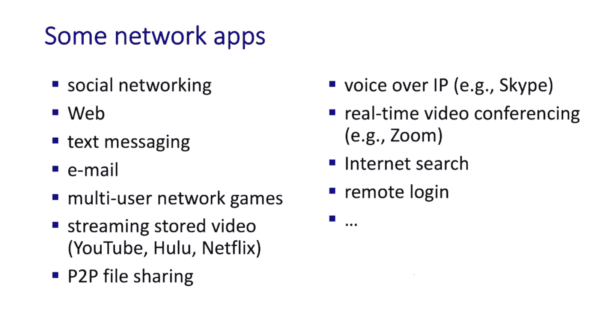

# Jim Kurose《计算机网络：自顶向下的方法｜Computer Networking： A Top-Down Approach》中英（deepseek p08 -08-2.1 Principles of the Application Layer.zh_en -BV1UMtueiEaA_p8-

。Well welcome to the application layer in a top-down approach， the application layer。

 it's really where it all begins， as the French would say it's the raon death one。

 the reason for the existence of the network in the first place。

 the applications that the networks going to support and we'll find that for our studies it's also a really good place to begin will start with applications that we're mostly familiar with in our everyday use of the internet and we'll see that application level protocols like HTTP。

 the Hytext transfer protocol are really very human readable and very natural for us to understand and so the application layer is a great place for us to start our study of networking。

Our goal in this chapter is going to be to learn about both the conceptual and the practical implementation aspects of the network layer。

 We'll start by looking at the services that are provided by the underlying transport protocol right below the application layer because anything the application layer does can only be done by using the services of the transport layer and we'll look at two forms of interaction between the pieces of an application layer application and that is peertopeer interaction and the so-called client server model that's been around a lot longer and of course。

 we'll learn about protocols by looking at popular internet application layer protocols and infrastructure we'll take a look at HTTP。

 the hypertext transfer protocol that operates between a web client and a web server we'll also take a look very quickly at SMTP。

 the simple mail transfer protocol for email will spend some time looking at the domain name system。

N which is used to translate from names like o。cs。um。edu to 32 bit IP addresses like 128。119。40。186。

 and we'll take a look at distributed application level infrastructure like video streaming systems and content distribution networks。

 and we'll wrap up here by looking at the application programming interface， the socket API。

As internet users we all familiar with many， many network applications from social media to the web to messaging。

 email， multiplayer games， streaming audio and video。Teleconferencing applications like Zoom。

 Internet search and remote login。 And what's really interesting to me is that all of these applications。

 maybe except for email and remote login were developed long after the Internet architecture。

 the layers that we learned about in Section 1。7。 the transport layer abstractions that we learn about today were defined。

 That's pretty amazing。 One might say that the Internet designers got it right since the network they invented。

 supports applications they hadn't even dreamed of at the time。

 And I want to play you here a short clip from an interview with Vinturf。

 one of the fathers of the Internet， as we learned in section 1。7。

 that notes that the Internet architects maybe knew a few likely Internet applications。

 but certainly not all of the applications that we've seen。

 He talks about the arrival of new applications about layering she learned about in section 1。

5 about the importance of abstractions and about getting an appropriate stable API。

 all of which will be covering。Here， so I think you'll enjoy this interview。

Did you imagine at the time that it would have the ramifications and implications that we're seeing today。

 you know， the simple answer， of course would be no， but it's not true， that's not not a fair answer。

If you think about this a little bit， first of all， remember that the Arbant Project。

 the predecessor， had already encountered electronic mail， a guy named Ray Tomlinson at BBnN。

 B Barck and Newman。Realized that he could do network electronically mail if he just forwarded the messages through the network and got them to go through the right target machine。

 And then he had to figure out， okay， I get to the right machine。

 How do I tell it which user it is that I am supposed to be sending this message for。

And he needed to separate the machine identity from the user identity。

 and the only character he could find on on the keyboard that wasn't already in use by the operating systems was the at sign。

 And so it's kind of natural user at host。So that's the origin of the@ sign in our email so he he does this and demonstrates it in sort of mid-1971。

 everybody gets excited about this， we all realize what a powerful tool this is it's computer mediated communication。

 we no longer have to both be awake at the same time to communicate so we can overcome time zones and everything else。

And so email was already in place before internet work was even started。

So that's a long way of saying that we actually had some appreciation for what this technology could do。

And we used it to do a lot of the applications that we still use today。

 electronic manual file transfer， remote access to time shared machines。But of course。

 the most significant change after the internet finally gets operational in early '83 and then becomes commercially available in 1989 is Tim Bners Lee's development of the Worldwideide Web。

And to be honest， Tim releases this out of Cern in Geneva。In sort of December of 1991。Nobody notices。

Except for a couple of guys at the National Center for Supercomputer Apps。

 Mark andreesson and Eric Vina。Who say， oh， this is cool。

 Why don't we build a graphical user interface， So they develop the mosaic browser。

 They release this。It makes the internet look like a magazine with formatted text and images and eventually audio。

 video， and things like that。Everybody notices， and so this introduction of this new way of sharing information on that had a profound impact on its accessibility and utility。

What we had achieved is this infrastructure that was infinitely， well， not really。

 but largely expandable。It dropped the barriers to access to computer communication to as close to zero as possible。

 we had given away the design of the internet for free with no patents or any other constraints deliberately。

In order to stimulate adoption and use。So as the general public encounters the worldwide Web。

They have the ability to inject content into the network with very little barrier。And of course。

 to get access to that information， in fact， there was such an avalanche of content that flowed in that we now couldn't find anything and we needed search engines。

 so we got things like Alta Vista and Yahoo and， eventually Google， Bing and so on。

So this this question of did we know what was going to happen， No。

 but there were milestones in the course of the evolution that。

Signalled that this was going to be a big deal。And it was a commercialization in 1989 of the service。

 as opposed to commercialization of the equipment like packetca switches from Cisco systemss or Proteon。

Or others，s it was the commercialization of the service。

And the arrival of the World W Web that really conflated these two things。

Then there's one other thing which I think was equally significant。

 and that's the arrival of the smartphone in 2007 this is Steve Jo and Apple。

 and at that point you see a phenomenon which is very important to understand。

Two technologies that are mutually reinforcing。The mobile phone makes the internet more accessible。

The Internet makes the mobile phone more useful because of all the content and functionality that's on the net。

And so those two things together have really colored the last decade。

Of of the evolution of the Internet and on the products and services that go with it And then the more apps that started appearing for exactly right Yes because we have no。

 we have a platform。 So the interesting thing about all of this is the layering that's going on。

 the Internet is a layered architecture。 TCP IP is this sort of the core layer。

TCP and the other real time protocols are just above that。

 and then there are utility protocols like file transfer。When we get to the Worldide Web。

 it's another layer， the hypertext transport protocol sits on top of TCP。

And then on top of the mobile phones， we get APIs that make it easy for people to build applications。

 even if they have no idea how the mobile telephony part works。

 and it's this isolation of knowledge of necessary knowledge and the stability of the interfaces。

 whether it's a stable protocol interface or a stable API。

 that the longevity and stability of those interfaces allow people to do things without having to know very much at all or anything about how this works underneath。

So you create this opportunity for invention。Without a whole lot of overhead。

Well now imagine that you want to write an application and actually we're going to write some networked applications in just a second so if you want to write a networked application。

 what do you have to do we've seen how complicated the internet is think about all those things going on under the covers from source to a destination Well as it turns out it's really pretty easy to write a networked application because in a way we can abstract away all of that complexity that's happening deep inside the network all we have to do is worry about two things first。

 what are the services provided by the transport layer and secondly。

 what is the API the application layer interface look like to these transport layer services。

Now when we want to build a network application， there are basically two styles of interaction that describe how the pieces of the network application are going to interact with each other。

 the first is the clients server model and the second is the peer to peerer model and since the client server model' has been around the longest and was the first。

 let's take a look at that。In the client server paradigm。 Well。

 there's a server and there's a client， The servers and always on host generally has a permanent IP address so that clients will know where to contact it and a server may be hosted in your home in your company in your university or in commercial data centers On the client side。

 Well， that's what we're more familiar with clients are going to operate by contacting and communicating where a server。

 Client will typically be intermittently connected to the Internet。 for instance。

 when your phone at your laptop is connected to the Internet。

 so they won't have a permanent I address。 And most importantly。

 clients do not communicate with each other instead。

 they're going to interact with servers And the best example of a client server protocol。

 One that will look at in detail is HtTP where the client is the web browser and the server is the web server。

In a peer to peer architecture， there is no server。 Instead。

 what we have are peers in systems that are going to directly communicate with each other。

 They're going to request service from other peers and they're going to provide service in return to other peers。

 we see that in file sharing as an example where a peer may request files from other peers。

 but also serve files out to these other peers。 These peers are going to be intermittently connected to the Internet。

 and they're going to change their I address。 And so with peers coming and going the management of these peers is going to be much more complex than in a client's server environment。

So as we've seen， network applications is going to consist of a set of interacting pieces。

 whether they interact in a client server model or they interact in a peer tope model。

 so it's not going to be a single standalone program that you program。

 compile and run instead it's going to be multiple programs。

 each of which you're going to write and compile and run now when these programs are running。

 they're instantiated as a process so you can think of a process as the executing version of a program now so these processes are going to be communicate if they communicate with each other inside a single computer that's generally referred to as innerproed communication IPC when they're running on separate computers so when they're running on separate hosts and devices。

 they're going to have to communicate using messages and that's what we're going to be interested here so let's see how two processes。

 each on different devices on different hosts。Are going to communicate with each other。

Well we've talked a lot about the client server model and let's get even a little bit more precise with our language when we start talking about building and programming client server applications。

 we're going to refer to the process that initiates communication that is first reaches out to the other side as the client and the process that is contacted as the server。

The application programming interface down to the transport layer uses an abstraction known as a socket。

 process is going to send and receive messages to and from sockets that it creates。

 And you can think of a socket as being analogous to a door。 We create the door。

 We send messages into the door， and we receive messages back out of the door。

The sending and receiving process are going to rely on the underlying infrastructure。

 the transport layer， network layer and link layer to deliver messages from a socket at the sending process to a socket at the receiving process。

 and it's important to note that there are going to be two sockets involve whenever a sender and receiver communicate one on each side of that communication。

Now we can dive down into some of the mechanics of actually using a socket to communicate and the first topic we want to discuss is an addressing。

 so think of it this way when you want to communicate with somebody you need some addressing information if you're sending them a letter。

 you need to know the street address and the town they live in if they live in an apartment building。

 you need the apartment number if you're calling somebody， you need a phone number。

 maybe need a country code and you need a local area code and if they're in a company。

 you also need to know some extension information and it's the same thing with communicating using a socket。

 we need some information about how to address the messages that are going to the other end of the socket endpoint。

When we create a socket， it's going to have two important pieces of information associated with it。

 the first is the IP address of the host and the second is a port number， as we'll see。

 some port numbers are associated with a specific server and a specific protocol， for example。

 establishing a connection to a server on port 80 will connect you to the web server at that server。

 connecting to port 25 will get you to an email server will cover ports in more detail throughout this chapter。

Well， way back in section 1。1， we said that a protocol defines the format。

 the order of messages sent and received among network entities and actions taken on message receipt and transmission。

 so to define an application layer protocol will need to define the types of messages that are exchanged their syntax that is what are the fields in the message and their semantics。

 what are the meanings of these fields， and what actions are taken before and after sending or receiving a message。

 there are two types of protocols， open protocols open in the sense that their message syntax and semantics and actions are all publicly available and known to all internet protocols。

 for example， are specified and publicly available RFcs request for comments in our second assignment。

 you'll actually read an RF Other protocols are proprietary。

 meaning that theyre owned by a company typically and their operation isn't publicly known。

 Zoom and Skype for example。A applications with proprietary application layer protocols。

Well now that we've got a handle on addressing and what an application layer protocol might look like。

 let's turn our attention downward if you will， and let's look at the transport layer and in particular。

 ask ourselves the question， what are the kinds of services that might be provided by the transport layer to the application itself？

Reliable data transfer is a service that's needed by a lot of applications， for example。

 file transfer or web transactions， that is we need to be able to transfer data reliably from one process to another。

 but not all applications need reliable data transfer， packet audio， for example。

 voice and video can actually tolerate some packet loss。Some applications may need timing guarantees。

 Teleelephony and interactive games really require low delay to be effective。

 so a transport layer might provide a delay guarantee from sending process to receiving process。

 Other applications require certain amount of throughput in order to be effective。 For example。

 streaming video needs a certain amount of throughput in order to send the number of bits per second required by the video。

 Other applications， which well call elastic applications are able to make use of whatever throughput they can get。

 And finally， a transport layer might provide security services。 For example。

 encryption on transmitted data。And here are the transport service requirements of some common internet applications。

 you can see the first three file transfer， email and web documents cannot tolerate data loss。

 and they're generally elastic， they can make do with whatever throughput they can get。

 and they're generally not real time time sensitive applications， On the other hand。

 real time audio and video， streaming audio video and interactive games do tend to be a little bit lost tolerant。

 but have much stricter throughput and timing requirements。

The Internet's transport layer only offers two types of services。

 TCP service and UDP service TCP provides reliable data transfer between ascending and a receiving process。

 Also the sender is flow controlled so it won't overflow the amount of available buffers at a receiver。

A TCP sender is also congestion controlled， and TCP is connection oriented。

 meaning that handhaking is required between the client and the server before data actually begins to flow。

 And finally， TCP does not provide any timing guarantees nor does it provide throughput guarantees or security services。

 Well， the second type of transport service provided by the transport layer provides actually even less than TCP。

 UDP service provides unreliable data transfer。 That is there are no guarantees made。

 UDP will make a best effort attempt to deliver data from sended receiver。

 but makes no promises about reliability。 It also doesn't provide flow control congestion control timing throughput or security guarantees。

 So you might ask yourself， why is there a UDP in the first place。

 And the answer to this question that willll see is adopted by a number of application layer protocols。

 is that we can build these additional services that are not provided by UDP。

On top of UDP in the application layer。And here you see the underlying transport services used by popular internet application layer protocols。

 I think it's fair to say that TCP is by far the most widely used transport service， although， again。

 as we'll see， there are good uses for UDP as well。Well。

 let's wrap up our discussion of application layer principles and practice。

 just with a quick note on security， the initial socket abstraction developed in the 1980s had no notions of security associated with it。

 there was no encryption of data that was sent into sockets。

 There was no notion of endpoint authentication proving to the other side that you are who you say you are。

 If you wanted to do that， you actually had to build it up in the application layer itself。

We'll see later that there's a widely used security layer。

 actually it's more like a shim layer known as transport layer security TLS。

 it's implemented in user application space on top of TCP sockets and provides encryption。

 data integrity， and endpoint authentication services that can be used by an application。

Well that wraps up our quick introduction to the principles and practices in the application layer We saw that an application is actually a distributed set of interacting processes that exchange messages we learned about the client server and the peerto peer paradigms for structuring applications we talked about sockets which we saw as the principal internet abstraction for communicating among processes we're going to learn a lot more about sockets。

 we talked about addressing then we talked generally about transport layer services。

 what are the services that a transport layer might provide up to an application and we wrapped up with a quick discussion of security Com up next we're going to start looking at specific application and their application layer protocols we're going to start with the web and the hypertext transfer protocol HTTP。

