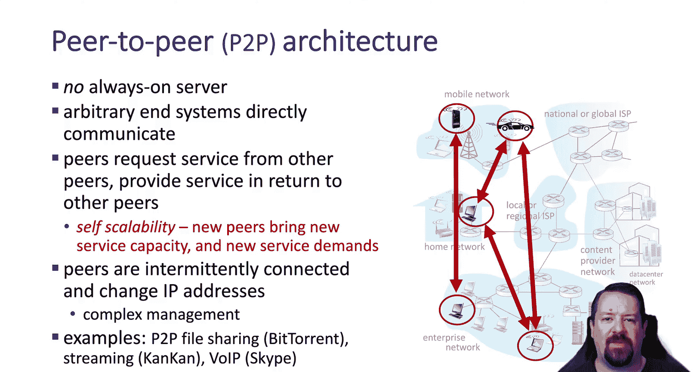
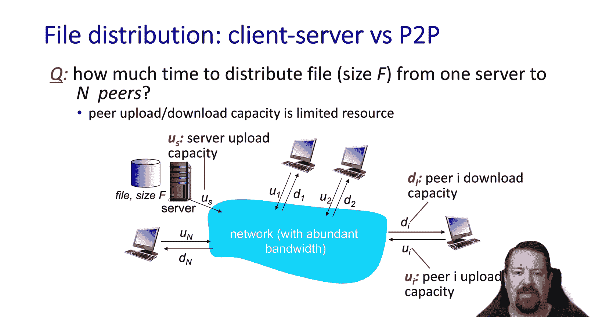
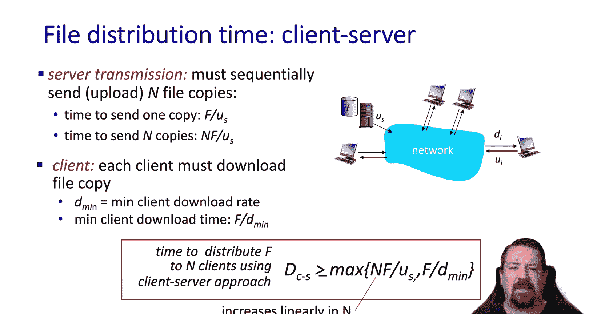
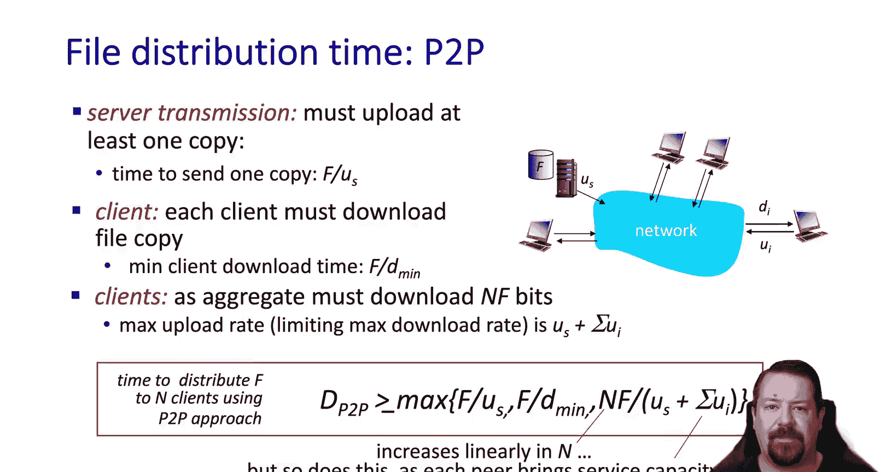
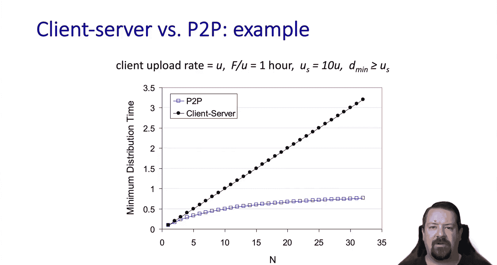
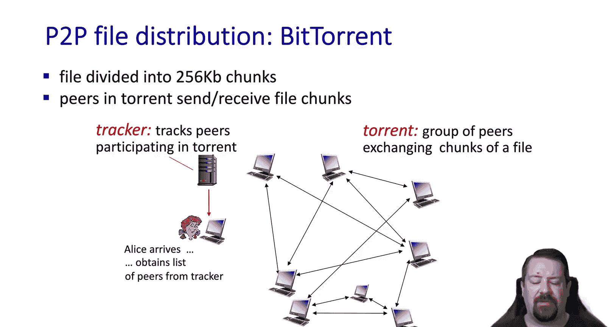
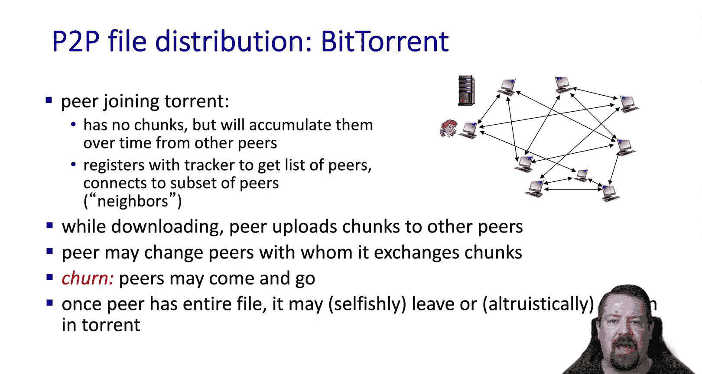
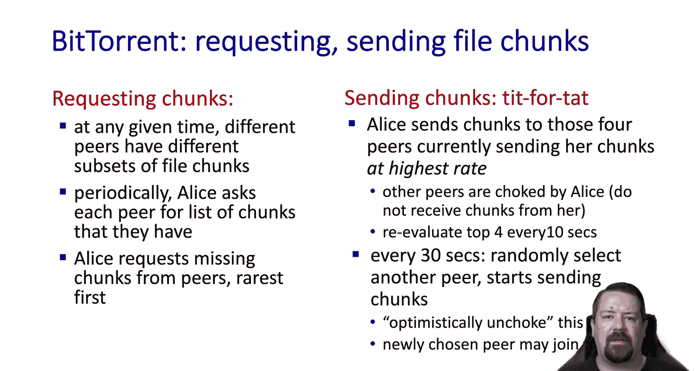
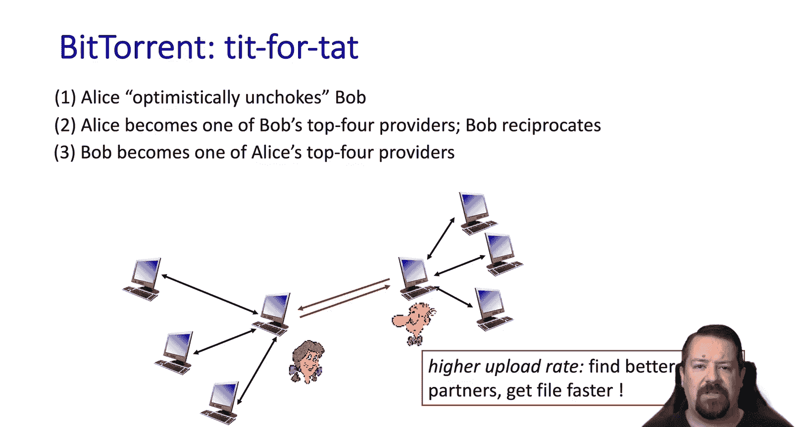
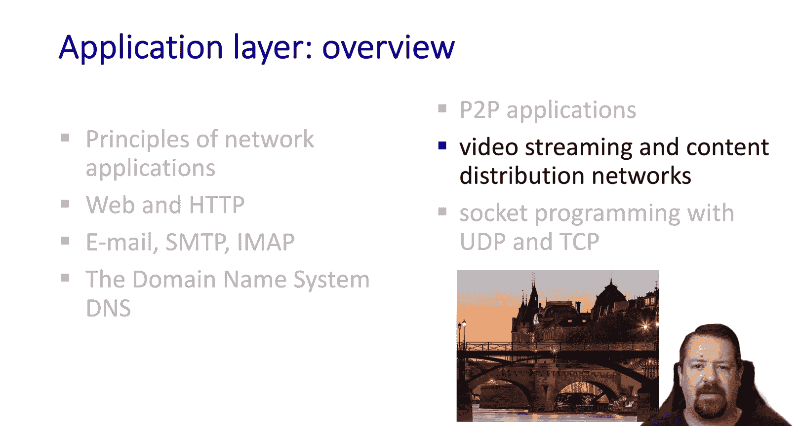

# 计算机网络：自顶向下的方法：12：BitTorrent 与 P2P 网络应用 🧩

在本节课中，我们将学习对等网络应用的基本原理，并以 BitTorrent 为例，探讨其工作机制。我们将从传统客户端-服务器模型与 P2P 模型的对比开始，逐步深入到 BitTorrent 的具体运作细节。

## 概述：P2P 应用与 BitTorrent

对等网络应用的核心特征是不依赖一个持续在线的服务器来监听连接。在这种模型中，任意终端系统可以直接相互通信。对等节点向其他节点请求服务，同时也为其他节点提供服务。P2P 网络的可持续性关键在于，**提供的服务规模至少要与请求的服务规模同步增长**。

P2P 网络的运行面临两大主要挑战：
1.  节点可能随时加入或离开网络，因此特定节点提供的服务会时有时无。
2.  随着时间的推移，节点的 IP 地址很可能会发生变化。

目前最常见的 P2P 应用是 BitTorrent，我们将在后续幻灯片中以其为例进行讲解。首先，让我们通过一些计算来看看 P2P 文件传输的潜在优势。

## 传统客户端-服务器模型 📊

在传统模型中，文件源自服务器，需要分发给多个客户端。这里的限制因素是服务器上传文件和客户端下载文件可用的带宽。

为了让所有客户端都直接从服务器接收文件，服务器必须上传 **n** 份文件副本。我们可以通过以下公式计算完成此任务所需的时间：

**分发时间 ≥ max( n * F / us， F / dmin )**

其中：
*   **n** 是客户端数量。
*   **F** 是文件大小。
*   **us** 是服务器的上传带宽。
*   **dmin** 是最慢客户端的下载带宽。

这个公式假设所有客户端同时发起请求。从可扩展性来看，下载时间会随着客户端数量 **n** 线性增加。

## 对等网络模型 📈

现在让我们看看 P2P 场景。文件仍然从服务器上的一个位置开始。服务器至少需要上传一份完整的文件副本。每个客户端最终也需要获得自己的文件副本。因此，总体来看，所有客户端总共需要 **n * F** 比特的数据。

但在 P2P 模型中，所有客户端的**上传带宽**也将有助于提高文件分发速率。整个文件分发过程的速度不可能快于服务器上传一份副本的速度，也不可能快于最慢客户端下载一份副本的速度。然而，在典型情况下，分子（总数据量）随 **n** 线性增长，但分母（总上传带宽）也随着更多节点加入网络而增加，因为它们会为向其他节点上传文件做出贡献。

## 模型对比 📉

让我们在图表上比较这两种模型。我们看到服务器向终端节点分发文件所需的时间呈线性增长。同时我们也看到，随着更多节点加入 P2P 网络，将文件传输给每个新增节点所增加的时间在减少，边际增量越来越低。这种性能表现远优于线性增长的分发时间。

上一节我们对比了两种模型的性能差异，本节中我们来看看 P2P 原理在实际中是如何运作的。让我们以 BitTorrent 为例。

## BitTorrent 工作机制 ⚙️

作为 BitTorrent 协议的一部分，每个文件被分割成 **256 KB** 的块。这允许节点更快地开始共享文件的片段，而不必等待整个文件传输操作完成。一旦第一个块被上传给一个节点，该节点就可以在下载另一个块的同时开始共享它。

以下是 BitTorrent 中的几个关键术语：
*   **种子**：指正在交换特定文件的一组对等节点。一个给定的节点可以同时参与许多不同的种子。
*   **追踪器**：是一个服务器，用于维护参与特定种子的节点列表。

从以上解释可以看出，BitTorrent 并非纯粹的 P2P 协议，因为它仍然依赖一个持续在线的服务器，即追踪器。如果追踪器失效，协议将无法工作。尽管如此，BitTorrent 已有增强功能，允许其使用分布式追踪器，而非集中在一台服务器上的追踪器。

## 加入与数据交换流程 🔄

让我们梳理一下新节点想要加入一个种子时发生的过程。假设 Alice 想加入一个已经活跃的种子。

首先，她必须联系追踪器，以获取参与此种子的节点列表。这意味着追踪器必须位于一个可预测的位置，否则 Alice 将无法找到它。

一旦她获得了节点列表，Alice 就可以开始交换数据块。起初，Alice 没有任何数据块可以贡献，因此她需要一种方式从其他节点获取一些块。当她拥有一个或多个块后，她就可以开始上传这些块，同时继续下载更多块。

节点加入和离开种子的过程被称为 **节点流失**。网络中发生的流失越多，及时将所有数据块交付给所有节点就越具挑战性。

当一个节点拥有整个文件后，它可能会离开种子。如果它上传的块数尚未至少与其下载的块数一样多，这通常被认为是自私的行为。在下载完所有块后仍留在种子中被称为 **做种**，即为其他节点提供一个额外的、完整的文件副本以供获取块。

## 块选择与激励机制 🎯

随着进程推进，不同的节点将拥有文件的不同数据块。重要的是，在任何给定时间，所有数据块仍然存在于种子中。

每个节点会定期向其连接的邻居询问它们拥有的块列表。Alice 会从她的节点那里请求她尚未拥有的块，**优先请求最稀缺的块**。例如，如果在她所有的节点中，某个特定块只有一个副本，Alice 会首先请求它。一旦她获得了一个副本，那么在同一组节点中，该块就至少有两个副本了。这有助于保护种子，防止出现特定块的唯一副本位于一个决定离开种子的节点上，从而导致其他节点都无法完成下载的情况。

节点对于向哪些节点发送文件块是有选择性的，它们会优先考虑当前发送速率最高的节点。节点会定期重新评估哪些邻居速度最快。这激励了节点如果想要快速下载块，就必须快速上传。

该过程还有另一个组成部分，称为 **乐观解除阻塞**。Alice 会随机选择一个节点，并向其发送一个它正在请求的块。这是引导过程，使得那些没有任何块的节点可以开始下载种子。

## 示例：以牙还牙策略 🤝

让我们看一个“以牙还牙”策略的例子。Bob 正在请求块，但他没有任何块可以上传，或者可能只是没有 Alice 需要的块。无论哪种情况，Alice 随机选择了 Bob 并乐观地解除了对他的阻塞，这意味着她开始发送给他一个他仍然需要的块。

此时，Bob 重新计算他的前四个提供者，而 Alice 是其中之一，因此 Bob 通过发送给 Alice 一个块作为回报。事实证明，Alice 和 Bob 连接良好，因此 Bob 现在也成为了 Alice 的前四个提供者之一，他们都通过更快地获取文件块而受益。这通过让连接良好的节点彼此交换更多块，提高了整个 P2P 网络的效率。

## 总结 📝

本节课中，我们一起学习了对等网络应用的基本原理。我们首先比较了传统的客户端-服务器模型与 P2P 模型在文件分发效率上的差异，了解到 P2P 模型在可扩展性方面更具优势。接着，我们深入探讨了 BitTorrent 这一典型 P2P 应用的工作机制，包括其文件分块、追踪器角色、节点加入与流失、稀缺块优先选择以及“以牙还牙”与“乐观解除阻塞”等核心激励机制。这些机制共同保障了 BitTorrent 网络的高效与健壮运行。