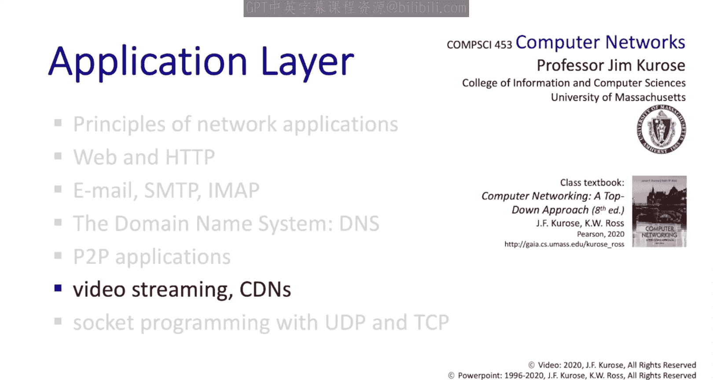

# 计算机网络：自顶向下的方法：2.6：视频流与内容分发网络 📺

在本节中，我们将暂时将焦点从应用层协议上移开，转而关注用于实现服务的应用层分布式基础设施。我们将要研究的服务是**视频流**。这是一个我们熟知、喜爱并可能频繁使用的应用。为了实现视频流服务，存在一些非常复杂的分布式基础设施的绝佳案例，因此有很多值得学习的内容。我们将从视频作为一种应用开始，然后，正如我们所知，互联网可能在发送方和接收方之间引入可变的延迟。因此，我们将探讨客户端技术——**缓冲**和**自适应播放**——以减轻可变互联网延迟的影响。接着，我们将研究一种名为 **DASH**（基于HTTP的动态自适应流）的技术，并了解DASH如何适应源与目的地之间可用容量（带宽）的变化。我们将通过一个例子来了解DASH，并探讨**内容分发网络**以及Netflix作为应用实例。这里有很多内容需要了解和学习，让我们开始吧。

## 视频流概述 📊

视频流流量是互联网带宽的主要消耗者。据估计，**80%** 的住宅ISP流量是视频流流量。当我们思考视频流时，几个挑战显而易见。一如既往，存在**规模**问题。我们希望能够触达数千万甚至数亿用户。第二个挑战是**异构性**。有些用户是移动的，有些是固定的；有些拥有高速宽带连接，而另一些则处于带宽匮乏的连接中。我们将如何应对这种异构性？正如我们将看到的，答案在于一个非常复杂的应用层分布式基础设施。

## 视频的结构与编码 🎞️

让我们从观察视频本身的结构来开始讨论视频流。视频只是一系列编码图像（有时称为**帧**）的序列，通常以每秒24或30帧的速度捕获。每幅图像都是一个像素矩阵。这些像素通常经过编码，以利用图像冗余来减小图像大小，从而减小视频大小。

存在**空间编码**，它利用单幅图像内的冗余。例如，在这幅图像中，与其存储n个重复的紫色天空像素值，不如存储单个像素值“紫色”以及重复次数。这样只需两个值来编码图像的该部分，而不是n个值。这是**帧内编码**。

我们还可以进行**帧间编码**。如果图像在帧之间变化不大或仅略有变化，那么我们可以只发送帧之间的变化，而不是发送整个新帧。

视频编码方法主要有两大类：**恒定比特率视频**和**可变比特率视频**。顾名思义，在恒定比特率视频中，视频随时间变化的编码速率是固定的、恒定的。而在可变比特率编码中，编码速率会随时间变化，因为空间和时间相关性随时间而变化。

这里我们看到一些编码标准，其编码速率范围从MPEG-1的**1.5 Mbps**到MPEG-4（例如，我们录制这些视频所用的格式），其速率可达**10 Mbps**甚至更高。

## 视频流的技术挑战 ⚙️

现在，当我们思考与流式传输存储视频相关的技术挑战时，这里存在两个复杂性来源。

第一个与客户端和服务器之间可用带宽量会随时间变化这一事实有关。家庭网络、接入网络、核心网络、视频服务器集群内的网络或视频服务器系统本身内部都可能发生拥塞。因此，可用带宽量会随时间变化，我们需要能够适应这种变化。

其次，我们已经看到，互联网中源与目的地之间（客户端与服务器之间）的延迟也会随时间变化。它不像电路那样，从源到目的地有固定的延迟和保证的带宽。在分组交换网络中，我们会遇到可变的延迟，因此我们也需要在客户端适应这种情况。

## 流式传输存储视频的三个步骤 🔄

让我们从宏观角度开始，看看流式传输存储视频涉及的三个步骤。首先，视频被录制。其次，视频由服务器发送。最后，第三，视频在客户端播放。我们将在此图的背景下进行说明。在X轴上，时间向前推进。在Y轴上，我们有已录制、已发送或已播放的累积数据量，正如我们将看到的。

在这第一条黑色阶梯曲线中，我们展示了视频被录制的过程。为简单起见，我们假设它是恒定比特率视频。我们看到随着时间的推移，越来越多的视频被录制，累积数据量以恒定速率上升，例如，每次跳跃代表一个新帧的录制数据。

然后，该视频被存储，并最终由服务器在此处传输。在这个例子中，视频以与录制时相同的速率传输。它是一个以5 Mbps录制的MPEG视频，然后以5 Mbps发送。但它可以发送得更快甚至更慢。为简单起见，我们假设它只是以录制速率发送出去。

经过此处显示的一些网络延迟后，视频播放开始在接收端进行，同样以与录制时相同的速率。现在我们明白为什么这被称为**流式视频**了。如果我们看这里的时间点，我们可以看到客户端正在播放第2帧，而服务器正在发送第10帧。

客户端不是在播放前下载整个视频，而是在服务器仍在发送时就开始播放。也就是说，流式传输视频中较晚的帧。您可能想思考一下流式视频相对于先下载整个视频再播放的优势。通过流式传输，客户端可以更早开始播放。如果客户端没有观看整个视频，我们也不会浪费大量带宽传输未被观看的视频部分。

## 客户端播放约束与缓冲 🛡️

现在，在客户端，我们必须处理一个称为**连续播放约束**的限制。这意味着客户端播放的时序必须与视频最初录制时的时序相匹配。所以，您坐在客户端，正在播放视频。每个人都参与其中。是时候播放一段视频了。那段视频最好已经从服务器到达客户端以便播放。如果没有，我们就会看到那个旋转的图标，我们都在某个时候见过。

这里的挑战来源是视频服务器和客户端之间的**可变延迟**。为了减轻这种延迟，我们将使用**缓冲**来吸收部分延迟变化。

还存在其他挑战，例如如何处理客户端操作，如快进和倒带。如果数据包丢失，并且我们通过TCP进行流式传输，它们将被重传，从而导致额外的延迟。因此，我们需要解决的一个基本挑战是**可变网络延迟**。让我们看看这是如何完成的。

## 应对可变网络延迟 📉

让我们再次回到这个图，并再次假设服务器以恒定速率传输恒定比特率视频，如我们之前看到的红色阶梯曲线所示。此图与前一图的区别在于，现在每个视频帧的网络延迟将是可变的。请记住，在前一图中，网络延迟是固定的，黑色阶梯曲线有整齐、均匀的阶梯步长，因为网络延迟被假设为恒定。在这里，步长不再整齐均匀。有时会有更长的水平步长，例如这里和这里，当一帧的网络延迟明显长于前一帧时。有时水平延迟很短，例如这里和这里，当一帧的网络延迟明显短于前一帧时。

由于网络延迟可变，帧不再以匹配播放所需时序的时序被接收。为了适应这种所谓的网络延迟**抖动**，客户端将使用**缓冲区**来平滑延迟，如此处的蓝色播放曲线所示。客户端现在也会在开始播放前等待。然而，一旦播放开始，客户端将以此处蓝色所示的时序播放视频，该时序与原始时序（此处红色所示，以及我们之前图中黑色所示）相匹配。

客户端应该等待多长时间？嗯，这是一个价值百万美元的关键问题。如果初始客户端播放延迟太短，且帧延迟变化很大，一帧可能无法及时到达以供播放。这被称为**饥饿**，并导致我们习惯看到的旋转图标，即视频冻结。如果初始客户端播放延迟太长，那么用户在视频开始播放前必须等待更长时间，而用户讨厌等待。

## 动态自适应流：DASH 🚀

了解了客户端缓冲和播放后，现在让我们将注意力转向客户端和服务器之间可用带宽量变化的挑战。缓冲对于吸收可变延迟非常有效，但是，当客户端和服务器之间存在的可用带宽量不足以支持视频从服务器传输到客户端的速率时，会发生什么？在这种情况下，我们需要另一种解决方案，这就是**DASH**（基于HTTP的动态自适应流）发挥作用的地方。

以下是DASH的工作原理。让我们从服务器端开始。将要流式传输的视频被分成**块**。每个块然后以不同的编码速率、不同的质量级别进行编码，并存储在单独的文件中。较高质量编码的视频块将关联到较大的文件，因此需要更长的时间、更高的带宽才能下载。

这些代表不同编码的不同块将被存储在内容分发网络内的不同节点上。最后，会有一个**清单文件**。清单文件将告诉客户端以特定编码级别获取此块，并指明可以前往的服务器节点（CDN节点）。

在客户端，客户端将执行以下操作。它将定期估计可用的服务器到客户端带宽量，并自问：这条路径能否支持更多流量？我能否以更高的保真度请求下一个块？当客户端需要一个块时，它将查阅清单并一次请求一个视频块，选择根据当前可用带宽估计可持续的**最大编码速率**。它可以在不同时间点选择不同的编码速率，取决于当时的可用带宽量，并且可以选择从哪个服务器请求块。

因此，我们看到在DASH中，智能和控制实际上在客户端一侧。客户端获得信息（列出其选项的清单文件）。然后客户端监控性能，以确定编码速率和它将从中发出下一个请求的CDN节点。这在客户端放置了大量智能。

## 内容分发网络 🌐

那么，让我们退一步，问自己一个基本问题。我们希望如何构建一个能够向潜在数千或数十万同时在线客户端流式传输视频的应用，并且视频可以从一个可能包含数百万视频的目录中选择？有哪些选项可以做到这一点？

我们可能首先想到一个**巨型服务器**。一个拥有所有视频的庞大服务器，它将处理来自所有客户端的所有请求。那么，这样做的问题是什么？嗯，希望这对您来说是显而易见的。它是一个**单点故障**。显然，网络中和视频服务器本身都存在潜在的拥塞可能。最后，视频服务器位置与地球上某些点之间将存在长延迟。简而言之，这种解决方案根本无法扩展。

第二种选择，实践中采用的方法是构建一个大型分布式基础设施，在不同地理分布的站点存储和提供视频块的副本。这是应用层**内容分发网络**的一个例子。该网络中的服务器加载了要提供的内容，清单文件或CDN DNS服务器将把客户端指向其请求的内容。

在实践中，互联网CDN有两种方法。在**深入**方法中，CDN服务器被深入推入互联网边缘的许多接入网络。2015年，一家总部位于剑桥的CDN公司Akamai部署了超过25万台CDN服务器，分布在120多个国家。我补充一点，在2018年，我们Umass的一位教员Ramesh Sitaraman因构建Akamai的内容分发网络而成为获得ACM SIGCOMM网络系统奖的团队成员之一。

第二种方法被称为**带回家**方法。在这种方法中，数量较少但规模较大的服务器集群位于**存在点**，这是我们在学习第1.5节时了解到的。

## CDN流式传输示例：Netflix 🎬

现在，让我们通过一个例子来了解通过CDN流式传输视频的过程。这是一个网络设置。我们看到这里的Netflix中心，以及内容副本（例如，包括《Maddin》的副本）分布在其CDN节点周围。这是我在家，我想观看《Maddin》的某一集。

因此，我的Netflix客户端应用程序向Netflix中心发送请求，说：“嘿，Jim想看这一集。”Netflix中心然后返回一个清单文件，列出视频块及其位置，正如我们之前看到的。我的Netflix客户端应用程序可能随后开始从这个附近的CDN服务器检索视频，执行缓冲和客户端播放，正如我们之前看到的。如果那条路径恰好变得拥塞，我的Netflix客户端可能会选择从这里的这个服务器获取下一个块。

现在，如果您思考Netflix，它不是一个ISP。它是关于内容的，而不是关于网络的，但它利用ISP提供的网络，在应用层通过ISP的网络交付内容。因此，像Netflix这样的服务有时被称为**OTT服务**，因为它是一个构建在互联网基础设施之上的应用层服务。您可能还记得在我们第一堂课上，当我们问自己“什么是互联网”时，我们以两种方式回答了这个问题：我们给出了一个“螺母和螺栓”的答案，描述了互联网的各个部分；但我们也通过说互联网是一个服务基础设施，在其上构建了惊人的应用来回答这个问题。这正是这里看待OTT服务的观点。

## 总结 📝

我希望您觉得本节内容有趣。我们在这里稍微偏离了重点，也许从关注协议转向关注应用结构本身，特别是用于流式传输存储视频的大规模分布式应用层基础设施的案例。我们首先研究了流式视频的特性，然后探讨了客户端的缓冲技术和播放策略，接着我们研究了分块技术，并在那里遇到了基于HTTP的动态自适应流DASH，最后我们快速浏览了内容分发网络，以及通过内容分发网络流式传输存储视频的例子。