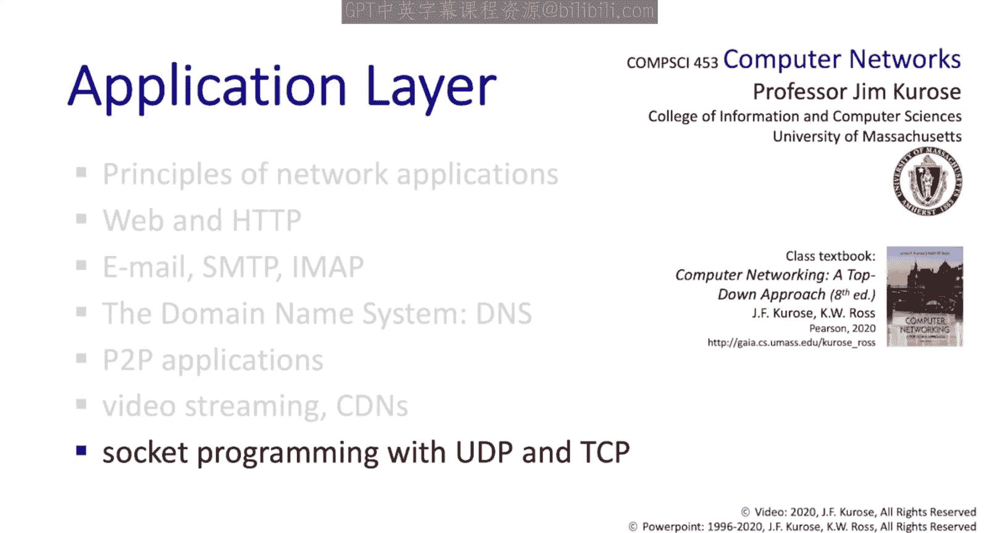
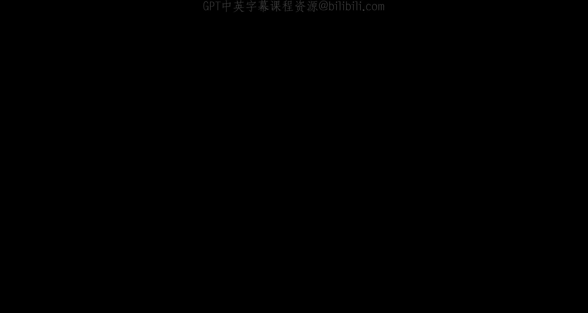

# Jim Kurose《计算机网络：自顶向下的方法｜Computer Networking： A Top-Down Approach》中英（deepseek p14 -14-2.7 Socket programming.zh_en -BV1UMtueiEaA_p14-

In this section we're going to learn about socket programming， Sockets are the API。

 the only API that's available between application layer code and the transport layer services beneath it in the internet architecture。

 we're going to learn about the socket abstraction。

 we're going to learn about programming UDP sockets and TCP sockets and we're going to walk through an example of a client server。

 simple client server application programmed in Python using sockets， so let's get started。

In this section， we're going to learn how to build to program client server applications that communicate over the internet。

 and that means they're going to need to communicate using sockets。

 Sockets are the one and only API that sits between the application layer and the transport layer。

 and if you want to directly access the Internet's transport layer services to send application layer messages from one part of the distributed application to another。

 you're going to need to use sockets。 that's true for all operating systems。

 From an operating system point of view， your application written in user space。

 That's to say outside of the operating system while the transport layer。

 the layers beneath it in the Internet protocol stack are inside the operating system。

 the socket is the interface。 The door between your application layer program the transport layer within the operating system below it。

The Internet Socket API only provides for two types of transport layer services。

 the first offered by TCP provides for reliable congestion controlled。

 flow controlled and bytestream oriented data transfer from one process to another。

 the second which is UDP service offers a datagram oriented unreliable service from one process to another。

In just a second， we're going to program in Python a very simple client server application to see socket programming up close and personal as the saying goes。

 and we'll do it using UDP sockets first and then TCP sockets。 and in this application。

 Here's what's going to happen。 Client's going to read a line of characters data from its keyboard and send that data to the server。

 The server then receives the data and converts the characters to uppercase and then sends that uppercase translation back to the client。

 The client then receives this data from the server and will display it on its screen。 Well。

 it's a silly little application， and you're not going to become a billionaire building applications like this。

 but it will show you how to use sockets in practice。

 Then you can come up with a great idea for an app。

 program it using sockets and become a billionaire。 And if you do。

 remember where you learn socket programming。😊，With UDP service。

 there's no connection between the client and the server。

 That means there's no handhaking involved before the client and server can communicate。

 it also means that when the client is going to send data to the server it's got to include explicitly include the IP address and the port number of the server on the server side when the server receives a datagram it's going to have to extract out the client IP address and the client port number to know who it's talking to with UDP data can be lost and can also be misordered as it travels between client and the server So from an application point of view。

 UDP service is about an unreliable and actually unordered transfer of datagrams from a client to a server。

So now let's look at the sequence of steps taken by the client and the server to create。

 use and then close sockets in that toy application that we discussed earlier。

 And we're going to start with UDP sockets， since they are the easiest in a programming sense。

 So we have the client here on the right and the server here on the left。

 The client and server are going to need to first create the sockets to use。

 Here's a Python code snippet in red on the client side where the client creates a UDP Socket object named client Socket。

Let's take a look at these parameters。 The first parameter。

 AF underscore Inet says that this is going to be an Internet type socket。

 So there used to be actually a lot of underlying network layers around not just the Internet and I when sockets were invented。

 So we need to specify this as an Internet type socket。 And in particular。

 this socket is going to be using the Internet protocol version 4。 Don't worry about this now。

 we're going to get to this in Chapter 4。The second parameter， sock Dgram。

 says that this is a UDP datagram socket rather than a TCP socket。

 and note that we're not specifying the port number here of the client socket when we create it。

 We'll let the operating system do this for us If we wanted to， though。

 we could request a specific port number for the socket using the bind method。On the server side。

 we do the same thing， creating a socket with the name of server socket。Now。

 on the client side we're going to create an application layer message， a string of characters。

 and when we send this message into the socket， we're also going to explicitly need to attach the server's IP address and the server's port number to the message and then pass that information into the client socket socket。

Now you might wonder how do we know the server's IP address and port number Well you sort of just have to the internet doesn't have a directory service where services are say registered by servers and clients could look up that service there are network architectures that have included such a service。

 Noel networks for example， had a really nice directory service。

 but in the internet you just need to know the host name or the IP address and the port number and if you only know the host name that will need to be translated into an IP address via a call to your local DNS server as we saw earlier。

And one quick thing to remember about port numbers。 Some port numbers are standardized。

 as we've seen before。 They are， unquote wellknown port numbers。

 Remember that we've seen some wellknown port numbers already。

 Port 80 for H TTP port 25 for STP port 53 for a DNS server。 Now， returning to this example。

 the datagram sent by the client eventually received by the server and the application layer message read out of server socket。

 The server will also be able to learn the I address and the port number of the sending client。

 The server then formulates a reply message and sends the message into its UP socket called server socket。

 and note that this is the same socket that the server is reading from as well as sending into。

 As in the client case， the server is going to need to include an I address and port number for the destination of this datagram。

 The message eventually reaches the client， the client reads the message from the server and closes the socket。

Now let's dive down even deeper to the next level of detail for this example and look at the client and server code line by line in Python。

 we want to learn how to program sockets and examples are great and this should be conceptually pretty easy since we've covered a lot already。

Our client begins by including Python's Socket module。

 by including this line we'll be able to use all of Python's socket related methods。

We specify the server name and the server's port number here。

 and then we create the UDP socket on the client side， we've walked through this already。

 the client then gets some user input from the screen and uses the send to method to send the application layer message into the client's socket。

You can see here how the server name， actually not its IP address and the server's port number are included in the call to the sendendU method。

 the translation between the server name and the server's IP address is actually done for you inside the sendendu method and of course is going to involve a call to the DNS。

The client then reads a reply back from the server using the receive from method。

Note that the socket being received from client socket specified here。

 and the receive from method returns both the message and the I P address of the sender of this message。

 The client then prints the message and closes a socket with a call to the closed method。 again。

 specifying the socket client socket to be closed。Now。

 let's take a look at the Python code for our UDP server。

 The server like the client first includes Python socket module。

 then creates a UDP socket named Ser Socket using the socket method just as we've seen on the client's side。

 In the server's case， however， the server doesn't want its operating system to assign any old port number to this socket。

 Since the client's going to be contacting the server specifically on serverport 12000。 So here。

 the server uses the bind method to assign port number 12000 to this socket。Now， if port number 12。

000 had been in use by another process， the bind method would have returned an error condition here。

 and I'm embarrassed to say that this code doesn't check for that or any other error condition anywhere but definitely should。

The server then enters a loop reading from the socket using the receive from method that we've seen before on the client side。

 performs its translation to uppercase and then returns a reply via a call to the Su method。

 which we've also seen before on the client side hey that was pretty easy。

TCP sockets are connection oriented and that means that the client and server are going to have to communicate with each other a little bit before data actually begins to flow so the client is going to first contact the server that means the server has to be up and running and has to have already opened a welcoming socket welcoming the client's contact on the client side。

 the client's going to create a socket specifying the server's IP address as well as the server's port number and when that socket is created。

 that's when the magic happens， that's when the client process reaches out to the server process at the TCP level to establish that connection。

Now， the most important thing to remember about TCP sockets is that when a client first contacts the server as part of the TCP handshake。

 the server is going to create a new socket specifically dedicated for communicating with that specific client。

 and I found that students who are seeing TCP sockets for the first time sometimes and actually maybe often confuse the two sockets involved here。

 So think about this carefully。 First， there's the welcoming socket。

 That's the initial point of contact for all clients wanting to communicate with the server on a particular port number。

 say port number 80 for a web server。 and secondly。

 there's the new socket that's created by the server for future communication with that specific client。

Now you might ask yourself what's the port number associated with this new socket and the answer rather confusingly right now is that the new socket has the same port number as that initial welcoming socket will clear this up shortly when we cover multiplexing and demxing at the beginning of chapter3 For now。

 just remember that a new socket is created every time a TCP client first contacts a TCP server and that this new socket is dedicated for communication with that specific client for the duration of that TCP connection this TCP connection serves as a sort of a pipe between the client and the server with the server side of this pipe being this newly created socket and as we've seen that pipe provides reliable in order bystream transfer between client and server processes。

Let's now return to our simple toy client server application and take a look at the interaction between the TCP client and the TCP server。

 as we did with UDP。 Remember that unlike UDP TCP is a connection oriented service。

 this means that before the client server can send application level messages to each other。

 they'll first need to handshake and establish a TCP connection。

 One end of the TCP connection will be attached to the client TCP socket and the other end will be attached to a serverside TCP socket。

 and let's begin on the server side this time， because a server needs to be up and running and waiting for a client's connection request。

The server first creates a socket on which it will wait for an incoming connection request from the TCP client。

 This is the welcoming socket， sometimes called the listening socket。

 It's the socket on which it will wait for their initial client contacts。

 but it's not the socket through which the application level messages will flow between client and server。

So after creating a socket， the server then invokes the accept method on this welcoming socket。

 This is a blocking call。 It'll cause the server to wait until a client reaches out。 Now。

 let's head over to the client side。 The client also creates a TC P socket specifying the server's name and the server's port number to which this socket is going to be connected。

 creating the socket on the client side will cause a TCP connection request message to be sent from the client to the server。

 This connection request message is sent from within the transport layer。

 when the client invokes the socket method。 It's not sent by the application itself。

 This connection request from the client is just what the server has been waiting for。

 and when it's received at the server。 a couple of important things happen。 First。

 a new socketss created at the server and returned to the server side application。

 which returns from the weight it had been doing on the accept call。

 This returned newly created socket called connection socket here in this example。😊。

Is the socket that the server side application will use to communicate with the client side application。

 and secondly， a TCP level message is sent from within the server's operating system again。

 not by the serverside application itself to the client to let the TCP client know that the connections been established We'll look at these TCP messages in detail when we get to Cha 3。

In our application， the client and server then exchange messages pretty much as in the case of the UDP example。

 But let me stress here one last time that the server side application uses this newly created socket created here on return from the accept not the listening socket to communicate with the client。

 The client will communicate with the server using the client side socket it created earlier。

 It's the only socket it's created。Now let's take a look at the Python code for the client side of our application using TCP sockets。

 Our TCP based client again begins by including Python Socket module。

 the server name and server report number specified here。

Then the TCP socket on the client's side created via a call to the socket method。

 note that the arguments to the socket method here specify that this is an IPV4 socket and sock stream indicates that a TCP socket is to be created。

Before sending a message to the server， the T C B based client must first connect to the server by invoking the connect method on the socket。

 specifying the server that's being connected to。On return from the connect method call。

 the connection's been established。 All of that handha beneath the covers has happened。

 and the client can then read in the input from the keyboard and send the input to the client using the send method here。

Note that in this TCP case， there's no need to include information about who the message is going to via the call to the send method。

 Connect's already been established。 and so we know who's on the other side of the connection。

The client then receives the server's reply via the REV method。

 displays the message and exits closing the socket。

Now let's take a look at the Python code for the server side of our application that's using TCP sockets。

With this socket method call here， we're creating an Internet IPV4 sock stream。

 That's to say TCP socket。 We're binding that socket to port 12000 here。

 We then set the socket into listening mode here。 Now we're ready to receive client connection requests。

 and then we enter a loop。 each time through the loop， we' connect to a client， do the work。

 close the connection and loop back again and wait for another client connection request。

The most important line for you to focus on is this one here where we invoke the accept method。

This is where the server will wait within the accept method until a client connects。

 And after return from the accept， a new sockets been created for us by the operating system called connection socket here。

 This new socket is the one that will be using to communicate with the client。 At this point。

 the server now has two sockets， a welcoming socket and a socket that's been created to communicate with this specific client。

After getting the new connection socket， the server reads a line from the client， does its work。

 sends the uppercase sentence back to the client and then closes the connection socket。

 Pay attention to the fact that when the server invokes the send method here。

 it's using the connection socket， not the welcoming socket to communicate with the client。

And that wraps up our discussion of socket programming in this section we learned about the socket abstraction。

 we learned about programming UDP sockets as well as TCP sockets。

 and we even walk through an example of Python code showing a very simple client server application programmed using sockets and our discussion of sockets here also wraps up our overall discussion of the application layer。

Well， our study of the application layer is now complete， and we've learned tremendous amount。

 remember， we started by talking about the two basic ways for structuring applications。

 client server paradigm and the peertope paradigm， Then we talked about the application requirements Are there delay requirements the reliable data transfer requirements。

 Does an application need a certain amount of bandwidth in order to be successful。

 And then we talked about the two types of service that are offered up by the transport layer to applications There's TCP which provides for reliable flowconted congestion controlled and a white stream oriented approach towards transferring data。

 and then there's the UDP service model which provides an unreli and datagram oriented service and we learned about application layer protocol and we studied specific internet application layer protocols including HTTP for the web。

😊，MTP for email， the DNS， the domain name service， which provides a critical internet infrastructure service。

 but does so as an application and we took a quick look at peertopeer and the bit torrance system in particular we then moved on to video streaming looking at an application that has timing considerations associated with it and we looked at CDN's content distribution networks that are massively distributed systems for providing content close to the edge of the network where the users live and finally we looked at socket programming sockets are the API between application code and the transport layer beneath it in the Internet we learned about the socket abstraction and the specifics of programming distributed applications using UDP sockets and TCP sockets。

And perhaps most importantly， we learned about protocols。

 We saw a number of examples of client server protocols where a client reaches out with a request and a server responds back with an answer to the request with data and often with a status code。

 We also looked at the format of protocol messages and saw that every message that we looked at had a header portion。

 which has information about the message itself and the data or the payload part of the message in our study of network applications and application layer protocols。

 we saw a number of important themes arrives cut across all the applications and the application protocols we looked at do applications take centralized or decentralized approaches are applications and protocols stateless or are they stateful and what about the issue of scale。

 How can one operate at an internet scale that has hundreds of millions of interacting endpoints。

Does an application always require reliable data transfer or will unreliable message transfer actually suffice。

 and finally， we saw in a number of cases the notion of pushing complexity to the network edge to the host at the edge of the network and not in the routers and the switches deep within the network。

And that really does wrap up our discussion of the application layer next we're headed down to the transport layer。

 I think you're going to enjoy that。

