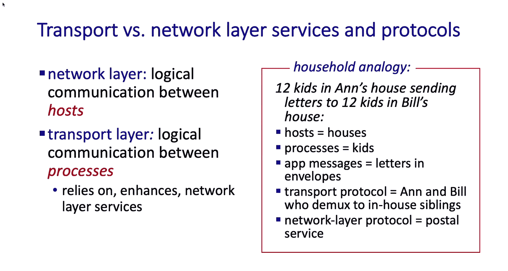
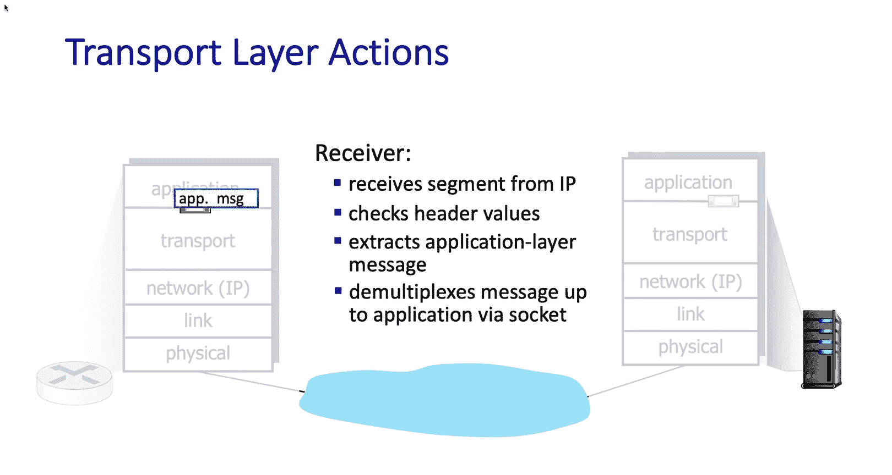
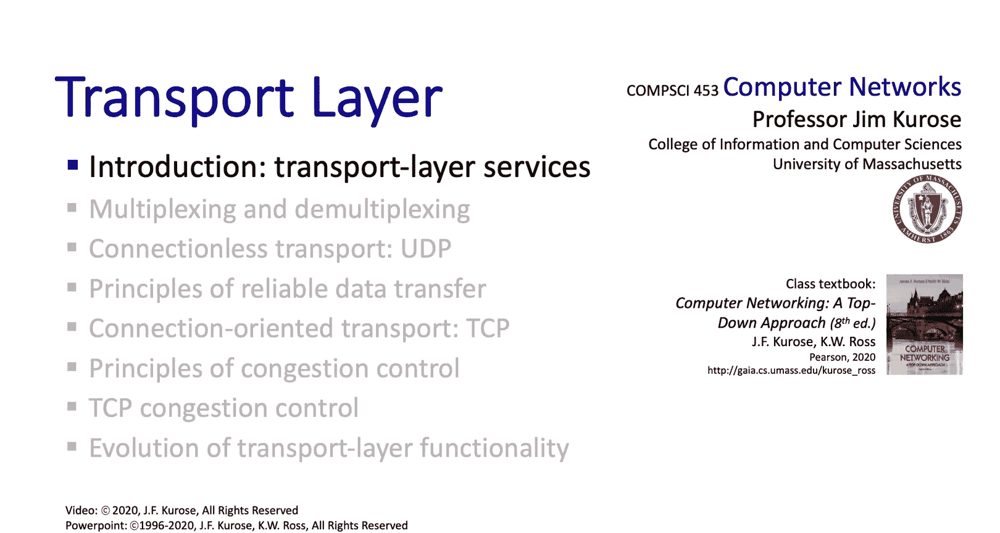

# 计算机网络：自顶向下的方法：3.1：传输层服务简介

在本节课中，我们将开始学习计算机网络体系结构中的传输层。我们将了解传输层提供的核心服务、其基本工作原理，并初步认识互联网中两个主要的传输协议：TCP和UDP。

## 概述

在完成了应用层的学习后，我们现在将深入传输层。传输层是互联网架构的关键组成部分之一。我们将在此探讨几个根本性的重要挑战：如何在可能损坏或丢失消息的信道上实现可靠通信；如何让分布式实体同步共享状态；以及如何让多个通信实体调整其通信速率，以避免某些实体溢出并耗尽网络资源。当然，我们也将研究当今互联网上可用的两个主要传输协议：UDP和TCP。

## 学习方法

我们的方法，一如既往，是从基本原理开始。我们将探讨如何实现**复用**与**解复用**、**可靠数据传输**以及**流量与拥塞控制**。我们将首先研究这些服务实现背后的原理。

在学习了基本原理之后，我们将观察这些原理是如何具体体现在互联网传输协议中的。这里我们将研究两个协议：**UDP**，它在通信进程间提供无连接的、尽力而为的服务；以及**TCP**，它提供可靠的、流量控制的和拥塞控制的、面向连接的传输服务。

## 传输层服务与协议概览

接下来，让我们退一步，从宏观视角审视传输服务与协议。这里有三个要点需要讨论：
1.  运行在不同主机上的应用进程之间的**逻辑通信**概念。
2.  传输协议本身，以及发送方和接收方各自采取的行动。
3.  互联网上可供应用程序使用的两个传输协议：**TCP**和**UDP**。

### 逻辑通信

首先，让我们深入探讨逻辑通信这个概念。从传输层的角度来看，通信的双方——发送方和接收方——在逻辑上是通过一条直接的链路连接在一起的。实际上，主机可能位于地球的两端，被许多不同的网络、路由器和链路分隔。但从逻辑角度看，我们可以想象发送方和接收方是直接相连的。

连接它们的媒介，即它们通信的信道，实际上可能会丢失消息、重排消息顺序或使消息中的比特位发生翻转。但我们将抽象掉位于这两个通信进程之间的一切，只关注连接它们的那个信道的特性，以及它们如何根据该信道的特性来实现服务。

### 进程通信与主机通信的区别

我们讨论了运行在不同主机上的进程之间的逻辑通信。**通信进程**与**通信主机**之间的区别是一个重要的概念，因为它触及了传输层和网络层之间的根本区别以及它们各自提供的服务。

以下是一个可能有用的类比：想象有两栋房子，每栋房子里住着12个孩子。一栋是安妮的房子，另一栋是比尔的房子。我们可以将互联网主机比作房子，而进程就是房子里的孩子。每个主机中运行着许多进程，就像每栋房子里住着许多孩子。

进程之间交换的应用层消息可以看作是装在信封里的信件，这些信封在房子之间传递。现在，想想当一封信到达一栋房子（比如安妮的房子）时会发生什么。安妮必须拿到那封信，并将其递送给她的一个孩子。类似地，当一个数据报到达一台互联网主机时，该主机需要能够将该数据报向上传递给适当的进程，就像安妮将到达的信件分发给她的一个孩子。

网络层协议相当于邮政服务。邮政服务的职责仅仅是在房子之间递送信件。房子内部发生的事情（即把消息分发给正确的孩子）是传输层的职责。将消息从一栋房子送到另一栋房子是邮政服务或网络层的职责。

希望这个类比能清楚地说明网络层和传输层各自的功能区别。这就是我们所说的实体间逻辑通信的含义。

## 传输层发送方与接收方的行动

接下来，让我们看看传输层发送方或接收方采取的行动，然后我们将快速浏览一下UDP和TCP传输协议，稍后我们会深入介绍它们。

让我们通过一个动画来观察发送方和接收方在传输层的行动。首先从发送方开始。

正如我们在第2章学习应用层时所看到的，一切始于一个应用层进程创建一条消息，并将该消息放入套接字。套接字的下层就是传输层。传输层将获取该应用层消息，确定需要在传输层段的某些头部字段中填入什么信息，创建该段，然后将其向下传递给网络层（在互联网中就是IP协议）。网络层（互联网协议）的职责是实际将该IP数据报从发送主机传送到接收主机。

现在让我们看看接收方会发生什么。接收方的传输层将从网络层接收到段。然后，我们需要检查某些头部字段的值（例如，以确保段未被损坏），提取应用层消息，然后将该消息解复用到适当的应用层套接字。

## 互联网传输协议：TCP与UDP

让我们通过快速浏览TCP和UDP协议来结束本节。

**TCP**，即传输控制协议，将在应用层进程之间提供**可靠的、按序的**交付。我们还将看到，这种交付受到**拥塞控制**和**流量控制**的约束。为了实现可靠性、拥塞控制和流量控制，我们需要在发送方和接收方建立连接并维护连接状态，我们稍后将研究这是如何实现的。

另一个互联网传输协议当然是**UDP**，即用户数据报协议。这实际上是一种尽力而为的、朴实无华的协议方法。它提供**不可靠的**交付，消息可能**失序**到达，因此正如我们将看到的，它做的事情不多。

## 互联网未提供的服务

你可能想思考一下，互联网实际上通过这些传输协议**没有**提供哪些类型的服务。例如，没有服务能保证消息从进入套接字到从另一端弹出之间所花费的时间量。对于像电话呼叫这样的交互式语音应用来说，这可能是一种非常有价值的服务类型。

同样，也没有服务能保证发送方和接收方之间的带宽量。例如，流媒体视频可能希望在发送方和接收方之间获得保证的每秒兆比特吞吐量。你可能也会想象，在传输层能够拥有这样的服务可能非常有价值。

但这两类服务实际上都没有由互联网协议提供。你可能想思考一下，为什么这些不是被提供的服务？这是一个有趣的问题，触及了“什么是服务”以及“为了提供有效的通信，我们真正需要的最少服务量是什么”的核心。

## 总结

本节课中，我们一起学习了传输层的基本介绍。我们了解了传输层在互联网架构中的关键作用，区分了逻辑通信与物理通信，并通过类比明确了传输层与网络层的职责划分。我们还初步认识了传输层在发送端和接收端的基本操作流程，并介绍了互联网的两个核心传输协议：提供可靠、面向连接服务的**TCP**，以及提供不可靠、无连接服务的**UDP**。最后，我们思考了当前互联网传输层未提供的服务类型，为后续深入学习传输层原理和协议细节奠定了基础。接下来，我们将开始深入探讨刚才提到的一些基本原理和技术。