# Jim Kurose《计算机网络：自顶向下的方法｜Computer Networking： A Top-Down Approach》中英（deepseek p18 -18-Reliable Data Transfer - Internet Transport Layer -BV1UMtueiEaA_p18-

🎼In this video， we will introduce the principles of building a reliable data transfer protocol。

 such as TCP。 Let's get started。

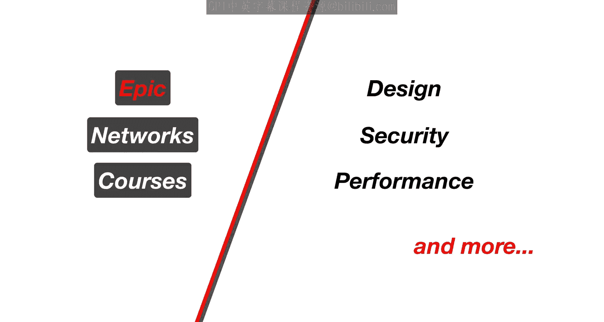

So far we've seen both that reliable data transport protocols exist。

 but also that the underlying network is not reliable In this video we'll talk about how we are able to achieve reliable data transfer on top of an unreliable packet network the service being provided by the reliable transport protocol allows two processes on different hosts to communicate with one another as if they are directly connected However the service is being implemented on top of an unreliable channel leaving the transport protocol to provide the reliability on top of that channel。

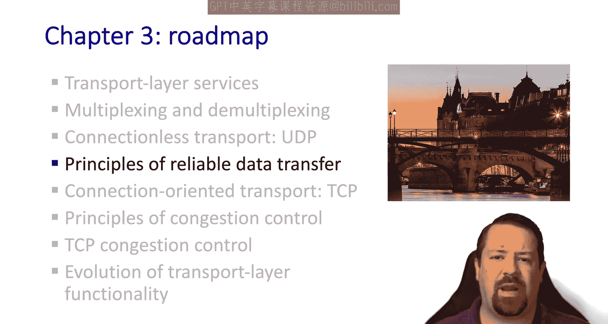

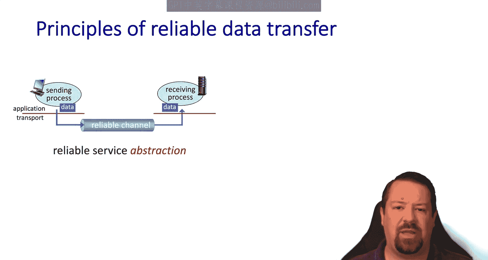

This involves the sender and the receiver exchanging control messages to implement their liability When we say that the underlying channel is unreliable。

 this can take a few different forms， for example， losing data has different implications than corrupting data and there is also the issue of reordering data。

The sender and the receiver will need to communicate some information about their state。

So we could say that the sender and the receiver are blind to another state。

 except for it as exposed via explicit control messaging。 Let's make this a little more formal。

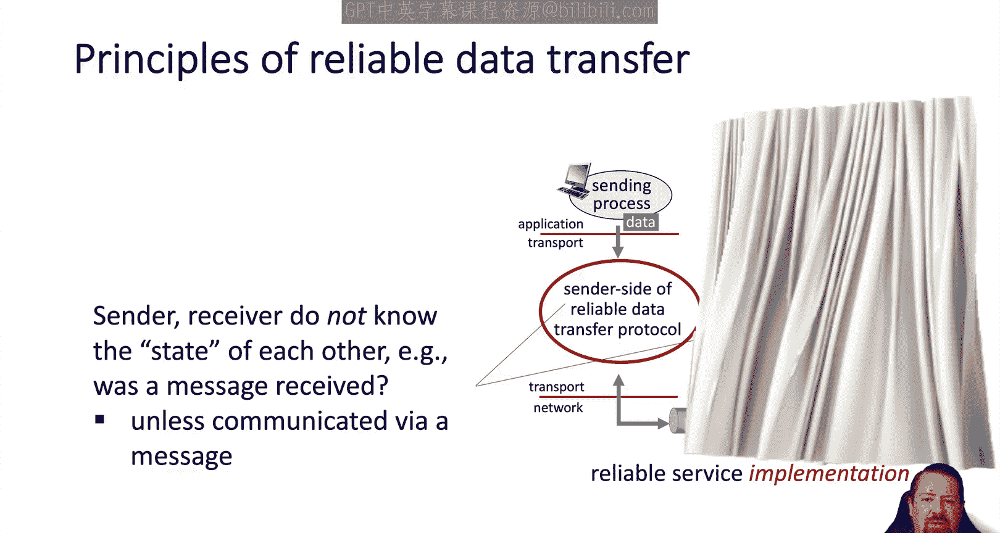

We'll start building up a simple reliable data transfer protocol， and we'll call it RDT for short。

This will expose an RDT send function to the application。

And it will call a UDT send function of the underlying network。On the receiving side。

 the network will hand off data to an RDT receive function。

 and RDT will deliver it via the deliver data function。

On both ends of the connection within the transport protocol。

 there will be an implementation of the reliability functions needed。

So the RDT send function is where the application will pass data to be delivered to the other end of the connection。

And the UDT sendend function is the API exposed by the underlying un reliableable network。

When the underlying network has a packet to be passed to the transport layer on the receiver side。

 it will call the RDT receive function， and when the transport layer is ready to communicate data to the application layer。

 it will call the deliver data function。We also note that our unreliable channel supports bidirectional communication。

 so the messaging can flow in both directions。

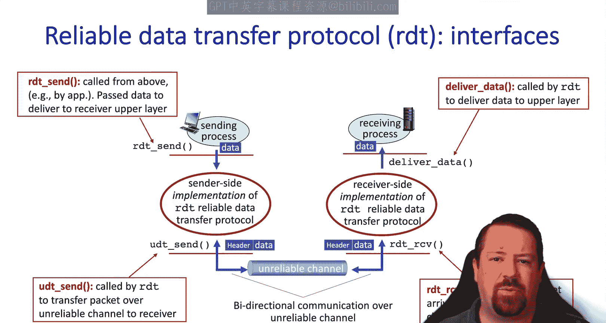

Over the following slides， we will incrementally build up the mechanisms needed to accomplish reliable data transfer。

For simplicity， we will only consider data flowing in one direction。

 so there will be a designated sender and receiver。 However。

 we will need bidirectional communication for the control messaging。To discuss this protocol。

 we will use finite state machines。Each side of the connection will exist in one state at a time。

And when particular events occur， it will transition from one state to another。

These transitions may also involve taking particular actions。

It's also possible for an event to cause the machine to stay in the same state that it's already in。

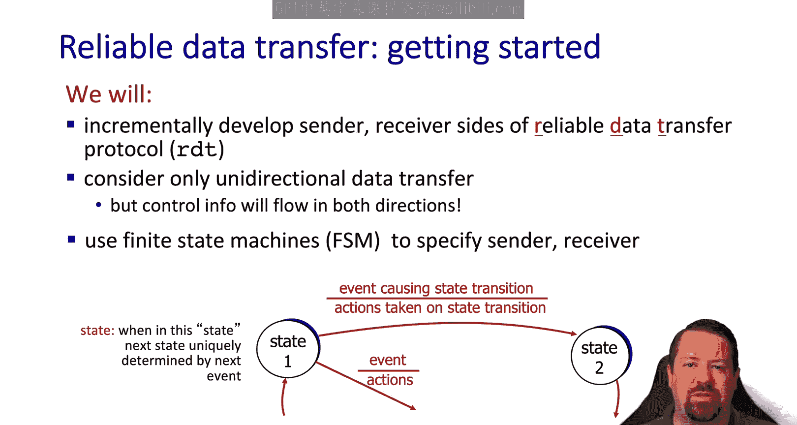

We'll look at the simplest case first， our RDT 1。0 assumes that the underlying channel is reliable。

 so it cannot have packet errors， cannot lose packets， and it will not reorder packets。

So this makes the job of the RDT 1。0 protocol really simple。

We'll see what the finite state machines look like for this very simple transport protocol on the sender side。

 we just wait for the call from above meaning from the application。

 saying that it has some data to send。When the RDT send function is called。

 the transport layer turns the data into a packet and sends it via the underlying channel。

 It then returns to waiting for the application layer to call it again。

On the receiver side we also in a weight state。But in this case。

 we're waiting for a call from the underlying network layer。When the RDT receive function is called。

 we get a packet from the network layer below。Remove the header。

 extract the data and pass it up to the application。

And then return to waiting for another call from the network layer。

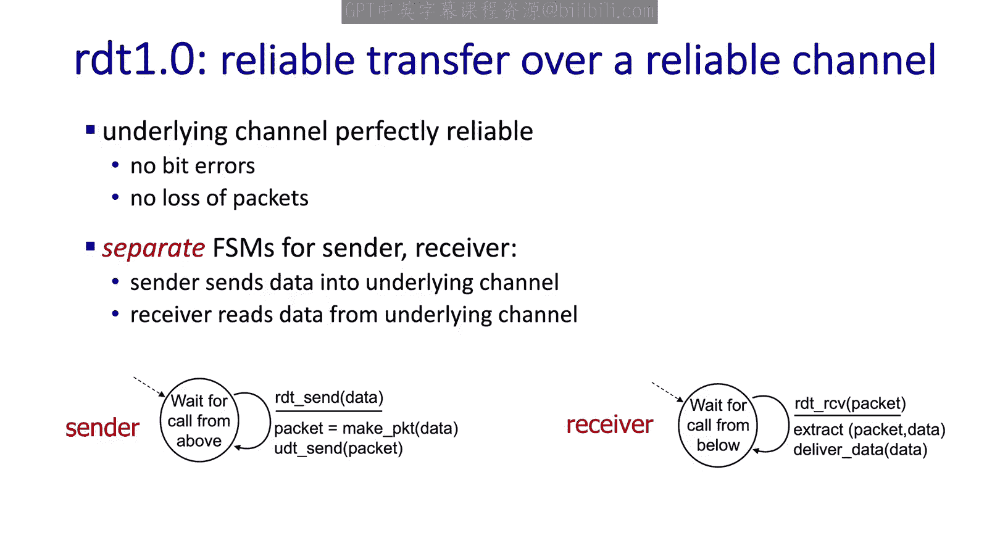

So like we said， the job of the transport protocol in this situation is very simple。

 but we've used it to see this structure that we'll be using where each end of the connection has its own finite state machine。

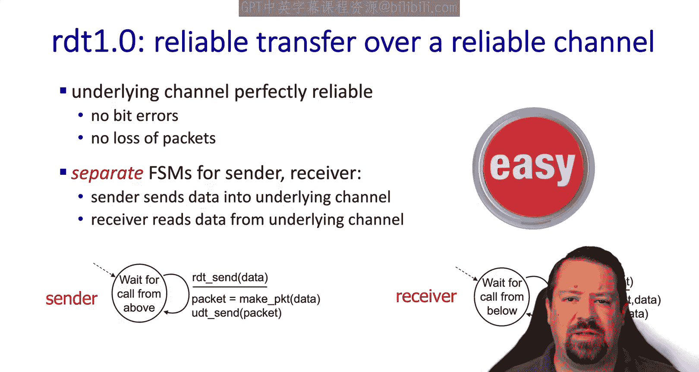

Okay， now we're ready for version 2。In this version。

 the transport layer is going to assume that the underlying network layer may introduce errors into packets。

 but it won't lose or reorder to them。So we've already talked about the internet checkum and how we can use that to detect errors。

In this case， we're assuming that all errors will be detected by the Internet checksum。

 And the question is， when the receiver detects that there's an error， what can it do to recover Now。

 we're introducing a new mechanism， which is acknowledgecknowledgments。

 Our receiver is going to explicitly send a message back to the sender each time it receives a packet that passes the checkum。

We're also going to introduce the negative acknowledgment where the receiver can explicitly tell the sender that a packet was received。

 but it had errors。When the sender receives one of these negative acknowledments or k nas。

 it will retransmit the last packet that is sent。So overall。

 we can describe this protocol as a stop and weight protocol。Each time the sender transmits a packet。

It waits for an acknowledgement before it transmits the next packet。

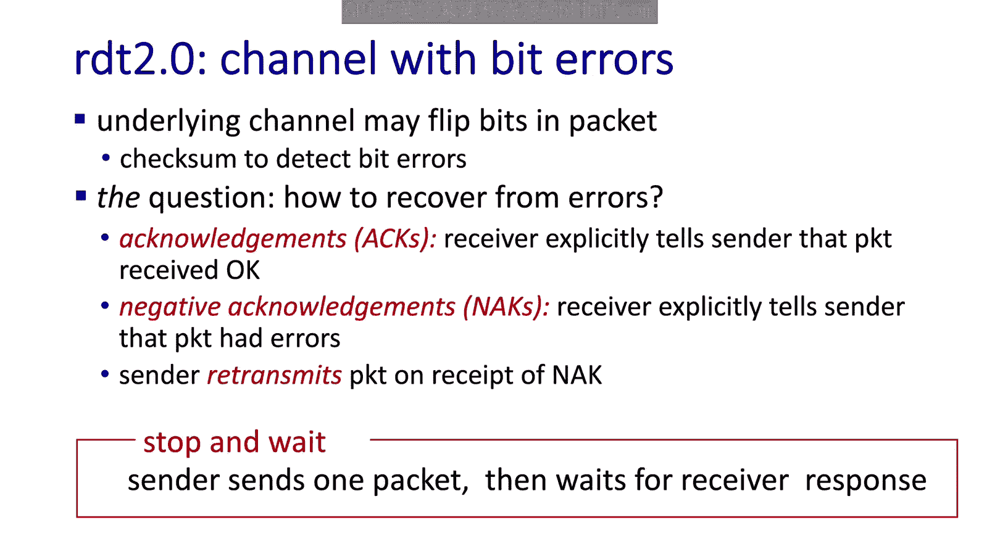

All right， let's describe the finite state machine for this new RDT 2。0 protocol。

The sender now has two states。 One is waiting for the application。

 and the other is waiting for an acknowledgecknowgment。When our send data event occurs。

 the sender makes the packet from the data， adds a check sum this time and sends it over the underlying channel。

 But at the same time， it transitions to waiting for an acknowledgecknowment。

When the acknowment comes back， then the sender can transmit back to waiting for a call from the application。

The thing to note here is that it's much more time consuming to wait for the packet to be sent to the receiver and the acknowledgement to come back than it is to just send the packet out。

So now the senders spending a lot of time waiting on the other end of the connection。

Where before it could spend most of its time just waiting on the application。

 So there's a significant performance implication to using a stop and wait protocol。

There's also one more possible event in our state machine。

 which is that the packet received from the receiver is a aack instead of an aack。 In this case。

 it retransmits the packet and goes back to waiting for an acknowledgecment。On the receiver side。

 the state machine hasn't gotten much more complicated than it was in R D T 1。0。

 The only state is still waiting for a call from below。But we have a new transition。

 which is that when a packet receives and it's corrupt， known by checking the checkum。

 it sends a negative acknowledgecment back。Note that the packet received is discarded and not delivered to the application。

If the packet list received is not corrupt， then a positive acknowledgecment is sent back and the data is delivered to the application。

So there's two possibilities at the receiver side。And the sender can only know which one happened based on the control message that it gets back。

 either an a or an a。So let's walk through the sequences of events when there's no errors。

First we note that the sender initializes to the waiting for data state。

 and the receiver initializes to its only state， waiting for the call from below。

The first possible event in the system is that the application wants to send data。

The transport protocol creates the packet and sends it over to the receiver。

 And like we said in this case， theres no errors。So the receiver will extract the data and send acknowledgement back。

In the case where an error occurs， we start out in the same situation with the sender waiting for the application and the receiver waiting for the network。

The application sends the data。packetack is created and sent over to the receiver。

But this time along the way， it gets corrupted and the checks sum fails。

So now the receiver sends back a negative acledgment。The sender sends the packet again。

 which means that it must have saved the data in order to do so。

 The packet is resent over to the receiver， and this time it's not corrupted and is able to be delivered to the application。

And acknowledged。

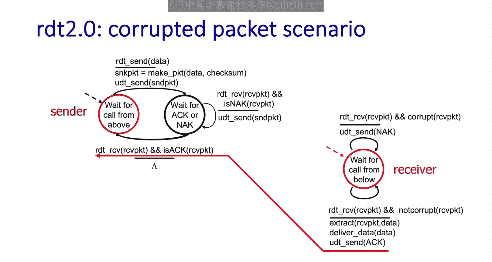

So what are we missing， Well， we already said that the underlying network channel may corrupt packets。

 and these as and knas are also packets， which means they could get corrupted themselves。

 but we haven't handled the case where an a or a k aack doesn't pass checkum。

 So this needs to be explicitly handled by the sender。With the current scenario。

 one possible action is that the sender would just ignore the a or the knack if it came back corrupted。

But this would lead to the case where the sender is waiting for acgment and the process would be stuck。

 no more data could be sent。 On the other hand， if the a ornack are corrupted。

 the default behavior of the sender could be to send the packet over again as if it had received a knack。

 But the problem here is that that could be a duplicate packet。

And the receiver would just accept it and deliver duplicate data to the application。

So we need to add more to the protocol to handle this。

 there's no simple default action that the sender could take to resolve this。In order to do this。

 we're going to add a sequence number。This will allow the receiver to detect if a packet is a duplicate and discard it instead of delivering it to the application。

As we mentioned already， this is still a stop and weight protocol where only one packet can be in transit at a time。

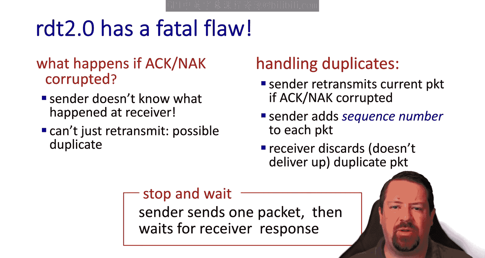

So we'll call the variant of RDT 2。1， which is able to handle corrupted as and acts。

Now we have four states。Where we're either waiting to send packet zero or for the acknowledgecment to packet zero。

Or awaiting to send packet one， or waitinging to receive the acknowledgecledment for packet1。

The transitions are similar to before。But now they specify which sequence number applies。

 so when sending data， we create the packet with sequence number 0。When we receive an acknowledgment。

 we move to waiting to send packet number one。And when sending packet number one。

 we set the sequence number to one in the packet。 and then we go to waiting for the ament for number one。

 Note that the acknowledgments whether as or nas are also going to specify the sequence number of the packet that they apply to。

Finally， when we receive an acknowledgement for packet1。

 we'll return back to waiting to send packet zero。So this is a 1 bit sequence number where that 1 bit can be either 0 or 1。

 We then fill this out with the transitions needed for handling corrupted packets。

 If a naack is received， it will resend the packet and stay in the same state for both naac 0 and naack 1。

On the receiver side， weve now expanded having two states。

 one waiting for packet 0 and one waiting for packet 1。

 We have the transitions where a packet is received as expected， and it's not corrupt。

 and the data can be passed to the application。 and then it moves to the other state。

 So if packet 0 is received， it moves to waiting for packet 1。And vice versa。

 if packetca 1 is received as expected， it moves back to waiting for packetca 0。

Then we have the transitions where the packet is received corrupted。

 in this case it's still expecting packet 1， so it sends a negative acknowledgecment back for packet 1。

And waits for it to be received again。And we also have the case where it's received and not corrupted。

 but it has the wrong sequence number。So in that case。

 we acknowledge it again because clearly the sender didn't know that that packet was already received。

For packet when we have the same， if we get a packet with the wrong sequence number。

 we'll send back an acknowledgement for that packet because clearly the sender hadn't gotten the message before。

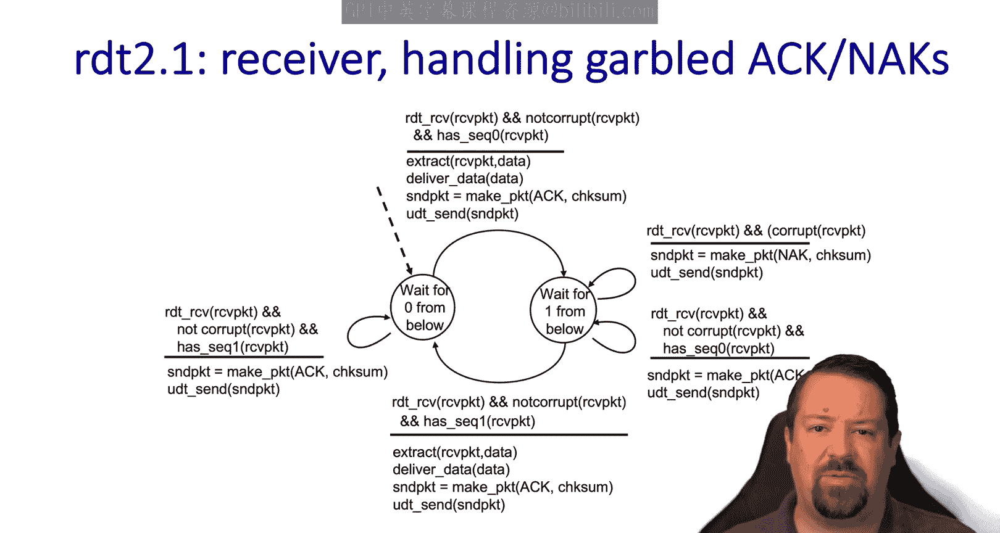

So why do we only need a one bit sequence number？Well。

 that gets back to this being a stop and wait protocol， since there can only be one packet in flight。

 we can just alternate this sequence number back and forth and know whether we got the expected packet or something else。

If we wanted to have more than one packet in flight。

 then we would need a larger sequence number space。 And we'll get to that later on。

Because there are no acknowledgments for the acknowledgments。

 The receiver can't know whether an a or a a was received correctly until it gets the next expected packet。

 If it gets the incorrect sequence number next， then it knows that its last acknowledgment was not received correctly at the sender。

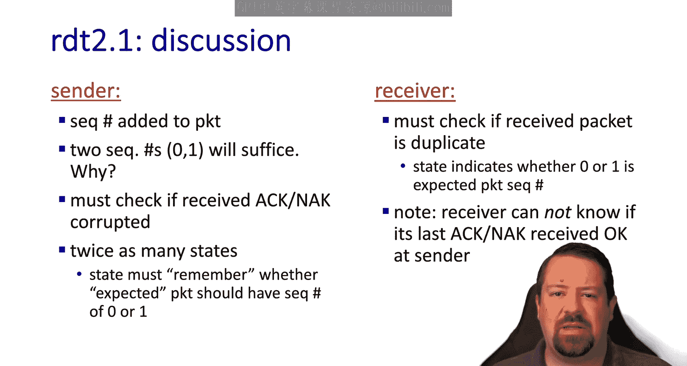

Next， we make a slight modification to RDT2。Now calling it 2。2， we remove NAX。

 so we will have an AC only protocol。So now we'll have the sequence number of the packet being acted in the header of the acknowledgecknowledgment so that there's no ambiguity about which packet is being acknowledged。

In this case， if the receiver gets corrupted packets。

 it will just keep resending the a for the last packet that it got correctly。

So the sender would see duplicate acknowledgments for some earlier packet and go back and resend the next packet after the one received correctly。

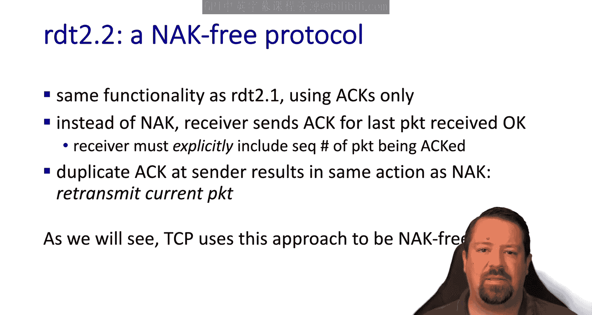

This is similar to the approach that TCP uses。So let's see how that affects the finite state machines。

On the sender side， the changes is that instead of checking to see whether this is an act or an aack。

 it checks to see if it's an act for one or an act for 0。If it's an act。

 but it's not for the packet that's expected， the action is to resend the last packet。

On the receiver side， again， the events are the same。

 and the change is instead of sending nas to send as and specify the sequence numbers。

 So if it's waiting for 0， but gets a corruptt packet， it sends an a for one。

 meaning the previous packet that it got correctly。

 And if it does receive the packet that is expecting， then it sends an a for that packet。

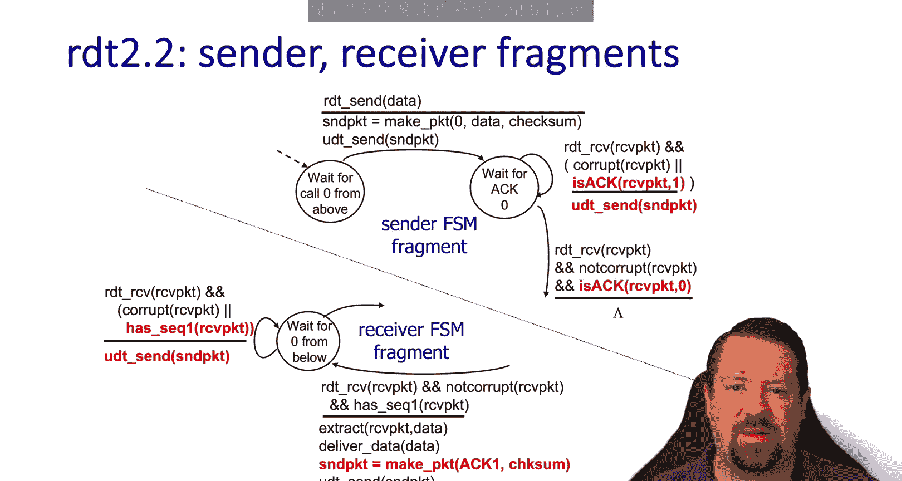

Now we're going to add a major new capability to our RDT protocol in that we're going to handle the case where the underlying channel can both crbed packets and lose them completely。

 so we'll call this RDT 3。0。Note that just like corruption。

 law applies to both data packets and acknowledgments。

 We're going to include all the same mechanisms that we had already， including the check sums。

 the retransmissions and the sequence numbers， but we'll need a bit more。

And the new feature that we're going to add to our RDT protocol is the timeout。

 so the sender will wait a reasonable amount of time for the expected acment。

 but if it never arrives， it will assume that something got lost and take a new action。

This can cause an issue if there is just a delay in the network and not an actual loss in that the retransmission might be a duplicate packet received by the receiver。

 This could also happen if it's the acknowledgment that got lost， not the packet。

 So the receiver could get a duplicate packet。 However。

 we already have sequence numbers in place to handle duplicates。

So this timeout is implemented as a countdown timer that waits a reasonable amount of time after a send event before triggering the packet to be resent。

A little later on， we'll talk about how to determine what a reasonable amount of time would be。

 Of course， if this time is too long， then the sender will be waiting extra time without sending any data。

 causing a decrease in performance。 But if the time is too short。

 then there will be false timeouts too often， causing duplicate packets to be sent and also creating a decrease in performance。

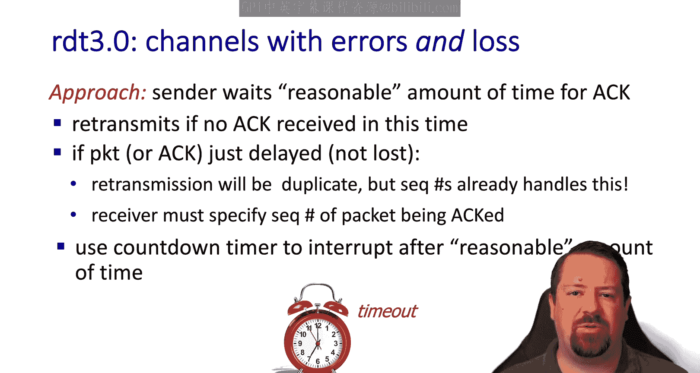

So our RDT 3。0 sender has the same four states as before。

 with two states for packet 0 and two states for packet 1。

It initializes in the state where it's waiting for data to send packet0。The change with 3。

0 is that we now start a timer when performing the send action。If the act comes as expected。

 then we can stop the timer again， when sending packet 1。

 we started timer and when act 1 is received， we stop the timer。However， while waiting for an act。

 we now have a new event， which is the timeout， meaning when the timer expires。In this case。

 we send the packet again and start the timer again。

As before we have the event where a corrupted acknowledgment is received。

 or if we receive an act for the wrong packet。 In this case。

 we don't have to take any action for those。 However， because we can just wait for the time out。Now。

 let's move to a time sequence diagram and look at the flow of messages。 We have packet 0 being sent。

Followed by Act 0， in the case where there is no loss， we can continue sending packet1。

 getting Act 1， then packet at 0， getting Act0， and everything's working as expected。

Let's see what happens when a packet is lost。First， packet 0 is sent and Act 0 comes back。

 But then when packet1 iscent， it gets lost and doesn't arrive at the receiver。 Now。

 for all of these packets that are being sent， the timeout was being set。In this case。

 the timeout expires and it triggers resending packet1。

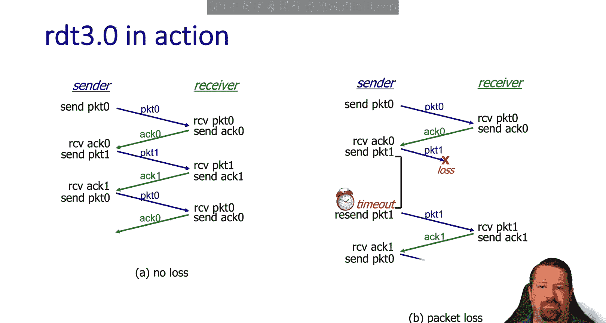

After that， there's no more loss and things continue as expected。

We also have to consider the case where the acknowledgeknowledment is lost instead of the packet。

So we have packet0， a 0。Pack1 arrives， but act1 is lost。 Again。

 we have a timer running on the sendnder。And it times out and causes packet1 to be re transmittedmit。

And things continue as normal。Now let's look at the case where there's a delay instead of a loss。

So a packet zero。Packet1。Ac1 is slow， and the timeout expires before it arrives back at the centerer。

So the sender resends packet one。Which is a duplicate。

 but that's okay because we have sequence numbers to handle it。 A1 eventually arrives at the sender。

 and the sender doesn't know whether this came from the first packet one or the second packet one。

Either way， it received the Act for one So now its consent packet is 0。 Meanwhile。

 it gets a duplicate Act 1 back from the second packet one that's being received at the receiver。

However， the sender was waiting for Act 0， not Act 1， so it takes no action on the duplicatelic Act。

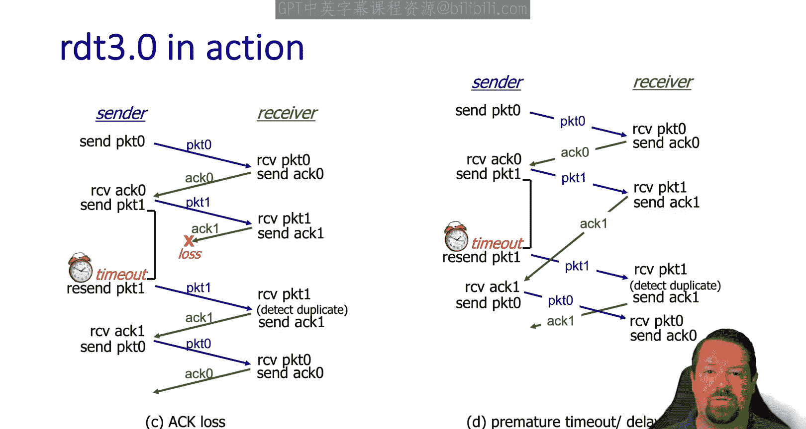

And things returned to normal。We've now built up the basics of a reliable transport protocol and can turn our attention to analyzing its performance。

Let's take a break and start looking at performance in the next video。Zen。

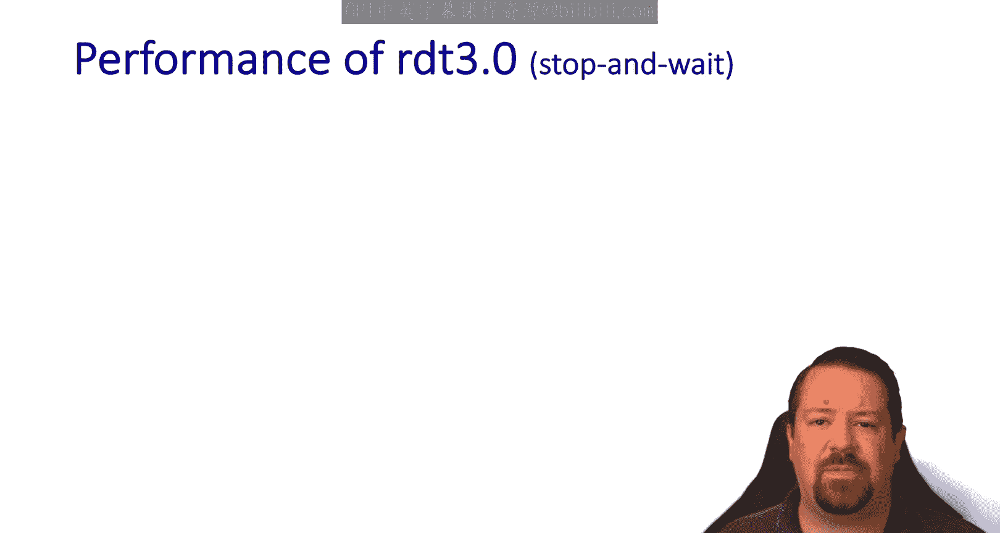

We hope you enjoyed this video， if you found it to be useful。

 please click the like button to be notified when more videos are posted for this class。

 please subscribe to our channel and click the bell。

