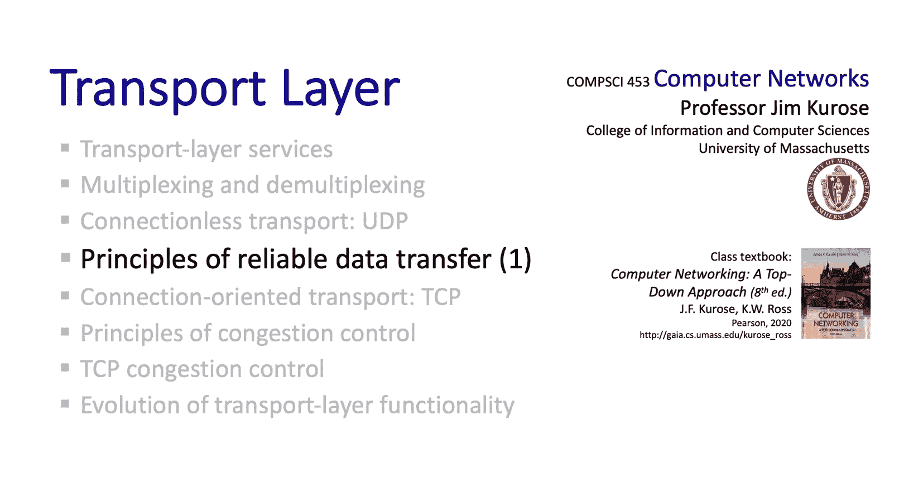
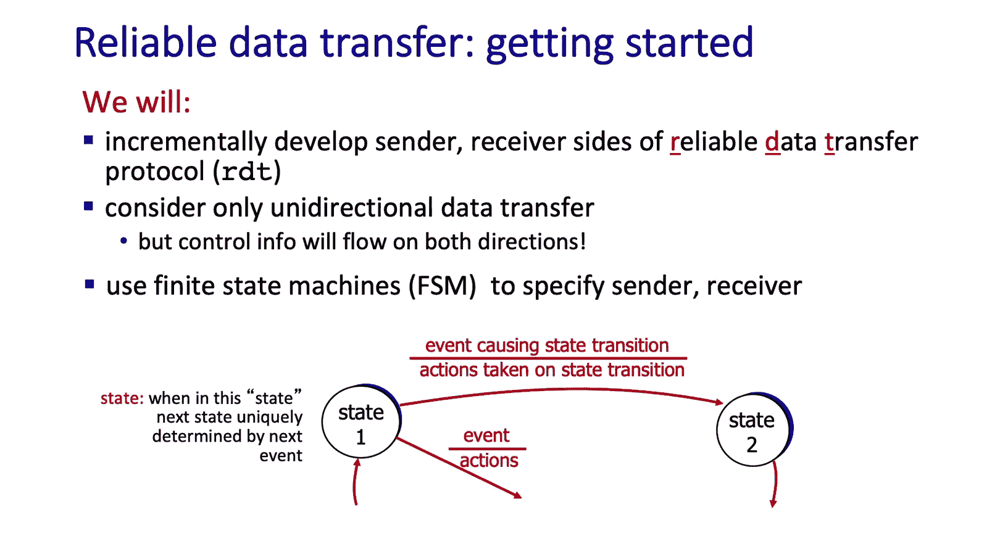
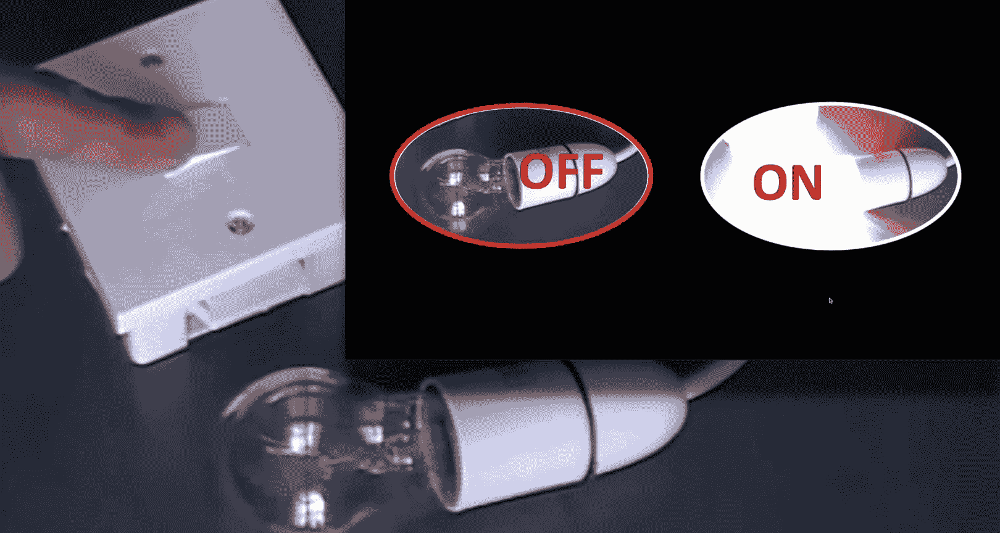
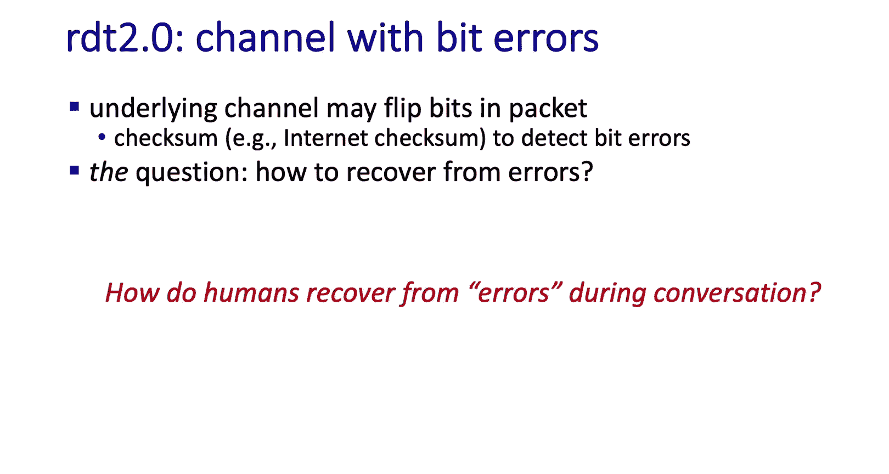
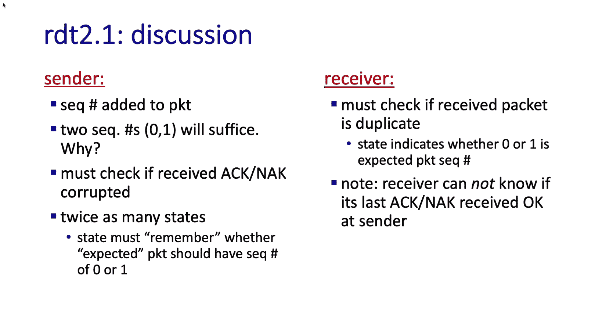
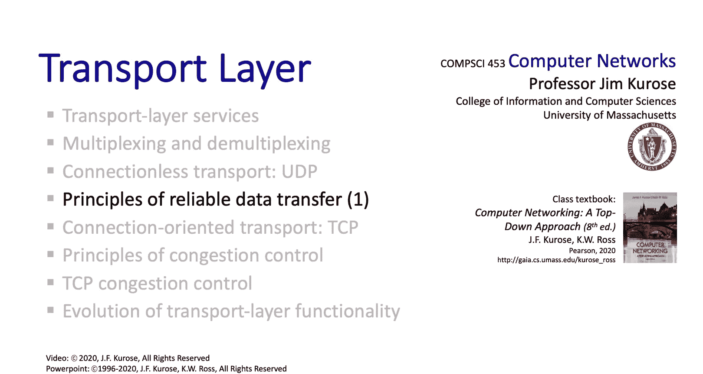

# Jim Kurose《计算机网络：自顶向下的方法｜Computer Networking： A Top-Down Approach》中英（deepseek p19 -19-3.4-1 Principles of Reliable Data Transfer  (Part 1).zh_en -BV1UMtueiEaA_p19-

。

Let's now consider what is one of the really most important challenges in all of networking。

 one of the most fundamental challenges and that is how do two distributed entities reliably communicate over a channel which itself is unreliable that can lose messages that can corrupt or reorder messages Now this is really one of my favorite topics to teach a networking because I think there are a lot of deep ideas here and I think there's also a lot of intuition that we can draw on because we as humans have the need to communicate reliably with each other I think this is a top 10 probably a top five topic in terms of importance in all of networking and here's how we're going to proceed we're going to start with a very simple initial channel model actually a perfect channel model and then we're going to start introducing increasingly realistic assumptions that messages can be lost that bits can be flipped that messages can be reordered and we'll see the kind of protocol mechanisms that we need to。

From these kinds of impairments， I think you're going to really enjoy this section。

 So let's get started。😊，So here's the scenario we're going to consider。

 we have a sending process and a receiving process and the sending process simply wants to send data to the receiving process through a reliable channel and let's note here that the reliable channel is unidirectional we want to be able to reliably send simply from a sender to a receiver that's the abstraction we want to implement。

Now， when we talk about the implementation of this abstraction。

 this is where it gets interesting and as we see here。

 the implementation is going to be in the form of a transport layer protocol There are two sides to that protocol there's a sender side of the reliable data transfer protocol and a receiver side and the sender and receiver sides are going to be communicating with each other over an unreliable channel that we see down on the bottom and notice that message exchanges between the protocol entities is going to be bidirectional the sender side of the transport protocol will send things to the receiver side and the receiver side of the transport protocol will reply back and send things to the sender side of the reliable data transfer protocol so even though at the application layer where implementing unidirectional transfer between the sending and receiving processes within the protocol itself we see that the sender and the receiver are each communicating with each other over a bi-directional。

Unreliable channel。Here are a couple of things to keep in mind as we develop our reliable data transfer protocol。

 First of all， the complexity of the sender and receiver side of the protocol are going to depend very strongly on the characteristics of this unreliable channel。

 Can it lose messages。 Can it corrupt messages。 Can data be reordered within that unreliable channel。

 And here's a point of view to keep in mind。 It's really easy for us as humans to look at the sender and receiver together and to see what's happening to say。

 oh， I see that message was lost。 Therefore， this entity has to take a given action。

 But think about it from the sender's point of view。

 How does the sender know whether or not it's transmitted message over that unreliable channel got through that only happens if the receiver somehow signals back to the sender that。

 in fact， the receiver receive that message。 The key point here is that one side does not know what's going on at the other side or what's going on in the channel。

 It's sort of as if。There was a curtain between them。

 Everything they know about the other side can only be learned through the sending and receiving of messages。

So before starting to develop a protocol， let's look a little bit more closely at the interfaces available to the protocol。

 the API， if you will。This diagram shows the interfaces above and below the transport layer on both the sending and the receiving sides。

 on the sending side that is being passed down from an application layer process to the transport layer。

 the transport layer is then going to add a header together with the data to create a transport layer segment。

 send that over the unreliable channel to the receiver。On the receiving side。

 when a segment does pop out， it will have a header and also a data component to the segment。

The receiving side will then deliver data up to the receiving process at the application layer in such a way that every piece of data sent down from the sending side is delivered exactly once and in order to the receiving process。

So let's get started in developing our reliable data transfer protocol which we'll call RDT for reliable data transfer protocol you know you need a good acronym for a protocol like HTTP or TCP or UDP or IP we'll develop RDT and remember we're going to be looking only at unidirectional transfer here between sender and receiver but control is going to flow in both directions。

Now， if we're going to develop a protocol， we'll need some way to specify what that protocol is。

 how is it that we're going to do that？Well， we could write text。

 but text as we know is subject to misinterpretation and might also be incomplete。

 for example you might write out a textual specification and then think oh yeah。

 actually I forgot about that case What we need here is a more formal way to specify a protocol In fact。

 with a formal specification， we may even be able to prove properties about that specification。

 but that's actually an advanced topic that we won't get into here。

 we'll start here by adopting a fairly simple protocol specification technique known as finite state machines。

And as the name suggests， a central notion of finite state machines is this notion of state。

Well， this notion of state might seem really pretty simple and pretty intuitive， but in fact。

 it's pretty hard to define precisely what do we really mean when we say an RDT sender is in a given state or a receiver is in a given state maybe some real world analogies might help here。

 we might think about a link being in a transting state or in an idle state。

 we might think of a light bulb being in an onstate or an offstate but even after we've mastered this notion of state we're also going to have to think about this notion of there being transitions between states and those transitions happening because of an event that takes place and we're also going to have to think about actions that are taken by the system Well。

 before heading into networking， why don't we take a simple example。

 let's say of the light bulb and see if that can really help us drive home this notion of state。

 the notion of events and the notion of actions。So in the case of the light bulb。

 there are two states on and off， the events are to press the on side of the switch or press the off side of the switch。

 and these events cause transitions between the on and off states。

When the light is in the off state and the on switch is pressed。

 the state of the light bulb transitions to the on state and emits a light。

When the bulb is in the on state and the off switch is pressed。

 it goes to the off state and the light stops。

And for completeness， we should probably specify what happens when the switch is in the on state and on is pressed and simile for the offstate。

Well， let's get back to networking now and the challenge of developing a reliable data transfer protocol。

 And we're going to want to specify a separate finite state machine for both the sender and for the receiver。

 We'll start with the simplest case possible， an underlying unreliable channel that actually。

 in fact， is perfect。 No segments are going to be lost， corrupted， duplicated or reordered。

 The sender is just going to send， and is going to pop out the other side。

 Perhaps after some delay perfectly。As we mentioned earlier。

 we're going to want separate finite state machines for the sender and the receiver and because this is a perfect channel。

 the actions are really simple， the sender is just going to send data into the underlying channel and the receiver is going to read data from the underlying channel。

 let's take a look at the finite state machines for these。The sender finite state machine is simple。

 There's just a single state where the sender is waiting for a call from above。

 recall the earlier discussion we had about the interface between the application layer and the transport layer below it on the sending side。

 So an event happens。 RDT send data that call is made to the transport layer sender。

 The transport layer actions then are to take the piece of data。

 make a packet out of that data and then send that packet into the underlying unreliable data transfer medium via the UDt send operation。

 The finite state machine for the RDt 1。0 receiver is also simple again。

 just a single state And here the receiver is waiting for a call from below。

 That's the case where there'll be an arriving data packet。

 The event RDt receive where a packet is actually transferred is the event that happens on that event the receiver extract。

The data from the packet and delivers the data to the application layer above。 Now。

 that RDT1 protocol was ridiculously simple because the underlying channel between the sender and receiver itself was reliable。

 the sender and receiver didn't have to do anything more than really send and receive。

 But now let's think about what the sender and receiver need to do when the underlying channel has impairments。

 In the simplest case， say that the channel can flip bits in the transmitted message rendering the message unintelligible at the receiver。

我对。Well， before we develop an RDT 2。0 protocol to deal with errors flipped bits in the communication channel。

 it be a good idea for you to sort of sit back now and think about how do you as a human being。

 what protocol mechanisms do you use to communicate reliably with someone and I think when you think about it。

 you'll see that there really are reliable humanto human communication protocol and protocol mechanisms in place and after you pause to think about that。

 when you come back we'll take a look at a few movie clips that show human communication protocol mechanisms in operation。

Understand what you are saying。 understand what you saying。 I understand what you're saying。

 understand。My name is Axof Foley， and what is pertaining？

I didn't understand what you said pertaining what it's meaning regarding we miss you。

 Do you have a limb？He what？You said， do I have an a， I know perfectly well what I said， I said。

 do you have a？You mean do I have that room is what I have been saying I love that pink Panther movie Well what are the protocol mechanisms that we just saw in those few short clips we certainly saw the use of acknowledgecknowledgments saying yes。

 I got your message， the use of negative acknowledgecknowledgments no I didn't get your message and retransmission the restatement of a message that got garbled in transmission from sender to receiver when we come back to the RDT 2。

0 protocol we're going to see all of those mechanisms in place and in use。

Okay so let's get going on building our RDt 2。0 reliable data transfer protocol for dealing with the case that the channel may introduce bit errors into the message As we noted before we're going to use check sums to detect bit errors and here in English is how the protocols going to work The question is really how are we going to recover from errors and we'll use some of the mechanisms that we just saw in those film clips we'll use acknowledgecknowledgments for the receiver to explicitly tell the sender that a packet was received okay we'll also use negative acknowledgments for the receiver to tell the sender。

 hey， I receive something but it was in error and if something's received an error the sender is going to retransmit the packet on the receipt of that kind of negative acknowledgement mechanism。

 The operation of our sender， the operation of our RDT 2。

0 sender is going to be what we might call a stop and wait type of behavior。

 the sender is going to send a packet and then simply wait for the receiver respond。パ？

Here's the finite state machine specification for the RDT2。

0 sender there are two states in one state， the weight for call from above state。

 the sender waiting for data to be dropped down from the application layer in the other state they wait for AR NA state。

 the sender is waiting to receive either an acknowledgecment or a negative acment from the receiver。

Now let's take a look at the events that can happen and the actions taken by the sender。

When a piece of data is passed down from the application layer via the RDT S API call。

 the sender' is going to make a packet and then simply send that packet via the UDT S API when the senders in the weight for AC or NA state and a packet is received and the packet's in acknowledgecledment。

 the sender simply transitions back to the weight for call from above state because it's received in acknowledgeledment and it knows that that packet's been received by the receiver。

On the other hand， when the sender's in the weight for Aronac state and a packet is received and it's anaack。

 the senders simply going to retransmit that packet via another call to UDT send and passing at the send packet that it had previously created Once back in the wait for call from above state。

 the sender is going to do exactly that。 wait for another call for RDT send。 Now。

 let's take a look at the finite state machine specification for the RDT 2。0 receiver。

 there's just one state here， as in the case of RDT 1。0。

 the receivers basically waiting for a call from below the arrival of a packet。

 So if a packet arrives as indicated through RDT receive in that packet's corrupt。

The receiver is going to send a negative acknowledgement a NAC back to the sender， on the other hand。

 if a packet's received and it's not corrupt， we're going to extract the data from the packet。

 deliver the data to the application layer above， and then finally send a positive acknowledgeknowment back to the sender via the UDT send call。

Let's now take a look at RDT2。0 in operation for the case that there are no bit errors detected。

 The sender and the receiver start in the red states that are shown here their initial states。

 and the first action that happens is that RDT send is called data is passed down from the application layer at the sender side。

 the sender creates a packet and sends that packet via UDT sendend over to the receiver。

The sender to receiver packet is then received after receiver it's not corrupt in this case。

 so the receiver extracts data from the packet， delivers the data to the application layer。

 and sends an acknowledgement packet back to the sender。

 the sender then transitions back to the weight for call from above state。

 and the receiver of course remains in the weight for call from above state。

Now let's take a look at RDT 2。0 in operation for the case that a packet from sender to receiver is actually corrupted。

 the sender and receiver again start in their start states。

 the first action again is that RDT send is called at the sender side data is passed down a packet is made and that packet is then sent to the receiver。

 the sender then transitions to the weight for a or next state。

That packet is then received at the receiver， it's determined to be corrupt。

 and the receiver then sends an packet back to the sender。

Thatn packet is received and the action taken by the RDT 2。

0 sender is simply to retransmit the packet。 The retransmitted packet is then received at the receiver。

 it's determined to not be corrupt， so data is extracted。

 data is delivered up to the application layer， and since it's been received correctly。

 the receiver then sends an a packet back to the sender。

 and then the sender receives the Act packet and transitions back to the state waiting for a call from above。

The sender and receiver are then back in their original states and the cycle can continue。Well。

 we've seen how RDT 2。0 can recover from flipbits on that sender to receiver transmission。

 but there's a fatal flaw here， can you see what it is？Here's the issue。

 what happens if an a or a knack is corrupted， we actually haven't taken care of that。

In human communication， it says if I say something to you and you reply back to me， oh。

It got garbled。And here's the question。 What should I。

 as the sender do when I got that ad a or naack back from you。

 I don't know whether or not you received my initial transmission correctly or incorrectly。

 If I simply retransmit， I'm going to send you another copy of the data。

 if you'd received it then correctly， you'll take that second transmission and treat it like a new piece of data when。

 in fact， it was a retransmission。 On the other hand。

 if you had sent me a NAack and that k NAack was garbled。

 then you really do want another copy of the message that I had originally sent you。

 And so I should retransmit。So what the sender will do in the case of RDT 2。

0 is that it will retransmit a packet if an corrupted Acarna is received and will add a sequence number to each packet so that the receiver can detect duplicates if I send you a retransmission I will send you a packet with the same sequence number if you the receiver receive a duplicate。

 you simply discard it， meaning you do not deliver the data up to the application layer because the application layer does not want two copies of the same piece of data。

RDT 2。1 is a stop and weight protocol and uses a1 bit sequence number。

 we' note that the sender finite state machine here now has four states rather than two states that we saw in RDT 2。

0。The top two states are for when RDT is sending a packet with sequence number zero。

 and the bottom two states are for when RDT is sending a packet with sequence number one。

Now let's look at the transitions between states， the events that happen and the actions taken。

 and let's go clockwise around the states first looking at the case of no corruption。The RDT 2。

1 sender begins in a state that will label as the waiting for calls 0 from above state。

 This means that when in the state， the sender is going to include a sequence number 0 on the next packet that it sends。

The sender eventually pass data from the application layer。

 it makes a packet with sequence number0 and then sends that packet。

 the sender then transitions to a state where it's waiting for an AC or an AC for that sequence number zero packet。

So let's say that the sender receives an uncorrupted act packet that it's been waiting for。

 it then transitions to the waiting for call one from above state。

 meaning that the next packet it sends will have a sequence number of one。

The senders eventually pass data from the application layer again， it makes a packet again。

 but this time with sequence number one and sends that packet。

Then let's say it receives an act for that packet so it transitions back to the waiting for call zero from above state and the cycle can then repeat。

Let's now look at what happens when bit errors occur either in the sender to receiver packet or in the a or NAC itself。

 which is corrupted on the way back to the sender。 If the senders in the weight for a or NA zero state and a aC or a corrupted packet is received。

 it will retransmit the last packet it's sent， which given the state it's in。

 will have sequence number 0， Similarlyly， if the sender is in the weight for a or NA1 state and a NAC or a corrupted packet is received。

 it will retransmit the last packet it's sent this time which will have a sequence number of one。

And finally， let's look at the RDT 2。1 receiver。 It has two states indicating whether the receiver is waiting for a sequence number 0 packet or sequence number one packet to be received。

 So let's start with the receiver in the waiting for0 from below state。If a packet is received。

 it's not corrupt and it has sequenced number 0， this is just what the receiver was looking for。

 so it extracts the data， passes it up to the application layer， creates an a packet。

 and then sends the act back to the sender。There's a mirror set of operations when the receiver is in waiting for one from below state。

Now let's consider what happens when the receiver is waiting for a packet with sequence number one and a corrupted packet is received。

 Well， in this case， as we talked about earlier， it sends anack。

If it's waiting for a sequence number one packet and a sequence number zero packet arrives。

 it's going to send an a packet back， not an a act packet。Now。

 you might want to think a bit about the sequence of past events that could actually result in this happening。

There are a mirrored set of events and actions that can happen when the receiver is in the weight for zero from below state on the other side of the finite state machine diagram。

So that wraps up our discussion of RDT 2。1 and we just summarize a few of the highlights of RDT 2。

1 with respect to RDT 2。0 here notice that we use both as and NAs here it's actually possible to create a NACfree version of RDT2。

1 that is a protocol that only uses as you can read about RDT2。

2 in the text that does exactly that it doesn't add any fundamentally new protocol mechanisms。

 it just uses the existing mechanisms in a slightly different way when we get to TCP we'll see that it uses only as along with sequence numbers。

 check sumums and retransmissions。

Well there we have it， a complete and correct communication protocol for communicating the lily over a channel in which bits can be flipped and packets flowing in either direction let's summarize again the mechanisms that we encountered to make this possible certainly there is the use of error detection bits like a checkum to detect flip bits in packets。

 we saw A and NAack mechanisms， we saw retransmission upon detect errors and then finally we saw the use of sequence numbers to detect retransmitted segments。

Well， we're almost done， but there's still one case we haven't handled what happens if packets are actually lost within the communication channel。

 within the medium connecting sender to receiver that's coming up in the next section。

