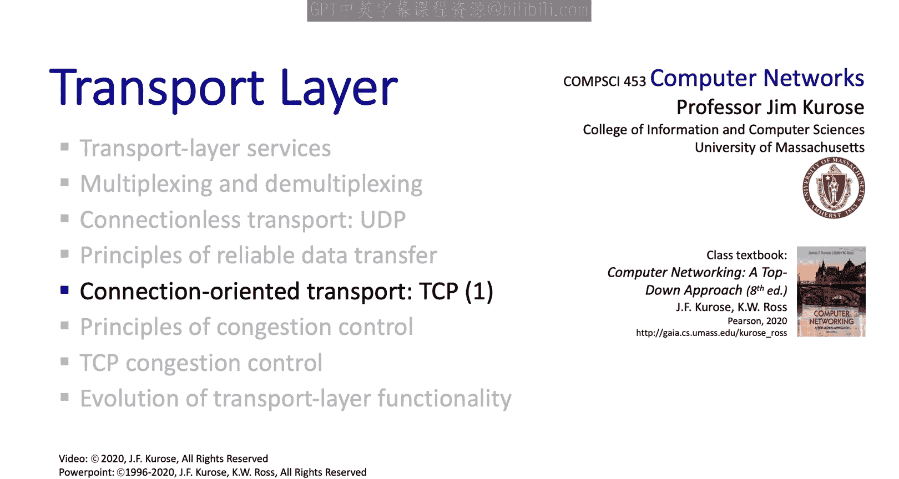

# Jim Kurose《计算机网络：自顶向下的方法｜Computer Networking： A Top-Down Approach》中英（deepseek p21 -21-3.5-1 TCP Reliability, Flow Control, and Connection Management.zh_en -BV1UMtueiEaA_p21-

。In this section， we're going to take a look at how TCP provides reliable data transfer and we'll see that TCP uses all of the mechanisms that we studied earlier。

 check sums， acknowledgeledgments， sequence numbers。

 timeout and retransmit as well as pipeing and we'll also take a look at how TCP estimates the roundtri time between a sender and a receiver and how it uses that to set the timeout interval。

 we'll also take a look at a number of TCP scenarios looking at the TCP sender and receiver in action so let's get started。

Well， as we've seen， TCP operates in a point to point manner that is between one sender and one receiver and the semantics of its reliable data transfer is that of an in- order by stream and we should contrast that with UDP where we saw UDP was message oriented what TCP implements is a reliable bystream abstraction TCP is also full duplex meaning that data payloads can flow in both directions。

The data that's contained as a payload and a TCP segment has the maximum segment size of MSS。

 and this is typically 1460 bytes in practice， but it could be any of a number of different values。

As we've seen and as we'll illustrate shortly， TCP uses cumulative Xs as in Go back in。

 it's a pipeline protocol， it's also connection oriented。

 which means that there's a handshake that occurs between the sender and the receiver before data actually begins to flow。

 we take a look at that handshake procedure shortly and TCPs also flow controlled。

 which means that sender and the receiver or speed match so that the sender won't overwhelm the receiver with data。

Let's next take a look at the TCP segment structure and I know this can seem a little bit boring and there's a lot of fields here so it may seem a little bit dry。

 but remember the thing to keep in mind is not just what the fields are。

 but why those fields are there and all of these cases we'll see from what we've learned already about the principles of reliable data transfer that we'll be able to understand why TCP has these fields so let's get started。

 we've seen a port number and a destination port number used for multiplexing and demxing before。

The TCP header also contains a 32 bit sequence number and a 32 bit acknowledgement number that we're going to look at in just a second。

Down at the bottom， we see the application data， that's the payload being carried by the TCP segment。

The TCP header also has an internet checkum just as we saw in UDP TCP also has a set of options and there's a variable number of options that could be included。

 we're not going to go into those， but that makes the header that we see here a variable length so we can carry options in a TCP header and because the header can be a variable length we need to have a length field of the TCP header itself。

The reset， S and fin bits are used for connection management。 We'll study that shortly。

 There's a field in the header that's used for flow control。

 where the receiver can tell the sender the number of bytes it's willing to accept。

There are two bits in the header that are used for congestion， notification。

 and again we'll take a look at that later， and then finally there are two bits in one field。

 the urgent field which are not really used in practice。

Let's take a deeper dive into the meaning of TCP's sequence number and acknowledgement number fields here。

 remember that TCP implements a bystream abstraction and the sequence number carried in a TCP segment header indicates the bytestream number of the first byte in that segments payload data the acknowledgeledment field is used by the receiver to tell the sender the sequence of the next byte that's expected to be received from the sender and that number serves as a cumulative acment for all bytes of data that have occurred before that sequence number。

And lastly， students often ask， what should a TCP receiver do with out of order segments？

The TCP specification places no requirements here。 that's up to the implementer。

So let's next look at a very simple example of TCP in action。

 looking at sequence numbers and acknowledgement numbers in this example we're looking at a simple Tnet scenario where host A sends a character to host B and host B echoes that single character back。

So you're going to want to take a careful look at the sequence and act numbers on the segment shown in this example。

 the key thing to note here is that the act number of 43 on the B to A segment is one more than the sequence number 42 on the A to B segment that triggered that acknowledgecgment。

 Similarlyly， the Act number 80 on the last A to B segment is one more than the sequence number 79 on the B to A segment that triggered that acknowledgeknowment。

Well， we've seen that TCP uses sequence numbers and acknowledgecknowledgments pretty much as we would have anticipated from our principled studied。

 we saw that there were a couple of differences the bystream semantics and the fact that sequence numbers and acknowledgeknowledgments corresponded to offsets in that bystream Let's next take a look at an issue we really haven't addressed yet and that is how should the timeout values be set and let's take a look at how TCP does that。

Now， clearly， we're going to want the timer values to depend somehow on the round trip time。

 the R T T。 But how do we actually set that timer value， If we set it too short。

 what will happen is that we'll have premature timeouts。

 That means that we'll be resending segments that have not actually been lost yet。 On the other hand。

 if we wait too long， TCP is going to be slow in reacting to segment loss。

So a key question we're going to have to address is how do we estimate the RTT Well we can actually just measure that start a timer when a segments transmitted。

 stop the timer when an a is received for that transmission and then we've got a sample measured RTT but as it turns out those samples can vary quite a bit from one sample to the next so what we're going to want to use is something that's a little bit smoother and averaged value of the sample RTT。

So this is how TCP recomputees the estimated RTT each time a new sample RTT is taken。

 and this process is known as an exponentially weighted moving average and it's shown by the equation here that the new value of the estimated RTT is 1 minus alpha times the old value of the estimated RTT plus alpha times the sample RTT that was just taken。

 and this value alpha can be set to reflect the influence of the most recent measurements on the estimated RTT。

 a typical value of alpha used in implementations is 0。125。

The graph at the bottom shows the measured RTT between a host at the University of Massachusetts and a host in France。

 as well as the estimated smoothed RTT。Given this value of the estimated RtT TCP now computes the timeout interval to be the estimated RtT plus some kind of safety margin and the intuition behind setting a safety margin is that if we're seeing a large variation in the sample RtT。

 the RTT estimates are fluctuating a lot， then we'll want a larger safety margin So TCP computes the timeout interval to be the estimated RtT plus four times a measure of deviation in that estimated RTT value and here the deviation in the RTT is computed as the exponentially weighted moving average of the difference between the most recently measured sample RtT and the estimated RtT at that time。

Well， with our detailed knowledge of how TCP uses sequence numbers。

 acknowledgeledgments and the timeout mechanisms， we're now in a position to summarize the behavior of both the TCP sender and the TCP receiver once we do that we'll then take a look at a couple of scenarios showing the TCP sender and receiver in action。

Given these details of TCP's sequence numbers， acts and timers。

 we can now describe the big picture view of how the TCP sender and receiver operate。

 you can check out the finite state machines in the book so here let's just give sort of an English language textual description and let's start with the sender。

On the event that data is receive from the application。

 TCP is going to create a segment with a sequence number and send that message。

 assuming the message within the sender send window and start a timer if the timer is not already running。

 and you may find it useful to think of there being just a single timer for the oldest unacknowledged segment。

 how a single timer or multiple timers are used is really an implementation detail。

On the event of a timeout， the segment that caused that timeout will be retransmitted。

 timer will be restarted and on the event that an AC is received。

 if the Act acknowledges previously unacknowledged segments。

 we're going to want to update what's known to be act and will want to restart a timer if there are still unacknowledged segments flowing between the sender and receiver。

Let's now turn our attention to the TCP receiver and the events that can happen at the receiver and how the receiver generates acts in response to these events。

Well， the first event that could happen would be the arrival of an in order segment with the expected sequence number Now。

 in the case that all of the data up to this expected sequence number has already been acknowledged rather than immediately acknowledging this segment。

 many TCP implementations will wait up to half a second for another in order segment to arrive and then generate a single cumulative act to cover both segments。

 thus decreasing the amount of act traffic， the arrival of this second in order segment and the cumulative act generation that covers both segments。

 that's the second row in this table。In the case that an out of order segment arises with a higher than expected sequence number。

 there's going to be a gap that's now detected in this case。

 remember TCP will send a duplicate act indicating the sequence number of the next expected byte。

And the last event is the arrival of a segment that partially or completely fills a gap at the lower end of the receiver window。

In this case， the receiver is going to send a cumulative acknowledgement acknowledging all data that's been received in order so far。

To solidify our understanding of TCP reliability， let's take a look at a few retransmission scenarios in the first case。

 a TCP segment is transmitted， but the AC is lost。In this case。

 TCP's timeout mechanism results in another copy being transmitted and then re acknowledgeknowledged by the receiver。

In the second example， two segments are sent and acknowledged。

 but there's a premature timeout at the sender for the first segment， which， again is retransmitted。

 The important thing to note is that when this re transmittedmitted segment is received。

 the receivers already receive the first two segments and so resends a cumulative acknowledgment for both segments received so far。

 rather than just an act for this first segment。And in this last example。

 two segments are again transmitted， the first act is lost， but the second act。

 cumulative act arrives at the sender successfully。

 and so the sender can then transmit a third segment knowing that the first two segments have arrived。

 even though the act for the first segment was lost。

Let's wrap up our study of TCP reliability by discussing an optimization to the original TCP known as TCP fast Retransmit。

 Take a look at this example on the right。 Here we see five segments that are transmitted and the second segments lost。

 In this case， the TCP receiver is going to generate an act 100 acknowledging the first received segment。

 However， when the third segment arrives at the receiver。

 the TCP receiver sends another Act 100 since the segment segment hasn't arrived yet。

 And similarly for the fourth and the fifth segment to arrive。 Now， what is the sender C。

 The sender Cs， the first act 100。 This is what it been hoping for。

 And then three additional duplicate a 100s arrive。 So now the sender knows that something wrong。

 it knows that the first segment arrived at the receiver。

 But the later three arriving segments at the receiver。

 the ones that generated those three duplicate acts were correct。Received， but they weren't in order。

 That is， there was a missing segment at the receiver when each of the three duplicate acts were generated。

With this fast retransmit optimization， the arrival of three duplicate acts causes the center to retransmit its oldest unacknowledged segment that we see here without waiting for a timeout event。

 This then allows TCP to recover more quickly from what is very likely a loss event。

Well that pretty much wraps up our study of TCP reliable data transfer I hope you feel good about the fact that the mechanisms that we developed in our RDT protocols are exactly those mechanisms that are used by TCP in practice and actually we'll see these mechanisms come up again when we study the HTTP3 Pro and application layer protocol used by the web we're going to wrap up here by looking at two topics that are somewhat related to reliable data transfer that's flow control and connection manager。

