# Jim Kurose《计算机网络：自顶向下的方法｜Computer Networking： A Top-Down Approach》中英（deepseek p22 -22-TCP Reliable Connections - Internet Transport Layer -BV1UMtueiEaA_p22-

In this video we'll be looking at TCP connection oriented mechanisms。

 including the segment structure， connection setup， round trip time estimation for timeouts。

 and the way in which it achieves reliable data transfer。Let's get started。

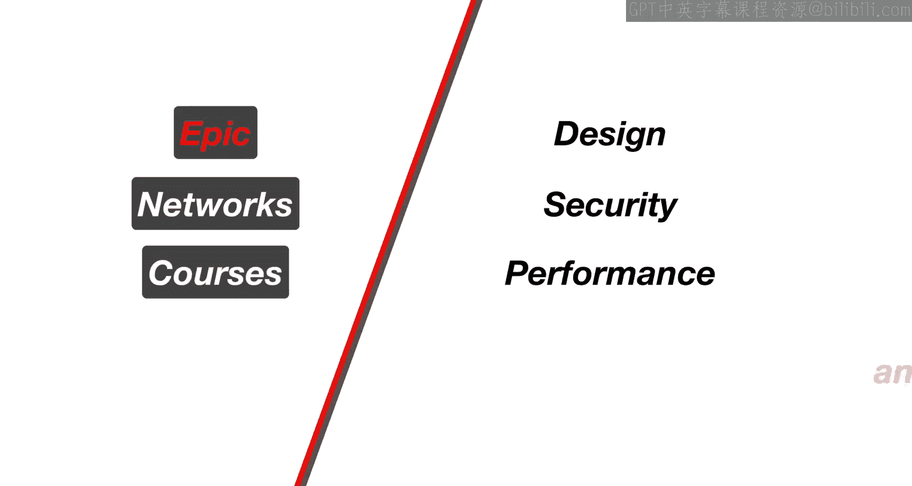

Now let's start looking at TCP TCP is a protocol that implements a number of the principles and algorithms that we saw in the last couple videos in order to achieve reliable data transfer。

So in this video， we'll be able to put implementation specifics with those principles and see how it all works together。

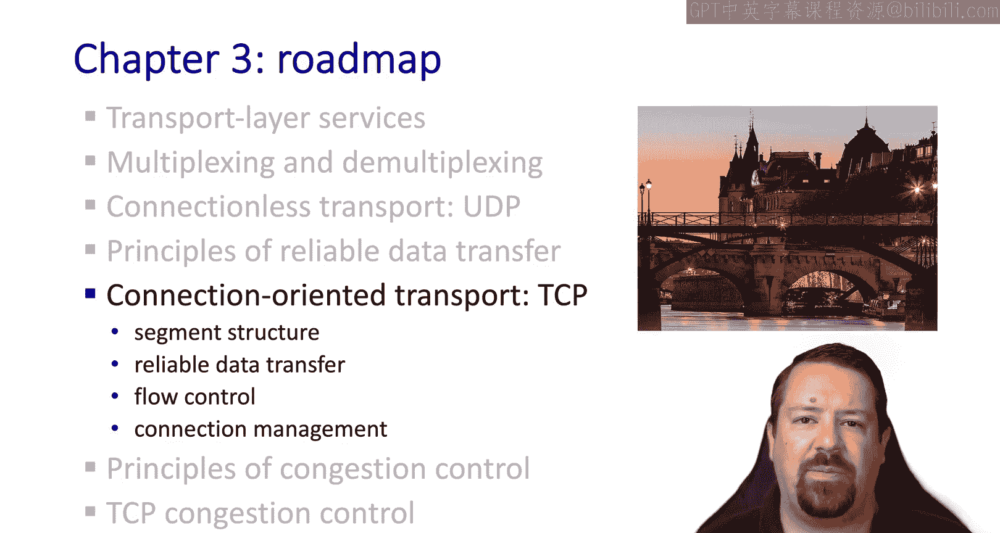

So let's start with the basics TCP is defined in a number of RFCs。

 it has been developed and enhanced over the years to improve performance and keep pace with faster and faster underlying networks。

Some of its basic properties are that it is point to point。

 meaning it communicates between only two processes。

 as we saw in the discussion of socket programming。It is reliable。

 so it takes care of retransmittting lost or corrupted data。

It delivers application data as a byte stream， so it does not impose any message boundaries and application messages may span multiple segments。

Unlike the examples we've been looking at so far， TCP is also bidirectional。

 meaning not only do the control messages flow in both directions， but the data can as well。

 the processes at both ends of the connection may each send and receive data。

One term that we will use quite a bit is the MSS or maximum segment size。

From the last video you will remember the idea of cumulative as and pipelining。

 and TCP implements both of these。 TCP is also connection oriented。

 so it has a connection establishment phase as we've mentioned before， and it's flow controlled。

 which is an idea that we haven't talked about so far。

 but it means that the sender will not be able to overwhelm the receiver's buffer。

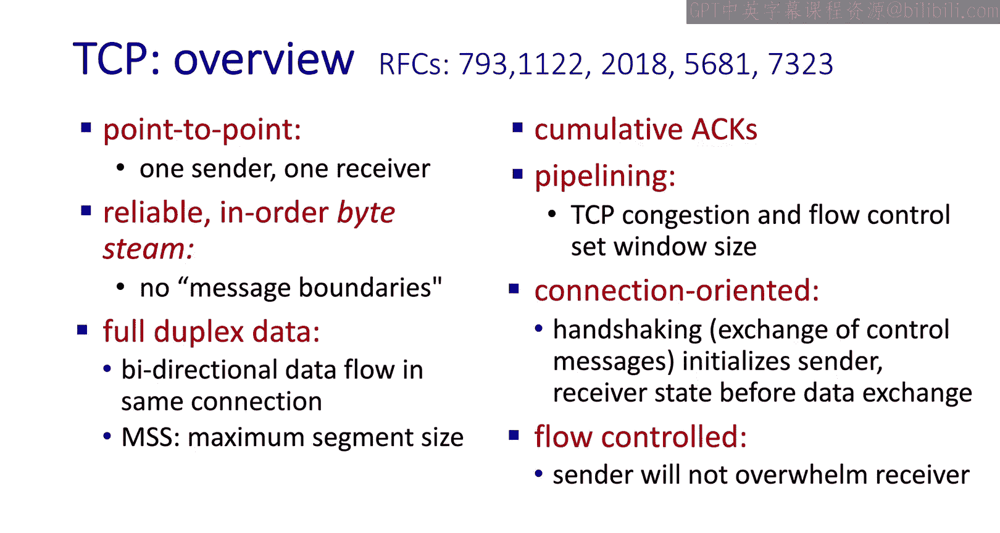

Here is the structure of a TCP segment， including its header fields。

 if you think back to the UDP segment you'll notice that this is significantly more complex。

One thing it has in common with UDP though is the sourceport and destination board。

 both of which are 16 bit fields。The TCP segment uses a 32 bit sequence number。

But one important thing to note is that this number counts the bytes in the byte stream。

 not the number of segments， so it works a little bit differently than the examples that we saw of selective repeat and Co back in。

TCP also has a number of individual flags， one of which is the AC bit。

 which designates if this segment is acknowledging data。Of course。

 the payload for the TCP segment is the application data。

Another thing that it has in common with UDP is an internet checkup。Again。

 16 bits long and computed in the same way as we saw for UDP。

TCP also supports a number of optional features， there are many of these defined in different RFCs。

 and well describe some of them later on。Because the options can be a varying length。

 this means the overall TCP header length may vary， and so the header length is specified in a field。

To support the connection management， we have the reset， thin and sin flags。

And to handle flow control， we have another window called the Re window。

This is not to be confused with the congestion window that we talked about in select repeatat and go back in。

 and a little bit we'll discuss more about how the receive window works。

We also have a couple flags specific to congestion notification and allows couple bits for urgent and push。

 which are not used in practice。

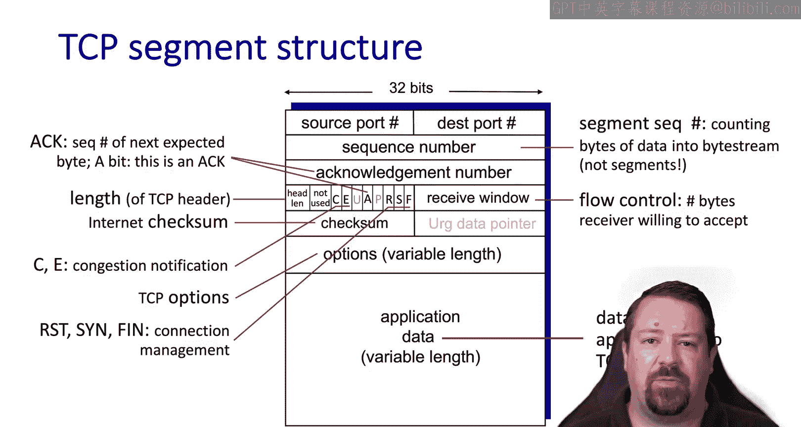

Let's talk about how a byte stream sequence number works。Our window size is now in terms of bytes。

 not segments， so the byte stream number is a byte counter identifying the first byte in a segment。

So the segment， of course， will hold multiple bytes。

 but the number in the sequence number field will refer to the first byte in the segment。

The acknowledgeknowment number is a sequence number referring to the byte being acknowledged in TCP。

 it specifies the sequence number of the next byte expectant。

 so one more than the last byte received。This is a cumulative acknowledgement number as we saw with Go Back in。

When we talked about GobeIn， we said that the receiver may buffer out of order segments or it may discard them and TCP doesn't specify one option or the other；

 it's up to the operating system implementers to decide how to handle out of order segments。

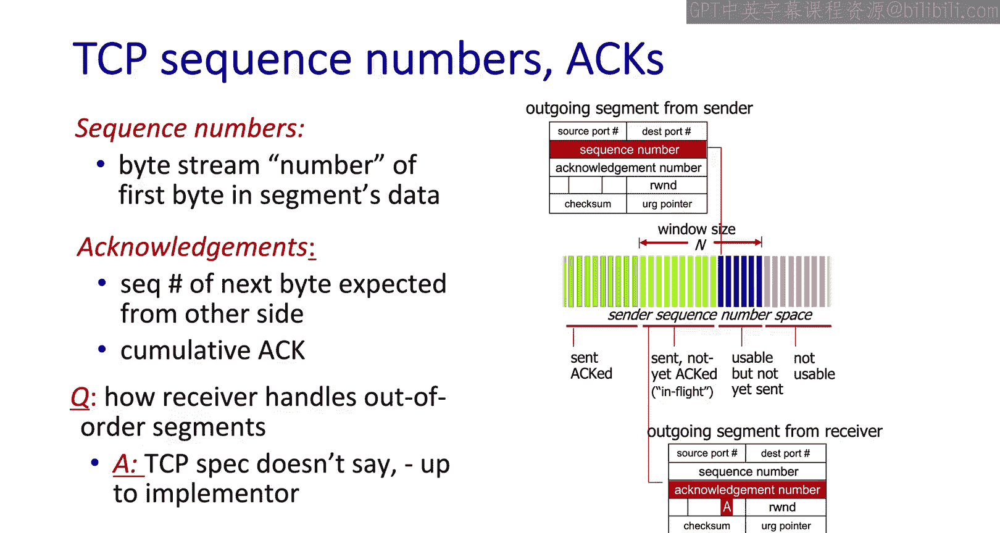

Here's an example to demonstrate counting with bystream sequence numbers Host A and hostt B have established a Tnet session。

 which means they're going to be sending one character at a time and echoing that character back。

Host A sends the letter C。Which is one by of data Hos B both acknowledges it and sends the letter back because this is how the Tnet protocol works。

 So the original packet had sequence number 42 and it's one byte of data。

 and so that means the next sequence number expected is 43 and we see that 43 is in the act for the letter C。

 we also see that in the first packet， the act number 79 was included。

 which means that host A is expecting byte 79 as the next byte of data from host B。

 When host B sends back the letter C， we see that it comes with sequence number 79 as expected。

The last packet is an ament with no data， and we see that it's acknowledging byte 80。

 meaning the next byte that host A would expect host B to send sequence number 79 is incremented。

By the length of the payload， which is one byte to become act number 80。

When we were describing reliable data transfer， we saw the use of timeouts。

 and we said that later on we would understand how to set these timeout values。

So the time up value needs to be set relative to the round trip time。

 ideally expiring as soon as possible after the expected arrival of the acknowledgment。

 which would be just a little more than one round trip time。 However。

 if we set the time out too short， it means that the sender will frequently retransmit data unnecessarily if the acknowledgecknowledment is delayed just a little bit。

On the other hand。If the timeout is too long， the sender will frequently be stuck waiting。

 not able to send more data while it waits for a timeout to expire。

Both of these options would cause inefficiency in the system。

So TCP has a particular algorithm for estimating the round trip time and setting the time out accordingly。

It starts off by sampling the round trip time， meaning measuring the time between sending a packet and receiving the acknowment for that packet。

 TCP then uses the samples of round trip time and averages together to create an estimated round trip time。

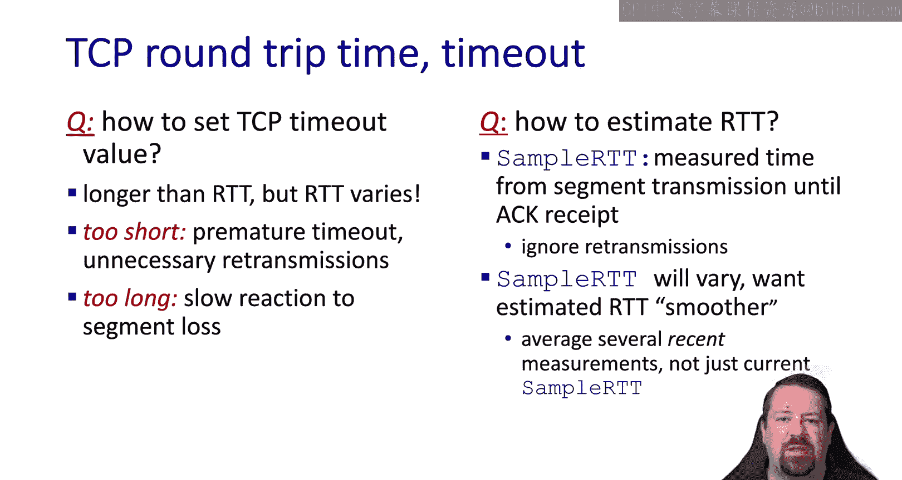

To do this， it uses an exponentially weighted moving average so that some weight is placed on the existing estimate while being updated by new samples。

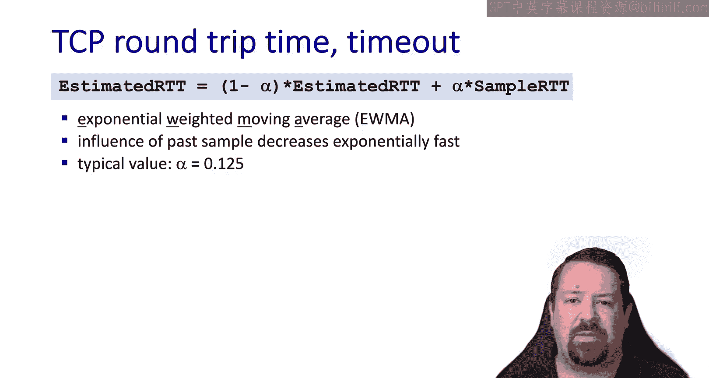

Here's a plot looking at the individual samples and estimated roundtri time together。

We can see that while the estimate responds to individual samples， overall。

 it formss a much smoother plot than the raw sample data。

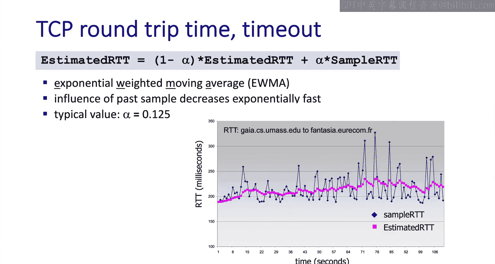

But we're not quite done yet。If we just set the timeout to our estimated round trip time。

 that means half the time the timeout would expire prematurely。

Which would create far too many unnecessary retransmissions。

 So we want to take our estimate and add a safety margin to it for TC P。

 we take our estimate and add four times the R T T deviation。

 where the dev R T T is the exponential weighted moving average of the sample deviation from the estimate。

Here's the calculation for that。Alpha in the previous equation and beta in this equation weight the responsiveness of these values to new samples。

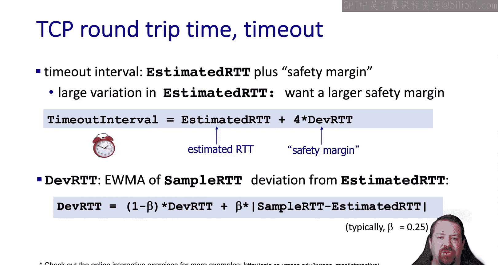

So now we have all the pieces and can put them together into understanding the entire TZP protocol。

 it starts with data being received from the application to send。

 then creates a segment using the next sequence number in the by stream starts the timer if it's not running already。

Remember， this is fundamentally go back in and keeps the timer for the oldest unA segment。

And it sets the timeout interval based on the calculation that we just saw。If a timeout does occur。

 the segment that caused the timeout is retransmitted and the timer is reset。When Acts arrive。

 the sender window is updated and the timer is restarted if there are still segments outstanding。

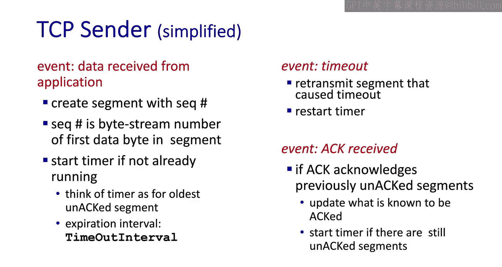

On the receiver side， we have a few different events。

 One is the arrival of an in order segment with the expected sequence number。

 the TCP receiver needs to acknowledge this， but it implements something called a delayed a。

 so it waits a little bit to see if another segment arrives before sending a cumulative act for both segments。

If no additional segment arrives within this time， it acts the individual segment。

If the second segment arrive， it doesn't keep waiting。

 but it immediately acts the two received segments with a single cumulative act。

If a segment arrives out of order， the receiver sends duplicate acts for the previously received segments。

If a packet arrives and is filling a gap between in order and out of order packets。

 it will be immediately acted by the receiver， it will not use the delayed AC method in this case。

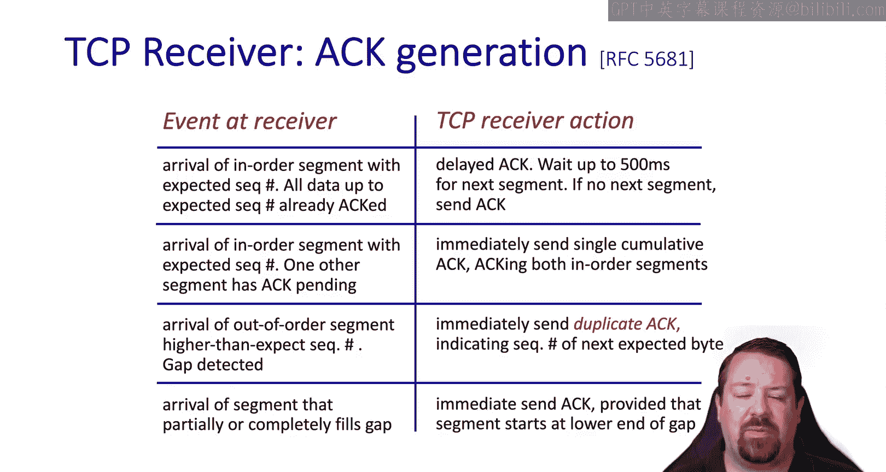

Now for some time sequence diagrams。First， we'll look at the Los act scenario and then see what happens with a premature timeout。

So we have host A sending8 bytes of data with sequence number 92。

This means host B will be expecting by 100 in the next packet by taking the sequence number 92 and adding 8 bytes to it。

 and so that's the acknowledgecment sent back， however this acknowledgecment is lost。

Host A waits for its timeout value and then resends the packet。

 note that it is identical to the first time with the same sequence number and same data。

Host B already had this packet， so it discards the duplicate， but rescinends the acknowledgment。

 This time， the ament arrives at host A， which is able to cancel its timer。

In the case of a premature timeout。We have host A sending two packets。

The first of eight bytes and the second with 20 bytes， however。

 the timeout expires before the axe arrives back and it resends the first packet。

Note that the receiver always sends the highest cumulative ag value that applies。

 so even though it just got a packet with bytes 92 through 99， it sends 120。

Because that is the highest number of in order bytes that it's received at that point。

This cumulative act catches up at the sender and so it won't need to resend any other duplicate packets。

Here's another variant of that scenario where the sender sends two packets in order。

 and the first act is lost。 But the second act arrives shortly thereafter。

 And because acts are cumulative， it doesn't matter that the first act was lost。

 The sender knows that both packets arrive at the receiver， and it can continue on sending new data。

Now we'll look at a TCP mechanism known as fast retransit。As the sender is sending segments。

 the second one is lost， but subsequent packets arrive successfully at the receiver。 Now。

 because the receiver only acknowledges bys that are received in order。

 it will keep sending the acknowledgment， saying that it's expecting byte 100。

 because of the margin added on top of the roundtri time。

 The timeout's going to continue to run for some period of time longer。

 and the receiver would be stuck waiting if it had to wait for that time out。However。

 as an optimization， the sender can use the fact that it just received three duplicate acts to indicate that a packet was lost and go ahead and retransmit even though the time it hasn't expired yet。

This is the optimization called fasttry transmit。The sender goes ahead and resends the missing packet after what are commonly referred to as triple duplicate acts At that point。

 the receiver is then able to act all of the data that it had previously received out of order。

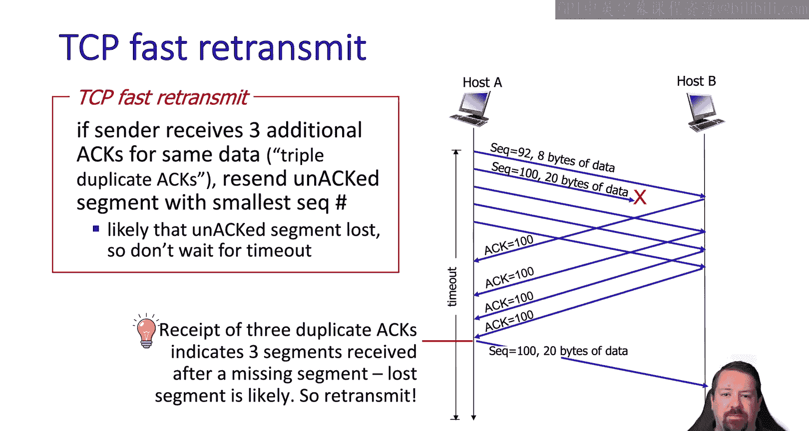

That covered how TCP implements reliable data transfer。

 but we still have some components of TCP left to look at。In the next video。

 we'll see how TCP handles flow control and connection management。

Followed up with principles of congestion control and TCP congestion control。

 which is a large topic in itself。

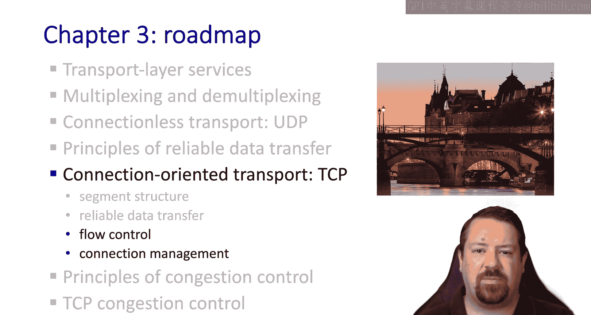

See you in the next video。We hope you enjoyed this video。

 if you found it to be useful please click the like button to be notified when more videos are posted for this class。

 please subscribe to our channel and click the bell。

