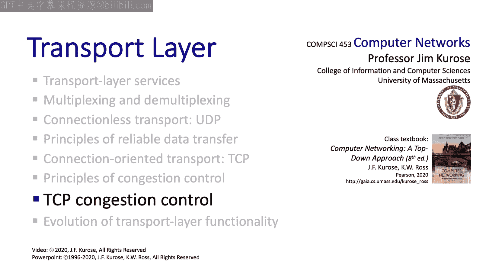
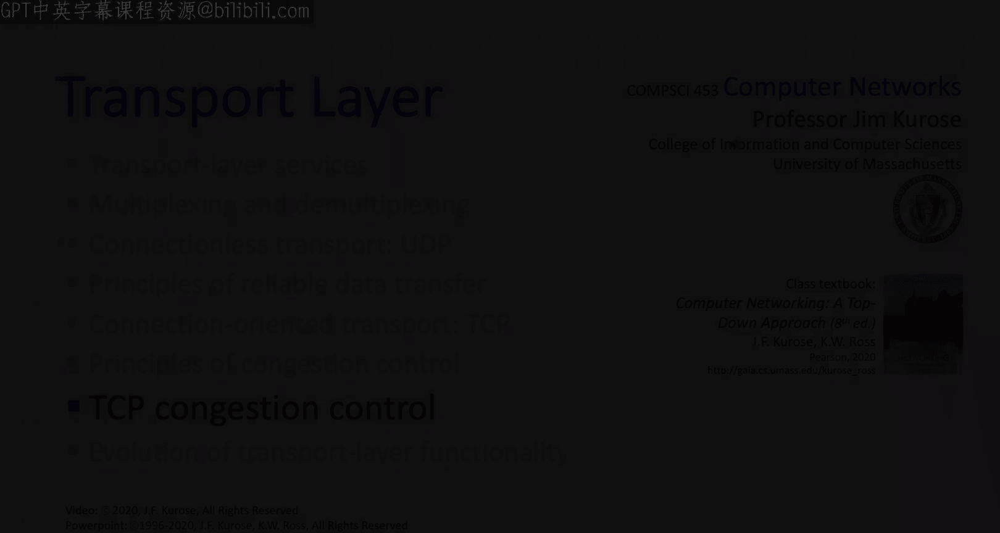

# 计算机网络：自顶向下的方法：3.7：TCP拥塞控制 🚦

在本节中，我们将学习TCP拥塞控制。我们将看到，TCP为了实现拥塞控制，运用了许多我们在上一节中学习到的深刻见解和基本机制。

我们将从被称为“经典TCP”的机制开始，其中TCP发送方会逐渐提高发送速率，直到发生丢包，然后降低速率。我们还将研究一种基于延迟的拥塞控制方法，它通过测量往返时间（RTT）来工作。此外，我们会探讨一种名为“显式拥塞通知”的网络辅助拥塞控制方法，其中IP路由器在拥塞控制中扮演主动角色。最后，我们将以讨论TCP的公平性来结束本节。

## 经典TCP拥塞控制：AIMD算法 🔄

上一节我们讨论了拥塞崩溃，这是一种非直观的现象：当TCP发送方提高其总速率时，端到端的总吞吐量反而会下降。在20世纪80年代，TCP还没有拥塞控制机制时，网络中确实开始观察到这种现象。1988年，网络研究员Van Jacobson发表了一篇关于拥塞避免与控制的奠基性论文，为我们即将学习的拥塞控制方法奠定了基础。

TCP采用端到端的拥塞控制方法，通过丢包事件来检测拥塞，而不是由拥塞的路由器发出信号。其背后的算法思想非常简单：当网络路径不拥塞（即没有丢包）时，TCP发送方可以提高其发送速率；当发生丢包时，它必须降低发送速率。这种“增-减”机制导致了发送速率呈现出一种“锯齿状”的行为模式。

TCP使用的具体“增-减”算法被称为**加性增、乘性减**，简称**AIMD**。在增加阶段，发送方每个RTT将其速率增加一个报文段；当发生丢包时，它将发送速率减半。这个算法非常简洁。

我们可以这样理解：TCP发送方试图找到在不引起丢包的情况下最快的发送速率。它不断试探增加，直到发生丢包，然后减半，接着再次开始增加。这就像孩子试探父母的底线一样。

这里有一个关于何时减半窗口的细节需要注意：只有当TCP通过**三重重复确认**检测到丢包时，才会将窗口减半。如果发生**超时**，TCP会将窗口大小直接重置为一个报文段。

你可能会问，为什么是加性增加，而不是乘性增加？这主要与稳定性有关。事实上，在TCP拥塞控制算法提出后，已被正式证明，该算法作为一种分布式异步优化算法，能基于各自接收到的丢包反馈信号来设置各自的发送速率，并具有良好的稳定性。

## TCP拥塞控制的实现 🛠️

上一节我们介绍了AIMD的基本思想，本节我们来看看TCP如何具体实现它。

回想我们之前讨论TCP的“回退N步”和“选择重传”时提到的发送方窗口。发送方窗口包含已确认的报文段（绿色）、已发送但未确认的报文段（黄色），以及可以发送的报文段序列号（蓝色）。这些蓝色和黄色的序列号位于所谓的**TCP拥塞窗口**中。

TCP通过调节**拥塞窗口**的大小来设置其传输速率，而调节拥塞窗口的方式正是我们刚刚讨论的AIMD算法。

拥塞窗口大小与发送速率有直接关系。如果往返时间为`RTT`，并且有`CWND`字节的数据在传输中，那么TCP的发送速率大约是 `CWND / RTT` 字节/秒。

## 慢启动与拥塞避免的切换 🚀

到目前为止，我们讨论的是已建立的TCP连接的AIMD行为。我们还需要了解TCP连接如何从初始速率开始提升吞吐量。TCP从初始速率（1个MSS/RTT）开始提升的算法被称为**慢启动**。这个初始阶段实际上是乘性增加，每个RTT将发送速率翻倍。所以，不要被“慢”字误导，指数增长其实并不慢。

我们已经学习了AIMD和慢启动，现在来看看TCP如何将这两部分结合起来。

TCP从慢启动阶段切换到更谨慎的加性增加阶段，发生在`CWND`的值达到上次因丢包而减半前的值的一半时。这个切换点由一个名为**慢启动阈值**的变量跟踪。当检测到丢包事件时，`SSThresh`被重置为当时拥塞窗口大小的一半。

TCP的AIMD算法已经存在了30多年，期间提出了许多修改方案。其中，一个得到广泛部署的修改是**TCP CUBIC**。接下来，我们将看看它与经典AIMD有何不同。

## TCP CUBIC：更智能的探测 📈

TCP CUBIC的操作方式与AIMD类似，主要区别在于它如何增加其拥塞窗口大小。

理解TCP CUBIC的关键在于回想我们之前关于“探测可用带宽”的概念。假设`W_max`是发送方上次经历拥塞丢包时的发送速率。问题是，TCP发送方应该如何再次开始探测（即增加发送速率）？

经典的AIMD算法是线性增加。而CUBIC认为，自从上次丢包以来，链路的拥塞状态可能没有太大变化，因此可以更快地增加到接近上次丢包时的速率，但一旦接近那个速率，就要非常小心地增加。

具体来说，TCP CUBIC首先选择一个未来的时间点，希望在那个时间点将其窗口大小增加到上次丢包事件时的窗口大小`W_max`。然后，TCP CUBIC根据当前时间与达到`W_max`的目标时间之差的立方函数来增加窗口大小。这意味着，当远离`W_max`时，TCP CUBIC比AIMD增加得更快；但当接近`W_max`时，增加得更慢。

由于CUBIC的性能通常被认为优于AIMD，它现在是Linux TCP实现中的默认拥塞避免算法。一项近期的测量研究表明，在最受欢迎的5000个Web服务器中，近50%运行着某种版本的TCP CUBIC。

## 其他拥塞控制方法：延迟与网络辅助 🧭

我们已经看到，包括CUBIC在内的经典TCP拥塞控制算法采用了基于丢包的端到端方法。实际上，还有两种采用不同方法且部署相当广泛的TCP变体：第一种采用基于延迟的方法，第二种采用网络辅助方法，其中TCP发送方会从TCP接收方和拥塞的IP路由器那里获得显式反馈。

让我们退一步，再看一下全局情况。AIMD和CUBIC会增加TCP的发送速率，直到发生丢包。丢包通常发生在源到目的地路径上某个拥塞的路由器处，我们称这个拥塞链路为**瓶颈链路**。

当瓶颈链路已经几乎总是处于繁忙状态时，让发送方提高发送速率实际上没有好处。路由器在拥塞的输出链路上每秒只能交付`R`比特。因此，我们希望保持路由器繁忙，但又不让TCP发送方发送得过快以至于溢出路由器缓冲区。换句话说，我们希望保持端到端的管道刚好充满，但不要过满，尤其不要满到引起拥塞丢包。

这就是**基于延迟的拥塞控制**方法背后的见解。它的工作原理基于使用RTT测量。假设发送方当前测量的RTT值为`RTT_measured`。发送方还知道在上一个RTT期间发送了多少字节数据，因此可以计算出其测量吞吐量：`吞吐量 = 发送字节数 / RTT_measured`。

发送方还知道`RTT_min`，即它测量到的所有RTT延迟中的最小值。我们将此值视为无拥塞时的RTT值。在无拥塞状态下，当有`CWND`字节在传输中时，发送方应看到的吞吐量是 `CWND / RTT_min`。

基于延迟的拥塞控制思想在概念上很简单：如果测量到的吞吐量（`CWND / RTT_measured`）接近无拥塞吞吐量，那么路径不拥塞，发送方可以发送更多（即增加`CWND`）。反之，如果测量吞吐量低于理想情况，意味着存在更大的测量RTT和路由器延迟，路径拥塞，因此TCP发送方应该退避（即减少`CWND`）。

已经有一些基于延迟的协议被提出和部署，它们在如何增减窗口大小上略有不同，但都基于我们这里描述的基本原理。一个较新的版本是**BBR**，它被Google用于其数据中心互连的内部网络TCP流量，并取代了CUBIC。

**显式拥塞通知**是一种网络辅助的拥塞控制形式，涉及TCP发送方、接收方以及网络路由器。这种方法旨在避免拥塞，而无需将路由器驱动到过载（即丢包）的场景。

在ECN中，拥塞的网络路由器会在IP数据报头中设置一个比特位，以指示路由器拥塞。TCP接收方然后通过在其发送给TCP发送方的确认报文段头部设置一个ECE比特位，来通知发送方这个拥塞指示。TCP发送方则通过调整其拥塞窗口来应对此拥塞，就像它应对丢包段时使用快速重传一样。

## TCP的公平性 ⚖️

让我们通过考虑公平性问题来结束对拥塞控制的学习。首先，什么是公平性？

一个合理的定义是：如果`K`个TCP会话共享同一个传输速率为`R`的瓶颈链路，那么每个TCP流应该获得平均`R/K`比特/秒的吞吐量。你认为我们目前学到的TCP会导致瓶颈链路的公平共享吗？让我们看看。

对于两个流共享瓶颈链路的情况，有一个很好的图形化方法来审视公平性问题。假设连接从一个不公平的点开始，连接1获得的吞吐量多于连接2。问题是，TCP的AIMD算法是否会将实现的吞吐量驱动到公平线上？

由于在起始点，两个连接的总吞吐量小于`R`，不会发生丢包，两个连接都会因AIMD算法而每个RTT将其窗口增加1个MSS。因此，两个连接的吞吐量沿着45度线移动。最终，两个连接的总吞吐量将大于`R`，从而发生丢包。假设两个流都检测到丢包，并将窗口减半。然后，它们再次沿着45度线增加吞吐量，如此循环。最终，两个连接的吞吐量将沿着公平共享线波动。无论它们从二维空间中的哪个点开始，最终都会收敛到这种行为，这非常神奇。

让我们从更宏观的视角来结束关于公平性的讨论。请记住，TCP将可靠性、流量控制和拥塞控制捆绑在一起。如果有人想在UDP之上构建一个具有可靠性和流量控制的应用程序，他们当然可以这样做。当TCP连接经历丢包时，它们会降低发送速率，而基于UDP的应用程序（有可靠性但无拥塞控制）则不必降低其发送速率，因此会继续以更高的速率发送，获得更好的性能，并可能饿死TCP连接。

有趣的是，并没有“互联网警察”来强制要求在拥塞链路上公平共享带宽。然而，我们并没有看到任何广泛的“作弊”行为。也许这是因为需要可靠性的应用程序设计者直接基于TCP构建他们的应用程序。

## 总结 📚

在本节中，我们涵盖了TCP拥塞控制。我们首先研究了经典的TCP拥塞控制，它使用丢包来指示并避免拥塞。我们还研究了使用RTT测量的基于延迟的方法，以及名为显式拥塞通知的网络辅助方法。最后，我们探讨了TCP发送方之间的公平性问题。

我认为，很难高估TCP对互联网成功的重要性。你已经看到互联网协议有很多，但当我们谈论互联网协议栈时，有时我们直接称之为TCP/IP协议栈。我认为这反映了TCP在互联网成功中所扮演的核心角色，特别是TCP拥塞控制算法的重要性。