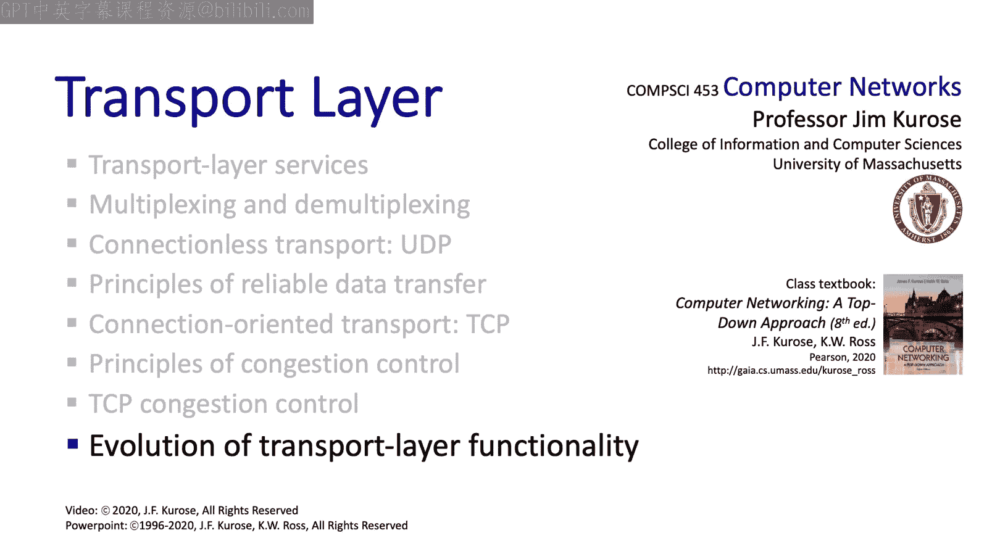

# 计算机网络：自顶向下的方法：3.8：传输层功能的演进 🚀

在本节中，我们将探讨传输层协议的未来演进方向，特别是TCP和UDP协议在长期实践中的表现，以及新兴的QUIC协议如何将部分传输层功能上移至应用层，以解决传统协议的一些局限性。

---

## 概述

传输层的核心技术主题已经介绍完毕。现在，让我们展望未来，探讨传输层功能可能的演进方向。TCP和UDP协议已存在超过40年，其简洁而强大的服务集支撑了从早期电子邮件到现代流媒体、游戏等各类应用。然而，它们也存在一些固有局限，例如对实时服务和安全性支持不足。近年来，以QUIC为代表的新协议正尝试在应用层重构部分传输层功能，以更好地适应现代网络需求。

---

## TCP与UDP的持久性

上一节我们详细探讨了TCP和UDP的核心机制。本节中我们来看看它们为何能经久不衰。

TCP和UDP协议已稳定运行40余年，期间TCP仅进行了少量修改。长达40年的实践证明了它们提供的服务集虽然简单，但足以支撑从早期互联网应用（如电子邮件、FTP、Telnet）到标准化时尚未出现的应用（如万维网、流媒体、IP语音、游戏等）的惊人范围。

过去20年间，针对特定场景开发了多种TCP变体，其中一些已在实践中部署。如下表所示，这些变体有时适用于相当专业的环境。但总体而言，我们之前在本节中学习的TCP版本仍然是主流的部署方案。

| TCP变体 | 适用场景 |
| :--- | :--- |
| TCP Reno | 通用互联网 |
| TCP Cubic | 高带宽长距离网络 |
| TCP BBR | 减少缓冲区膨胀 |

---

## 传输层未提供的服务

回顾我们初次介绍传输层时的讨论，你或许记得传输层未提供某些关键服务。

特别是对**实时服务**或**安全性**的支持，这些方面至关重要。然而，这些功能主要被添加在了**应用层**。其形式包括应用层协议、分布式应用层基础设施（如内容分发网络和数据中心），以及靠近客户边缘网络的应用层服务提供商。

我们在第2章学到，HTTP自诞生以来几乎一直运行在TCP之上。然而，情况正在发生变化。新版本的HTTP，即**HTTP/3**，正在应用层构建大量传输层功能，并转而运行在UDP之上。让我们通过了解QUIC来结束这部分内容。

---

## QUIC：基于UDP的快速互联网连接

以下是QUIC协议的核心介绍。

**QUIC**（Quick UDP Internet Connections）是一个旨在位于HTTP之下并运行在UDP之上的应用层协议，其结构如下图所示。

```
[应用层 (如 HTTP/3)]
        |
        v
[传输层 - QUIC (基于UDP)]
        |
        v
[网络层 - IP]
```

它已在许多Google服务器、Chrome浏览器和移动版YouTube应用中广泛部署，并且正在IETF（互联网工程任务组）进行标准化。

从技术角度看，我们无需学习太多新内容，因为QUIC采用了我们已在TCP中学到的可靠性、拥塞控制和连接管理方法。事实上，如果你查看QUIC的草案规范，其中写道：“熟悉TCP的丢包检测和拥塞控制吗？嘿，那就是我们！这里采用的算法与众所周知的TCP算法类似。”

既然我们已经仔细学习了TCP的可靠数据传输、拥塞控制和流量控制协议，我们对QUIC会感到非常熟悉。因此，我们无需对这些具体技术多言，但应该简要说明QUIC的连接建立方式以及它如何在一个连接上复用多个应用流。

与TCP类似，QUIC是两端点之间面向连接的协议。因此，它使用握手协议来建立连接，为可靠性、拥塞控制和安全性设置发送方和接收方状态。

当前HTTP的做法是：客户端首先建立一个TCP连接（我们知道这需要整整一个RTT），然后在TCP连接之上建立第二个连接以实现传输层安全性（这需要另一个RTT）。因此，在数据开始流动之前，总共需要两个RTT。

在应用层并使用UDP，QUIC仅在一个RTT内完成握手，并在此次握手中一次性建立可靠性、拥塞控制和安全性状态，如下图所示。

```
客户端                     服务器
  |---- Client Hello ----->|
  |                        | (建立可靠性、拥塞控制、安全状态)
  |<---- Server Hello -----|
  |         ...            |
  |---- 开始数据传输 ----->|
```

---

## 流的多路复用与队头阻塞

上一节我们介绍了QUIC的高效握手。本节中我们来看看其另一个关键特性：流的多路复用。

QUIC还引入了**多个应用层流**复用于单个QUIC连接的概念。以下是如何在HTTP/3的背景下理解流。

你可以将流视为为需要从Web服务器检索的N个对象中的每一个分别建立的通道。在传统的HTTP（如左图所示）中，多个对象是**串行**地一个接一个从Web服务器检索的。拥有多个流的优势在于，多个Web对象可以**并发**检索，如右图所示。

```
传统 HTTP/1.1 (串行)       HTTP/3 over QUIC (并发)
[对象1请求] ------------>   [对象1请求] ------------>
[对象1响应] <------------   [对象2请求] ------------>
[对象2请求] ------------>   [对象3请求] ------------>
[对象2响应] <------------   [对象1响应] <------------
[对象3请求] ------------>   [对象2响应] <------------
[对象3响应] <------------   [对象3响应] <------------
```

每个独立的流都有自己的可靠性和安全性保障，但它们都受一个**公共的拥塞控制协议**管理，如下图所示，该协议看起来类似于DCCP（数据报拥塞控制协议）。

```
[流1: 可靠性 + 安全]
[流2: 可靠性 + 安全]  --> [公共拥塞控制 (如类DCCP算法)]
[流3: 可靠性 + 安全]
```

在这个动画示例中，第一个对象被成功检索，但第二个对象的检索出现了错误。在原始HTTP协议的情况下，第三个对象的检索必须等待第二个对象被正确请求和恢复。而在QUIC的情况下，第三个对象的检索可以与第二个对象的错误恢复过程**并发进行**，如右图所示。

当一个工作单元被阻塞时（例如，此处第二个对象的传输），这种阻塞会停滞所有排在它后面的工作，这种现象被称为**队头阻塞**。QUIC通过独立的流消除了应用层级的队头阻塞。

---

## 总结

本节课中我们一起探讨了传输层功能的未来演进。

我们对传输层功能未来发展的展望就此结束。我们现在真正完成了传输层的全部内容。让我们通过总结来收尾，并看看接下来的学习方向。




TCP和UDP作为互联网的基石，其设计经受住了时间的考验。然而，为满足更低延迟、更高安全性和更高效传输的现代需求，演进正在发生。**QUIC协议**代表了一种重要趋势：将部分传输层功能（如可靠传输、拥塞控制、安全握手）上移至应用层，并基于UDP构建，从而在保持兼容性的同时，实现了更快的连接建立、多流并发以及队头阻塞的消除。这预示着网络协议栈的设计可能变得更加灵活和模块化。