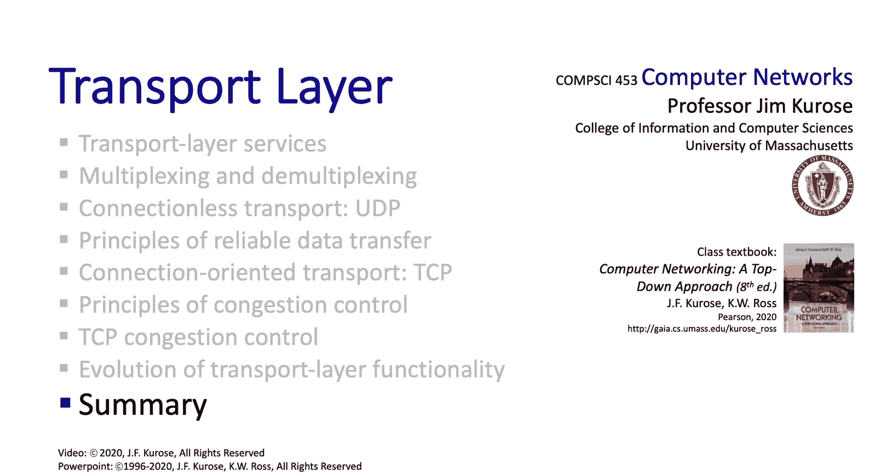

# 计算机网络：自顶向下的方法：第3章：传输层总结 🎯

在本节课中，我们将对传输层的学习进行总结。我们将回顾传输层的关键原理、核心服务以及两个主要协议（UDP和TCP）的实现。通过本节，你将巩固对传输层在整个网络体系结构中作用的理解。

---

至此，我们完成了对传输层的研究。我们覆盖了非常广泛的内容，希望你确实学到了很多知识。

我们探讨了传输层的原理。我们研究了**多路复用**与**多路分解**，考察了传输层提供的服务。我们深入分析了**可靠数据传输**、**流量控制**以及**拥塞控制**。此外，我们还具体研究了传输层协议（UDP和TCP）的实例化与实现。我们确实涵盖了大量的知识，衷心希望你收获颇丰并享受这一学习过程。

---

接下来，我们将要离开网络的“边缘”。在边缘部分，我们研究了应用层和传输层。现在，我们将深入**网络核心**，去探究所谓的**网络数据平面**与**控制平面**。相信你会发现这部分内容非常有趣。

---

## 本节内容回顾 📝

以下是我们在传输层章节中探讨的核心主题：

*   **传输层原理**：包括端到端通信的逻辑基础。
*   **多路复用与多路分解**：这是指主机将多个应用进程的数据通过同一个网络接口收发的能力。其核心是通过**端口号**来区分不同进程。例如，套接字编程中常用 `(IP地址:端口号)` 来唯一标识一个通信端点。
*   **传输层服务**：主要为应用层提供逻辑通信服务，包括可能的可靠交付、吞吐量保证、定时和安全性等。
*   **可靠数据传输**：确保数据完整、有序地从发送方传递到接收方。其核心机制通常涉及**序号**、**确认**和**重传**。一个简化的可靠数据传输协议（rdt）状态机是其经典描述。
*   **流量控制**：防止发送方发送数据过快，导致接收方缓冲区溢出。在TCP中，这是通过**接收窗口（rwnd）** 字段实现的。
*   **拥塞控制**：防止发送方发送数据过快，导致网络中间设备（如路由器）过载。TCP的拥塞控制算法包括**慢启动**、**拥塞避免**、**快速重传**和**快速恢复**等阶段。
*   **协议实现**：我们具体分析了两个传输层协议：
    *   **UDP**：一种无连接的、不可靠的简单传输协议。其报文段结构简单，开销小。
    *   **TCP**：一种面向连接的、可靠的传输协议。它提供了流量控制、拥塞控制以及全双工通信。

---

## 总结

本节课中，我们一起系统回顾了传输层的核心知识。我们从基本的多路复用原理出发，逐步深入到可靠传输、流量与拥塞控制等复杂机制，并最终落脚于UDP和TCP这两个具体协议的实现。传输层作为连接应用程序与底层网络的关键桥梁，其设计深刻影响着互联网的可靠性与效率。

在接下来的学习中，我们将目光从网络边缘转向网络核心，开始探索数据如何在网络中实际被转发（数据平面），以及路由决策是如何做出的（控制平面）。这将是理解互联网整体运作的又一重要篇章。