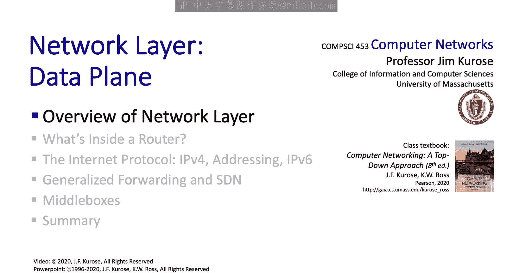

# Jim Kurose《计算机网络：自顶向下的方法｜Computer Networking： A Top-Down Approach》中英（deepseek p27 -27-4.1 Introduction to the Network Layer.zh_en -BV1UMtueiEaA_p27-

。Well having covered the application layer and the transport layer。

 which really happened at the edge of the network， we're ready now to dive into the network core and to take a look at the network layer itself。

 Now this is always one of the most fun and interesting topics to both teach and learn about in networking because the network layer is implemented in each and every internet connected device that's billions and billions of hosts and routers and this makes it among the most interesting and the most challenging to teach really if there's any such thing as the glue that holds the internet together。

 it's really the network layer。 So I think you're going to enjoy learning about things in this chapter Now as it turns out we're going to break our study of the network layer into two parts。

 we're going to start with what's called the data plane this corresponds to chapter 4 in our book the data plane is about the local per router actions primarily forwarding。

 moving a datagram from an input link to an output link at a router。

The second part of the network layer that we're going to study is known as the control plane。

 and the control plane is really about the network wide view。

 the end to end view of getting packets from the edge of the network。

 one edge of the network to the other edge of the network。

 the coordination and the management of all of the devices that are in the internet。Well。

 here's what we're going to study in our coverage of the data plane。

 We're going to start off by a big picture view of the network layer itself。

 and then we're going to dive down into a router and look at what actually takes place inside an Internet router we'll look at the guts of an Internet router We'll then cover the celebrated Internet protocol IP We'll look at the IP Datagram header we'll take a look at IP addressing in quite a bit of detail we'll take a look at network address translation and also a next generation of IP known as IP V6。

 We'll then look at the topic of generalized forwarding that's sort of on beyond datagram forwarding that'll be a bit of a prelude to what we'll cover in the control plane coming up next after this and then finally we'll wrap up with a discussion of what are known as middle boxes throughout our discussion here we'll cover both principles and practices as always So let's get started。

All right， Well， let's begin our study of the network layer。

 as we have with other layers by taking a services point of view。 Why does the network layer exist。

 What does it do， What services does it provide to the transport layer above it。

 And since we're jumping into the network layer。 Having finished the transport layer。

 let's start there at the edge of the network。 at the sending host。

 the network layer will take a transport layer segment from UDP or TCP and encapsulate the segment into an I datagram。

 will study the format of the I datagram shortly。 It'll include some network wide addressing information。

 We' cover I addresses in great detail， and then passes the datagram onto the link layer。

 which will be responsible for transmitting the datagram to the next hop。At the receiving host。

 the network layer receives datagram， checks some information like a checkum， extracts the payload。

 and the multiplexes a segment up to the appropriate upper level transport protocol UDP or TCP。

 Well that's what happens at the edge of the network。

 but that's not what's really interesting about the network layer。

 the real action is in the network core， and there's a network layer component in each and every device in the network core。

 while indeed in each and every device that's even part of the Internet。Well， as we know。

 routers are the principal network layer devices within the network core。

 and a router's job is pretty simple， it receives datagrams from a neighboring host or router on an input link and it forwards that datagram to the appropriate outgoing link。

Well， that's a pretty simple statement， but think about all the questions it raises。

 There's a local issue。 How does the router know which is the quote unquote appropriate outgoing link for an arriving datagram。

 And then there's the global issue， which is even more interesting。

 How do the collective forwarding actions of routers。

 how are they coordinated to make sure that a datagram follows a good end to end path from source host to destination hosts through some set of the hundreds of millions of routers that are in the Internet。

 Well， when we're done with a network layer， you'll know the principles and the practices behind the answers to these questions and more。

 So let's get going。This distinction between local versus global considerations is a good one for us to keep in mind。

 Local means aciion or an action that's made at an individual router。

 whereas global means sort of end to end or network wide。

 and we see this distinction very clearly in the network layers to key functions。

 The first important function is forwarding。 forwarding is the router local action of moving packets from a router's input port to one of its output ports。

 This typically happens at a nanosecond timescale and is implemented in hardware。

The second key function is that of routing and that's a network wide activity of determining the route that's taken by packets from source host to destination host routing takes place on a much longer timescale。

 typically seconds and we'll see that it's often implemented in software and a good analogy for this difference between forwarding and routing is the example of taking a trip。

 say by a car you can think of forwarding as the process of getting through a single interchange。

 say going through a roundabout or an intersection and routing is the process of planning and taking a trip all the way from the source city to the destination city。

 passing through many intersection。So as you may have noticed the network layer is really so big and complex that it doesn't really fit into just a single chapter in our textbook。

 as it turns out earlier versions had just a single chapter on the network layer。

 but it was always the largest chapter and with the introduction of software defined networking which we'll take a look at here and then cover in detail later。

 the network layer really just got too big to fit into one chapter。

 So now our study of the network layer is going to be split across two chapters and two broad topics。

 The first topic is what we'll call the data plane。

 This is going to be a focus on per router per IP device local functions。

 And in the case of the router， this is really going to be the issue of how is a packet moved from an input port to the appropriate output port。

The second piece of the network layer is going to be the control plane。

 and this is the network wide logic that determines the datagram's path from source to destination。

 it's also where network management and device configuration management come into play。

We'll study two different approaches towards implementing the control plane。

 The first is what we might call the traditional approach。

 and this uses distributed routing algorithms to determine paths。

 The second approach for implementing the control plane。

 the newer approach is what's called software defined networking。

 We'll learn about these approaches in detail。 a bit later。

 But here are a few illustrations to help you get a general feel for the two different frameworks。

Here's how the traditional per router control plane approach works。

Inside every router is a local forwarding table， as shown here。

A router operates by matching bits in a datagram header with a table entry in the forwarding table that specifies the appropriate output link to which this datagram should be forwarded。

 So the real question we should be asking ourselves is。

 how do these local forwarding tables get computed。Well， there are a number of ways to do this。

 For example， they could be entered by hand by a network manager into the table at a network router。

 And actually， that's how forwarding tables were initially configured way back in the day。

 But with hundreds of millions of routers spread all around the globe now， that's not possible。

 And so nowadays， of course， forwarding tables are computed rather than hand configured and how they're computed is the difference between the traditional routing algorithm approach and the software definedfined networking approach to the control plane。

In the traditional routing approach illustrated here。

 a distributed routing algorithm runs in all of the network routers， a piece in every network router。

 the routing algorithm function in one router communicates with the routing algorithm functions in other routers to compute the values in these forwarding tables。

The second approach to the network control plane is known as software defined networking or SDN here。

 a physically separate remote controller software process computes and distributes the forwarding tables to used by each and every router under its control。

 the remote controllers typically implemented in a remote data center or a set of servers that have high reliability and redundancy。

Now the router still performs its local data planee service forwarding as before。

 for instance that has received its local forwarding table from the SDN controller rather than having computed it itself。

Let's wrap up our introduction to the network layer by discussing the service model for datagram delivery by the network layer from sending host to receiving host。

 What are the properties of this service。 And you see a bunch of different possible properties listed here。

 for， for instance， guaranteed delivery。 the network layer might guarantee that a packet sent by a source host will eventually arrive at the destination host that is the network layer responsible for reliable datagram delivery。

 rather than say at the transport layer， as we've seen。

 There might be guaranteed delivery with bounded delay so that the service not only guaranteeds delivery of the datagram。

 but says， hey， I'm going to deliver this datagram with a specified host to host delay bound。

 for instance， less than 40 milliseconds。 There are ordering considerations。

 will packets be delivered to the transport layer in the order in which theyre sent And when we think about flows of packets we might ask。

 whether or not a flow might be guaranteed a minimum amount of bandwidth。From source to destination。

Well， with all of these options， you might wonder what is the Internet's service model。 Well。

 the Internet's network layer service model is known as best effort service， And as you can see。

 from the first line in this table under best effort service。

 transmitted packets are not even guaranteed to be delivered much less to be delivered with bounded end to end delay or with some kind of minimum Ben with guarantee。

 And you might even think of best effort service as a euphemism for no service at all。

 a network that delivered no packets to the destination would satisfy the definition of best effort service delivery that we see here。

But this best effort service model is the Internet's network layer service model。

 and it's hard to argue with the success that's been achieved with this minimalist service model。

And as you can see here in the rest of this table， many different network architectures have been proposed and implemented and even deployed。

 A lot of this research happened in the 1990s that provide very sophisticated quality of service classes。

 Imagine being able to watch a video and never seeing a spinning wheel。

 say when a video play out is stalled。 That was the idea， for example。

 behind asynchronous transfer modes， ATM constant bit rate service that the end to end path would behave essentially like a wire。

And there were proposed extensions to the internet's best effort service that would have allowed quality of service guarantees to be made in the context of the internet。

 these were standardized in RFCs and are actually built and deployed in routers today。

 but in truth they're not really used， and you might ask yourself， why is that？

Well let's wrap up our introduction to the network layer with a few closing thoughts about the internet's。

 the network layer service model， best effort service。

 and probably the most important observation to make is that the simplicity of this service model played an incredibly important role in the widespread deployment and adoption of the internet。

 It's incredibly easy to add a new host to add a new network and relatively simple to maintain and manage an IP network as well this was certainly not true of integrated services。

 digital networks and ATM networks which were competitive competitor network technologies at the time。

Secondly， the provisioning of adequate amounts of bandwidth。

 that is that the network has enough capacity has allowed the performance of today's realtime services。

 For instance， voice and video to work well enough， works good enough most of the time。

 This didn't use to be the case when you couldn't even purchase。 for instance。

 transmission capacities for the Internet that could carry high quality voice and video。 Now you can。

 And now there's enough capacity in the network so that these applications generally under a best effort service model run good enough most of the time。

Third， and I think this is a bit underappreciated is the fact that there's a tremendous amount of deployed application levelve distributed infrastructure in place to provide a service to a customer and that service might be provided from lots of different locations in the internet。

 just think of the example of Netflix that we encountered in chapter 2 and the amount of application level infrastructure that's provided there to deliver the Netflix services to customer。

This tremendous rise in the amount of distributed application level infrastructure。

 I think has really been critical to the success of best effort service。

 and actually one might say that the need for this kind of infrastructure arose because of the given best effort service model that was in place。

And then finally， for some types of service like email and the web。

 we've seen that TCP congestion control can back off in the face of congestion。

 and that too has played an important role。You know，To summarize。

 I think that we as engineers sometimes focus a bit too much on the detailed mechanism that we lose sight of the big picture questions such as the service model。

 and yet the more I think about it， the more I realize that getting the right service model was one of the most important decisions made in the original design of the internet。

Well， a big picture view doesn't get much bigger than that。

 and so next we're going to jump from this high level big picture view down into the details of how an individual router works that's coming up there。

