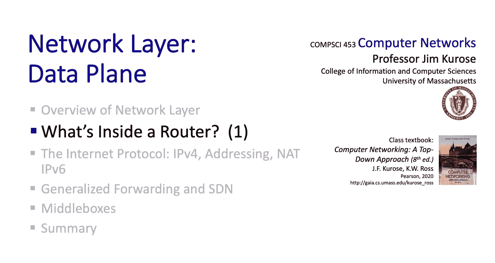

# Jim Kurose《计算机网络：自顶向下的方法｜Computer Networking： A Top-Down Approach》中英（deepseek p28 -28-4.2 Whats inside a router_  Part 1..zh_en -BV1UMtueiEaA_p28-

。Having overview the network layers， data and control planes and understanding the difference between routing and forwarding。

 we're ready to now dive down deeply into the forwarding function in the network layer。

 That is how our packets move from a router's input port to the appropriate output port and there's going to be a lot of ground to cover here。

 and so we're going do this in two parts in the first part。

 we're going to look at a generic router architecture to look at the input ports。

 the output ports and the switching fabric for moving data grants from input to output。

 In the second part， we're going to dive down deeply into the issues of packet scheduling and packet buffering tremendously important topics。

 So it's a lot to cover here so let's get started。The figure that we'll be developing here shows the major components of router architecture。

 Let's start with the input and output ports。 This is where the physical and the link layers are implemented。

 The link layer and physical layer might be wired ethernet。

 optical fiber or some kind of wireless technology。 and， of course。

 key parts of the network layer are also implemented in the input and output ports。

 The number of ports in a router can vary from very small， say。

 half a dozen in a home router to many hundreds of interfaces。

 or ports in a backbone router each operating at many gigabits per second。

Packetss are move from the input ports to the output ports under router control through a switching fabric。

 and this really is the heart of a router， this is the place through which all packets must pass and as we'll see it's really a network within a network router。

A router also has a routing processor， often just a regular CPU that performs control plane functions。

 controls the switch fabric， and installs forwarding tables at the input ports as shown here。

On this diagram， we can also pretty clearly distinguish the router components that belong to the data plane that operate at high speed and are implemented in hardware and the control plane。

 which is implemented in software and running its slower time scales。

Let's now zoom in on the input port and starting from the left。

 let's see what we see here shown in green here， we see a line termination function。

 This is really the physical layer。 It's responsible for receiving the bitlevel transmissions over the physical medium。

 whether it be copper， fiber or wireless。 Then there's the link layer function shown in blue here。

 where bits are assembled into link layer frames like the ethernet frames that we'll study later。

 and finally shown in red here， there's the network layer functions at the input port。

 packetache queuees may form here willll cover that shortly， But for now。

 the thing to remember is that the most critical network layer function performed at the input port is the lookup and forwarding function。

 determining their appropriate output port to which the arriving packet will be forwarded through the switching fabric。

This lookup and forwarding is a type of match plus action behavior In traditional routers。

 the destination address in the packets header that is the IP address of the destination host is going to determine the appropriate output port to which the packet will be forwarded or directed through the switching fabric and we'll take a look at that in just a second a little bit after that。

 we'll take a look at generalized forwarding， where the appropriate output port is determined or can be determined by many fields in the network layer header。

 the link layer frame header or the transport layer segment header。 For example。

 it's possible under generalized forwarding for packet say containing TCP segments bound for a particular destination and say coming from a particular source host to be directed to one output port but have packets say containing UDP segments from that source IP address to be directed to a different output port。

 or maybe not to be forwarded at all， but we're getting ahead of ourselves here。

So let's get started with destination based forwarding。

What you see here is a simple example of a forwarding table and when we think about forwarding tables。

 the first thing to consider is well， there are two to the 32 almost 4 billion possible destination addresses and we certainly don't want a routing table entry for each possible destination address。

 so it probably won't surprise you that routing table entries are often aggregated into ranges as we see here。

In this particular example， any packet with a destination address in this first range of destination addresses goes to output port or interface zero packets with a destination address in the second address range go to Inter one and in this third address range go to Inter two and otherwise the default outgoing interface is going to be interface3 in this example。

Well， this all works out pretty nicely and looks pretty simple。 But， of course。

 the devil is in the details as the saying goes。 What happens， for example。

 when say packets with a destination address and some subset of addresses in this first range should go to interface 3 rather than interface 0。

Well， of course， we could split the first address range into multiple pieces and then add in this new subrange with its new destination output port。

 but it turns out there's a much more simple and more elegant way to do this。

 and this is known as longest prefix matching。Well longest prefix matching is relatively simple。

 instead of using explicit ranges to perform matching， as we saw in the previous slide。

 we want to work with address prefixes as shown here。Here we've got a table with four entries。

 The link to the first prefix here is 21 Bs，1，1，0，0，1，0，0，0，0，0，0，1，0，1，1，1，0，0，0，10。 That's 21 B。

The length of the second prefix is 24 bits， so it's a longer prefix and the third prefix also has 21 bits The stars at the right。

 they represent wildcard or sort of don't care bits。

 they're not part of the prefix they represent the bits in the address range if you will and so you can see here that address ranges and prefixes really are the same things。

 but as we'll see it's a lot easier to work with address prefixes rather than address ranges。

And the longest prefix matching rule works as follows for 32 bit IP address to match a prefix。

 all of the leftmost bits， each and every one of that address must match the ones and the zeros in the prefix。

 and among all of the prefixes that match， we want to find the longest one。

The longest prefix match is sometimes also called the most specific match since the largest number of leftmost address bits are going to be matched。

Take a look at the addresses here at the bottom， can you figure out the prefixes to which they match under the longest prefix matching rule。

 why don't you pause and think about that？Well， the first example here only matches the prefix in the first row of the table。

 so that's easy。 The second address， those more interesting。

Its 21 leftmost bits match this third table entry， but its first 24 bits match the second table entry。

 the longest prefix match thus the second table entry and a packet with this address would be forwarded to interface one associated with the second table entry rather than to interface2。

If you understand these examples， you've definitely got the longest prefix matching rule down。

We'll see shortly that longest prefix matching dovetails really nicely and very naturally with network addressing。

 Well， as we mentioned earlier， this match plus action is usually carried out in hardware。

The matchings often done using what are called Ternary content addressable memories， Tcams。

 where a dress is presented to the Tcam， and the matching values return in one clock cycle。

 regardless of table size。 Tcams thus result in really， really fast lookups。

Once a packet's appropriate output port has been determined by longest prefix matching。

 the packet's ready to be forwarded into the switching fabric。

 Let's take a look at what happens inside that switching fabric。

 The switching fabric is at the very heart of a router。

 Its job is to transfer a packet from the input side of the switching fabric to the output side of the switching fabric。

 That is to move a packet from the input port to the output port that's been determined by the longest prefix match。

😊，One of the most important characteristics of the switching fabric is its switching rate。

 That is the maximum rate at which packets can be moved from an input port to an output port。

 If there are n inputs with incoming rate R， and the switch has a switching rate of n times R。

 Then all of the packets that arrive in some unit of time can be switched to their output ports during that much time。

 In this case， packets won't experience much of a significant weight on the input side of the switch。

 This is known as a non blocking switch。 But highpe non blocking switches are more expensive than switches that might say only occasionally block packets and force them to wait at the inputs。

 And so not all routers have non blocklocking switch fabrics。

 If there's blocking and packets are going to have to wait their turn to be transferred through the switch fabric in these red boxes here on the input side of the switch fabric。

 and this is known as input port queuing。😊，Now the topic of how to build high speed， efficient。

 economical switching fabrics is itself a field of study。

 actually there are entire courses dedicated to this topic and so you might want to take one if you find this interesting。

 so here we're only going to touch very lightly on this topic。As shown here。

 we can broadly identify three approaches towards switching， switching via memory。

 switching via a bus and switching via an interconnection network。

 And it's really this latter approach that's probably the most widely adopted in practice。Well。

 way back in the day， that's to say the 1970s and 1980s。

 the first routers were really pretty much traditional computers。

 with switching between input and output ports being done under direct control of a CPU。

 which you could sort of think of as a routing processor。

Input and output ports functioned as traditional IO devices in a traditional operating system。

 an input port with an arriving packet would signal the CPU via an interrupt。

 The packet could then be copied from the input port buffers into processor memory。

 the CPU would then use the destination address to look up the appropriate output port。

 the output device in the forwarding table and then write that packet's contents into the output device's buffers。

 And so in many ways you can see the network ports were really just another type of IO device。

Rather than moving a packet from an input port to memory and then from memory to an output port。

 switching via a bus skips that intermediate transfer to memory and allows an input port to write the packet directly into the output port buffers。

 This means a packet only has to cross the bus or the back plane once rather than twice。

 and in this case， the switching speed is limited to be the bus bandwidth。

The third type of switching fabric are interconnection networks。 and really。

 these are the most interesting。 Interconnection fabrics and routers share a lot in common with interconnection networks that have been used for decades to connect processors together in multiprocessor computing systems。

 There are crossbar switches that directly connect n inputs to n outputs through n squared interconnection points。

 but more typically when connecting n inputs to n outputs， multistage switching networks。

 known generally as cross networks are used these multistage switching networks are made up by interconnecting smaller size switch elements both serially that is in multiple linear stages and in parallel across a given stage In the example shown here in8 by8 switching networks is made up of four4 by four and 42 by two smaller switches。

 We'll see cross networks again when we learn about how hosts are interconnected and data center networks。

Because these switching fabrics have parallel paths from their input side to their output side。

 we want to be able to leverage these paths in parallel。

 And so it's common with these switching fabrics to divide a single datagram into multiple smaller fixed length units。

 sometimes called cells and to switch these cells along parallel paths from the input to the output side of the switching fabric。

 The original datagram is then reassembled from those component cells that it was divided into at the output port。

 After all， the datagram's pieces have arrived。😊，Well， so far。

 we've thought of a switching fabric really as a single entity。

 but as we just saw with interconnection networks， parallelism can be exploited to build high performance switches。

 and this idea can be generalized to taking multiple switching fabric planes and using them in parallel as shown here in this diagram here is actually a schematic of Cisco's carrier routing system that has a basic unit with eight parallel switching planes。

 each of which internally has a threetage interconnection network。

 as you can see by exploiting parallelism， hundreds of terabbits of switching capacity can be achieved within a single router。

So that wraps up our first of two parts on what's inside a router。

 we took a look a broad brush view of what a router architecture looks like， we saw the input ports。

 switching fabrics and output ports， and we looked at addressing in some detail what we're going to do next is we're going to dive down deep into the output ports in particular and take a look at packet buffering and packet scheduling。

