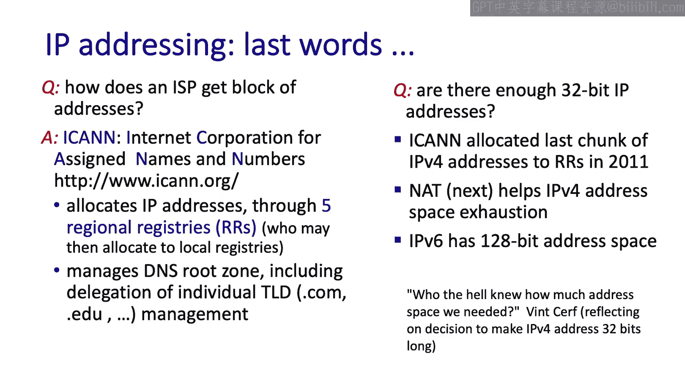
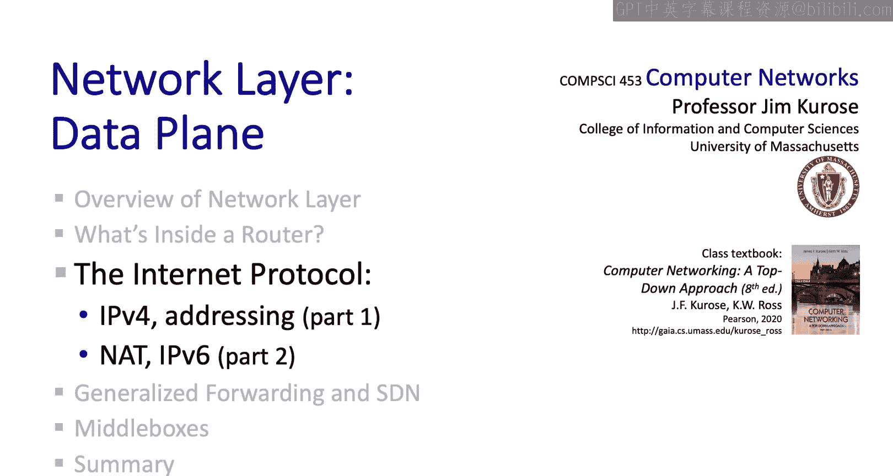

# 计算机网络：4.3：互联网协议（第一部分）🌐

在本节中，我们将深入探讨互联网的网络层。由于内容较多，我们将分两部分进行。在第一部分，我们将涵盖IPv4协议和寻址。

显然，IP协议极其重要，但寻址也同样重要。实际上，寻址是IPv4的一部分。我曾认为寻址是简单直接甚至有些枯燥的，但我后来了解到，寻址与ISP之间的关系、管理边界、小到路由表查找和硬件的技术问题，大到全球寻址和转发的实现方式都密切相关。因此，寻址实际上非常重要且相当有趣。

在第二部分，我们将介绍网络地址转换（NAT）和IP的新版本——IPv6。我相信你会发现这些内容很有趣。

那么，让我们从互联网网络层的宏观视角开始。

## 网络层概览

还记得我们之前学习过网络层的控制平面和数据平面，以及转发表。转发表是路由器的本地表，用于确定路由器将传入数据报转发到哪个输出端口。

在网络层简介中，我们也了解到，转发表的内容由分布式路由协议或路由器外部的SDN控制器决定。当我们研究网络层的控制平面时，会涵盖路由算法和SDN控制器。

互联网网络层的一个关键部分当然是IP协议，这个著名的协议。但IP协议到底是什么？通过查看下图，你可以看到IP协议不涉及路由算法或SDN控制器，那些是控制平面的功能。相反，IP协议是关于数据报格式、IP地址的结构和解释方式，以及数据包处理规范（例如如何将大数据包分片成小数据包）。因此，IP只是互联网网络层的一部分，尽管是非常重要的一部分。

ICMP协议（我们将作为网络层控制平面的一部分来介绍）也是网络层的一部分。

既然IP协议是关于数据报格式、寻址和数据包处理规范的，那么让我们通过查看IP数据报格式来开始对IP的研究。

## IPv4数据报格式 📦

我们将使用下图来逐步讲解IP数据报的各个字段。我知道这看起来可能有点枯燥，但任何学习网络课程的人确实需要了解这些，就像吃蔬菜一样，对你有益。所以你必须学习它，希望你甚至会喜欢它或觉得它有趣。

首先，是版本号字段。这4位指定了数据报的IP协议版本。这里我们看的是IPv4头部。

因为IPv4数据报可以包含可变数量的选项（我们在数据报头部这里看到），所以头部长度字段指示头部有多少字节。这让主机或路由器知道IP数据报中有效载荷实际开始的位置。

大多数IP数据报不包含选项，因此典型的IP数据报头部从这里到这里，是一个20字节的头部。

数据报长度字段指示IP数据报头部加有效载荷的总字节数。这是必需的，因为有效载荷也可以是可变大小的。由于该字段是16位长，IP数据报的理论最大大小是64KB。但数据报通常不大于1500字节，这允许数据报能很好地放入最大尺寸的以太网链路层帧的有效载荷字段中。

服务类型比特包含在IPv4头部中，以区分不同类型的数据报。这些比特的定义和使用方式随着时间的推移而演变。就我们的目的而言，最重要的服务类型比特是用于显式拥塞通知（ECN）的2个比特。还记得吗，这是我们在传输层详细研究过的主题。路由器设置这两个比特来指示拥塞。其余6个服务类型比特用于区分不同的流量类别，然后可以使用我们上一节刚刚研究的缓冲和调度算法，根据它们的流量类别提供不同的服务。

TTL字段是一个计数器，每次数据报通过路由器时减1。如果TTL计数达到0，数据报必须在路由器处被丢弃。因此，TTL字段用于确保数据包不会永远循环，或者在存在转发环路时不会循环很长时间。

上层协议字段指示此IP数据报中的有效载荷将被传递给哪个传输层协议。例如，值6表示此数据报包含一个将被传递给TCP的TCP段。值17表示有效载荷是一个UDP段。

IP标识字段、标志和分片偏移字段在单个大的IP数据报被分片成多个较小的数据报时使用。这不常发生，实际上这些字段甚至没有出现在IP版本6中，所以我们在这里不再多说。你可以通过查阅我们教科书中的指引来了解更多关于它们的信息。

头部校验和是根据IP头部内容计算的互联网校验和。记得我们之前学习过互联网校验和，并且要注意，由于IP头部的一些字段在数据报每次通过路由器时都会改变（例如TTL字段递减），校验和需要在数据报通过的每个路由器上重新计算，这可能很耗时。也许正因为如此，头部校验和字段在IPv6中也去掉了。

我们已经讨论过32位的源和目的IP地址字段。记得我们刚刚在基于目的地的转发中看到，IP路由器使用数据报的目的IP地址来查找数据报应转发到的适当路由器输出端口。

最后，数据报头部中有许多可选字段，我们在这里跳过它们。当然，还有数据报的有效载荷本身，有效载荷是IP将传递给传输层协议的数据传输层段。

我们思考并讲解了很多字段。正如我们提到的，IPv6比IPv4精简得多，因此我们会在那里发现更少的头部字段。

## IP寻址基础 🏷️

让我们从几个基本概念开始讨论IP寻址。

首先要知道的重要一点是，IP地址本身并不标识主机或路由器，而是标识一个接口，即主机或路由器上的链路层接口。路由器几乎总是有多个接口，也就是说有多个传入和传出链路。主机也经常如此。例如，我的笔记本电脑有一个有线以太网接口和一个无线802.11接口，每个都有不同的IP地址。

正如我们所见，32位IP地址以所谓的点分十进制表示法书写，每个十进制数对应地址字段中的一个8位字节。这里，32位二进制地址的点分十进制表示是223.1.1.1。

看这张图，你可能会觉得有点不满足。这些链路层接口，这些黑线，似乎模糊地终结在一个蓝色的云里。这是怎么回事？这些接口实际上是如何连接在一起的，以便一个接口可以与连接到同一蓝色云的另一个接口直接通信？

请记住，我们现在处于网络层，这些接口的连接是通过链路层技术完成的，链路层是我们正在研究的层之下的一层。所以，对你问题的一个回答是：耐心点，我们马上会讲到。但如果你迫不及待想看到完整的图景，这里就是。主机和路由器接口可能通过有线以太网交换机连接，也可能通过802.11无线网络连接。但会有一个链路层、局域网或点对点链路协议（实践中通常是以太网或Wi-Fi）用于连接这些接口。我们确实会在稍后学习这个。所以请保持关注。现在，回到网络层。

如果你仔细观察这个图，特别是图中的IP地址，你会注意到彼此连接的接口具有相似但不完全相同的IP地址。这是因为它们都属于同一个子网。

那么，什么是子网？每个子网是网络的一部分，包含所有无需通过中间的第3层（即网络层）路由器即可相互到达的设备。也就是说，它们通过某种链路层技术直接相互连接。

以下是这与寻址的联系。一个IP地址有两部分：子网部分和主机部分。如果两个接口在同一个子网上，它们的IP地址必须有一个共同的子网部分。当然，它们的主机部分不同。

让我们非常具体地定义子网。要定义一个子网，将每个接口从其主机或路由器上分离出来，就像我们在这里做的那样。这将留下孤立的网络岛屿。所以在这个例子中，我们有三个子网。

现在让我们看看寻址。记住，同一子网上的接口将具有相同的IP地址子网部分。所谓的子网掩码说明了它们的高位有多少位是相同的。我们假设是24位。

在这种情况下，这里的下子网有一个24位地址223.1.3。我们说223.1.3/24。这三个接口的地址都以223.1.3开头。

下一个子网是223.1.1/24。注意这四个接口的地址以223.1.1开头。第三个子网地址是223.1.2/24。

让我们看看这个有三个路由器和七个主机的网络。你能找到子网吗？想一想。

让我们断开接口与其主机/路由器的连接以查看子网。

以下是/24子网地址。

我们一直在使用的这种斜线表示法有一个名字，叫做无类别域间路由（CIDR），由于其历史渊源，实际上发音为“cider”。

地址的子网部分可以是任意数量的比特X，一个CIDR化的地址形式为A.B.C.D/X，其中X是子网地址中的比特数，有时当D为0时可以省略。这里是一个32位IP地址及其CIDR化点分十进制表示法的例子。

## 如何获取IP地址？❓

让我们通过提出一个你可能一直在想的问题来结束对IPv4和寻址的讨论：首先，一个人实际上是如何获得IP地址的？这实际上是两个问题：主机如何获得与其将要加入的子网相关的子网范围内的地址？以及更大的问题：网络（子网）如何获得将被该子网内设备（接口）使用的地址范围？让我们看看这两个问题。

让我们从第一个问题开始。主机如何为其接口获取IP地址？在过去，系统管理员实际上需要手动将IP地址编辑到该主机上的一个文件中。但自那以后我们已经进步了很多，使用即插即用或有时称为零配置的方法，也就是说，使用主机和服务器之间的协议而不是手动配置来获取IP地址。零配置方法的必要性是显而易见的，全球有数十亿台主机，其中一半以上是移动的，这些主机不断地连接到网络，然后断开连接，再连接，如此反复。

主机在网络上获取IP地址所使用的协议称为DHCP（动态主机配置协议）。为了使用DHCP分配即插即用的IP地址，网络需要有一个DHCP服务器来执行该功能。到达的客户端（即想要IP地址的主机）将使用DHCP协议从DHCP服务器请求并接收IP地址。当主机离开网络时，它将放弃其IP地址，该地址随后可以被另一台主机重用，或者稍后被该主机续订。

我们将研究四个要学习的DHCP消息，还有更多，但这些是关键的消息：发现、提供、请求和确认。让我们看看DHCP是如何工作的。

这是我们之前见过的简单网络场景。在这个网络中，我们看到DHCP服务器在这里。通常，DHCP服务器会与路由器放在一起，并为该路由器连接的所有子网提供服务，但我们在这里将其显示为一个单独的服务器，其IP地址为223.1.2.5。

这是到达的客户端，它想要一个在223.1.2/24子网内的IP地址。现在让我们看看DHCP客户端-服务器消息交换实际上是什么样子的。

第一步，到达的客户端广播一个DHCP消息，该消息将被其正在连接的子网中所有主机和路由器的接口接收。发现消息基本上是说：“嘿，外面有DHCP服务器吗？”这是一种服务发现形式。主机知道它需要DHCP服务，因此它发送广播来发现可以提供DHCP服务的服务器。DHCP运行在UDP之上。客户端使用端口68，服务器将使用端口67。特别是，服务器将在与UDP端口67关联的套接字上监听传入的DHCP消息。

以下是DHCP发现消息中字段的详细信息。包含DHCP发现消息的UDP段的客户端源IP地址是0，因为客户端还没有IP地址。目的IP地址是IP广播地址，即全1，255.255.255.255。UDP目的端口号是67，正如我们刚才提到的。希望子网上某处会有一个DHCP服务器在监听这个服务发现消息。还要注意有一个事务ID字段，这里的值是654，客户端将使用它来匹配对此请求的任何回复。

第二步，任何接收到此广播发现消息的DHCP服务器（可能有多个这样的服务器）都可以用DHCP提供消息回复。这条消息基本上是说：“嘿，我是一个DHCP服务器，这是你可以使用的一个IP地址。”

如果我们查看此提供消息的详细信息，我们看到它来自IP地址为223.1.2.5的DHCP服务器（如前图所示），端口号为67。此提供消息正在广播到子网上的所有接口。DHCP消息包含请求主机可以使用的IP地址，即“你的互联网地址”字段，以及一个使用期限（本例中为3600秒）。注意，这里的事务ID与初始提供消息的事务ID匹配，也就是说这是对该消息的回复。客户端可以从多个DHCP服务器接收提供，例如，如果该子网上有多个路由器，就可能发生这种情况。

我们在这里看到的前两个步骤实际上是可选的。思考第三步的方式是（如果两个可选步骤没有执行，这也可以是第一步）：到达的客户端进来说：“嘿，这是我想使用的一个IP地址。”也许这是它在步骤2（如果该步骤已执行）中被告知可以使用的IP地址，或者也许它已经拥有的一个地址（在这种情况下客户端实际上是续订对该地址的使用），或者也许是客户端以前使用过的地址。

你可以看到，此消息也是广播的，它包含主机提议使用的IP地址，并且有一个新的事务ID和使用期限。

最后一条消息是来自DHCP服务器的ACK消息，基本上是说：“好的，你可以在给定的使用期限内使用那个IP地址。”

事实证明，主机需要比仅仅一个IP地址更多的配置参数才能正常工作。特别是，它还需要知道第一跳路由器的IP地址，因为来自客户端的任何传出数据包都需要发送到该第一跳路由器。它可能还需要使用的DNS服务器的地址，以及子网掩码（其IP地址中属于子网的比特数）。所有这些都可以手动配置，但也可以在DHCP消息中可选地指定，通常情况就是这样。

## 网络如何获取地址块？🌍

那么，我们仍然需要问的另一个真正的大问题是：网络如何获得一个地址范围来分配给其网络中的设备（实际上是设备接口）？在许多情况下，它将从其所属的ISP拥有的IP地址范围内分配到一个地址范围。

在这个例子中，较高级别的ISP有一个/20地址范围。然后，这个ISP可以将其地址空间分成8个，比如说/23地址范围，如图所示，并将这些地址范围中的每一个分配给它八个客户网络中的一个。

现在我们可以开始看到寻址和路由之间真正关键的联系，当我们讲到网络层控制平面时，我们会再次回到这个问题。在这个例子中，父ISP（我们称之为Fly-By-Night ISP）有八个客户ISP，如图所示。Fly-By-Night只需要向全球互联网的其他部分通告一个地址前缀：200.23.16.0/20。这个单一的通告地址前缀足以让互联网的其他部分能够路由到这个ISP地址范围内的2^12个地址。

这是一个称为地址聚合（有时也称为路由聚合或路由汇总）的例子。注意，在这个图中，第二个ISP（我们称之为ISPs-R-Us）说：“嘿，把地址范围199.31.0.0/16内的任何东西发给我。”我们马上会回到这一点。

这一切看起来非常整洁有序，但在生活中，事情通常不那么整洁或完美地分层。特别是，让我们问自己，如果八个客户ISP中的一个（比如说组织1）想要将其ISP从Fly-By-Night更改为ISPs-R-Us，同时保持其网络地址范围200.23.18.0/23，会发生什么？Fly-By-Night继续像以前一样说：“把地址前缀200.23.16.0/20内的任何东西发给我。”但关键点在这里。现在ISPs-R-Us说：“嗯，像以前一样把地址范围199.31.0.0/16内的任何东西发给我，但现在它也说把地址范围200.23.18.0/23内的任何东西也发给我。”注意这里的/23，并且注意200.23.18.0/23包含在Fly-By-Night通告的200.23.16.0/20地址范围内。那么我们该怎么办？这里绝对关键的是，ISPs-R-Us通告了一个更长的23位前缀200.23.18.0/23，一个比Fly-By-Night通告的20位前缀200.23.16.0/20更具体的前缀。

我希望，哦，是的，你的脑海中刚刚亮起了一个灯泡。记得当我们研究转发表时，当我们查看路由器内部时，在查找一个32位IP地址时，匹配的转发表条目是具有最长前缀匹配的那个。这正是为什么地址在组织1地址范围内的数据包将被转发到ISPs-R-Us，因为它通告了更长的前缀。

## 总结与展望 📚

我们现在已经看到了地址分配、使用最长前缀匹配的转发表查找以及传播前缀的BGP路由协议是如何真正紧密联系在一起的。如果你理解了所有这些，你真的掌握并串联了许多关键概念。如果还不是100%清楚，我们研究控制平面时会再次回到这个问题，但如果你还没有完全掌握，也许现在再多思考一下。

我们已经看到了主机如何从DHCP服务器获取IP地址，也看到了客户ISP如何从其提供商ISP获取地址范围。但我们仍然没有回答最高层次的基本问题：ISP如何获得一个地址块？这个最后问题的答案是，IPv4地址空间由一个称为互联网名称与数字地址分配机构（ICANN）的实体拥有、管理和分配。

ICANN进而将地址分配给五个区域注册机构，然后这些注册机构将其部分地址空间分配给ISP。

ICANN还执行许多其他关键的互联网功能，例如管理根DNS服务器、管理域名和分配协议号。记得当我们研究IPv4数据报格式时，我们说上层协议号6对应TCP，数字17对应UDP，这些数字也由ICANN控制。

让我们通过考虑IPv4的32位地址空间来结束这里。2011年，ICANN中央将其可用的32位地址空间的最后一块分配给了区域注册机构。ICANN已经没有更多的地址空间可以分配，尽管区域注册机构中仍有一些未使用的地址空间。在下一节中，我们将研究网络地址转换（NAT），这是一种允许多个IP设备使用单个IP地址的技术，我们还将研究IP版本6（IPv6），它拥有更大的128位地址空间。IPv6始于20世纪90年代，正是因为IETF预见到了IPv4地址空间的耗尽。

你看到这里引用了文特·瑟夫的话，他和鲍勃·卡恩一起，如果必须只选两个人，我们真的可以将其视为互联网的两位奠基人之一。他们都被问了很多关于后来发展成为今天互联网的实验性ARPANET的早期日子，特别是关于32位IPv4地址空间的问题。

我喜欢文特的这句话：“谁知道我们需要多少地址空间？”记住，当今天的互联网架构在20世纪70年代被定义时，它是一个相对较小的国防部项目。

所以，让我们把最后的话留给文特·瑟夫。2017年我在华盛顿特区工作时，在乔治城大学听他做了一个非常棒的“炉边谈话”类型的演讲，他谈到了很多非常有趣的话题，但其中一个与IP的32位地址空间有关。所以让我们听听文特怎么说：我们实际上是如何最终确定32位地址空间的？他们经过了什么计算？看一看。

“所以现在我们有四种不同的网络：以太网、分组无线电网、分组卫星网和ARPANET，原始的ARPANET。所以我们坐下来试图弄清楚我们将如何做到这一点，大约六个月后，我们设计了今天使用的基本协议，就是TCP，后来我们分离出用于实时通信的互联网协议。那么问题是，你知道，我们预计这会有多大？老实说，我们坐下来讨论，这将被国防部使用，它必须在世界各地工作，因为你永远不知道国防部将不得不在哪里运作。所以我们说，好吧。这会有多大？它必须是全球性的。每个国家会有多少网络？我们说，嗯，我们已经完成了ARPANET，这是一个非常重要的国家级网络，所以我们想，也许每个国家会有两个，这样会有一些竞争。所以我们说，好吧，两个。有多少个国家？那时候没有谷歌可以问。所以我们猜是128，因为那是2的幂，这就是程序员的思维方式。所以2乘以128是256个网络。那是8位的标识符。然后我们说每个网络会有多少台计算机？我们说，记住这是1973年，这些是巨大的空调计算机，你知道，以分时模式为400人服务，所以我们说，1600万怎么样？你知道，什么？所以1600万是24位，所以我们最终得到了一个32位的地址空间，如果你计算一下，是43亿个可能的网络终端，在1973年，我认为这个数字比当时世界上的人口还要多。所以我们想，嗯，这应该足够做这个实验了，对吧？所以我们用了这个。所以，人们说，如果你能重来一次，你知道，你会怎么做？一个答案是，嗯，我想我会选择128位的地址空间，这样我们就不必经历这个痛苦的过渡。另一方面，你能想象在论坛上提出一个论点吗：我需要3.4乘以10的38次方个地址来做这个实验。你现在有多少个网络？三个。网络上有多少台计算机？500？他说，有些东西不太对劲，是吧？所以我没有这么做，因为我无法通过‘脸红测试’，但我希望我能做到。”

---

**本节课总结**

在本节课中，我们一起深入学习了互联网网络层协议IPv4的核心内容。我们首先回顾了网络层的整体架构，明确了IP协议在数据平面中的核心地位。接着，我们详细剖析了IPv4数据报的格式，逐一讲解了版本号、头部长度、服务类型、TTL、上层协议、头部校验和以及源/目的IP地址等关键字段的作用。

然后，我们转向了IP寻址这一重要主题。我们明确了IP地址标识的是接口而非设备本身，并引入了子网的概念。通过CIDR表示法，我们理解了IP地址如何划分为网络前缀和主机部分，以及子网掩码的作用。

最后，我们探讨了IP地址的获取机制。从微观层面，我们学习了DHCP协议如何通过“发现-提供-请求-确认”四步交互，为主机动态分配IP地址及其他网络配置参数。从宏观层面，我们了解了ISP如何从区域注册机构获取地址块，并通过地址聚合与最长前缀匹配原则，揭示了全球互联网路由可扩展性的关键机制。我们还简要提及了IPv4地址空间的耗尽问题，为下一节学习NAT和IPv6做好了铺垫。

通过本节课的学习，你应该对IPv4协议的基本原理、数据报结构、寻址方式以及地址分配机制有了系统性的认识。这些是理解互联网如何工作的基石。