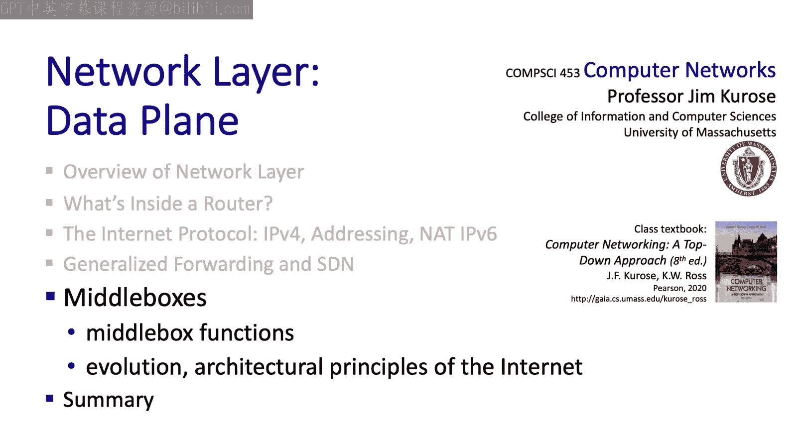

# Jim Kurose《计算机网络：自顶向下的方法｜Computer Networking： A Top-Down Approach》中英（deepseek p33 -33-4 5 Middleboxes, Internet architecture.zh_en -BV1UMtueiEaA_p33-

。Going to wrap up our study of the data plane here by taking a step back and taking a big picture view of the network layer and of internet architecture。

 so in some sense there's nothing new in a technically detailed way but I think we'll encounter a lot of interesting ideas here we're going to start with middle boxes which we've already seen in the context of generalized forwarding and then again we're going to step back and take a big picture view of internet evolution and internet architecture I think you'll find this really interesting。

R 32，34 defines a middle box as unquote any intermediary box performing functions apart from normal standard functions of an I router on the data path between a source host and a destination host。

 And let's flag two phrases here。 First， the standard functions of an I router mentioned here。

 means basically destination based forwarding of I datagrams that we've seen earlier。 And second。

 note by this definition， a middle box sits on the data path between hosts。

 So it's definitely a network layer data plane function occurring in the network core。

 say as opposed to at an end host。 That's the essence of a middle box。

And we've seen how generalized forwarding the match plus action abstraction can be used to implement a lot more than just quote unquote。

 the normal standard functions of an I router。 We've seen how Na and firewalls can be implemented in middle boxes using generalized forwarding。

 another popular type of middlebox is a load balancer that routes H TTP requests， for example。

 to any of a number of mirrored copies of a web server。

 A load balancer is sometimes called a layer 7 switch or an application layer switch because it acts on application layer headers。

 For example， in this case， to route to load balance H TTP requests across multiple server copies。

The web caches that we studied in Chapt 2 are also a type of middle box。

 although storage and computation are involved here also not just forwarding。

 and more generally we might even think of content distribution networks as a type of middle box that operates at both a network and at the application layer to provide distribution services for content such as streaming media。

The proliferation of middle boxes and networks started about 10 years ago。 Initially。

 these middle boxes were proprietary with closed hardware and software。

 You'd buy a proprietary middle box， just like you'd buy a proprietary router。

 and that was 10 years ago。 More recently， there's been a move towards what's known as white box hardware。

 White box hardware can be essentially programmed specialized， for example。

 via an API like flow tables in openflow by the owner operator。

 The software then implements specific middle box functionality on top of this generic white box hardware。

Mark Andreson， who created Mosaic， one of the earliest internet browsers and cofounded Netscape。

 has famously said that software is eating the world。

 and in many senses we can see this becoming true in the networking world as well。

 we've already seen the importance， for example， of software in software defined networking and beyond SDN。

 there's a move afoot known as NFV network functions virtualization that takes the notion of virtualization。

 control plane， data plane separation， hardware， white boxes specialized by software and takes these to more generalized in network services that require not just networking。

 but computation and storage as well。So we've seen that Na。

 firewalls and other middle boxes are performing network layer functions far beyond quote unquote the normal standard functions of an IP router。

 and so a natural question to ask might be， well， are they really part of the network layer and to answer that question。

 I one to start here with a diagram that's known as the IP hourglas normally we've been drawing the internet protocol stack as a rectangle。

 but this diagram accentuates what's known as the thin waste of the Internet protocol stack while the internet has many protocols in the physical length transport and application layers as we've seen。

 there's only one just a single network layer protocol。

 the IP protocol that we've learned about here， IP is the one protocol that absolutely has to be implemented in each and every of the billions of Internet connected devices。

This thin waste hides the fact that networks with very different underlying link layer technologies from ethernet to WiF to cellular to optical are all part of the internet。

 IP hides that heterogeneity in looking up the protocol stack from the network layer。

 IP provides a simple substrate connectivity on which application layer services can then be built。

Well， this I hourglass is arguably about 40 years old now。

 which makes the internet middle aged in human years。 And depending on how old you are。

 you may be aware of how a thin waste Well， tends to spread out just a bit at middle age。 And indeed。

 one might argue that this thickening of the waste is happening in the Internet today as well as we see here with the proliferation of net boxes。

 firewalls， caching load balancers and NFV。 these middle boxes perform functions far beyond simple destination based I forwarding。

And so you might ask yourself then， well， how does the proliferation of these middle box functions fit into the overall vision of the internet's architecture and if you're wondering about this。

 you'd then first ask yourself， what are those architectural principles of the internet in the first place？

Well， RF，1958 addresses exactly this question。 It says。

 and I'm just going to read it here that quote unquote。

 many members of the Internet community would argue there is no architecture， but only a tradition。

 which was not written down for the first 25 years。

 or at least not by the Internet architecture board。 however， in very general terms。

 The community believes that the goal is connectivity。

 The tool is the Internet protocol and the intelligence is end to end rather than hidden in the network。

 Well， so there you have it， three cornerstone beliefs。 First。

 the goal is to deliver I packets between and hosts。2。

 the Internet protocol I is called out as the narrow waste。 And third and finally。

 that intelligence is end to end rather than in the network itself。

 And you might wonder about this last point。 What does it really mean， Well。

 the last point is sometimes referred to as the end to end principle。

 which was articulated pretty nicely in a paper by the title end to end argumentsments and system design。

 which is where I think this came from。The end to end paper addresses the question of where to implement functionality。

 such as reliable data transfer and congestion control。

 That functionality could be implemented either in the network or at the network edge。 For example。

 we know that the internet's reliable data transfer and congestion control mechanisms are implemented in TCP at the network edge。

 but it need not be that way， reliable data transfer acting and naing and congestion control could be implemented hop by hop at every router。

 for example， along the path from source to destination， and indeed。

 there are special cases where this is done。 However。

 there could still be failure scenarios that require recovery actions that can only be taken at the end to host。

 in the end to end paper argues that when that's the case。

 you want to implement that functionality at the edges。

 So it notes that there are some functions that quote unquote。

 it be completely and correctly implemented。Only with the knowledge and help of the application standing at the endpoints of the communication system。

 therefore， providing that question function as a feature of the communication system。

 what they mean there is that within the network itself is not possible。

They go on to say that they call this line of reasoning against low level function implementation。

 again， that's to say， within the network， the end to end argument。

And when I think about this notion of intelligence at the edge of the network。

 I remember a diagram that I saw maybe 20 years ago， and I don't remember where it came from。

 pictureture had a brain for intelligence and a brick for simple and maybe not so smart。

 That diagram was comparing the architecture of the telephone network to the architecture of the Internet and was asking the question。

 Where's the intelligence， Where's the complexity， Where are functions implemented And the figure looked something like this。

Okay。The 20th century phone network had dumb network endpoints。 Well， really because it had to。

 The endpoints were rotary phones that maybe only your parents or grandparents remember。

 they weren't computers， they really were dumb devices。 and therefore。

 the phone network had programmable switches that were really quite smart by comparison。

 all functionality。 Well， all of the intelligence was implemented within the network。 It had to be。

 The end systemss couldn't do anything more than send dial clicks or dial tones and send audio signals。

 Now， when the Internet came along。 The endpoints and the switches were both programmable computers。

 So where to put the complexity。 RF 1958 that we just saw the RF that lays out the three architectural principles of the Internet says that unquote intelligenceligs end end rather than hidden in the network。

That puts the intelligence clearly at the network edge like we see here。

 and that's possible because the edge devices are smart。 They're programmable。 Well。

 that's the diagram As I remember 15 or 20 years ago。 And since then。

 as we see the rise of middle boxes and SDN。 we're now seeing intelligence in software layered on top of dumb white boxes within the network。

 So I might add a brain here today。And with data centers and content distribution networks。

 we see even smarter and more sophisticated application level infrastructure being connected at points within the network。

 so now there are clearly much， much bigger and much。

 much more computationally intensive and complex endpoints， if you will， in today's internet。

Well that wraps up our study of the data plan and wow have we learned a lot。

 we've covered a ton of material， we started out by looking at network services。

 then we dove down deep inside a router， we looked at input ports and output ports。

 switching fabrics， queuing， buffer management there， we covered the Internet protocol。

 we looked at the datagram format， we looked at IP addressing。

 we looked at Nat we looked at IP version 6 we then covered generalized forwarding and finished up with a discussion of middle boxes and a discussion of internet architecture。

 really the big picture point of view and I hope you found all that really interesting where we headed next well we're still in the network layer。

' going to take a look at the network layer control plane that's coming up next so hope you'll stay tuned。

