# Jim Kurose《计算机网络：自顶向下的方法｜Computer Networking： A Top-Down Approach》中英（deepseek p34 -34-5.1 Introduction to the Network-layer Control Plane.zh_en -BV1UMtueiEaA_p34-

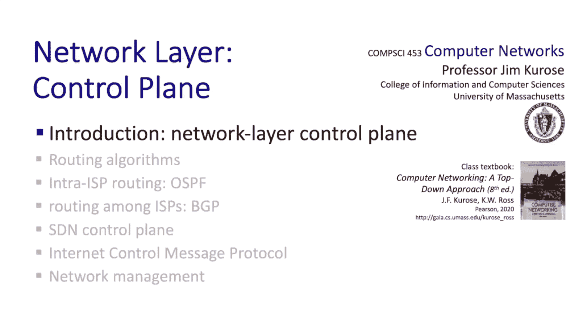

Well， we're ready to move into the control plane， Chapt 5 in our textbook。

 we're going to be staying in the network layer， but we're going to shift our focus from the data plane。

 which we studied in chapter 4 into the control plane and in making this shift we're going to be moving from looking at individual routers in the data plane that per router function。

 moving packets from input ports to output ports to a more network wide view。

 looking at problems of routing， for example， how to determine paths from source to destination and we'll also look at issues of network management and network configuration I think you're going to really enjoy this chapter a lot because there's been a lot of innovation in the network control plane。

 particularly in the last five to 10 years with the introduction of software defined networking which well cover in our discussion here So I think you're going to really enjoy this。

 Stay tuned。So as always， our approach will be to start with principles。

 but then also to cover practice as well。 So starting with principles。

 we're going to begin by looking at routing algorithms and we'll see that there are basically two types of routing algorithms。

 more centralized Li state Dxtralike algorithms and then more distributed Belman Ford type algorithms and we'll cover both of those。

 I think it's fair to say that just about every internet routing algorithm either adopts a Li state Dxtralike algorithm or distributed Belman Ford type of approach in terms of principles will then take a look at the concept of software defined network controllers。

 the platform where routing and other network and management configuration activities happen and then finally we'll cover some of the principles involved in network management and also network configuration management。

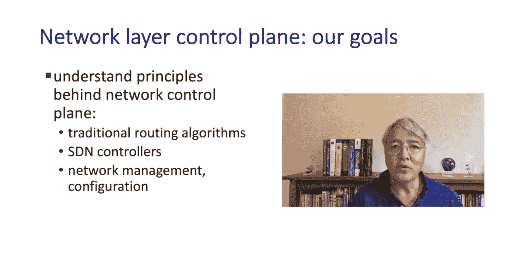

And then we'll take a look at seeing our principles in practice in today's internet。

 We'll take a look at how Dyktra's algorithm and the Belmon Ford algorithm are implemented in the open shortest path first protocol OSPF。

 the B Gateway Pro BGP respectively。When we look at the implementation of software defined networking。

 we'll look at the OpenFlo protocol， the protocol that really got SDN started。

 and then we'll take a look at two open source controller platforms。

 the Open daylight controller ODL and the Onus Control。

 we'll wrap up our principles and practice study of the control plane by looking at the Internet control Meage protocol。

 ICMP， and the simple network management protocol SNMP。

 and the Necom protocol that helps with both network Control and Con management。

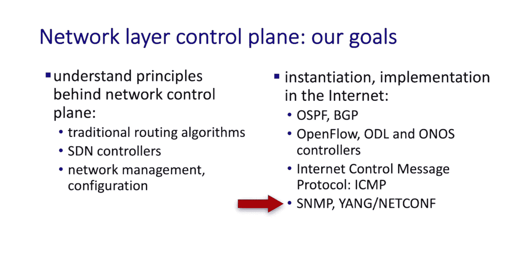

Now， as we make our way through the network control plane。

 we're going to be interleaving both principles in practice。 Following this introduction。

 we're going to take a look first at routing algorithms。

 we're going to take a look at both the link state and the distance vector algorithms that we talked about before the Dyktralike algorithms and the Belman Ford type of algorithms。

 Then we're going to look at the embodiment of these algorithms in internet protocols。

 We're going to take a look at open shortest path first OSPF。

 which takes a link state approach to routing within a network。

 that's sometimes called intra domain routing for routing within a network。

 Then we're going to take a look at BGp， the border gateway protocol。

 That's an inter domainomain routing algorithms。 It's for routing among and between administrative systems between networks and we've seen already。

 of course， that the internet is a network of networks and it's BGP that's going to allow all。

of the networks that comprise the global internet to actually route to and from each other For that reason BGP is sometimes called the glue that holds the internet together So following routing algorithms and routing protocols we're then going to take a look at software defined networking。

 We're going to look at the principles involved in logically centralized controllers for SDN then we're going to take a look at two SDN controllers in particular ODL。

 the opendaylight controller and the onus network controller then we're going to look at the Internet controller message protocol ICMP。

 we're going to wrap up with a discussion of network management。

 and also a little bit on network configuration We'll look at SNmpP。

 the simple network management protocol and netcom and Yang。

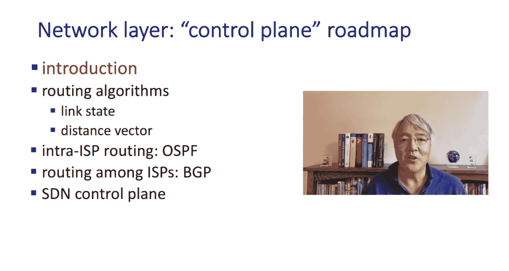

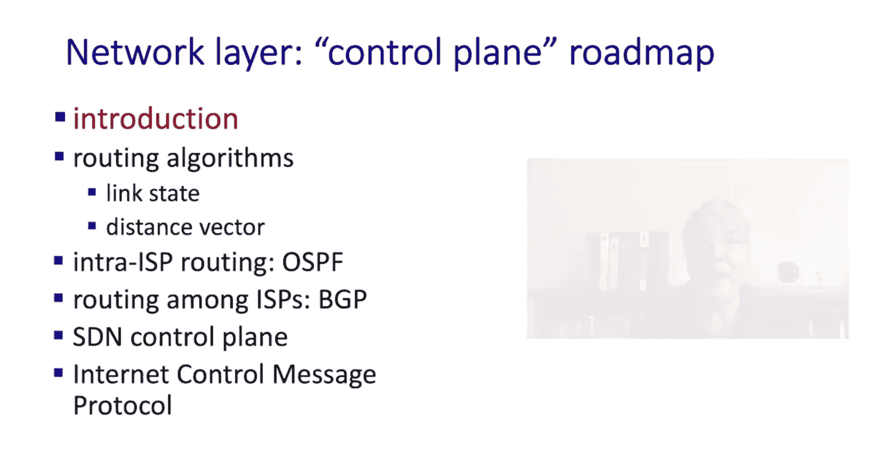

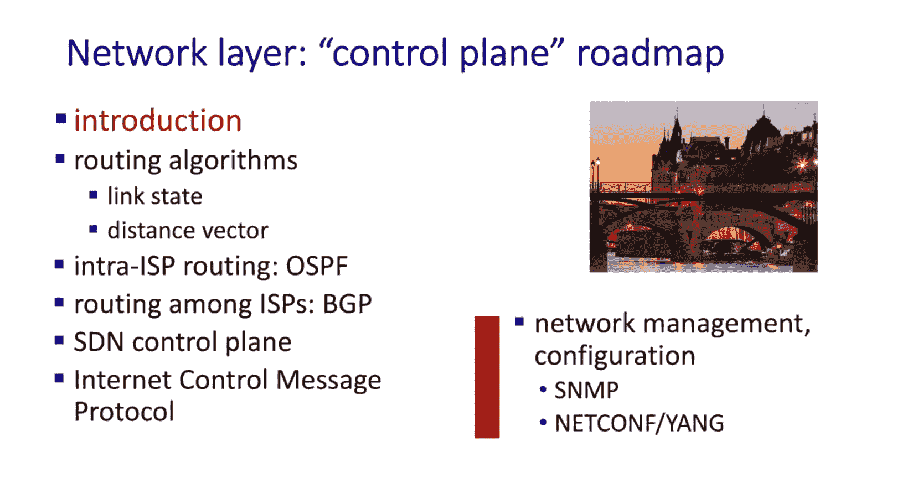

And as we proceed through the control plane function of the network layer Cha 5。

 it'll be a good idea to keep in mind the distinction between forwarding covered in chapter 4 and routing。

 which we'll be covering now forwarding is the router local data plane function of moving packets from a router's input port to a router's output port。

 it's a local function routing determines a path taken by packets from source to destination。

 a network wide function and in this chapter we'll study two basic approaches for implementing routing。

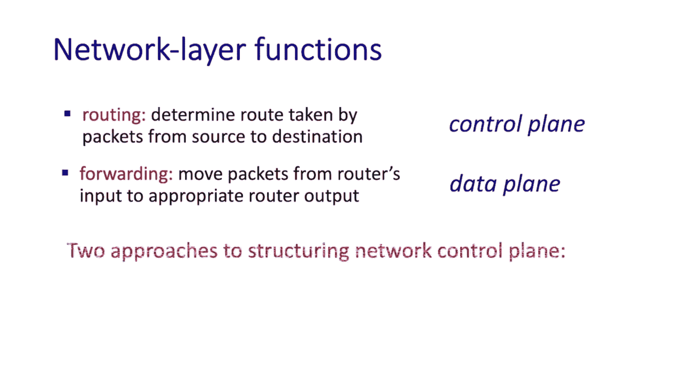

The per router control plane has a piece of the control plane in each and every router。

 the routing algorithms typically implemented in distributed manner as shown here。

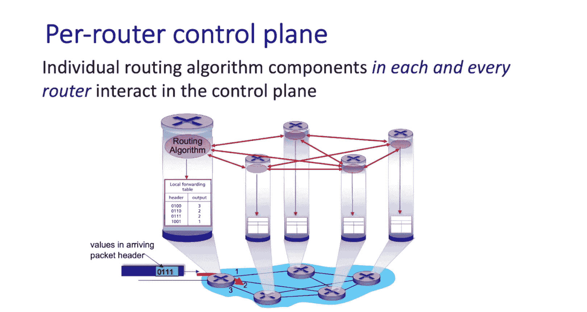

And in the SDN approach， the control computations are logically centralized。

 that is they're done in the SDN controller and then their result， for example。

 the forwarding tables are pushed out to and then installed at the individual routers。

 note that here the routers don't interact with each other to actually compute the path。

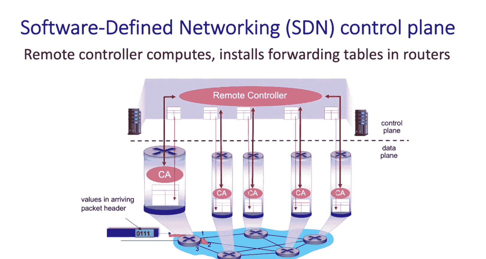

We'll take a look at both of these shortly， but let me remind you here that the algorithms for computing。

 a shortest or least car's path， extras algorithm， for example， are the same in either approach。

 it's how they're implemented， whether in each and every router or in a logically centralized SDN approach that differs。

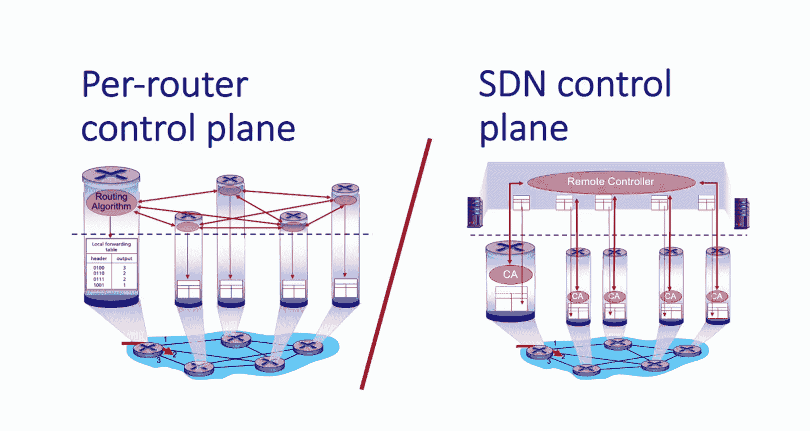

Well that concludes a quick overview of what we're going to be covering here in the control plane and our study of the control plane。

 you know， teaching the control plane， teaching the data plane and also teaching the transport layer are three of my favorite things to teach in a networking course。

 so I think you're going to really enjoy this。

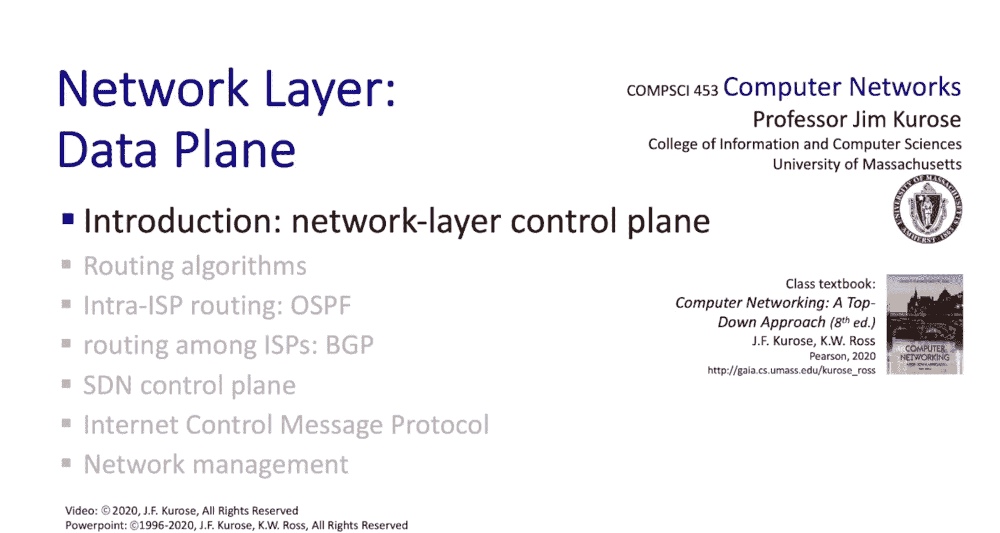