# 计算机网络：自顶向下方法：5.3：开放最短路径优先 (OSPF) 🛣️

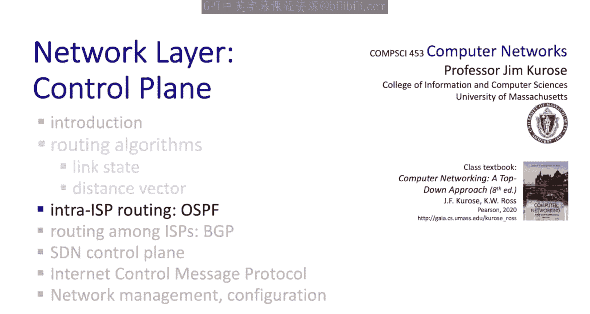

## 概述

在本节中，我们将学习如何将之前讨论的路由算法理论付诸实践。我们将重点关注两个关键的实际考量因素：**规模**和**自治**。我们将深入探讨用于网络内部路由的**开放最短路径优先 (OSPF)** 协议，并了解其如何解决大规模网络环境下的路由问题。

---

## 从理论到实践

上一节我们主要从理论角度研究了路由，探讨了集中式和分布式路由算法，用于计算从源到目的地的最小成本路径。本节及下一节，我们将着眼于如何将这些原理应用于实践。

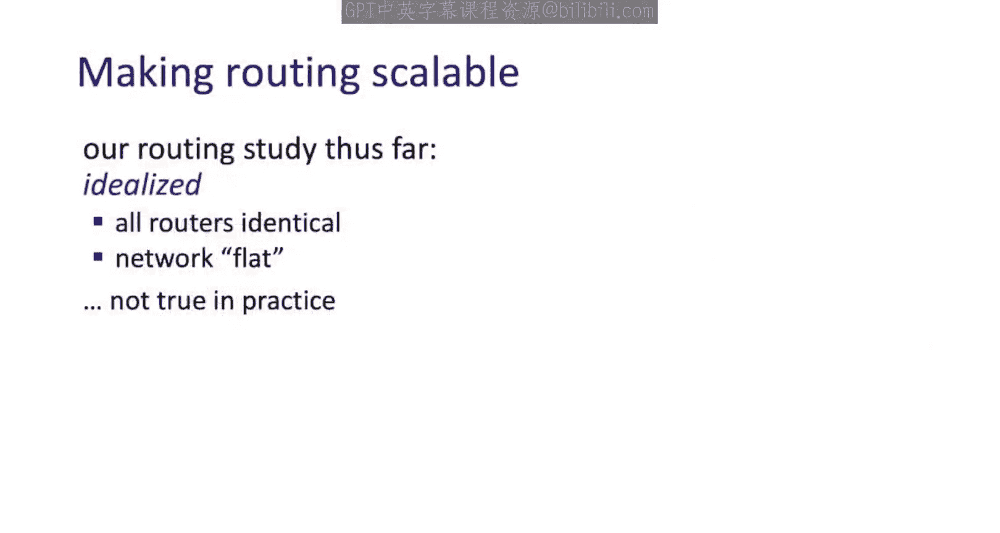

我们将从两个特定的考量因素开始：**规模**和**自治**。这两个因素在将路由原理付诸实践时至关重要。对于**规模**，我们需要解决当存在数十亿个需要路由的端点时如何进行路由的问题。**自治**则涉及允许网络管理员和运营商选择在其自身网络内部以及到远端网络的路由方式。

这里我们将介绍两种路由协议：用于控制网络内部路由的**开放最短路径优先 (OSPF)** 路由协议；在下一节中，我们还将介绍用于网络间路由的**边界网关协议 (BGP)**。

现在，让我们从探讨规模和自治问题开始。

---

## 规模与自治的挑战

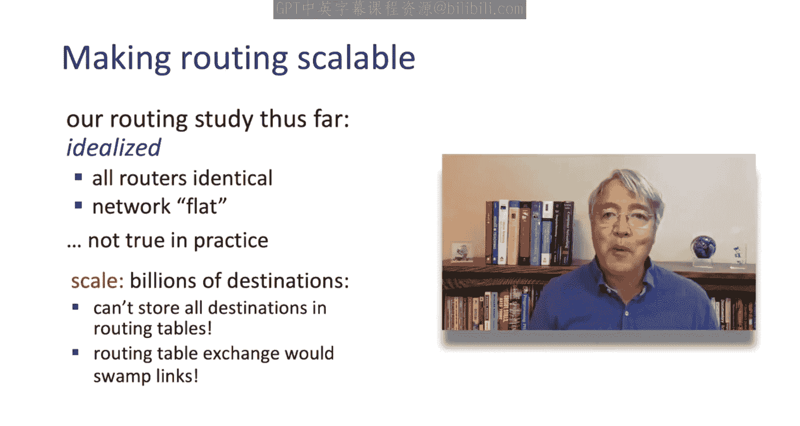

到目前为止，我们对路由算法的研究相当理想化。我们将网络视为由链路连接的无差别路由器海洋，目标仅仅是找到从源路由器到目的路由器的最短路径。然而，在实践中，情况要复杂一些，复杂性主要源于**规模**问题。

我们如何路由到数十亿台终端主机和数十万个目的网络？试想一下，路由器的转发表不可能为所有目的主机保存数十亿个转发条目。而且，当我们考虑路由算法与数百万个其他实体交换距离矢量或链路状态信息时，这根本无法扩展，仅用于控制目的就会耗尽网络内的所有带宽。

其次是**自治**问题。这一点可能不那么明显。请记住，互联网是网络的网络，每个网络都有其所有者/运营商。网络所有者/运营商在多大程度上可以或应该被告知如何路由流量？一个网络在其路由方面拥有多大的自治权？

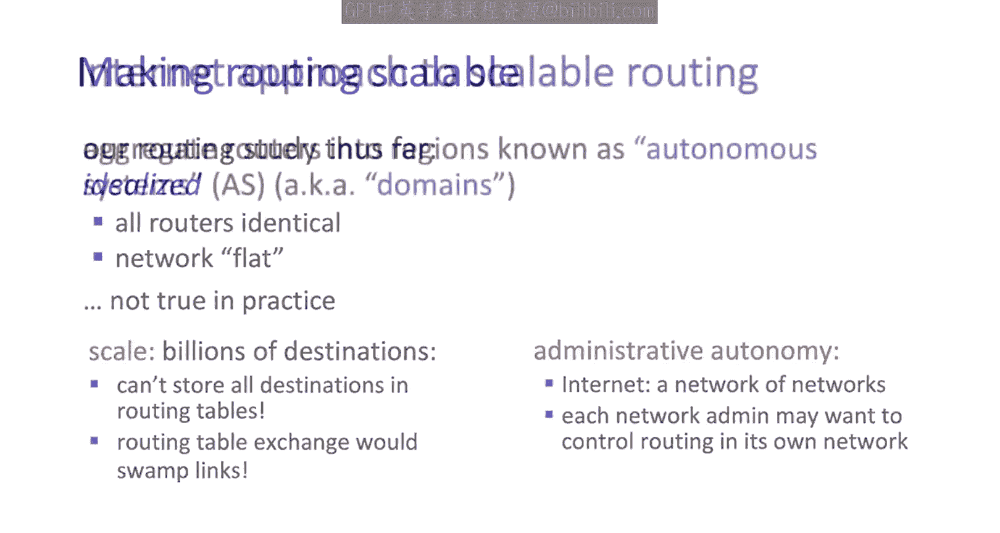

我们将看到，互联网的方法是双重的：首先，一个网络可以在其自身网络内选择使用任何它想要的路由协议；其次，一个网络将能够控制来自其客户网络的流量如何路由到目的地，以及它作为一个网络如何路由其他网络发送给它的流量。

让我们从规模问题开始探讨。

---

## 互联网的解决方案：分层与聚合

互联网解决路由规模问题的方法始于将路由器聚合到网络或区域的概念，这些区域有时被称为**自治系统 (AS)** 或**域**。

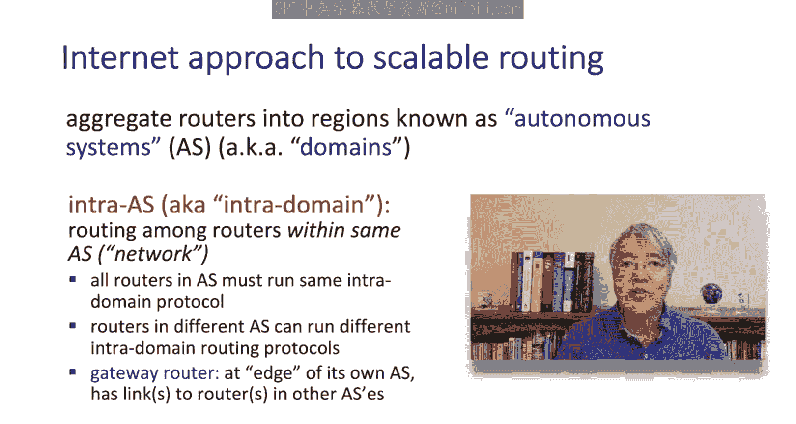

我们将看到，基本上有两种类型的路由：用于域内路由的路由协议和用于域间路由的路由协议。并且，我们将看到每种都有不同的协议。让我们从网络内部、自治系统内部的路由概念开始。这被称为**域内路由**。

在域内路由中，域内、自治系统内、网络内的所有路由器都运行相同的路由协议。但是，不同的网络、不同的自治系统可以选择自己的域内路由协议。我们将看到，每个自治系统的边缘是一种特殊类型的路由器，称为**网关**，它将一个自治系统连接到另一个。

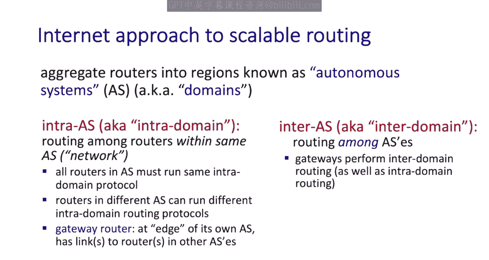

---

## 域间路由

然后是**自治系统间 (Inter-AS)** 路由，也称为**域间路由**，用于自治系统之间的路由。在这里，一个网络的网关将执行域间路由，并参与其自身自治系统内的域内路由。

下图展示了一个包含三个自治系统（AS1、AS2 和 AS3）的网络，即三个互连的网络。每个 AS 都有自己的域内路由协议，每个 AS 可以使用不同的域内路由协议，这对其他 AS 来说并不重要，因为那只是域内路由。

我们看到，域内路由协议负责域内和域间的路由。域内路由协议将用于填充路由器对于网络内部目的地的转发表。但是，对于发往网络外部的流量呢？在这里，域内路由协议以及部分域间路由协议将用于填充路由器对于网络外部目的地的转发表。

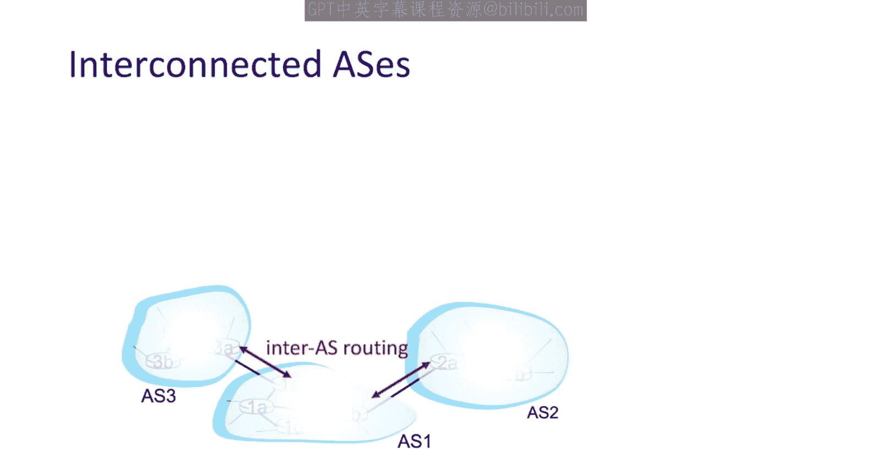

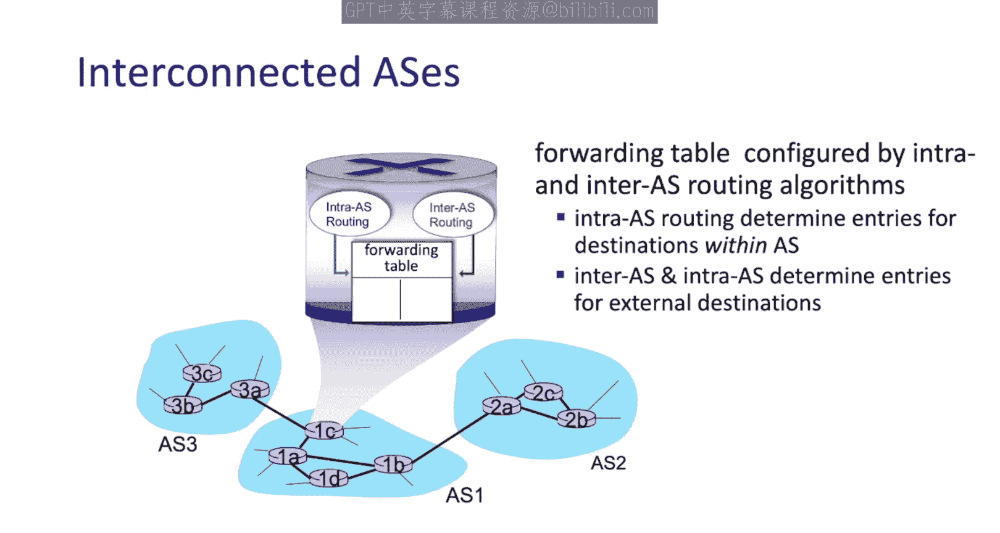

让我们从路由和转发到域内目的地的案例开始，因为这相对简单一些。

---

## 主要的域内路由协议

在实践中，只有三种域内路由协议被广泛采用。

第一种是**路由信息协议 (RIP)**。RIP 发明于 20 世纪 80 年代初，并在 RFC 1723 中标准化。它是一个经典的距离矢量协议，距离矢量信息每 30 秒定期交换一次。它在 80 年代、90 年代和 2000 年代初期被广泛使用，但 RIP 最终被**开放最短路径优先 (OSPF)** 协议取代，成为主流的域内路由协议。

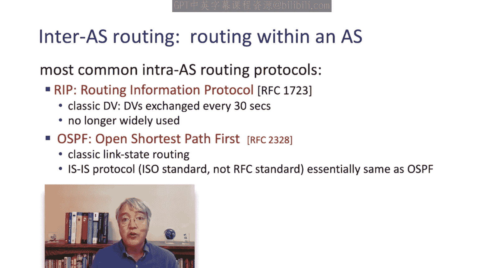

OSPF 是一个经典的链路状态协议，它使用 Dijkstra 算法计算最短路径。还有一个相关的协议称为**中间系统到中间系统 (IS-IS)** 路由协议，它与 OSPF 非常相似，几乎相同，但由国际标准化组织 (ISO) 而非 IETF 标准化。

接下来，我们将更仔细地看看 OSPF，因为目前它确实是实践中最广泛部署的域内路由协议。

第三种常用的域内路由协议是**增强型内部网关路由协议 (EIGRP)**。它也是基于距离矢量的，实际上在数十年里曾是思科的专有协议，外界无法确切知道 EIGRP 的内部机制。然而，思科在 2013 年开源了 EIGRP，使其成为一个开放协议。

现在，让我们来看看**开放最短路径优先 (OSPF)** 路由协议。

---

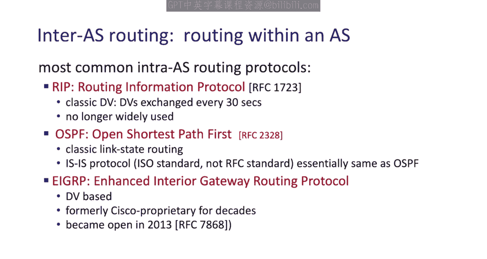

## OSPF 协议详解

“O”代表“开放”，意味着其规范是公开可用的。OSPF 是一个经典的链路状态协议。每个路由器将在整个自治系统内泛洪 OSPF 链路状态通告。也就是说，每个 OSPF 路由器将泛洪其每个所连接链路的信息，这些信息将传播到自治系统中的所有其他路由器。

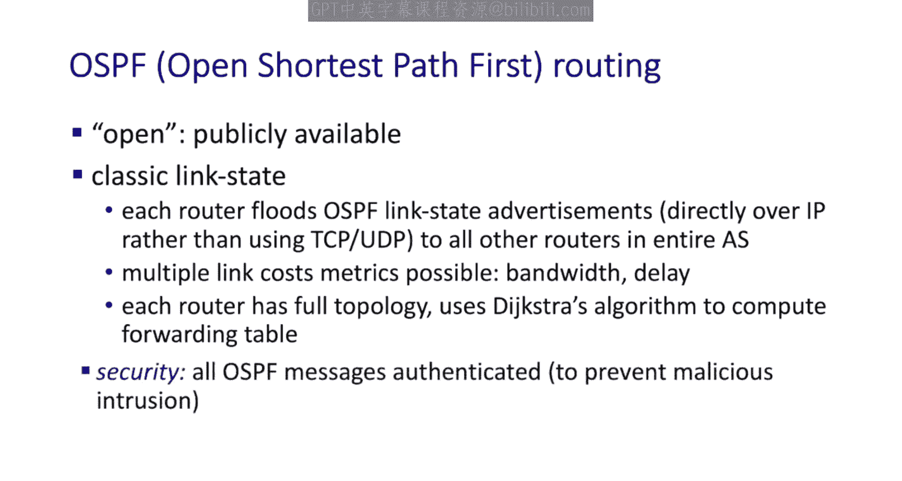

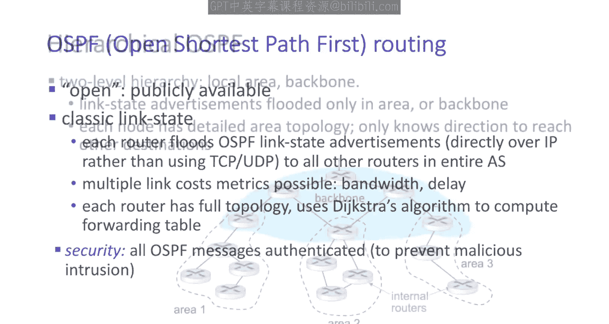

因此，与经典的链路状态算法一样，每个路由器都拥有完整的拓扑信息。然后，OSPF 使用 Dijkstra 类算法计算每个转发表。

可以使用多种链路成本度量标准。例如，可用带宽和链路相关的延迟就是两种链路成本度量标准。最后，OSPF 最近最重要的创新之一是所有 OSPF 消息都经过**认证**，这是一项必要的创新。

---

## OSPF 的层次化模式

OSPF 还可以在所谓的**层次化模式**下运行。OSPF 层次结构有两个级别：**区域**和**骨干**。

在下图中，您可以看到三个区域：区域 1、2 和 3，以及一个骨干。作为经典链路状态算法一部分的链路状态通告现在将仅在区域内或骨干内泛洪。因此，您可以看到这种层次结构如何限制在整个层次化网络中路由器之间流动的信息量。

每个节点将拥有其所在区域或骨干内的完整拓扑的详细信息。那么，问题是如何路由到不属于您区域或不在骨干中的其他节点？这就是**区域边界路由器**的作用。

以下是区域边界路由器的工作方式：
*   区域边界路由器将汇总到其自身区域内其他目的地的距离，并将此信息通告给骨干中的其他节点。
*   区域内的本地路由器将像经典的链路状态算法一样运行：在区域内泛洪链路状态信息，计算区域内的路由，并将需要发送到区域外的数据包转发给区域边界路由器。

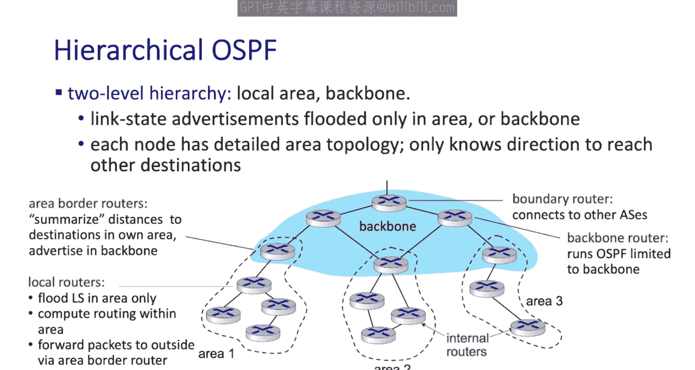

在骨干中，我们看到两种类型的路由器：
*   **边界路由器**：用于将此层次化 OSPF 网络连接到更大的外部世界，即连接到其他自治系统。
*   **骨干路由器**：在骨干内运行 OSPF，泛洪链路状态信息，但仅在骨干内进行。

---

## 总结

本节是我们关于互联网路由协议实践的两部分内容中的第一部分。我们看到了**规模**和**自治**问题在设计互联网路由工作原理时是多么重要的考量因素。我们深入了解了目前互联网中广泛使用的一种域内路由协议——**开放最短路径优先 (OSPF)** 协议。

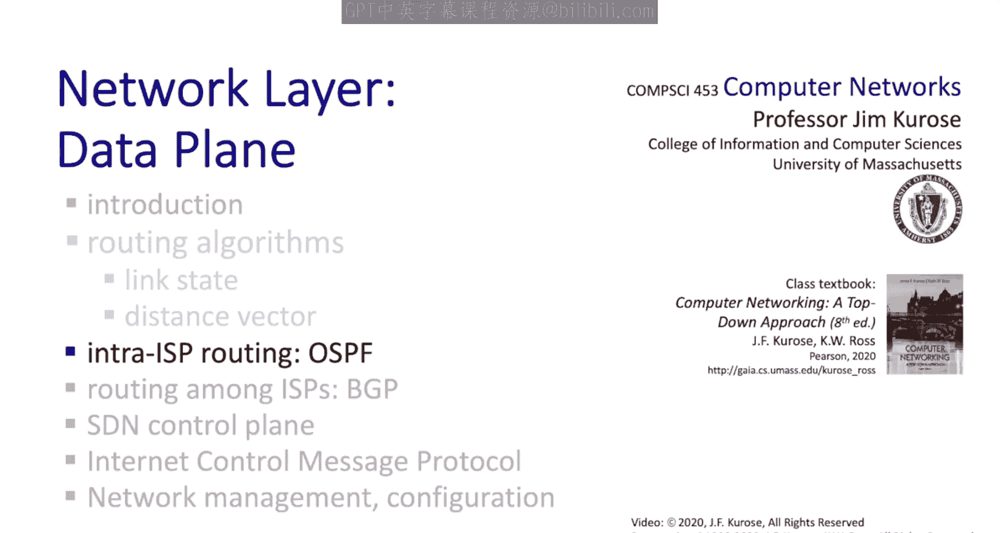

在下一节中，我们将探讨一种域间路由协议——**边界网关协议 (BGP)**。互联网中只使用一种域间路由协议，因此 BGP 有时被称为“将互联网粘合在一起的胶水”，因为是 BGP 决定了如何在独立的自治系统之间进行路由。