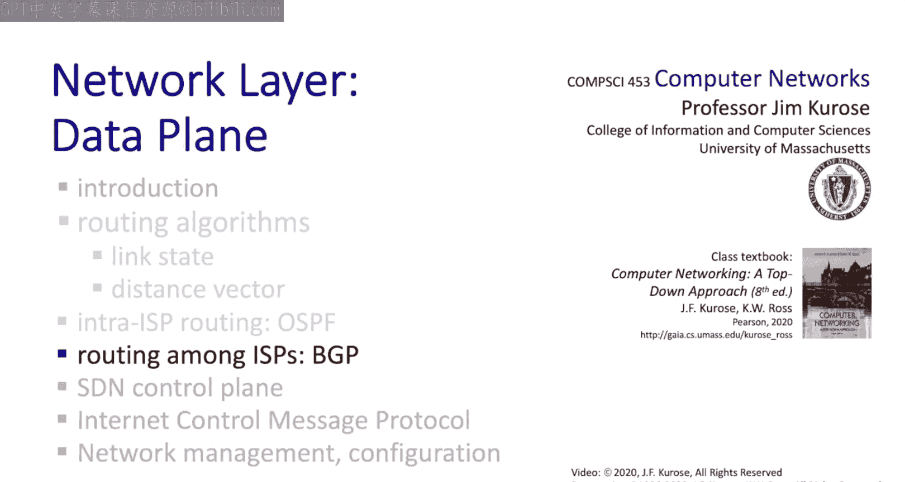

# 计算机网络：自顶向下的方法：5.4：边界网关协议（BGP）🚀

在本节中，我们将学习边界网关路由协议（BGP）。BGP是当今互联网中实际使用的域间路由协议，因此有时被称为将互联网——这个网络的网络——粘合在一起的“胶水”。

上一节我们介绍了OSPF，它是一个对Dijkstra链路状态路由算法的相当直接的实现。BGP则起源于距离向量算法。除了研究BGP如何实现和运作，我们还将花大量时间探讨BGP如何允许网络运营商实施路由策略，以控制进出其客户网络的流量路由，以及网络如何处理中转流量。我们将看到，BGP既关乎性能，也同样关乎策略。这非常有趣。

那么，让我们从BGP基础概述开始。

## BGP基础概述 🌐

BGP是一个非常重要的协议，其重要性可与IP协议相提并论，可以说是互联网最重要的两个协议之一。我们将看到，BGP起源于距离向量协议，它是分布式的、异步的。但如前所述，BGP既关乎计算源到目的地的最小成本路径，也同样关乎策略。

BGP允许一个网络向互联网的其余部分宣告其存在，以及它到达这些目的网络的路径。它允许一个BGP路由器说：“嘿，我在这里，我能到达谁，特别是，我到达这些目的地的路径是这样的。”

让我们稍微展开解释一下。这意味着，在接收端，BGP为每个自治系统（AS）提供了从其邻居获取目的网络可达性信息的手段。然后，路由器可以根据策略决定是否实际使用这些路径。例如，策略可能是不使用经过某个特定ISP或特定国家的路径。

BGP还为每个自治系统提供了向其内部路由器传播可达性信息的手段。与自治系统内部路由器的这种通信通过**内部BGP（IBGP）**协议完成。

最后，还有一个非常微妙但非常强大的策略问题：一个自治系统希望向其邻居传递哪些目的可达性信息。如果我是自治系统，并且我知道我能到达目的地X，我真的想告诉我的邻居网络我能到达X吗？如果告诉了，它们可能会尝试通过我路由数据包去X，而也许我并不希望这样。因此，你可以看到，自治系统宣告哪些路径以及选择使用哪些路径，都涉及策略考量。

下图展示了BGP的两种类型：**外部BGP（EBGP）**运行在不同自治系统的两个路由器之间；**内部BGP（IBGP）**运行在同一自治系统的两个路由器之间。如图所示，网关路由器同时运行EBGP和IBGP。

接下来，让我们看看两个相互交互的BGP路由器（有时称为BGP对等体或BGP发言者）。BGP对等体通过半永久性的TCP连接（使用端口179）交换BGP消息。它们宣告到达不同目的网络前缀（例如，`/24`或`/16`网络）的路径。因此，由于BGP宣告路径，它有时被称为**路径向量协议**。

在这个例子中，当网络X连接到AS3时，AS3现在知道它可以到达X。因此，这里的AS3网关路由器3A向AS2的网关路由器2C宣告路径`AS3, X`。这样，AS2就通过AS3知道了X的可达性。需要注意的是，当AS3宣告到X的路径时，它本质上是在向AS2承诺，它既有能力也愿意向X转发数据报。

让我们通过列出BGP协议使用的消息来结束对BGP基础的讨论。有**OPEN**和**NOTIFICATION**消息用于打开和关闭BGP会话；**KEEPALIVE**消息用于在无活动时保持连接；然后是至关重要的**UPDATE**消息，用于宣告一条路径或撤销先前宣告的路径。你可以在RFC 4271中阅读所有关于BGP消息的详细信息。

好的，BGP的基础知识就到这里。接下来，我们将更深入地探讨BGP的一些细节，特别是**路径宣告**的概念，以及如何利用路径宣告来控制路由策略。

## 路径宣告与路由策略 ⚙️

让我们通过观察路径宣告本身来开始对路径宣告的研究。当一个BGP路由器宣告一条路径时，它宣告两样东西：首先，它宣告该路径的目的地，即目的地的CIDR地址（如`/24`或`/16`）；其次，它宣告与该路径相关联的一组**属性**。其中最重要的属性是**AS路径属性**，它枚举了从当前网络路由到目的网络所经过的整个自治系统列表。

我们说过BGP是基于策略的路由协议，现在我们可以确切地看到这意味着什么。首先，接收路由宣告的路由器使用策略来决定是否使用刚刚宣告给它的路径。例如，如前所述，策略可能是绝不接受经过ISP W或国家Y的路径。

路由器也使用策略来决定是否向相邻的自治系统宣告特定路径。如果我不向邻居宣告一条路径，那么该邻居永远无法向我发送使用该路径的流量，而这可能正是我想要的。

以下是一个展示路径宣告如何在自治系统之间和内部传播的例子。

假设基于策略，路由器3A决定向自治系统2（AS2）宣告一条到目的地X的路径。AS2的路由器2C通过EBGP从路由器3A接收到这个路径宣告`AS3, X`。基于AS2的策略，路由器2C随后接受路径`AS3, X`，并通过IBGP将此路径传播给所有AS2内部的路由器。

然后，基于AS2的策略，AS2的路由器2A可以通过EBGP向AS1的路由器1C宣告路径`AS2, AS3, X`。通过这种方式，自治系统AS1知道了通过AS2和AS3到达X的路径。

现在，一个BGP路由器有可能了解到到达同一目的地的多条不同路径，如下例所示。

在这个例子中，AS1的网关路由器1C了解到一条通过AS2和AS3到达X的较低路径。路由器1C还从路由器3A直接了解到另一条路径`AS3, X`（即上方的路径）。在这个例子中，基于策略，假设路由器1C选择了路径`AS3, X`，并通过IBGP在AS1内部宣告这条路径。

接下来，让我们看看如何利用路径宣告来实现路由策略。为了具体说明，我们假设策略如下：一个ISP只希望转发源或目的地位于其任一客户ISP网络中的数据报。这实际上是一个现实世界的策略。为什么一个ISP会想要转发仅仅是穿过的流量？这被称为**中转流量**。中转流量不产生收入，只有该ISP的客户网络才实际为服务付费。因此，该ISP的策略（可以理解）是只路由源或目的地位于其任一客户网络中的流量。

以下是一个例子。假设网络A、B和C是提供商网络，网络X、W和Y是客户网络。由于W是A的客户，A非常乐意向B和C宣告路径`A, W`。A在说：“嘿，如果你想路由到W，请通过我（A）。”确实，如果A不宣告这条路径，那么就不会有流量通过A流向W。这很合理。

但现在让我们看看在B处会发生什么。B真的想告诉C存在一条路径`B, A, W`吗？也许不想，因为W不是B的客户。如果B告诉C它（B）有一条到W的路径，那么C就可以通过B路由流量到W，而B没有意愿或经济动机去充当从B到A流量的中转网络。因此，B可能不会向C宣告路由`B, A, W`。结果，C就不知道通过B实际上存在一条到W的路径。

这是另一个基于策略的路径宣告困境。看网络X，它同时是网络B和网络C的客户。这被称为**双宿主**。作为一个客户，它连接到B和C，但它实际上并不希望路由B和C之间的流量，即使它可以。所以，X不会告诉B它有到C的路径，也不会告诉C它有到B的路径。结果，X永远不会承载B和C之间的中转流量。

我希望你现在能真正体会到策略在BGP中是多么重要的考量，以及ISP如何利用路径宣告作为实现路由策略的机制。对我来说，看到策略问题（而非成本）如何主导互联网中的域间路由，真是大开眼界。

现在，虽然域间路由和路径宣告决定了数据包采取的路径，但我们仍然需要解决如何填充转发表以实现与给定路径一致的转发策略的问题。让我们接下来看看这个。

## 转发表与热土豆路由 🥔

这个例子展示了如何使用IBGP将到达自治系统外部目的地的路径实例化到路由器的转发表中。回想一下，路由器1A、1B和1D通过来自节点1C的IBGP消息了解到如何到达X，1C说：“嘿，到X的路径经过我（1C）。”

现在让我们看看路由器1D。路由器1D从其OSPF域内路由知道，要转发数据报到1C，它应该通过接口1转发。因此，1D也知道，要转发数据报到目的地X，现在也应该通过接口1转发这些数据报，因为那是用于到达1C的接口。

在1A这边，假设OSPF域内路由表明，要到达路由器1C，1A应该使用本地接口2转发数据报。因此，1A知道要转发数据报到X，也应该通过接口2转发这些数据报。最终结果是，从1A发往X的流量将首先从1A转发到1D，然后从1D转发到1C，接着从1C转发进入自治系统AS3。

最后，有一种BGP域内路由形式被称为**热土豆路由**。热土豆路由说的是，当路由到一个外部目的地时，将数据包转发给我本地最近的网关，而不必担心到达目的地的总体成本。目标只是尽快将这个数据包送出我的网络。

在这个例子中，2D会将目的地为X的数据包通过2A转发，而不是通过2C。当然，这种短视的决策并不总是最佳的全局决策。在这个例子中，通过2A路由比通过2C路由涉及更多的AS跳数。这被称为热土豆路由，因为你试图以尽可能低的成本将数据包送出网络。你可能还记得小时候玩的“热土豆”游戏：你传一个球，想尽快摆脱它，以免在游戏结束时拿着球被抓住。你只是想摆脱这个球。这很有趣，它甚至让我觉得玩热土豆游戏可能比学习BGP和热土豆路由更有趣。

## 总结与对比 📊

这就结束了我们对BGP的讨论。我希望学习BGP和BGP热土豆路由是有趣的。让我们通过反思域内路由（如OSPF）和域间路由（如BGP）之间的一些差异，来结束我们对域间路由实践的更广泛讨论。

我们看到，在域间路由中，策略考量确实占主导地位。ISP希望拥有策略控制能力，以便能够控制如何路由进出其客户网络的流量，以及如何处理中转流量。

互联网路由的另一个关键考量是**可扩展性**，即关注最小化转发表大小和路由更新流量。我们了解到，域内和域间路由的分离意味着域内路由信息不会传播到自治系统之外。因此，互联网的其余部分甚至看不到任何特定域内的路由信息。考虑到构成互联网的数百万个网络，这是一件好事。

在OSPF中，我们了解了使用分层路由来限制完整拓扑信息的范围，即使在一个自治系统内部也是如此。我们在这里也了解到，以及在第4章学习互联网寻址时了解到，BGP如何路由到CIDR化的目的网络，以及一个单一的CIDR化网络地址实际上如何能代表一个地址块内的大量网络。

最后，让我们回到性能问题。我们看到在应用层、传输层甚至域内路由中，性能很重要。我们说过毫秒都很重要。但有趣的是，对于域间路由和BGP，我们看到策略考量明显优于性能考量。

这就结束了我们对互联网路由实践的讨论，特别是对OSPF和BGP协议的探讨。我希望你觉得这些内容有趣。我知道，在学习完路由算法、链路状态算法、距离向量算法，并看到它们在像RIP和OSPF这样的域内路由中实现之后，再看到在域间层面，策略而非路径成本如何主导讨论，确实有点令人惊讶。

接下来，我们将退一步，看看实现控制平面的通用方法。特别是，我们已经看到，无论是BGP还是OSPF，它们都采用**每路由器**的方法来实现控制平面。我们将看看另一种实现控制平面的方法，其中路径计算本身实际上在物理上从路由器中移除，可能在一个远离路由器本身的数据中心中实现。这种方法后来被称为**软件定义网络**。这就是接下来的内容，敬请期待。