# 计算机网络：自顶向下方法：第39讲：软件定义网络与OpenFlow控制平面 🧠

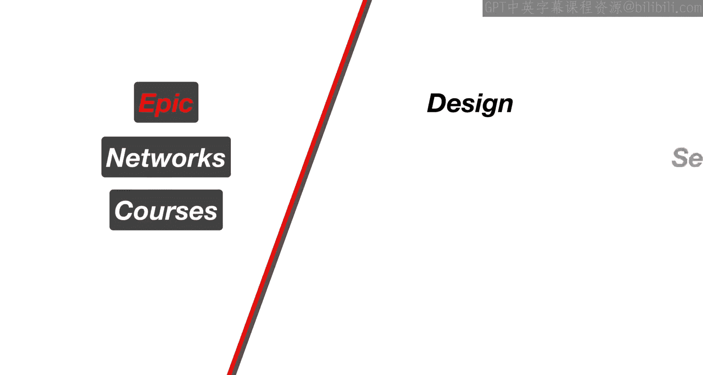

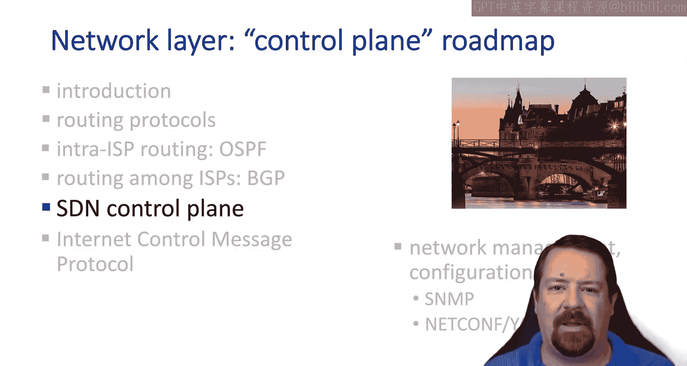

在本节课中，我们将学习软件定义网络的控制平面，包括SDN控制器和OpenFlow协议。我们将探讨SDN架构如何将控制平面与数据平面分离，以及这种分离带来的优势与挑战。

---

## 概述

在之前的视频中，我们了解到互联网控制平面通常采用**分布式、每路由器**的方式实现。这意味着每个路由器都包含控制平面和数据平面的组件，并通过OSPF、BGP等标准化协议相互通信。然而，这种方法限制了路由器只能执行一组特定的操作，主要是基于目的地的转发。当需要其他功能时，通常需要借助非路由器的中间盒设备来实现。

过去约15年里，人们对于统一网络控制平面产生了浓厚兴趣，希望用一种设备类型来统一多种功能，提供网络层所需的大部分服务。这就是**软件定义网络**架构的由来，它使用具有通用转发能力的SDN交换机。

上一节我们回顾了传统路由架构，本节中我们来看看SDN架构的具体构成。

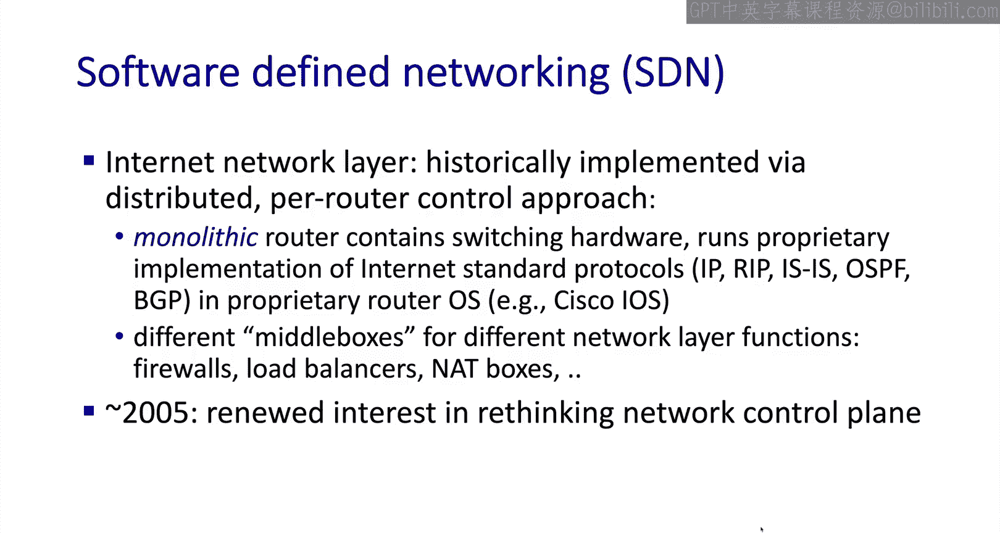

---

## SDN架构与传统路由的对比

在传统路由器中，当数据包到达时，路由器根据其头部中的目的地址查询**转发表**，执行基于目的地的转发。同时，每个路由器内部实现的控制平面通过路由算法与其他路由器通信，更新转发表，从而在网络中构建通往所有目的地的连贯路径。因此，控制平面和数据平面的功能在每个路由设备内部是结合在一起的。

相比之下，SDN架构虽然也能检查数据包头部的各种字段，但它将逻辑上的数据平面功能与控制平面**分离**。控制平面在远程的**SDN控制器**中实现，这些控制器构建**流表**并将其下发到SDN交换机。

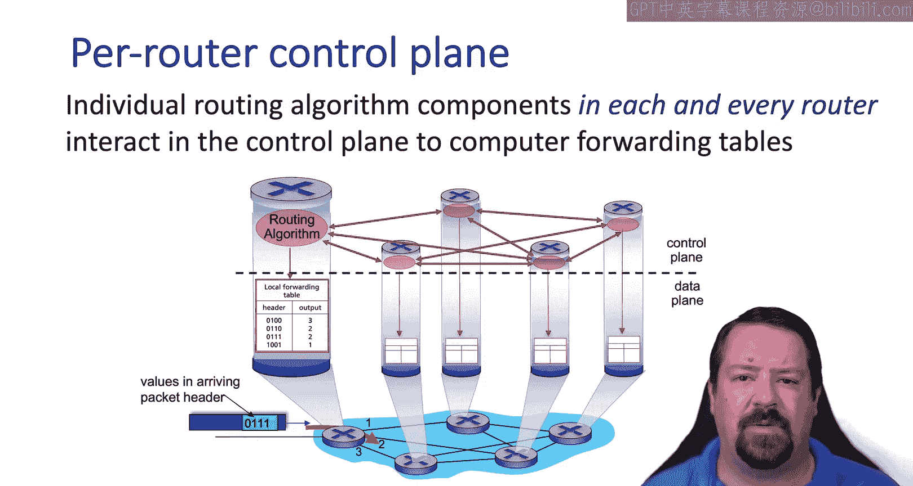

以下是两种架构的核心区别公式化表示：

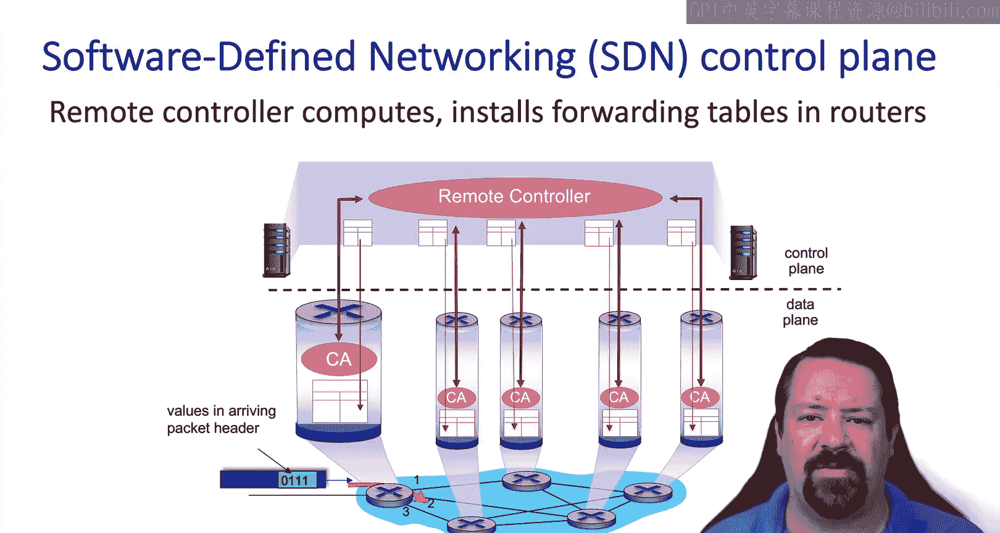

*   **传统路由**：`控制平面(分布式) + 数据平面(本地) = 每路由器功能`
*   **SDN架构**：`控制平面(集中式，在控制器) -> [通过API] -> 数据平面(在交换机)`

在这种模型中，控制平面和数据平面的功能被分离，并在不同的设备上实现。

---

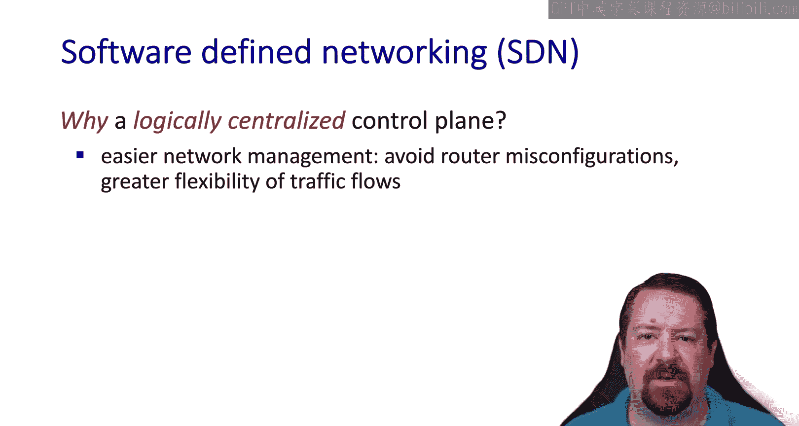

## 转向SDN的动机

了解了传统路由控制平面架构后，我们现在更深入地探讨转向SDN架构的动机。

转向SDN的主要动机之一是简化网络管理，这并非出于惰性，主要是为了**避免错误配置**。多项对网络运营商的调查表明，错误配置是导致互联网网络中断的首要原因。因此，降低错误配置的可能性可以极大地提高互联网的可靠性。

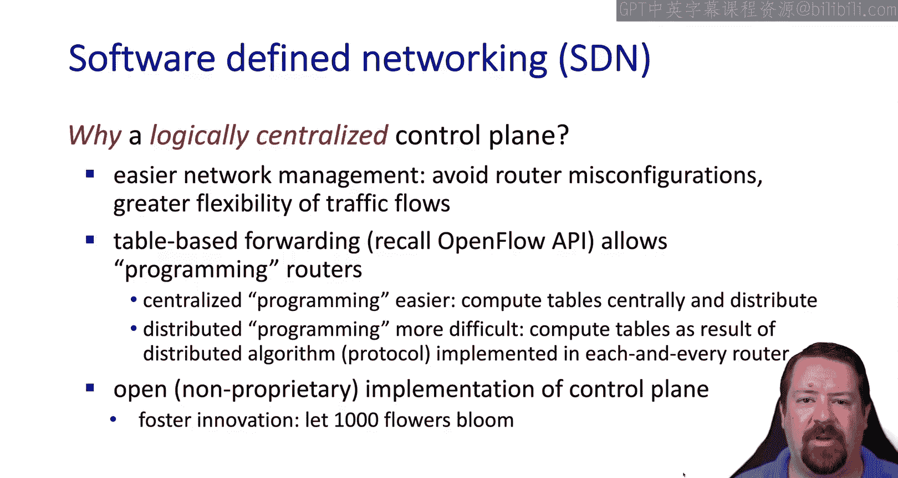

此外，SDN还能提高流量管理的灵活性。例如，可以根据延迟或带宽的不同要求来区分不同类型的流量。

正如我们在一些分布式路由协议中注意到的，设计分布式算法很困难，在性能和实际可实现的复杂性方面都存在固有的限制。集中式编程和下发流表可以缓解这些问题，使执行复杂的路由操作变得更容易，同时仍能确保连通性不受影响。

另一个动机是通过开发开源控制器软件，**向创新开放控制平面**。

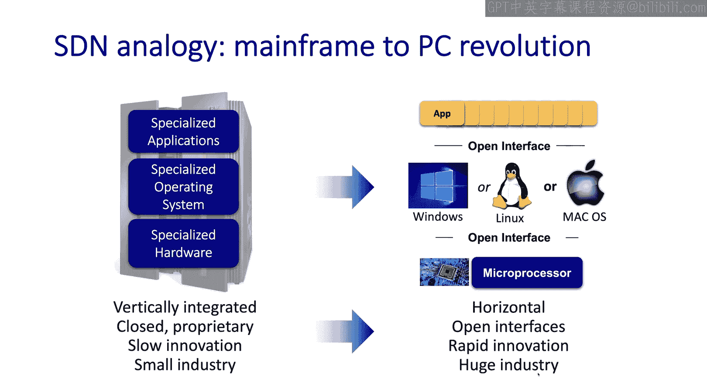

---

## 类比：从大型机到个人电脑

从传统路由转向软件定义网络，与从集中式大型机转向分布到每家每户的个人电脑有一些相似之处。

大型机是一个整体，硬件、操作系统和应用程序都是一个生态系统的组成部分，只能彼此协作。而当个人电脑发展起来后，硬件接口被开放，使得多种操作系统可以与之互操作，并且可以在这些操作系统之上开发大量的应用程序。这导致了创新和新应用开发的爆炸式增长，这些在大型机环境中是未曾设想的。

因此，尽管尚未完全实现，但人们希望向软件定义网络的转变能带来类似的好处。

---

## 传统路由的局限性示例

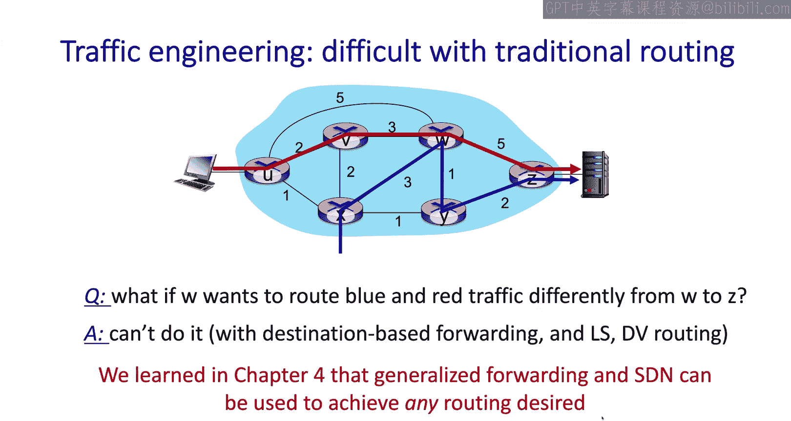

以下是传统路由协议难以完成的、相对简单的流量工程任务示例。

假设从U到Z的流量按照预期沿着网络中的最低成本路径流动。然而，由于流量工程的原因，运营商需要改变这条流量的路径。在传统路由中，我们需要重新定义链路权重，使得新路径成为这两个端点之间的较低成本路径。但这显然会影响网络中的许多其他流量，而不仅仅是我们试图控制的那一条。

如果运营商不仅需要移动该流量，还需要将其拆分以分散到两条不同路径上，这就更具挑战性，需要超出典型路由协议能力的额外配置。通常，负载均衡配置会在路由协议之外构建，因为路由协议本身不直接支持该服务。

另一个例子是，我们可能有两股流量，无论出于何种原因，我们需要在W和Z之间分离这两股流量。这同样无法通过基于目的地的转发来实现。然而，通过**通用转发**，我们可以查看其他字段，从而实现这样的结果。

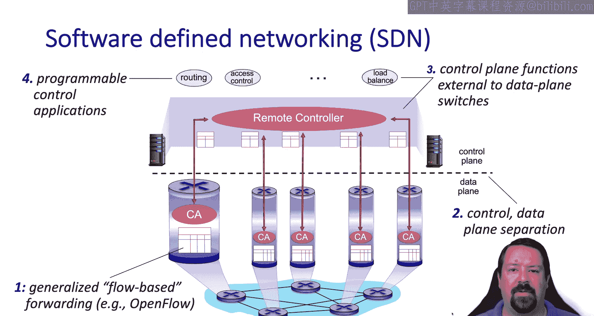

---

## SDN架构详解

现在回到我们的SDN架构。你会注意到，在控制器之上，我们引入了一些气泡，如路由、访问控制和负载均衡，这些代表了我们需要控制器提供的逻辑功能。

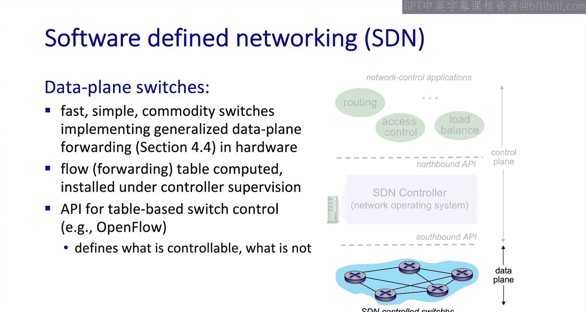

在控制器内部有不同的架构，但可以将其视为在控制器上运行的应用程序，每个应用程序都为构建流表所需的信息体做出贡献。

由于OpenFlow是主流的SDN技术，我们通常使用OpenFlow术语来描述此架构的不同部分。因此，我们有位于路由器数据平面中的**流表**，控制平面与数据平面的**分离**，我们的控制平面功能，以及位于其上的控制平面应用程序。这些应用程序既可以从网络获取输入以做出情境感知决策，也可以为网络定义转发规则。

以下是SDN架构的核心组件列表：

*   **数据平面**：由快速、相对简单的商用交换机组成，运行通用转发逻辑。
*   **控制平面**：在远程服务器上运行的SDN控制器，负责计算并下发流表。
*   **北向API**：控制器与网络控制应用程序之间的接口。
*   **南向API**（如OpenFlow）：控制器与SDN交换机之间的标准化接口。
*   **网络控制应用程序**：实现路由、防火墙、流量工程等逻辑功能的程序。

---

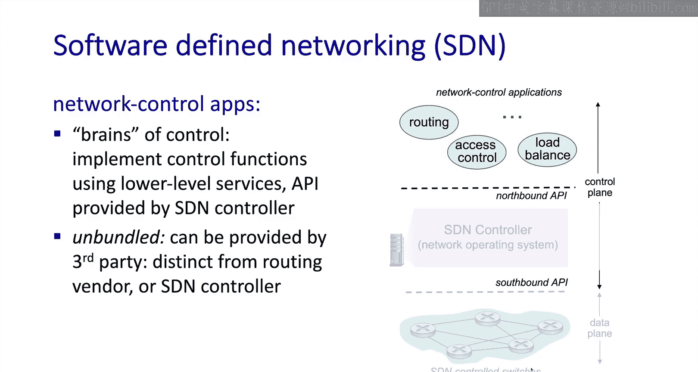

## SDN控制器详解

让我们更详细地剖析SDN控制器。虽然具体细节因控制器而异，但通常控制器会具有模块化结构，并处理一系列关注点。

控制器将包含专门用于与交换设备通信的组件，例如使用OpenFlow协议，可能还包括SNMP（简单网络管理协议）。控制器还需要跟踪网络状态，例如哪些物理链路已连接，哪些交换机已向此控制器注册。此外，控制器应知道已向交换机发布了哪些流表，并读取这些流表返回的关于设备使用情况和网络流量流的统计信息。

然后，我们有与网络控制应用程序交互的API层。这些API可以相对简单，也可以提供更丰富的网络状态视图。例如，网络图抽象、RESTful API以及某种策略意图的概念。

---

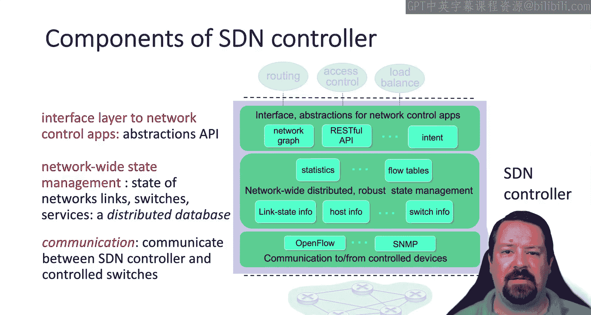

## OpenFlow协议

OpenFlow协议用于交换机和控制器之间的连接。它在TCP上运行，较新版本支持加密。

我们可以将OpenFlow消息分为三类：

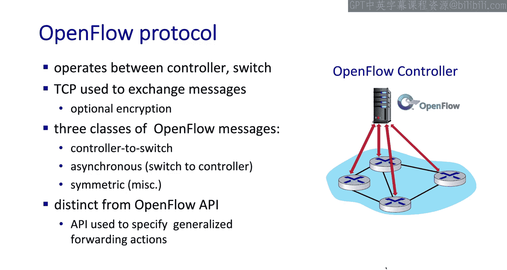

1.  **控制器到交换机消息**：例如部署新的流表规则。
2.  **异步消息**：交换机主动向控制器提供某些信息。
3.  **对称消息**：例如控制器向交换机查询信息。

这与OpenFlow API不同，后者用于指定我们在研究SDN数据平面时讨论的通用转发操作。

以下是关键的控制器到交换机消息示例：

*   `Features Request`：控制器询问交换机支持哪些功能。
*   `Configuration`：控制器请求或设置交换机的特定配置状态。
*   `Modify-State`：用于操作流表。
*   `Packet-Out`：控制器可以封装一个数据包并将其发送到交换机，指示交换机从特定端口发出该数据包。

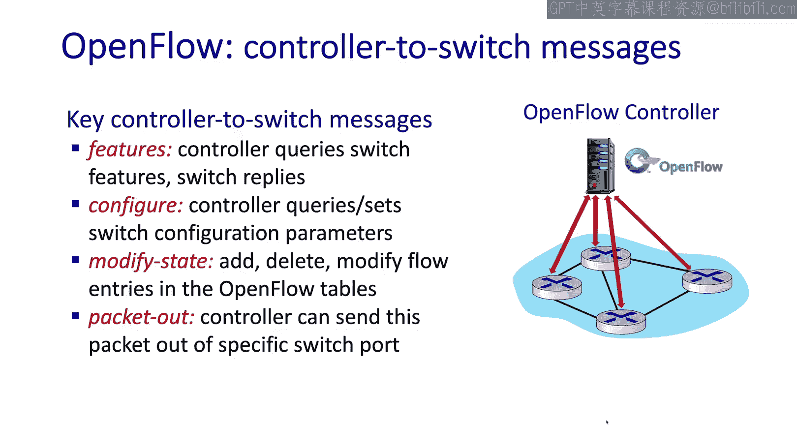

以下是关键的交换机到控制器消息示例：

*   `Packet-In`：交换机收到一个不知如何处理的数据包，将其封装后发送给控制器做决定。
*   `Flow-Removed`：通常表示特定流规则已超时，并从交换机的流表中删除。
*   `Port-Status`：交换机通知控制器其端口状态发生变化。

当然，网络运营商并不直接发送或接收这些消息，他们依赖控制器提供的抽象来生成和解释消息。

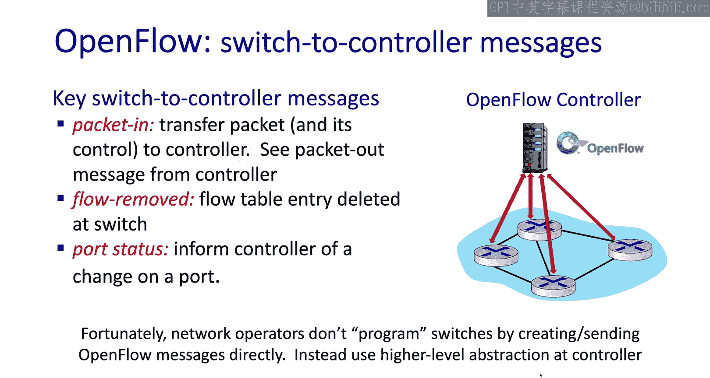

---

## 交互示例：链路故障处理

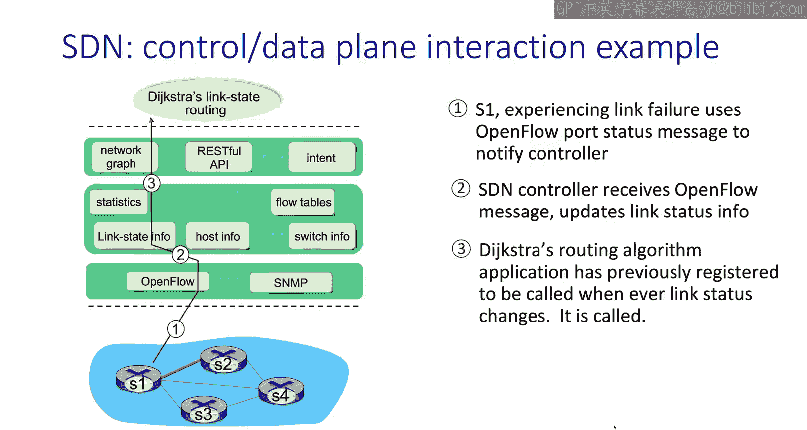

让我们跟踪一个架构内的交互示例。假设网络中发生链路故障，S1和S2之间的链路中断。S1通知控制器其端口状态变化，控制器更新链路状态信息。该信息向上传播到网络图抽象，可以被运行为应用程序的分布式链路状态路由算法使用，从而为S1计算新的流规则。

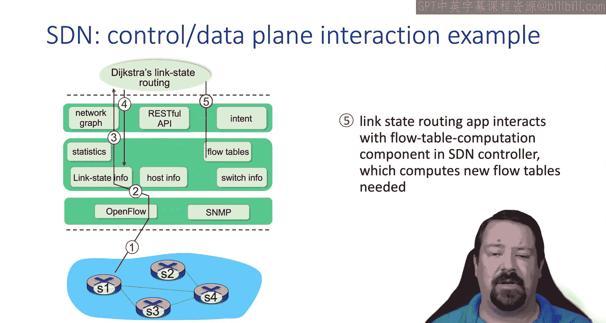

这些新规则被发送到控制器中的流表状态维护模块，然后传播到路由器。

---

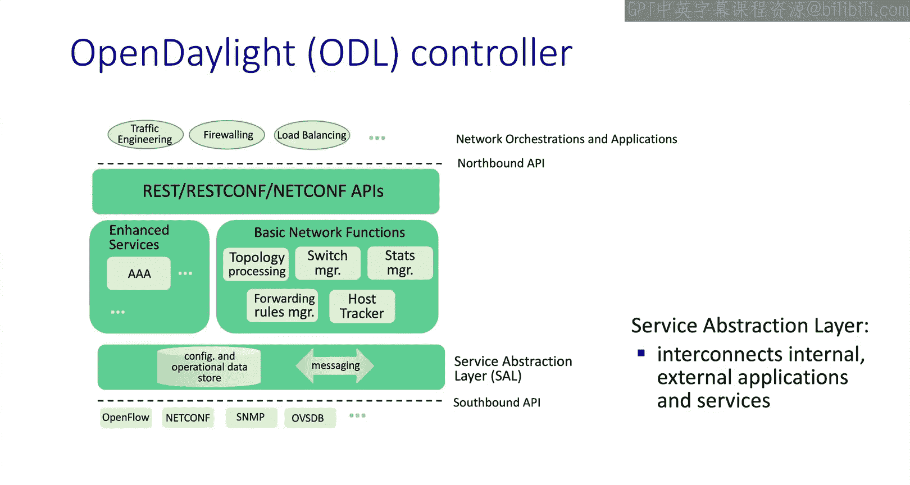

## 主流SDN控制器

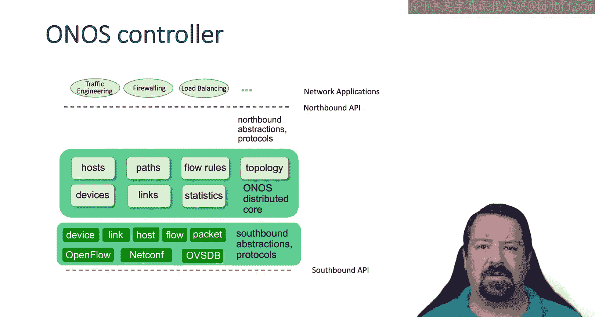

就像PC可以运行不同的操作系统一样，也有不同的供应商提供SDN控制器软件。

其中之一是**OpenDaylight控制器**。它提供基本的网络功能以及一些增强服务。它有一个服务抽象层，使用我们讨论过的一些方法与交换机进行消息传递，并向可构建在此控制器之上的应用程序暴露RESTful API。

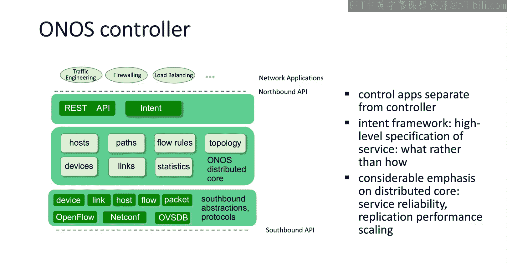

另一个可用的控制器是**ONOS控制器**。它基于一个分布式核心，用于跟踪网络状态，包含对网络中链路和设备的多种抽象，并支持与这些设备的开放通信。它还支持一个意图框架，旨在允许网络控制应用程序提供所需服务的高级规范，而无需提供如何实现该服务的细节。同时，它非常重视通过分布核心来提高可靠性。

---

## SDN的挑战与未来

然而，软件定义网络远非成熟的科学，仍有许多工作要做，特别是在防止控制平面成为网络中的单点故障方面。攻击者无疑会希望攻击这些控制器，以控制网络或导致服务中断。

虽然安全性并非从一开始就内置（OpenFlow最初甚至不支持加密），但在这方面已取得长足进步。现在，交换机和控制器之间的通信已经得到保护（假设运营商已更新到较新版本的OpenFlow协议）。然而，这从根本上仍然是基于IP的，因此在提供服务质量保证方面仍然存在挑战。

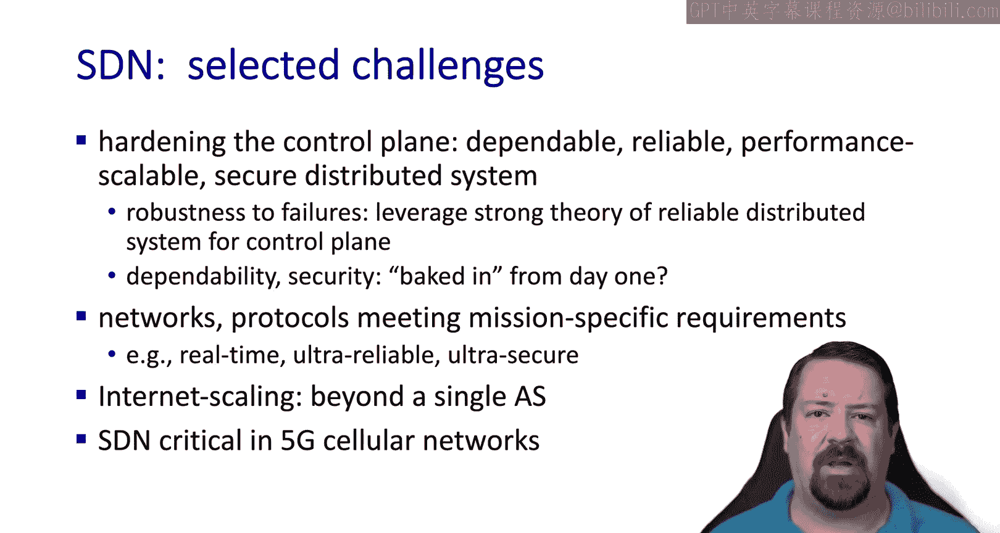

同样重要的是要认识到，SDN主要是传统域内路由的替代方案，并未直接解决是否或如何替代域间路由（如BGP）的问题。因此，SDN的优势难以跨越自治系统边界。然而，在单个提供商网络内部，SDN正得到越来越广泛的部署，尤其是在移动提供商领域。

我们一直在讨论SDN能够集中计算路由表，以及这可能比分布式路由提供的优势。但这只是一个例子。人们还可以设想使用SDN来提供拥塞控制，而不是依赖端点来猜测如何进行拥塞控制。但从根本上说，目前尚不清楚未来的SDN服务将如何发展，以及它们将如何与已建立的网络协议交互。

---

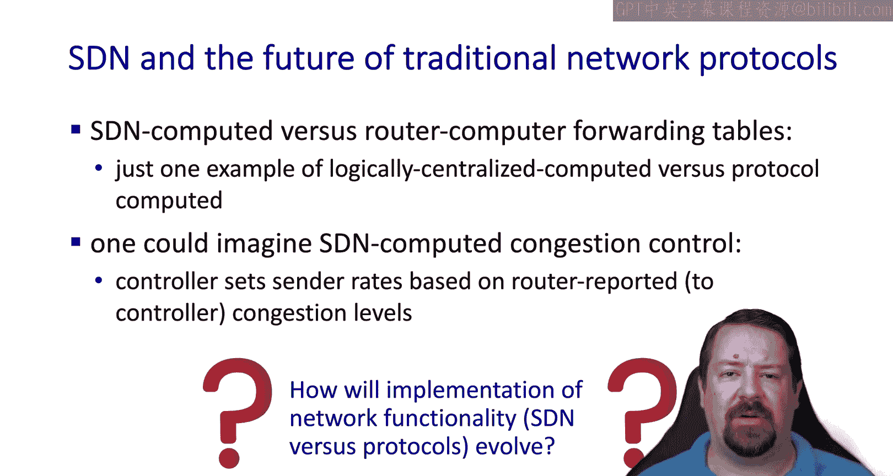

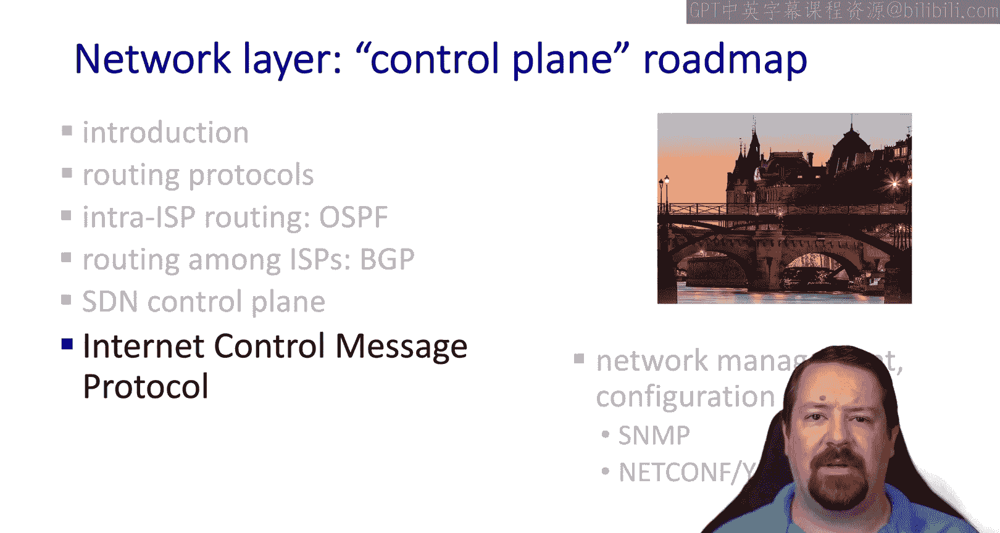

## 总结

本节课中，我们一起学习了软件定义网络的控制平面。我们探讨了SDN架构如何将控制平面与数据平面分离，介绍了SDN控制器、OpenFlow协议以及网络控制应用程序的角色。我们分析了转向SDN的动机，包括简化管理、提高灵活性和促进创新，同时也审视了SDN面临的挑战，如安全性、单点故障以及与现有域间路由协议的集成问题。在下一讲中，我们将探讨互联网控制消息和网络管理。