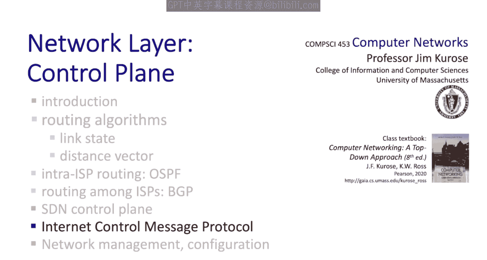
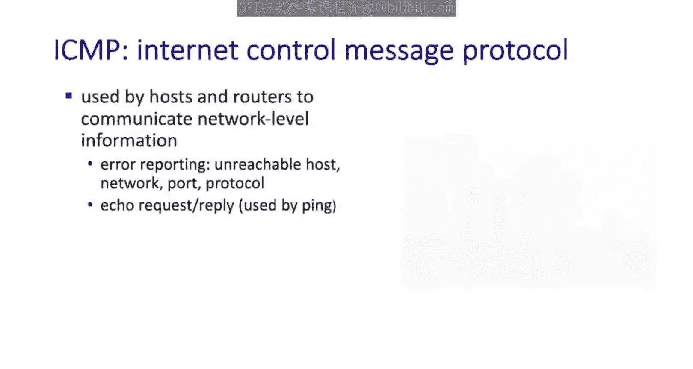
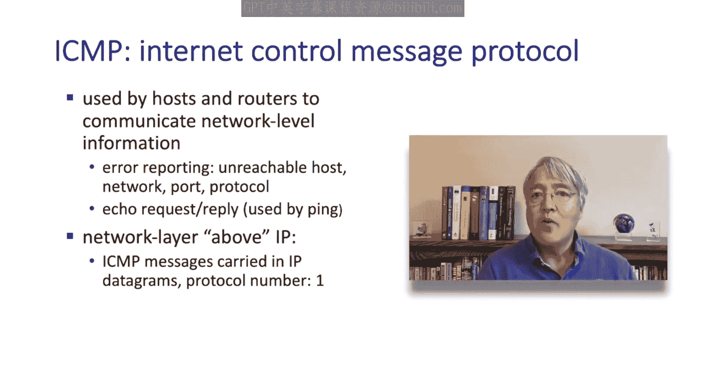
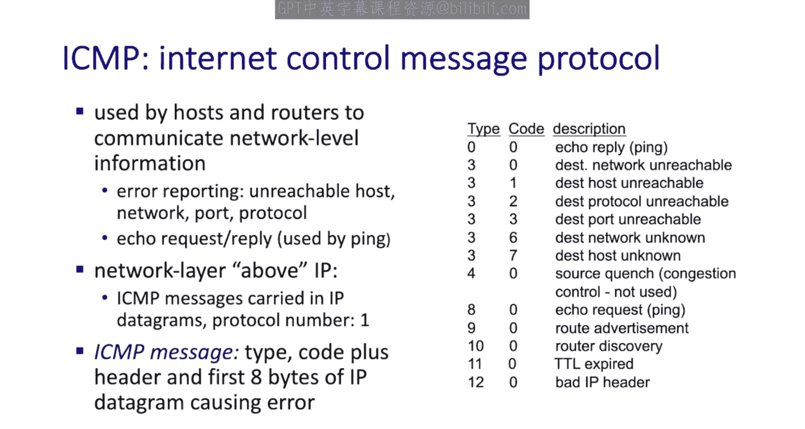
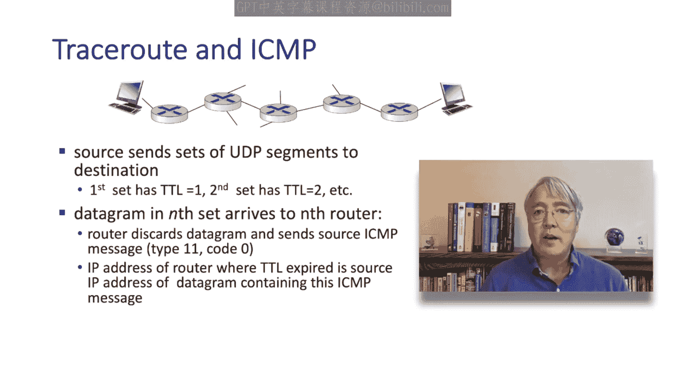
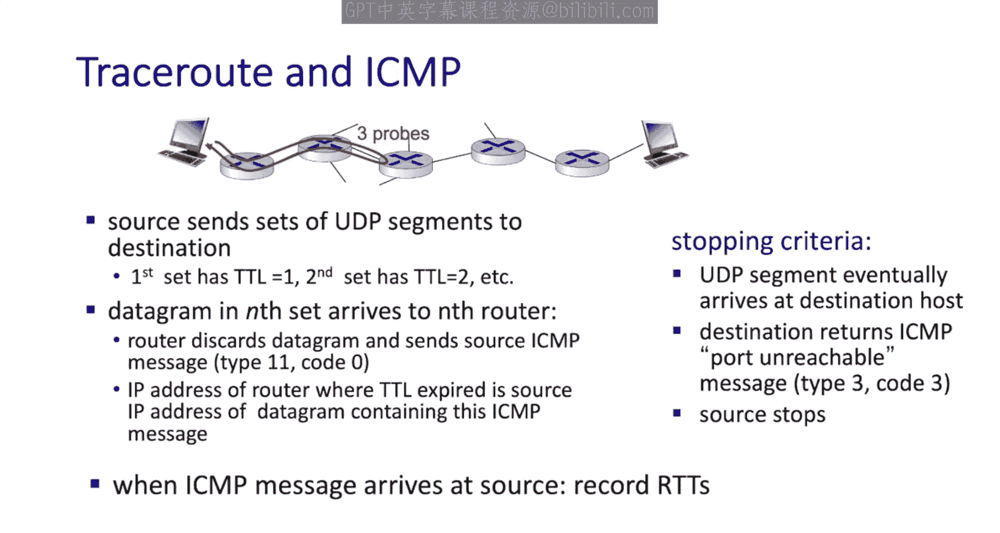
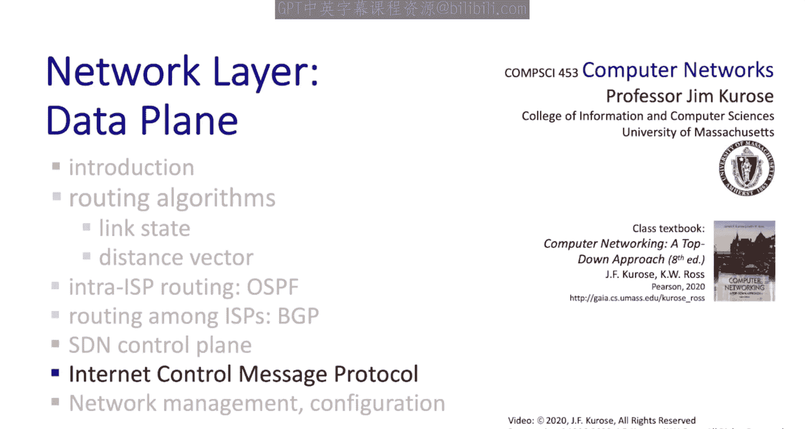

# Jim Kurose《计算机网络：自顶向下的方法｜Computer Networking： A Top-Down Approach》中英（deepseek p41 -41-5.6 ICMP_ Internet Control Message Protocol.zh_en -BV1UMtueiEaA_p41-

In this section we're going to cover the Internet control message protocol ICMP ICMP is used mostly to signal error conditions between hosts and routers so users don't see it much unless they run programs like Ping or Trar but as networking students it's good for us to know a little bit about ICMP I've got great news view this is a really short section I've only got two slides it's going to be short and sweet since the protocol itself is pretty simple so let's get started。

The ICMP protocol is used by hosts and routers to communicate to signal network level information to each other。

 Often， this information is in the form of error reporting。 For example。

 a network or host or a port or a protocol that's unreachable and ICMP messages are also used in ping and trace route。

ICMP messages are carried directly as payload inside an IP datagram。

 just like UDP and TCP segments are carried as payload inside an IP Datagram so in that sense we can think of ICMP as a sibling protocol to UDP or TCP but we really won't think of it as a transport layer protocol as an upper layer protocol ICMP also has a protocol number。

 protocol number one it's the very first number and as you remember this protocol number is used for Dmxing up from IP。

 whether it be to ICMP to UDP or to TCP an ICMP message as a  one byte type field a 1 byte code field。

2 byte checkum field and then the header and up to8 bytes of the I datagram that caused an ICMP message to be issued in the first place for example might contain the first8 bytes of the datagram whose TTL was exceeded you can see the type in the code field shown。

Here， you might note that type 11 code 0 is the ICMP T T L expired message。

 which means that a routers received a datagram decremented the T TL field。

 and the T TL field is now 0。 This message is going to be key to how trace route works。

Well， with this is background， you can probably already figure out how the trace route program works。

 Trace route works by sending a set， usually a set of three UDP datagrams towards a destination。

 The first set of datagrams that sent with an I T TL field value set to one。

 the second set is sent with a TTL value of2， the third is sent with a TL value of3 and so on。 Now。

 remember， an I router when it forwards datagrams always has to decrement the TTL field。

 and when that TTL field is decremented to0， that datagram needs to be dropped at that router。

 that router may also send back an ICMP message back to the source indicating that the TTL value has expired。

And the IP address of the message containing that ICMP TtL expired message is the IP address of the router where that packet was dropped and sovoil if a sender sends a UDP segment with a TtL value of N the reply back from the router is the router that's N hops away on the path towards that destination Now I've used the word may a couple of times here RC 792 doesn't require that ICMP message is be sent by a router it just says that they may be sent In trace routeute。

 the source also records the amount of time from when it's sent an IPgram to the time when the corresponding ICMP message is received from the router that's a measurement of the RtT from the host to that router when UDP segment thats sent eventually reaches the destination host。

 that destination host will typically return an ICMP port unreachable message type。

Code 3， but it's not required to do so， but if a source receives the support unreachable message。

 it knows that it's reached the end of the path。

Well， I promise you this section would be short and sweet and so it is Pro kept。

 you know we can think of ICMP as a tool that can be used for network management。

 Tos like Ping and Traceroute have been used by network managers for decades。

 but there are many more tools and techniques for network management beyond Ping and traceroute。

 we're going to cover those in the next section。

