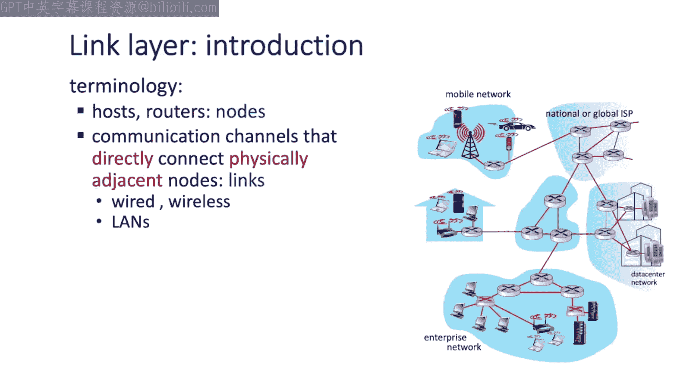
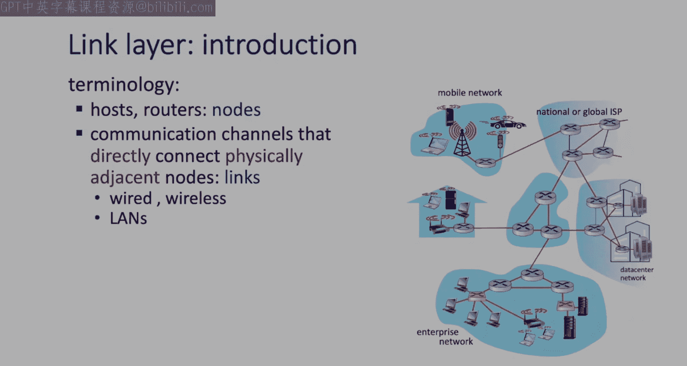
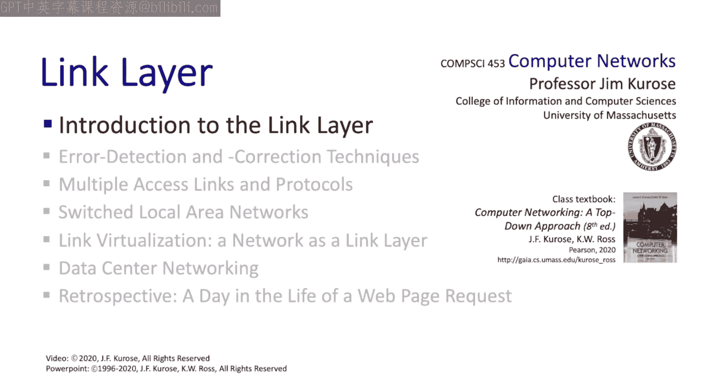

# Jim Kurose《计算机网络：自顶向下的方法｜Computer Networking： A Top-Down Approach》中英（deepseek p42 -42-6.1 Introduction to the Link Layer.zh_en -BV1UMtueiEaA_p42-

Well welcome to the link layer We're now down at the lowest layer of the protocol stack that we're going to cover in this class and we're going to see a number of topics that we've encountered already such as reliable data transfer and flow control Of course now between directly connected nodes but we study these topics before so we've got a good feeling for them and we won't need to cover them in depth here。

 but we're also going to cover a lot of new and interesting topics such as the multiple access problem local area networks。

 addressing now at the link layer and data center networks。

 and of course we're going to cover the instantiation。

 the principles that we learn in practice protocols such as ethernet that we've heard about the address resolution protocol aRP and multiprotocol label switching MPLS so there's a lot for us to cover I think you're going to find it interesting so let's get going。

Well， let's start off our study of the link layer by laying out our goals， of course， as always。

 we're going to want to look at both principles and practice， so let's start with principles。Well。

 we already studied error detection。 We looked at the Internet checkum earlier in the transport layer in the link layer。

 we're going to study much more powerful error detection and correction techniques as well。

 The heart of the principles that we're going to take a look at coming up next is the multiple access problem。

 How do multiple nodes share a common communication channel。

 This to me is another top 10 problem in networking。

 And I think you're going to find that really interesting。 And of course。

 we want to look at the issue of addressing Now in the context of the link layer。 terms of practice。

 we're going to look at some link layer protocols， including ethernet virtual local area networks。

 multiproto label switching and then finally， data center networking as well。

 So that's what we're going to be covering roughly in that order。 So let's get started。Well。

 let's start off by defining some link layer terminology depicted over here in the diagram on the right。

 Well， of course， we see the hosts and the routers that we've seen throughout this course。

 and we'll refer to them simply as nodes here。 The context of the link layer。

 The role of the link layer to serve as a communication channel directly connecting to physically adjacent nodes。

 and we'll want to parse that statement quite carefully and discuss what we mean by directly connecting and physically adjacent two nodes might be directly connected by a physical wire or by a wireless link with one host on each end thats simple or by a local area network。

 the critical thing to remember here is that the link layer connects two nodes without any intervening layer 3。

 that's to say network layer router。 Well， maybe you've just got a flashback when I said no intervening layer 3 router。

 you may recall when we were studying subnets network layer addressing in。😊。

Interfaces back in section 4。3。 Let's flash back to this slide here from section 4。3。

 We asked then how are interfaces connected。 Well， we're going top down we're in chapter 4。

 the network layer and we said， well， we'll learn about that later in chapter 6。

 Well here we are in chapter 6 and now we can be more precise Now we can say that interfaces as shown here。

 the diagram are connected by the link layer and that link layer can be a physically connected wire or wireless link。

But it can also be a link layer with interconnected link layer switches。

 which will refer to as a local area network or a LAN。

 or the link layer can consist of wireless access points and nodes， as we'll see in Cha 7。

But the key thing here is that there are no layer 3 that is network layer routers between two nodes that are connected at the link layer。

 The link layer consists of links and switching possibly that will switch layer 2 frames。

 but a link layer has no layer 3 routers。Well， let's return now to our link layer vocabulary。

 where the last important definition is that of a frame。

 which is the layer to packet or protocol data unit for the link layer framera will typically encapsulate an IP diagramgram as it payload in an internet setting。

Well， we can summarize by saying that the link layer has the responsibility of transferring a datagram from one node to a physically adjacent node over a link。

 and we should realize that pretty much every word in that statement is important。Now。

 let's put the link layer into the larger end end context。

 If we were to follow an I datagram from its initial source to its final destination。

 we could see that along the way， it could be transferred by different link protocols over different links on its source to destination journey。

For example， WiF on the first link， Ethernet on the second link， and so on。

And different link layer technologies provide different services and have different characteristics how noisy is the link Does the link provide link layer error control or error detection and correction if we take a traveler analogy and say consider a trip from Princeton to Losan and Switzerland we might take a car to get from Princeton to the JFK airport。

 take a plane from the JFK airport to Geneva and then take a train from Geneva to Losne In this analogy。

 the tourist would be the datagram who travels from sorts to destination。

 an individual segment on the end to end trip， the transport segment would be a communication link each with different services hopefully with reliable transfer and the transportation mode is the link layer protocol here。

Let's next talk about the services that are to be implemented by the link layer like any layer。

 the link layer implements and encapsulation services。 The case of the link layer。

 link layer is going to take a network layer Datagram at its own fields and a header wrapped around the network layer datagram as payload then pass the link layer frame。

 as we'll call it down to the physical layer for bit levelvel transmission across the physical media。

 We're going to encounter a new service at the link layer that we've not seen before。 media access。

 When multiple nodes need to share the same communication channel。

 their access to that channel needs to be regulated。 It needs to be coordinated。 Of course。

 there's a protocol for that。 Those protocols are known as multiple access protocols Also。

 media access protocols or Mac。 So Mac protocols， not like Mac computers。 And lastly。

 we'll see that at the link layer， there's going to need to be a new addressing scheme as well。

 sort of the bane of。Our existence as networking students will see that the link layer。

 many link layers implement a 48 bit Mac layer addressing scheme。

 which is distinct from the 32 bit or 128 bit IP addressing scheme that we've studied earlier Mac addresses will only be used in the context of an individual link they won't be used network wide as in the case of the IP addresses that we've studied Another service that can be provided by the link layer is will liable delivery of frames between adjacent notes from a principal standpoint。

 we already know how to do this a NAs error detection bits。

 timeout and retransmit these are precisely the mechanisms that are used at the link layer Now these techniques are seldom used on low bit error links but they are used in wireless links and a number of cases because wireless links are subject to noise and interference and have high bit error rates and you might ask yourself well ge some links。

provide error control， others don't provide error control。

 we do have error control end to end why is it that we've got this sort of mix of local as well as end to end error control？

Some of the other link layer services that are offered by link layer protocols include flow control。

 which we've learned is about speed matching between the sending and receiving sides of a link here。

 making sure that the link layer center doesn't overflow the link layer buffers on the receiving side。

 There's error detection where more powerful error detection and correction codes more powerful than the Internet check some are used to detect。

 and in some cases， correct bit level errors in a frame。

 We're going to study error detection and correction techniques in the following section。

 If errors are detected， some link layer protocols like Bluetooth and 4G LT cellular links。

 use an actnac retransmission protocol， like we studied in chapter 3 to recover from frame loss。

 And lastly， we should note that some links allow for data to be transferred simultaneously in both directions。

 these are called full duplex links。 While for other links。

 data cannot be transmitted and received at the same time。 these are called half duplex links。

So each network host has a link layer。 The implementation of a host link layer is particularly interesting because it's here where we're going to see the split between hardware and software。

 part of the link layers implemented in hardware on chip or in a network interface card。

 which attaches to the host system bus。 The upper layer parts of the link layer， demplexing up。

 handling interrupts， for example， are handled in software and the hosts operating system。

 So as we see in the figure here， the link layers is where we see the split between network functionality implemented primarily in hardware and the rest implemented in software。

 The lower parts of the link layer and the physical layer are implemented in hardware。

 the upper parts of the link layer and the higher layers of the protocol stack are implemented in software typically。

😊，And lastly， here， we can follow the data On the sending side。

 the interface is going to encapsulate the I datagram in a link layer frame。

 adding error detection and correction bits， link layer sending and receiving addressing information。

 perhaps fields for sequence numbers and acknowledgments， flow control and more。

 All of these are the fields that will allow the link layer to implement its service。

 It then passes the frame to the physical layer for bit level transmission。 On the receiving side。

 the link layer receives a frame from the physical layer performs error checking。

 flow control and other services， then finally removes the payload， typicallyyp an I datagram。

 and passes the datagram up to the network layer。😊。

Well that wraps up our introduction to the link layer。

 we've seen that there's some ground we've already covered flow control， reliable data transfer。

 addressing， bit levelvel error detection with some new takes on these topics。

 but we've also seen that there are a number of new interesting principles and protocols that we'll want to take a look at。

 so let's get started。

