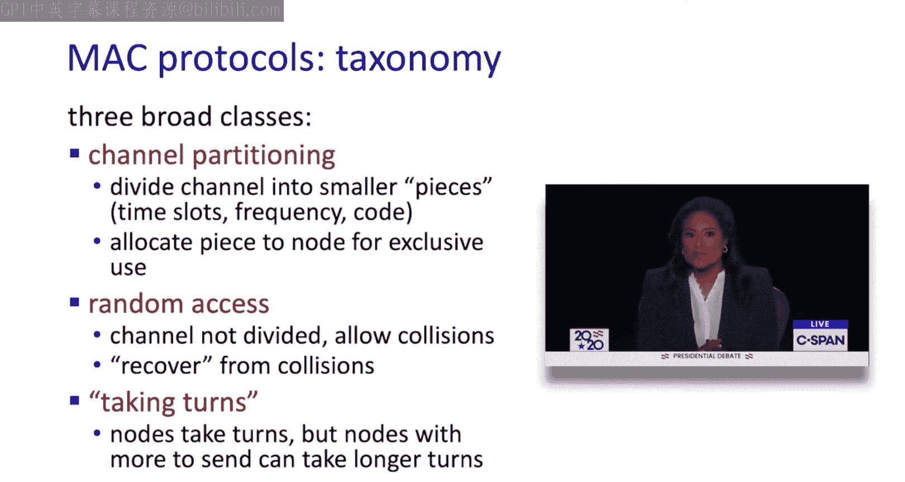
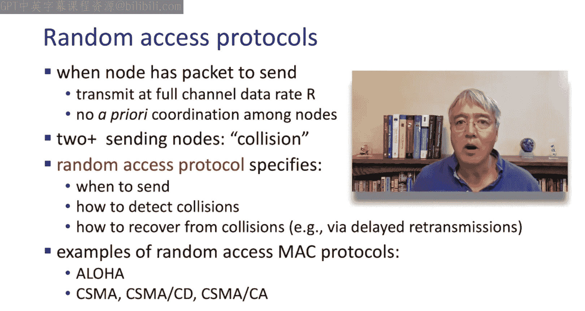
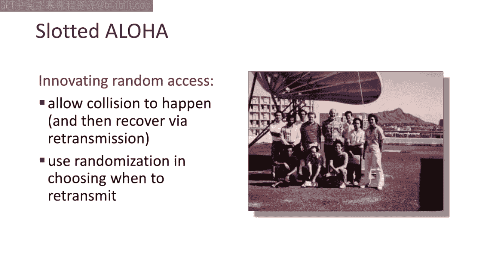
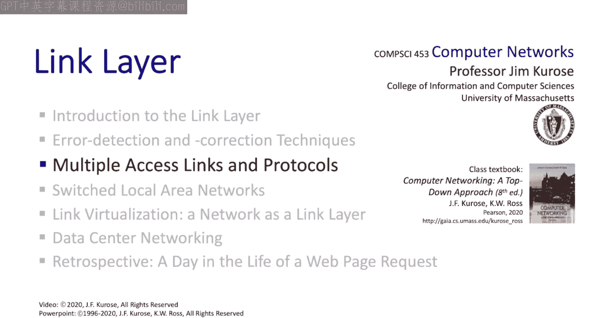
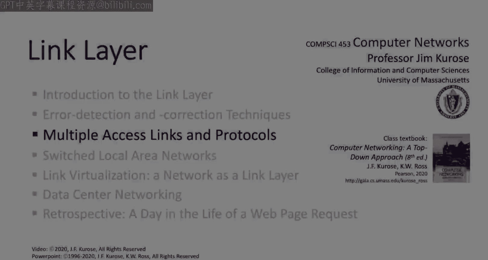

# Jim Kurose《计算机网络：自顶向下的方法｜Computer Networking： A Top-Down Approach》中英（deepseek p44 -44-6.3 Multiple Access links  and protocols.zh_en -BV1UMtueiEaA_p44-

Having now looked at some of the principles involved with the link layer。

 we're ready to take a look at link layer protocols which themselves are going to introduce issues of both theory and practice。

 and there's a lot to be covering here。At the network layer。

 we encountered a relatively small number of protocols， primarily IP， BGP and OSPF。

 and at the link layer we're going to see a much larger number of protocols。

 and generally this is keeping and keeping with the internet hourgss architecture that we talked about earlier with IP and the network layer being the thin waste and there being more diversity of protocols at the link layer。

Here's how we're going to structure our study of multiple access links and protocols。

 We're going to start off by looking at the multiple access link itself。 So broadcast channel。

 Then we're going to take a look at three classes three families of multiple access protocols。

 We're going to look at channel partitioning protocols。

 random access protocols and taking turn protocols。

 Then we're going wrap up our study by taking a look at the cable access network where we'll find a number of these approaches in use。

 So there's a lot to cover。 So let's get started and let's get started by taking a look at the broadcast multiple access link。

Well， let's begin our discussion of multiple access links and protocols by talking about links in the link layer。

 There are basically two types of links。 There are point to point links that operate between a single sender and single receiver。

 and then there are broadcast links where there are multiple senders and multiple receivers attached to this broadcast link and we're going to encounter broadcast links and a lot of different scenarios。

 a shared wire， for instance， cable ethernet， the original ethernet。

 shared radio 4G5G LT systems that we take a look at shared radio like 802。11 Wifi networks。

 shared radio and satellite networks， and in a human sense。

 we humans talk to each other all the time over a shared medium and a cocktail party in a class。

 wherever conversations take place。In the case that we have the single shared broadcast channel。

 we're going to need a multiple access protocol to coordinate access to this shared broadcast channel。

 And one very important property of this broadcast channel is that when there are two or more simultaneous transmissions by a node。

 they're going to interfere with each other。 Well refer to that as a collision。

 And if a node receives two or more signals at the same time。

 there are two senders colliding with each other， neither of those transmissions are going to be successful。

 So we're going to need a multiple access protocol to coordinate the transmissions by nodes in the network。

 multiple access protocols and distributed algorithm that determines how nodes are going to share the channel。

 That's to say to determine when an individual node can transmit。

 And when you think about a multiple access protocol， the real challenge is。 Well。

 I want to share a communication channel。 But any communication about how to actually share that channel is can have to use the channel itself。

 There's no sort of out of bands secondary channel。That can be used for coordination。

 This is going to be at the heart of the multiple access problem。

Before we start taking a look at multiple access protocols， let's take a step back and think， well。

 ideally， what would we like a multiple access protocol to do。 Well， first。

 when a node wants to transmit， hopefully it'll be able to transmit at rate R。

 the maximum rate of the channel。 And when M nodes want to transmit， we want some kind of fairness。

 we want each node to be able to send at an average rate of R over M。

 we might like it to be fully decentralized， So there's no special node。

 no central node that's going to coordinate transmission。

 and maybe no synchronization of clocks or slots， we'd like to keep it simple。Well。

 multiple access protocols is one of my favorite topics to teach in a computer networks course。

 And that's because we as humans have protocols that are going to govern how it is。

 We actually share communication medium， like the air between us when there's a group of people who want to communicate。

 So think about it。 You're in class。 You're in a meeting。 You're in a restaurant。

 you're talking with a friend。 How is it that as humans we organize how we determine how we're going to coordinate who's speaking at a given point in time。

 And I can almost guarantee you that anything you can think of in terms of how humans execute protocols to determine whose chance it is to get to talk。

 There's going to be an analog in a multiple access protocol。 So think about it for a second。😊，Okay。

 enough thinking would you come up with well when I teach in class with face to face students。

 a lot of times the first thing students will say is well。

 look in this classroom you're always saying any questions， any comments。

 we raise our hands were recognize and then we speak。

 so that's an example of a multiple access protocol absolutely。

Are there any questions before we proceed， Are there any questions before we proceed。 Well。

 that's an example of what we might call a taking turn protocol。

 The technique being used there is known as polling。

 where we have a centralized device that polls client devices to see if those client devices have data that they want to send in other taking turn protocols like token passing。

 for example， the right to transmit is explicitly passed from one note to another。 Now。

 it's here turn。Now it's your turn。Let's now move on to a second class of multiple access protocols。

 But again， with human analogs and think about conversation。 It's not explicitly coordinated。

 People talk when they have something to say。 think that's a pretty common form of human multiple access。

y are you doing how you doing for asking Well， this approach of speaking when you have something to say without explicit coordination。

 sometimes works， but sometimes as we just saw， it really doesn't。 This kind of approach， though。

 is known as a random access protocol。 and it's actually widely used in practice， as we'll see。

 if you're polite like a human being and you listen before you speak。

 that's known as carrier sensing。 And if you're super polite。

 If somebody else starts talking while you're talking， you stop。

 that's called collision detection when you stop transmitting when someone else is speaking。 Well。

 the last class of protocols。😊，That we'll take a look at or what are known as channel partitioning protocols。

 we take the channel divided into chunks at time or frequency。

 we assign those time slots or frequency bands to individual nodes。At the beginning of each section。

 each candidate will have two minutes uninterrupted to answer my first question。

 The debate commission will then turn on their microphone only when it is their turn to answer and the commission will turn it off exactly when the two minutes have expired。

 After that， both microphones will remain on。 But on behalf of the voters。

 I'm going to ask you to please speak one at a time。

 the goal is for you to hear each other and for the American people to hear every word of what you both have to say。

Well， that's a great human example of a centralized controller allocating TDMA slots very explicitly。

 followed by a period of random access with collisions I might add as well。

 so now we've seen the three broad classes of multiple access protocols that we want to study channel partitioning protocols。

 random access protocols and taking turns protocols。

 so now let's dive down a little bit more into the details of these protocols and see their use and link level networks。

We're going to look at two channel partitioning Mac protocols， time division。

 multiple access and frequency division， multiple access。

 And you may recall we encountered these earlier in Cha 1 when we were looking at access networks。

 Let's look at TDMA first in TDMA， access to the channels divided up into rounds。

 and each round is further divided into slots。 And each note is allocated one or more slots within a round。

 If slots are unused or unassigned。 they're going to go idle。 So in this example， here。

 we see a six station local area network， stations 1，3 and 4 have packets descended。

 so they do so in their assigned slots and note the slots 2，5 and 6 are going idle。

Frequency division multiple access or FDMA is similar to TDMA， except now the frequency band。

 the entire frequency band is going to be divided into subbands and each node is going to be allocated。

1 or more subbands within this larger frequency band。

 So just like slots are allocated in TDMA frequency subbands are allocated in FDM。

 And if a frequency subband is unassigned or a node has nothing to send， but hasn't assigned。

 Subband， then that subband is going to go idle。 So in this example here， nodes 1。

3 and 4 have packets to send and send them on their frequency bands while frequency bands 2。

5 and 6 are going idle。Now that we've covered channel partitioning protocols， TDMA and FDMA。

 let's next turn our attention to random access protocols now remember with random access protocols there's no a priorri coordination among nodes there's no sense of term and as a result two nodes to or more nodes may transmit simultaneously the same time resulting in collisions。

 so at the heart of the random access problem are going to be effective ways to either avoid or recover from such collisions。

The first random access protocol invented the AllloA protocols， really also one of the simplest。

 but it really pioneered two key ideas that we'll see in all later random access protocols。

 The first idea was to allow collisions to happen in the first place。

 Remember TDMA and FDMA that we just looked at avoid collisions by carefully allocating time slots and frequency bands。

The second key innovation in Allloa was to use randomization to recover from collisions。

 So here's the setting for slotted Allloa。 Let's assume that all frames are the same size。

 that times divided into time slots and that the length of a time slot is the time needed to transmit a single frame。

 Notes are synchronized。 They've got a common clock and nodes begin a frame transmission only at the start of slot times。

 And， of course， if two or more nodes transmit in the slot。

 they're going to be collisions in these collisions are detected by the senders。😊。

And here's how slotted a logo operates。 It's really simple when a node has a frame to send。

 it simply transmits that frame in the next slot。 couldn't be simpler。 If there are no collisions。

 we've got a success however， if there are collisions。

 a node's going to retransmit that frame in each subsequent slot with probability P until it's successful。

 And so here we see the use of randomization。 After a collision。

 the colliding nodes are going to randomize when they attempt to retransmission of that message。

 And you can see why that has to happen。 If two nodes were to always retransmit their messages and the following slot。

 they'd collide forever with randomization， that's to say transmitting with probability P hopefully only one of these nodes is going to transmit and be successful and the other will transmit in some later slot。

We'll see that randomizations used in many real world link layer random access protocols。

 including Ethernet and WiF， even though the randomization there is done in slightly different way。

 but it was aloha that first put the word random in random access protocols。

Here's an example of slotted alo in action。 First time slot nodes 1，2 and3。 all transmit。

 So there's a collision。 These three nodes then randomize their retransmission times and do so randomly in such a way that in the next time slot。

 No one transmits。 Then nodes  one and2， Both transmit and collide again in the third time slot。

 nodes 1 and2 randomize again， and finally， in slot 4 here。

 node2 transmits all by itself and is successful。 node 1 later transmits successfully here。

 as does node 3 is slot later。 Well， we can identify a number of pros and cons about slotted aloha。

 So random access protocol single active node can continuously transmit at the full rate of the channel。

 So that's good。 It's highly decentralize the only synchronization among the nodes is really the timing。

 And finally， it's simple。 You got a frame。 Youcend it。 That's really easy。 On the con side。

 There's some overhead to synchronization。 But the major issues here are the wasting of time transmission slots。

😊，To collision and due to idle slots。And it's not too hard to quantify the cost of these wasted slots。

 So let's do so。 Let's define the efficiency of slotted aloha as the long run fraction of slots that are successful。

 when n nodes always have a message to send and transmit in a slot with probability P a little bit of combinors and calculus。

 don't worry， if you rusty on this or haven't seen it。

 we can proceed as follows for a given node to be successful， it needs to transmit first。

 and this is going to happen with probability P。 And the other n-1 nodes need to not transmit。

 And this happens with probability1 P to the n-1 power。

 And so the probability that a given node successful in a slot is this value here。

 and the probability that any single node among the n is successful is just n times this quantity。

 And finally， if we want the value of P that maximizes efficiency for a large number of nodes。

 we then find over all values of p and for large N that。😊。

Maximum efficiency for slottted deloha is just 0。37。Wow， that's to say， in the long run。

 And in the best case， only 37% of the slots are going to successfully carry a frame。

 So if you have a 1mbit per second channel， for example。

 the maximum throughput you could achieve as just 370 kB per second。 This then is the price。

 the cost of using the slot at aloha protocol。 And I note that a simpler version of aloha without slot boundaries It's known as pure aloha。

 you just transmit when you have a frame and again。

 randomized after a collision that pure aloha has an efficiency that's even lower just half of this already pretty small value of 0。

37。😊，Another class of random access protocols known as Car sense multiple access， CSMA。

 These protocols can overcome these inefficiencies in Aloa。

 and you can think of an allloa aser as sort of an impolite conversationalist。

 Iolite in the sense that， well， you got something to say， you just say it。

 CSMA protocols are more like polite conversationalists more polite in the sense that they listen before they speak in simple CSMA。

 you listen before you transmit。 That is you sense the channel。 and if the channel sensed idle。

 you transmit the entire frame just as in Aloa。 If the channel sense busy， you don't transmit。

 you defer your transmission randomly until a later point in time。

 Sometimes this is called random back off。 in the human analogy here is clear。

 your parents and your teachers hopefully taught you。

 you listen before you speak and you don't interrupt others。

An even more polite version of CSMA is known as CSMA with collision detection。

 CSMACD in CSMACD again， you never speak when others are speaking。

 but if you do start to speak and someone else starts speaking at the same time。

 a collision can still occur these transmissions can be detected within a relatively short period of time and the colliding transmission aborted。

 thereby reducing channel wastage rather than transmitting the full length of a colliding frame。

 you stop as soon as a collision is detected collision detection is pretty easy in a wired situation。

 but it's more difficult in wireless links as we'll see in chapterpt 7。Now。

 you might be wondering that with CSMA being a polite conversationalist listening before speaking。

 how there can be collisions， After all， you listen before you speak。

 but you've all undoubtedly had the experience of you and a friend in conversation。

 both listening before speaking， and yet， both starting to speak at the same time as we saw in this video earlier。

for asking And the issue here has to do with propagation delay and the distance between nodes。

 it takes time for a transmission being sent by one node to reach another node in particular。

 even though a node senses the channel idle。 It doesn't necessarily mean that another node hasn't already begun transmitting。

 but that transmission just hasn't had time to propagate yet to the node performing the carrier sensing。

 Here's an example illustrating this idea。 Four nodes here or laid out across the X axis separated in space。

 The Y axis going down represents increasing time。 At T 0。

 node 2 senses the channel idle and begins transmitting。

 You can see its transmission in yellow here propagating to the left and to the right as time increases。

 So far so good at T1 node 4 senses the channel idle since the beginning of node2's transmission hasn't reached it yet。

Now we know that node 2s already started transmitting， but because of the signal propagation delays。

 node 4 doesn't know that yet， so node4 senses the channel idle and begins transmitting and its signal propagates left and right shown in red here。

Eventually， Note 2 and Note 4's transmissions collide and interfere with each other in the checkered red and yellow areas here。

 so even if node perform carrier sensing， collisions can happen due to the physical distances between nodes and signal propagation delays。

In order to minimize the amount of wasted transmission time。

 a transmitting node can perform what's known as collision detection to stop transmitting if it hears that its own transmissions are being interfered with。

 in this case using collision detection， rather than transmitting a full frame that has suffered a collision。

 a nog will only transmit part of that frame， thus freeing up the channel sooner， that's a win。Well。

 we've said that Ethernet uses carrier sends multiple access with collision detection。

 So let's go take a closer look at how that operates。 Just like any link layer protocol。

 Ethernet receives a datagram from the network layer。

capsulates that datagram into a link layer ethernet frame and then gets ready to transmit that frame。

 Ethernet's going to use C SNACD to determine when exactly to transmit that frame。 First。

 ethernet performs carrier sensing。😊，The channel sensed idle begins transmitting the frame immediately。

 On the other hand， of the channel sensed busy， Ethernet continues to sense the channel and then waits until the channel goes idle and then transmits the frame immediately。

 The entire frames transmitted without a collision great we done。

 But if another interfering transmission is detected while this ethernet sending its frame。

 frame transmission is going to be stopped and a short jam signal will be sent。

 After a boarding frame transmission， ethernet then enters the binary back off phase。

 It's also called the exponential back off phase。😊。

And this is how ethernet performs randomization following a collision after given frames experienced a collision for them time。

 Ethernet's going to choose a value K at random from the interval 0 to 2 to the M minus1。

 and then weight K times 512 bit times， and then return to step 2， the carrier sensing step。

So there you have it， that's how Ethernet performs multiple access。And in closing。

 it's worth saying just a few more words about this exponential back off phase。

 Note that as the frame experiences more and more collisions。

 it's more and more likely that there are a larger number of nodes with frames tocent。

 And in this case， the aandization intervals going to grow longer and longer as well。

 So we don't have a large number of nodes trying to randomize over just a short period of time。

 And that's exactly what you want， randomizing over a short period of time when there may be just a few senders and randomizing over a longer period of time when there are likely to be a larger number of senders。

 I've always thought that that's a really nice， really well designed property of ethernets binary back off algorithm。

Well we've now covered two forms of multiple access protocols。

 taking turns protocols and random access protocols。

 third and final broad class of protocols are what we might call taking turn protocols。

 used in Bluetooth， for example， relatively simple， let's take a look。

But before diving into taking turn protocols， let's first motivate the need for yet a third class of multiple access protocols。

 Well， we've seen with channel partitioning Mac protocols that they're both pros and cons。

 channel partitioning protocols are able to share the channel efficiently and fairly at high loads。

 the channel can be run at 100% utilization， but at low loads， they're inefficient。

 There's delay in accessing the channel and if only one node has data as。

 it's only going to be able to access one inth of the bandwidth over a period of time。

We've seen that random access Mac protocols have pros and cons as well。

 and these pros and cons are sort of the opposite the duall of what we saw with channel partitioning protocols。

 They're very efficient at low loads。 there are a few collisions and a single node can fully utilize the channel all by itself。

 if it's the only one that has data to send， but at high loads there's going to be collision and that's overhead。

We can now turn to taking turn protocols， which are trying to take the best from both of these worlds。

 The channels going to be allocated explicitly， So there'll be no collisions。 But on the other hand。

 nodes won't hold the channel for long if they have nothing to set。 And as we'll see。

 there are basically two approaches taken， polling and token passing。😊。

A polling protocol has a centralized controller which coordinates access to the channel。

 The controller sends polling messages to clients explicitly allocating the channel to a specific client if that client has something to send when a client's done transmitting its frame or if it has nothing to send the centralized controller will then pull the next node in the polling sequence and so on。

 and you can see the polling protocol and operation here。

 node1 is first poll and sends its message to the controller。

 So note here that frame transmissions come from the nodes to the central controller and then would go to the central controller back out to the notes。

After note 1 is polled and sends its message node 2 is pulleded。 It's got nothing to send。

 so it returns a short sort of an I have nothing to send message to the controller。

 Note 3 is polled and so on。 So it's conceptually simple。

 Of course we're going to need a protocol for a client note to join and leave the polling sequence。

 and we'll see how that's done when we cover Bluetooth in the next chapter。

So on the plus side there's no collisions and each node can get one end of the channel。

 but if a node is nothing to send， it won't use the channel for long and there's just a short polling delay until another node gets its chance。

 Well there's a bit of controller overhead associated with polling and of course。

 the centralized controller represents a single point of failure。In token passing。

 nodes are typically arranged into a ring topology and a control token message is explicitly passed from one node to the next in some order。

 If you're a node holding the token， that means it's your turn to transmit your message。

 when you're done or when you have nothing to send。

 you pass on the token message to the next node in the token passing sequence and so on。

 So in this example here， node 1 has nothing to send and so immediately passes the token onto node 2。

 node 2 holds the token transmits its message and then passes the token message on when it's done and so on。

While token passing has both the advantages and the disadvantages that we saw before with polling。

 there's a joint leave protocol that's going to be needed， some control overhead。

 some excess latency and in this case the token represents a single point of failure。

Let's wrap up our study of multiple access protocols by now looking at how the principles we've learned are put into practice。

 and we'll use the cableable access network as an example since it uses TDMA。

 FDMA and random access all in one system。And you may remember that we briefly looked at cable access networks way back in chapter 1。

 There's a cable head end here where we find the cable modem termination system， CMTS。

 the socalled doxs specification。 that stands for data over cable service interface specification specifies the cable access data network architecture and its protocols。

 Doxs specifies FDm to divide the downstream network that's to say from the headend to homes and the upstream network from homes up to the headend。

 each into multiple frequency channels。 both the upstream and the downstream channels or broadcast channels。

 The downstream channels are pretty straightforward since it's only the CMTS that's transmitting on the downstream channels。

 We've got one sender and many receivers。 It's the upstream channels that are more interesting since the cable modems in multiple homes are going to need to share that upstream broadcast channel。

 So let's take a look now at the upstream channel。😊。

An upstream channel at a given frequency is divided into TDMA slots。 and you might ask yourself。

 well， how are these slots assigned？Well， some upstream slots are assigned to nodes that is assigned to homes by the CMTs using what's called a downstream map frame that's sent from the CMTS to the homes is shown here。

 The map frame explicitly indicates which nodes can transmit in which slots in the next set of upstream slots。

 Other upstream slots。 however， aren't preassigned and instead nodes transmit into these unassigned frames in a random access manner using binary back off as shown here。

 Well， so there you have it。 the cable network uses FDM to divide the frequency band into subchans。

 divides a frequency subchannel into TDM slots。 The CMTS explicitly assigns some of those slots to specific homes。

 The basis of requests that are being made for the slots。

 But other slots are accessed in a random access manner。

 and actually it's the request for these upstream slots。

 requests that are transmitted on the upstream channel by the homes。

That are transmitted using multiple access with binary back off。

 so the cable network is a great example for studying multiple access， FDMA。

 TDMA and random access all in one network。Well that wraps up our study of multiple access links and protocols and we've covered a lot of ground here。

 we started by talking about the characteristics of the broadcast channel。

 we then studied three broad classes of multiple access protocols， channel partitioning protocols。

 random access protocols， taking turns protocols finally we looked at putting those protocols into practice by taking a look at the cable access standard known as DoCs Com up next we're going to take a look at switch local area networks。

