# Jim Kurose《计算机网络：自顶向下的方法｜Computer Networking： A Top-Down Approach》中英（deepseek p45 -45-Media Access Control (MAC) Protocols - Network Link Layer -BV1UMtueiEaA_p45-

In this video we look at various multiple access schemes or Mac layer protocols。

These include channel Partitioning protocols， random access protocols。

 and even the DXS protocol for cable access networks。Let's get started。

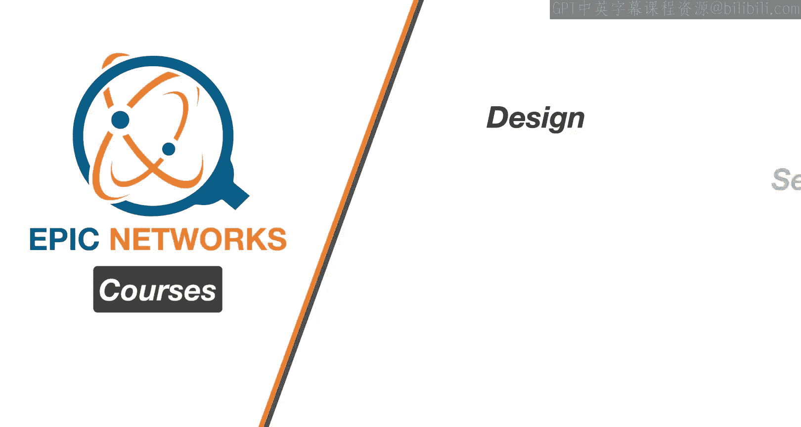

We've now arrived at the section of the chapter where we look at multiple access protocols。

 meaning protocols that determine how a link is shared when multiple devices want to use it at the same time。

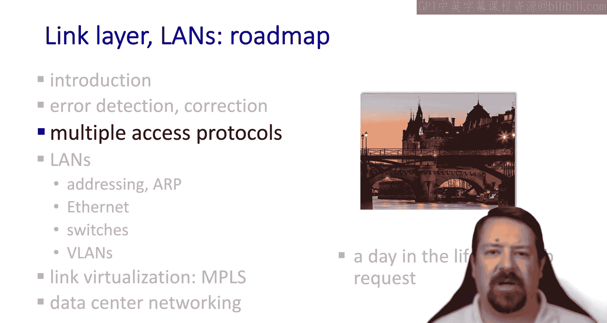

We can break our links down into point to point or broadcast technologies。

Point to point links only connect two devices， meaning in practice that one device's transmitter is connected to the other device's receiver and vice versa。

So today's point to point devices are full duplex， meaning that no sharing of the bandwidth is needed。

 Each end of the link can transmit and receive at the same time， broadcast media on the other hand。

 can have more than two devices on the link and only one can be transmitting at a time。

 otherwise there will be a collision。Wirreed Ethernet was known to be a shared medium。

 but that really applies to older versions where modern versions of wired Ethernet are all constructed of point to point links。

However， the basic mechanisms that were designed to work with wirered Ethernet are used today in wireless Ethernet or WiF。

 meaning the 802。11 family of protocols。Another shared wired media still used today is cable internet systems。

 meaning the access networks run by cable TV providers over their coaxial copper infrastructure。

In general， any wireless technology has to deal with the problem of operating in a shared medium。

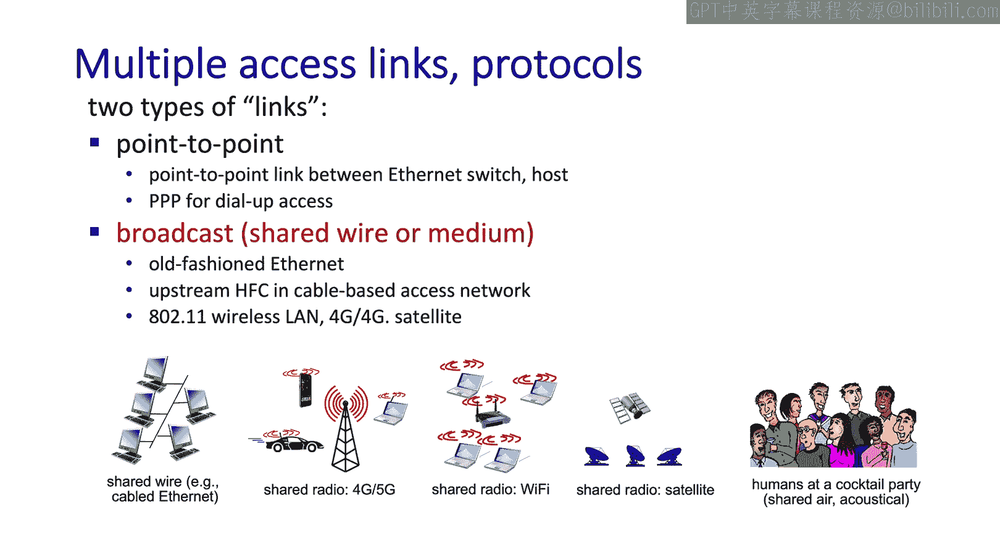

So to nail down the problem that we're addressing， if we have a shared medium and more than one device wants to transmit。

 if their transmissions overlap， they will have a collision and the receivers will not be able to understand either transmission。

So a multiple access protocol determines how this shared medium will be used by multiple transmitters in a way that avoids collisions。

We also have to note that this is an end band protocol。

 so the multiple access protocol is using the channel to determine how to use the channel。

 which presents a number of interesting engineering trade offs。

We do this instead of having a separate control channel because adding a separate channel will drastically increase the cost of the system without adding a commensurate increase in performance。

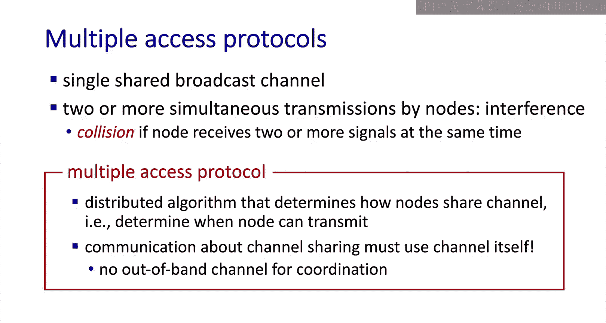

So given that our channel has a bandwidth of R bit per second， we have some design goals。

One is that if a single node needs to transmit， it can use the full bandwidth of the channel Rbits per second；

 the second is that if multiple nodes need to transmit。

 they can each transmit at an average rate of R over M。

 meaning that the channel bandwidth is still fully utilized。Three， idealally。

 this would use a fully decentralized algorithm such that there's no controller node that has to coordinate the transmissions amongst the users and also that there's no expensive synchronization of clocks for。

 just because we didn't have enough constraints already。

 we want this to be simple and easy to implement。As you might imagine。

 some of these goals are in conflict with one another。

 and so finding a solution means making trade house between them。In fact。

 there are so many different solutions that we have three broad classes of Mac protocols。

The first is channel Partitioning。Meaning that the available bandwidth is broken up into pre allocatelocated chunks which are assigned to the different transmitting devices。

These chunks can be made on the basis of time slots， frequency channels， or code points。

 and alternative classes random access。Instead of preallocating the channel into multiple chunks。

 it allows for collisions to happen but then has some recovery mechanism that's employed after the collision occurs。

Lastly， there is the taking turns category where instead of a hard partitioning ahead of time。

 the partitioning happens dynamically such that we don't have collisions。

 but nodes that need to transmit more can use more of the bandwidth than nodes that don't have as much to transmit。

So in the rest of this video， we're going to walk through examples of each of these categories of media access control。

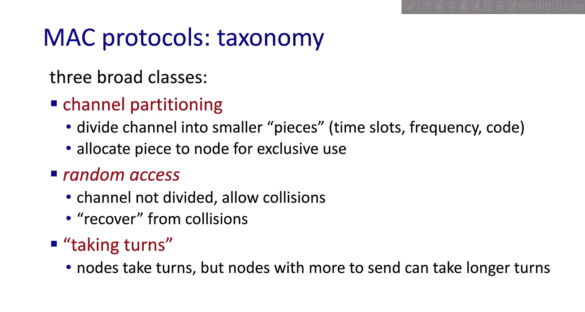

One of the classic petitionitioning schemes for channel Partitioning is TDMA。

 time division multiple access。With TDMA time on the channel is divided up into fixed length slots and each station gets a slot to transmit in。

 this works well for constant barrier applications such as telephone calls。

Where each call is using the same amount of bandwidth constantly for the duration of the call。

 however， as we know internet traffic is bursty， which means sometimes a station will need to transmit and sometimes it won't。

 and so the times that a station doesn't need to transmit its slot will go idle。

 meaning that bandwidth is wasted since none of the other stations are allowed to use it。

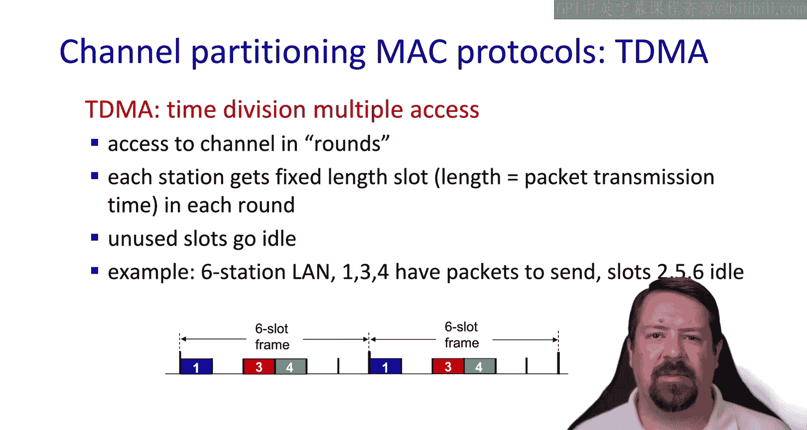

Another simple scheme is FMA， frequency division multiple access。In this case。

 instead of dividing time， the frequency of band is divided up into channels。

This is exactly how broadcast radio or television works。

 where multiple stations can broadcast simultaneously and the receiver just tunes into the correct channel that they want to receive on。

Again， this is suitable for constant battery applications。

 but if a particular transmitter doesn't have anything to send。

 that channel will go idle and the bandwidth is wasted。

Note that this is also how bandwidth is divided on broadcast cable networks。

 which will be relevant when we look at HFC networks later on。

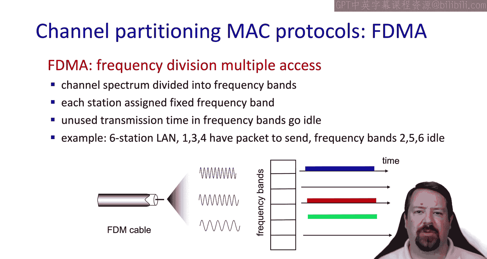

There's another channel petitioning scheme known as Code Division multipleple Access or CDMA。

 which is widely used in cellular networks， but we're going to wait and look at that later on when we get to the next chapter on wireless networks。

Now we'll look at how random access protocols can work。

The basic idea is that if a node needs to transmit a packet， it just does so。

 and it does so at the full rate of the channel。If another node happens to try to transmit at the same time。

 there will be a collision and both transmissions will be lost。

So the Rand Access Mac Procol needs to specify how collisions will be detected and if any recovery actions should be taken。

The earliest and simplest examples of Rand X's Mac protocolcol were the Aloha and slotted Oloha Pros。

 and the successors to these are CSMA with the CSMACD and CSMACA variants that are in use today。

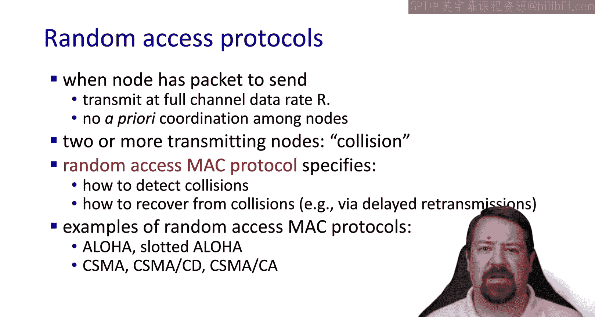

In Slaada deloha， we have some assumptions which include that all frames are the same size。

And that a time slot is exactly the right amount of time to transmit one of these frames。

Notes are required to only start transmitting a frame at the beginning of the slot。

 so as to finish within the same time slot that it starts in。

It also requires that nodes are synchronized。So they're all on the same page when it comes to the start time of slots。

 if there's multiple transmissions in the same slot， then all the nodes detect this collision。

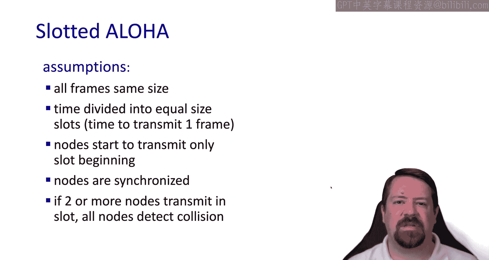

When a node has a frame to send， it sends that as soon as the next slot starts。

 and as long as there's no collisions it can keep sending new frames， however。

 if there is a collision， then the node needs to retransmit the frame that collided。

 however it doesn't retry in every single slot， it uses a probability P to determine whether or not to try in each successive slot until it successfully sends this frame Why randomization。

Well， by definition， if there was a collision， there was more than one node trying to transmit a frame in that slot。

So if they both retry every single slot， they will both collide in every single slot and they'll never be successful in sending a frame and it will actually prevent the network from working anymore。

So each of the two transmitters needs to flip a coin and decide whether they will try again。

 and probabilistically one of them will get through and then the other one will get through。

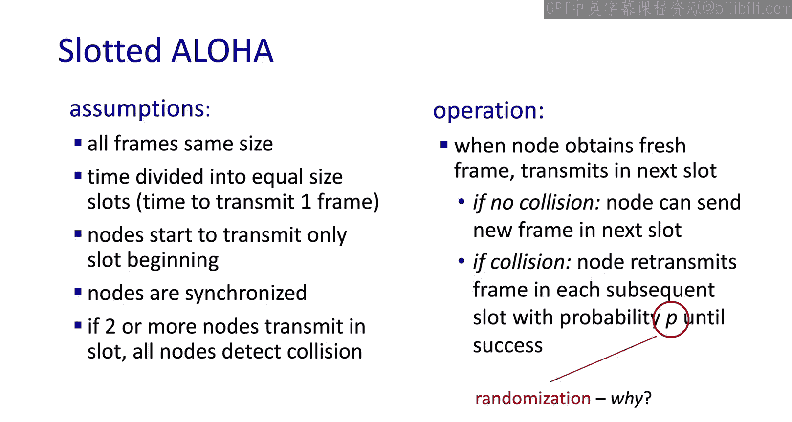

So let's look at three nodes with some frames to send over sequence of slots we can see that in the first slot。

 three nodes collide and probabilistically none of the three try to transmit in the second slot。

 so it goes empty Two of the nodes then collide again on the third slot but node 2 tries again on the fourth slot and is successful Later on nodes one and three collide and eventually node 1 gets through and then node3 gets through so the benefits of this system are that if demand is sparse one node can transmit at the full rate of the channel continuously So we've achieved one of our design goals from media access control this mechanism is also completely decentralized。

 there's no master node controlling this， although it's not mentioned here is that collisions are detected based on acgments from a central node that come back in a separate channel so from that perspective it doesn't meet some of our goals。

But this protocol is also very simple and easy to implement The cons of this are that we have the collisions which weigh slots and then during the probabilistic back off we have empty slots which are also wasted。

So in contention this Mac protocol becomes inefficient quite quickly。

 we also have the requirement for some level of clock synchronization so that the slots are lined across all of the transmitters so we mentioned efficiency being an issue。

 let's look at just how bad it really is。

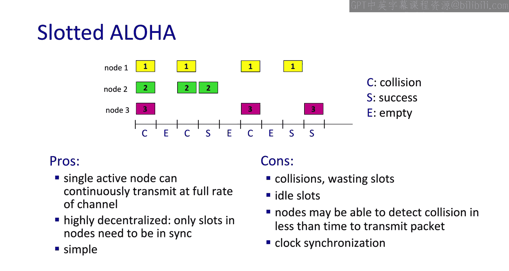

So suppose we have n nodes and they're transmitting on any given slot with probability P so the probability that one transmitter has success in any given slot is also the probability that no other node tries to transmit in the same slot so as the number of nodes n increases this probability decreases the probability that any node has success is just n times the probability that one node has success and so our maximum efficiency is achieved when we find the probability P that maximizes this efficiency meaning in real terms how frequently does each node desire to send a frame so for high number of nodes。

 we find that the maximum efficiency achievable is 0。37。So 37% of our available bandwidth。

 and that's the best case scenario。It's not going to be easy to get all the nodes to operate at this exact probability P Before slotted aloha。

 we had pure aloha， which didn't have the requirement for synchronized clocks。

 so instead of waiting for the start of the next slot to transmit a frame。

 a node would just transmit a frame as soon as it had one to send。

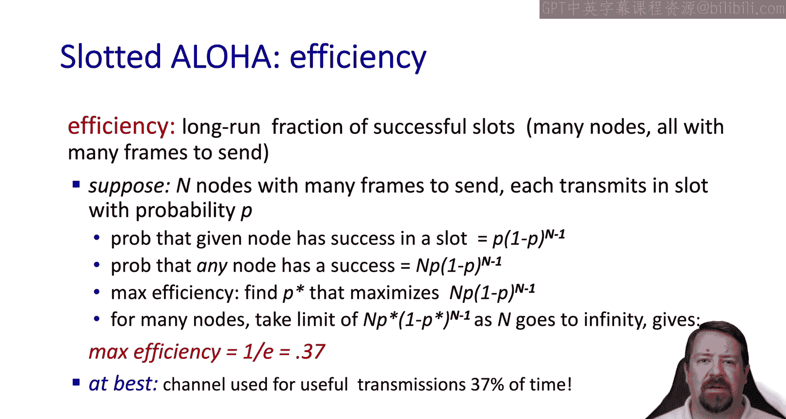

The performance of this is worse than slaughttedloha because you can have partially overlapping frames。

Wwhichch means that overall probability of collision is higher。

 so any given frame can collide with frame sent almost a full frame length in front or behind it。

 rather than only being able to collide with frame sent in exactly the same slot if we compute the probabilities for pureloha we find that it is exactly half as efficient as slotted aloha so only 18% for high number of nodes needing to send traffic the successor to the aloha protocols is CSMA carrier sends multiple access so in this case the transmitter listens to the channel before beginning its transmission。

 and if another node is already transmitting then it waits and tries again later。

 a variant of CSMA is CSMAC or carrier sends multiple access with collision detection this means that while transmitting a node can detect that a collision is occurring and stop very quickly so that it doesn't waste as much time transmitting a frame that's already collided and won't be useful to anyone however in practice CSMACD can only be implemented in wired network。

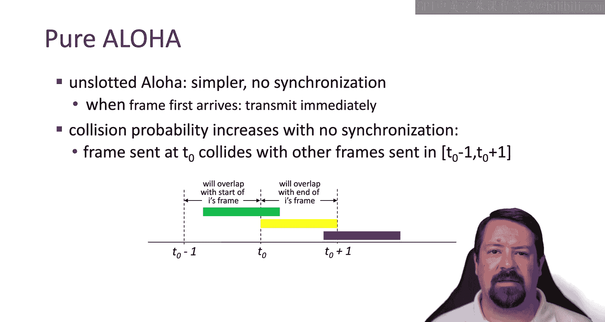

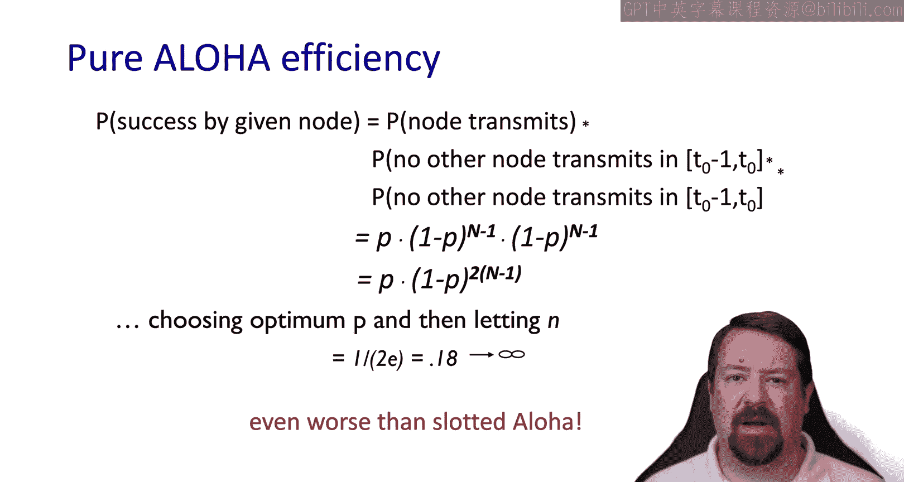

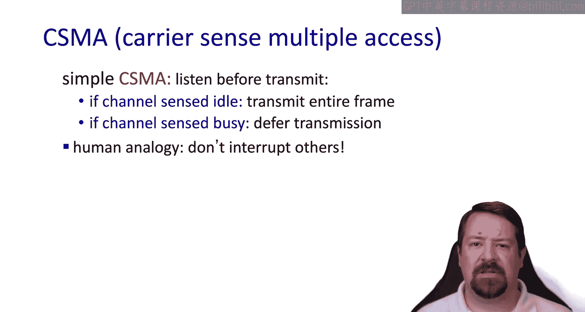

It is difficult or impossible using inexpensive hardware in the wireless domain。

 so let's look at how this works in a shared wired environment， so even with carrier sensing。

 we can still have collisions。

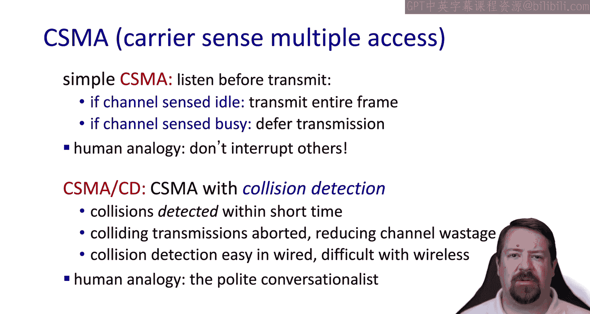

And this is because two nodes could sense and then decide to transmit at exactly the same time。

 and due to propagation delay there is actually a short window during which a node can't hear another node that's already begun transmitting As a reminder。

 whenever there's a collision the entire packet is lost So here we see one of our nodes begins transmitting and it's not heard yet by another node that then begins transmitting。

And so as these two transmissions propagate through the shared media。

 they jam one another and nobody is able to receive the frames； however。

 due to the combined transmit power， the nodes on the note can detect that a collision occurred。

The collision detection portion of this algorithm means that the nodes don't keep transmitting for as long after the collision is detected。

 and so this wastes less time in the communication channel。

 so this is the algorithm that wirered Ethernet is based on。

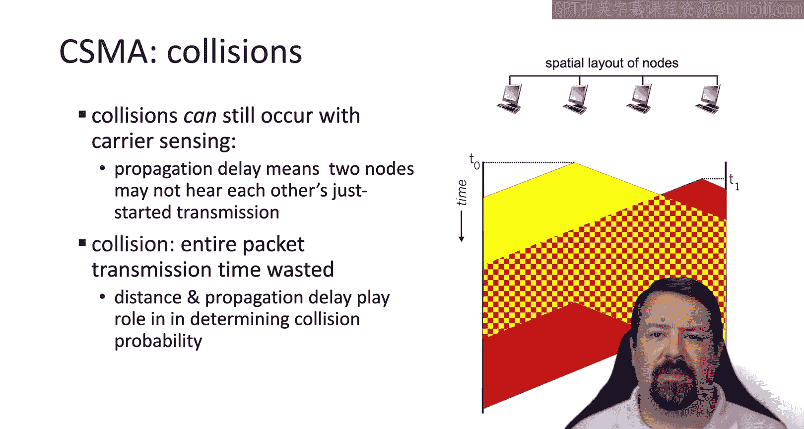

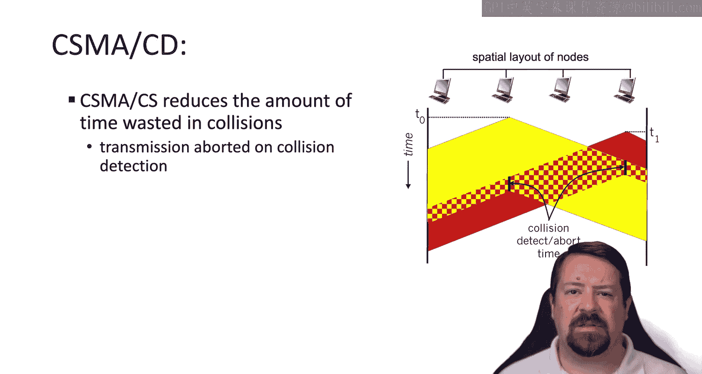

And it works as follows the IP layer or any other network layer can pass a datagram to the ethernetN which then creates the frame and senses the channel if it's idle it can begin transmitting immediately。

 and if it's busy it will wait for an idle channel as long as the transmission completes without any collision it's done with that frame however。

 if a transmission is detected it aborts and it sends a jam signal onto the wire After aborting the transmit。

 the N enters into binary exponential back off so just like we mentioned before by definition when there's a collision it means that there are multiple transmitters trying to transmit。

 and so if they both try again immediately， it would guarantee another collision and another collision and so on but this binary exponential back off is using a controlled manner to determine the probability with which the ni will retry so this determines how long the nick waits before going back and sensing the channel again。

In the first collision， K will be chosen at random from integers between 0 and2 to the 1 minus1。

 so between 0 and 1。So the NIC is either going to wait0 bit times before sensing again or it will wait 512 bit times before sensing again however。

 if it collides a second time， it will then wait between 0 and due to the 2 minus 1 times 512 bit times。

 so between 0 and 3 times 512 bit times so you can see that each time there is a subsequent collision。

 the upper bound for the weight time increases to try and reduce the probability of having a subsequent collision。

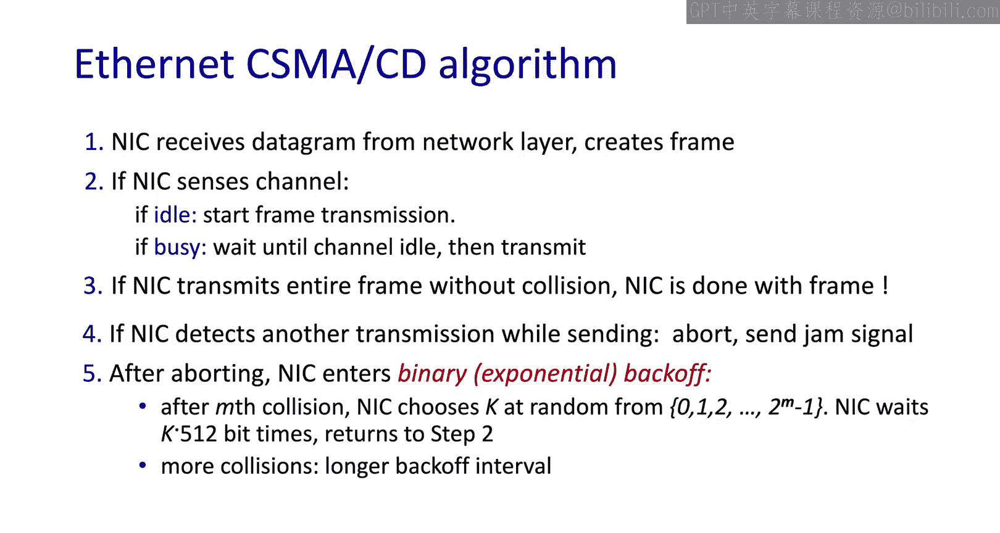

We can also do the efficiency analysis on CSMACD， and we can see that the limiting factor here is the propagation delay that must be accounted for。

And of course we know that propagation delay is a direct function of distance。

 so the longer the shared link is the more time we have to allow for propagation delay and the worse the efficiency will be。

 however， as long as we keep the propagation delays low meaning we only use this in a local area environment and in practice these shared ethernet segments were limited to 200 meters we see that we can achieve efficiencies approaching one and much better than the aloha protocol。

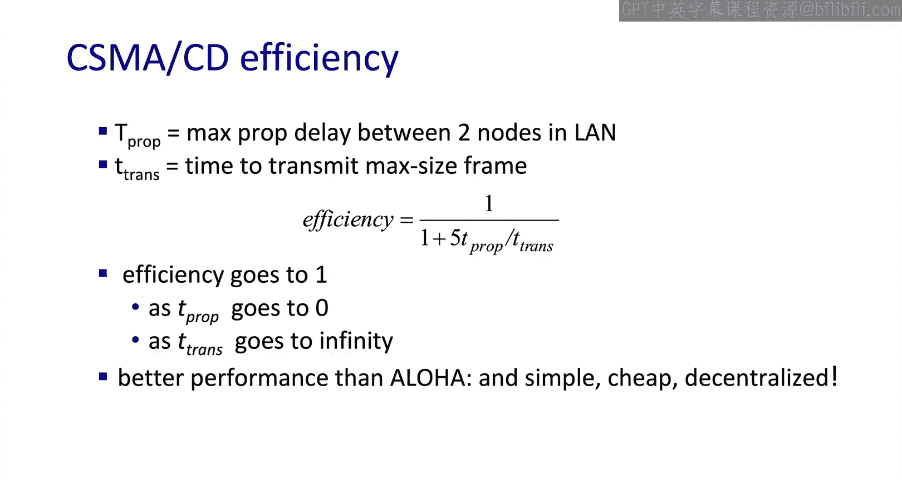

Now we come to the taking turns protocols， so this is an attempt to find a middle ground between both of the previous categories of Mac protocols。

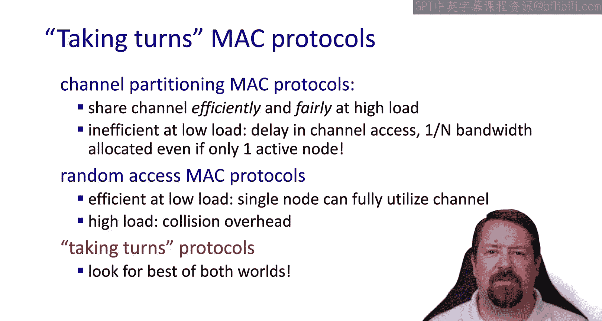

One way to do this is polling So one of our goals was to not have a master node。

 but that is required in this case， so we compromise on that goal in order to improve on some of our other goals。

 So in the polling scenario the master node asks each device in turn whether it has something to transmit。

The issues here are that it takes some time for this polling to occur。

 so we lose some efficiency there plus we have this master node that is an additional expense and also it can be a single point of failure if the master node goes down then nobody gets pulled and nobody gets to transmit so we can see that the master sends out a polling request to an individual node which then gets to send data and then the master pulls another node。

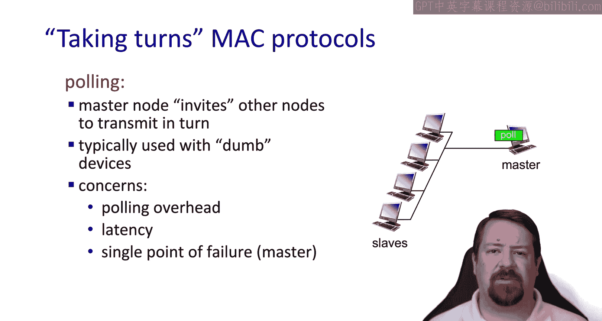

And so on a decentralized version of taking turns is token passing。

 so in this case the nodes are logically arranged in a ring and they pass a token from one to another and if the node needs to transmit something it does so and then passes the token。

 and if it doesn't need to transmit anything it just passes the token。Again。

 there's some overhead with passing the token and of course if the ring breaks anywhere。

 then the system is down because the token will get lost and this node had nothing to send switch is passes the token onto another node。

 which needs to send some data。And so on In practice。

 both polling schemes and token passing schemes were implemented and deployed。

 but Ethernet with CSMACD became the dominant protocol in the marketplace。

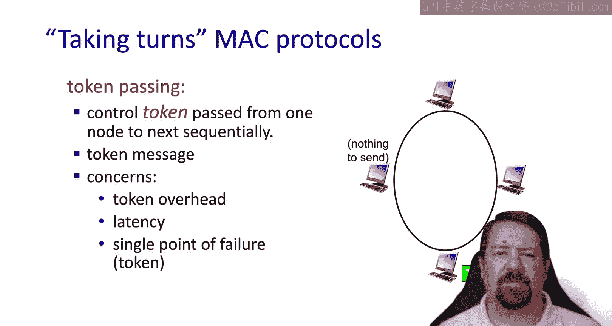

Now let's look at cable access networks， which operate over longer distances than our typical local area networks that we've been talking about so far。

 and the cable access network deploys both frequency division multiplexing。

 time division multiplexing and random access So we have our cable head end。

And the cable headend has to multiplex together both data frames for internet and the broadcast TV。

 radio， digital telephone， whatever other services they're supplying over the copperpper Coaxial cable so these services are all multipleed onto the cable in different frequencies and that's where the FDM part comes in we have multiple downstream channels and the CMTS is transmitting on all of them we also have multiple upstream channels on the upstream channels there are not as many channels as there are subscribers on the network So some slots are assigned within in these channels by the headend however there are some other slots to go unassigned and the subscribers contend for these slots using a random access mechanism。

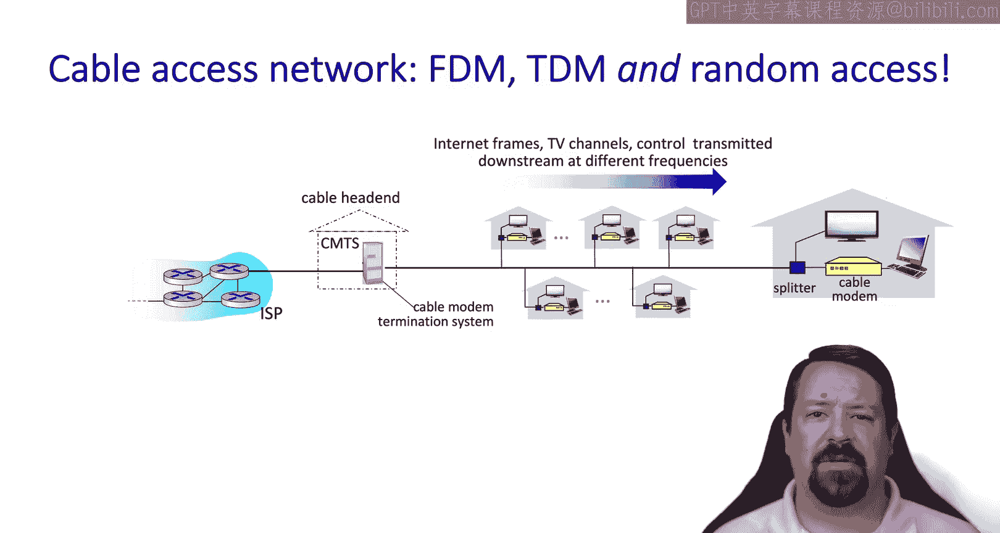

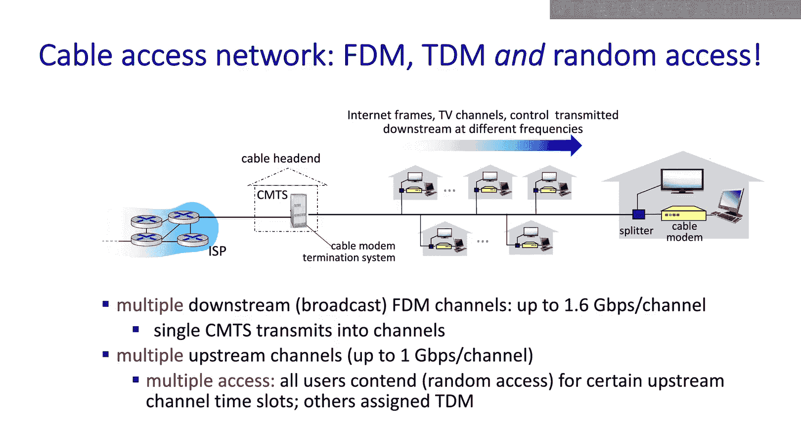

The protocol that defines how this works is called DoXs and there have been a number of different versions of Doxs over the years and I believe the current commonly deployed one is Doxs 3。

1 So as we said there's FDM operating both in the upstream and the downstream but there's TDM just operating on the upstream channels So the CMTS sends out a frame called a map frame that tells each subscriber what upstream channel they are assigned but it only assigns these channels after the subscriber node has requested one and those requests are sent in a random access manner and they're sent in slots that are not assigned to any particular note so here we have our map frame assigning slots for a particular interval and we have a bunch of mini slots for request frames and the subscriber nodes can pick one of those at random to put the request in but they can only use the upstream data slots if they've been assigned one by the CMTS So that's our overview of the media access protocols we talked about TDA and FDMA for channel Partitioning schemes and then with random access we saw the aloha protocol。

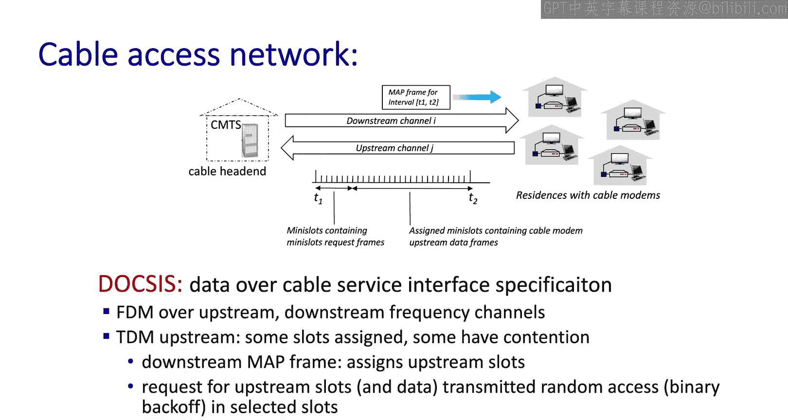

That proceeded onto to the CSMA based protocols。We omit a discussion of CSMACA for now because that is currently used in wireless protocols and we have a whole chapter coming up on wireless networks and so we'll cover CSMACA there we also looked at taking turns protocols which do work in practice but due to cost or maybe other issues are no longer widely deployed In the next video we'll look at other land considerations including addressing the address resolution protocol and more details of wired Ethannet。

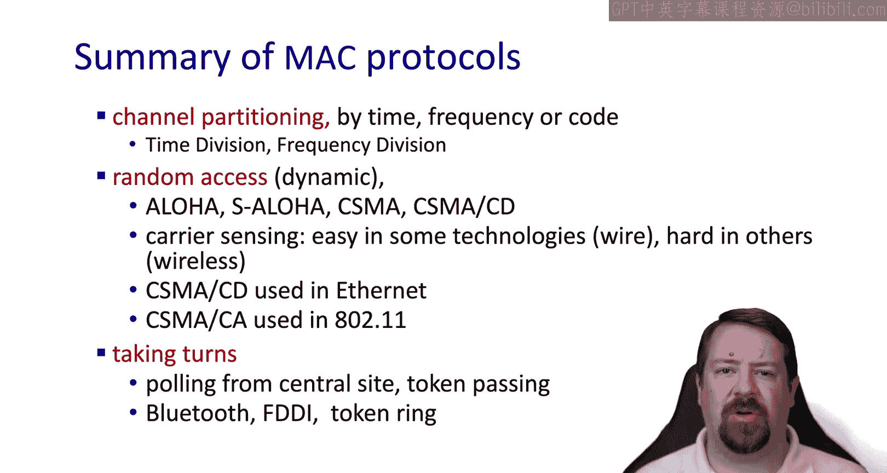

See you then。

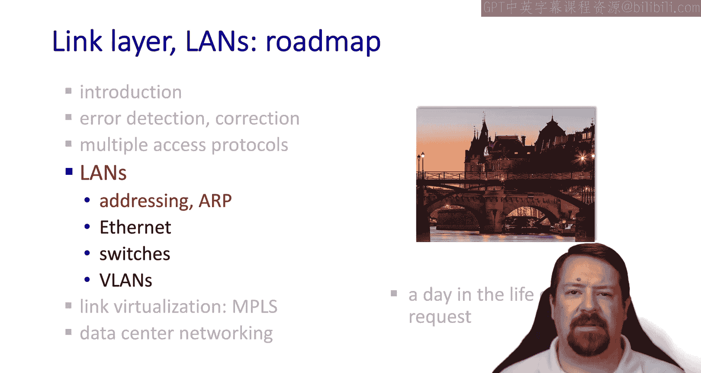

We hope you enjoyed this video， if you found it to be useful。

 please click the like button to be notified when more videos are posted for this class。

 please subscribe to our channel and click the bell。

