# Jim Kurose《计算机网络：自顶向下的方法｜Computer Networking： A Top-Down Approach》中英（deepseek p46 -46-MAC Addresses, ARP, and Ethernet - Network Link Layer -BV1UMtueiEaA_p46-

In this video we begin looking at local access networks in particular we look at link layer Mac addresses and ARP。

 the address resolution protocol as well as different versions of the Ethernet Pro Let's get started。

All right， continuing on in chapter 6， we have talked about the problems of multiple access to shared channels。

 and now we're going to get down to some more details of link protocols starting with how they handle addressing。

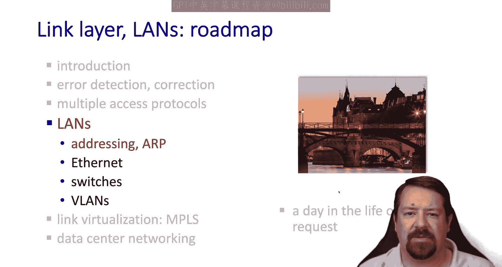

Mac addressing works significantly differently than IP addressing， but just as a reminder。

 the IP address is 32 Bs and it's used for layer 3 forwarding and layer 3 forwarding is based on longest prefix matching the Mac addresses which are the layer 2 addresses are used locally。

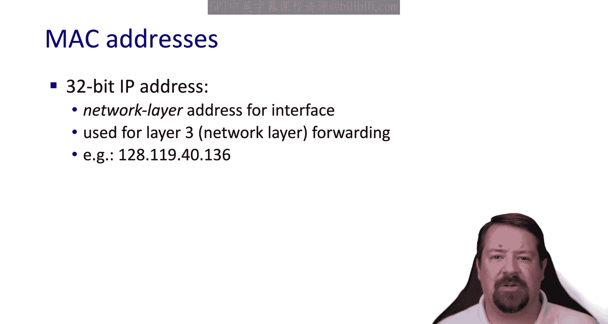

In the context of IP， a Mac address is only significant within one subnet。And at this point。

 almost all layer2 technologies use a 48 bit Mac address。

 and these addresses are embedded in the network interface card。

 and there may or may not be some way to change them via the software。

If we need to write out a Mac address， we do it in the following format with pairs of hexadeadeimmal digits。

The hyphens in between the pairs of digits are just for convenience and in some cases are replaced with colons。

One digit in Hex represents four bits in binary， so these 12 characters represent the 48 bits of the Mac address。

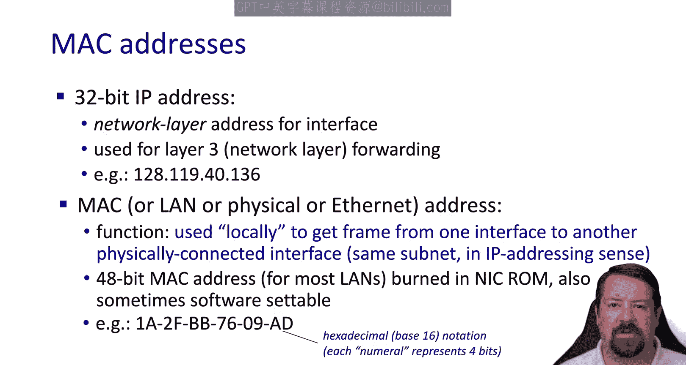

All right， so here we have an example LA and we're looking at the Mac addresses of the interfaces connected to that LA。

Now we note that in the IP addresses shown， they all share the same prefix。

 which is a requirement for longest prefix matching to work。However。

 the Mac addresses share no such constraint， In fact。

 they look pretty much random and have nothing in common with one another。 In fact。

 the first few bits of the Mac address identify its manufacturer and the rest of the bits are set either serially or randomly by the device manufacturer。

 so we can't require that the Mac addresses on a land have any particular relationship to one another and what this implies is that when we need to forward frames to a particular Mac address。

 we can't do any form of longest prefix matching because we don't have that type of relationship between the addresses。

Instead， we must do exact matching only when forwarding frames to a particular Mac address。

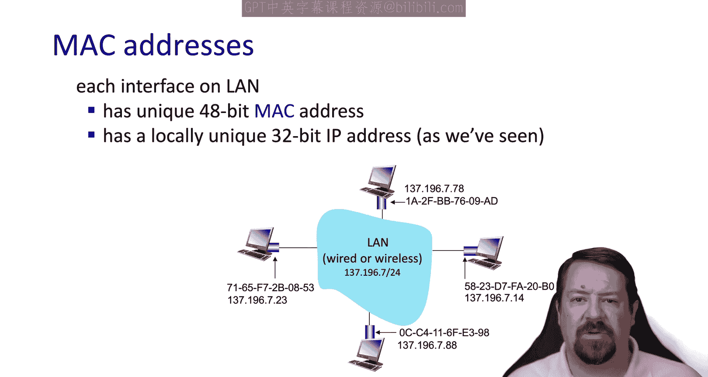

So where do we get Mac addresses all the manufacturers get them from the IE。

 so the I assigns them in blocks， which is why the first 12 bits of the Mac address identified the manufacturer。

 although large manufacturers will have multiple of these prefixes known as OUIs。

And then that manufacturer can use all of the addresses within that block。

So just like there's nothing in your Social Security number that would tell someone how to find directions to your house。

 there's nothing in the structure of the Mac address that would help us find out how to get a packet to that host。

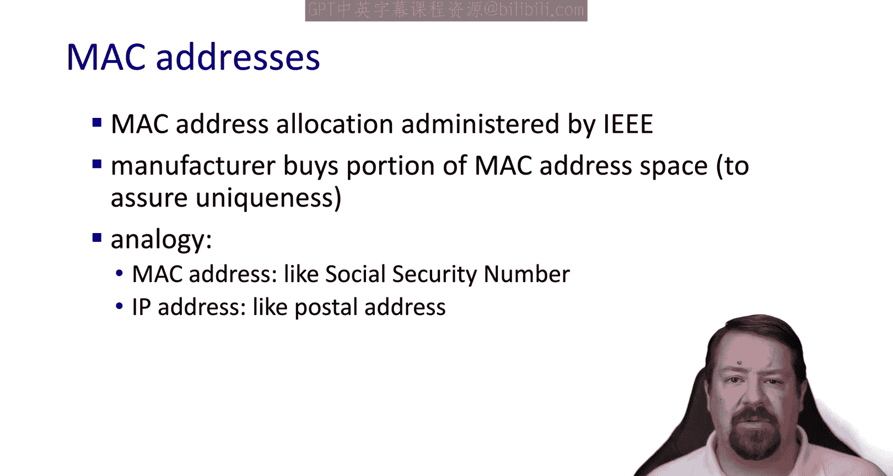

The advantage to this is portability The Mac address goes with the device。

 it doesn't have to change when it connects to a new network。 This is in contrast to IP addresses。

 which stay with the network and when a device leaves one network and connects to another one。

 its IP address changes。

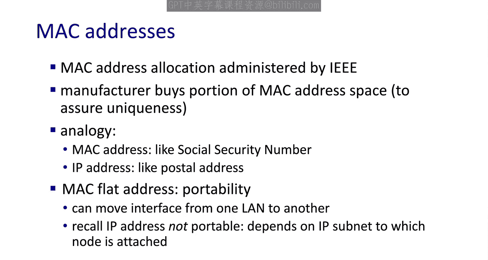

So our next problem is how do we find out what Mac address to use as a destination to a frame the device knows its own Mac address to use in the source field。

And we've talked about how a host can use DNS to find out the IP address that it needs to send the IP packet to。

But how does it find the Mac address used the destination field of the layer 2 frame？

That relies on a protocol called ARP， the address resolution protocol。

 and this is another distributed database lookup type function but instead of mapping from a host name to an IP address it maps from an IP address to a Mac address so every node on a network has to maintain an ARP table or a mapping of the IP address Mac address pairs that it's aware of and like most other mappings we've seen。

 there's a TTL after which this entry is considered stale and removed from the table。

A common default for this TTL is 20 minutes。Now let's see how we populate this table。

 so we have hostA and they want to send a datagram to host B。

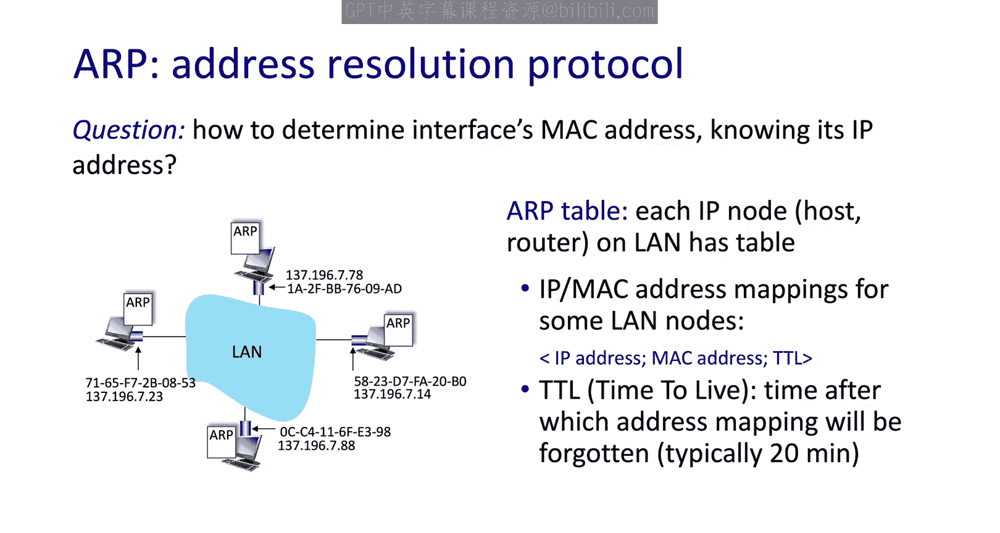

We assume that hostst A has already found out the IP address for hostt B and now it needs the Mac address。

When it looks in its a table， it doesn't have a mapping for that IP address。

So A will send out a broadcast Ap message and just like the broadcast address in IP is the All ones address。

 the broadcast address in layer 2 is the all ones address， so all F's in Haidadecimal。

So this layer 2 message says who has this destination IP address that A is looking for。

 and every node on the local network will get this broadcast message and whichever has that address should reply using its own Mac address。

Though the frame has a source， Mac address and inside has a source IP address and a target IP address。

 now view receive this message and says， " oh， that's my IP address。

 so it responds back using an A response that includes its Mac address。

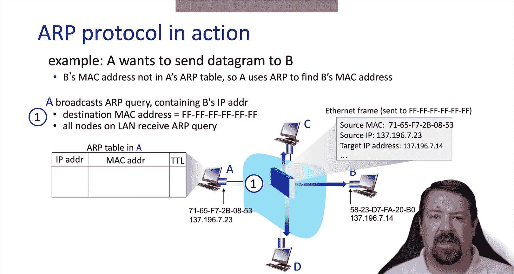

It knows what Mac address to send this back to due to the contents of the original message。

 and so it has the mapping between its IP address and Mac address A can then update its a table with the contents of this message and then it can send out all the frames that it needs to to that destination Mac address。

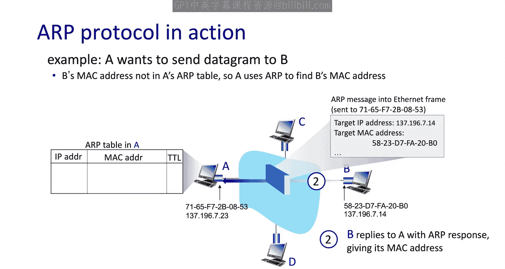

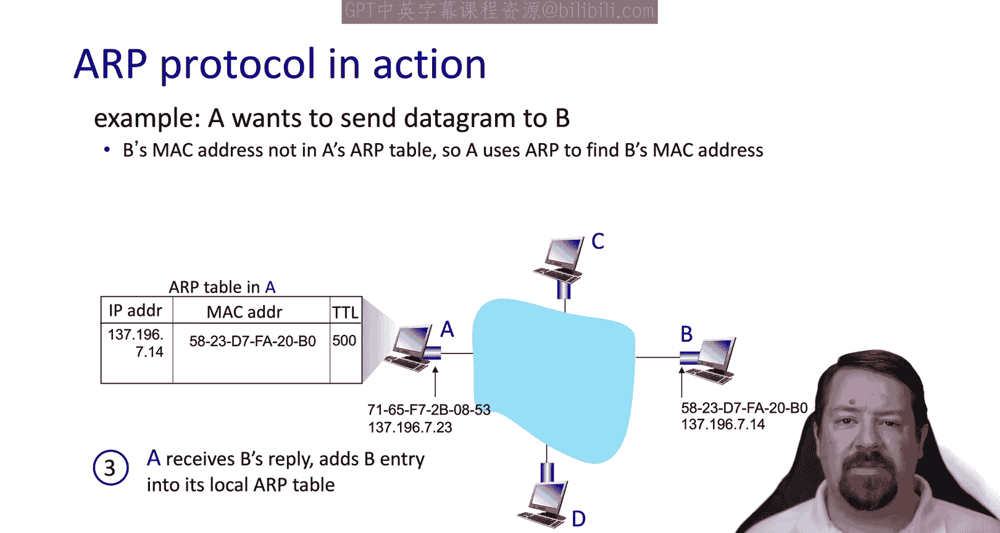

So that process is fine if A and B are on the same subnet， however， these broadcast frames。

 the all one's Mac address， don't get forwarded by routers。

 so it's only devices that are on the same subnet that would hear this query。

So if we have a topology like this one with a router in between A and B。

 if A were to send out an A request for B's IP address。

 it would never reach B because the router will not forward the A request。

This is a good thing because it allows the network to scale。

If our requests were forwarded by routers， there would be so many of them propagating around networks that they would consume too much bandwidth。

So instead， when A looks at B's address， it can compare it to its own and subnet mask and understand that B is in a different subnet。

So A will not send out an R request for B's address， so here's our scenario；

 A is on the subnet with all ones in the prefix， and B is on the submitnet with all twos in the prefix。

A is already found B's address through DNS。A also knows the address of the first top router This is A's Gateway。

 which is either programmed in by the administrator or learned through DHCP。

A also knows R's Mac address Now how does that happen Well because A knows the IP address of its gateway。

 it can send an our request for that IP address and get the gateateway router's Mac address。

So with all that information in hand， how does A get B's Mac address？

A is able to go ahead and create a datagram with B's destination IP address。

But when it gets to layer 2， it's going to use the Mac address of the gateway router as the destination。

Remember， we said layer two addresses only have significance within the local sub。

Even if a new B's Mac address， if it used to as the destination here。

 no one on A's subnet would know how to get that frame over to B。So from a layer2 perspective。

 the router is a destination for the frame， and not just any Mac address on the router。

 it is specifically the Mac address of the router's interface on A's subnet。

So this frame is sent over the router， which as we know is a layer 3 device。

And it passes up the stack there， and it's passed all the way up to the IP layer。

 meaning the layer2 frame is completely removed from this packet before forwarding happens。

Then when the IP layer is going to send this out the other interface。

 it's creating a whole new frame so the fields in this frame need to have no relation to the fields in the layer 2 frame that A in out。

In fact， this could be a completely different layer to technology altogether。

The new frame header now has the router's interface onB's Snet as the source Mac address。

And has B's Mac address as the destination for the layeryer 2 frame header。How did it get that， Well。

 the router can issue an R request for B， any layer3 device can issue our requests。

But it is highly likely that the gateway router would have B's Mac address cacheed because B probably has sent traffic to the gateway router already。

 so the router all set to transmit the frame onto B。When B's network interface receives the frame。

 it's able to extract the IP data and pass it on up to stack。

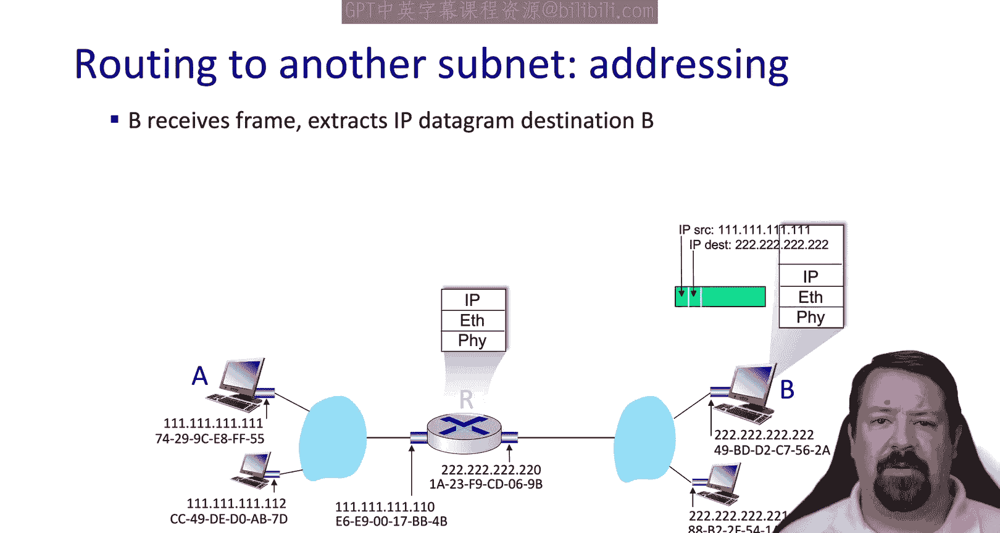

All right， now that you know just enough about Mac addressing and a to be dangerous。

Let's explore Ethannet in a little more detail。

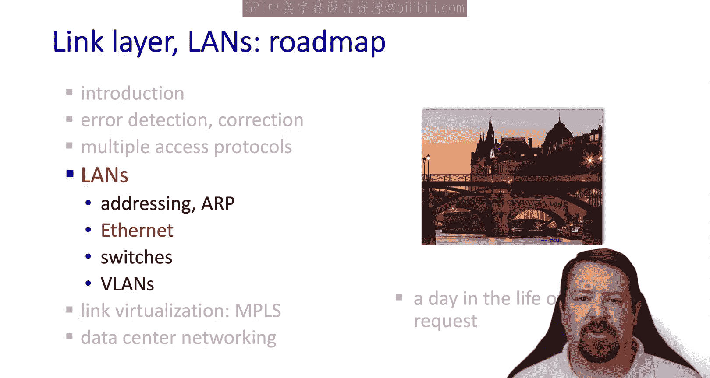

Ethernet is the dominant land technology today。Certainly there have been others in the past。

 but at this point there are a few， if any real competitors to Ethernet in this space。

Its success is largely due to the simplicity of the design using the CSMA based protocol。

And this has also helped to keep up with the speed race with up to 400 gigabits per second possible today。

Ethernet interfaces also tend to support multiple speeds。

 so if you have two devices with different speed capabilities。

 you're still able to talk just at the speed of the lower device。

The early versions of Ethernet were literally a bus。

 meaning one long quaaxto cable with multiple computer interfaces tapped into it。

 so this bus architecture might run the length of a hallway in a building or something like that。

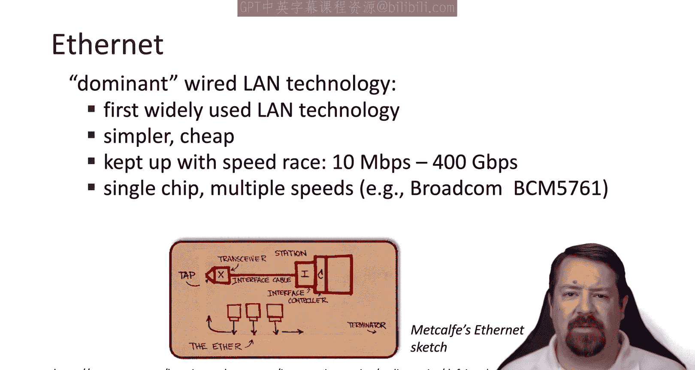

When we draw this architecture， we typically do something like this with a shared line and multiple lines coming off of it。

As time progressed， the long bus cable running down hallways was replaced with a device called the hubub。

 but the function was the same， it was still a shared medium。However， by the end of the 90s。

 switches were becoming more and more common， and switches were an active device in the middle of the layeryer2 network。

 which was able to break up the collision domain and create point point links between the switch and every individual host。

 so by the time Ethernet reached  one gigabit speeds， the shared bus model was no longer in use。

For switch networks， when we're drawing the layer2 architecture we put the switch in the middle and draw the point point links to each host these point point links are full duplex。

 and so there's no collisions in a fully switched layer2 network。As we saw before。

 collisions are the source of significant inefficiency in these networks。

 and so eliminating them greatly increases the possible utilization even on busy layer2 networks。

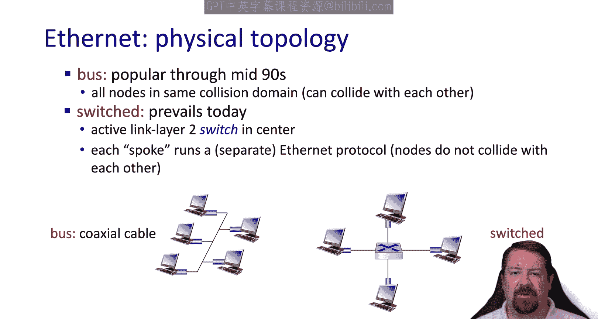

Here we have the ethernet frame， which includes an eight byte preamble。

This is because the clocks of devices on an Ethernet network are not synchronized with one another。

 so as it receives a frame it's able to read the known pattern and synchronize its clock to the bit timings and then successfully read the rest of the frame。

We then have the destination and source address， these are the Mac addresses followed by the type the ethernet type commonly referred to as the ethertype provides the demplexing function。

 this is analogous to an IP protocol number or a transport layer port number。

The type tells us what's in the payload， so there's one type for an IPV4 packet and another type for an IPV6 packet and other types for routing protocols that run directly on top of layer2 and another type for ARP and for any other message that runs directly over layer 2 instead of inside of IP So we have 12 bytes of addressing for the two Mac addresses combined and every time the adapter receives a message。

 it looks to see if it matches its Mac address and the destination address in which case it will pass it up based on the type field。

 or it looks for the broadcast address in which case it will also pass it up based on the type field。

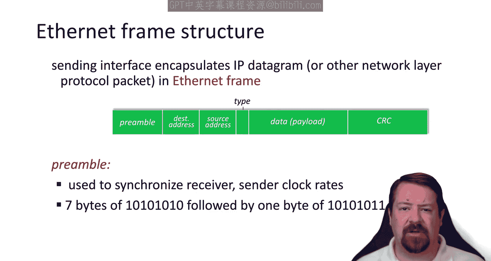

Any frame that doesn't meet one of those criteria is discarded This is known as a broadcast and select model The interface may see many frames that it doesn't actually need to process。

Some other types that have run over Etherna in the past include the Novel IPX Protocol and the AppleTlk Protocol。

 both of which have since become obsolete and replaced with IP。

At the end of the frame we have a trailer containing the CRC bits for the cyclic redundancy check Again。

 this is just an error check and so if an error is detected the frame must be dropped similar to IP Ethernet is unreliable and connectionless。

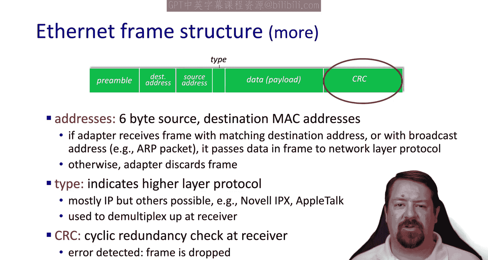

There's no handhaking or congestion establishment between Ns that communicate with one another。

 and there's no acknowledgecknowledments or negative acknowledgecgments sent。

So if any frame does get dropped， whether due to a collision or a failed error check。

 it's up to the higher layers to handle any type of retransmission。

TheEthernets Mac Protocol is the CSMAC CD with binary back off that we described in a previous video。

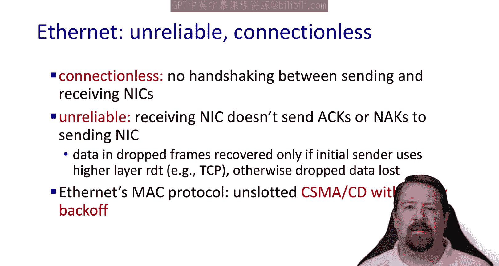

There have been many different ethernet standards over time because not only has Ethernet supported many different speeds over the years。

 it has also supported different physical media， and the Ethernet standard covers not only the framing and the protocol but the parameters of the physical interfaces supported。

 so some of these have been the coaxial cables that we talked about before with physical taps。

Today it's commonly the RJ45 ports containing four copper twisted pairs。

But Ethan also runs over fiber optics， and these may be single mode or multi modeode fiber optics。

So we can differentiate to standards by speed and by medium。

 and all the ones listed here are just for 100 mebits per second。

 so you can imagine that there are similar versions for 1 gigabit， 10 gigabit， 40 gigabit， etc。

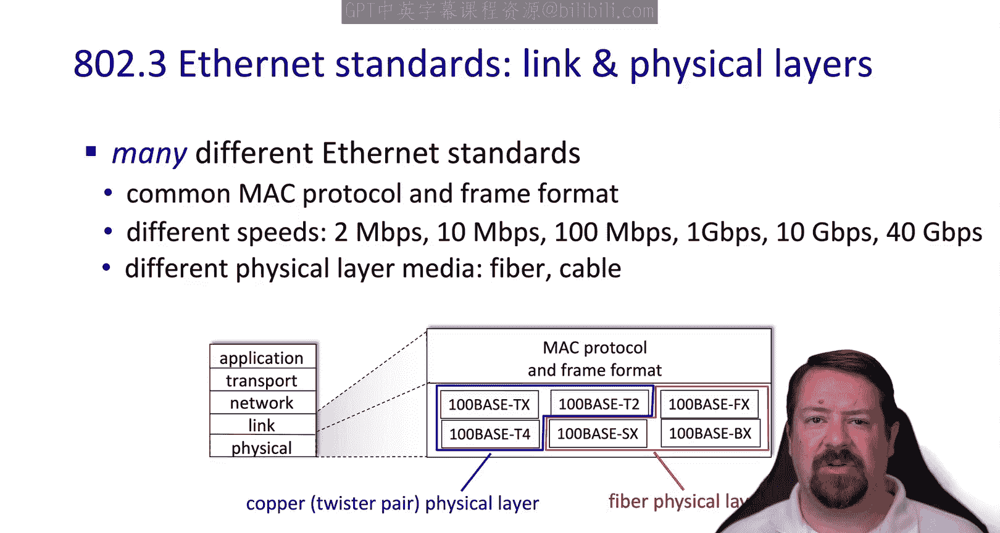

That wraps up for discussion of addressing an Ethernet。

In the next video we'll move on to talking about layer 2 switches as well as VLs See you then We hope you enjoyed this video if you found it to be useful please click the like button to be notified when more videos are posted for this class。

 please subscribe to our channel and click the bell。

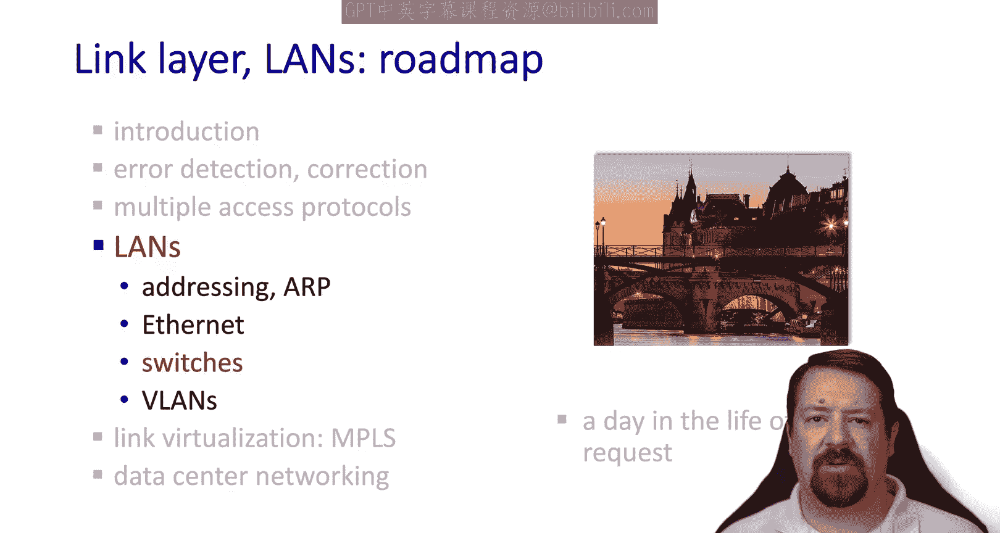