# Jim Kurose《计算机网络：自顶向下的方法｜Computer Networking： A Top-Down Approach》中英（deepseek p50 -50-A Day in the Life of a Web Request Retrospective -BV1UMtueiEaA_p50-

In this video， we're looking at a day in the life of a web request。

 including all the steps along the way from connecting to the network to issuing the request and loading a web page。

Let's get started。Now we're going to put together a cross section of everything we've learned so far in the class to look at a day in the life of a web request。

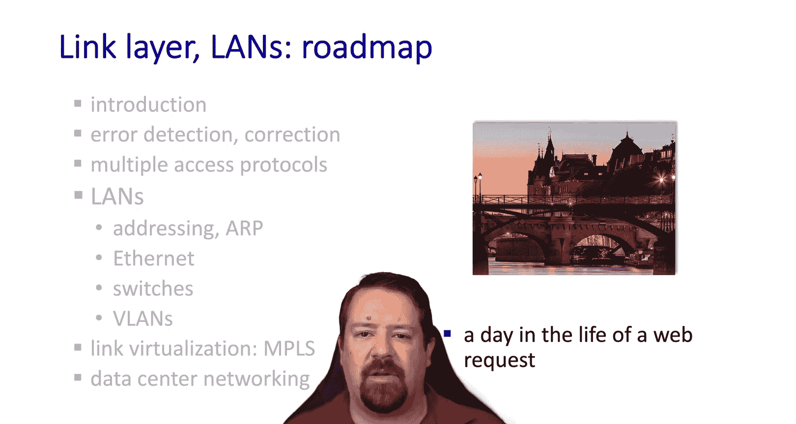

We've made it as far down the protocol stack as we're going to go the linking left below layer2 is the physical layer。

 which doesn't have protocols per se and is really the domain of physicists and electrical engineers。

But we've looked at application protocols， the transport layer， network and routing protocols。

 and most recently the link layer， so we can now put all the pieces together that are required to execute a web request from beginning to end。

And the goal here is just to tie together everything we've looked at so far into one big picture。

Our scenario is that a student is bringing their laptop and connecting it to the campus network before connecting to a search engine。

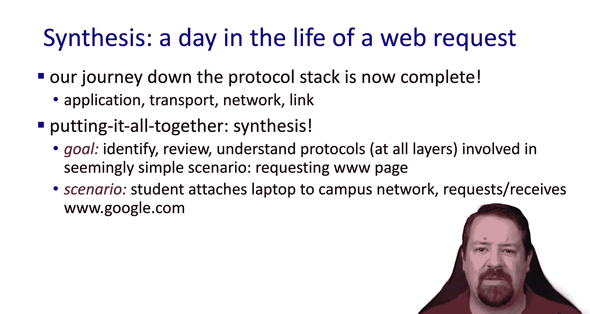

Remember the internet is a network of networks， so we have our school campus network connected to an ISP。

 which in turn is connected to Google's network。So our mobile laptop arrives and connects to the campus network。

It requests a web page andvoila， they can display the search engine's homepage。

 but it's not quite that simple。

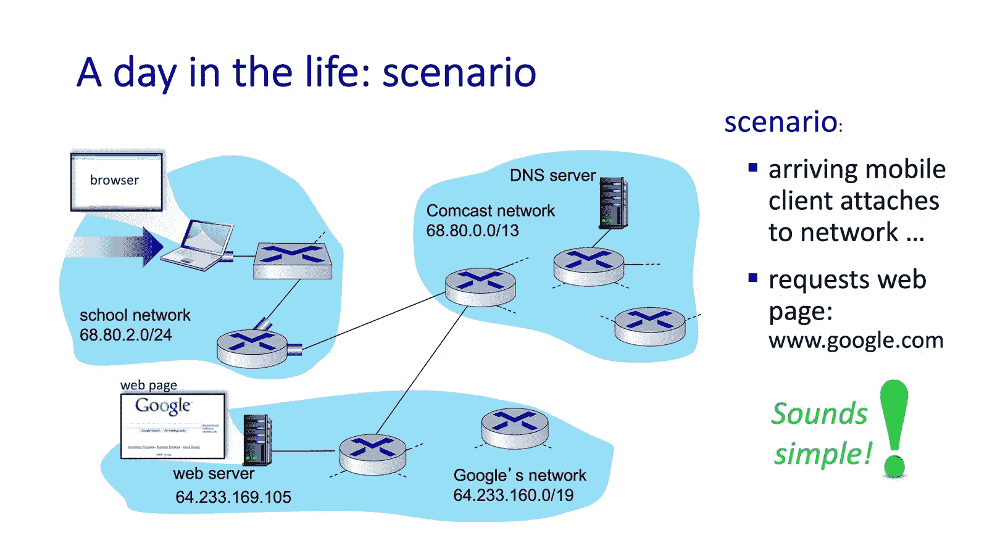

As we know， before the browser will be able to connect to anything。

 the device needs an address on the network that its just connected to。And like most campus networks。

 it will use DHCP to get the address。The DHCP client is an application running over UDP。

 so the request will be encapsulated in UDP。And then in IP。

 and then in an ethernet frame to be forwarded over the network。

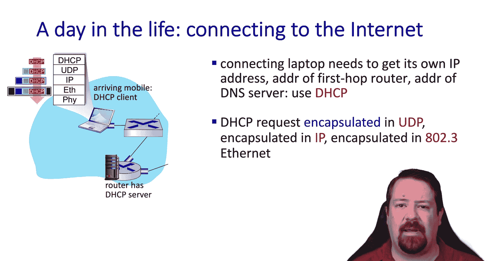

Remember the client doesn't know where the DHTP server is， so it'll just broadcast this request。

 and when it reaches the server， that frame will be demplexed to IP and then to UDP and then up to the DHTP server。

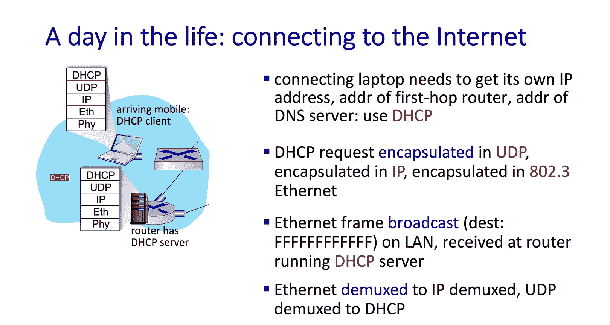

Then the server will create the DHCP Act， encapsulate it back down through all the layers and broadcast it over the network once again to the client where it will be returned to the DHCP application。

Remember that in order to accept this， the client will send out another request for that specific address and it will be confirmed by the server。

 so theres four parts to this exchange At that point the client will have its address and it will also have the address of some DNS servers and the gateway router and maybe some other details of the local network。

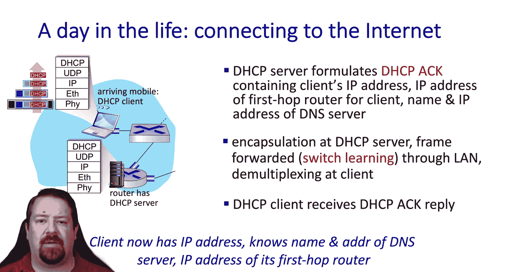

But we're still not ready to send the application level request because we need to know what IP address to send that request to。

 so we're going to get ready to send the DNS request again DNS is an application that runs over UDP over IP over Ethernet etc。

And so that request will get encapsulated and it will get down to the link there。

 and this DNS server is not on the local subnet so that request needs to go through the gateway router。

While the host knows that it needs to send this to the gateway router。

 it doesn't have the Mac address for the gateway router so before we can go any further we have to use the address resolution protocol。

So our A query is broadcast through the network， who has this IP address。

 and when the gateateway router receives it， it will respond back with its Mac address。

So then at that point， we have the necessary a table entry to send the frame for the DNS request out to the gateway router。

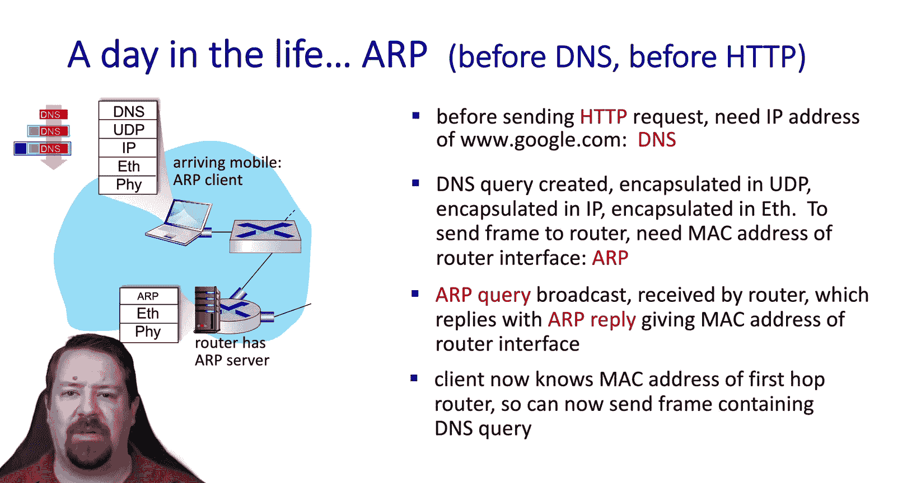

In this case， the DNS service is being run by the ISP。

 and so our UDP packet gets to the gateateway router。

 and then it can be forwarded over to the ISPs network and through their network to the DNS server。

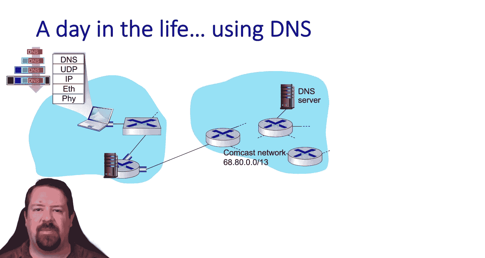

But remember， for all that to work， the ISP's intradomain routing protocol must be working in order to distribute the forwarding tables to the routers。

 and also BGP must be working between the campus network and the ISP。Al right。

 now that our frame has arrived at the DNS server， it's demipplex stuff through the stack to the DNS application running over UDP This will be a recursive resolver In this case it looks like it already has Google's IP address cached。

But if it didn't， they would have to go out through the DNS hierarchy。

 querying the root and then the TLD servers and then Google's authoritative name server to get that IP address back and send it back to the requesting client。

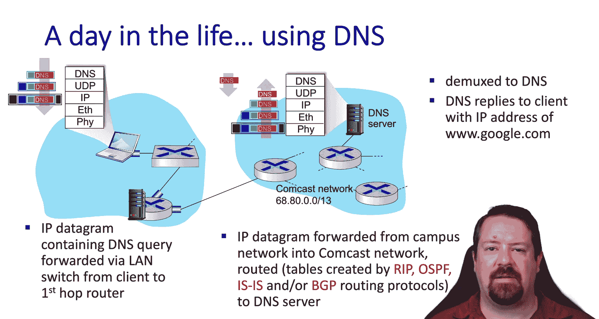

Now that the client knows what IP address to send the request to。

 we finally get to the HTTP protocol itself， where the get request is created。

 but before that can be encapsulated， we have to perform the TCP Connect。

So TCP creates a control message encapsulates it down through this stack。

And completes part one of the three way handshake。

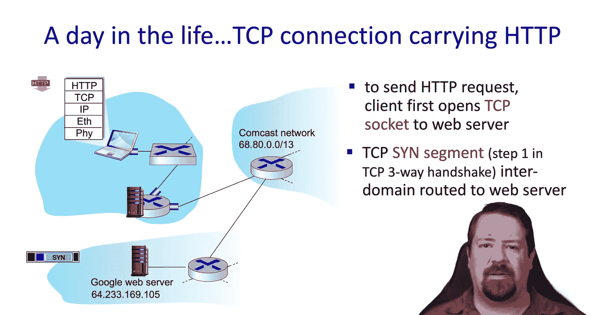

When that reaches the transport layer， TCPO respond to the S Act and send that back through the network to the client。

Once TCP acts the S Act， the connection is fully established；

 usually TCP will piggyback the initial data with that act so the get request can be sent out at this point。

Now we can look at the HtTP layer finally and we see the get request being encapsulated over TCP and send out keeping in mind that TCP will be employing slow start and congestion management throughout all of this。

So that message is sent over to the server， which decapsulates it up to the web server application and the server can respond back with the reply。

 which would contain the web page request assuming the request is valid。

Then when stop packet gets back to the client and demplex stuff to the application。

 it can begin displaying the webp page， of course， this initial object would only be the base HTML and any style or graphics or would have you that are referenced in the HTML would have to be retrieved in additional connections。

So as complicated as this day and life of a web request process was。

 we still had to simplify a number of steps along the way。

 but hopefully that's helpful in connecting the dots between all of the layers that we've looked at so far in the class。

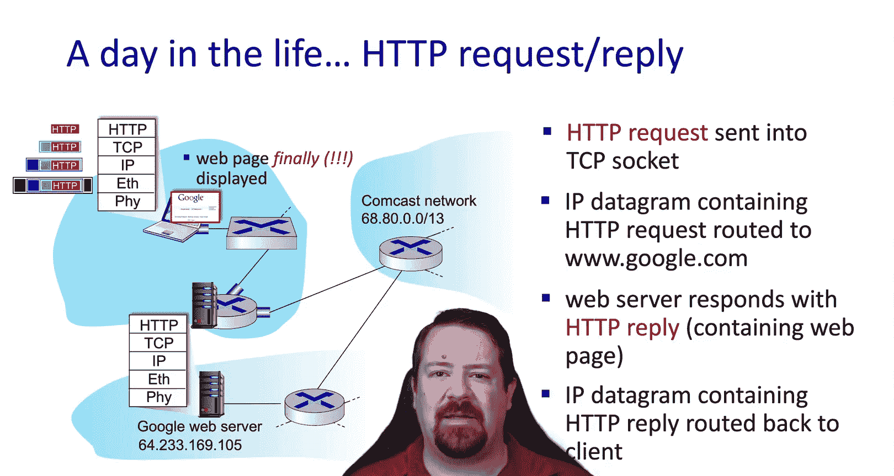

With that completed， we'll look at a little summary of chapter6 in the link layer。

Speaking back to the beginning of the chapter we saw that layer 2 is much more concerned with error detection and correction than other layers of the network。

 it's the closest to the physical layer where these bit flips actually occur。

Another major responsibility of the link layer is managing access to shared channels。

 so multiple access control。And then as part of this。

 we have linkclair addressing so that frames can reach their designated recipients。

We looked at the specifics of the ethernet implementation。

 as well as the construction of switched ethernet lanes and the extension on top of those V lanes。

And then in the last video， we looked at the multiprotocol label switching protocol。

 which enables us to create virtualized links or circuits。

 and then we wrapped up with looking at a day in the wife of a web request to tie together all of the network layers that we've looked at so far。

So in terms of this class， that completes our journey down the protocol stack at each layer we've studied both the principles behind the services provided at that layer and how they are implemented in practice。

But that doesn't mean we're done yet， there are a couple of cross cutting topics that we want to look at in the subsequent chapters。

The first of those being wireless， which we'll look at in chapter 7， and the last being security。

 which we'll look at in chapter 8。That wraps up our discussion of chapter 6 of Croro Nross。

 and in the next video we'll be starting chapter 7 See you then。

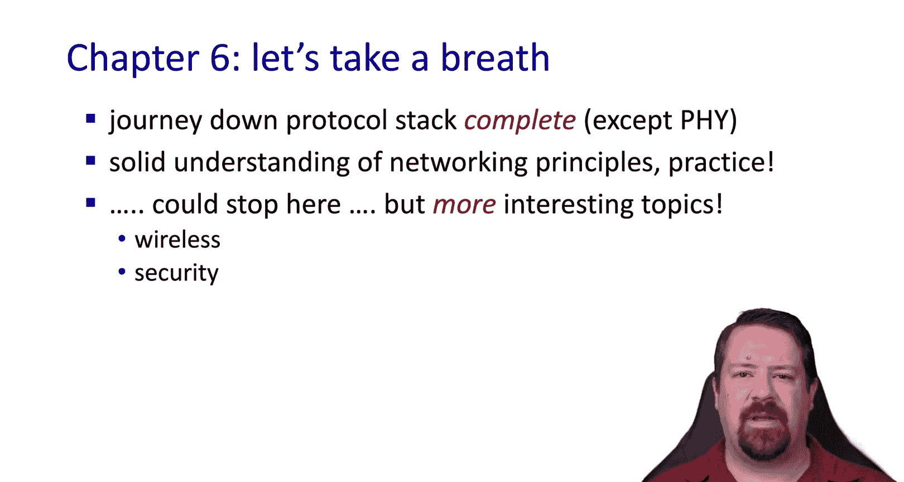

We hope you enjoyed this video， if you found it to be useful。

 please click the like button to be notified when more videos are posted for this class。

 please subscribe to our channel and click the bell。

