# 计算机网络：自顶向下方法：第7章：无线与移动网络挑战 🛰️

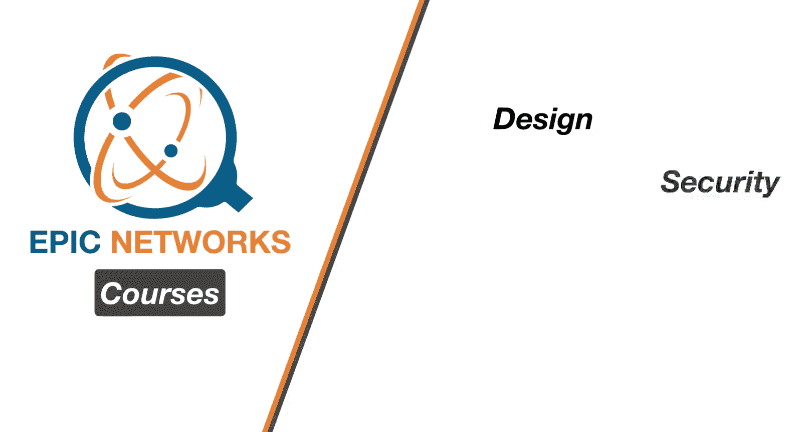

在本章中，我们将开始学习无线网络特有的挑战以及用于应对这些挑战的技术。我们将从无线网络的基本元素入手，探讨无线链路与有线链路的区别，并介绍一些关键的无线通信概念。

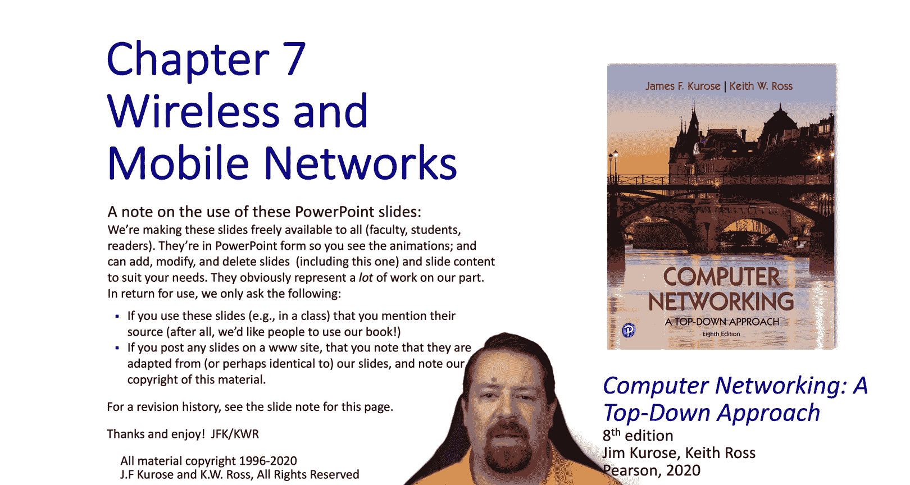

---

## 无线网络概述 📡

我们已完成前六章的学习，从应用层一路向下深入到了链路层。现在，我们将开始关注无线环境特有的方法。

当前，移动电话用户数量是有线电话用户的十倍，移动无线互联网连接设备数量是固定宽带用户的五倍。此外，在4G和5G网络中，网络核心已从基于电路的结构转向基于IP的结构。向无线设备的转变显然由需求和便利性驱动，但也带来了一些高层挑战，这些挑战在网络协议栈中转化为众多技术难题。其中一个高层挑战是无线信道的特性，仅仅维持无线链路上的通信就比维持有线链路通信困难得多。无线的“无束缚”特性也带来了移动性，但这又引入了一系列额外的挑战。请记住，IP协议栈最初是专为有线网络设计的，因此这些无线和移动挑战完全超出了IP网络服务最初设计的范畴。

在本视频中，我们将介绍无线网络、相关挑战以及无线链路的一些特性。本章后续部分，我们将探讨基于802.11的网络以及蜂窝网络。我们还将研究围绕移动性的问题以及用于支持移动性的一些特定技术。

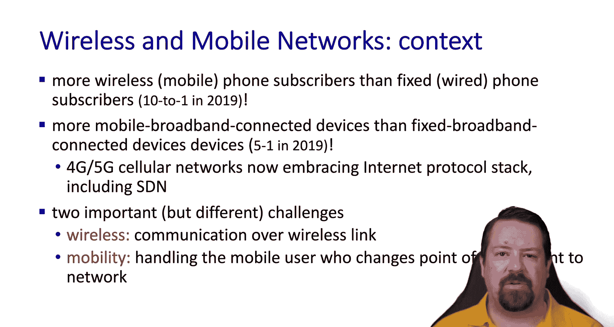

---

## 无线网络元素 🔗

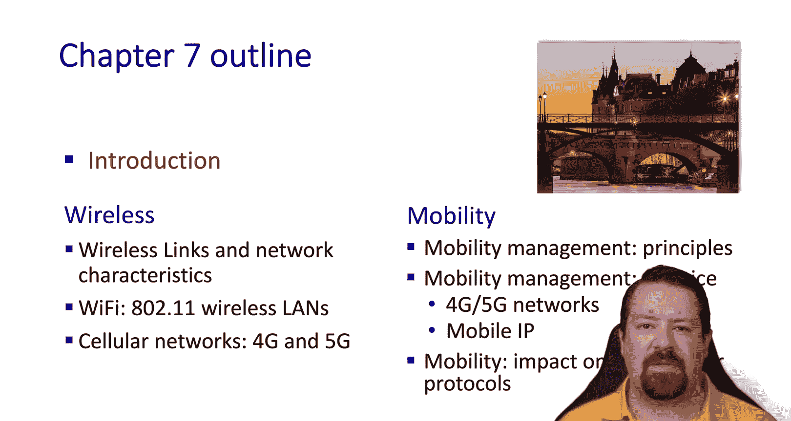

首先，让我们概览无线网络的一些基本元素。通常，无线网络是有线网络的延伸，无线链路是接入网络的一部分，但网络核心仍然是我们迄今为止讨论的互联网有线核心。

在无线领域中，我们有**无线主机**，例如笔记本电脑、智能手机和物联网设备，这些设备运行着产生流量的应用程序。需要指出，并非所有无线设备都是移动的。有时，为特定设备连接有线线路过于困难或昂贵，因此即使该设备不需要移动，它仍将通过无线网络连接。

除了无线主机，我们还有**无线基础设施**，通常称为基站或接入点。这些可以是家庭中的无线局域网接入点，也可以是安装在蜂窝塔上的基站。我们通常认为基站是固定的，并覆盖特定的地理区域。在大多数情况下，基站有一个有线回程链路将其连接到互联网。当然也有例外，例如基站可能安装在车辆上，或者基站的回程链路也可能是无线的。常见的例子包括已存在十年左右的无线热点，以及越来越多新车型中提供的接入点选项。

在我们的基站和无线主机之间，存在**无线链路**。这个第二层环境可以有不同的数据速率和操作范围，并可能使用一个或多个信道进行通信。**无线多路访问控制协议**协调所有无线主机和基站对链路的访问。

---

## 带宽与范围的权衡 ⚖️

我们通常看到带宽和范围之间的权衡。这通常是因为在较高频率载波上更容易创建高带宽链路，但频段越高，信号在传播过程中能量损失越快，因此较低频率更适合长距离链路。

此图表并非详尽无遗，因为微波和卫星无线链路技术的传播距离远超过这些。在此图中，我们仅关注无线局域网和无线蜂窝技术。目前大多数消费设备使用802.11ac协议，该协议向后兼容802.11n、g和b。我们也开始看到以Wi-Fi 6（即802.11ax的市场名称）为卖点的消费设备。还应注意，这里更快的速度依赖于将多个信道绑定在一起，因此许多设备不支持协议所支持的最高峰值速度。

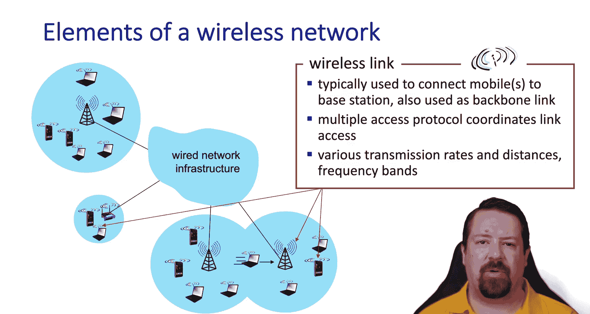

---

## 基于基础设施的无线网络 🏗️

到目前为止，我们讨论的都是**基于基础设施的无线网络**，这意味着无线网络依赖固定基础设施（如基站、蜂窝塔和有线回程链路）来运行。无线节点不直接相互通信，它们只与基站通信。此外，还有切换机制，使得移动无线节点能够相对无缝地从一个基站过渡到另一个基站。

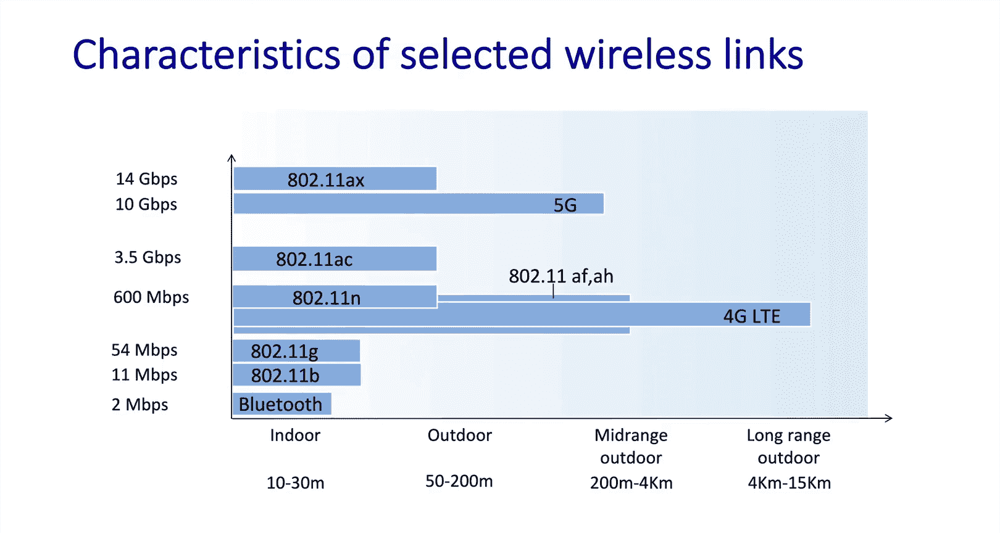

---

## 自组织无线网络 🔄

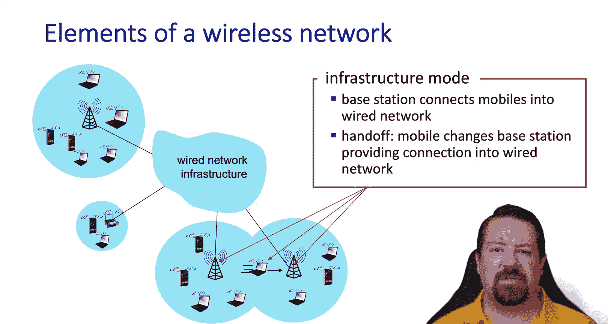

与此相反，我们有**自组织无线网络**，其中无线主机直接相互通信。它们必须自行组织成网络，并且只能在无线电范围内通信，没有基站来中继从一个节点到另一个节点的传输。然而，在基础设施不存在、受损或不可用的环境中，能够创建这样的网络无疑是有利的。因此，我们遇到的最常见的无线网络是基于基础设施的单跳网络。

---

## 无线网络类型总结 📊

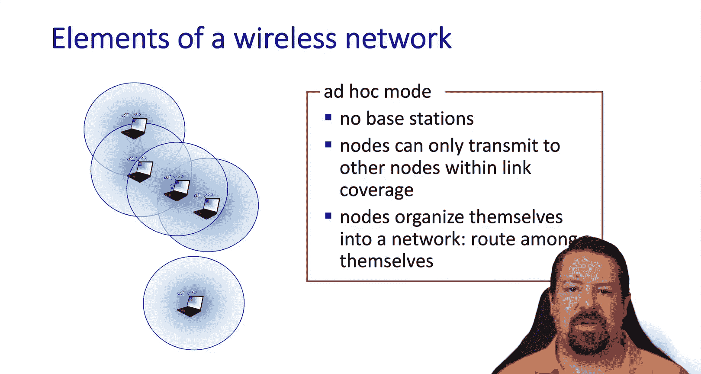

以下是不同类型的无线网络：

*   **单跳、基于基础设施的网络**：每个无线主机仅与一个基站通信，该基站有一个回程链路连接到互联网的其余部分。
*   **网状网络**：在连接到互联网的设备之前，存在多个无线跳。例如，Wi-Fi中继器可能属于此类。
*   **无基础设施的单跳网络**：例如蓝牙或Wi-Fi直连。
*   **多跳无线网络**：没有基础设施，因此作为无线主机参与网络的设备也为相邻设备路由和转发数据包。此类网络通常称为移动自组织网络或车载自组织网络。

---

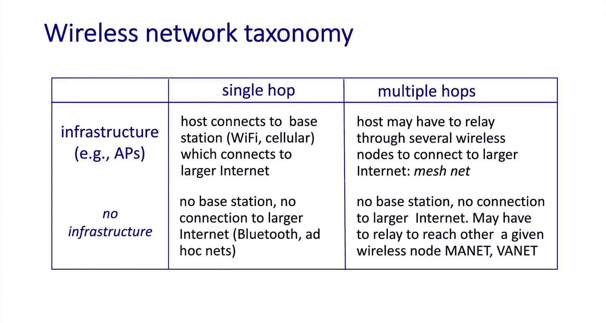

## 无线链路与有线链路的比较 📶

现在，让我们看看无线链路与有线链路的比较。一个重要区别是衰减对无线信号的影响。虽然有线信号确实会衰减，但其衰减速率远低于无线环境。此外，与在空气中传播相比，无线信号在穿过建筑物等固体物体时受到的影响要大得多。

此外，无线链路极易受到干扰。对于我们习惯处理的无线局域网，它们使用的频段与许多其他无线电设备以及可能在某些相同频率发射噪声的其他电子设备共享，还有同样工作在2.4 GHz并倾向于发射大量无线电噪声的微波炉。也很容易出现多个无线网络试图在同一时间在同一信道上运行并相互干扰的情况。

除了被物体衰减外，无线电波还会从物体上反射，这些反射会干扰原始信号。因此，在衰减和多径干扰之间，即使看似简单的无线链路也可能相当具有挑战性，并且容易导致数据包损坏。

---

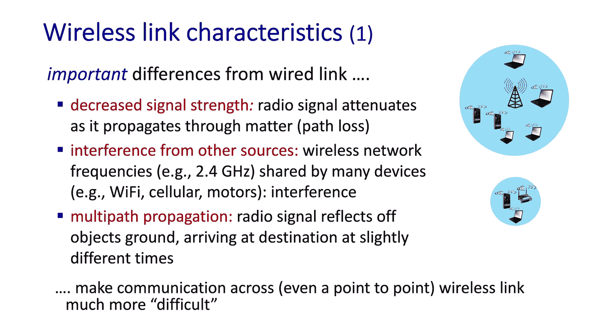

## 信噪比与链路自适应 🔧

为了使无线链路有用，通常需要有一个阈值**信噪比**，链路必须在此之上运行，低于此值，接收器将无法正确解码数据包。因此，为了提高信噪比，我们需要以更高的功率传输或使用调谐更好的天线来接收信号。因此，随着传输功率的增加，信噪比增加，误码率降低。

然而，设备限制和法规限制了我们能够传输的功率。因此，如果我们被限制在给定的信噪比下，我们希望我们的链路层能够相应地适应，以便在当前信噪比下通过链路获得最多的可用数据。在此图表中，我们看到三种不同的编码，对应三种不同的数据速率。随着链路质量的下降，设备可以回退到较低的数据速率，即在给定信噪比下实现较低误码率的编码。

---

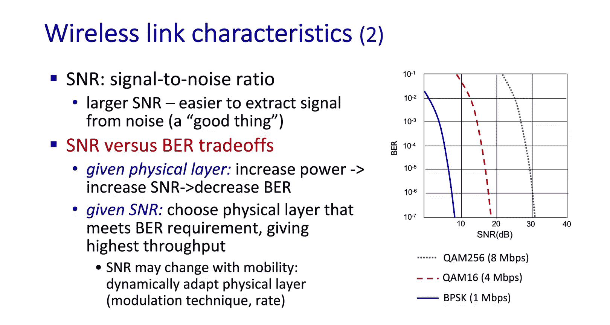

## 隐藏终端问题 🚫

我们在无线环境中遇到的另一个问题是**隐藏终端问题**。当我们运行某种分布式媒体访问控制算法时，并非所有节点都能听到彼此，因此如果我们试图使用像载波侦听这样的机制，它假设所有节点都能听到彼此，那么隐藏终端问题可能导致意外的冲突。

在此示例中，B可以听到A和C，但A和C听不到彼此。我们在这些网络中处理的大多数频率范围被认为是视距传输，这意味着它们被地面衰减得非常厉害，如果两个端点之间有山丘或土堆，则基本上没有传输。因此，画出A和C的信号衰减，我们可以看到它们到达B，但被中间的山脉大大衰减，因此它们无法到达彼此。这意味着如果A和C都侦听信道，并且一个开始传输，另一个不会听到，因此另一个可能同时开始传输，导致冲突，这意味着B将无法提取任何一方的通信。因此，我们可以使用额外的机制来处理这个问题，稍后我们会讨论这些机制。

---

## 码分多址访问 📡

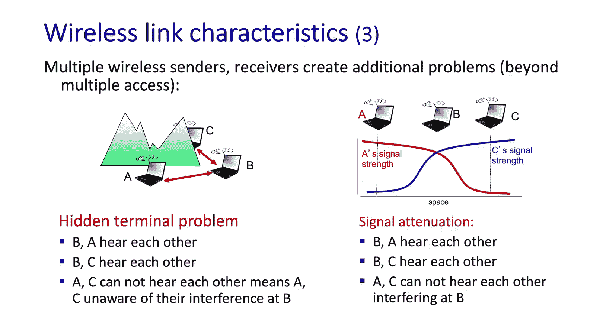

回到链路层开始时，我们讨论了带宽共享机制，我们描述的是时分多址和频分多址。我们提到还有一种是**码分多址访问**，然而它不用于有线环境，因此我们将其保留到无线章节来讨论。在这种情况下，为每个用户分配一个唯一的代码。

因此，所有用户在同一频率上传输，这与频分多址不同，但在传输数据之前，他们必须使用分配的**码片序列**对其进行编码。这些码片序列彼此正交，因此编码仅包括将原始数据与码片序列进行内积运算，并且可以通过对编码数据和码片序列进行求和内积来解码。

---

## CDMA 编码与解码示例 💻

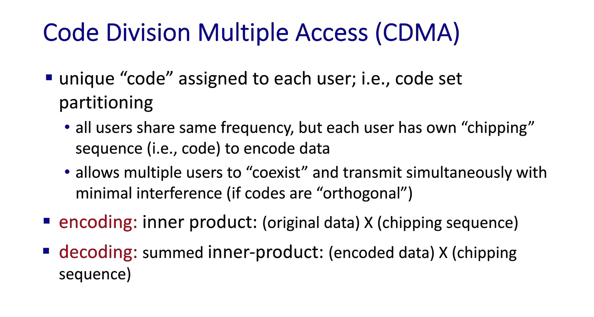

在此示例中，我们将仅查看编码来自接收方的两个时隙的数据，然后在接收方解码。在这种情况下，每个时隙传输一个实际数据位，但我们看到在该时隙内有一个八位的码片序列。

由于此处传输的位是1，当进行内积运算时，我们看到输出就是码片序列。然后，在下一个时隙，我们传输一个零。因此，我们看到内积运算导致传输码片序列的反码。然后，信道输出到达接收器。它需要提取原始数据，并且它知道发送方的码片序列。因此，它能够对这两个传输进行求和内积运算并检索原始数据。这样，我们编码和解码了一个发送方到一个接收方。

---

## 多发送方 CDMA 示例 🔄

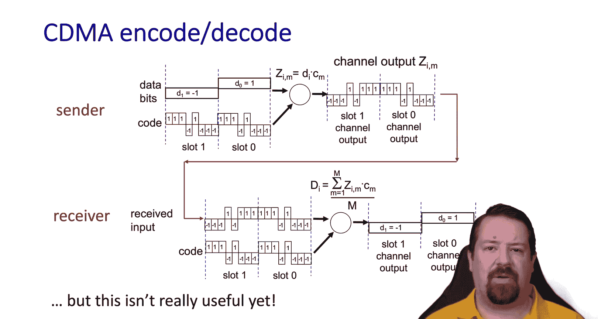

当有多个发送方时，这就变得有趣了。当然，我们说这是一种在多个用户之间划分可用带宽的机制。现在，我们有两个发送方。

这些发送方具有正交的码片序列。它们都编码两位数据，并且它们的时隙是对齐的。因此，在信道上广播的是这两个传输的干扰，也就是两个传输的总和。当接收器获得求和传输时，它能够选择应用哪个发送方的码片序列，并仅从该发送方检索原始数据。因此，即使我们有多个发送方在同一时隙同时传输，我们也能够以允许我们检索所有发送数据的方式建设性地利用干扰。

现在，我们注意到发送方必须使用码片序列将每个数据位编码为信道上的多个位。因此，这里没有免费的午餐，每个发送方只能获得可用带宽的一部分，因为在这种情况下，它们必须为每一位数据传输八位。

---

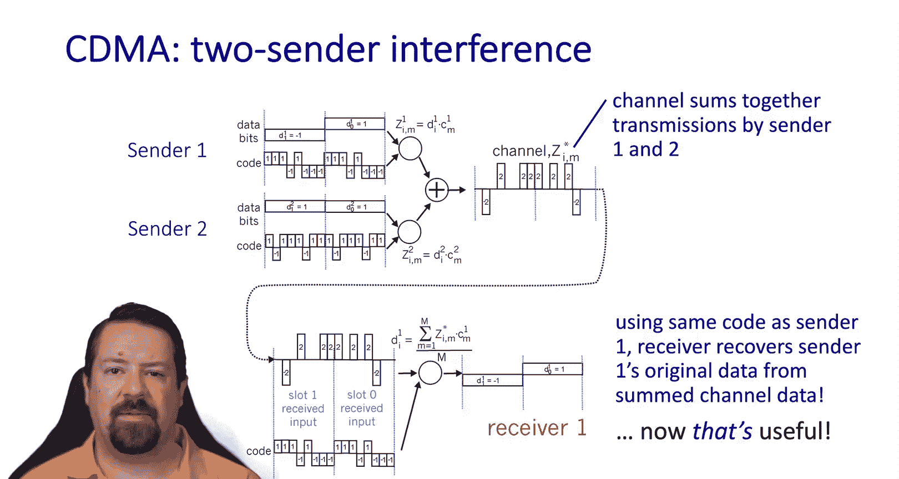

## 总结 📝

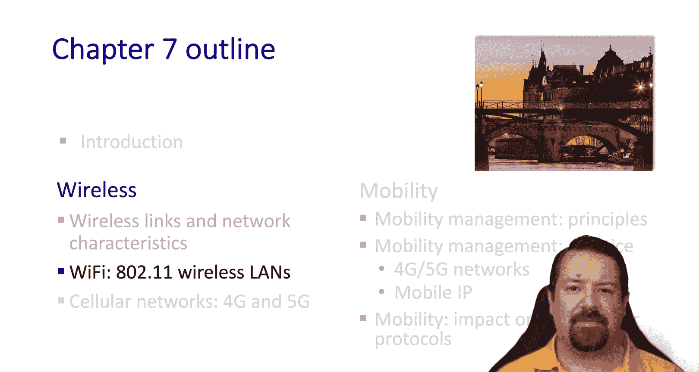

本节课我们一起学习了无线环境和无线链路的介绍。我们探讨了无线网络的基本元素、类型、无线链路与有线链路的区别、信噪比的重要性、隐藏终端问题以及码分多址访问的基本原理。在下一个视频中，我们将开始研究802.11无线局域网。