# Jim Kurose《计算机网络：自顶向下的方法｜Computer Networking： A Top-Down Approach》中英（deepseek p52 -52-802.11 How WiFi Works - Wireless Networks -BV1UMtueiEaA_p52-

In this video we examine how the 802。11 protocols， commonly known as WiF are designed。

 let's get started。

Now that we've spend some time looking at the differences between wireless links and wired links and some of the challenges that that presents。

 we'll have a better understanding of some of the design decisions that are made for wireless link layers。

We'll start by looking at 802。11 Wi lenss， which are commonly referred to as Wi Fi or wireless Ethernet。

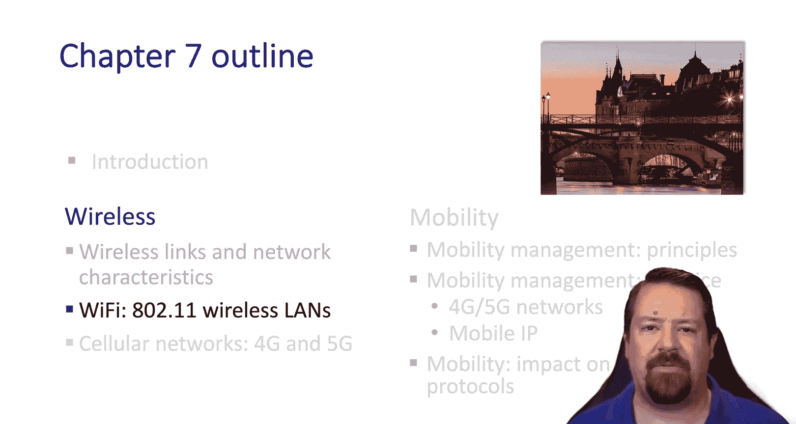

You can see a bit of the chronology here with 802。11b。

 the earliest version that was widely deployed for consumers， and was followed in a few years by 802。

11G， which significantly increased the available bandwidth。

Both of those protocols were only specified to run over 2。4 gigHz， however。

 more recent versions have also been specified to run in the 5 gigahHtz band。

Today we commonly see 802。11AC deployments and are just starting to see 802。11 AX。

 but in terms of product marketing， that is more commonly known as WiF6。

At the bottom of the table we also see the AF and AH variants。

 which are designed to work over significantly longer distances。

And we can see that the tradeoff there is that they have significant lower speeds than the short range versions that were developed around the same time。

What all of these protocols have in common is that they use the CSMA CAA algorithm that we discussed in the previous chapter。

 and while we commonly think of these running in infrastructure mode。

 meaning that there's designated base stations，There is also an ad hoc mode in the specification。

So devices using these protocols can be configured to talk to one another directly when the use of a base station isn't feasible。

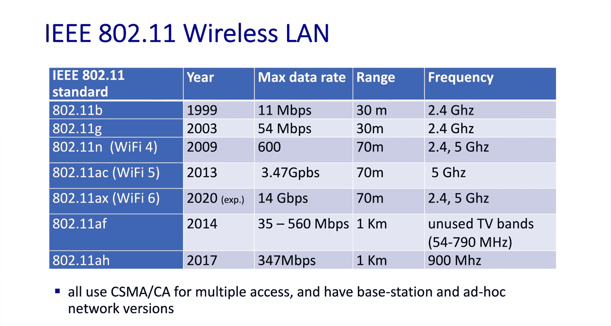

In these networks we use the term baset or access point interchangeably。

 and while we don't typically talk about cells in the case of wireless lenss。

 the equivalent concept exists， which is the BSS or basic service set。

This includes the access point and all the hosts that are communicating with that particular access point。

Hosts may be in range of multiple access points at once and they will choose or be told which access point they should communicate with。

And they also have the ability to roam from one access point to another on the same wireless network。

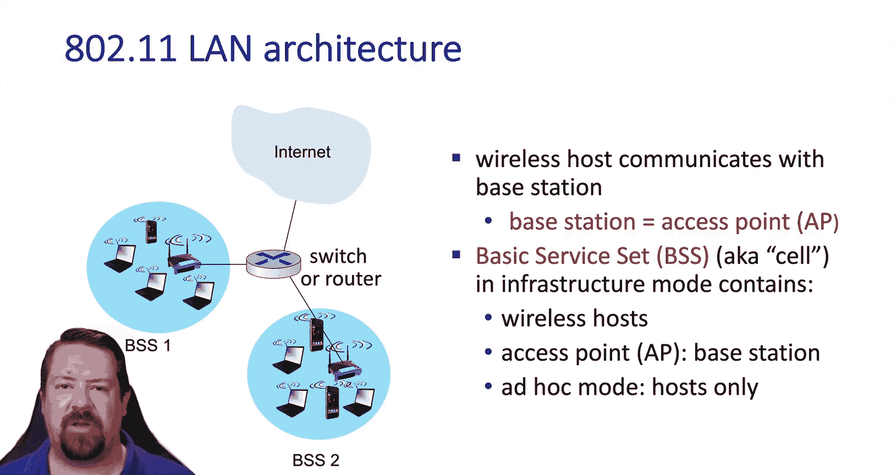

Each of the available bands， 2。4GH and 5 gigHz have multiple channels available。

 so when the access point is configured， part of that configuration is choosing which channel within that band it should operate on。

If two access points and range of each other are configured on the same channel。

 then they will interfere with one another， so it's important to survey the wireless environment and choose channels carefully so that neighboring access points do not conflict。

When a new host arrives， it goes through an association process with a particular access point。

To begin this process， the host scans through the available channels listening for beacon frames。

 which are sent periodically by all of the 802。11 access points。

The beacon frame contains both the SSID， which may be shared across multiple axis points。

But also the Access pointss Mac address， which is used by the host to differentiate one access point from another。

Based on the beacon frames that adhere hears， it can choose which access point to associate with。

The Ado 2。11 specification also includes various forms of authentication which may be required before the association is allowed to complete。

Once the association happens。The host can then use DHCP just as it would on a wired la in order to get an IP address on the subnet。

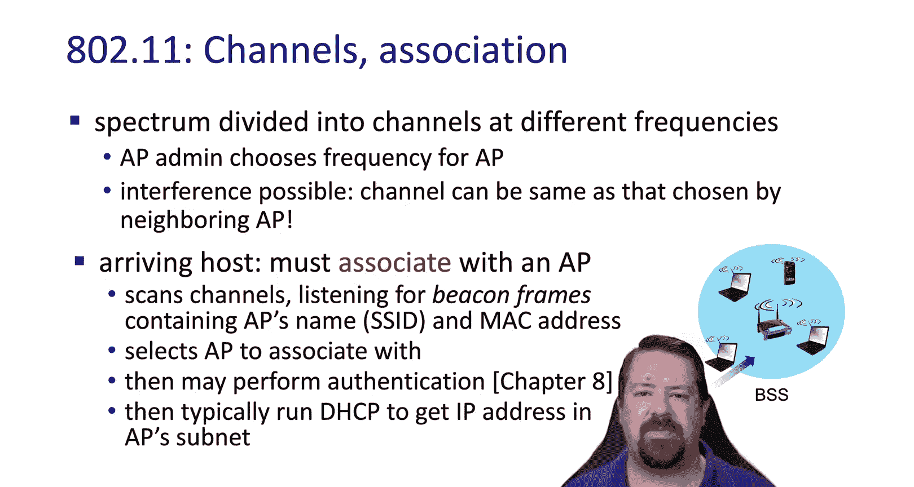

Let's look at the channel scanning process in a little more detail。

This begins with the new host going into a listening mode and rotating through the channels。

 once the host sees beacon frames from a network that it recognizes。

 it can send an association request and receive an association response。

The first step of this can take a little time because while the host is listening on one channel for Beacon frames。

 it may miss be frames that are sent out by nearby access points on other channels。

There's an alternative to this， which is active scanning。In this case。

 when the host starts listing on a channel， it sends out a probe request。

 and then any access point on that channel will send a probe response。

 which contains the same information that would be included in a beacon。

The association process is performed the same as in the passive case。

All modern operating systems use the active scanning approach in order to speed up the association with wireless networks。

However， it is important to note that there is a significant security vulnerability here in that the probeb request contains a list of SS IDDs that this host has connected to in the past。

These are the ones that show up as networks the host remembers when looking at the wireless options menu。

 so a malicious access point can overhear this list of known SSIDs and send back a probe response pretending to be one of those SSIs in order to trick the host into connecting to this rogue access point。

The Rogue access point is then in a position to perform men in the middle attacks on that host's traffic。

There are some mitigations to this， but that's beyond the scope of this course and is something we discuss in our wireless security class。

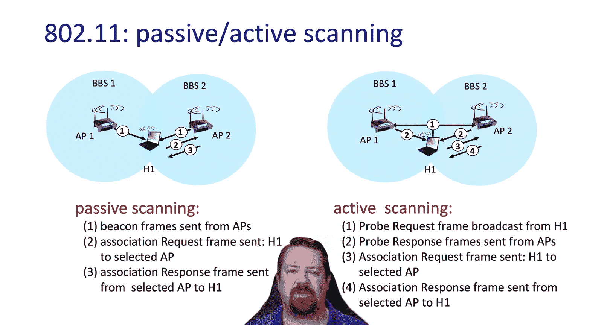

As we've mentioned a couple times now， 8 or 2。11 uses the CSMA CAA algorithm。

 so carrier sensing multiple access， which means that if one node is transmitting。

 then all the other nodes should listen and not start transmitting at the same time。

And as we've also mentioned， this mechanism is susceptible to the hidden terminal problem。

 not all nodes may be able to hear the transmissions of every other node in the network Also this is CSMA CA。

 not CD In wired ethernet we add CSsM which was curious sense multiple access with collision detection however in the wireless environment it's technically very challenging to sense collisions as they happen so there's no collision detection in wireless instead we have collision avoidance CSMA/ CA。

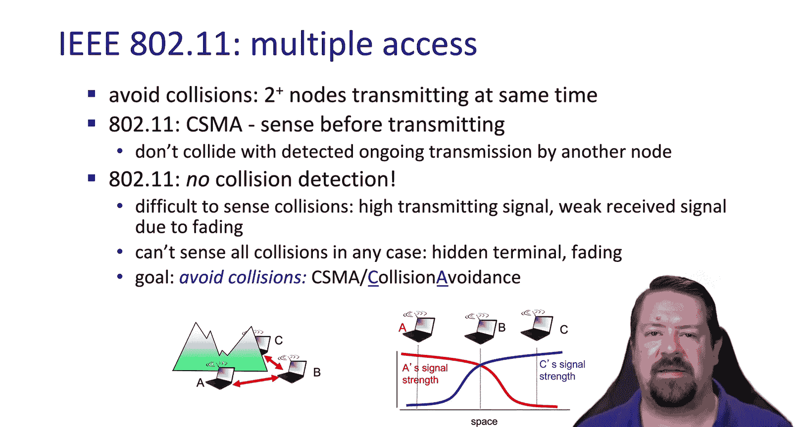

So let's see how that works。First， we have a specified time for listing on the channel before beginning transmission。

 which is called Ds。Difs stands for the DCS Interframe Space。

 where DCS is distributed coordination function。If no other transmission is detected during diFs。

 the data frame is transmitted in its entirety， remember。

 we can't sense collisions in wireless so there's no reason that a transmitter would stop before transmitting the entire frame。

If instead the channel is already in use during the dis period。

 then the transmitter will be and start a random backoff timer before it starts sensing again。

This is similar to other randomized backoff processes that we've seen because if the channel were in use and multiple other transmitters were sensing the channel。

 and they began their di period as soon as the transmission stopped。

Then they would all sense that the channel is idle。

 but they would all begin transmitting at exactly the same time causing collisions。

So instead of transmitting as soon as possible when the channel is idle。

 they have to wait this random backoff period so that hopefully only one host will begin transmitting at a time and the others will sense that transmission and not collide with it。

On the receiver side。The data frame is received and it's acknowledged。

 and this acknowledgement happens after SIF's， the short inner frame space。

So this is how the sender knows that no collision happened if they don't receive the act。

 the frame will have to be retransmitted CFs is much shorter than dis。

 so if there is an act to be sent， it will happen before it's possible for any dis period to expire so the act will be the next packet sent on the channel after a frame is received successfully。

This CSMACA algorithm works well as long as there aren't too many hosts trying to share the channel。

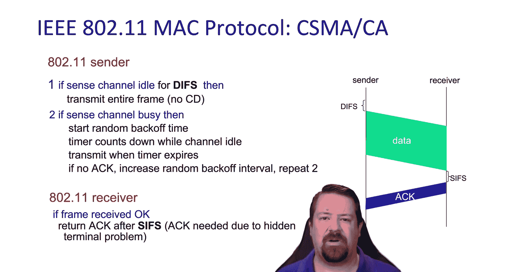

However， we can employ an additional mechanism known as RTS CTTS for more heavily congested channels。

The idea here is that the channel is reserved by the sender first sending a request to send。

 which is just a small control packet， and the base station broadcasts out which host is allowed to use the channel next and for how long。

 so while a hidden terminal problem means some hosts may not hear other host transmissions of the RTS。

By definition they range of the base station so they will hear the CTS that the base station sends out。

 and they will know not to transmit and thus avoid collisions while the sender transmits data the RTS control messages may still collide with one another。

 however they're small so they waste a minimal amount of bandwidth。This way。

 after the CTS has expired， meaning the source has sent their data frame。

 other hosts will know how long to wait and then they can send their own RTSs to reserve the channel if they need to send data。

Now let's see the RTS CTTS Exchange In this case， hostst A and B both send RTSs at approximately the same time and they collide。

This means that the base station is not able to interpret these transmissions and so no clear to is issued。

After random back off， A retries first with our RTS。

 and while we're showing that this RTS doesn't reach B due to attenuation。

 the base station transmits the clear ascent， and so B knows not to transmit during the specified time。

So it defs its transmission， and AO has the channel to transmit their data frame。

When that frame arrives at the access point， it transmits the acknowledgecment and so A knows that there was no collision and the transmission was received correctly。

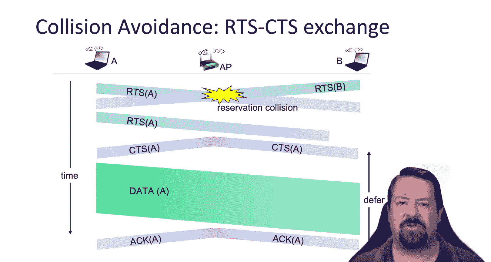

Now we can look at the 80211 header format。Probably the most noteworthy thing about the 8 or 211 frame relative to other headers that we've looked at is that there are four addresses。

This allows us to include addresses on the wired link。

As well as addresses that might be important on a wired segment that is part of the same IP subnet remember our layer two Mac addresses have significance throughout the broadcast domain。

 and these wireless One hopop links may be part of a larger Ethernet broadcast environment。

So our first Mac address is the destination of this transmission。

 meaning it's either the wireless host or the access point。

 and the second address is the center of this transmission。

 again either the wireless host or the access point。

The third address is the Subnet gateateway address。

 so if this frame ultimately needs to get to a router or other host on the wired network。

 the access point will know what Mac address uses the destination and send it on。

Then there is space for our fourth address which is used in ad hoc mode， because in ad hoc mode。

 we have multihop wireless transmissions happening。

And so we need to differentiate between the sender and receiver of the frame on a given link and the sender and the receiver within the entire subnetit。

Let's look at an example of this addressing。We have H1 transmitting a frame to the access point。

 and since we're in infrastructure mode， we're using only the first three addresses。

So the destination of this wireless transmission is the Access pointss Mac address and the sender is H1's Mac address。

 however within this subnet the destination is the router's gateateway address。

 so the R1 Mac address is used in the third address field。That way。

 when the wireless access point needs to construct the wired ethannet header。

 it knows what Mac address to use in the destination field。So here's our 802。

3 header with just two Mac addresses。Which would consist of the source hostt's Mac address and the router interface Mac address。

 just like we would normally see in an all wired ethernet environment。

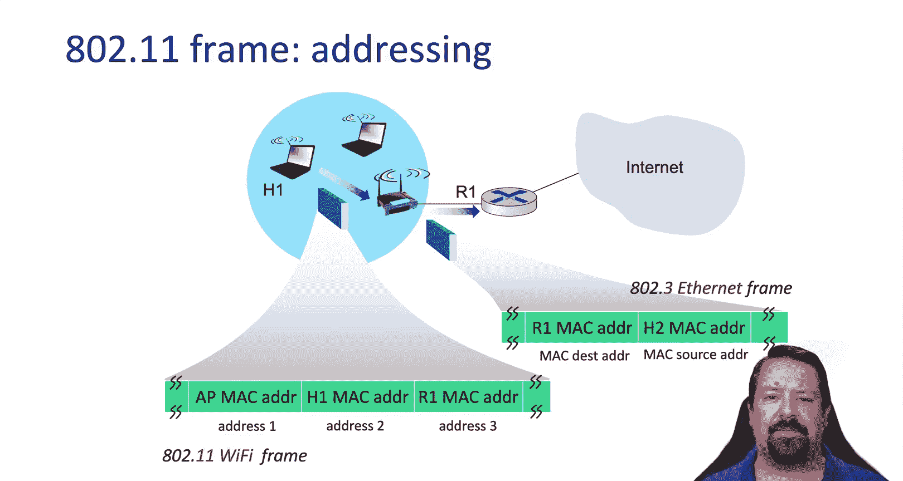

We also have a duration field this is used in the RTS CTTS Exchange。And we have a sequence number。

 remember these data frames get acknowledged。So the sequence number is used to match up acknowledgecgments with transmissions。

We also have two bytes of frame control which gives us a number of bytes to specify things like the version of the protocol。

 whether or not encryption is being used on the link， whether or not this is a retry。

 if it's fragmented， whether the frame is destined to the access point or coming from the access point。

 as well as types and subtypes of the messages which can differentiate between control frames and data frames。

 with control frames being the RTS CTS and AC frames that we've just been talking about。

 we also mentioned that mobility can happen between access points。

 and because this is handled in the layer2 environment， it's transparent from an IP perspective。

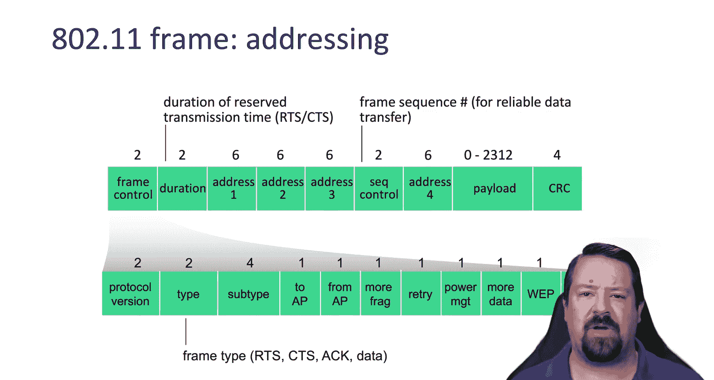

So we have two basic service sets that are participating in the same wireless network and hosts H1 is transitioning from one access point to another probably because it moved closer to the second access point。

 so the signal is stronger there。Then the question is。

 how do the ethernet frames from the router get to the correct access point？

And the answer is it's the same self learning process that we saw before with wired Ethernet switches。

So if I were to unplug a host from one switch and plug it into a different switch。

All the switches would self-learn where that Mac address now lived。

 the same thing happens in the wireless environment when the H1 Mac address moves from one access point to the other。

 those frames start coming from the new access point and the switch updates its switch table accordingly。

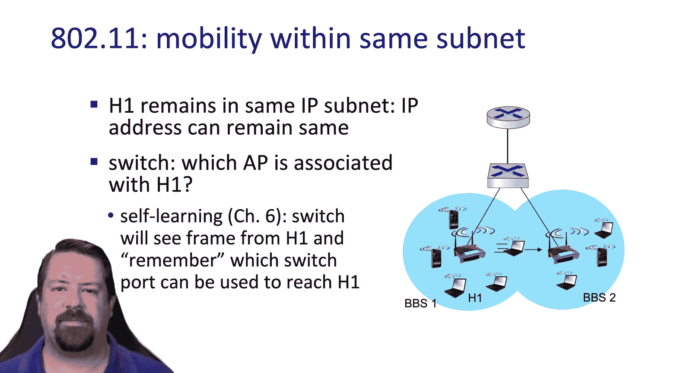

We also mentioned the importance of re adaptationation in the wireless environment。

And that's something implemented in the 80211 protocol If the SNR is high。

 then the baset host will negotiate a high encoding rate that allows for increased bandwidth on the link。

 however， if the SNR degrades， they will also downgrade the encoding accordingly to function with reduced SNR。

So in this example， we have the host moving away from the base station。

 which is causing the bit error rate to increase。As the bit error rate increases。

 this would cause increased retransmissions in 80211。

 which significantly degrades the channel's efficiency， so when the bit error rate gets too high。

 the base station will switch to a lower coding rate that has a reduced bit error rate。

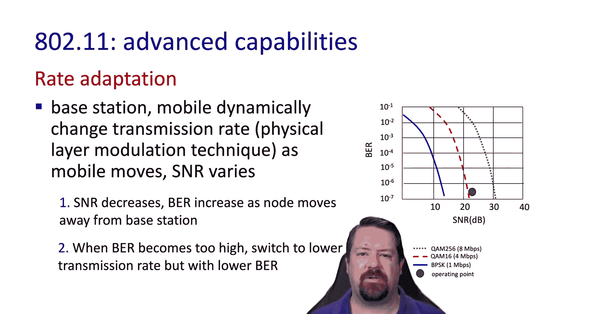

Another important feature of 80211 is power management。

 since many of the wireless devices are also battery powered。

 and the radio can consume a significant portion of that device's overall energy。

This can have a significant impact on battery life。Basically。

 the wireless node is able to let the access point know that it's going to turn off the radio until the next beacon frame。

So the access point won't transmit any frames that it has for that particular node until the next beacon frame。

The wireless host will wake up and receive the beacon frame and in that beacon frame will be a list of all of the wireless devices that have frames waiting for them at the access point。

 so if this particular note is on that list， it will then stay awake and wait for the access point to transmit its frames。

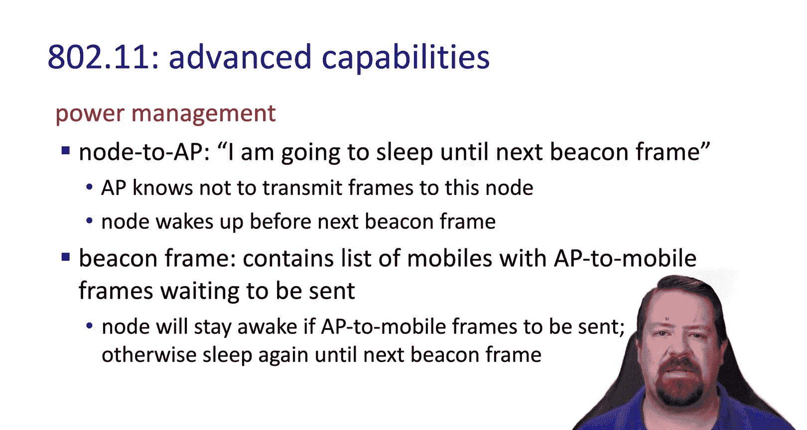

Covering an even smaller geographic area than local area networks， we have personal area networks。

The most common of which being Bluetooth。These are basically designed to reduce the amount of cables needed for convenience or comfort。

They are ad hoc in the sense that there is no dedicated base station， however。

 there is a designated controller for each Bluetooth network and the rest of the devices operate in client mode。

These also share the 2。7 gigahertz spans so they can interfere with or be interfered with by 80211 protocols。

And they use a polling scheme， so the controller pulls the clients to see if they have something to send。

To combat the issue of interference an FDM approach is used。

So the devices hop from channel to channel and while they may collide with other transmissions on some slots and channels。

 most of the slots should be non interfering， also because we're talking about even smaller battery power devices in most cases。

 energy management is very important in these environments。

And Bluetooth handles this with a parked mode， so clients can effectively go to sleep if they are not transmitting or receiving。

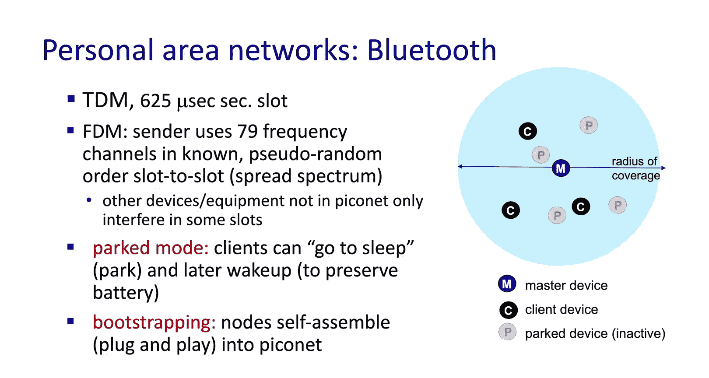

With that， we've covered 802。11LNs or wireless Ethernet。In the next video。

 we'll move on to looking at cellular environments。

Which have a number of features in common with wireless lenss。

 but also some significant differences See you then We hope you enjoyed this video If you found it to be useful。

 please click the like button to be notified when more videos are posted for this class。

 please subscribe to our channel and click the bell。

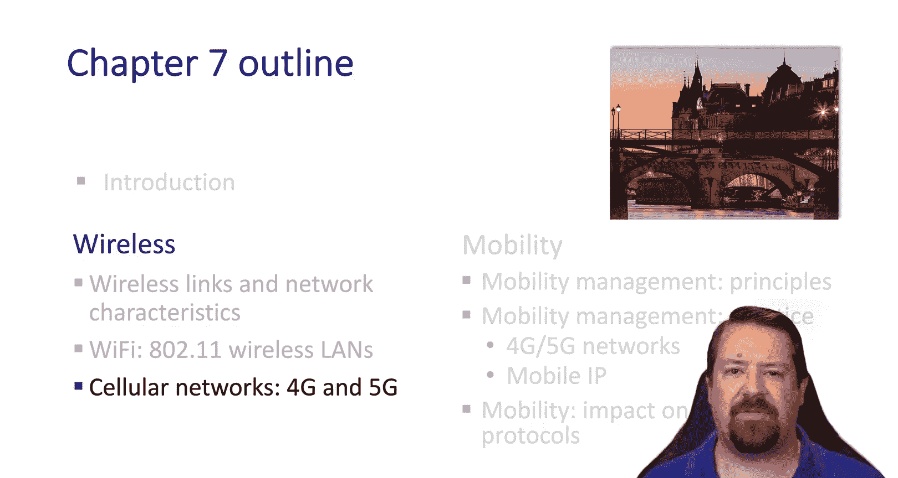