# 计算机网络：第7章：蜂窝4G与5G网络工作原理 📡

在本节课中，我们将学习蜂窝4G和5G网络的工作原理。我们将探讨其架构、核心组件、协议栈以及它们与之前学习的Wi-Fi网络的主要区别。

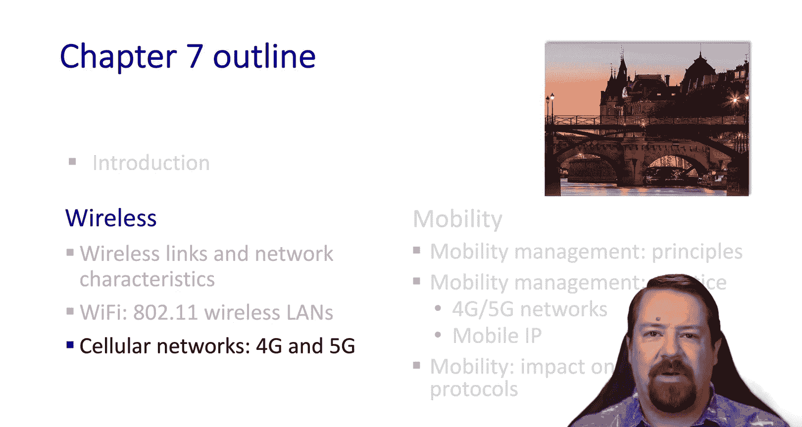

---

欢迎回到第7章。在本视频中，我们将探讨蜂窝数据网络。这些网络与我们上一节学习的Wi-Fi网络有许多相似之处，但也存在显著差异。

正如我们所知，蜂窝网络是目前移动互联网服务的主导解决方案，其设备数量是固定宽带设备的5倍。虽然我们都曾遇到过信号盲区，但在绝大多数人口密集区域，蜂窝宽带服务已经覆盖。相关技术能够提供数百兆比特每秒的带宽，尽管实际观察到的带宽会因多种因素而异。与我们之前学习的互联网协议一样，移动网络协议也由一系列标准所规范。

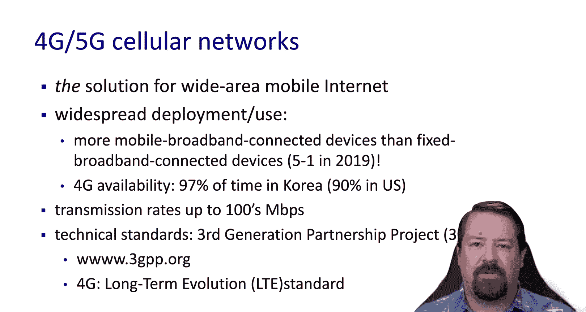

---

## 蜂窝网络架构概览

在蜂窝网络中，我们可以观察到与整个互联网相似的结构。一个特定的运营商将拥有一个核心网络和一个接入网络，它们共同构成了移动蜂窝网络。除此之外，它还连接到互联网的核心。许多不同的蜂窝网络组成了一个“网络的网络”，其客户可以使用语音和数据服务进行通信。运行在IP协议栈上的互联网数据服务在移动网络中已无处不在。我们可以将移动网络视为一个接入网络，它将用户连接到有线互联网。

移动无线网络的主要区别在于第二层（数据链路层），这与802.11标准有显著不同。部分原因是为了实现比无线局域网（WLAN）预期更高的移动性。此外，计费概念更强，需要跟踪设备身份以便向正确的用户收费。由于涉及金钱，还需要身份验证以防止未经授权的账户使用。

---

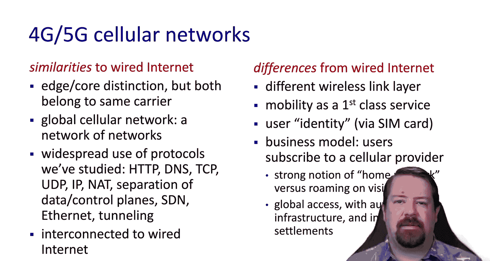

## 网络组件与术语

让我们从架构角度看看这是如何实现的。移动设备，在通用网络术语中称为主机，在移动网络中被称为**用户设备**或**UE**。它们连接到基站（通常位于塔上）。UE可以是手持设备、笔记本电脑、嵌入车辆中的设备，甚至在某些情况下连接到建筑物等非移动设施。

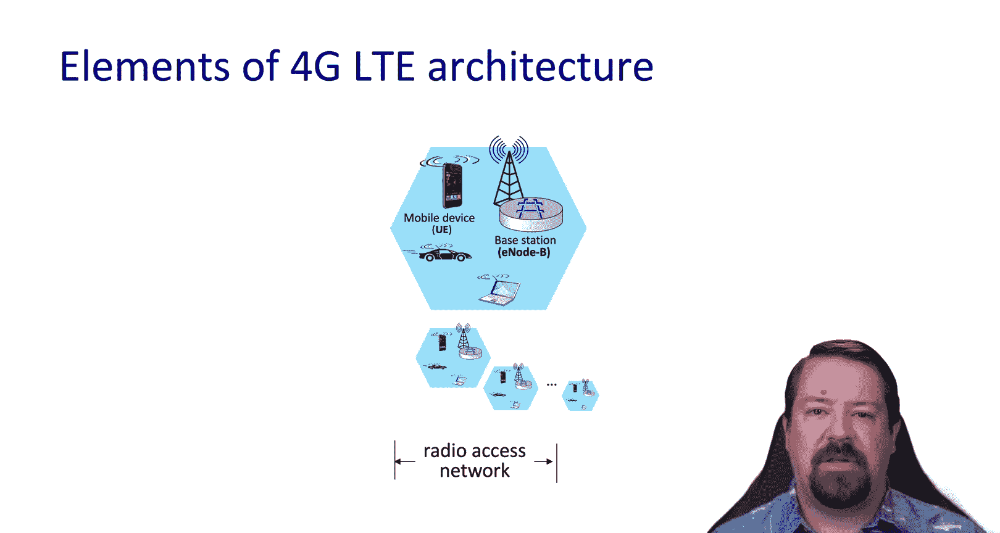

这些设备被组织成**小区**，每个小区都有自己的基站。小区连接到**分组核心网**。分组核心网仍然是移动无线网络的一部分，因为它明确支持小区间的移动性，我们将在后续幻灯片中看到更多相关内容。

在4G之前，分组核心网分为独立的语音和数据服务。但随着LTE的出现，这些服务融合了，所有服务都通过核心网中的IP网络提供。UE通过其SIM卡上存储的号码进行识别，称为**IMSI**（国际移动用户识别码）。这个号码旨在全球范围内唯一，是一个64位数字。

每个基站管理自己的小区，并且每个基站也有一个标识符，UE可以借此区分来自不同基站的传输。所有设备都必须向基站进行身份验证，这要求基站与分组核心网中的元素进行交互。基站之间也会相互协调，以优化网络负载并促进用户从一个小区到另一个小区的移动。

---

## 归属网络与漫游

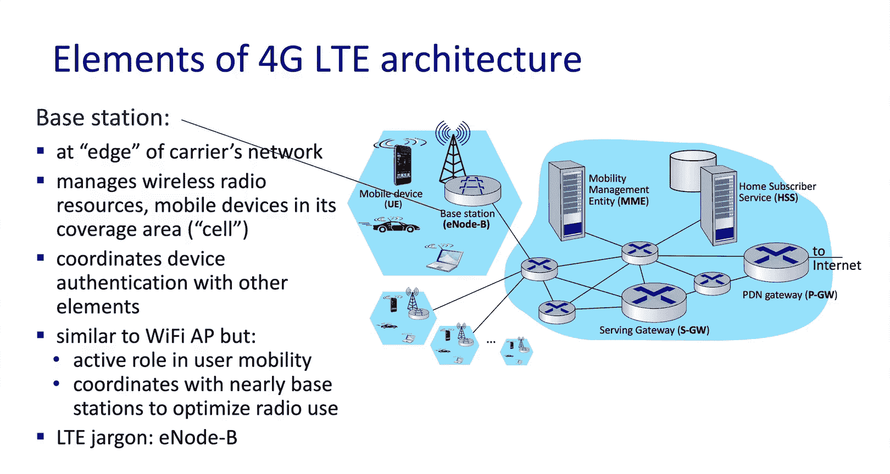

移动网络有很强的“归属网络”概念。因此，一个用户向一个提供商付费，但可能漫游到其他提供商的网络。在这种架构中，归属网络提供的服务与漫游网络不同。

归属网络为其自己的客户维护**归属用户服务器**或**HSS**。这是将IMSI号码与用户身份（如姓名、账单地址等）关联起来的地方。它还会维护用户已订阅的活跃服务信息。

正如您可能预期的那样，分组核心网中也有一些路由器，其中一些具有特定功能。有一个通往互联网的网关，称为**分组数据网络网关**。我们注意到，这通常提供**NAT**服务。几乎所有移动网络都大量使用NAT，因为它们设备数量庞大，没有足够的IPv4地址为每个设备分配唯一的公网地址。

此外，还有**服务网关**，这是基站使用的分组核心网的入口点。

---

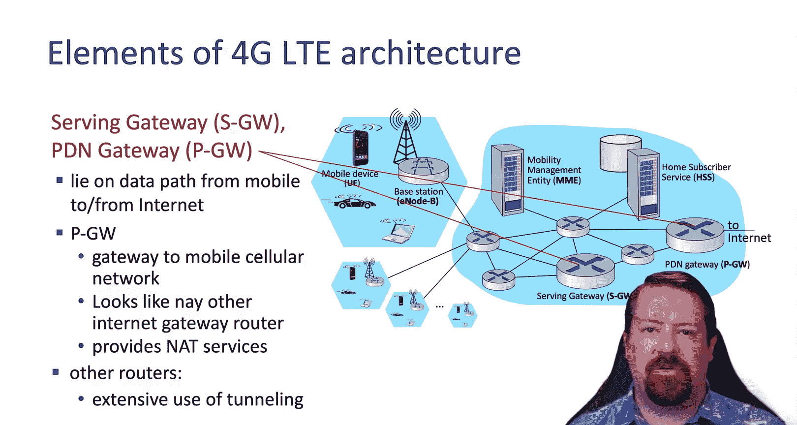

## 移动性管理

归属用户服务器管理相对静态的数据（可能由人工不时更新），而我们可以将**移动性管理实体**视为管理设备连接的实时状态。这包括支持设备身份验证、跟踪设备连接到哪个小区以进行呼叫路由，以及在设备从一个小区移动到另一个小区时协助切换。它还设置在设备和分组数据网络网关之间用于访问互联网的隧道。

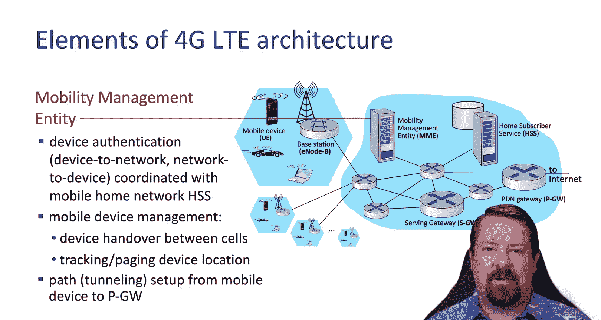

---

## 控制平面与数据平面

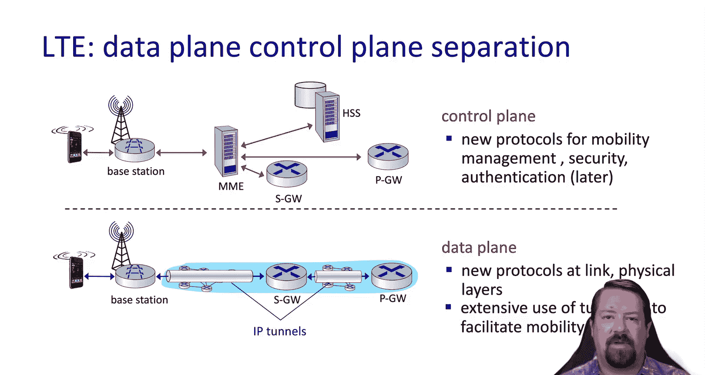

正如互联网的其他部分一样，移动网络中也存在**控制平面**和**数据平面**的区别。在这种情况下，数据平面大量使用隧道协议，而控制平面则负责移动性、安全和身份验证。由于我们有一个发送IP流量的设备，同时核心网也运行着IP网络，我们最终会使用**IP-over-IP隧道**。

---

## 第二层协议栈

在这种环境下的第二层可以细分为几个组件，包括**分组数据汇聚层**、**无线链路控制层**和**介质访问控制层**。

*   **分组数据汇聚层**负责用户数据的压缩和加密等。
*   **无线链路控制层**负责在用户设备和基站之间可靠地传输帧。
*   **介质访问控制层**，正如我们之前所见，协商无线电传输时隙的使用。

虽然用户设备和基站之间有一个单跳无线接入网络，这与我们的802.11协议直接类似，但在这个环境中，我们同时执行**频分复用**和**时分复用**功能，这意味着这些无线电在技术上比802.11无线电更先进。

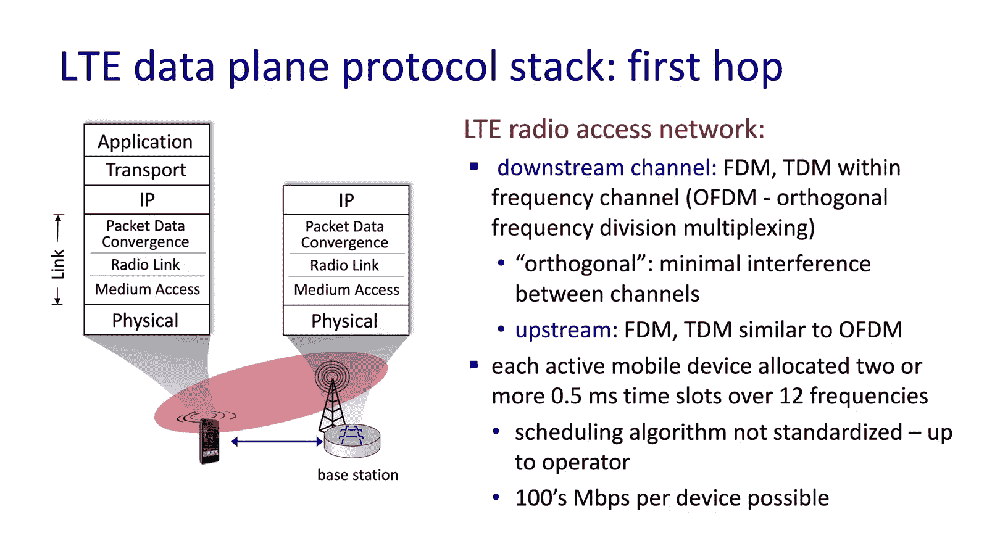

在共享无线信道内，每个设备被分配两个或多个半毫秒时隙，分布在12个频率上。因此，无线电不断在频率之间跳变，以在这些半毫秒时隙上发送数据。如果您还记得我们之前看到的调度算法，最简单的当然是**先进先出**，但在实践中，运营商可能会区分服务类别，并优先处理某些类型的数据。

---

## 隧道协议与移动性

在网络的**分组核心网**一侧，我们有启用隧道所需的协议栈。因此，虽然我们的链路技术将是运行IP的传统有线链路，但我们还会看到一个**UDP层**和一个**隧道协议层**。因此，我们从用户设备获得的任何数据（例如，一个HTTP over TCP over IP的数据包）现在将被封装在这个隧道协议内部。

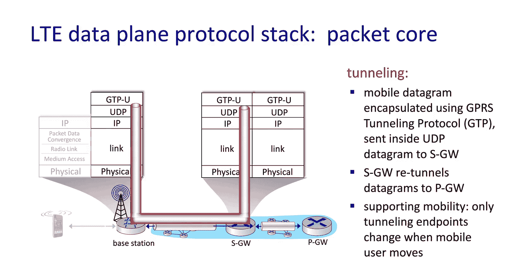

隧道随后到达服务网关。服务网关将其解封装，但将其放入一个新的隧道中以到达分组数据网络网关。这种隧道架构的好处是，用户设备在移动时可以保留其IP地址，因为隧道内部的子网独立于隧道所经过的子网。

---

## 与基站关联的过程

现在让我们看看与基站关联的过程。我们的用户设备出现时，可能会听到来自多个基站的无线电数据包，并请求与信号最强的那个关联。所有基站每5毫秒传输一次同步信号。如果您还记得，这个链路层的一部分是时分复用，这要求使用信道的所有设备的时钟之间紧密同步。

移动设备读取这个同步信号（包括来自多个基站的同步信号），并从中了解它应该使用的无线电配置，包括信道带宽、基站所属的运营商以及其他配置信息。最后一步，设备选择一个基站进行连接。虽然在其他条件相同的情况下，它更愿意连接到最强的信号，但它可能更愿意连接到归属运营商，即使来自不同运营商的信号更强。这是因为运营商通常在不需向第三方支付其用户数据传输费用时能赚取更多利润。

请注意，这只是与基站的关联。完全启用连接还需要身份验证以及通过网络核心建立数据平面。

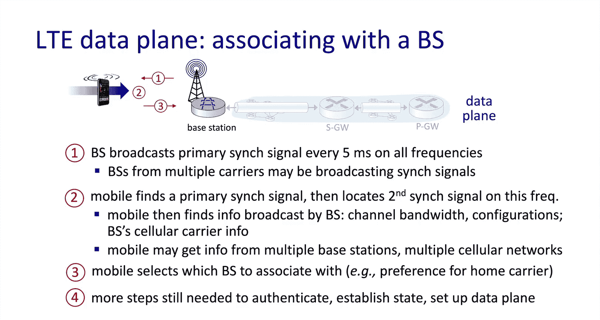

---

## 电源管理

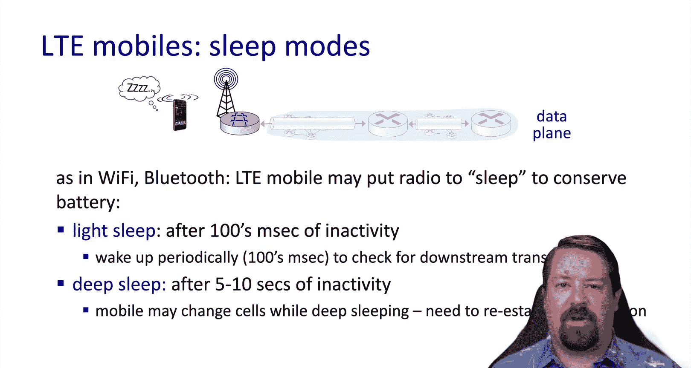

正如我们讨论Wi-Fi和蓝牙时提到的，电源管理是这些协议的重要组成部分。因此，移动设备也支持睡眠模式的概念。当处于**轻度睡眠模式**时，它大约每100毫秒唤醒一次，并与基站检查是否有需要接收的帧。但它也可以进入**深度睡眠模式**，在这种模式下，它一次可以很多秒不接受流量。

---

## 运营商间互联

如前所述，移动无线网络是不同提供商的集合。因此，这些提供商之间的对等互联与互联网的ISP非常相似，在互联网交换点使用IP互连。同样，这与4G之前的版本处理方式不同，那时有专门的语音服务互连。

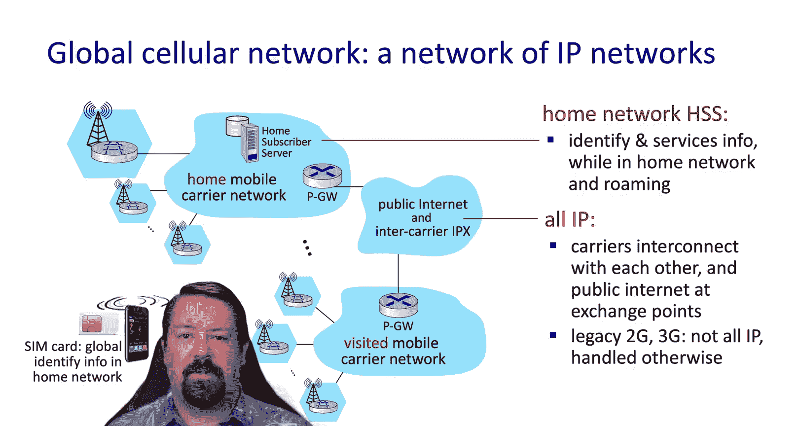

SIM卡上的IMSI号码是全球唯一的标识符。因此，无论该设备连接到哪个网络，他们都可以查找该特定IMSI号码的归属网络。被访问的移动运营商网络随后会与归属网络核对，以了解他们能够为支持该用户向归属网络收取哪些服务费用。

---

## 迈向5G

如今，我们开始看到5G的部署。让我们看看有什么不同。这里有一个显著的目标是增加带宽。然而，我们应该注意到，4G从未广泛地向用户提供其能够达到的带宽。即使4G能够达到数百兆比特每秒，用户体验通常只有个位数或几十兆比特每秒。因此，4G协议并不是向用户提供带宽的限制因素。

然而，转向5G的真正动机是能够在密集区域支持更多的移动设备，这意味着对多用户同时接入的支持得到了显著改善。5G还有两个新频段获得批准。我们注意到，这些频段（至少在高端）比过去通常使用的频率要高得多。这意味着它们的传播距离不会那么远，因此5G的小区在地理上会更小。然而，这在人口非常密集的地区是一个优势，因为它允许更大的频率复用。

这些更小的小区可能被称为**微微小区**，直径在几十或几百米。这意味着服务提供商将需要部署大量新的小区，这与基于大型塔楼、拥有相对较少小区的旧模式有显著不同。

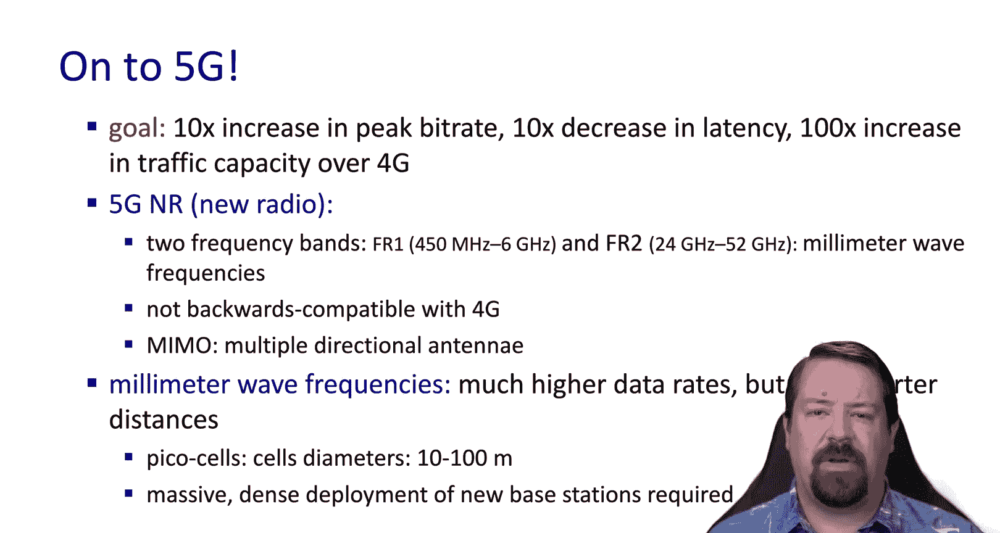

---

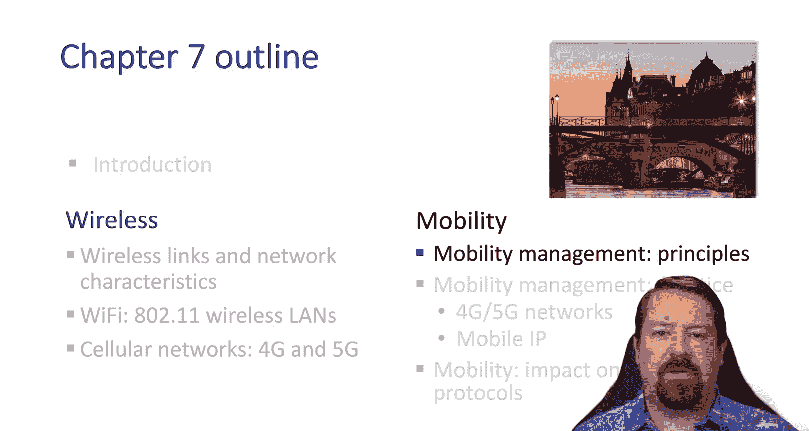

## 总结

本节课中，我们一起学习了蜂窝4G和5G网络的工作原理。我们探讨了其整体架构、核心组件（如UE、基站、分组核心网、HSS、MME和网关），并理解了控制平面与数据平面的分离、隧道协议的作用以及移动性管理的关键概念。我们还了解了与基站关联的过程、电源管理的重要性、运营商间漫游机制，以及5G在支持高密度设备和采用新频段方面带来的主要变化。下一节，我们将深入探讨移动性管理的更多细节，包括其在蜂窝网络和移动IP网络中的应用。