# Jim Kurose《计算机网络：自顶向下的方法｜Computer Networking： A Top-Down Approach》中英（deepseek p54 -54-How Mobile IP Works - Wireless Networks -BV1UMtueiEaA_p54-

In this video we look at how mobility is handled in IP networks。

 including both cellular 4G and 5G networks， as well as mobile IP。Let's get started。

We just got done talking about cellular networks from an architectural standpoint。

 and now we want to look at the specifics of how mobility is handled。

 both in that environment and in the mobile IP environment。As we've mentioned throughout the class。

 packet network protocols were designed around wired networks before mobility was really a consideration。

 and so mobility has always been a challenge in these environments and requires dedicated techniques to handle it。

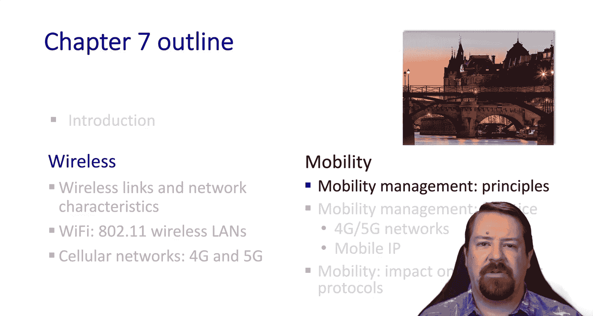

We should start off by defining what we mean by mobility in this context。From a network perspective。

 we have no mobility at one end， and this is where if a device were to move at all。

 it would have to be shut off in between moves and basically starts from square one when connecting to a new network。

So the network doesn't have to handle mobility， it just has to handle a device leaving in one place and a device connecting in a different place。

We then have localized measures of mobility， for example。

 moving around your house while connected to WiF。You're still connected to the same access point so nothing really changed with that one link。

 it just allowed you to move around in an untethered fashion。

 but you're connected to the same point in the network this would be analogous to roaming around with a cellular device while still connected to the same base station。

So in this case， the only mobility support provided by the network is the wireless link in that it's untetherered。

 but there's no other topology change going on on the fly then we have the scenario where the device actually moves from one access point to another。

 but within the same company network or La if you will。

So this would be like having two access points within your house or business and seamlessly switching from one to the other。

 or in the mobile wireless environment， moving from one cell to another while still being served by the same provider。

Then on the high mobility end of the scale we have the device moving from one provider's network to another with active connections remember thinking all the way back to our network sockets。

 part of the socket is the IP address to which it's connected。So if your IP address changes。

 all ongoing Socket based connections are broken。So what we're really saying with this mobility is that a device moves from one provider to another while keeping its same IP address and with packets being able to be routed from their old location to the new location without significant destruction。

So we already have a pretty good understanding of how a device detches or reattaches to a network and how it can move around while connected to one access point so we're really looking at things to the right end of the scale。

Including handoff between base stations and handoff from one provider to another。

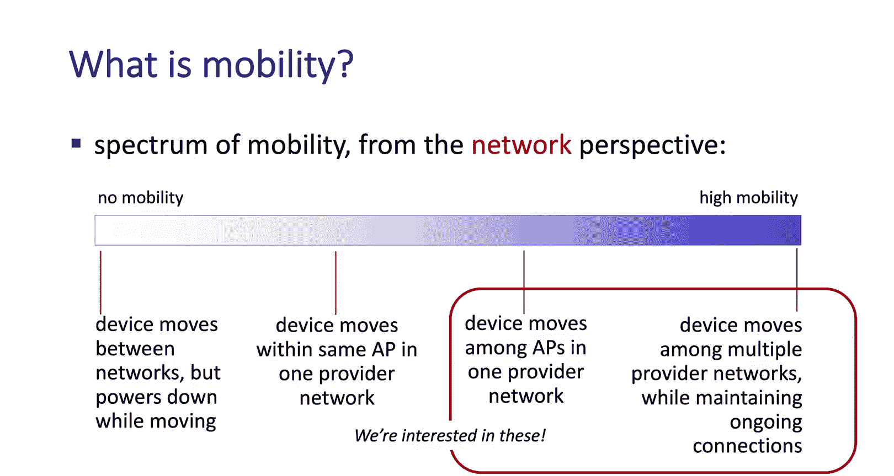

We have different potential approaches to do this。One would be that we just let the existing IP routing handle it。

 meaning if your IP address moves to new place， that new network just accepts it and starts advertising a path to your individual IP address。

And all the infrastructure is there to do it， there's nothing to stop us from advertising a single IP address in the routing table technically。

What does stop us is the issue of scale。The internet currently supports on the order of hundreds of thousands of routes。

Moving this to the order of billions of devices would create a huge load on the core of the internet。

 which it's not designed to support so from a practical standpoint。

 letting the network handle it with existing IP routing protocols is not the way to go So what can we do at the edge effectively this means creating an overlay over the network where the communication always goes to the home network and then is forwarded out to the visited network。

 so when the device moves to a new network it gets an address associated with that visited network and then the home network is updated to know about this new address。

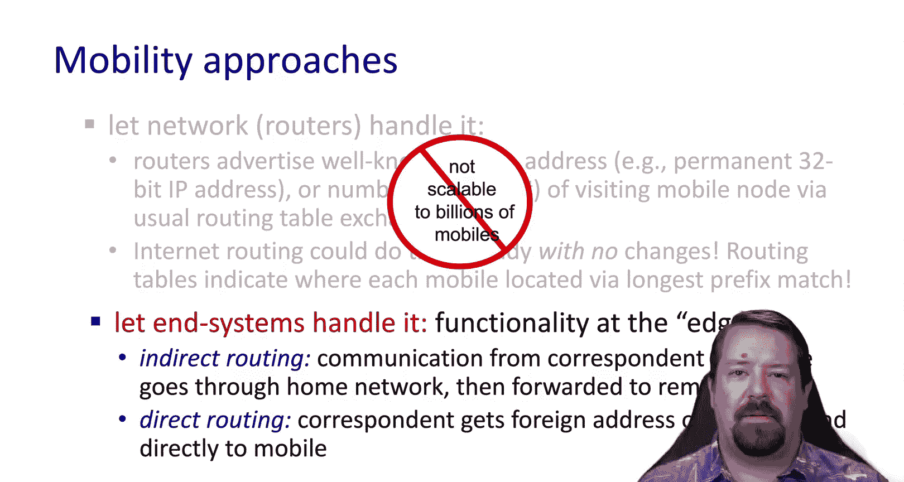

We can relate this to the social network problem of being out of touch with a friend for a while and then you find out that they've moved。

or that they travel frequently and the first two options we're showing here。

 searching all the phone books or expecting the friend to always let you and all their other friends know every time they move。

 don't scale very well。But the last two options are more analogous to what we're talking about here。

There's a notion of home or relatives in this case that can be contacted to update you about the friend's location。

The idea that we take from this is that somewhere there is a authoritative or definitive source of the information about you or in the mobile networks case about the device。

 and that that source of information will get updated if there's any change。

 and then there's a way to find that information by other parties。

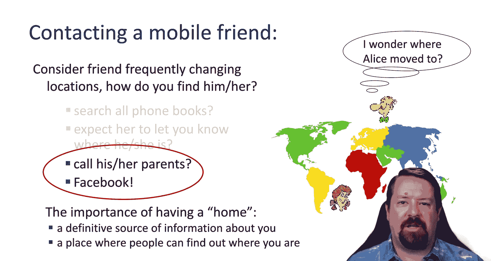

Going back to our cellular network example。We have the Home network and the visited network that are connected to internet exchange points。

Our mobile user equipment has a service plan with some subscriber that maintains the information about that user。

 however at this point in time the device isn't in range of the home network and it's actually connected to the visited network。

But using the MZ number， the visited network is able to look up the information about that subscriber via the home network。

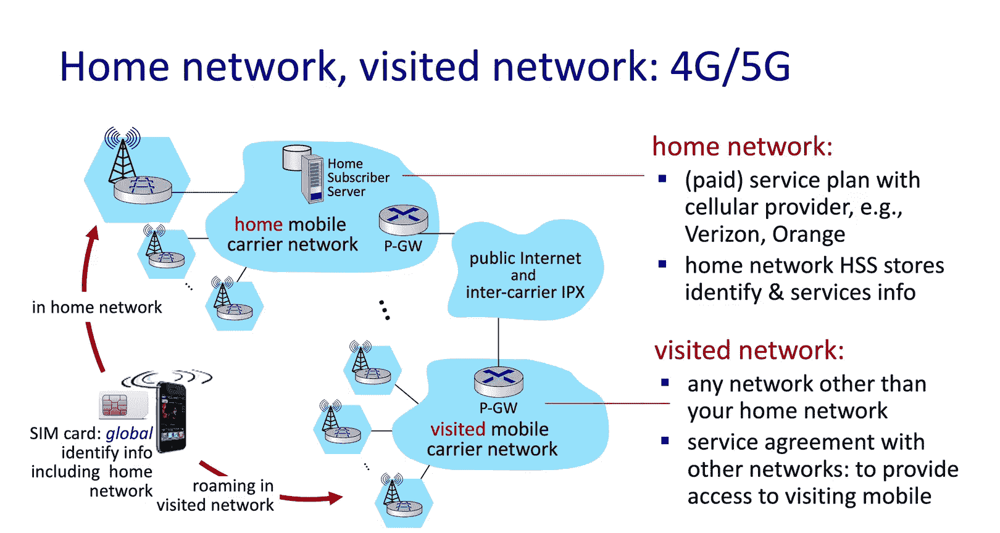

In contrast， with WiF or with your home ISP。We don't have this strong notion of home。

If your device connects to an ISP somewhere else， it's no longer using your home service plan。

 it's using the service plan at that location。So traditional fixed wireless broadband service providers are very location oriented they provide service to your home address or your business。

 but that service doesn't follow you around if you connect to other networks。

So if you were to connect to a different network， you have different credentials。

 a different service plan， etc。In a little bit， we'll see information about mobile IP。

 which is designed to enable this sort of roaming behavior directly over IP。

 but in practice it doesn't get used nearly to the extent that cellular data networks are used。

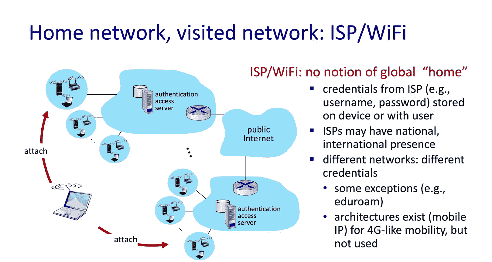

So we can generalize this home network and visited network concept and look at an example with some addresses so we have these three networks all connected via the public internet。

 each of these has a unique/ 16 and one of them has the home information for this particular user however this device connects to the visited network and in that network it gets a temporary IP and supplies its MZ number。

So enabling this device to communicate via the home network will involve both the Home subscriber server and the mobilitybiia manager of both networks。

Somewhere out on the internet is a correspondent， meaning the device that needs to talk to this mobile subscriber。

And it doesn't really matter which device initiated the connection。

 as we know most applications operate over TCP， which requires the bidirectional flow of packets。

So in order for this to work， the mobile device must register back to the home network through the visited network。

As part of the association process， the mobile device will communicate with the mobility Manager of the visited network。

 and the Mo manager will let the home network know that the device is now connected to this visiting network。

 so now both the home network and the visiting network know about the device's new location。

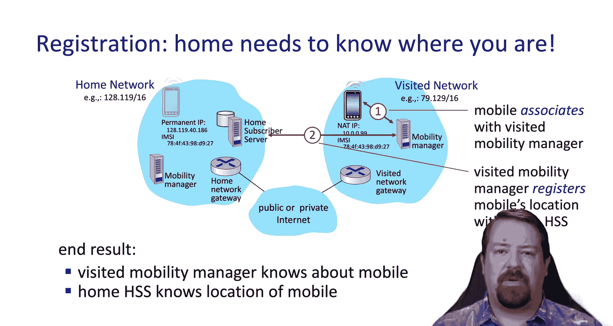

The correspondent， however， only knows the home IP information for this subscriber。

 and so when a packet is sent back to the address in the home network。

The home network needs to forward that on to the visiting network to be forwarded to the subscriber。

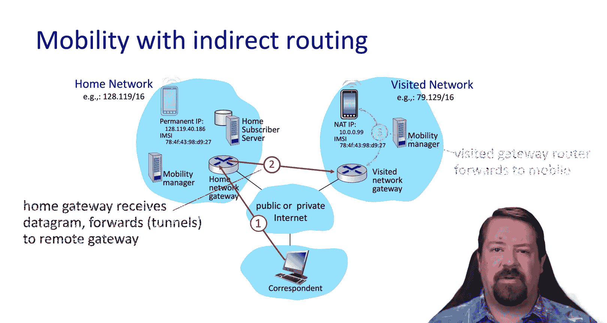

Traffic back from the mobile device to the correspondent conceptually could be sent directly to the correspondent。

 however， most applications will't understand this because it would then come from a different IP address than the one that's expected。

So typically the return traffic will go back to the home network and then be forwarded from there to the correspondent。

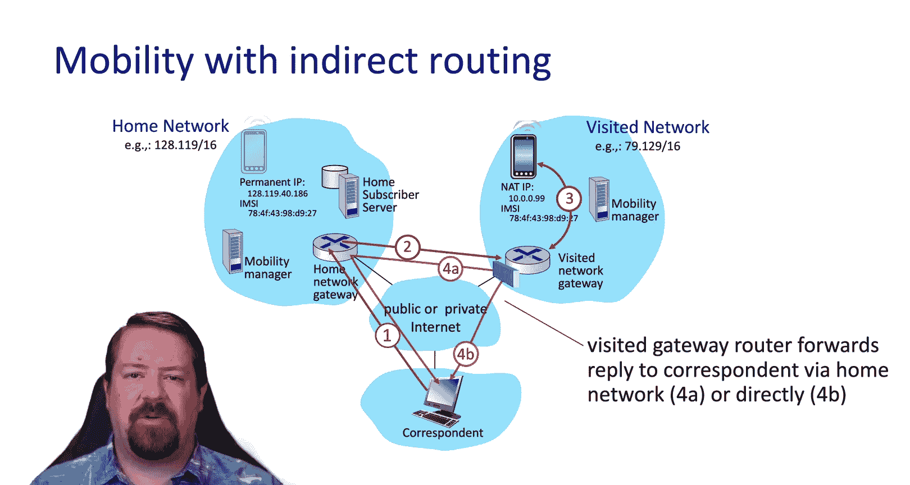

So the benefit to this is that the IP address of the mobile device doesn't change。

 so it's able to maintain these connections as it moves from network to network。However。

 there's an inefficiency in that the traffic always has to go to the home network。

 which could greatly increase the path length for the traffic。

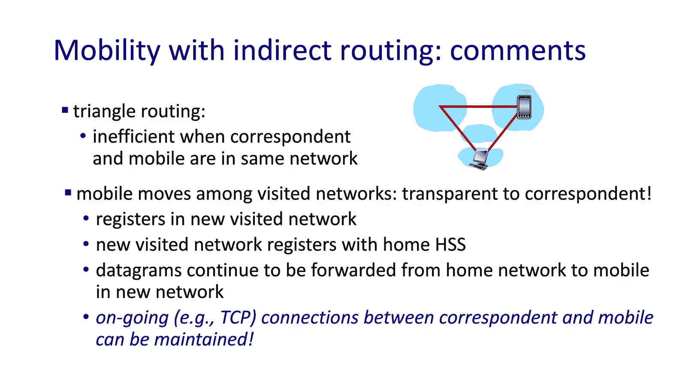

An alternative to this is using direct routing with mobility。In this case。

 when the correspondent talks to the home network， the home network tells the correspondent here's the new address。

 and so then it's up to the correspondent to reattempt the connection and talk to the visited network。

Then the visited network passes the traffic on to the mobile device。

 and so subsequent communication can be directly between the correspondent and the mobile device through the visited network without having the routing triangle through the home network。

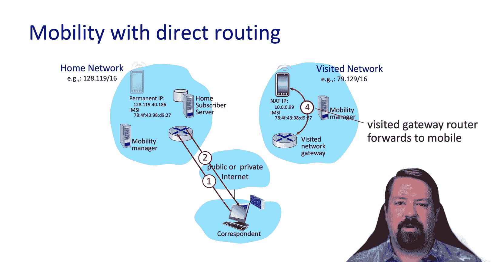

So the advantage to this is the direct path for the traffic。

 not having to pass through the home network for all the data。

 however many applications won't understand this process。

 and so it's limited to specialized applications that have some notion of this handling of mobility。

 there's also a problem of handling changes while the connection is in place so if the mobile device changes networks yet again while the connection is established。

That will also need a mechanism for handling without breaking the connection。

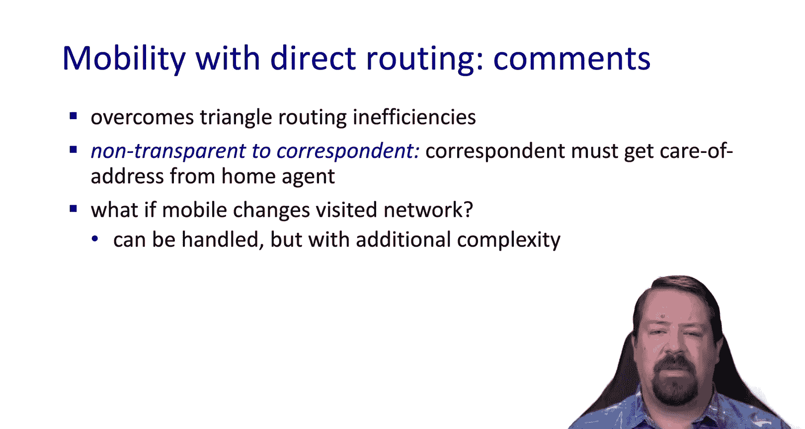

So we talked about a few different options for handling mobility and packet networks。

And now we'll see how they're deployed in a couple real systems， both cellular and Mo IP。

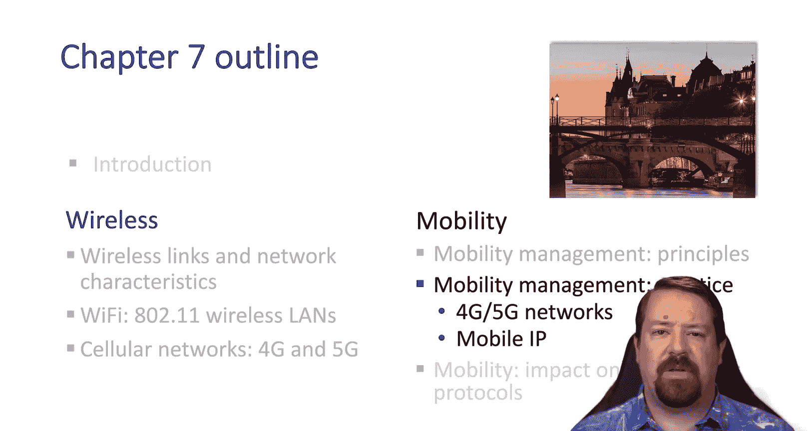

In the 4G networks， the mobile device associates with the base station as we saw in the last video。

 and during that association it supplies its IsZ number to the visited network。

 the visited network then talks to the Home subscriber server and lets it know where this device is now。

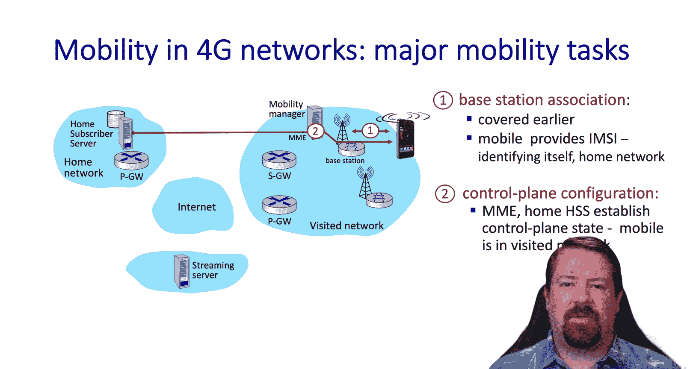

And then the mobilityity manager can establish the tunnels that we talked about in the last video to get date traffic between the mobile device and the home network。

The networks also support handover where the device can move from one attachment point to another。

 and the tunnel will be forwarded appropriately。

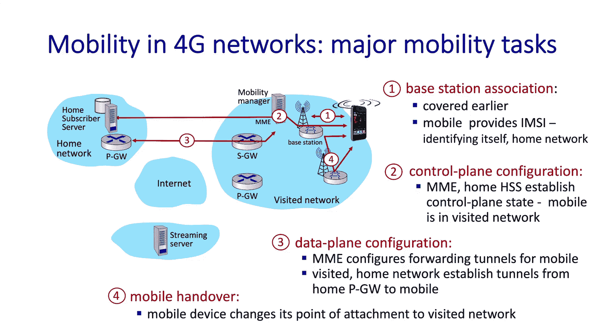

On the control plane side。There is a basetation control plane channel that a device can use to communicate with the mobility manager。

 and this is how it gets its MZ number to the mobility manager。

 which the mobility manager then uses to contact the home network and retrieve things like authentication。

 showing that it has active service and encryption keys。

Between the base station and the mobile device， parameters are selected for the radio link。

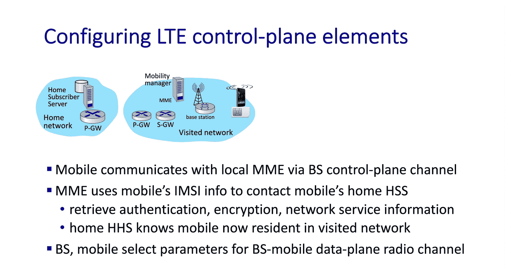

Serving Gateway then needs to establish a tunnel with a base station。

And so when the mobile device changes its connection point， the device's IP does not change。

 but the endpoint of the tunnel changes to the new router。

Then the serving gateway also establishes a tunnel back to the packet gateway of the home network。

 and so this follows the pattern of the indirect routing that we saw a few slides back。

The mobile's application over most likely TCP over IP packet is then encapsulated inside the tunnel。

 which is inside a UDP packet inside an IP packet。So you have significant nesting of protocols。

 which affects things like the MTU that we saw in previous chapters。

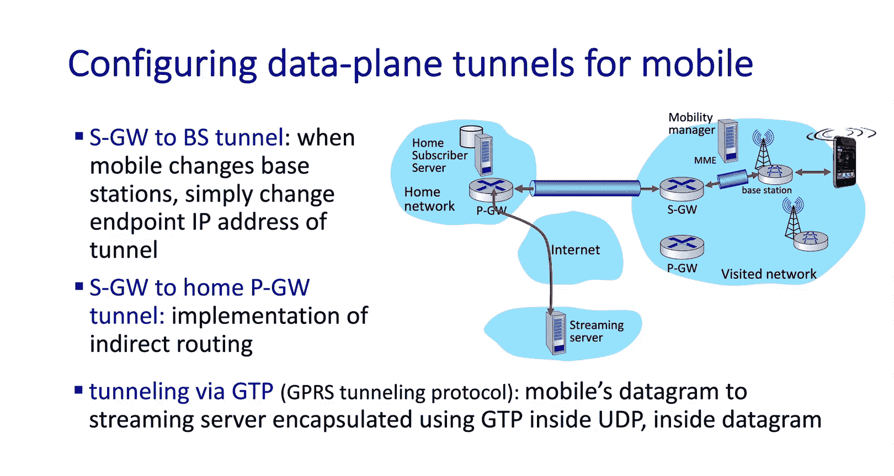

Though we just said that handover between base stations can happen。

 let's see what's involved in that process。Our original data path went from the device to the source Space station through the tunnel to the serving gateway。

And after the handover， the device is going to be talking to the target base station through the tunnel to the serving gateway。

At the link layer， the device's radio is talking to the base station and in reality it's receiving signal from multiple base stations all this time。

 so it already has some level of communication with the target base station before the handover happens Now one important thing to note is that the handset doesn't decide when to hand off to the new base station it's told the handoff by the source base station。

Before this happens， the source base station sends a handover request to the targetet base station。

The target base station can then allocate the slots in the TM radio scheme。

And it responds back to the source Space station to pass this information along to the handset。

The source base station tells the mobile device about the new settings for the new base station and the handset can then communicate with the new base station。

 so at this point the source base station starts forwarding traffic to the new base station and the mobile device communicates with the new base station so things are done from the handset perspective。

 however in the core of the network， the new base station has to communicate with the mobility manager so that the mobility manager can change the tunnel configuration on the serving gateway。

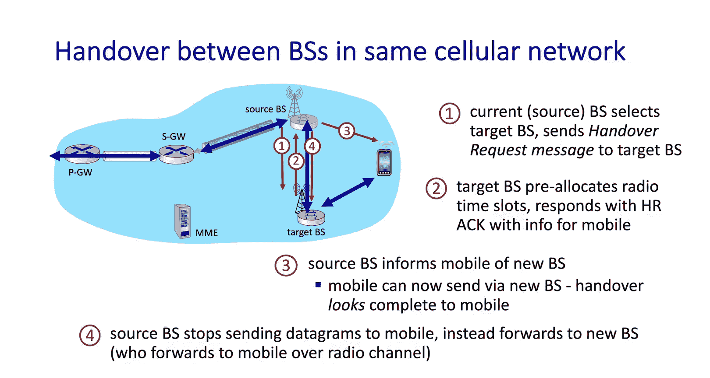

Once that's complete， then packets can flow directly between the serving gateway and the Target Bay station。

And now finally the source SpaceStation can release the resources and be out of the loop。

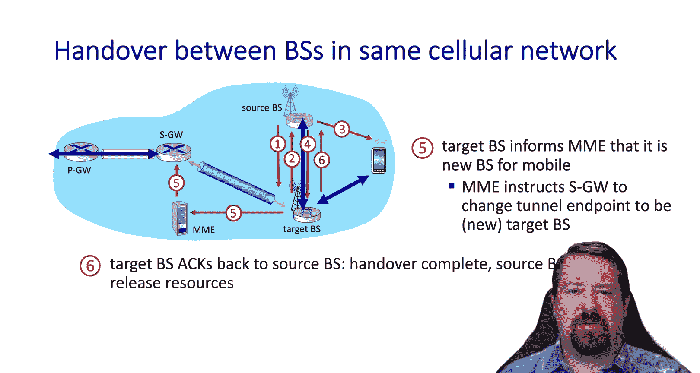

Significantly predating 4G， we had the mobile IP architecture。

The idea was to allow mobile IP devices to roam from one wireless access point to another while keeping their same IP address。

And the architecture established here is similar to what was later adopted in the 4G scenario。

 however we see a some difference in terminology so in mobile IP we refer to the home agent and the foreign agent there is still this strong sense of a home network and a visited network but we call that visited network。

 the foreign network and the service running on that network to support mobile IP is the foreign agent the signaling to register the new visited location is handled through a particular ICMP messages。

So historically， the mobile IP architecture had a significant impact on how cellular networks operate today。

 however， Mole IP never took off as a service on its own， and there's a variety of reasons for this。

 some of which is a chicken and egg problem， so one organization deploying mobile IP doesn't benefit it until numerous other organizations also deploying mobile IP。

 and then there needs to be some business model that determines how revenue will be generated through deploying these services。

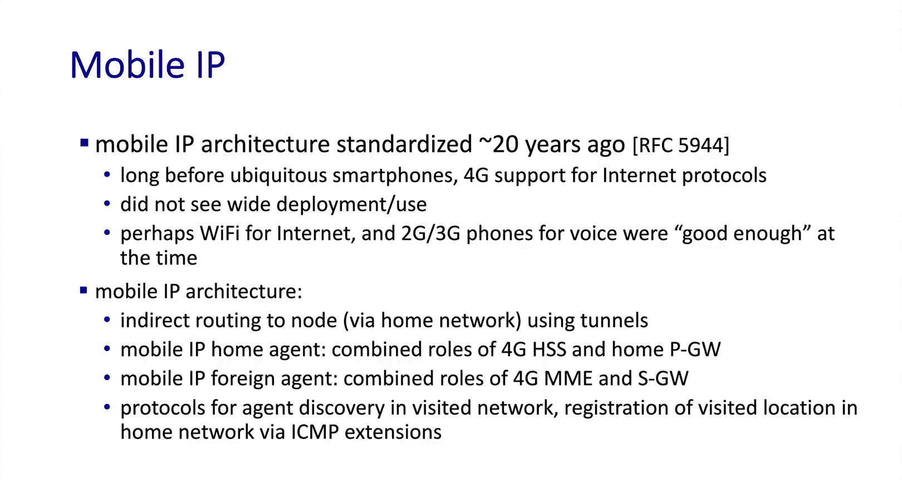

And that just never all came together from ObP。Let's look at some of the considerations that mobility imposes on other layers of the protocol stack that we've talked about previously。

As we've stated， the technical goal of mobile IP is to enable the device to move around while retaining the same IP address。

 which allows it to maintain its established communication flows， however， in practice。

 theres potential for packets to be lost or reordered in this process of handing off from one location to another。

 and as we know TCP is very sensitive to lost packets in that any time a packet is lost it assumes there's congestion and so it throttles its sending rate by 50% there's also the issue of delays if the service being provided as a realtime service such as a voice call or video call added delays to packets as the handoff occurs may be noticeable in the quality of the call。

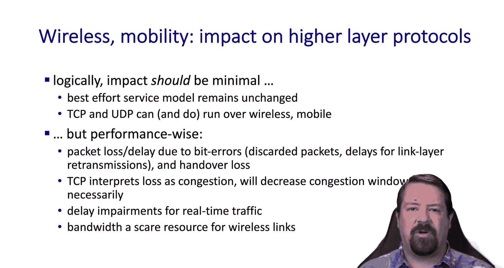

That brings us to the end of chapter 7。We've discussed the properties of wireless links and how that presents challenges to networking protocols。

And we focused on two primary areas of technology， the 80211 wireless LA technologies or wireless Ethernet。

 as well as cellular 4G and 5G networks。To understand how these work。

 we've looked at specifics of handling mobility， and in general。

 this principle of a home network and a visited network that enable a remote user to locate and communicate with a mobile device even as it roams from network to network。

That's it for this video in Chapt 8 we'll be looking at issues of network security See you then we hope you enjoyed this video if you found it to be useful please click the like button to be notified when more videos are posted for this class。

 please subscribe to our channel and click the bell。

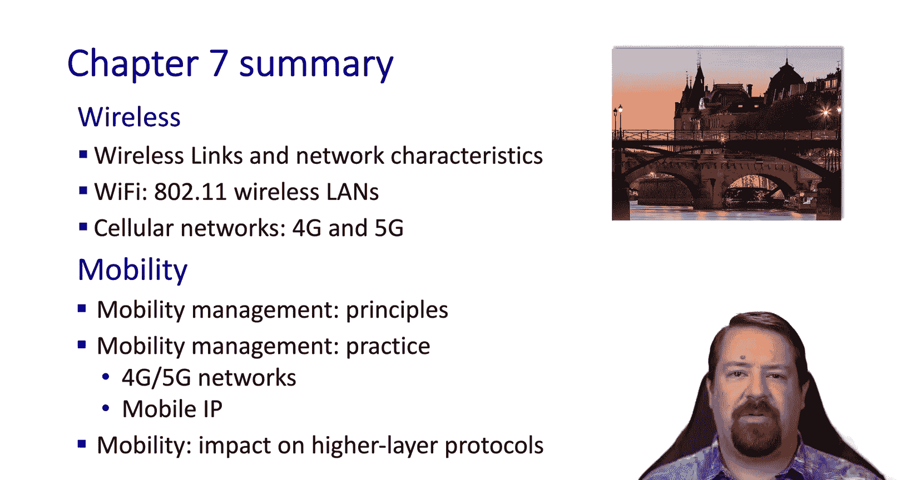