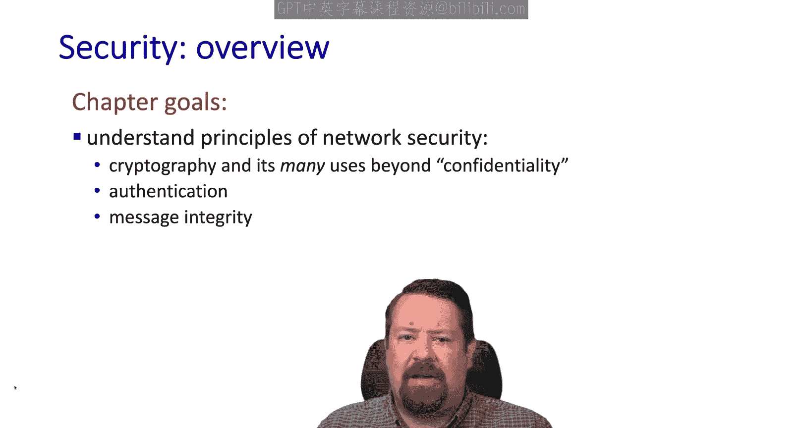
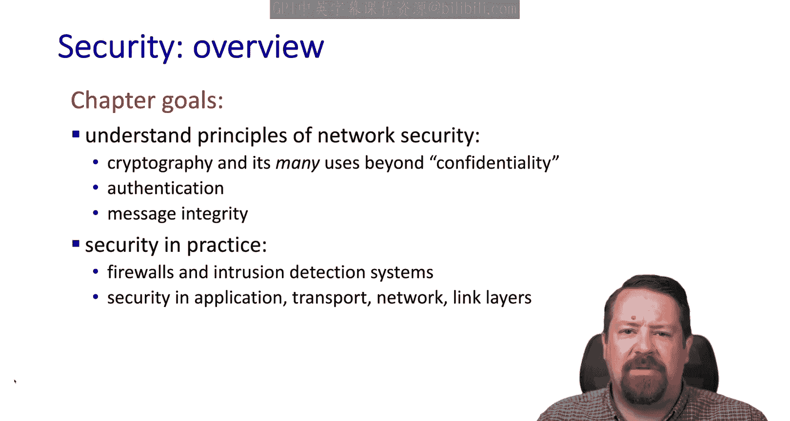
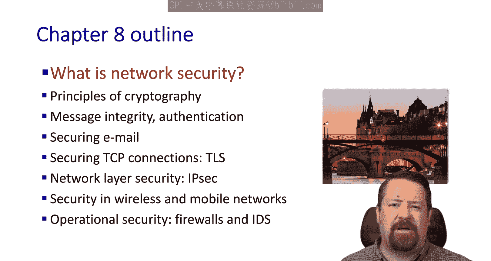
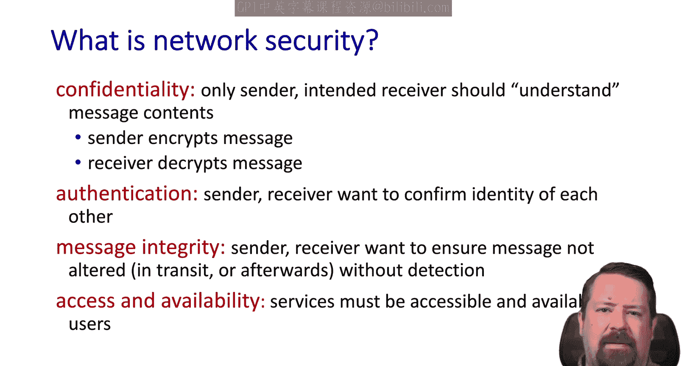
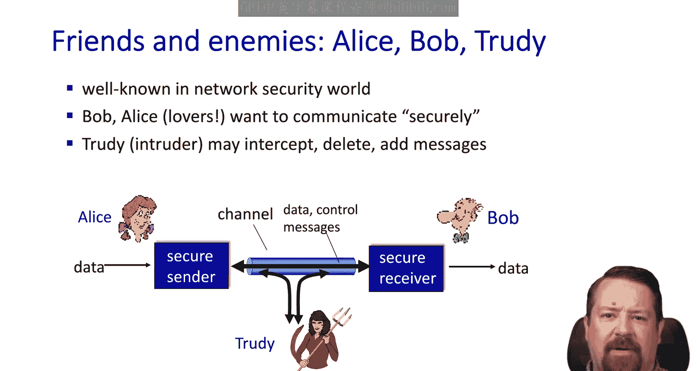
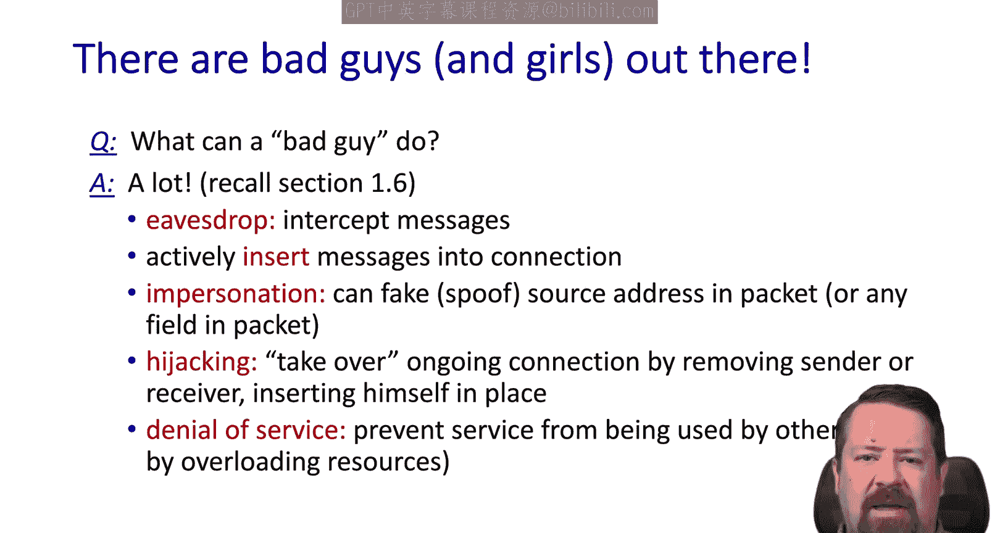
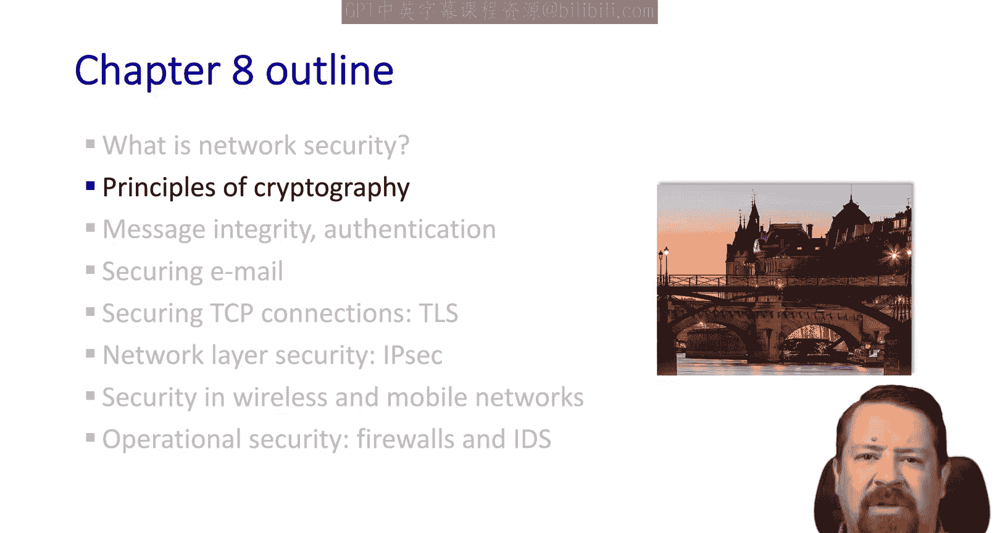

# 计算机网络：自顶向下的方法：第8章：什么是网络安全？ 🔐

在本节课中，我们将探讨“什么是网络安全？”这个问题。我们将明确网络安全与其他类型系统安全（如密码学）的区别，并概述本章将要学习的核心概念。

## 概述

欢迎回来。今天我们将讨论网络安全。我们将区分网络安全与系统安全或密码学等专门领域的不同之处。

在深入第8章的具体主题之前，我们需要明确“网络安全”的范畴。我们选择的是那些**网络环境**在系统安全实现中扮演重要角色的特定主题。构建一个安全的系统涉及许多其他方面，包括物理安全、密码学细节、应用设计、系统架构本身（避免单点故障），以及列举所有可能构成威胁模型的不同攻击类型和挑战。

因此，本章不仅聚焦于网络安全，而且只关注最常用的网络安全方面。Kurose和Ross的章节未涉及一些更高级的主题，例如无线网络安全，这些可能在后续视频中讨论。

## 本章内容概览

以下是本章将要学习的主要主题。

首先，我们将概述密码学。需要指出的是，网络领域本质上是密码学领域的“客户”。有专家负责设计和标准化密码协议，然后网络协议去实现这些密码标准。因此，我们不会深究密码学背后的数学细节，而是关注如何在网络环境中使用密码学。

接着，我们将学习**认证**和**消息完整性**。请注意，消息完整性意味着消息在传输过程中不能被篡改，且接收方能发现篡改。消息完整性并不保证第三方无法读取消息。

在理解这些基础知识后，我们将继续研究网络协议和应用的具体实例，看它们如何实现这些安全原语。

在本视频的剩余部分，我们将只介绍网络安全的基本含义。

## 网络安全的基本目标

当我们谈论安全时，首先想到的可能是**机密性**。这意味着第三方不应能够读取发送的消息，只有发送方和接收方应知道消息内容。这是通过在发送方加密消息，在接收方解密消息来实现的。其思维模型是：在发送端有意义的比特流，被“打乱”成对可能正在监听线路的第三方毫无意义的形式，然后在接收端逆转此过程。

然而，我们必须注意，为了实现这一点，发送方和接收方之间必须有一个共享的秘密，即**加密密钥**。网络协议通常容易出问题的地方，正是在于如何以一种不会被第三方截获或削弱加密安全性的方式交换这个共享密钥。

第二个目标是**认证**。如果你熟悉AAA安全模型，认证就是第一个“A”。其核心思想是确认通信参与者（发送方或接收方）的身份。AAA安全模型中的另外两个“A”是**授权**和**计费**，这些概念我们今天不常思考，但在实践中一直使用。例如，从服务提供商的角度，他们希望认证用户是支付服务费用的人，然后通过授权检查该用户有资格使用哪些服务，最后计费该实体使用了多少服务。

第三个常见的网络安全目标是**消息完整性**。我们可能不关心消息是否被第三方读取，但我们希望确保消息在到达接收方时确实是它应有的内容，并且没有人在途中未经我们发现就篡改了它。

我们还面临**访问和可用性**的问题。关键在于，安全机制必须对所有用户（包括非技术用户）可用，因此这些机制必须是无缝且自动化的，以便任何人都能从中受益。

## 实例分析

现在让我们看一些例子。假设我们有Alice、Bob和攻击者Trudy。Alice和Bob希望安全地相互通信，他们的“安全”定义是消息保密。

这里的攻击者Trudy可以在消息通过网络时截获、删除或添加消息。

当然，Alice和Bob不仅仅是名为Alice和Bob的真实人物，他们代表所有可能连接到网络的不同实体。一个非常常见的例子是**电子商务**，即进行购买、传输信用卡信息或其他形式电子支付的电子交易。如果第三方能够截获这些信息，他们可能会从用户那里进行经济盗窃。

另一个例子是**网上银行**，用户的私人财务信息通过网络传输，暴露这些细节也可能导致用户经济损失。

另一个可能未得到足够重视的应用是**DNS服务器**。虽然许多人都熟悉与网站通信时需要端到端加密，并在浏览器中寻找绿色的HTTPS或锁图标，但他们没有意识到，在建立连接之前，他们的计算机会发送一个针对该特定网站的DNS请求，而这个DNS请求是明文发送的。正如我们在DNS协议中看到的，它不提供任何安全性。因此，不仅他们的ISP和路径上任何关注的人都知道他们打算访问哪个网站，甚至答案也可能被更改。恶意攻击者可以重写DNS回复，将用户引导到与DNS服务器实际提供的IP地址不同的地址。这是一个巨大的漏洞。我们确实有DNSSEC协议，但它远不如HTTPS那样被广泛使用。

另一个例子可能是使用BGP交换路由表更新的路由器。同样，如果这些更新未加密，恶意攻击者可能能够更改它们，并以此方式劫持流量。

我们还可以想到许多其他例子，例如需要在不被检测到的情况下传递信息的举报人，或者需要能够在传输过程中不被篡改或读取消息的记者或其他社会正义行动者。当然，这样的例子不胜枚举。

## 威胁模型

我们一直在提及这些攻击者或“坏人”，但我们还没有真正说明我们的威胁模型是什么，即坏人能做什么？

答案是相当多的。最简单的大概是**窃听**，即截获并读取消息。更高级的能力是向连接中**插入消息**。除此之外，也许是**假冒**，即伪造源地址，使消息看起来来自并非真实的发送者。我们还可能想到**劫持**，即不仅仅是截获正在进行的连接通信，而是实际接管连接的一端并替换发送方或接收方。最后，还有**拒绝服务**。这里并非特指DDoS攻击，而是指任何阻止连接继续并实现其预期服务目标的行为。

## 总结

本节课中，我们一起学习了网络安全的基本定义及其核心目标：机密性、认证、消息完整性以及访问和可用性。我们还通过实例分析了不同场景下的安全需求，并初步探讨了攻击者可能构成的威胁模型。

这结束了我们简短的介绍。在下一个视频中，我们将探讨密码学的原理。