# Jim Kurose《计算机网络：自顶向下的方法｜Computer Networking： A Top-Down Approach》中英（deepseek p56 -56-Principles of Cryptography -BV1UMtueiEaA_p56-

Welcome back in this video we'll be discussing the principles of cryptography and we'll include in that discussion both symmetric key cryptography and public key cryptography。

We should note that the networking field is largely a consumer of existing cryptography algorithms。

 so we will not be discussing the mathematical background in corery detail。

 but rather how these schemes apply to networked environments Let's get started。

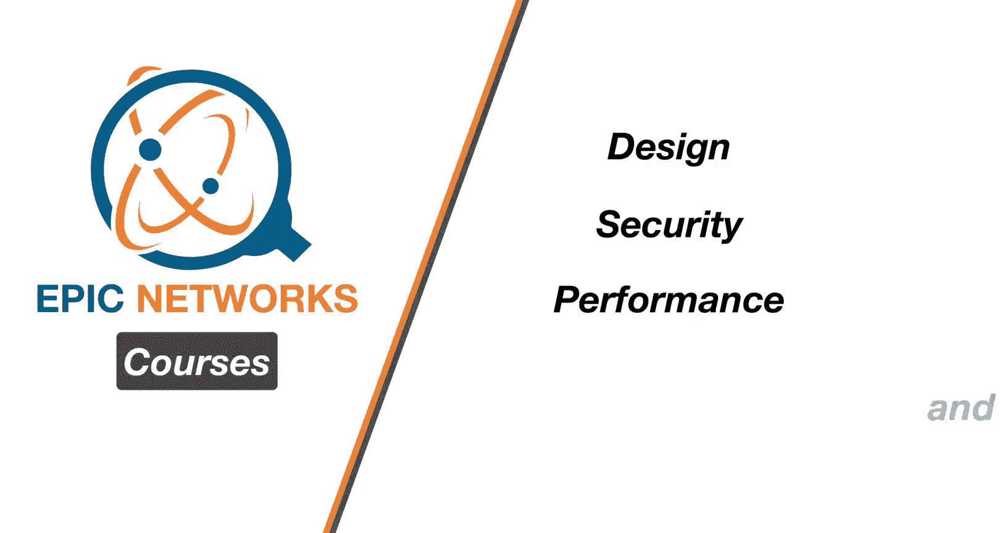

All right， welcome back， now we'll look at the principles of cryptography。

As we mentioned in the last talk， cryptography itself or cryptography algorithms is a separate field from network security。

And so network security is really a consumer of those algorithms。

And what we talk about is how we apply them in the network context。

 not the math behind how the algorithms work， but it is helpful to have some insight into how they work and what the differences might be that would cause us to choose one cryptography algorithm over another。

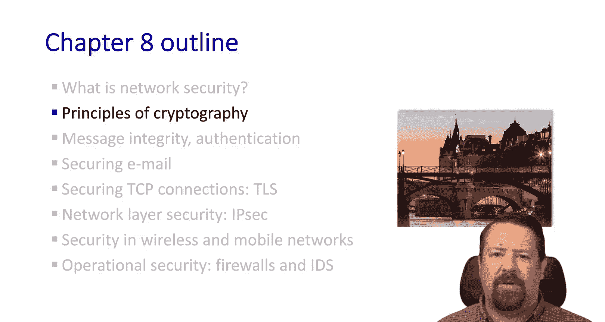

First， some common language that will help us talk about these systems。

So proceeding from left to right， we have our plain text。

So the original data that makes sense either to the user or to the program that created it。

 and this is run through the encryption algorithm， which is also supplied with an encryption key。

What is produced from the encryption algorithm is the ciphertext。

And we commonly represent the ciphertext with this case a of M meaning that M has been encrypted using the encryption key A。

When the Cyphertext reaches the decryption algorithm。The decryption key is applied。

And we'll call that Kb for Bob's key。And what should be produced then by the decion algorithm is the plain text。

And so the plain text should equal the ciphertext KA of M being processed using KB and producing M again。

 the original plain text message。We want the cphertext in the middle to have certain properties。

In particular， there shouldn't be any feature of the ciphertext that would make it easy for an attacker to guess what the original plain text was。

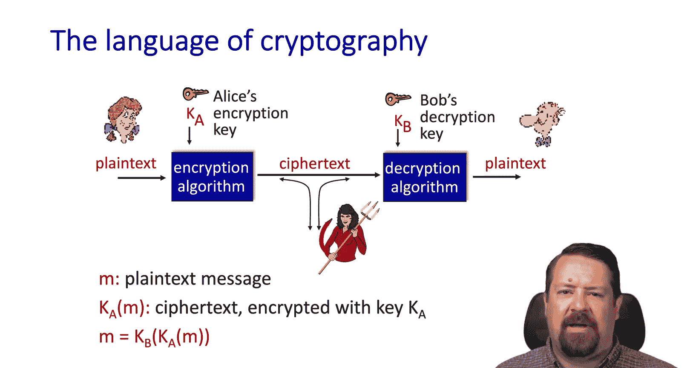

So let's look at the different approaches that an attacker might take。

We usually think of the Cyphertext only attack， meaning the attacker has been able to intercept the ciphertext and they now save that offline and can analyze it。

And they can then perform either a statistical analysis of the patterns in that cybertext or brute force attack。

 meaning try all possible keys。And if the encryption algorithm is ideal。

The statistical analysis won't produce anything useful。

 therefore it won't make it any easier than the brute force attack。However。

 for any properly designed encryption algorithm， the brute force attack will be very expensive in terms of time and processing。

 and so the attacker is going to look for some advantage that would reduce their search space。

One way to do this is to use a known plain text attack。Meaning even without knowing the key。

 if they can get both an exemplar plain text and the corresponding cipher textex。

Then they might be able to reverse engineer what key is being used。

A slightly more advantageventous option is the chosen Pla text attack。

Where Trudy can actually choose a message to be encrypted and have both a plain text and the cipher textex for that message。

And we want to note here that this is another place that network protocols may fail if they cause known strings to be encrypted。

Because they're part of a header， for example。Then this may give the attacker away to compromise encryption。

Even if the underlying algorithm used was perfectly secure。

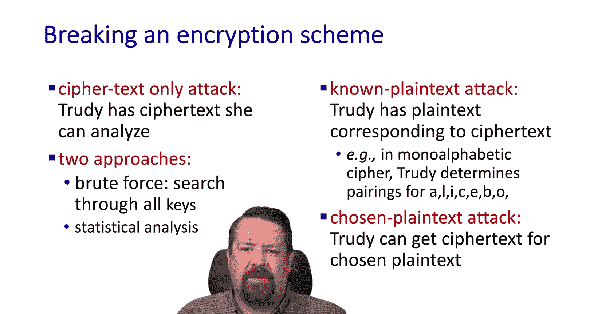

So now we're going to break things down a little further by differentiating between symmetric key cryptography and public key cryptography。

Both of which are used widely in network systems。First， we'll look at the symmetric key case。

Where the plain text comes in， it is encrypted with KS and the Cytex flows across and it is decrypted with the same key。

 so Alice and Bob share the same key for encrypting and decrypting。For example。

 the key could be knowing the substitution pattern in a mono alphabetic substitution cipher。

 and we'll show an example of the substitution cipher on the next slide。

So the problem there is how do Alice and Bob agree on the key value if they both need to have the same key？

And that's where the network protocols typically come in。

 but we have to note that there's a bootstrapping problem here。

Alice can't just send the key over to Bob because if she sends it encrypted。

 then Bob won't be able to know what the key is because you'll only have the cipher textex。

But if she sends it unencrypted， then anyone in the middle listening to the connection will also have the key。

 and that will defeat the purpose of encrypting the message。

 So the trick is the key exchange protocol， which we won't get to until later。

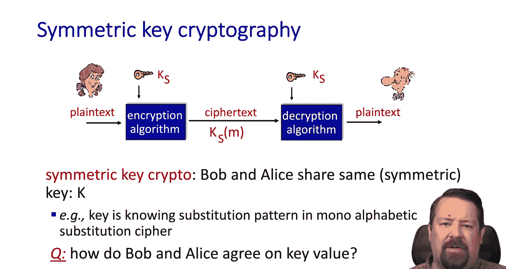

Here's our substitution cipher。We have a plain text， which is just the alphabet in this case。

 and our cipher text is taking each letter and substituting a different letter for it。

 and it's one to one， meaning each letter maps to a different letter。

 there is no duplicates because then our substitution cipher would not be reversible。

So if we then take this mapping， we can apply it to a sentence， remember。

 Alice and Bob are in a relationship， so Alice says Bob， I love you， signed to Alice。

And the ciphertex we look above， and we substitute the letters one at a times so B changes to n。

 O changes to K， etc。And so the ciphertext is sent across。And our encryption key is just the mapping。

 so the ciphertext of the alphabet is our encryption key。However。

 there are many problems with a substitution cipher。

 and this is an example where a statistical attack might be employed。For example。

 it's commonly known that certain letters in the English alphabet are used much more commonly than others。

And so if you do this frequency analysis you could figure out what the substitutions are for vowels in spaces。

 and once you find word boundaries， you can do analysis on the length of words and commonly used pronouns and adverbs and so on and so forth and so given enough cipher text。

 you can reverse engineer the substitution key So in practice we want something significantly more secure than this One approach might be to use multiple substitution ciphers and rotate through them。

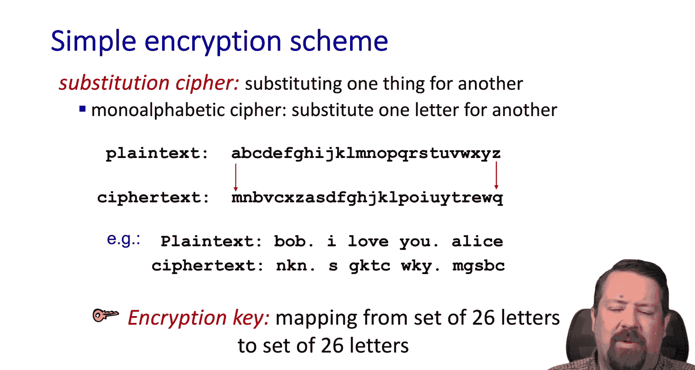

And so this prevents there from being enough ciphertext from each pattern to do the statistical analysis on it。

And the attacker wouldn't know both which substitution cyphers are used as well as what pattern is used to rotate them。

And so in this case， our encryption key is both the set of substitution ciphers as well as the pattern with which to rotate them。

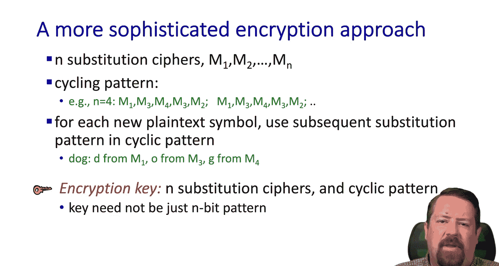

So a common symmetric key cryptography scheme is DES data encryptncion standard。

And it uses a 56 bit key， and the plain text input is in 64 bit chunks。

So each of those chunks or blocks is encrypted and there's a cipher block chain。However。

 we can see that this standard is quite old in terms of computing technology。And so at this point。

 DES can be decrypted in less than a day using brute force。However。

 it is secure in the sense that there's not a good analytic attack。

 it doesn't have statistical features that would allow the attacker to reverse it。

But because the brute force attack was relatively fast。

 DES was improved in practice by performing the encryption three times。

enncrypting the plain text to a ciphertext and then encrypting that ciphertext to new Cyphertext and repeating that one more time using three different keys。

And one significant advantage of this is when you have a ciphertext， it appears random。

 So if you are trying to brute force a ciphertext that is an encrypted ciphertext。

 it's not obvious when you've reversed it correctly because you still have a random output。

 So it's not just tripling the time to find the three keys。

 You have to try all combinations of three keys。 And so the search base becomes dramatically larger and more time consuming to brute force A nested encryption。

 More recently， we have Aes， the advanced encryption standard。

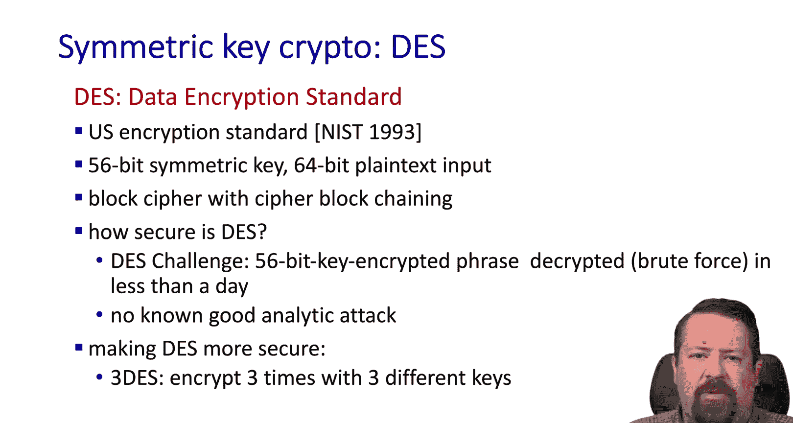

The practically speaking replaces DES in most systems today。

It uses a larger block size for efficiency and has a much larger key space。So with this scheme。

 a brute force descriptionption that would take one second on DES takes 149 trillion years for AES。

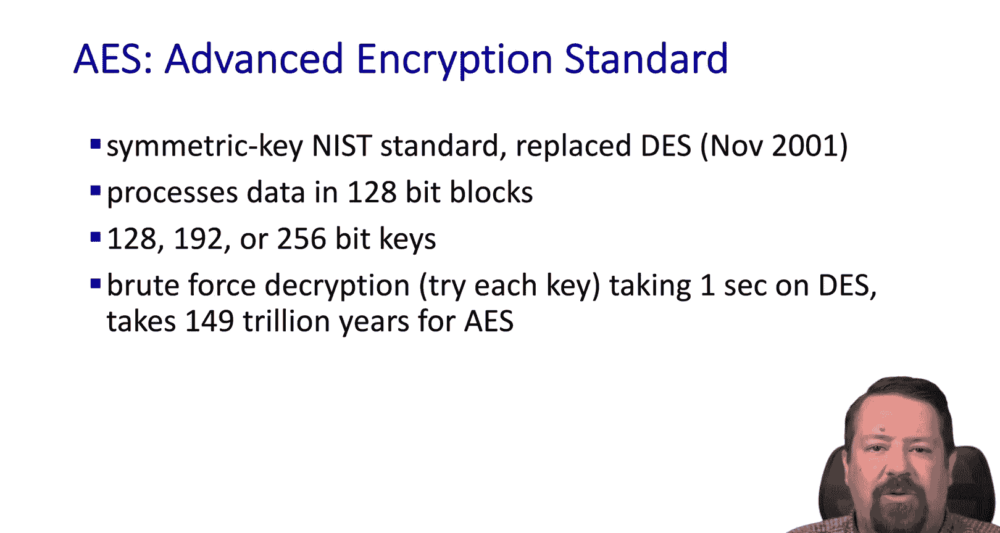

Now let's talk about an alternative approach to cryptography and that is public key cryptography。

And I want to note upfront that public key cryptography is not a replacement for symmetric key cryptography。

 they each have their place and their strengths and weaknesses。

 so we want to understand how they're different and where we would apply one or the other。As we said。

 symmetric key cryrypto requires the center and receiver to know this shared secret。

But we also said that these mechanisms have to be available to all users。

Most of which have not met one another before or have any out of band communication channel。

 so how do they agree on a key in the first place without sending something in plain text？

Public key cryptography takes a radically different approach in that the sender and receiver do not share a secret key。

The public encryption key is known to all， however。

 there is a private decryption key known only to the receiver。

So this means that anyone can encrypt a message and send it to the receiver。

But no one in the path will be able to decrypt the message because the decryption key is different from the encryption key。

And only the receiver knows their private decryption key。

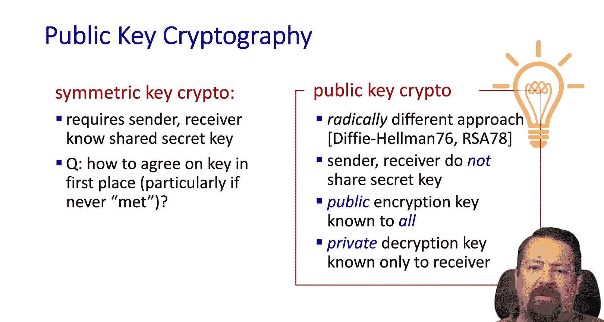

So now we have Alice and Bob， and Alice is sending her plain text message and the encryption algorithm input now is Bob's public key。

All right， so Alice needs to look up P's public key， but because that's public。

It could be on Bob's website or in some other database of public keys where anyone can find it and encrypt a message and send it to Bob。

So we now have this ciphertext that's the message encrypted using Bob's public key。

And then the input to the decryption algorithm is Bob's private key。

So we're using separate keys on each end of this connection。And the way the algorithm works out。

 the message that is encrypted by the public key and then processed by the private key yields the original plain text message。

So it's worth noting that for thousands of years， symmetric key encryption was the only known type of encryption。

 and this idea of public key cryptography is quite recent and revolutionary。

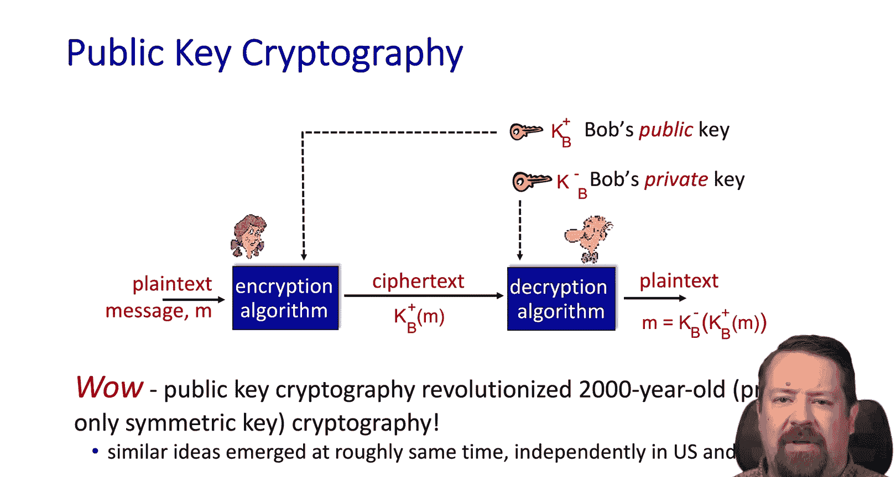

So in order for a public key encryption algorithm to work。

We need these matching keys are a key pair of public key and private key。

 such that what's encrypted with one can be decrypted by the other。

We also need to note that given a public key， it should be impossible to derive the private key。

 which sounds obvious， but it's important to note that it's a requirement for this algorithm to be successful。

So the most widely known algorithm for this is RSA。

 which is the initials of the authors of the original algorithm。

As a prerequisite to understanding RSA， we need to understand modular arithmetic。

This is often represented by the percent sign and programming languages。So x mod n。

Gives us the remainder。When x is divided by n。And modular arithmetic has some interesting properties。

 which are listed here and are useful for understanding the algorithm。But ultimately。

 what we want to show is that a mod n to the power D， all mod n。

Is the same as a of the power D mod n。And we see in our example， x mod  n is 4。

 if we raise4 to the power of 2 at 16， 16 mod 10 is 6。And that's the same as 14 raised the power 2。

 which is 196。196 mod 10 is also6。

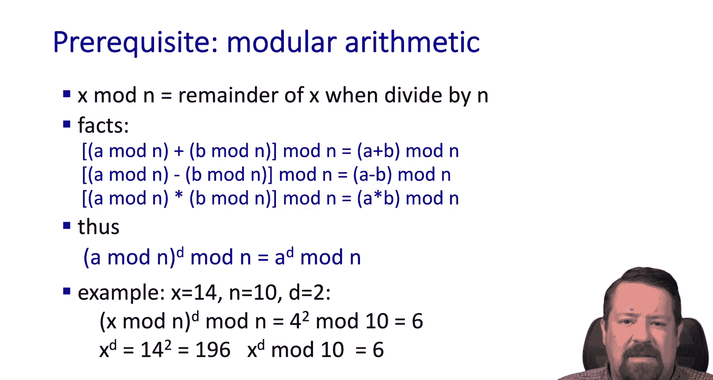

So from RSA's perspective， the message is just a bit pattern。

We've been talking about messages in terms of plain text because it's easier to understand and explain。

 however， it's important to note that these messages are just any sequence of bits that needs to be encrypted。

Any bit pattern can be uniquely represented by an inte number。

 and so encrypting a message is equivalent to encrypting a number。

 regardless of whether those bits represent letters or binary data or what have you。

So we have our bit pattern M， and it can also be represented by the decimal number 145。To encrypt M。

 we encrypt the corresponding number， which gives us the ciphertext。

So what we're really saying here is we encrypt a byte sequence and we get a new byte sequence。

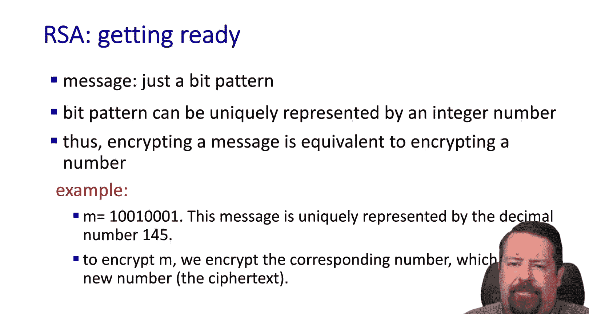

So in order to use our public key encryption algorithm。

 we have to create a public and private key pair， and these keys are derived from prime numbers。

So first we choose two large prime numbers。124 bits these days isn't even that large。

 you might use 2048 bits or 4096 bits。And then you need to compute N。

Which is the multiple of P and Q， right， our prime numbers are P and Q。

 we multiply those together we get N。And we also compute Z， which is p minus1 times Q minus1。

We then choose a value E， which is less than n and has no common factors with Z。

So E and Z are relatively prime。And then we choose a value D such that e times d minus1 is exactly divisible by z。

Which means that E D minus1 mod z would be 0 or E D mod z equals 1。 Once we have these values。

 our public key is the pair and E。And our private key is the pair and D。

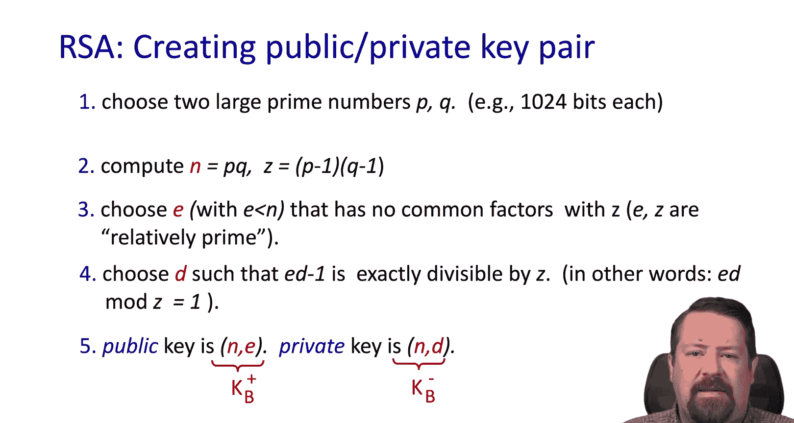

So how do we use these to perform encryption and decryption？

We assume that we have computed our values such that we have N， E and N D。

And so to computer cybertext， we take our message， which is our sequence of bytes。

 raise it to the power E mod N。And on the decryption side。

 we take our cipher text raises it to the power D and take that mod in and that's our original message。

In other words， M equals m to the E mod n al of the power D， which is our value C。

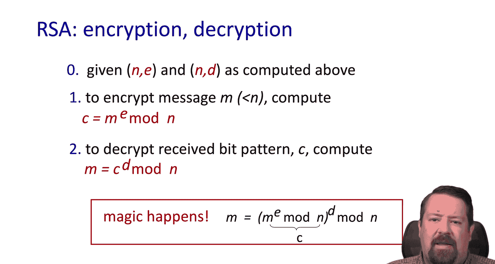

Oh， take that mod in。So here's an example。And we're not going to do it with 1024 bit numbers because that would be unmanageable。

 so we'll use small prime numbers for our example， So we have the prime number 5 and 7 as our P and Q。

 and that gives us an n of 35 and a z of 24。And then if we choose E to be 5， Z is not divisible by5。

 so that they are relatively prime。And we can pick D equal to 29 because we multiply E times d and subtract 1。

 it is divisible by 24。So now we can take our E bit message， which has a single one in it。

And in decimal representation， that's the number 12。And when we raise it to the power of five。

 we get 24，832。But that number modular 35 gives us a ciphertext of 17。

Note that our cybertext will always be in same bit space of the block that we're encrypting。

So in this case， we did an  eight bit encryption which allows for the values between0 and 255。

 and so our cybertext is going to be an  eight bit value as well。

We then take our sorry for T 17 and raise it to the power D29。

Get that very large number that I'm not going to read。But when we take that modular 35。

 we get our original message value 12。

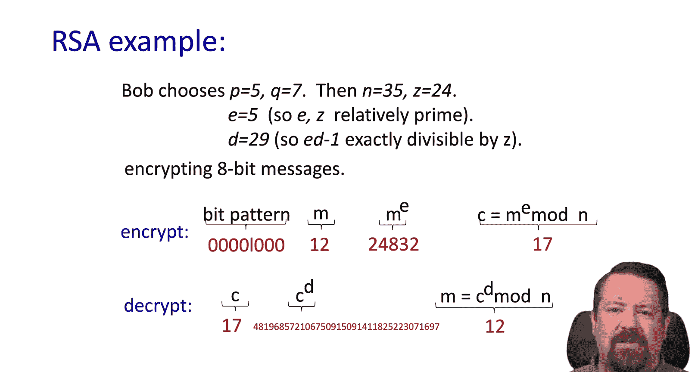

So effectively， RSA satisfies relationships we talked about earlier that allow us to get back the original message after performing these modular arithmetic combinations。

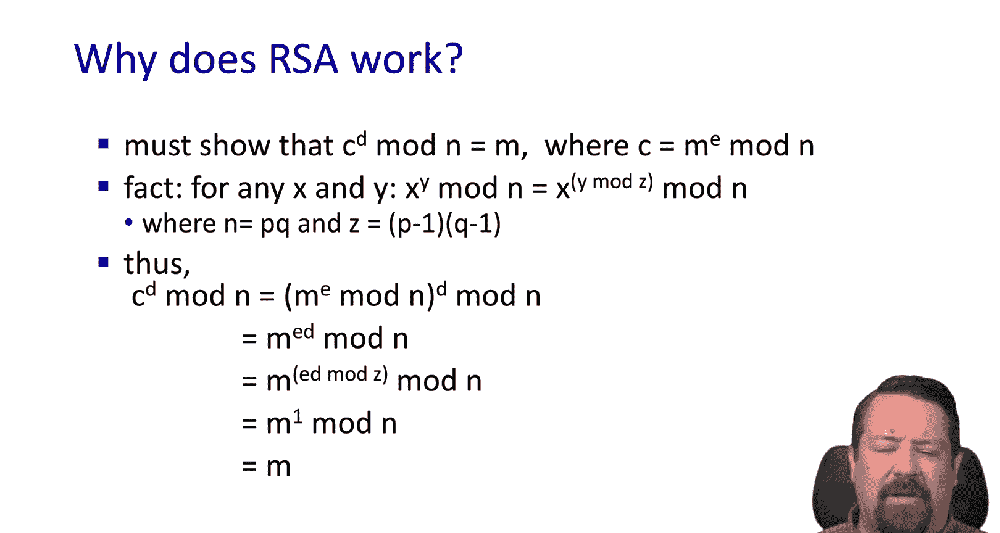

And it also has another important property， which becomes very useful later on。

It is that the operations can be performed in either order， so we can take the message。

Encrypt it by the encryption key and decrypt it with the decryption key。

Or another way to say that is to encrypt it with a public key and decrypt it with a private key。

 but we can also reversese the order， we can encrypt it with a private key。

 and then anybody with a public key can decrypt it。

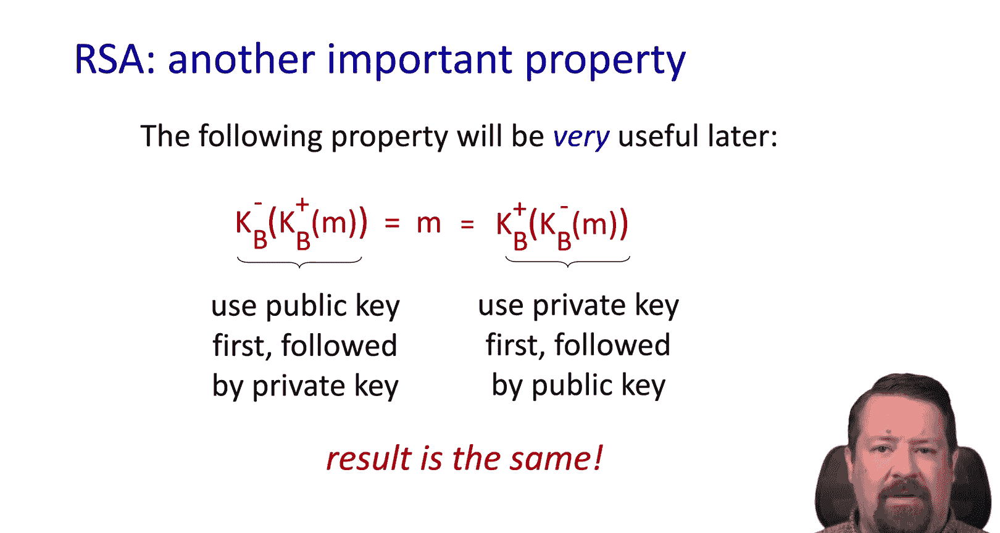

And this is because all of those modulo properties that we saw earlier are reversible and the order doesn't matter。

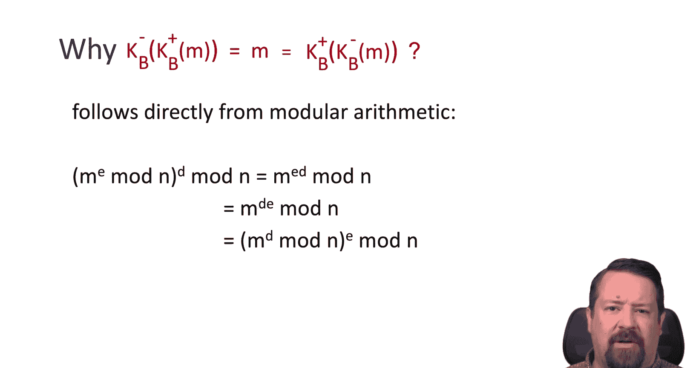

But from our perspective， what we really care about is why is RSA secure？

So if we know the public key and we probably can know the public key because it's public。

 then how hard is it to determine D， the decryption key？Well。

 essentially we have to find the factors of N without knowing the two factors P and Q。

The key point here is that factoring a large number is computationally difficult。

So a big takeaway here is that our public key encryption scheme。

 which much of the internet security infrastructure is built upon。

 relies on the fact that factoring big numbers is hard。

 if factoring big numbers ever became easy we would have to rethink the entire way that we do security on the internet today。

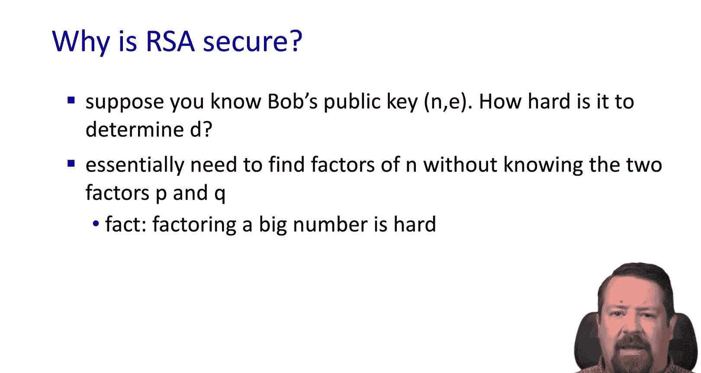

Okay， so if RSA is so great why don't we just use that Well in practice。

 RSA is computationally intensive， so even once we have these large keys the process of encrypting and decrypting with the large exponiation is very slow。

So DES is at least 100 times faster than RSA。And AES is comparably faster than RSA。

So in practice what we do is we use the public key cryptography to establish the secure communication remember we said the problem with symmetric key is is that we have to get the symmetric key from the center to the receiver Well。

 Alice now can encryptpt the symmetric key using Bob's public key so Bob can decrypt the symmetric key and then use a symmetric key from then on in the session。

And this symmetric key algorithm then runs much faster than the public key so we get the performance that we might need to transfer large amounts of data。

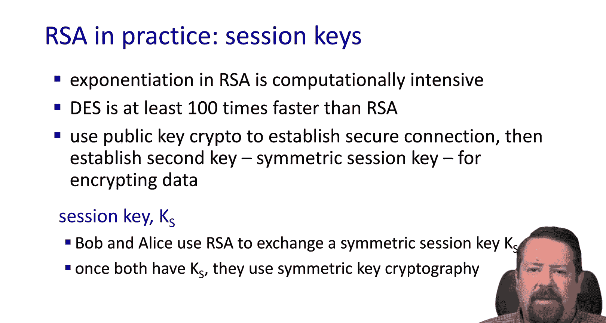

Well， that has been a very high level overview of cryptography。

 but it gets us the basis that we need to understand the rest of the network security principles that we'll be looking at in this chapter。

In the next video we'll move on to authentication and message integrity， See you then。

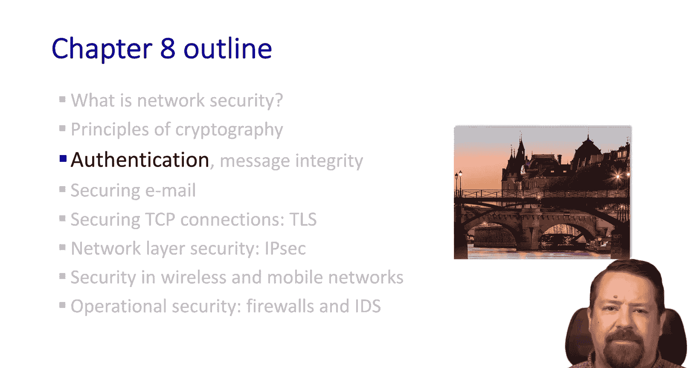

We hope you enjoyed this video， if you found it to be useful please click the like button to be notified when more videos are posted for this class。

 please subscribe to our channel and click the bell。

