# Jim Kurose《计算机网络：自顶向下的方法｜Computer Networking： A Top-Down Approach》中英（deepseek p57 -57-Digital Signatures, Message Integrity, and Authentication _ -BV1UMtueiEaA_p57-

Welcome back in this video we'll be discussing message integrity and digital signatures。

 including cryptographic hash functions and message authentication codes and building up an authentication protocol from basic elements let's get started。

Okay， welcome back This is our third video looking at network security and in the last video we talked about the principles of cryptography that we saw a little bit about the tools that we have to work with。

 meaning symmetric key cryptography and public key cryptography。

But just knowing those tools exist is quite a ways from actually being able to use them in a protocol where we can achieve goals like authentication and message integrity and spoiler alert。

 we can't actually have authentication reliably without message integrity。

 so we'll talk about those two network security goals today。

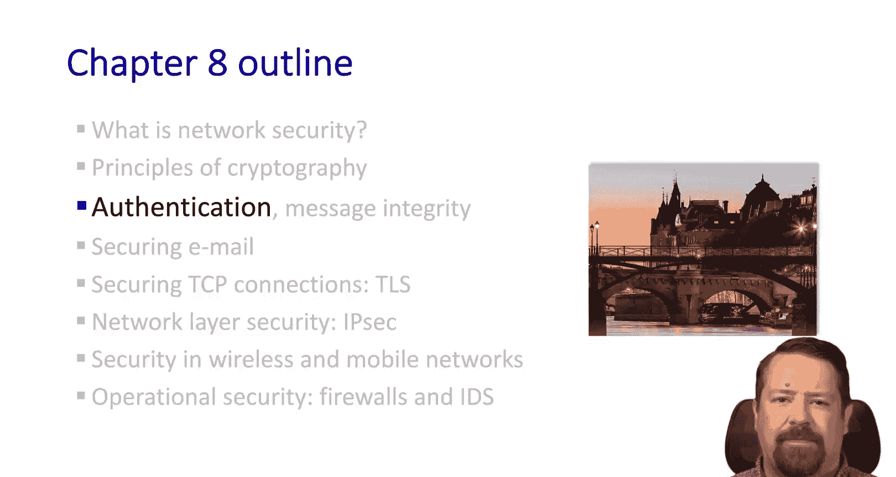

So again， we have Bob and Alice。And Bob wants to know who's talking to him and Alice says。

  I am Alice。Great job done， but wait， our attacker says I am Alice。Who's Bob to believe？

In real life， of course， if Bob already knows Alice。

 he might recognize her face or her voice or have some other way of verifying that he's actually talking with Alice。

But in a network we just have the bits and so the bits I am Alice coming from one or from another look exactly the same。

 there's no way for the recipient to differentiate them。

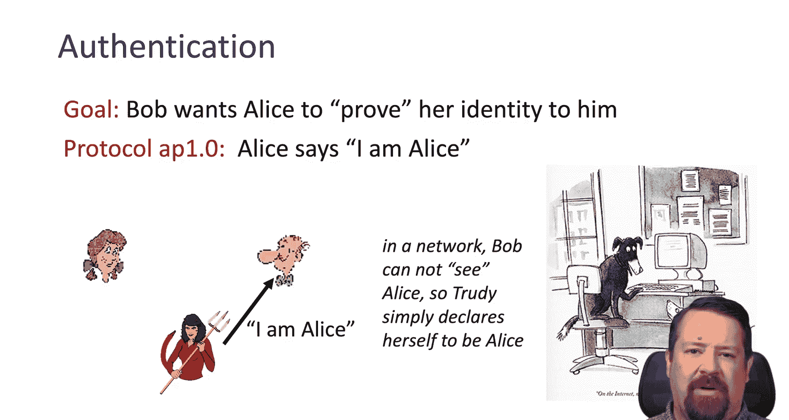

So let's put this in the context of a network packet。

Now we have I am Alice and in the header of that packet we have Alice's source IP address。

The problem here。Well， the attacker can also generate a packet and spoof Alice's source IP address。

Yes， there may be some places in the network that this won't work from， but in general。

 attackers can spoof IP addresses， so that is not a reasonable authentication method。Okay。

 now we're up to authentication Pro 3。0 where Alice says I am Alice and sends her secret password to prove it。

And then Bob acknowledges this back to Alice。What could go wrong here？Well。

 assuming our attacker is able to record that initial communication。

They can do what's called a replay attack， just save the message with I am Alice and the secret password and the attacker can then send a copy of this packet out anytime they want to。

So here we have this Boof packet， Alice's source IP address， Alice's password， I am Alice。

From Bob's perspective， this is just as legitimate as the one that actually came from Alice。

Then the OK goes back to Alice's IP address and if the attacker is able to listen on this connection。

 they're probably able to get the response and intercept that as well。So that is the playback attack。

So we modify that a little bit and the change here is that the password is encrypted。

 so that could be encrypted with Bob's public key， which we know is a secure protocol。Well。

 turns out the playback attack still works， assuming Bob's public key hasn't changed in between all the attacker needs is a copy of the encrypted password。

 they don't actually have to prove that they know the password。

 the plaintext password in this scenario they can just replay the ciphertext of the password。

So still nobueno。

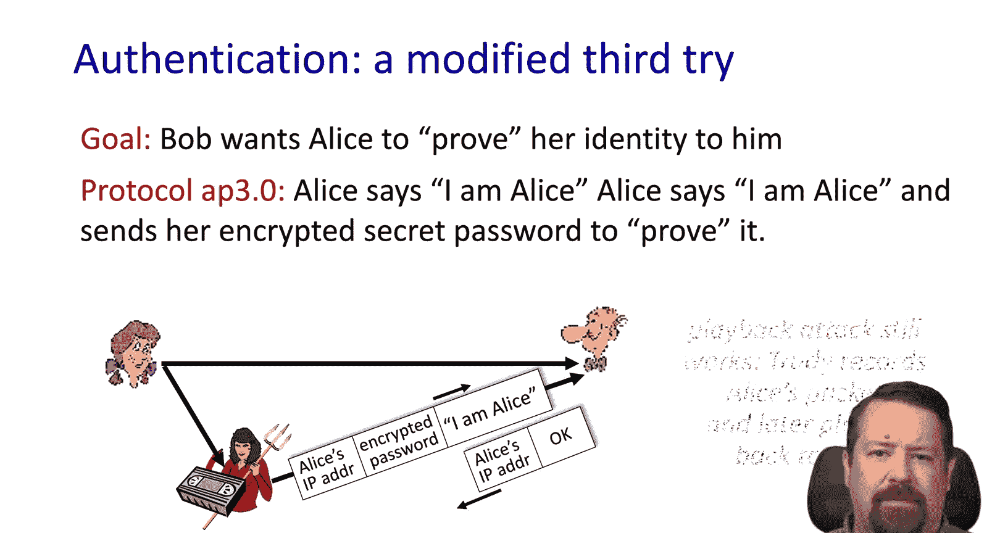

The playback attack still works。All right， now we're on to version4 of our authentication protocol。

And our number one goal here is avoiding the playback attack。

So here we have a knots or a number that's only used once in a lifetime。

So this is like the proof of life Alice has to show that they're actually able to encrypt this once in a lifetime number with the shared secret key。

So Alice says I am Alice， Bob replies back， here's a nos， prove it。

 Alice sends back the encrypted version of the knots， proving her identity。

 but what could go wrong here。 Well， of course， they had to get a shared secret key and we haven't yet talked about how they might do that。

 So our authenticification protocol try 5 is also going to use public key cryptography instead of a shared secret key。

 So I am Alice， Bob says here's a nos prove it。 And Alice notice that's a K minus a of R。

 So Alice uses her private key to encrypt R。

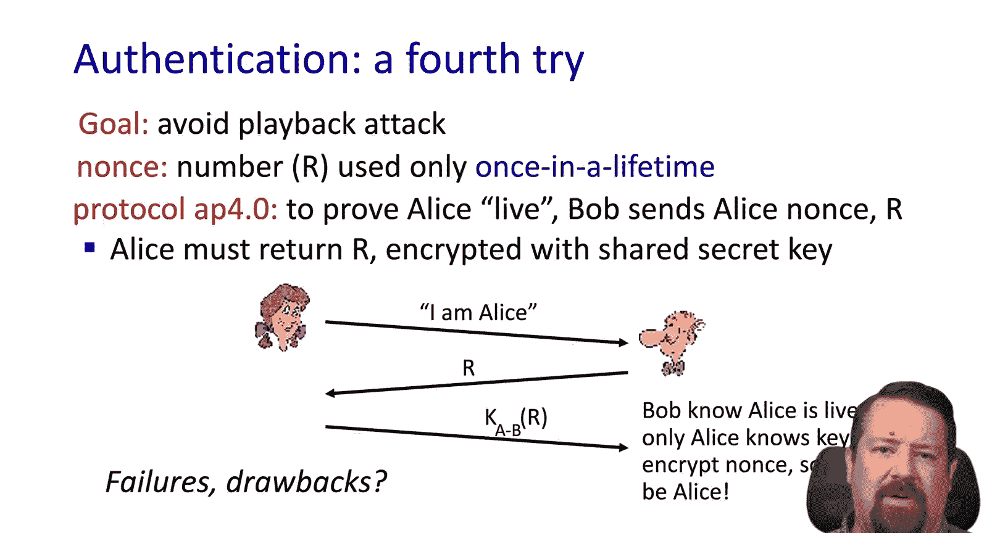

Now Bob needs Alice's public key in order to decrypt that。

 which Alice can provide or maybe Bob got it from Alice's website or from some other third party that certifies public keys。

 so Alice sends over her public key and is able to compute that what Alice sent before was encrypted with her private key。

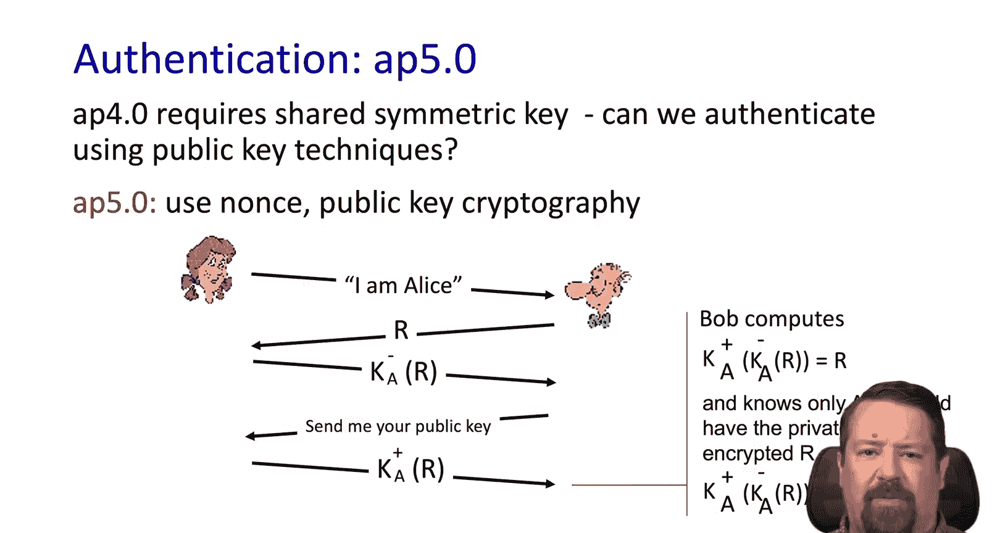

But wait， there's more。There's still a problem with this exchange。

 so we have our attacker in the middle， Alice says I am Alice。Tackcker repeats that to Bob。

 Bob sends the knots to our attacker Trudy and Trudy and Cris are with her private key。

Bob asks for the public key， Truy sends the public key and guess what。

 the computation checks out because Truy supplied both the public and private key。

So we still haven't gotten to the point where Bob would have confidence in who's saying they're Alice。

Trudy can also forward the notess on to Alice and have her encrypted and provide the public key。

If Bob then proceeds to send his personal message to Alice， of course， treaty setting in the middle。

Trudy sitting in the middle and so while Bob has encrypted it， he's done so with Trudy's public key。

 so of course Trudy can decrypt that message and can forward the message onto to Alice encrypted with her public key。

And so Bob and Alice don't even know that treaty's in the middle and has read the message that they've exchanged。

So the question is， where are the mistakes in this protocol， how can we fix this？

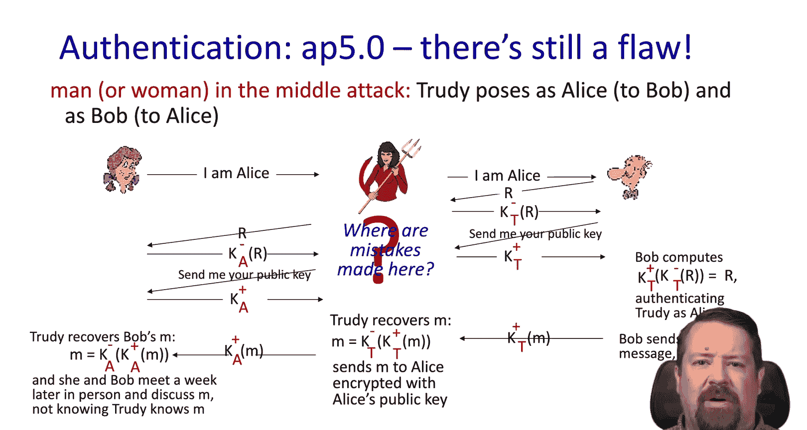

And the answer is we need to talk about message integrity before we can fix that protocol。

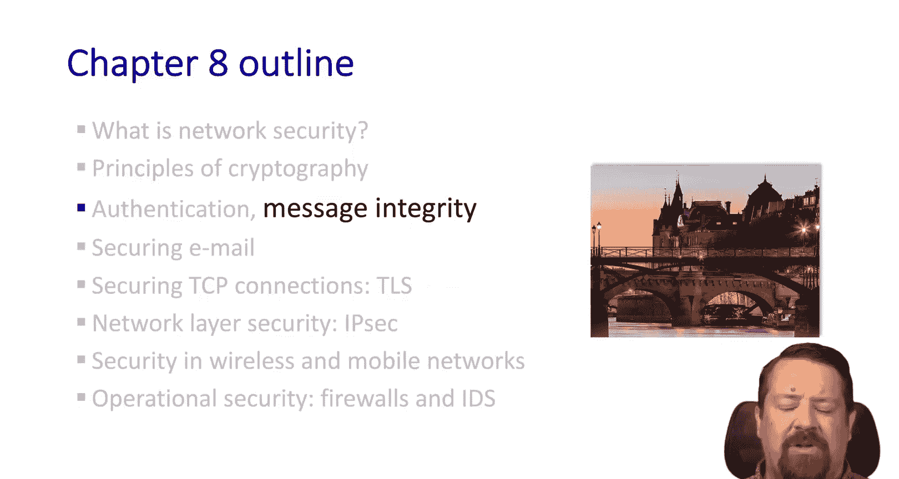

As a reminder， message integrity means that we can tell if a message has been changed and route。

 so the recipient needs to be able to confirm that the sender sent the message and they received it in the same form。

 or if it has been changed， they can tell that it's not the same as the sender originally intended。

So they're called signatures because they're analogous to handwritten signatures。

 which are supposed to be evidence that the message is from。

 who it says it's from and hasn't been changed。And so the sender， Bob。

 in this case digitally signs a document， and that shows that he's the document owner creator。

 what have you？And so the property that we want here is that it's verifiable so the recipient can say yes。

 this is Bob's digital signature。It identifies him as the originator of the document and the fact that this document is intact。

 and it should be non forgeible。So a simple way to do this。

 given that we have public key cryptography is Bob can sign the message by encrypting it with his private key。

So this is now a signed message。And anybody with Bob's public key can decrypt the message。

 so it's not confidential。But given that they're able to decrypt it with Bob's public key。

 they know that it must have been encrypted by Bob because he's the only one that has the private key。

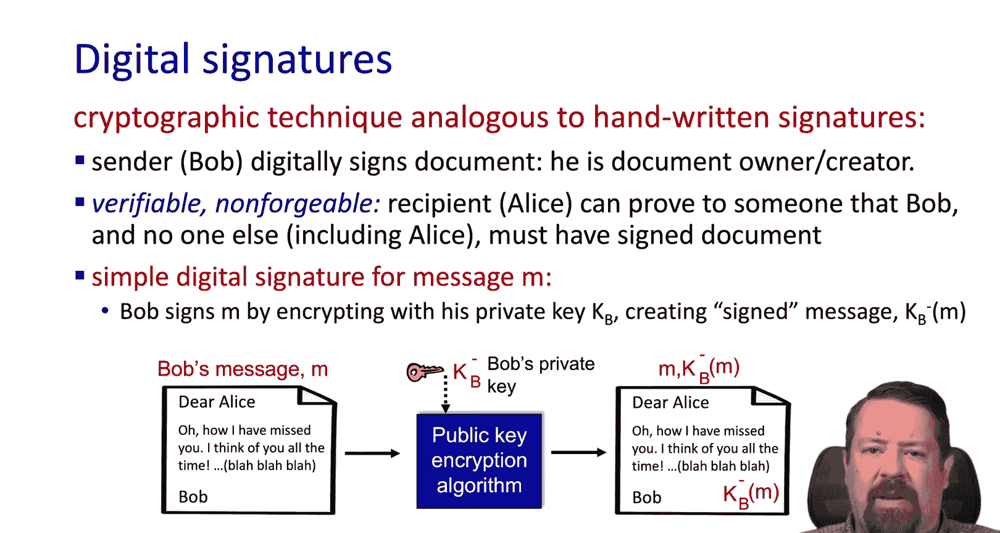

So the end result is if the public key is able to decrypt the message and get us back the original message。

 then we know that the signer must have been the holder of the private key， Bob in this case。

So Alice is verified that Bob signed the message and nobody else。And that the message is intact。

 right， The message hasn't changed in transit because when she decrypted it using the public key。

 she got back the same message。This also brings up the issue of non repudiation。

 so if Bob later says no， I never said that， Alice can use this signature to prove that Bob said this because he signed it。

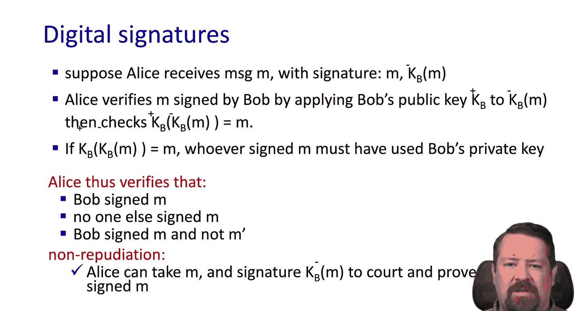

So as we noted， public key encryption is computationally expensive， so if we have a long message。

 we don't really want to encrypt the whole thing using public key cryptography just to prove that it hasn't changed。

So instead we use digestigest。Meaning we use a hash function to get M。

 We haven't talked much about hash functions， but they're fast at their one way functions。

So we could have a message that's arbitrarily long could be gigabytes。

 if we apply a hash function to it， it will run fairly quickly and we will get a message digest of a fixed size。

 It might be 128 bits or what have you， whatever the property of this hash function is。

It's important to note this is not a ciphertext， we cannot take the digest and get back the message because we've lost information by applying the hash function。

 however， for any change to the message it's highly probable that we would get a different hash。

And the hash space is relatively large。 It's many to one。

 meaning there are multiple messages that would give the same hash。

 but it's very hard to find what are called hash collisions。

 So different messages that generate the same hash。

The property that we like about it is we get this fixed size message digest。

 also called the fingerprint。And because it's small。

 then it is computationally easy to assign the message digestig， however。

 it is computationally infeasible， given the digest to reverse engineer a message that would give that same digest。

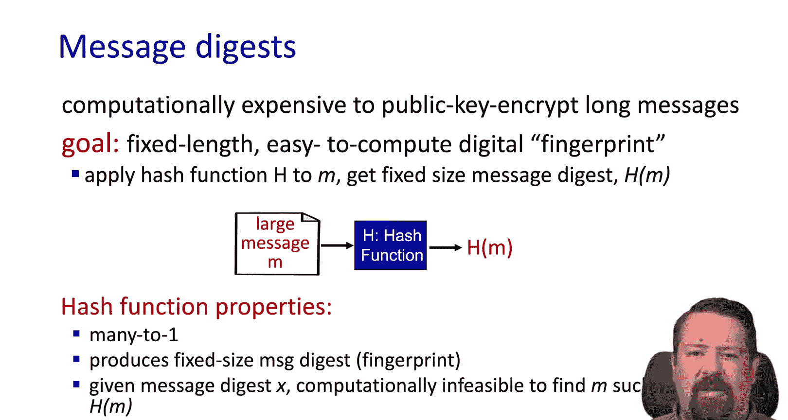

Thinking all the way back to the internet check some， that is， in fact， a hash function。

It's just not one with very good cryptographic properties because it can be easily reversed engineered。

But it has the properties that we set identify a hash function。

 meaning it gives a fixed length digest right， no matter how many 16 bit blocks we sum together using the internet checkum。

 we still get 16 bits out， so that's effectively our digest。It is Min to one。

It's just not good cryptographically because given a hash value。

 it's easy to find a message with the same hash value， we can mathematically generate one。

So there are well known hash functions that are used in practice such asSh 128，S 256。

 and so we can use these to generate the digest of messages。

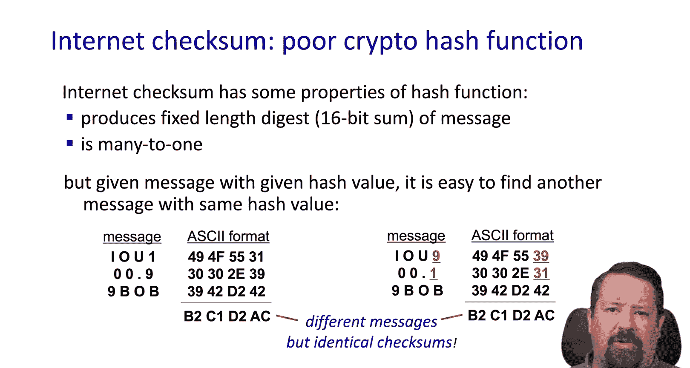

So here's the process， Bob has a large message， he runs it through a hash function giving us each of M。

Which is no longer representative of the message， but it's this message digest。

He then uses his private key to encrypt the message digest。

And he sends the encrypted message digest along with the original message。On the receiving end。

 we have both the large message and plain text and this message digest。

 we're able to apply Bob's public key to the digital signature。

 decrypting it and giving us the unencrypted message digest。And we can apply the hash function。

 which is known as part of the protocol to the message， and these should match。

And then we can confirm that Bob did in fact， generate the digest in science。If they're not equal。

 then we would know that the plain text message must have changed and transit and it no longer matches the message digest。

And so we've achieved this notion of message integrity。

 we know that the message has changed and we can no longer trust it。

Or we know that someone else actually signed this not Bob， and so the message isn't really from Bob。

 either way， can't trust the message。

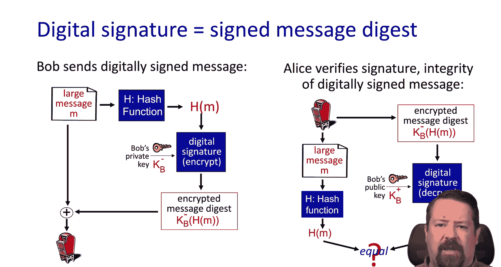

You might have seen the name MD5， that's a very common hash function that computes 120 bit message digests。

 as well as Sh1， which is a NIS standard and generates 160 bit message digests。Of course。

 the larger the size of the mess of digest， the less probable it will be for a collision to happen。

 meaning two different messages that have the same digest。

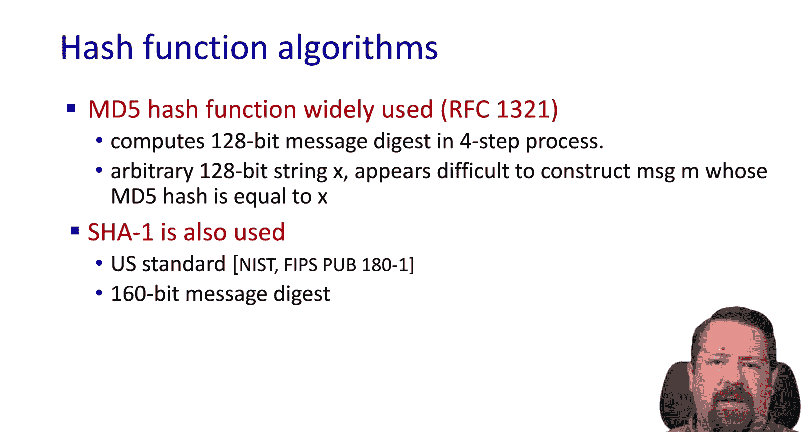

Okay， now we can revisit our authentication protocol 5。0 now that we understand message integrity。

So the problem was that our attacker was able to pose as Alice to Bob and as Bob to Alice。

And be in the middle， decrypting the messages and reading them。

 and then reenrypting them and passing them along。So there was our original scenario。

 Bob thinks he's talking to Alice， Alice thinks she's talking to Bob。

 but actually they're both talking to Trudy in the middle and she's able to read the messages。

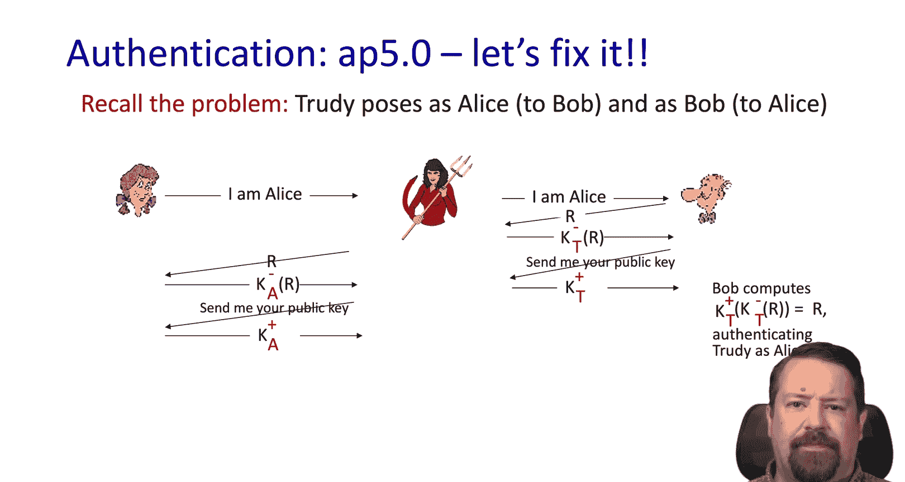

So we need a little more information to actually fix this problem。As one more example of the issue。

 we have Trudy playing a pizza prank on Bob So Trudy creates an email order to the pizza star please deliver to me for pepper pizzas。

 Thank you Bob so she impersonates Bob sends that order right。

 Bob's gonna get pizzas we know where this is going。

Trudy signs the order with her private key and sends it to the pizza store and sends the pizza store her public key。

 but claims that is Bob's public key， so the pizza store verifies the signature right Judy sent both。

 so of course they match。And the pizza store then delivers four pepperoni pizzas to Bob， who。

 as it happens， doesn't like pepperoni pizza。

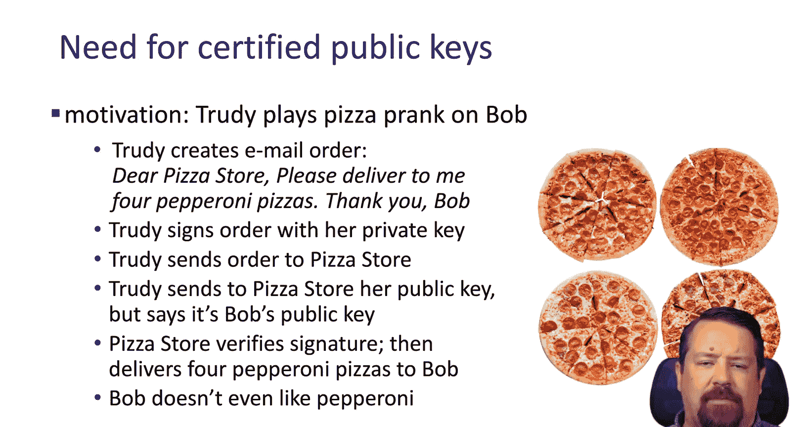

Don't know what's wrong with him， but that's neither here nor there。

So this is where the role of certification authorities come in or CAS。

And you may have seen this term relative to the certificates for HPS websites， for example。

So the CA binds a particular public key to a particular entity， The entity could be a person。

 a website， a business device。In any case。The key is registered and when it's registered。

 some out of band proof of identity is used to show the CA， yes， I'm that entity。

 here's my public key， so the CA then maintains these bindings and creates the certificate containing the entity's public key and it's digitally signed by the certificate authority。

And so that signature then represents the certificate authorities saying， this is E's public key。

Bob's no longer asking Alice for her public key， which that message can be intercepted by whoever。

Bob goes to the certificate authority and says，  give me Alice's public key。

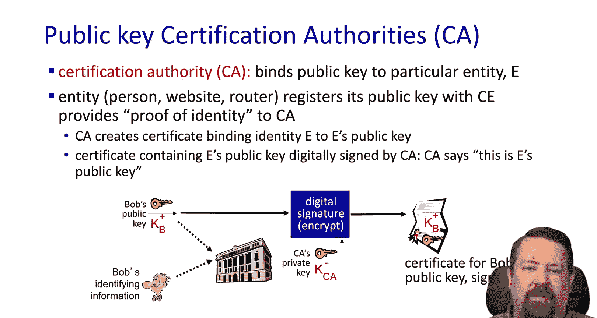

All right， so now Alice wants Bob's public key。Alice can get Bob to send her a message encrypted with his private key。

 but she's not going to ask Bob for his public key。Alice is going to go to the certificate Author。

And the certificate authority is going to say here's Bob's key encrypted with our public key so then Alice can apply the CA's public key to the certificate。

 get Bob's public key。And then decrypt the message from Bob and verified that it indeed matches Bob's public key from the CA。

Now if we think back to our problem with the authentic kitchen protocol。

It's solved because Trudy can no longer be in the middle of the exchange of public keys。

 so she can no longer substitute her public key for Alice's public key and Bob's public key。

 and so then she would no longer be able to encryptpt and decrypt on their behalf and have that whole surptitious arrangement。

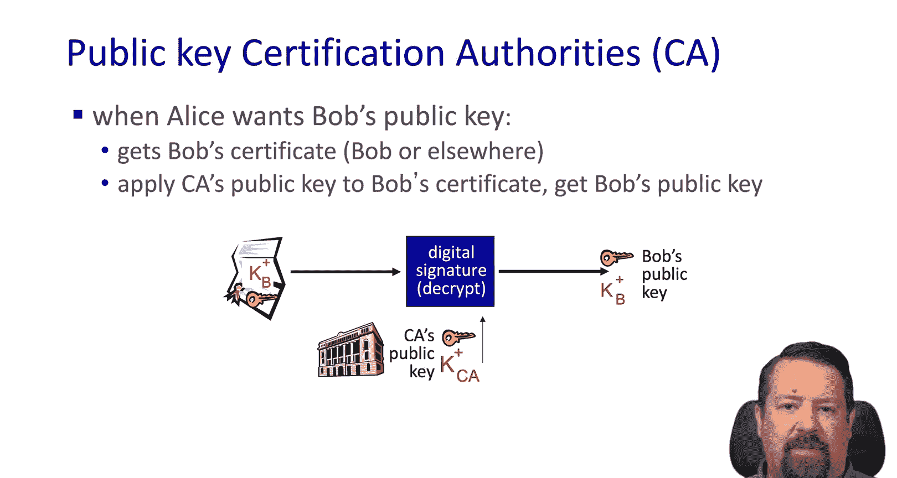

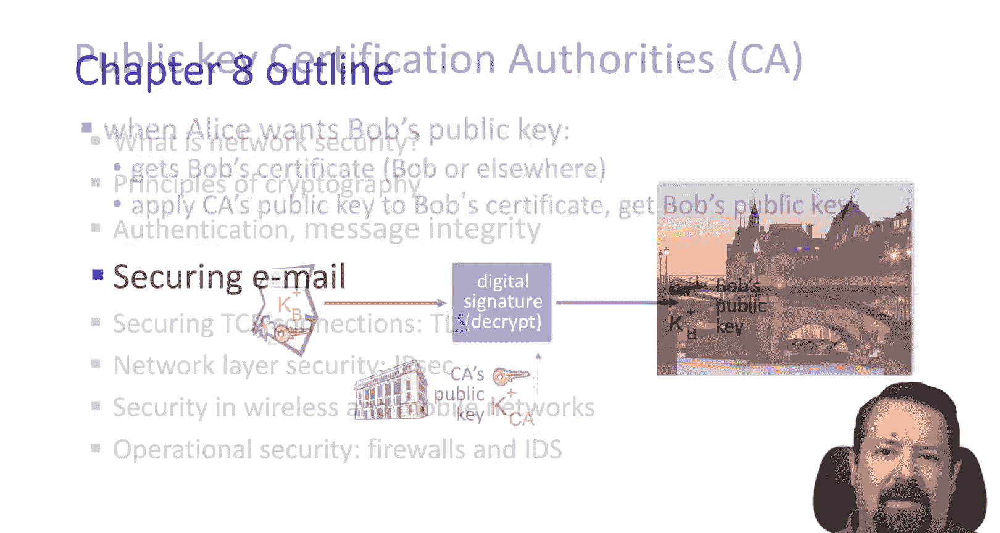

All right， that's all for now。Next we're going to look at how the applies to securing email we'll see you in the next video。

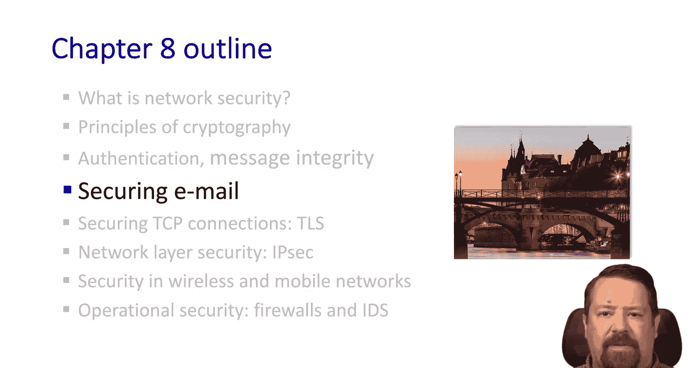

We hope you enjoyed this video， if you found it to be useful。

 please click the like button to be notified when more videos are posted for this class。

 please subscribe to our channel and click the bell。

