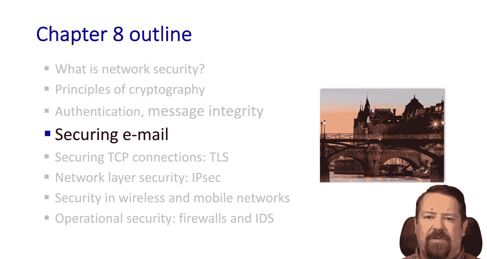
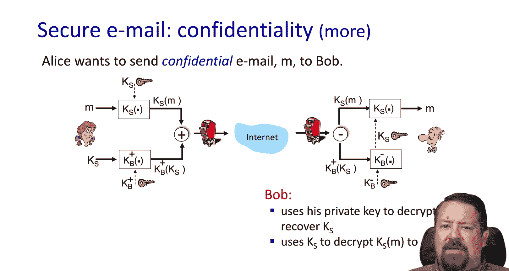
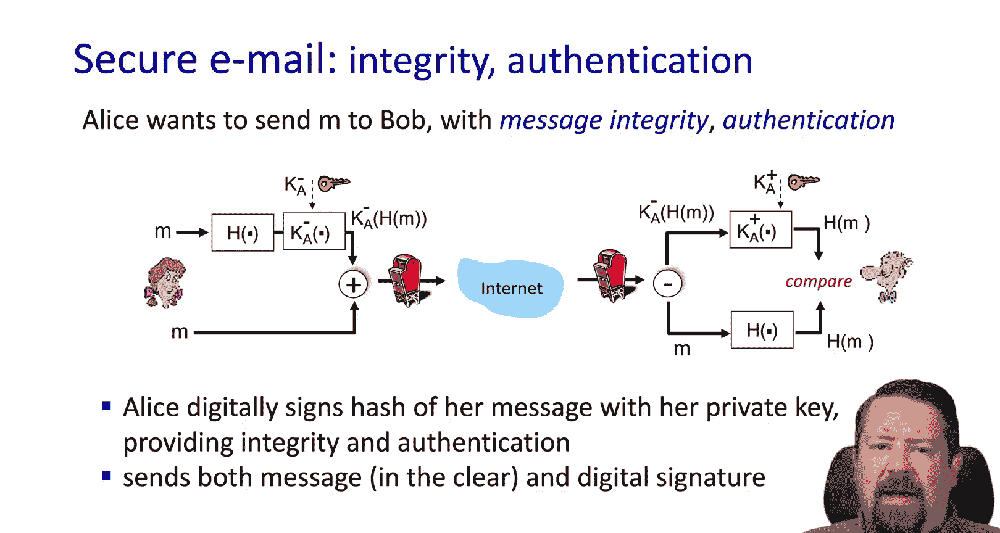
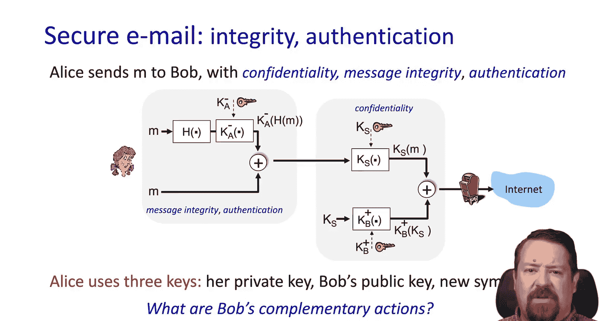
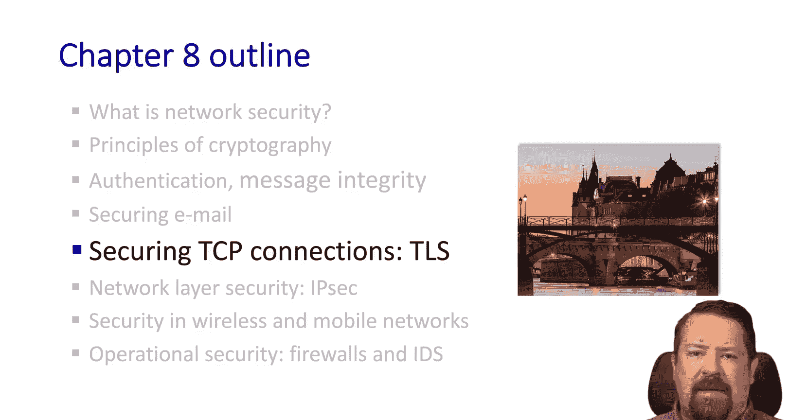

# 计算机网络：自顶向下的方法：第58节：使用PGP加密实现安全电子邮件 🔐

在本节课中，我们将学习如何通过公钥认证技术，为电子邮件提供签名和加密功能，从而实现邮件的安全传输。我们将探讨保密性、完整性和认证这三个核心安全目标在电子邮件场景下的具体应用。

在上一节中，我们介绍了认证和消息完整性的基础知识。本节中，我们将看看这些知识如何应用于保护电子邮件这一实际场景。

通常，我们使用用户名和密码登录电子邮件服务。这实现了服务提供商对你的认证。然而，邮件内容本身并未受到保护。无论是你的邮件服务提供商，还是收件人的服务提供商，如果存在恶意行为者，他们都有可能截获、读取甚至篡改邮件内容。我们接下来讨论的，不是如何登录邮件服务，而是如何真正保护邮件内容本身。

## 实现邮件保密性 🔒

假设爱丽丝想发送一封保密邮件，她希望邮件内容在传输过程中不被截获和读取。

以下是实现保密性的步骤：
1.  **生成对称密钥**：爱丽丝首先生成一个对称密钥 `KS`。
2.  **加密邮件内容**：她使用对称密钥 `KS` 和对称加密算法（如AES）加密明文消息 `M`，得到密文 `KS(M)`。使用对称加密是因为它对大量数据的加密效率远高于公钥加密。
3.  **加密对称密钥**：为了将对称密钥 `KS` 安全地发送给鲍勃，爱丽丝使用鲍勃的公钥 `K_B^+` 对 `KS` 进行加密，得到 `K_B^+(KS)`。
4.  **发送组合数据**：爱丽丝将加密后的消息 `KS(M)` 和加密后的对称密钥 `K_B^+(KS)` 一起发送给鲍勃。

在接收端，鲍勃的操作如下：
1.  **解密对称密钥**：鲍勃使用自己的私钥 `K_B^-` 解密 `K_B^+(KS)`，得到对称密钥 `KS`。
2.  **解密邮件内容**：鲍勃使用对称密钥 `KS` 解密 `KS(M)`，得到原始明文消息 `M`。

通过这个过程，我们实现了邮件的保密性。消息被加密，且共享密钥以安全的方式传输。

## 实现邮件完整性与认证 ✍️

然而，上述过程只保证了保密性，并未对发件人进行认证。任何人都可以生成一个对称密钥并用鲍勃的公钥加密。鲍勃虽然能阅读消息，但无法确认消息确实来自爱丽丝。

现在，假设爱丽丝不关心保密性，但她希望鲍勃能确认消息来自她本人，并且在传输途中未被篡改。这时就需要完整性和认证机制。

以下是实现完整性与认证的步骤：
1.  **生成消息摘要**：爱丽丝对明文消息 `M` 应用哈希函数 `H`（如SHA-256），生成一个固定长度的消息摘要 `H(M)`。
2.  **数字签名**：爱丽丝使用自己的私钥 `K_A^-` 对消息摘要进行加密，生成数字签名 `K_A^-(H(M))`。这个签名同时提供了完整性和认证。
3.  **发送组合数据**：爱丽丝将原始明文消息 `M` 和数字签名 `K_A^-(H(M))` 一起发送给鲍勃。

在接收端，鲍勃的操作如下：
1.  **解密消息摘要**：鲍勃使用爱丽丝的公钥 `K_A^+` 解密数字签名 `K_A^-(H(M))`，得到爱丽丝计算的消息摘要 `H(M)`。
2.  **计算并比对摘要**：鲍勃自己对收到的明文消息 `M` 应用相同的哈希函数 `H`，计算得到一个新的消息摘要 `H(M')`。
3.  **验证**：鲍勃比较解密得到的 `H(M)` 和自己计算出的 `H(M')`。如果两者完全一致，则证明：1）消息在传输过程中未被篡改（完整性）；2）消息确实是用爱丽丝的私钥签名的，因此必然来自爱丽丝（认证）。

## 结合保密性、完整性与认证 🛡️

在实际应用中，我们通常希望同时实现保密性、完整性和认证。这可以通过组合上述两种技术来完成：
1.  爱丽丝先对消息进行签名（用私钥加密哈希值）。
2.  然后，她将签名和原始消息一起，使用对称密钥加密。
3.  最后，她用鲍勃的公钥加密对称密钥，并将所有加密后的数据发送给鲍勃。

鲍勃则反向操作：先用私钥解密对称密钥，再用对称密钥解密得到消息和签名，最后验证签名。

虽然设置过程可能稍显复杂，但独立的邮件客户端通常都提供配置密钥对的机制，以支持邮件的加密和数字签名功能。

本节课中，我们一起学习了如何使用PGP（Pretty Good Privacy）加密的原理来保护电子邮件。我们探讨了如何通过公钥加密体系实现邮件的保密性，以及如何通过数字签名实现邮件的完整性和发件人认证。理解这些基础机制，是掌握网络安全通信的关键一步。

在下一节视频中，我们将探讨TLS（传输层安全）协议，它是为HTTPS提供安全保障的核心机制。