# 计算机网络：自顶向下方法：第59章：保护传输层（HTTPS工作原理）🔐

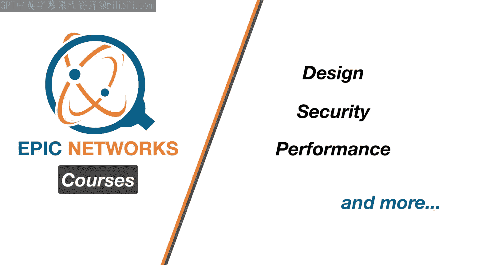

在本节课中，我们将学习如何使用TLS协议来保护TCP会话。TLS是HTTPS等应用所依赖的底层安全机制。我们将从基础概念开始，逐步构建对TLS工作原理的理解。

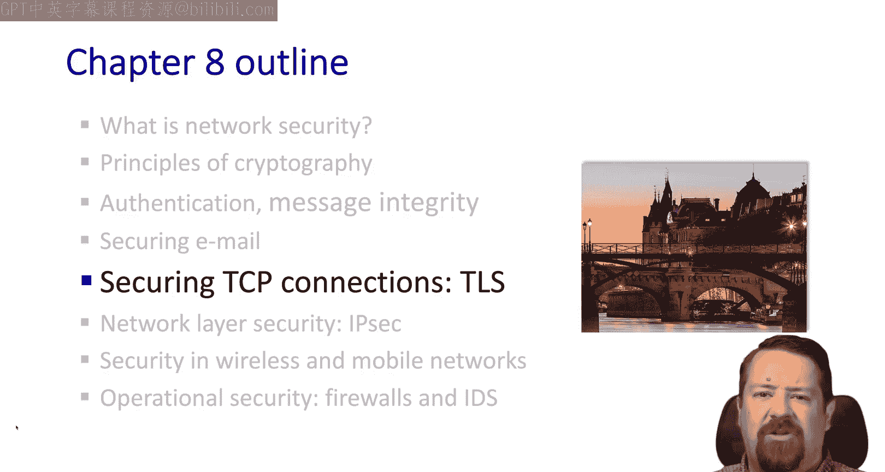

## 概述：TLS与HTTPS

TLS，即传输层安全协议，是为网站提供HTTPS（安全HTTP）服务的核心机制。它可能是我们遇到的使用最广泛的安全协议。早期它主要用于电子商务或网页邮箱，如今绝大多数网站都已部署HTTPS，并且所有浏览器都支持它。

TLS服务结合了我们之前见过的多种密码学元素：它使用**对称加密**提供机密性，使用**密码学哈希**提供完整性，并使用**公钥密码学**提供身份认证。你可能也听说过SSL，它是提供相同服务的早期协议，现已被弃用并由TLS取代。尽管SSL的版本号更高，但当前版本TLS 1.3在技术上更先进。

## 构建一个简化的TLS协议

正如我们在课程中对其他协议所做的那样，我们将从基本元素开始构建，看看实现传输层安全需要什么。我们称这个简化协议为“玩具TLS”。

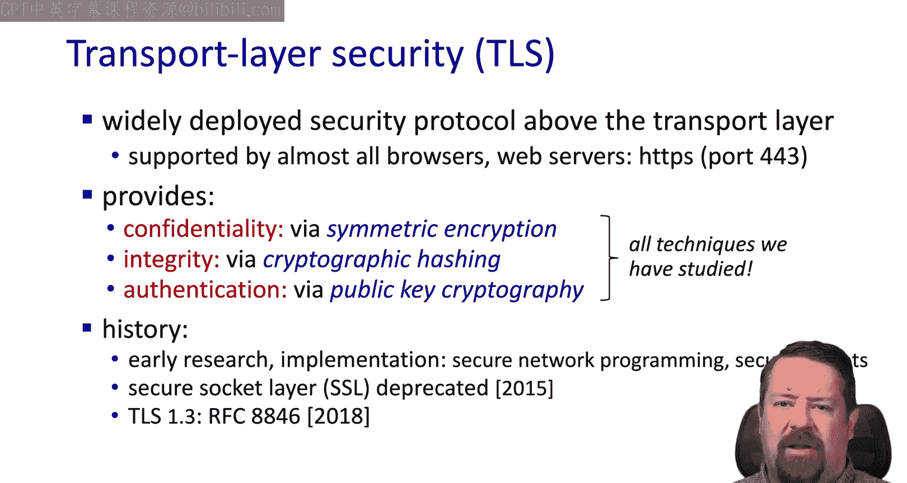

玩具TLS包含几个关键阶段：**握手**（使用证书和私钥等）、**密钥派生**、**数据传输**以及**连接关闭**。在时序图中，这些阶段叠加在TCP交换之上。这意味着必须先建立TCP连接，然后才能发送TLS握手消息、获取公钥证书。

## 密钥交换与派生

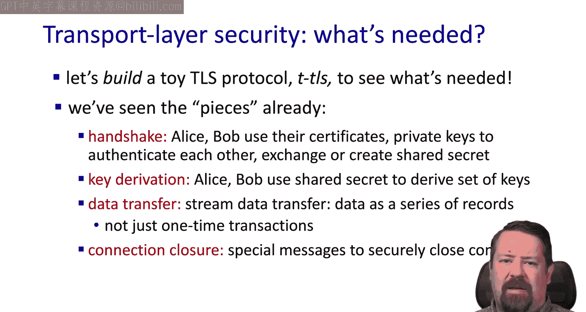

获取证书后，客户端使用服务器的公钥加密一个**主密钥**。这个主密钥是一个共享秘密。与之前所见不同，主密钥将用于为TLS会话生成额外的**会话密钥**。

这里的一个缺点是，在交换数据之前，我们引入了额外的往返时间开销。在TCP握手完成后，还需要进行TLS握手，这增加了连接开始前的延迟。

## 多密钥的必要性

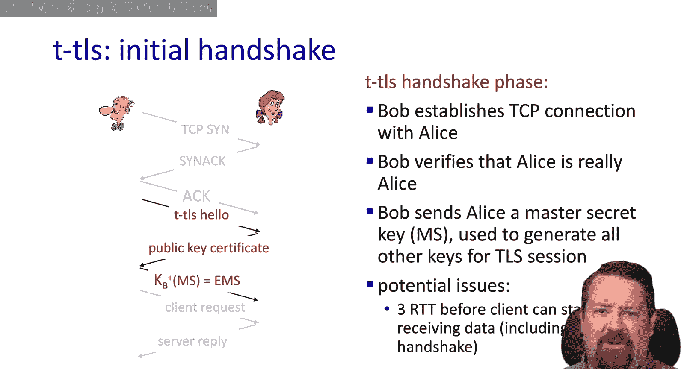

出于安全考虑，将同一个密钥用于多个密码学功能是不好的做法。因此，在这个例子中，我们需要不同的密钥用于消息认证和加密。最终我们需要四个密钥：
*   客户端到服务器的**加密密钥**
*   客户端到服务器的**消息认证密钥**
*   服务器到客户端的**加密密钥**
*   服务器到客户端的**消息认证密钥**

所有这些密钥都将从一个**密钥派生函数** 中派生出来，该函数基于主密钥。

## 记录层：处理字节流

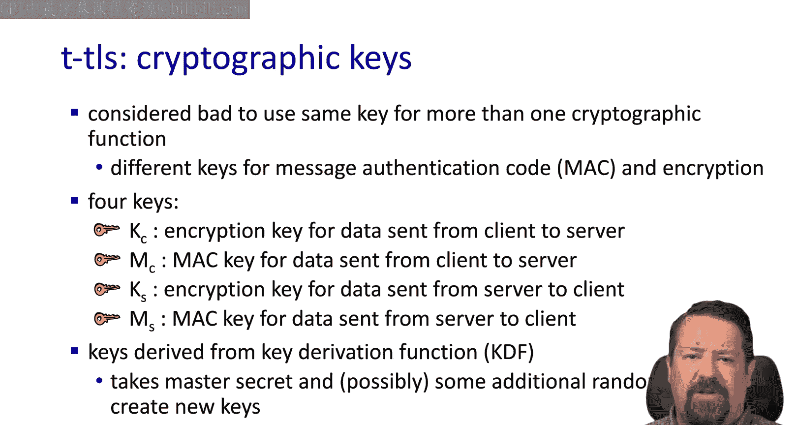

现在我们面临一个技术考量。TCP提供的是字节流抽象，它只是一系列从一端流向另一端的字节。那么问题是：我们是希望等待整个流结束才能解密和认证，还是采用其他方式？

在这个例子中，我们将把流分解为一系列**记录**或**块**。数据将以已知大小的块发送，每个记录会附带使用主密钥生成的**消息认证码**。这样，接收方可以在记录到达时立即处理，而无需等待整个流结束。每个记录使用对称密钥加密，然后传递给TCP。

## 潜在攻击与防护

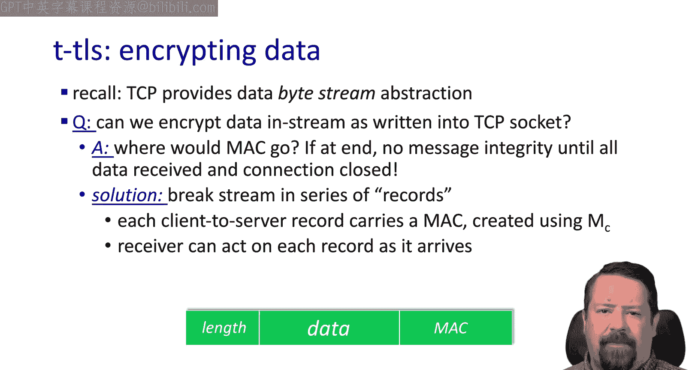

那么这可能受到怎样的攻击呢？我们面临**重排序**的问题。因为TCP头部不受TLS机制保护，中间人可能篡改TCP头部，重新排序TCP数据包内的内容，然后发送出去。

我们还可能受到**重放攻击**，即中间人保存加密信息并在稍后发送。为了防范这些攻击，TLS内部会使用**加密的序列号**，并且这些序列号在后续连接中不会重用。

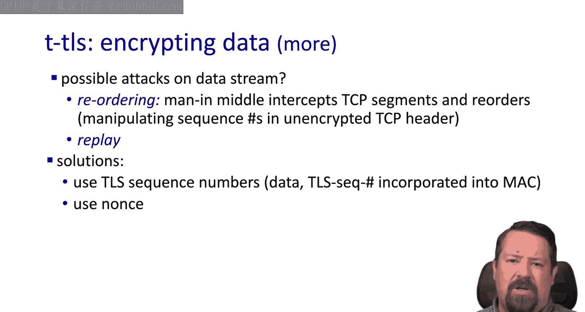

## 安全地关闭连接

我们还提到会有一个连接关闭过程。一个潜在的攻击是，攻击者可能通过伪造TCP连接关闭段来截断连接。回想一下，TCP标志位控制会话何时关闭，而这些标志位同样不受加密保护。

解决方案是引入**记录类型**，并设定一个特定的类型用于关闭。这个类型信息包含在加密数据内部，因此攻击者无法伪造。

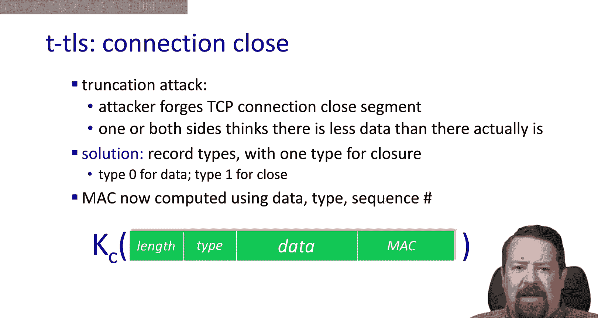

## TLS的应用接口与HTTP

TLS协议为应用程序提供了接口。从HTTP的角度看，原始版本的HTTP直接在TCP上运行，没有加密。而HTTP/2能够使用TLS接口。如果你也听说过HTTP/3，它是运行在QUIC之上的HTTP/2的精简版。QUIC运行在UDP之上，这是一个重大变化，QUIC协议承担了重排序、流量控制和拥塞控制的角色，完全在UDP上运行，而不是让TCP执行这些功能。

对于我们当前的讨论，我们关注的是HTTP运行在TLS之上，而TLS又运行在TCP/IP之上。

## TLS 1.3的密码套件

TLS及其版本号（这里是1.3）定义了所谓的**密码套件**，即一组用于密钥交换和加密的特定机制。实际上，它对某些功能提供了多种选项，因此在握手期间，两端需要协商将使用哪些方案来生成和交换密钥等。

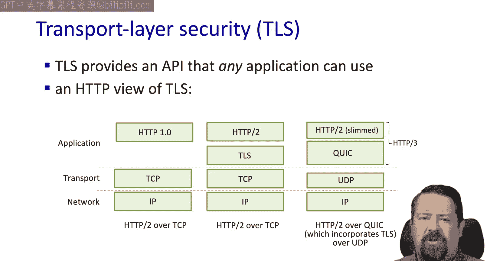

我们注意到，与TLS 1.2相比，TLS 1.3的密码套件选项更少。例如，RSA已不再作为密钥交换的选项，**仅支持迪菲-赫尔曼**。然后它使用**AEAD**进行加密和认证，并使用**SHA-256**作为其密码学哈希函数。

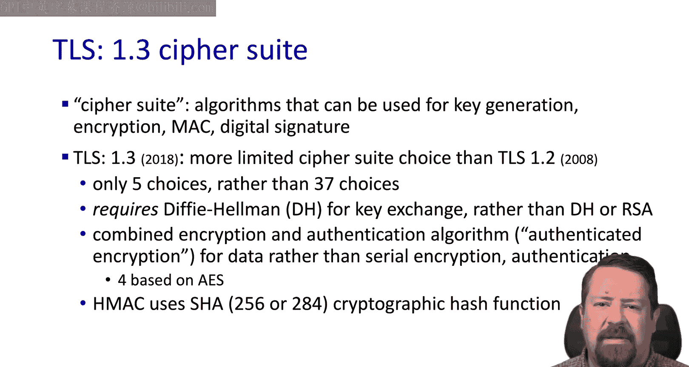

## TLS握手过程详解

以下是TLS握手过程：
1.  **客户端问候**：客户端在其数据包中指明它支持的密码套件，以及迪菲-赫尔曼密钥协商的参数。
2.  **服务器问候**：服务器从客户端支持的可用选项中选择一个密码套件进行响应，确认密钥协商协议参数，并提供其签名的证书。
3.  **客户端验证与请求**：客户端使用证书颁发机构的公钥解密并检查服务器证书。只要验证通过，它就可以生成主密钥并开始发出应用请求。

## 零往返时间握手

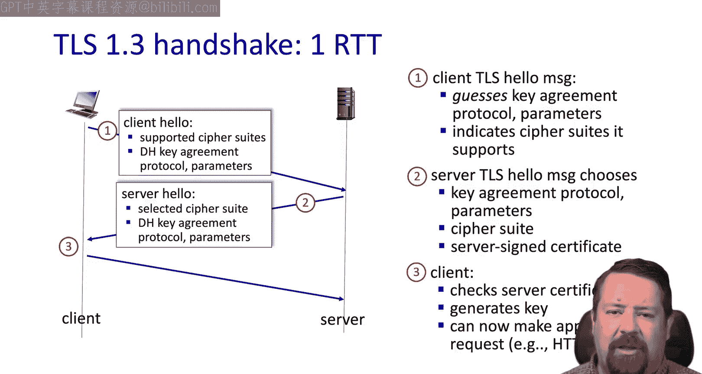

此外，还存在**零往返时间握手**的情况。如果客户端正在恢复与服务器的先前连接，即它已经有一些预先建立的信息，那么就有可能实现。这样，客户端能够使用先前连接的主密钥加密应用数据。然而，这容易受到重放攻击，因此必须谨慎规定其使用场景。

## 总结

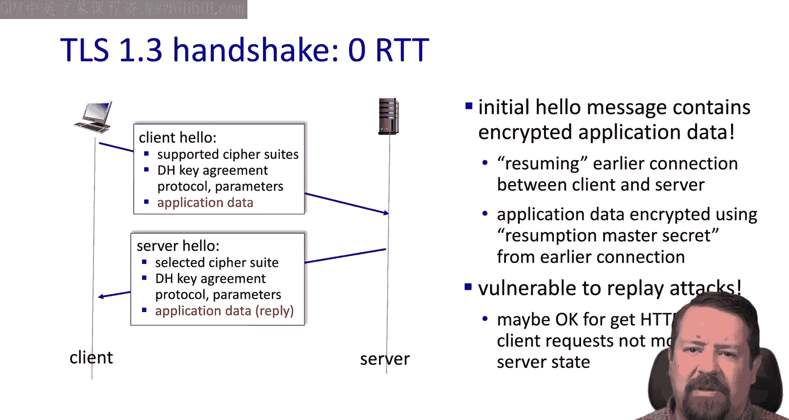

本节课中，我们一起学习了TLS和HTTPS。我们了解了TLS如何通过握手、密钥派生和记录层来保护TCP连接，提供了机密性、完整性和身份认证。我们还探讨了其潜在的攻击面及防护措施，并简要介绍了TLS 1.3的密码套件和握手流程。

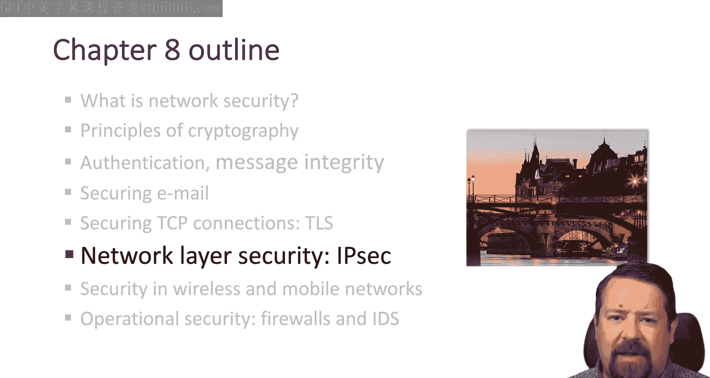

在下一个视频中，我们将探讨IPSec，可以将其视为**网络层安全**，而我们刚刚研究的是**传输层安全**。