# Jim Kurose《计算机网络：自顶向下的方法｜Computer Networking： A Top-Down Approach》中英（deepseek p60 -60-IPsec_ How VPNs Work - Virtual Private Network Security -BV1UMtueiEaA_p60-

Welcome back in this video we're looking at network layer security protocols。Specifically IPSec。

 which is the underlying security mechanism behind virtual private networks or VPNs。

Let's get started。

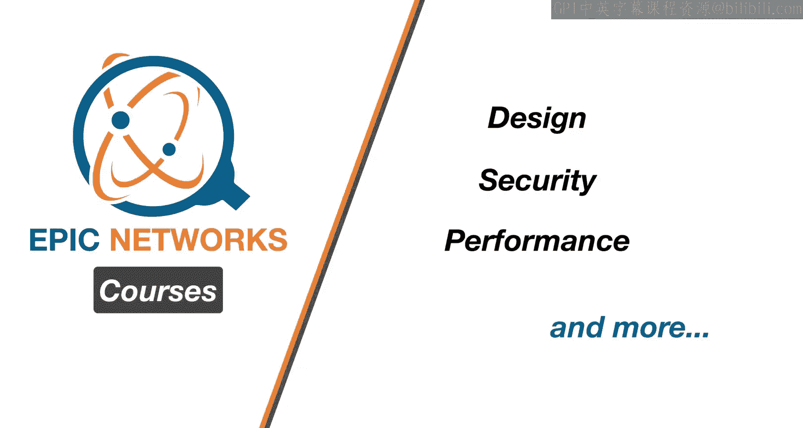

Welcome back。We're picking up where we left off by looking at network layer security known as IPS If you recall in the last video we were looking at TLS。

 which is the transport layer security meaning it creates an encrypted tunnel between two applications。

 the most common example being a web browser and a web server。

So now we're moving down the stack of layer to look at how we can do encryption at the network layer and in practice this means encrypting traffic between one IP host and another。

 often between a desktop and a router since we're talking about the network layer this means it's providing datagram level encryption along with authentication and integrity mechanisms and the intent is to cover both user traffic and control traffic。

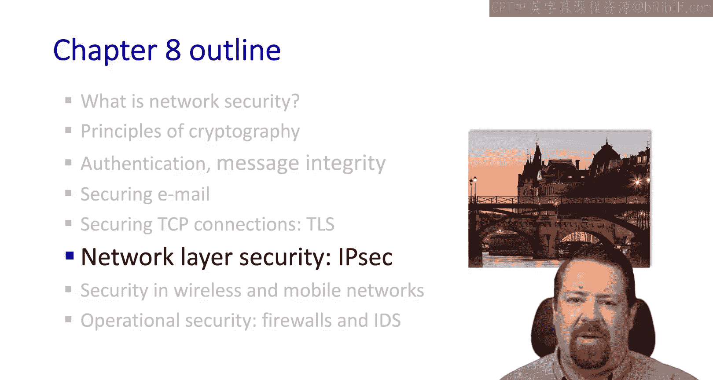

🎼If you recall in the last mechanism， we saw that while the Web sessions might be encrypted。

 it didn't do anything for the DNS messages， which would still leak information in the clear。

 So by performing the security mechanisms at a lower layer。

 we can more easily include all of these types of traffic。 IPec has two modes of operation。

 The transport mode where only the datagram payload is encrypted and authenticated。

So if our secure tunnel is between these two routers。

 we have the packet with its payload arriving at the left router。

 the payload being encrypted and then sent across to the other router。 In contrast to that。

 we have the tunnel mode。Where the entire datagram is encrypted and authenticated。

And that encrypted dataogram is encapsulated in a whole new datagram with a new IP header。

So in the same scenario， we have the payload coming across to the router and the router creates a whole new packet and the payload of this new packet is the entire encrypted previous packet。

Of course， this means adding the new header， which means the new packet will be larger than the old packet。

 which could cause fragmentation if the original packet was already at the maximum MU size。

This tunneling mode is what's commonly referred to as a VPN or virtual private network。

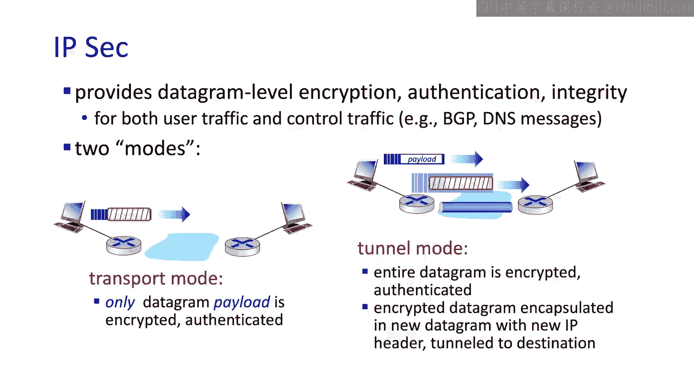

We have two IBEC protocols in two different RFCs that we can look at。

The first is the authentication header protocol， which provides authentication and allows the data integrity to be verified。

 but does not encrypt the payload， so it does not provide confidentiality In practice。

 this is used infrequently and what we typically mean by IPSec is the encapsulation security protocol RFC 4303。

 which provides all of the above along with confidentiality by encrypting the payload。

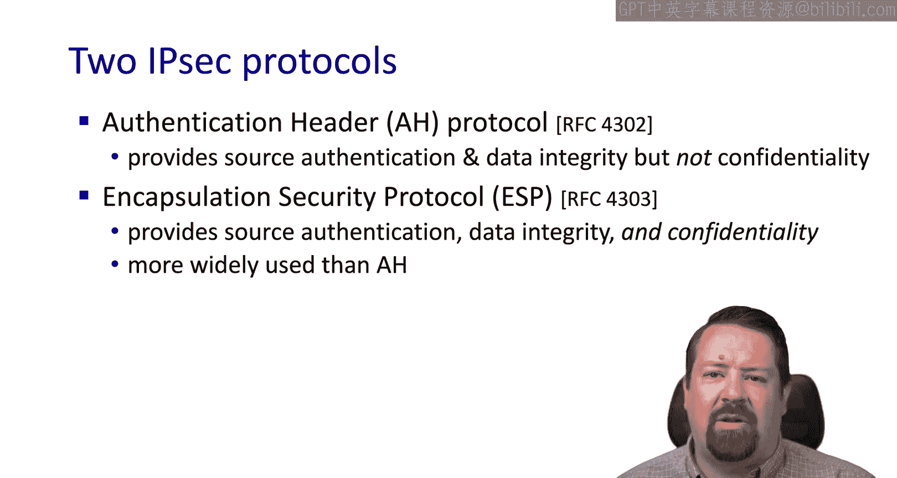

Before data can be sent over an IPS tunnel， a security association is needed。Unlike TLS。

 these associations typically don't happen automatically。

Some advanced configuration is required to configure the two nodes to communicate with one another over this encrypted channel。

Each end of the association maintains the state information needed， including key information。

And we note that this is a significant departure from our typical IP functionality。

 because IP is connectionless and the routers and nodes involved don't have to remember any state about IP connections。

So IPSec introduces significantly more overhead on routers， than typical IP functionality。

 both because of the state that must be maintained as well as the computational load induced by performing the encryption itself。

If we look at what router 1 is required to store for a security association， this is the left router。

It includes an identifier， the origin interface， meaning the interface on R1 from which this association will originate。

And the destination interface， which is the interface on R2 to which this association will connect。

Then we have the type of encryption used because the standard supports plugging in different encryption algorithms。

Then we have the encryption key for the association。We have the type of integrity check used。

 and then the authentication key。As we mentioned previously。

 best practices dictate that we use different keys for different parts of the security mechanism。

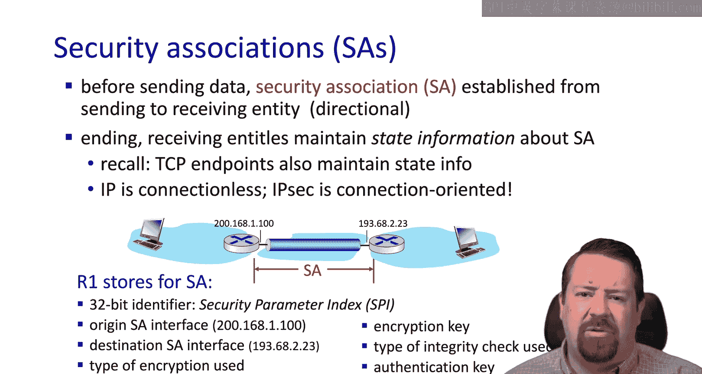

So here we can see our original IP diagram being encapsulated inside the IP Sec diagram。

And we have the complete new IP header followed by the ESP header。

 which includes the identifier and the sequence number。

Note that most encryption mechanisms require processing of data in order。

 and so it's important that the tunnel deliver its datagrams in order。

 hence the need for the sequence number。The fields in green are encrypted and are followed by the ESP Aation section。

Also， if you recall， block ciphers work on certain size chunks of data。

 hence the need for the ESP trailer， which is included in the encrypted data and includes padding as well as specifying the padding length so that the padding can be removed on receiving and once the block is decrypted。

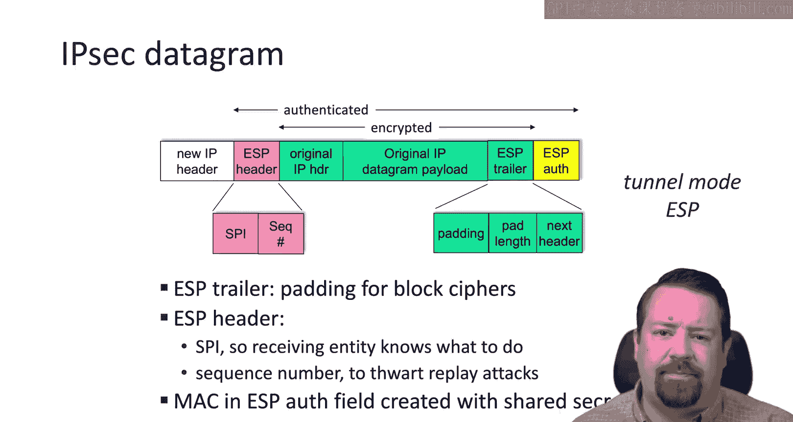

If we look at the operations to be performed at R1， we see that first it must append the ESP trailer。

 including that padding and related fields to the original data。

And then that will be encrypted along with the original data and IP header。

It then prepends the ESP header in front of this encrypted block。

And then creates the necessary authentication digest over all of this information。

 and appends that forming the complete payload for the new IP packet。

The new IP header does not take any information from the existing IP header。

The addresses in the new IP header are those belonging to the tunnel endpoints。

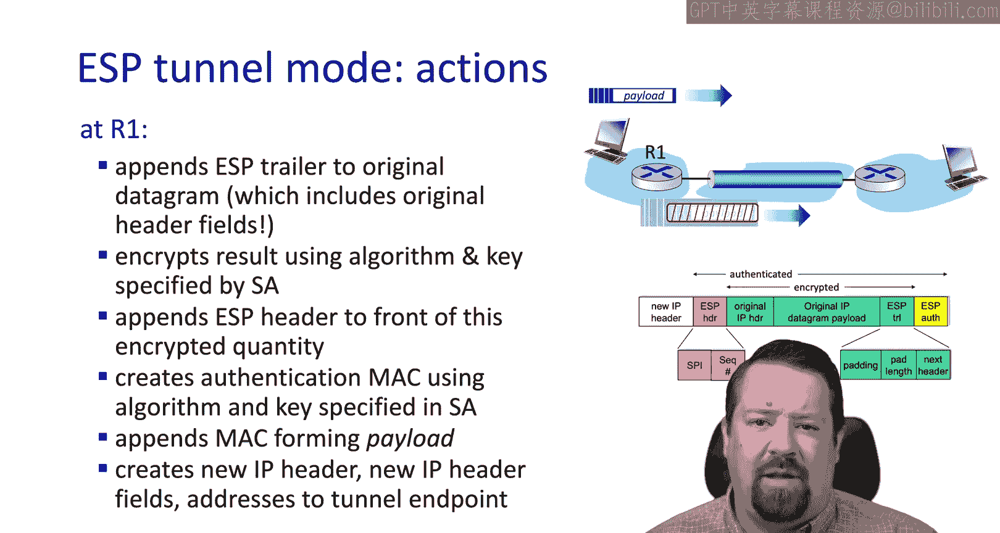

Let's look the IPS sequence numbers and see how they differ from the TCP sequence numbers that we're familiar with。

So the sequence number is a counter， not a byte sequence。

 each time a datagram is sent through this security association。

 the sender increments its sequence number counter。

 and it places the value in the sequence number field。In this way。

 the receiver can detect if any duplicates are received so that it a would not insert duplicate data。

 but also would not accept data sent by an attacker， such as in the case of a replay attack。

The receiver does not keep track of every single received packet。

 but it does use a window of the packets that it expects to receive。

 We should note that in many cases， not every packet is going to be sent through this security association。

 The router may have other interfaces functioning in normal I P mode。

 and even on the same interface may have different policy rules in place。

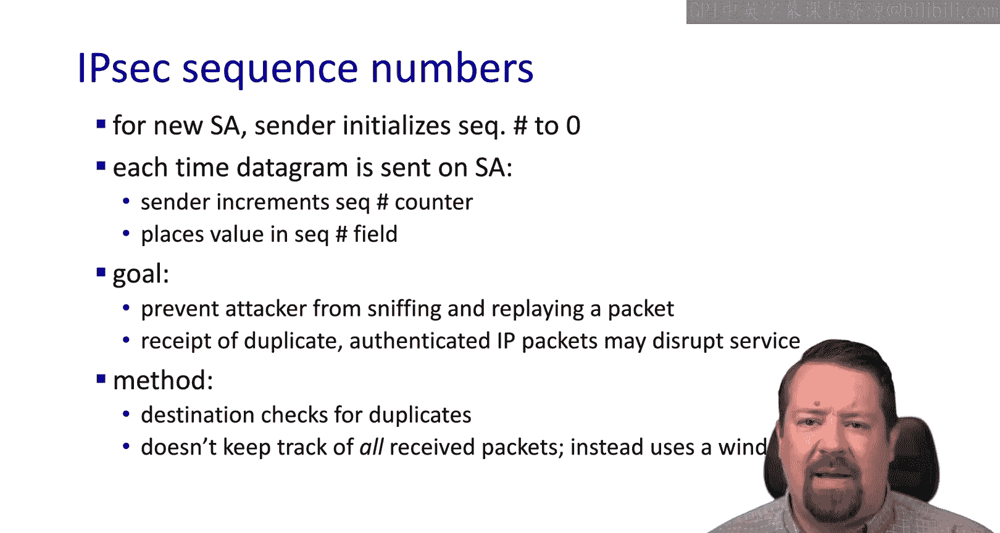

These rules are stored in a security policy database that specifies what criteria determine whether particular datagrams should go through the security Association。

A given router also may have multiple security associations in place。

 and so it needs to know which of those to use in the case that a datagram is supposed to use IPS。

These rules typically match things like IP sourceur and destination and protocol number。

In parallel with that， there's a security association database。

 which is where each endpoint stores all of its security association state。

Once a datagram has been designated as needing to be processed by one of the security associations。

The Security Association database has the information that tells the router what steps to take。

 meaning what encryption mechanism to use， where to send it， and so on。

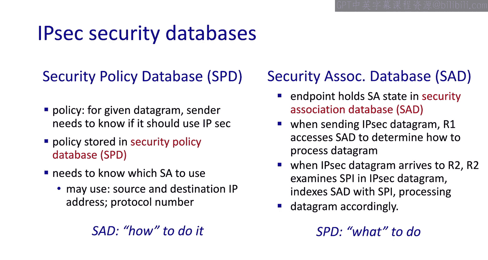

So assuming we have an attacker sitting between R1 and R2， and she does not know the keys in use。

 which are symmetric keys that have been shared in advance。

The Treaty will not be able to see the original contents of the datagram。

Also in the encapsulation mode， you will not see the original IP addresses， source destination。

 ports， etc of the datagram。You will see an IP header in the clear。

But it contains the IP addresses of the two routers forming the tunnel。

Not the end to end information of the hosts that are sending the encrypted content。

She will not be able to flip bits without detection because of the data integrity check。

And she would not be able to mask grade as either R1 or R2。

 because you won't know the secret keys needed to authenticate to the other end of the connection。

 And lastly， the association is protected against replay by the use of sequence numbers。

Now the sequence number is in the clear， as we saw， however。It's covered by the integrity check。

 which is keyed， and so Trudy would not be able to change the sequence number and then regenerate a valid integrity check either。

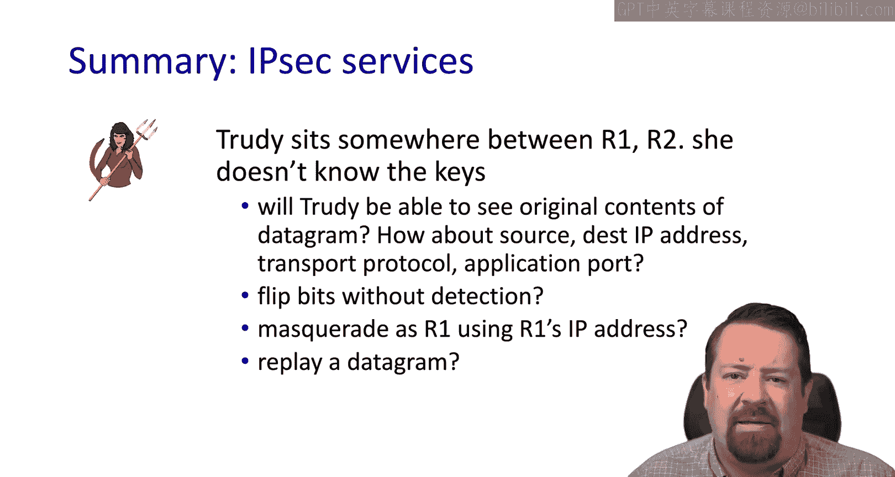

In many cases， IPSVPNs are configured manually or through the sharing of a configuration file to a bunch of users that connect to the same end point。

And this will include things like the IP addresses， protocols， keys， etc。However。

 for very large systems， this is impractical。As an alternative， we have IkeE Internet key Exchange。

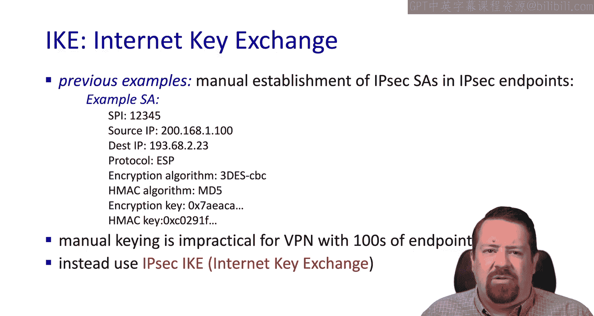

IKE supports two different modes。 PSK pre shared key where users are given a shared secret。

 which with to authenticate or PK I， the public key infrastructure involving certificate authorities。

 as we've seen before。In the case of PSK， both sidess start with the same secret。

They run the IKE algorithm to authenticate each other。And generate their security association。

Note that there's a security association in each direction and that the pre shared secret is not used as the encryption key。

 but it as a starting point to generate both an encryption key and an authentication key。

In the PKI case， both sides start with the public private key pair and certificate。

 and again use IKE to21 key each other and proceed from there very similar to the handshake mechanism we saw for TLS。

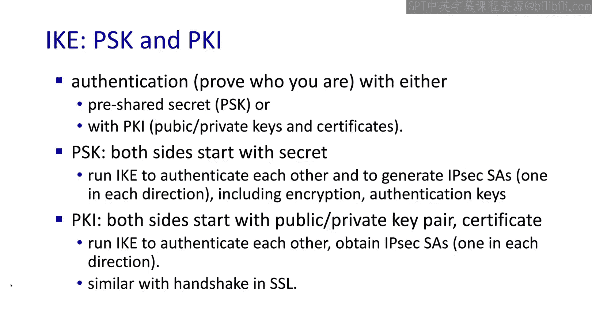

Within the IKE algorithm， there are two phases。First is establishing a bidirectional IKE Security Association。

Which is different from an IP sex Security association， so don't fuse the two terms。

This is also known as the ISAKMP Security Association。

It then uses this association to securely negotiate the IPS pair of security associations。

It can be used in two different modes， either a faster mode with fewer messages or a slower mode that is able to achieve identity protection and has more options。

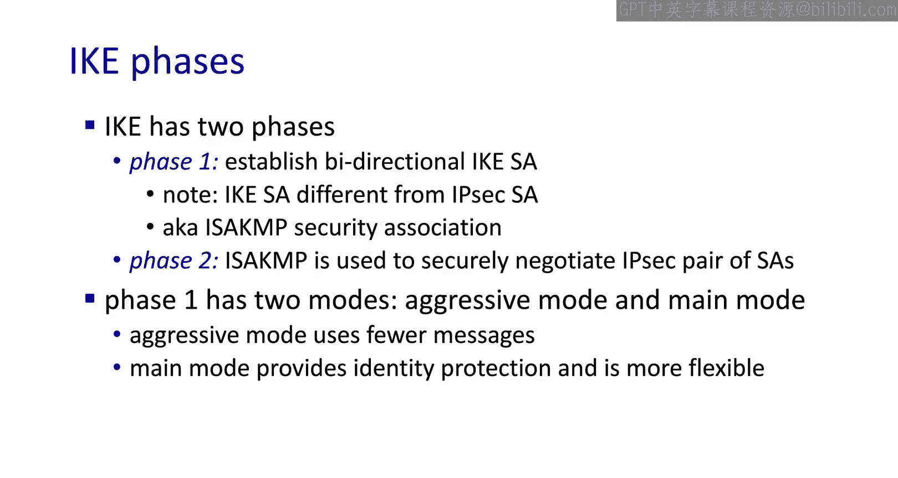

So we' wrapping up you have a few takeaways from our discussion of IPSec。

It uses the IKE message Exchange to negotiate what algorithms will use， what the secret keys will be。

 remember it starts off with either public keys or shared secrets。

 but it has to negotiate the session keys。And it also negotiates the SPI numbers。

 which are identifiers for each association。It can operate in either authentication header mode。

Or the encapsulation mode， with encapsulation being much more common because it provides encryption。

 meaning it provides data confidentiality。The IPS Pes can be any two systems that run IP。

So it could be two routers talking to one another。To end systems talking to one another。

 but commonly it is one end host talking to a router or firewall。

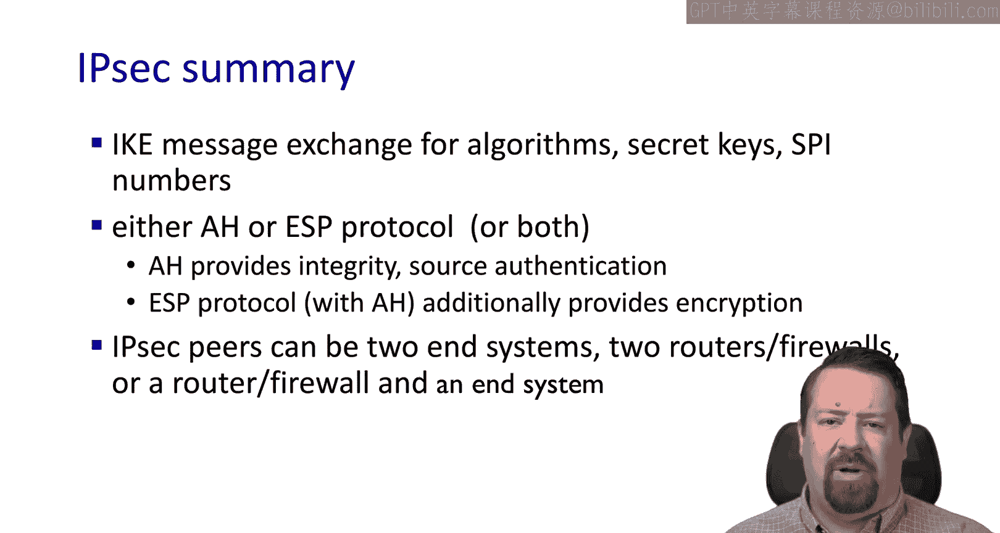

So that's where we'll stop this video。In the next talk。

 we'll be looking at security and wireless and mobile networks。

 including both WiF and cellular networks See you then。

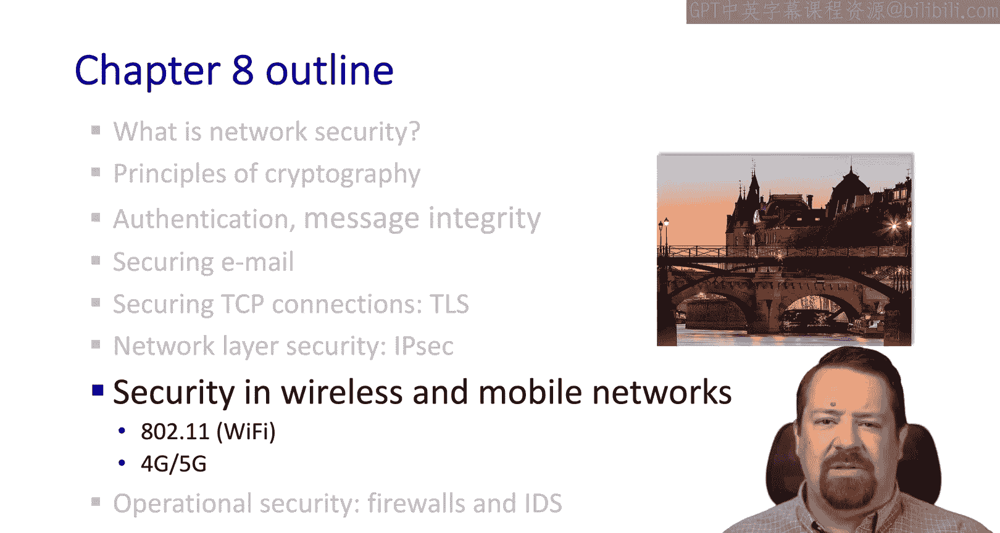

We hope you enjoyed this video， if you found it to be useful。

 please click the like button to be notified when more videos are posted for this class。

 please subscribe to our channel and click the bell。

