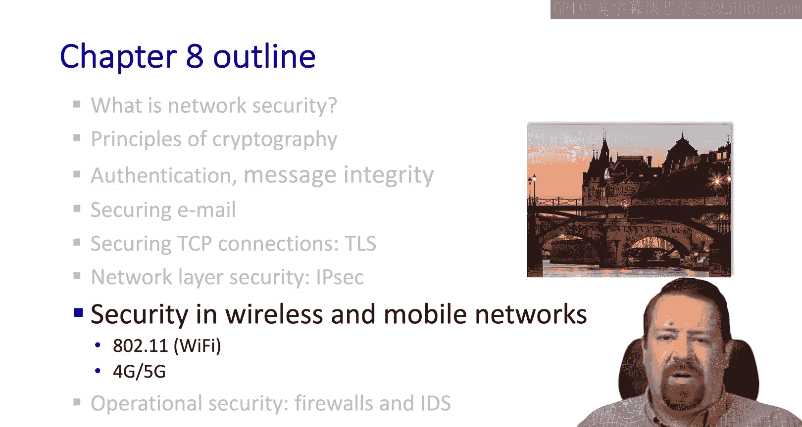
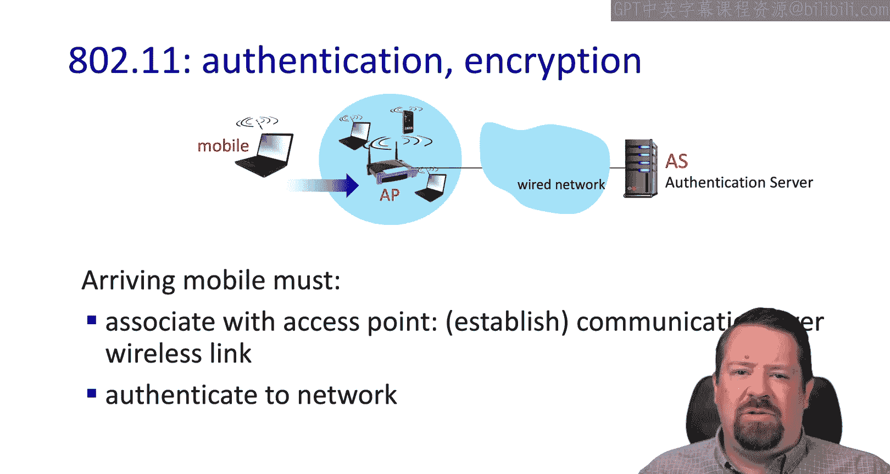
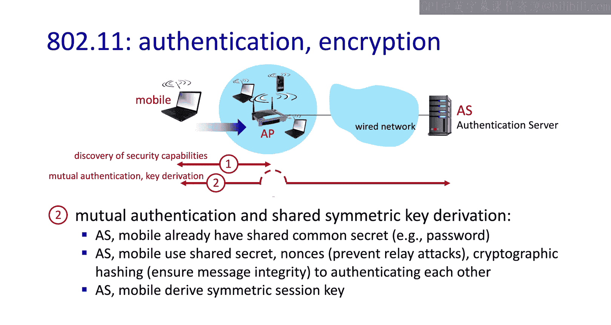
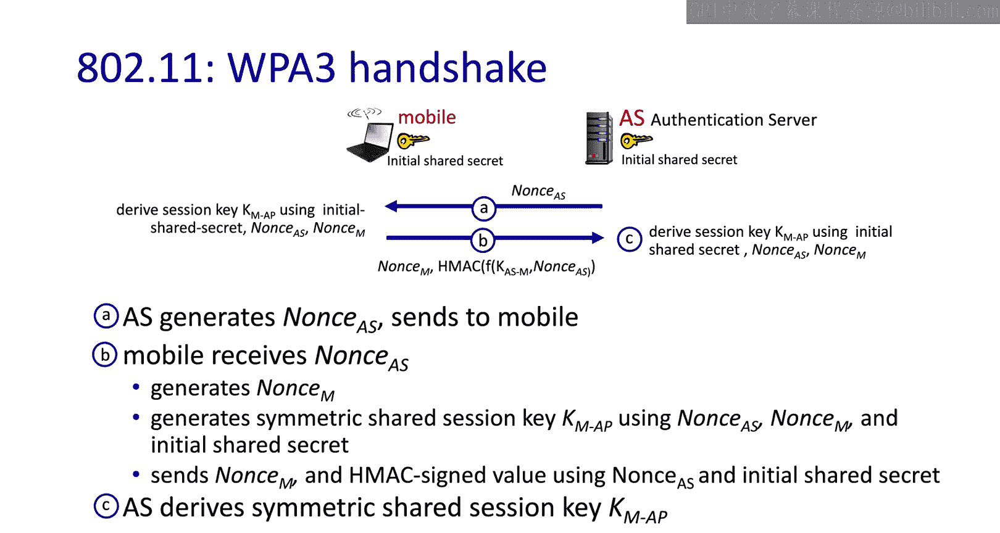
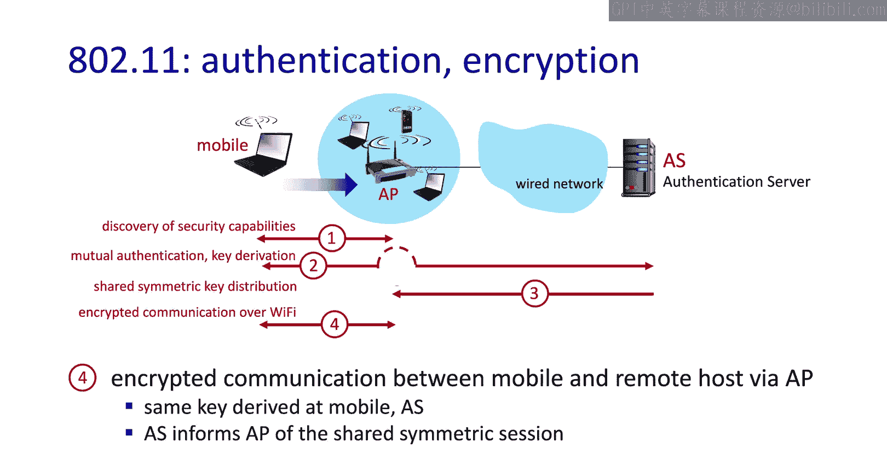
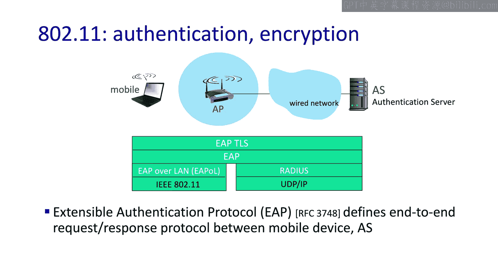
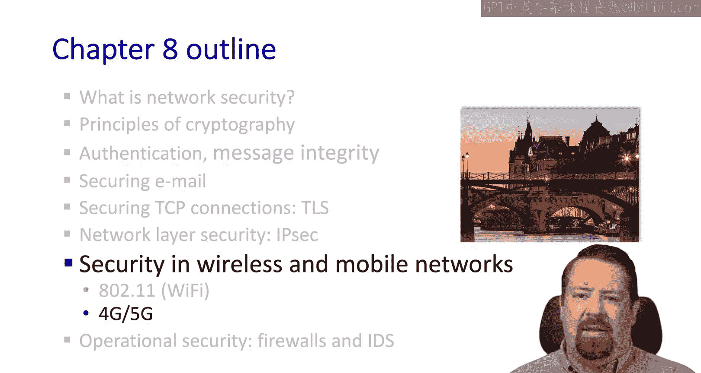

# 计算机网络：自顶向下的方法：第8章：无线与移动网络中的安全

## 概述
在本节课中，我们将要学习无线与移动网络中的安全机制，特别是**802.11（Wi-Fi）网络**的安全。由于无线介质的共享特性，攻击者更容易窃听和传输数据，因此安全措施至关重要。我们将重点探讨Wi-Fi保护接入（WPA）的认证与密钥交换过程。

## Wi-Fi（802.11）安全简介
上一节我们介绍了移动节点与接入点的基本关联过程。本节中我们来看看在建立基本通信连接后，如何进行安全认证与密钥交换。

无线网络比有线网络更易受到攻击。在有线网络中，窃听光纤或铜缆需要物理接触且容易被发现，而在无线域中，攻击者可以悄无声息地记录或传输数据。

## 认证与加密机制
关联之后，移动设备需要交换凭证以进行网络认证。首要问题是需要何种类型的认证。

接入点本身会广播其支持的认证形式和加密方法。移动设备在关联时可以请求特定的认证和加密机制。然而，此时移动设备尚未拥有安全通信所需的加密密钥。

与其他安全方案类似，共享秘密（如密码）不会直接用作加密密钥。因此，移动设备和接入点必须基于此共享秘密协商出一个共享的对称密钥。

## WPA3握手过程
目前802.11最新标准化的安全协议是**WPA3**。以下是WPA3的握手过程：

以下是WPA3四次握手的关键步骤：
1.  **认证服务器生成随机数N_AS**，并将其发送给移动设备。双方都知道初始共享秘密（如密码）。
2.  **移动设备生成自己的随机数N_MD**，并使用两个随机数（N_AS, N_MD）和初始共享秘密，生成一个对称的共享会话密钥 `K_M_AP`。
3.  移动设备将所有信息通过加密签名值发送回认证服务器。
4.  认证服务器以与移动设备相同的方式，独立推导出相同的对称共享会话密钥 `K_M_AP`。

**核心概念**：密钥 `K_M_AP` 从未在空气中传输。双方从相同的基本元素中独立推导得出，确保了密钥的安全性。

握手过程还包含随机数以防止重放攻击，并包含密码学哈希以确保消息完整性。所有交换都在无线域广播，攻击者容易窃听，因此这些措施必不可少。

## 相互认证与密钥分发
假设握手成功，移动设备和接入点能够相互认证。这是一种**相互认证**，对于防止建立恶意接入点（Rogue AP）的攻击至关重要。因为SSID是明文广播的，攻击者很容易创建一个与移动设备之前见过的SSID相同的恶意接入点。

相互认证完成后，认证服务器和移动设备派生出对称会话密钥。

共享密钥派生后，认证服务器必须将其提供给接入点。因为加密会话仅发生在移动设备与接入点之间，流量不会一直隧道传输到认证服务器。实际上，认证服务器可能与接入点位于同一设备中，但它们是逻辑上独立的功能，尤其在多个接入点由一个认证服务器支持的情况下，可能位于不同设备。

一旦移动设备和接入点都拥有共享会话密钥 `K_M_AP`，加密通信即可开始。

## 扩展认证协议（EAP）与RADIUS
我们提到了移动设备与接入点及认证服务器之间的通信。这段通信本身也不能以明文进行。

因此，我们使用**扩展认证协议（EAP）**。EAP定义了移动设备与认证服务器之间（通过接入点）的端到端请求-响应协议。

在无线侧，EAP over LAN（EAPoL）运行在802.11之上。而在接入点与认证服务器之间，则使用**RADIUS协议**。因此，接入点通过RADIUS与认证服务器通信，认证服务器也常被称为RADIUS服务器。

## 总结
本节课中我们一起学习了无线局域网（802.11/Wi-Fi）的安全机制。我们探讨了从基本关联到安全认证的必要性，详细分析了**WPA3协议的握手过程**，理解了对称会话密钥 `K_M_AP` 如何在不经空中传输的情况下被双方独立推导。我们还介绍了**相互认证**的重要性以及**EAP和RADIUS协议**在端到端安全认证中所扮演的角色。这些机制共同构成了保护Wi-Fi网络免受窃听和中间人攻击的基础。

在下一个视频中，我们将探讨蜂窝网络（4G/5G）中的安全。