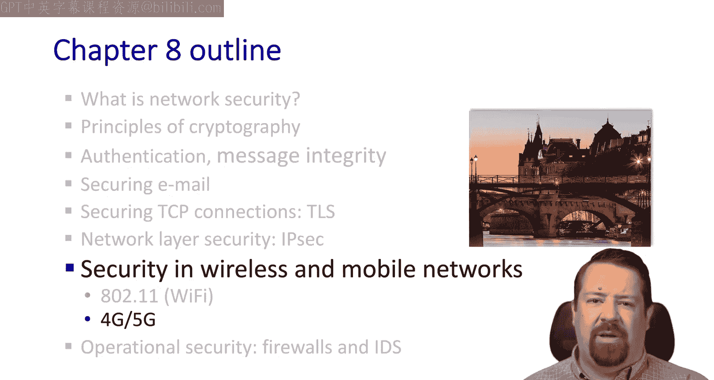
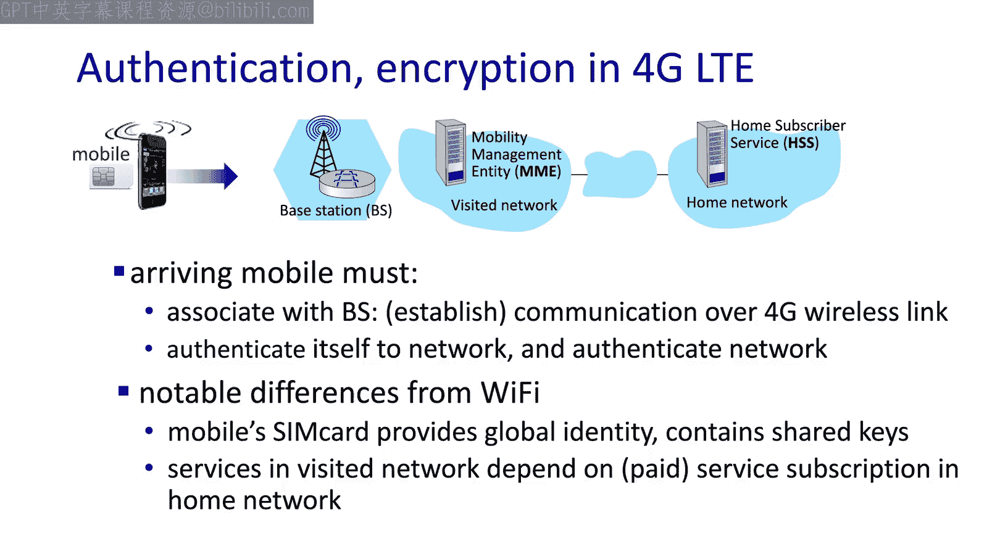
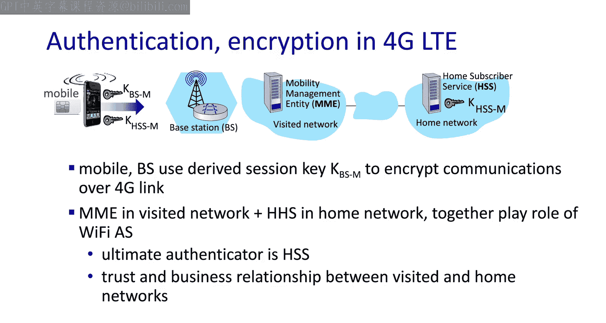
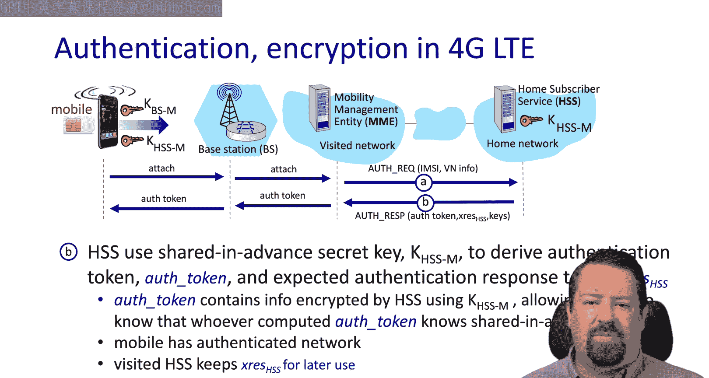
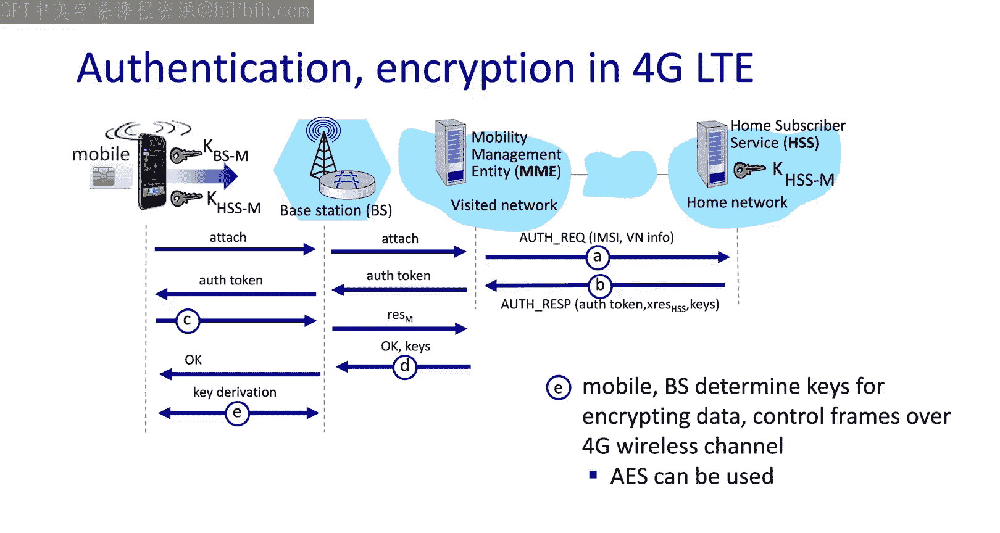
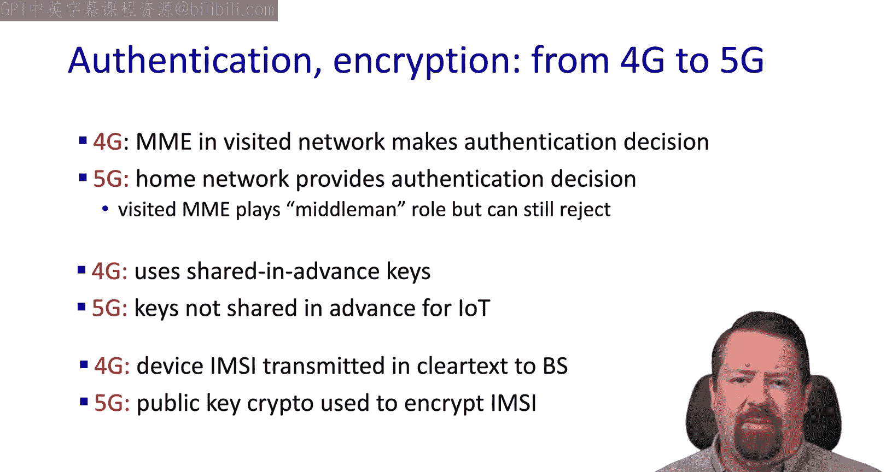
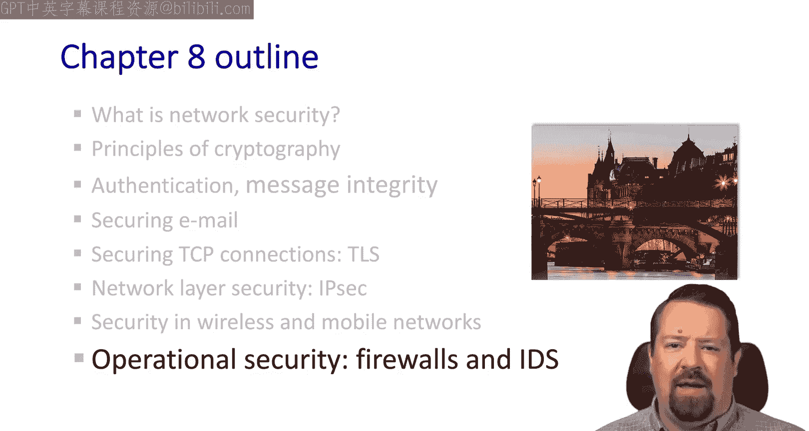

# 计算机网络：自顶向下的方法：第8章：蜂窝网络（4G/5G）中的认证与密钥交换 🔐

在本节课中，我们将学习蜂窝网络（特别是4G和5G）中的安全机制，重点关注移动设备如何安全地接入网络并进行认证与密钥交换。

在上一章中，我们初步了解了蜂窝网络中的认证过程，但并未涉及加密方面。本节我们将深入探讨这一完整的安全流程。

## 蜂窝网络安全概述 📡

与Wi-Fi场景不同，蜂窝网络中的移动设备配备了一张SIM卡。这张卡提供了一个全球唯一的身份标识，并包含了与运营商共享的密钥。正确认证移动设备的一个关键驱动力是，运营商需要将其与用户付费的服务套餐进行匹配，并提供相应的付费服务。

## 4G LTE 认证与密钥交换流程

以下是4G网络中移动设备接入和认证的核心步骤。

### 初始接入与认证请求

移动设备首先连接到基站，该请求被转发给拜访网络中的移动性管理实体。

1.  **移动性管理实体** 生成一个认证请求，其中包含设备的国际移动用户识别码以及拜访网络的信息。
2.  该请求被发送到归属用户服务器。MME根据IMSI号码（存储在全局数据库中）知道应该连接哪个归属网络。
3.  **归属用户服务器** 决定是否授权此连接。这包括验证认证信息的有效性，以及检查用户套餐是否允许在此拜访网络中漫游。

### 密钥派生与令牌传递

HSS知晓移动设备SIM卡上的预共享密钥，并使用它来派生出认证令牌和期望的认证响应。

1.  HSS将认证令牌、响应令牌以及会话密钥发送回MME。
2.  **重要**：HSS不会将初始的共享密钥发送给MME。拜访网络不被信任到与归属网络相同的级别。
3.  认证令牌使用初始共享密钥加密，因此移动设备能够验证它确实来自归属网络。

### 移动设备验证与会话建立

此时，移动设备间接认证了网络，因为它确认拜访网络能够从归属网络获得有效的认证令牌。

1.  移动设备生成认证响应，并将其发送回拜访网络。
2.  拜访网络根据HSS之前提供的期望响应来验证此认证响应。
3.  验证成功后，移动设备在拜访网络中得到认证。
4.  拜访网络为基站生成会话密钥，移动设备也执行密钥派生。
5.  至此，无线信道拥有了一个共享的对称密钥，可用于AES协议进行加密通信。

## 从4G到5G的安全演进 🚀

上一节我们介绍了4G的安全流程，本节我们来看看5G带来的关键改进。

从4G演进到5G，安全机制发生了重要变化：

*   **认证决策权**：在4G中，拜访网络的MME做出认证决策；而在5G中，归属网络提供最终的认证决策（尽管MME仍参与并可拒绝认证）。
*   **物联网设备密钥**：对于物联网设备，5G中不再预先共享密钥。
*   **隐私增强**：4G中存在一个主要的隐私问题：设备以明文形式向基站传输其IMSI号码，这使得设备可被长期跟踪。5G通过使用公钥密码学在初始交换中加密IMSI号码，解决了这一限制。

## 总结与展望

本节课中，我们一起学习了蜂窝网络（4G和5G）中认证与密钥交换的基本流程。我们了解了移动设备如何通过SIM卡中的预共享密钥，在归属网络的协助下，安全地接入拜访网络并建立加密会话。同时，我们也看到了5G在增强隐私和调整密钥管理方面所做的改进。

无线与移动网络的安全是一个持续演进的领域，了解从1G到5G的安全发展史有助于理解当前设计的考量。在接下来的课程中，我们将转向操作安全领域，探讨防火墙和入侵检测系统。