# 计算机网络：自顶向下的方法：第8章：防火墙与入侵检测系统 (IDS) 🔒

在本节课中，我们将学习操作安全的核心组件：防火墙和入侵检测系统。我们将探讨它们如何作为“中间盒”在网络中工作，以隔离可信的内部网络与不可信的公共互联网，并识别和阻止恶意流量。

---

## 防火墙概述 🛡️

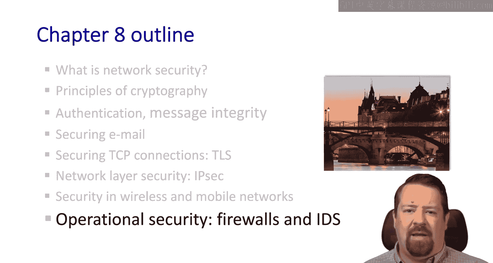

防火墙是一种中间盒设备，用于将组织内部网络与更大的公共互联网隔离开来。它决定哪些数据包可以通过，哪些应该被阻止。通常，防火墙内的网络被认为是可信的，而防火墙外的则被认为是不可信的。

上一节我们介绍了防火墙的基本概念，本节中我们来看看防火墙旨在防御哪些攻击。

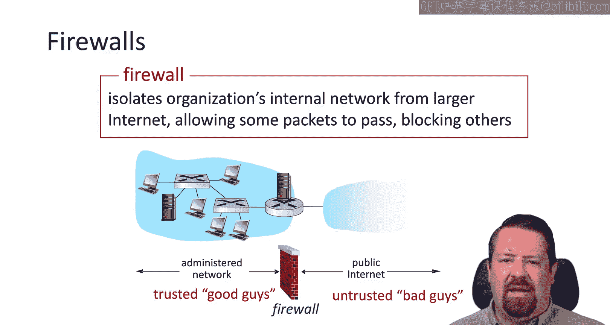

以下是防火墙试图防止的一些常见攻击：
*   **拒绝服务攻击**：攻击者发送大量SYN消息或其他旨在耗尽受害者主机资源的消息。
*   **非法访问内部数据**：保护某种形式的知识产权。
*   **篡改公司对外形象**：黑客试图替换网页部分内容，以达到污损或恶意利用的目的。

我们可以将防火墙分为三类，它们大致按复杂度递增排列：
1.  **无状态包过滤器**
2.  **有状态包过滤器**
3.  **应用网关**

随着列表向下，防火墙机制变得更复杂、更消耗CPU，也可能对网络性能产生更大影响。

---

## 无状态包过滤器 📦

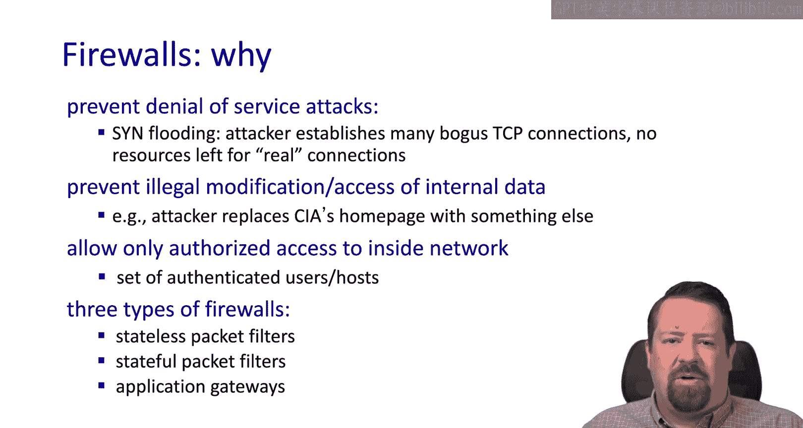

我们的第一个案例是无状态包过滤器。这种防火墙对数据包逐一应用规则，仅根据单个数据包的属性来决定转发或丢弃。

以下是其检查的字段示例：
*   源IP地址和目标IP地址
*   TCP和UDP的源端口和目标端口号
*   ICMP消息类型
*   TCP标志位

这是最原始的防火墙类型。虽然它能捕获许多问题并阻止未经授权的流量，但它也有无法做到的事情，我们将在研究更复杂的类型时看到。

例如，防火墙可能配置一条规则，阻止使用TCP源或目标端口23的传入和传出数据报。端口23是Telnet，许多组织会阻止Telnet，因为用户名和密码以明文传输。

另一条规则可能阻止IP协议字段为17的数据报，即UDP协议。当然，使用UDP的最常见应用是DNS，因此这会阻止网络内部用户访问外部DNS服务器。

另一条示例规则可能是阻止ACK位等于0的传入TCP段，旨在防止外部客户端与内部客户端建立TCP连接。但由于现代操作系统会随机化初始序列号，这条规则可能效果不佳。

---

## 无状态包过滤器规则示例 📝

以下是更多我们可能使用的规则示例：

如果我们的策略是禁止外部网络访问，那么可以丢弃所有发往TCP端口80的数据包。当然，许多网站使用端口443的HTTPS，因此也必须丢弃这些。

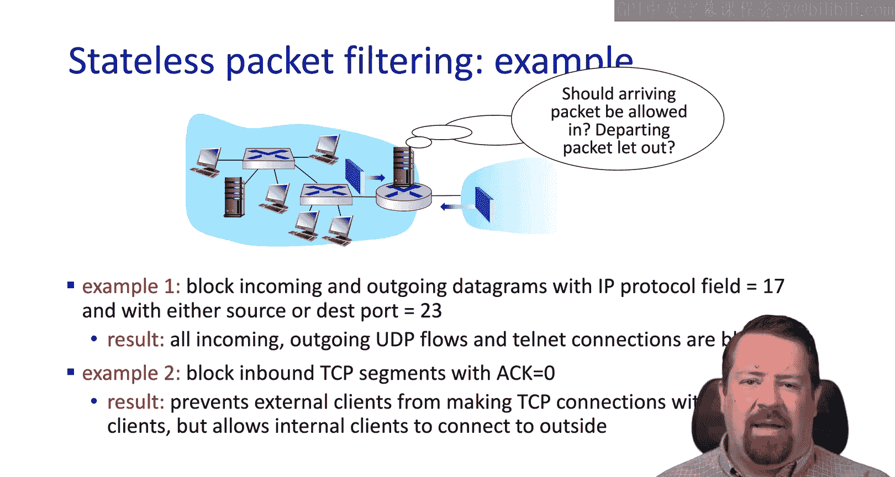

如果我们想阻止传入的TCP新连接建立，但允许发往特定Web服务器的连接，可以有一条规则：丢弃所有传入的TCP SYN包，除了发往特定Web服务器IP地址和端口号的。

我们可能希望通过阻止UDP数据包来屏蔽网络广播，尽管大多数流媒体已迁移到HTTP上运行。在这种情况下，如果我们仍想允许DNS，就必须明确允许它。

另一项策略可能是防止机构网络被用作Smurf DoS攻击的一部分，这可以通过丢弃所有发往广播地址的ICMP数据包来实现。

最后一个示例是阻止Traceroute，这可以通过丢弃所有传出的ICMP TTL过期消息来实现。

---

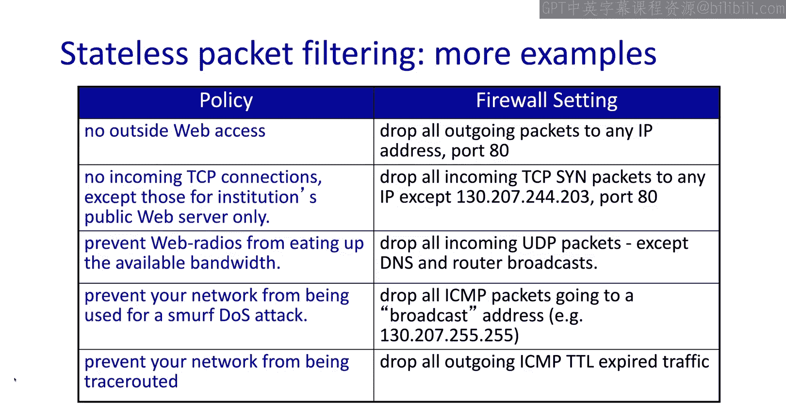

## 访问控制列表 (ACL) 📋

这些规则通常以表格形式实现，称为访问控制列表。ACL规则按顺序应用，第一个匹配的规则将被应用于该数据包，数据包不会看到表的其余部分。

例如，我们允许源地址在内部网络、协议为TCP、源端口为临时端口、目标端口为80的数据包通过，这些是外发的Web流量。

然后，我们也必须允许传入的Web流量（不是新连接，而是对我们外发连接的响应）。这条规则看起来非常相似但方向相反：它允许网络外部的源地址联系网络内部的目标地址，协议为TCP，源端口为80（来自Web服务器），目标端口为临时端口，并且设置了ACK标志。

我们还允许UDP端口53的流量，即DNS请求和响应。

然后，我们拒绝其他所有流量。因此，ACL底部通常有一条明确的拒绝规则。

---

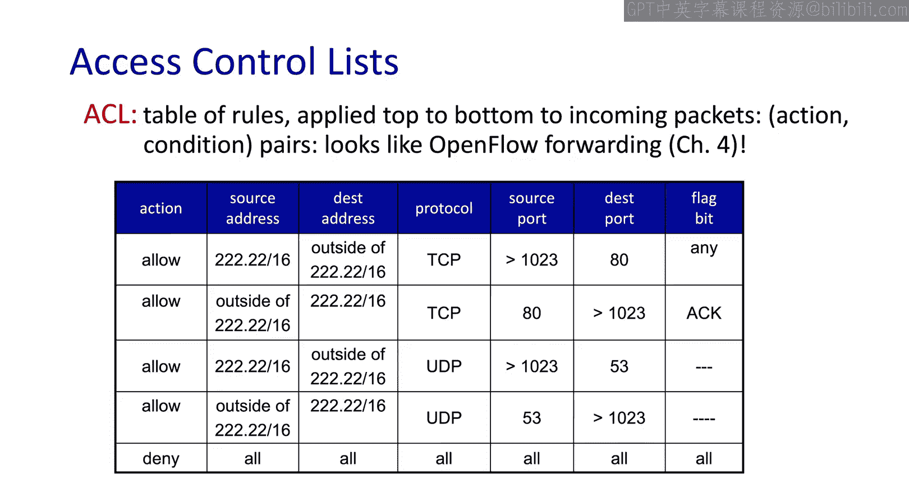

## 有状态包过滤器 🔄

现在我们来看看有状态包过滤器的局限性。主要在于无状态工具不够复杂，因此仍可能有不符合逻辑的数据包通过此规则集。例如，我们允许这些ACK包通过，但可能没有对应的已建立连接。

有状态包过滤器会跟踪通过它的每个TCP连接的状态。它知道连接何时建立、何时拆除，因此可以决定何时从跟踪状态中移除这些连接。它知道连接是传入还是传出的。

因此，如果一个TCP数据包出现，它不匹配任何现有会话，也不是新的连接建立请求，那么即使它原本匹配某条规则并被允许，防火墙也可以丢弃这些数据包。

有状态包过滤器还可以使非活动连接超时。即使没有发生明确的FIN，一端或另一端的主机可能已消失，防火墙可以将其从表中移除，并不再允许数据包发往它们。

当然，如果超时设置过于激进，导致长TCP会话被防火墙中断，可能会给网络带来很多问题。

---

## 有状态ACL示例 🔍

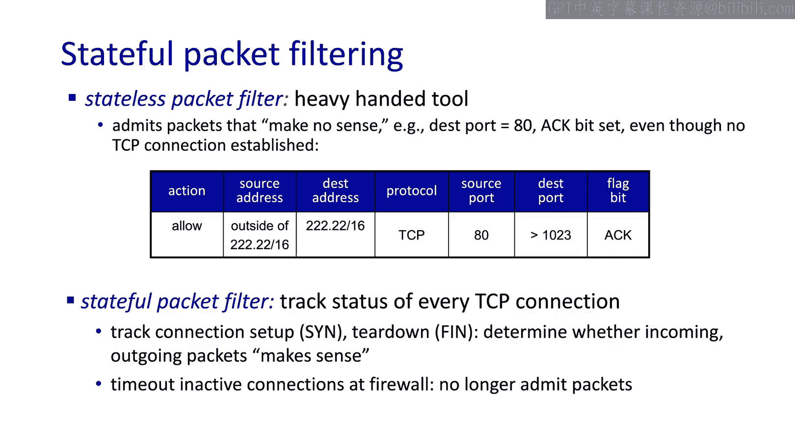

现在，在我们的有状态包过滤器ACL列表中，我们有相同的规则集。但在允许某些数据包之前，我们会检查连接是否存在。

在我们的第一条规则中，我们明确允许SYN请求通过，因此不需要现有连接。然而，在第二条规则中，我们只允许ACK包通过，而不是任何随机数据包，因此这些数据包应匹配现有连接。我们将在第二条规则上进行检查。

同样，在第三条规则中，我们允许初始DNS请求发出，但返回的响应应匹配由外发请求建立的现有会话。如果不匹配，我们将不允许这些数据包进入。

---

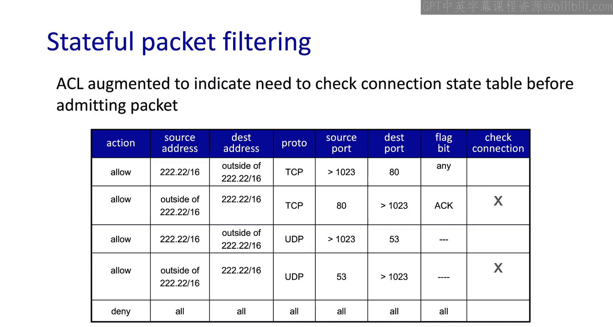

## 应用网关 🚪

现在，我们来到最复杂的版本：应用网关。我们可以将有状态包过滤器视为在传输层操作，它理解端到端的流以及数据包应属于的关联。

应用网关则上升到应用层本身，它理解特定应用程序的工作原理，并根据这些应用层协议的规则决定应允许或阻止什么。

在这个示例中，我们希望允许一些用户Telnet到外部。因此，它将要求所有Telnet用户通过网关进行Telnet，而不是直接Telnet到他们的外部地址（这将被防火墙阻止）。用户必须通过网关连接，如果用户获得授权，网关会建立到目标主机的Telnet连接。

从TCP的角度来看，这个应用网关始终位于连接的中间。主机与应用程序网关建立TCP会话，而应用程序网关与最终目的地建立新的TCP会话。顺便说一句，这个应用网关必须被允许通过防火墙才能到达目的地。

路由器会阻止所有不是来自网关的Telnet连接，这简化了其规则集。

---

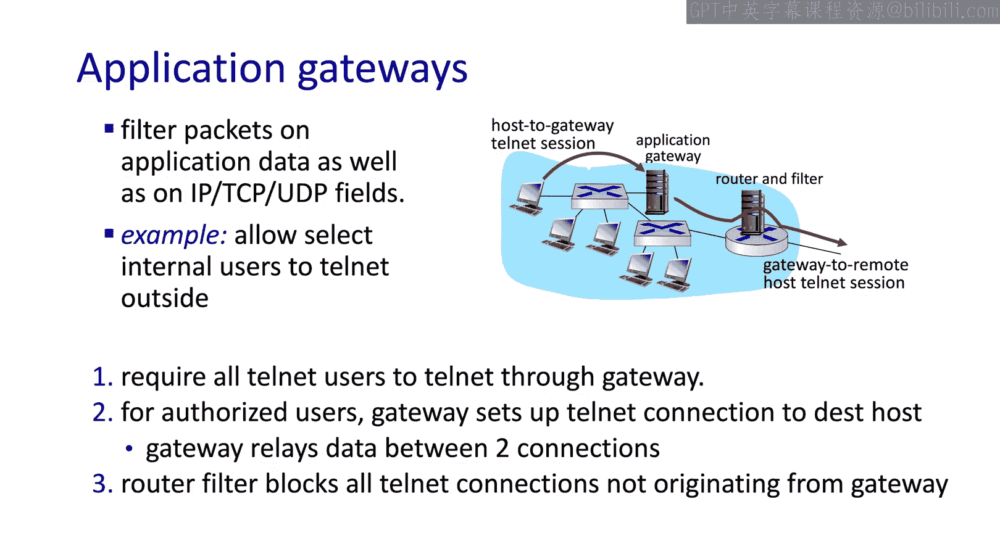

## 防火墙与网关的局限性 ⚠️

在处理防火墙和网关时，我们有一些局限性。

第一是IP欺骗。IP地址没有任何验证，因此互联网上甚至本地网络上的许多实体可以更改源IP地址为其他人的地址并发送数据包。

应用网关的另一个局限性是，每个需要特殊处理的应用程序都需要一个对应的网关。用户很难采用需要通过防火墙的新应用程序。甚至应用网关的创建可能远远落后于特定应用程序本身的流行。

此外，该特定应用程序的客户端软件必须能够配置为与中间网关通信，网关不是透明的。

与往常一样，所需的安全程度与施加给网络上主机的可用性和不便性之间存在权衡。即使有了所有这些机制，许多高度受保护的站点仍然会遭受通过其他途径的攻击。

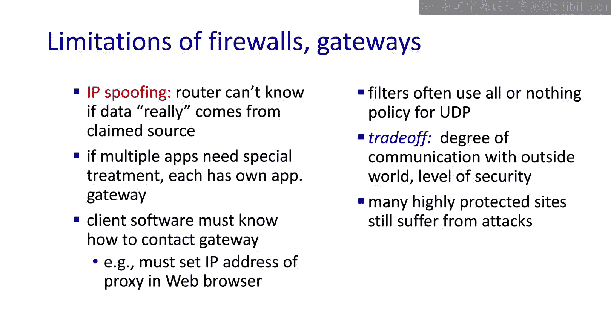

---

## 入侵检测系统 (IDS) 👁️

现在我们转向入侵检测系统。我们注意到这些系统有一个更高级的版本，称为入侵防御系统。

一般来说，IDS或IPS基于深度包检测工作。它检查数据包内容，而不仅仅是报头中的几个字段，并且可以根据各种事物检查这些内容。

例如，已知的病毒签名或已知的攻击字符串（导致溢出或SQL注入攻击等）。它可以忽略这个数据包声称要发往哪个端口、属于哪个应用程序，而直接判断其中是否有任何内容看起来像已知的恶意内容。

它还可以查看多个数据包的序列以寻找关联，甚至进行重组。一些攻击者可能更复杂，将攻击分散在多个数据包中，IDS可以在查找其签名之前将这些数据包重新组合。

其他类型的关联包括端口扫描（发往特定目的地的一系列数据包，尝试大量不同端口，这不是合法应用程序的典型行为）或网络映射（看起来像Traceroute的数据包，无论是传入还是生成大量传出的TTL过期消息）。

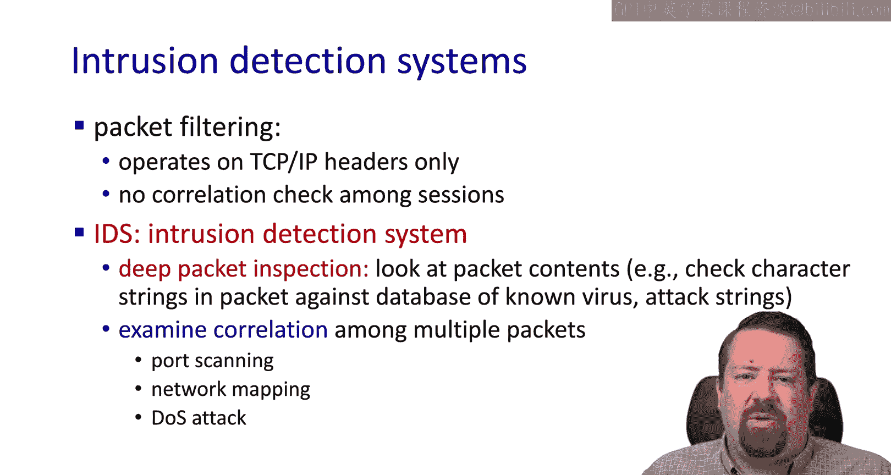

或者拒绝服务攻击，其中来自许多不同源地址（无论是伪造的还是其他）的数据包都发往单个受害者IP地址。

---

## 非军事区 (DMZ) 与IDS部署 🏝️

我们在这里还要提到非军事区。组织通常将任何需要从外部访问的服务器放在与其内部网络分开的单独网络中。由于这些机器因外部访问而更脆弱，这有助于防止它们在遭到入侵时被用来攻击内部网络。

IDS传感器可能与防火墙放在一起，但也可以放置在网络周围的多个有利位置。通常应位于DMZ和内部网络之间，以检测任一位置的入侵。

然而，我们很可能不希望将IDS放在防火墙外部，因为那样IDS将不得不处理许多可能被防火墙阻止的攻击，而用无状态或有状态包过滤器阻止这些攻击在计算上要便宜得多。

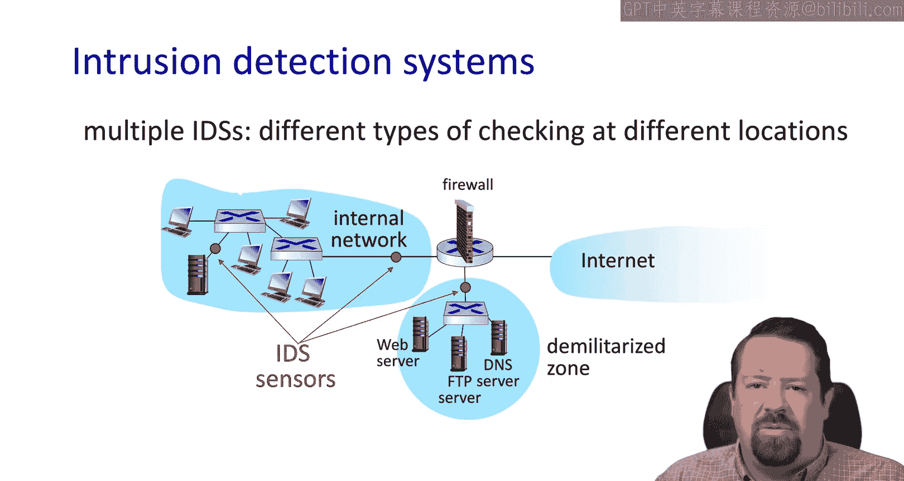

---

## 总结 📚

我们将IDS保持在防火墙后面。这为我们网络安全章节的学习画上了句号。

我们首先研究了基本技术，包括密码学（对称和公钥密码学）、消息完整性和端点认证的概念。然后我们看到了这些技术的许多应用，当然这些并非全部应用，但包括安全电子邮件、用于HTTPS和其他端到端加密TCP连接的TLS、常用于VPN的IPsec，并简要介绍了无线安全，了解了802.11以及4G和5G蜂窝网络如何协商加密。

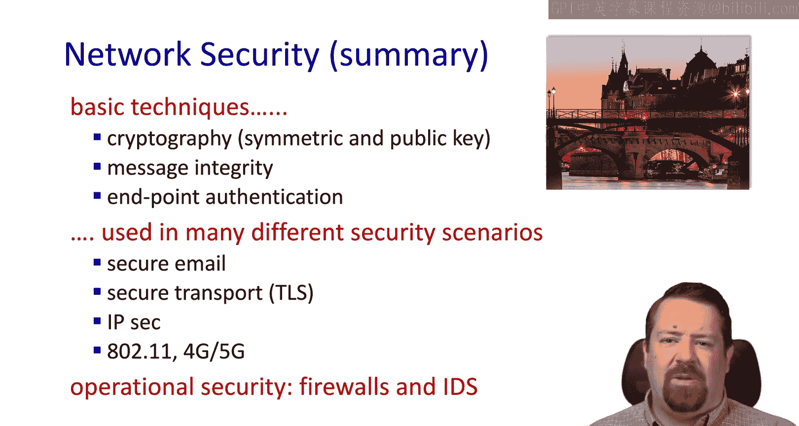

最后，我们以防火墙和入侵检测系统这些中间盒安全机制作为结束。

本节课中，我们一起学习了操作安全的核心——防火墙和入侵检测系统。我们探讨了从简单的无状态包过滤到复杂的应用网关等多种防火墙类型，了解了它们的工作原理、规则配置及各自的局限性。同时，我们也认识了入侵检测系统如何通过深度包检测来识别复杂攻击，并了解了DMZ在网络架构中的安全意义。这些知识是构建安全网络环境的重要基石。