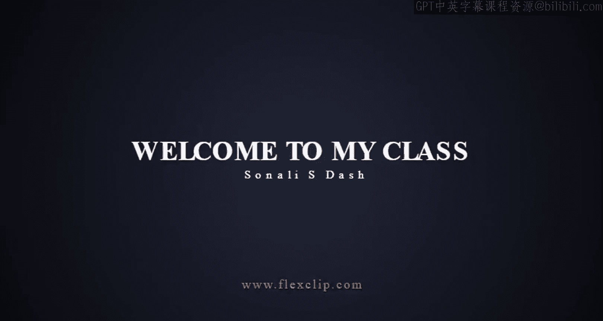
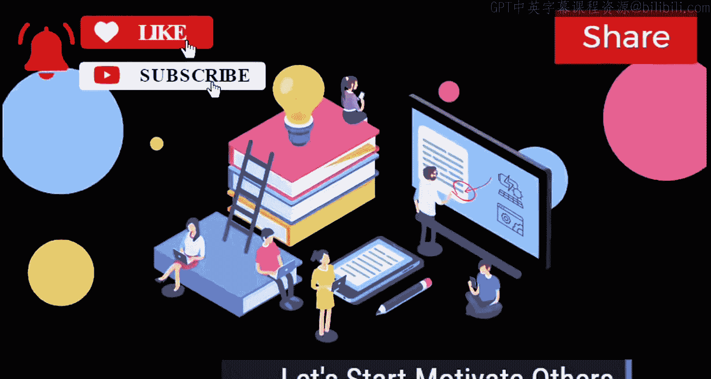
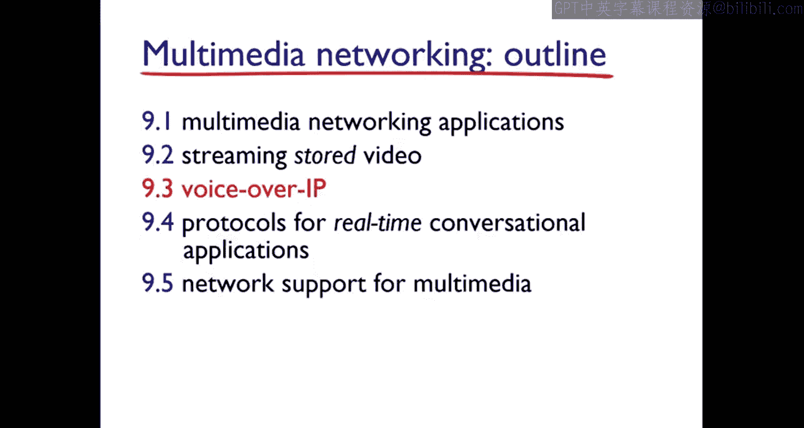

# Jim Kurose《计算机网络：自顶向下的方法｜Computer Networking： A Top-Down Approach》中英（deepseek p64 -64-#137 __ 65 Multimedia Networking __ Audio Video -BV1UMtueiEaA_p64-

Welcome students for today's class today we are going to start with the multimedia networking。

 which is of here like fifthP module。 So here there will be the outline clients how we are going through the multimedia networking the first one we are going to start with the multimedia networking applications then we will start with the streaming stored audio and video applications then voice over IP then protocols for realtime conal applications。

 then the network support for multimedia So these things we are going to cover it up。

 So moving towards the first slide here you can see the multimedia audio So before going to that you have to understand what do you mean by multimedia。

So what you people know about the multimedia。 So the multimedia is nothing but where we will have some of these signals。

 Okay， some audio signal and some video signals and all and we have to stream all this internet we have to streaming stream all this audio and video or IP telephony or any kind of your teleconferencing okay。

 whatever we are doing， all these applications has to run over your internet Okay。

 so you can have your interactive games over there。

 you can have your virtual world the distance learning all these things will be over your network so Major here this application will be a continuous process。

 Okay that is also known as your continuous media applications and also it will have one kind of your elastic applications that is also known as your email okay so through that only you will have your high quality。

😊，Of data rate through page， you are going to transfer or you are going to communicate with the other party with some of the performances。

 performances in the sense， you will have the latency or you will have the bandwidth or you will have the delay sensitive。

 all these things are going to be measured as your performance。

 So here you can see if I will talk only about the audio and whatever I told the wavength。

 So these are my analog signals。 Okay， so here， if I will take。😊。

The graph in my X axis as time and y axis as my audio signal amplitude。

 So how I'm going to measure it。 So I already told you that over the internet。

 if you are going to send any of your like any of your like streaming video or audio or anything。

 So that has to be measurable here。 Okay， they can provide many services， actually， okay。

 they can provide many services with high quality and with a very less error rate。

 or you can say that is a lost tolerant power。 fine So here all these things are going to be transfer with a constant data rate value and also this constant data rate can like communicate with like with another party or you can say the destination side with some of the values and some of the performances。

 So you make a small， small questions like two marks of question based on your。😊，mediadia。

 audio signals and all here for the telephone， there will be 8000 samples per second which used to tras from your source side to destination side。

 And if you are playing any musical things， then it will be 44100 samples per second are going to transfer from like your and through your analog signals。

 and suppose if I will quantize it quantized in the sense each sample。

 I will quantize that is I am going to do the rounded off then what will happen。😊，Then here on this。

 it will be like if I have two power8， then how many possible quantized values I will get to。

56 possible quantized values I will get。 It means that each quantized values will represent by bids okay here whatever we are transferring it will be represented as your bits and there will be8 bits for256 values。

 So the question can arise like how many bids you required for256 values。

 So you can have two power8 in the sense，8 bids are required for quantizing the two56 values。

 So this one will be your multimedia audio。 So if I move towards your next slide you can see if you have if you suppose unable to transfer the values Okay or you got some kind of your error。

 that is known as your quantization error or and also you can say that it is quantized。😊。

The value over your analog value So that is known as your quantization error。

 And what about this thing， this is nothing but sampling rate and which we are going to measure as n samples per second Okay。

 so now if I I have taken the example as 8000 samples per second and they have2 56 quantized values then 64000 Bps。

😊，Bs per second。 So what will happen， the receiver can convert the bits back to the analog signal whenever we will transfer all this that time what will happen is once we have transferred to send it back also we want like it had the signal has to come back in the term of your bits。

 which can reduce some of the quality。 Okay， so here there are some examples。

 whatever is the audio rate of all Cdmp3 and internet tele and also one more thing before going to video。

 I just want to clarify that some of the applications will be there。

 okay so you can say that that is the thing but your streaming of any audio or video quality So that time what will happen is we will have the stored media。

 okay， which will contain some prerecorded like prerecorded signals or prerecorded values will be there and。

😊，AllThese prerecorded values will be kept inside the server。

 So whenever any user wants to view or if you wants to pause or rewind or if you want to go for first forward。

 for that multimedia contents， then what will happen， it will be dependent on your response time。

 because actions， whatever it has been taken to pause or to rewind。

 it has to be made in the order of your seconds that you have to remember and also if you want to go for streaming a video or if you want to streaming a audio that time。

 any of the user when they will start the play out for a few seconds。

 then after once it will begin receiving the file from the server。

Then the user can like can receive the signals from one source to another locations。

 or you can say another server or from other files， it can receive and this kind of techniques。

 whatever we have that is known as our streaming and an streaming of audio and video and also it will help you to download any of the file before starting the plays。

 So these things are known as your like how you're going to store the video or how you're going to store the audio。

 how you're going to stream the audio and video Major apart from this two concept。

 you have one more concept that is known as your continuous play out。 Okay so in continuous play out。

 you once you have your play out begins， it will proceed the it based on your original time。

 whatever the recording has okay， and it requires。😊。

High quality of the picture or anything whatever has done。 and it will give you the end to end delay。

 Okay， like from the source to server to the client。

 it will give the end to end delay and also it will have the high quality of things。

 So these are are some three points， which I just wanted to highlight for you because this is the applications on your network multimedia networking。

 So now moving towards your multimedia video， you can see the sequence of images。

 which is going to display at a constant rate。 So here in this example。

 you can have 24 images per second。 Okay， so we can see only the only one very very easy。

 but actually how it is happening and how they have taken the datas and all how the digital image。

 how the array of pixels will be represented that things are also very important to know。

 So here in this digital image it will。😊，Have the array of pixel cells。 Okay。

 and each pixel cell will represented as your number of bys，So if you want to go for the coding。

 then what will happen， it will just use the redundancy within which and between the images。

 It will just decrease the number of bits， Whatever has been used to encode the image。

 So if we have done all these things within the image that is known as your special image special encoded version。

 And if you have done from image to text， then that is known as your temporal。 Okay。

 so how to know which one is special and which one is temporal you can see this image here。

 the special encodecoding example has given you can see there are some dots are there。

 So here what we are doing is we are sending some n values of same color。

 you can see from the beginning， we have some n values with the same color。 Okay。

 and also we are sending only two values。 What the two values we are sending the first one is your color value。

 That is your purple。😊，And also what more is the repeated values because whatever I have in the first。

 the second one also has to be said because I don't need any changes here in this part。

 So what I will do， Ill just repeat it。 So if I want to repeat any of the values。

 I should write the code or program in such a way that the value。

 whatever I have initialized in the prior like that is here I have initialize the color values as purple。

 So I'm just going to repeat how many times the number of times the like my screen is visible。 Okay。

 so the width of this my image。 So that is known as your N N value。

 So whatever the coding sequence I want to write that is known as my special coding。😊，Sp coding。

 So this is these things I have considered for my frame I。

 So let's consider for my frame i plus one i plus one in the same just I have moved little。 Okay。

 so now if I have moved from one place to another place， but it will be a very fraction of second。

 that time， what will happen。 So where whatever the frames I have sent at the time period of I now I have to send the frames at i plus1。

 and then I can send only the difference from the i to i plus1。 because I was here。

 then when I moved my this value value also will get change。 So when I want to place over here。

 my i value has to change and it has to carry the difference that is a easy it will happen in very fractional up second。

 we never observe， but actually behind the scene， it happens in this way。

 So now how Im going to measure all these things。 I have to。😊。

my video contents with the in fixeded rate like that will be encoding fixed rate。

 So that is known as my constant beat rate。 That is my CBR。 Another one will be my VR。

 That is variable beat rate。 What is that variable beat rate。 Here。

 the video encoding rate will change the amount of special and the temporal coding whenever it wants to change。

 Okay， so that is my variable change here I'm changing my variables。

 But here I'm changing my constant beat rate。 next one will be the example。😊。

What other examples we can give you can give like impact1 C Dro 1。5 MP piece of data。

 you can have impact 2 impact for you know， already this kind of video and audio we used to have to go for that。

 but everywhere we are using this CBR concept and mediaR concept。

Now we have the multimedia networking in three application types。 Okay。

 so where and all we are going to use these application types。

 I told you first we have to use for the streaming stored audio and video and next one will be conventional voice or video or IP then the next one will be streaming live audio and video So if I want to go for streaming like stored audio and video then how it will be and how it will how it is going to be utilize and how we are going to have use this concept。

 So first what will happen is the client will request the audio or video data。

 whatever is stored at the server。 then according to the client request the server will same the data by using the socket connections for transmission。

 And then what will happen we already know if the concept。😊。

About TCP and UDP so by using the concept of TCP and UTP socket。

 the connections has to be in practice。 Okay， they are going to send repeatedly so then the data is whatever are segmented or it has to be encapsulate with special headers。

 then it has to go through the audio or video traffic okay so what will happen。

 then then the realtime protocols， whatever we have used。

 they will take the public domain and they will encapsulate the data such as like your segments so this is nothing but you are going to store or you are going to like stream the audio and video then slowly what will happen this audio and video streaming applicationss they will provide the protocols。

 whatever is required for the client and server for communications purpose okay then the realtime streaming protocols they will have the。

Public domain with them to utilize for this purpose。

 and sometimes the clients will also request from the web browser that they need some separate helper applications。

 which is also known as your media players okay to which requires for playing out on your video So these kind of players will help you as your short term version of your utilization of your servers。

 So these things are nothing， but it is known as your streaming store or your video。

 You can stream also you can store also Okay so here are also one more thing。

 it will be very fast to transfer the the data from your client to server server to client。

The next one， you can have the overview on con voice or video over your IP。So here what is happening。

 It will have the interactive nature in between your human to human conversation。 Okay。

 and like your voice video conferencing and all。 So that can be skype that can be zoom that can be anything that is a conal where you're having the conversation。

 The next one will have a streaming live audio and video。 What is a meaning of that。

 This is also one kind of your applications， whatever we are using everything is known as one applications。

 and this is similar like your traditional radio and television types。 Okay。

 where the contents are going to transmit over your internet。 and in these applications。

 what will happen， many clients will be there who will receive the same program。

 and what is a problem is occurring here is the multiple clients on the internet Internet。

 they will be unable to send because the traffic will。 Okay， so what they will do， they will use the。

😊，Concept of your I multicasting where it will be helpful for them to stream to stream the live audio on videos。

 And also you can have like over more applications。

 those who requires your continuous play out and the high quality of the end to end delay。 Okay。

 so that kind of streaming live also we could have used that is also one example given over here。

 that is live sporting events， whatever you are saying everything is the streaming lively。

 So this is some application types。 Now moving towards your streaming stored video in detail。

 you can have a diagram here where the X axis is time and why access is your cumulative data。

 So here I have transport from the server one movie or video which has been recorded already。

 So here I'm sending the 30 frames per second。 So here whenever I'm sending the data values。

 everything。Is 30 strand per second。So this is my stored video which I have shared What is happening。

 Second video also sent。 Okay， so what is happening in the second video that also I have shared in 30 frames per second what has been received in the client side the video has been received successfully and played out at the client that also 30 frames per second you cannot find out any buffer system over here Now next what happened whenever I have shared my stored video here it had some network delay。

 So it is fixed in this delay because when I have transferred my data with the same network delay。

 it has been received in my client side。 So my client won't come to know that how much of network delay I had while streaming my stored video。

 So here what is happening in the time of your streaming at this time the client playing out early part of video while server still sending。

😊，Later part of video。 Okay， so first he will see， then he will forward。 It's like that。

 So here one more thing is that what of challenges we are going to find out inside the streaming stone video。

 The first challenges we are getting us continuous play out constraints here what is happening once the client play out begins。

 the playback must match with the original timing。 Okay， if the there will be a network delay。

 which is also known as a jitter。 So if that is there， then we cannot match with the original timing。

 So if you want to match with the original time。 then client side buffer also has to match with the requirements。

 This is a problem which used to happen while playing the stone video。

 and what another other challenges， there will be a client interactivity fast forward jump through the video。

 if you want to go for that， that also interactiveness will be there。

 But sometimes the video packets may be lost。😊，It can be retransitted because everything is depends on your network。

So here on the same thing you can see the streaming stored video wevisited again。

 let's consider the same thing where my X axis is working on time and my y axis is working on cumulative data。

 So here what is happening。 I have some constant bitread video transmission and here what is happening you can see there is a variable network delay if there is a variable network delay。

 then it will come in this way。 and then the client video reception will be also in this way。

 So here my client play out will be delay Okay because a transmitting only I got the network delay。

 So the constant bitread video play out at the client side。

 So here what is happening due to this variable network delay。 I had some delay over here。😊。

But the client's receipt will in the same way because as we have started playing the server side video first。

 That is the reason the client matches with the server playouts。

 and it started playing in a same frames per second here the buffer video got matched。

 So here the client side buffering and play out delay it compensate the network are a delay that is known as your delay jter。

 So here it has been matched because it has been started here and here while reaching it has been already matched。

 So now here you can see the client side buffering play out。 So from the video server。

 we have seen the data。 Okay in the rate the rate of x of T。 And here this is my client application。

 which is having the buffer size B。 this is my client。 So here what is happening。

 we will have one kind of your buffer fill label that is Q of T。 So what will be my playout rate。😊。

My play out rate has to be constant beat trait。 That is in the term of R。 So here you can see。

The initial filling of the buffer will be will be from this CBR。

 and that begins at the time period of T of P。 So now my playout rate will be here。

 So that is my CBR R。 So now play out begins at T of T and then the buffer label fills all the varies whatever over the time period it are and with the rate of x power T X of T。

 which varies and also the play out rate， the R will be constant。

 and it's going to measure in that way。 So this is your buffer fill label。

 So now if I consider about the play out buffering where the average field rate will be x bar。

 and the play out rate will be R。 So if this x bar is less and of your play rate。

 then what will happen， then definitely the buffer will be empty。

 it means it will freezing the video play out okay， and the buffer again。😊，If it is greater than our。

 then it will not be empty and it provides some of the initial play out delay and one more thing here it will be if we have their like initial play out delay red of what will happen the buffer starvation will be like larger delay and also it will have the like delay it will depend on while watching the video So this is about your client side buffering。

😊，So now how the streaming is occurring inside your UDP side。

 So whenever the server will send any of the like appropriate for the client like sending rate。

 So how we are going to measure the send rate always will be equals to your encoding rate and also it is equal to your constant rate and this transmission rate will always have will be congestion labels so it will take some two to5 seconds to remove all the network jter so that while streaming that should not be any conges and also we can recover all the errors。

 whatever is having in that application label while transmitting the files。😊。

And also by using the RTP or RF2，3，2，6， the multimedia payload。

 there are many types which will be working may not be working on firewalls because UDP is connection less protocol so definitely it will not work out and it will have some delay jitters and which has to be removed from the networking。

And if I will consider about the H T TP， so how it is going to work out。

 So this multimedia file has to be retrieved by using the get method。

 That is your HtTP get method and also it will send the maximum possible rate under your TCP because this is TCPs connection oriented。

 So from your server side when we are transferring the video file it has to send through your TCP send buffer。

 then the variable rate will be x of T， which the TCP receiver side will receive in the buffer and then it will forward to the application play out buffer why it will do so because it will fluctuate due to the TCP congestion control but in the TCP congestion mechanism there is a technique called retransmission or in order delivery where we can receive all the files in order all the packets in order manner and also it will have the。

😊，Lazger play out delay where it will have the smooth TP delivery rate。 Okay。

 and everything will pass on your firewalls。 But in your UDP， it was not passed on your firewalls。

 So this is all about your streaming multimedia。Over your like T CP and UDP and on your audio and video。

 Hope you have understood。 you might get some of the questions on this。

So I have completed streaming multimedia networking till here。

 So next class we are going to see voice over IP。😊。

Thank you。