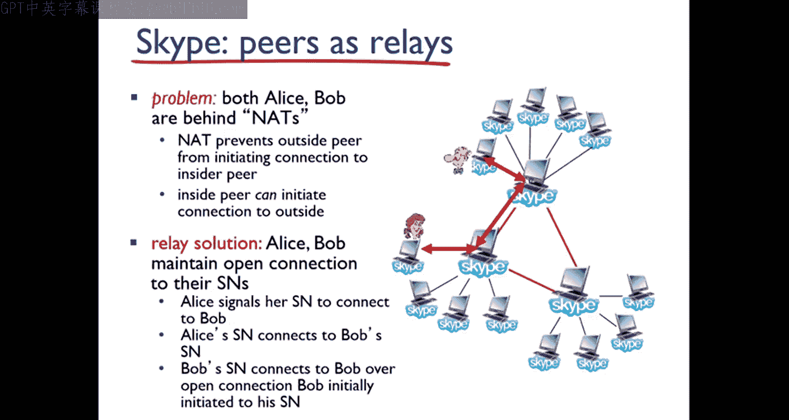

# Jim Kurose《计算机网络：自顶向下的方法｜Computer Networking： A Top-Down Approach》中英（deepseek p65 -65-#139 __ 66 VoIP __ Class With Sonali.zh_en -BV1UMtueiEaA_p65-

Good morning students Today we are going to start with another topic that is voice over IP which comes under your multimedia networking itself。

 So before going inside about the vi clearly before that we should know what is the full form of this so this vi is a short form and we used to call it as voice over Internet protocol。

 So where and all we are going to use these things。

 we are going to use these terms and over your phone service。

 Okay so now we will go inside the slide now here you can see I have written over here Vi is a short form of your voice over Internet protocol So we have some of the points which we have to understand how this vi works out and what are the characteristics of vi and what are the applications of vi and how to do the connectivity。

All these things we are going to learn now itself。 So before that。

 we should know what you mean by Vi。 Okay， so suppose if you have some quality internet。

 if you have the proper connectivity and all then what you're going to do。

 then you can get your phone service Okay， which has to be delivered through your internet connection。

 it means that instead of using any local phone phone。

 you can use the phone through your Internet service。 Okay。

 and that is known as your voice vi and this kind of traditional phone service。

 it is what it will offer you， it can offer you the like lower ratess because nowadays nowadays you can see everybody is utilizing the like internet and if if you want to have the ID call or SD calls。

 everyone is utilizing the vi right over the internet。😊，Protocol， we are normal calls and。

 if it will charge you more。 But if we are going for the vibe， then it will be charging very less。

 And some of the companies are there， those who are。

Giving very lower rates rather than your traditionalal phone companies。 So what is that。

 So it will not offer you that 9，1，1 service。 Okay， we have an emergency service number。

 which will be there in your phone directory， it will be listed in your phone directory。

 So there is this 9，11 emergency service。 or if you have411 service。

 So that kind of common services will not be provided。 Okay， so here what will happen is。

 but in like this kind of services are not provided in your common phones。

 but it is provided inside your。 So here what we are going to do。

 suppose if any Y providers they are offering any kind of services。

 then they have to be constantly connected with the industry wide like which is offering many like offers or lower rates。

 good bandwidth weight， that kind of service， those who are providing。 So they will be in touch with。

So how this VP is going to work out how like how it is going to convert and what will be the delay requirement。

 how the session is going to be initialized or that things and all also you should know right so first of all what it will do is it will turn your analog phone signals into digital signals okay and then it will send over your internet and this kind of function when it will carry out it will have some of your end to end delay okay so that kind of delay suppose if it is coming less than 1 50 milliseconds。

 you can say that it is a very good and it is like higher delays are noticeable and if it is having greater than 400 milliseconds then it is very bad connectivity okay so that time it it has to send all the signals over your application label like your packets。

😊，It means it will turn into your packet and it will send the playouts over your application level and as it is sending in that way。

 it can have some of the network delays。 That kind of network delays we are measuring over here Okay so how it is going to imp our activity or our connectivity So that kind of maintenance we are doing over here。

 and that's the reason it is known as your vibe end to end delay requirements。

 The next one will be a session initialization。😊，How you are going to initialize a session because when we will transfer the Vi using any of the common phones that time the IP phone has to connect with your ethernet then the ethernet has to connect with your router then again that router has to connect with your internetnet then that internetnet has to be connected with your Vi service provider So here through this only you have to initialize all the sessions before you are advertising any of your IP address because everywhere we want the I address and also if you want to have the connectivity directly then how you are going to do that connectivity through your IP you have IP phone that is internet protocol phone from there you have to connect with your ethernet then ethernet router then router to internetnet here from internetnet you have to connect again with the router。

Then again with your ethernet， then again with your IP phone why we are doing like this。

 because here we just want to connect directly with our Vi So what will happen is we have to bypass these vi service provider and we have to directly connect with our Vi user So if any of the vi device will be in behind of your net routers。

 I have already told you about the NA So if it is behind of your net routers。

 So that time the problem will it will come to the picture。

 So that is a reason if you want to connect there will be a multiple connectivity procedure you have to go through that once you have connect then then you have to initialize all the sessions like you have to advertise your IP address you have to go for your port numbers and if you want to secure your data then you have to go for your encodecoding and decoding algorithms。

 So now one more also has。To be added over here， that is value added services。

 So in value added services， you have to forward the calls and you have to go for your screening。

 You have to go for your recording。 So all these things you have to do under your value added services。

 These are the extra featuress over your voice。And also， it will have some of the reasons okay。

 that why we are using this vibe because here， if we will use the vibe， as I told you earlier。

 that will give you the lower cost and also it will increase the functionality because if we are going only for the phones then SD calls ID calls it will be very high。

 But if you are using the vi service providers And if you are utilizing the vi then the service jar will be very less。

 and you can have the emergency services that is 911 Now we have some characteristic of your vi So what are the characteristics。

 first you can see the speaker's audio okay so here if any speakers audio we are going to check it out So that time how we are。

 as I told you， how we are going to convert we have to convert all these things from your analog phone signal to your digital signal。

 So whenever you are going to transfer this analog signal to digital。😊。

Signal that time we have to go through your application layer。

 So that application layer header has to add the each chunk value。

 So whenever we are going to send all these data from through your UTP or TCP segment。

 it has to be encapsulated。 So what has to be encapsulated the chunk value and also the header value and we have to encapsulate and we need to send it over your application layer through your UTP and TCT segments。

 So each of the segment has to send like in every 20 milliseconds of time。

 So there will be a time delay of 20 milliseconds of time。

 you can see now the first point you can understand each packet has to generate only when we are talking okay because the speakers audio we are taking care of speakers audio So the audio has to be like it will be a 64 KBps。

In the talk。 Okay， so that time， each chunk has to be sent within the 20 milliseconds of time。

 and it will transfer 8 kB per second。 Okay， so totally how many by per data we are sending。

 So 20 into 81，60 by of data we are sending within 20 milliseconds of time。

 So these are the characteristics of your boy。 now you can see how we are going to loss the packet。

 or we can we will have any delay in the packet or not。

 that will be your like like it can be a network loss， It can be a delay loss。

 It can be loss tolerance power。 So how we are going to measure all these things， because if we have。

😊，Like some good datagrams like I datagram， which has already been lost due to some of the network congestions or traffic。

 or you can say that because as we have connected with the router。

 maybe there is a chance of your router overflow。 So suppose the buffer is overflowing。

 So what will happen。 then that time you can find out that your network is getting lost。

 So you can say that as we are working on your network clear。

 you can say the datagram is becoming is getting lost because of your traffic congestions。

 So if we will not get like if 20 milliseconds of time period。

 we have given So 160 by of data has to reach in your destination side， but suppose if any case。

 if it is getting more and network is getting jam that time we can lost the packet。

 And also one more thing will be there that is known as your delay loss。

 So what is happening in delay loss。😊，Here， the I datagrams has to arrive either early otherwise too late。

 So for your playouts。 So that time what will happen if it is having delay。

 it means it is reaching very late。 Okay， so in your network。

 there will be the queuing of your all the packets or datagrams。 So your end system。

 those who are known as your sender and receiver。 each sender is sending the datagrams very late。

 then definitely what will happen is in your receiver side， it will also reach very late。

 So that is known as your delay loss。 Okay， and maximum tolerable delays time period will be 400 milliseconds。

 We are not going to have more than that。 then the next term comes like your loss tolerance。

 What is the meaning of your loss tolerance， there will be a voice encoding and decoding procedure because everything we are transferring from analog signal to digital signal。

 So when we are transferring any of。😊，Voice and all。

 So we will have the loss concealment and where the packet loss rates will be in between 1% test to 10% test。

 And if we have the tolerance power within one% to 10 percent， then it can be tolerated。

 like we can bear the cost。 but if it will be more than that then it is it will be out of your tolerance power。

 So these all are your voice packet loss and delay。

 Now you can see if we are having some of the delay， then that is known as your delay。

 So how we are going to measure it。 So here this diagram you can see where the x axis is your time period and the y axis will be your cumulative data。

 So here we have some constant beat rate of transmission of values where you can see。😊。

Suppose while receiving inside your client receipts on side。

 we will have the variable or network delay。 that is known as your jitter value。

 So we have the client playout time。 So due to some network congestions we have not we are unable to send the like the bit the databases properly。

 So what will happen due to the bit due to the delay。

 as already the client has taken the play out delay time。

 already has been added into the constant time period。

 what will happen when it will reach in the client side， it will come in a proper way。

 because the time period， the delay time period， whatever we got it from here that has been already adjusted within this time period。

 So when it will reach with your client side， you can find out that it has been already raised in a proper manner。

 that is known as your delay jitter。 So now the delay in between this is known as your。😊。

Data so if you have two consecutivejuative packets。

 And if you want to find out the difference between the two consecutivejuative packets。

 I already told you there will be a transmission time difference that is known as your 20 milliseconds of time。

 So now if you have a fixed play out delayed then how you're going to work out in that that time the receiver will attempt the play with each chunk where the exactly Q milliseconds of time。

 Let it be 20 milliseconds， let the Q value can be anything。 whatever it will be。

 So the receiver has to attempt that each chunk value withq milliseconds of time when the chunk will generate So that time the timet of your chunk will be t。

 let's take it as your T and the play out chunk will be how much I have this time period as t and I have given time period for each of the chunk generated。

 So the total。😊，out time will be T plus Q。So the chunk will arrive after T plus Q。

 because the first chunk when it will when it arrives， it arrives in the time period of T。

 So that's the reason I have calculated t plus Q。 So the next chunk will arrive in the time period of T plus Q。

 So the data arrives too late for play out because it has been added the time if it reaches after that。

 then you can say the data has been lost。 Okay， so this is a calculation to find out that you have lost the packet or you have not lost the packet。

 So how you are going to choose your Q Q value。 if it is a large value of your Q。

 then you can say it is a less packet loss。 if it is a small value of Q， you can say that it is okay。

 we can manageable， It is manageable。 Okay， so that is known as your Y fixed play out delay。

 So now you can see the graph over here here， let's take the Q value as your 20 milliseconds of time。

😊，And here the first packet received at the time period R。 So here you can see in the graph。

 Similarlyly in the graph， I have taken x axis as time and y axis as packets。

 So here in the R time period my first packet received because this is the blue line。

 whatever you are seeing these all packets generated。

 So these packets are going to send over the time period to your destination side。

 So the first packet received over here that is in the time period of R。😊。

So what will be your first play out schedule at what time it has to begin。

 it has to begin in the time period of P。 So packets are receiving。

 you can see whatever the packets they are receiving how if you have received the first packet play out over P then if I want to go for the constant time period。

 then you can see this pink color dots it has to go in that way。

 but what is happening if Im not getting my values in the same way。

 then I can say that my packet is getting lost somewhere So here how to calculate so the second play out whatever you can see that will be here as P dash okay so actually it has to the transfer in this way but here you can find out it is not there is a delay for delay right so that time the playout schedule will be P minus R because it is not with the time period。

😊，With the next value， it will be P dash minus R。 So there is a loss。 Okay。

 so you should give get the time play out in this way。 but as you are not getting in that way。

 So you are getting the loss。 That is known as your fixed play out delay over your graph。

 Now you can see what is the meaning of your adaptive play out delay。

 So there is a much more good concept over here。 That is your adaptive play out delay。

 So now let me know what you understood from the adaptive play out delay。

 So here we will have some of the goal and also we will have some of the approach how we can give the best service towards the internet network layer。

 Okay， so here you can see that we have some goal。 So what is the goal now here。

 the goal is to find out low play out delay and the lower rate loss rate okay。😊。

So how we are going to find out all these things。 So here before going inside your approach。

 I just want to give you a brief idea about adaptive play out delay。

So what it will do is it is very important when it has to find out about the delay loss you can see here the goal delay and loss delay delay loss that kind of mechanism。

 So here what will happen， we have to design this like adaptive play out in such a way that where we can fix our play out delay Okay so if we will fix our playout delay。

 then the initial playout， if it is coming suppose large。

 then we can say most packets can make their own deadlines when they want to reach and if they can negotiate with their loss and they can go through over internet phone to interact with other like play devices and right So that time what will happen it won't be that much of tolerable because it will be within their fixed limit how they want to adopt。

😊，Like play out delay。 So that is one case。 So here also same thing has been written。

 If you want to go for your low playout delay and low rate， low loss rate。

 that is a concept of your delay loss。 So here what approach we can take we have to estimate that what will be our network delay。

 Okay， then we have to adjust our play out delay before starting off any audio device。 Okay。

 so slowly what we can do is we can compress the data or if you want to elong the data that also you can do。

 So then in each chunk that time we have to send every data in 20 milliseconds of time。

 suppose we are adopting this thing。 then what will be our formula。

 how to calculate the adaptive estimated packet delay。

 So that is a short form is also known as your EwM Okay。

 so that is exponentially weted moving average。 So this one also known as your we have already done。

😊，TP estimation time right， that time what at the formulas where they same kind of formulas we are applying over here。

 So here I have to calculate the delay， right， so delay estimation of your eighth packet will be equals to1 minus alpha。

 Okay， you can take the alpha value as constant or you can take the minimal value。

 if it has been given in your question paper， take that value。

 if not given take a very minimal value， you can take it as your 0。

1 and with that you have to multiply I minus one packet delay Okay。

 then you have to add with your alpha into R minus T R in the sense。

 you are going to measure all the delay of packet R means the time in which you have received your eighth packet and T I means the time when you have spent for your eighth packet。

 So in that way you have。😊，To find out your E WM A value。 That is a first adoptive play out delay。

 Now we have second adoptive play out delay。 Okay， so here what we are going to do is we will have some estimations over your deviations of delay。

 because sometimes what will happen is。We will have many things like we can have like the average you can find out the little deviations in the delay and all。

 so that time how you are going to recover all this packet loss how you are going to do it so there will be many schemes which you are going to follow it So here what is happening I have to take the value as the delay value let me take it as V that is your deviation of delay So V will be equals to1 minus beta everything I'm calculating for I packet V i minus1 plus beta into average value you are going to take mode if it is coming any negative。

 you have to make it as your positive because time period we cannot find it out in the negative So you are going to find the values。

 So here you have to estimate your D value and then you have to calculate your V value because whenever you will receive each of the packet that。

😊，Time needs to be calculated。 So how you're going to calculate your play out time。

 The first playout time， you have to add the time， you have to add the delay time and with the K value。

 you are going to add with this V value。 this K value can increase from 0 to n-1。 So in this way。

 you are going to find out all the remaining packet play out value periodically So here you are not going to get any kind of your like questions on your like how to calculate calculate and all only the derivativerivations will be there。

 So you are going to write about the adaptive play out delay only the formulas and the derivations。

 Now we have one mode that is adaptive play out delay of three。 The question is。

 how does the receiver determine whether the packet is fast in a talk spot。

 So here how you are going to find out So suppose you can consider in two ways if there is no loss。

 Okay， and the receiver looks like it's getting the successive times。😊。

It means that the receiver is receiving all the packets in the proper time period that whatever has been given before that is 20 milliseconds of time。

 So if he is getting the like all the packets within the 20 milliseconds of time。

 Then we can say that the difference of successive stamps is definitely greater than your 20 milliseconds of time which gives your audio time right So that is one case。

 suppose in second case。 some loss is there。 okay， then what you can think of you can think of that receiver receiver。

 maybe has not got all the like packets and all within the time period or maybe he has lost some of the sequence number So that time how you're going to calculate。

 you have to find out the difference between your all the successive stamps has to be greater than your 20 milliseconds of time which has been assigned for your each of the time period and along with that you have to go for the sequence number。

😊，Which is without gaps。 Then that kind， that time period。

 the addition of 20 milliseconds of time and the sequence number can give you the actual audio time when it has been begin。

 So in this way， in this two possible way， you can calculate and determine how the receiver is going to receive the packet。

 when the first audio begins。 Okay， so this is a adaptive play out delay of 3。

 So now how you're going to recover all the packet loss， whatever happen from your vibe。 Okay。

 so how youre going to。😊，Recover all these packets。

 So already we have discussed right over your internet phone applications。

 how you can deal with your packet editor。 and also we have described discussed about your few schemes。

 which has been attempted to preserve all the acceptable audio qualities if you have any packet loss also and that kind of packet loss when you are recovering that is known as your loss recovery schemes。

 and here we have to define that if there will be a packet loss in a very broad sense。

 then we can say， yes definitely the packet is lost。 but its not happen like if again。

 the receiver is having the same kind of your packet loss。

 then we have to schedule the playout time okay and over your like internet phone。

 whatever the examples we have taken on that basis。

 we can derive all these packet loss recovery schemes。😊。

SoHere we have two kind of one scheme is there that is known as your forward error correction scheme。

 which is also known as your FEC。 So what is that actually why we have came to your forward error correction scheme or you can say that that is also known as your interle So why we came as what happens is when we will retransmit any kind of your lost packet。

 which is not inside your interactive realtime applications like you can say internet phone。 Okay。

 so that time what will happen is when we will retransmit any of the packet。

 it can miss the playout deadline。 Okay， so if it is missing the deadline play out or if it is overflowed the router queue。

 then definitely we can accomplish that yes， like some like packet losses there。

 So that kind oftrans is very inappropriate。 Okay， so in that time。😊。

Internet phone applications will use this kind of schemes that is known as your forward error correction scheme。

 and also it is known as one more way to understand is interleaving So what is happening in your F。

 So here definitely it will send all the bits of data where it is going to allow to recover all the data bits without retransmission。

 Okay， so how this one is working out first like the very basic idea is like it has to add all the informations with your original packet stream。

 then what it is going to do。 then it will just increase the transmission rate of the audio or of any kind of your stream。

😊，Then it is going to send or it is going to use some approximation versions of your chunks。 Okay。

 so when it will have that approximation chunks of your like of your audio。

 then it is going to send and for every group， there will be n number of chunks。

 Okay so it will create all the redundant chunks and also it will use the X or gate you know。

 already the ex or gate， it is going to add all the xor gate with your original chunks。

 then it is going to send the data。 So how was the total number of data it is going to send it is going to send n plus I chunks of data。

 So where the bandwidth sorry n plus one chunks of data。

 So what will be the bandwidth of all these things。

 So bandwidth will be a factor of your one by n and also it will reconstruct your original n chunks from your last chunk。

 which is from your n plus one chunks with your play delay。 So that is a simple mechanism。😊。

Of your F， where it is going to send a very lower quality of audio stream by using this redundant information。

 Okay， so that is the and also it can transfer 64 over your 64 Kb P of data that also you have to remember。

 So here whatever I see I have told you that 64 Kb P of data。 So here what is happening。

We will have the piggyback lower quality stream。 We have the original stream over here。

 We are going to add the redundancy。 You can see one here。 So one added over here，2 here。

2 added over here，3 here，3 added over here。 So when we are going to send all these lower resolution schemes over your audio stream or any other things。

 we will have the redundant informations。 And with that， we are going to have the packet loss。

 Let's take it as we got the packet loss as here。😊。

You can say that we got the packet lost like three。 So that time what will happen。

 So we will have the stream like 64 kb P of data。 and we are going to send it over here。

 So what will happen if the third is packet lost But when we will reconstruct the stream here from here we will come to know that okay the three has been lost。

 So this is a nonconjucative loss where the receiver can conceal all the lost。

 and this can happen all the n-1 n-2 or n-3， all the lower data rates。

 and it is going to have the chunk。 So this is FEC scheme。

 you can get the question on your fEC scheme。 So now how you are going to recover all the click from your packet loss。

 Similarlyly， you will have some original streams， there will be interlib stream because is a f scheme is also known as your interleaving scheme where you are going to add。

 you can see one after5 then 9 then third。😊，Then here2，6， the second one。 then third one。

 then phototon like that we have given。 And if we have some packet laws in between that。

 then also we can retrieve while going for your reconstructed stream。

 So here we have to divide all the chunks into smaller units。

 and then we are going to send over your inter stream And if any of the packet will get lost。

 then for every original chunk， we are going to receive your like like stream audio stream。

 So there will be no redundancy overhead but it will increase your playout delay。

 So how it is working on your Skype because we have already utilized the Skype concept here you can see we have some Skype clients where the Skype lines are going to utilize the application where protocols to encrypt all the message。

 So if we have the peer to peer components and the Skype peers they will connect。😊。

Directly to each other for your V calls。 Okay， we will have the super nodes and we will have the Skype clients。

 the super nodes， they will have the Skype peers with some of the special functions。

 and they will just connect with each other with your overlay network and that is connect to your Skype clients So here all the login servers will be there they need to log in and they are going to connect it。

 So that is a peer to peer connectivity。 So if you want， so you can connect over Skype here。

 you can join with your Skype network with contacting with your IP address， whatever has been given。

 So the login Skype server through your login Skype server。

 you can connect by giving your username and password where it will be a very centralized Skype login server Then you can obtain your I addresses where you can call from SN overlay and there will be a client body list。

 You can join with。😊，Then you are going to initiate the call directly from your calls and these are are the peers。

 which all are relays on your but sometimes some problem happens that is suppose both Alice and Bob are behind the N So what is that N it will prevent your outside peer from your initiating connections So what will happen that time you have to have some you have to maintain the open connections in between the essence when Alice will send the signal to connect to the bo that time Alice E has to connect with Bobs E and then Bob E has to connect with Bob over your open connection then only the bo can initially initiate all the transactions and all So this is all about your Skype and your and your adaptive like whatever the plays we have studied today hope you have understood the things whatever is there。

So next class， we are going to start with the protocols for real time con applications， A TP and SIP。

 So for today's class， it is this much。😊。

Thank you。