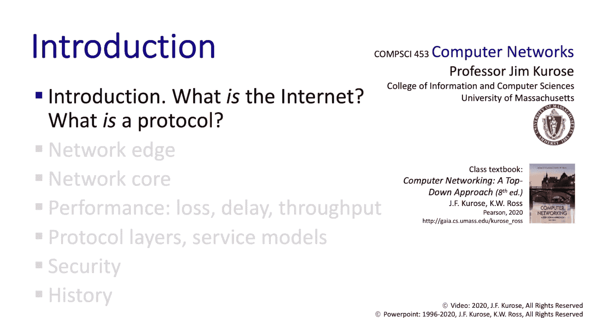

# 1.1：引言 - 什么是互联网 🌐

在本节课中，我们将开启计算机网络的学习之旅。本节是第一章的第一部分，我们将首先对即将学习的内容进行一个宏观概述，然后直接切入核心，探讨两个基本问题：什么是互联网？什么是协议？

## 课程概述

上一段我们提到了本节的目标，本节中我们将具体介绍本章的覆盖范围。本章内容对应于教材的第一章，我们将从引言开始，探讨上述两个核心问题。随后，我们将深入细节，从网络的边缘开始，逐步深入到网络的核心。

以下是本章将要学习的主要内容列表：

*   **网络边缘**：我们将详细查看构成互联网的主机、接入网络和物理介质。
*   **网络核心**：我们将探讨构建网络的两种关键技术：**电路交换**（传统电话网络使用）和**分组交换**（互联网的技术基础）。我们将讨论分组交换网络中的**分组**、**路由器**和**交换机**，并分析网络的结构，特别是理解“互联网是网络的网络”这一说法的含义。
*   **网络性能**：我们将了解分组在从源到目的地转发过程中如何可能丢失或延迟，并将**吞吐量**（比特从源到目的地转发的速率）作为一个性能指标进行讨论。
*   **协议分层**：这是一种将像互联网这样极其复杂的系统分解和结构化讨论的方法，使其成为更易于管理的部分。
*   **服务模型**：我们将讨论网络提供的服务模型。
*   **网络安全与历史**：我们将简要介绍网络安全以及计算机网络的历史（其起源远早于互联网的出现）。

以上就是我们的学习路线图。

## 什么是互联网？🤔

接下来，让我们问自己一个看似简单的问题：究竟什么是互联网？当然，答案很大程度上取决于你问的是谁。

我们可以从工程视角来看待这个问题，这里有两种主要的观点。

### 视角一：具体构成（螺母与螺栓）

第一种观点非常具体，关注互联网的组成部分。让我们从网络的边缘开始，逐步向内探索。

在网络的边缘，是我们这些互联网用户用来连接互联网的设备。连接到互联网的设备有数十亿之多，我们通常称这些设备为**主机**或**端系统**。设备的类型繁多，例如：
*   计算机（个人电脑、数据中心服务器）、智能手机。
*   家庭中的互联网连接游戏和媒体流设备。
*   数字个人助理、安全摄像头、能源监视器。
*   冰箱、洗衣机、烘干机、相框等家用电器，甚至你的床垫。
*   个人健康和健身设备，以及增强现实/虚拟现实眼镜等人机增强设备。
*   汽车、卡车、滑板车和自行车等交通工具。

任何数字设备连接到互联网都可能产生价值，而给传统模拟设备（如自行车）赋予数字足迹和互联网连接能力，则能催生新的应用类型。

向网络深处移动，我们找到了使网络真正成为网络的设备，即**分组交换机**，它们在彼此之间以及在主机和端设备之间转发数据块（**分组**）。我们将学习两种主要的分组交换机：**路由器**和**交换机**。

此外，还有无数的**通信链路**将路由器、交换机、主机和端系统互连起来。

最后，这些链路、路由器、交换机、主机和端设备被组装成一个个**网络**，每个网络都由某个实体拥有和运营。例如，麻省大学校园运营着自己的校园网络，这个网络与连接其他校园网络的互联网骨干网是不同的。正是这些多个网络的存在，才有了“互联网是网络的网络”这一说法。

在本课程中，我们将反复看到，路由器、交换机、主机和端设备之间信息的发送和接收都由**协议**控制。网络中发生的一切都受协议支配，协议无处不在。因此，这既是一门关于网络原理和实践的课程，也是一门关于协议的课程。

由于协议描述的是做事的标准方式，因此需要一个机构来为互联网定义这些标准。这个定义互联网标准和协议的组织被称为**互联网工程任务组**，其标准文件被称为**RFC**。

### 视角二：服务平台

第二种回答“什么是互联网”的方式是从服务的角度出发，将互联网视为一个可以运行所有精彩应用的**平台**。

作为一个服务平台，互联网提供了一个接口，应用程序可以利用这个接口相互发送和接收信息。从服务视角来看，互联网的核心就是**将信息从网络中的一个点传送到另一个点**。

那些位于网络端点的互联网应用可能极其复杂和精密。但所有这些应用层的复杂性都建立在基本服务基础设施之上，该设施的核心任务只是简单地将分组从一个位置传送到另一个位置。

## 什么是协议？🤝

前面我们提到互联网的核心是协议，那么什么是互联网协议呢？理解互联网协议最简单的方法之一是先思考人类协议。人类一直在执行协议。

例如，考虑一个“现在几点”的协议：
1.  一个人说：“打扰一下，你知道现在几点吗？”（请求）
2.  第二个人看看手表，回答：“两点十分。”（响应）

再比如课堂上的“提问”协议：
1.  教授问：“有什么问题吗？”
2.  学生可能低头看笔记，或者举手。
3.  如果学生举手，教授说：“好的，请讲。”
4.  学生提问，教授回答。

从这些人类协议中，我们可以看到共同点：有**特定的消息**被发送（人类说出的话），并且当对方收到这些消息时，会采取**特定的行动**。

**计算机网络协议与这些人类协议完全类似**，只不过交换消息和采取行动的主体变成了网络组件（应用程序、主机、路由器、交换机、链路等）。

以人类的“现在几点”协议为例，它有两个不同的阶段：问候阶段（“打扰一下”）和请求-响应阶段。我们很快会看到，这与Web上使用的协议（如HTTP）完全类似：先有一个连接建立阶段，然后是请求-响应阶段。

基于以上背景，我们可以为网络协议下一个实用的定义：

> **协议**定义了网络实体之间发送和接收的**消息的格式和顺序**，以及在消息传输和接收时采取的**动作**。

## 总结与预告

本节课中，我们一起学习了两个技术要点：我们探讨了“什么是互联网”这个问题（从边缘到核心的构成视角以及服务平台视角），并讨论了“什么是协议”这个概念。

在下一节中，我们将更深入地采用“具体构成”的视角来回答“什么是互联网”这个问题。我们将从之前简要提及的网络边缘设备开始，然后逐步向网络内部探索。