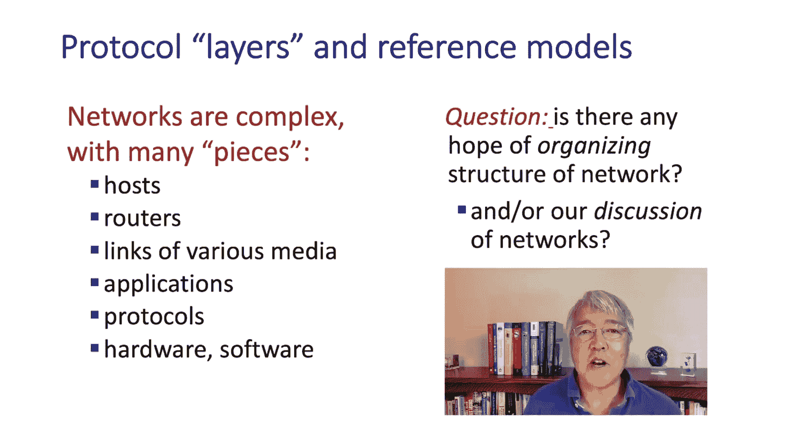
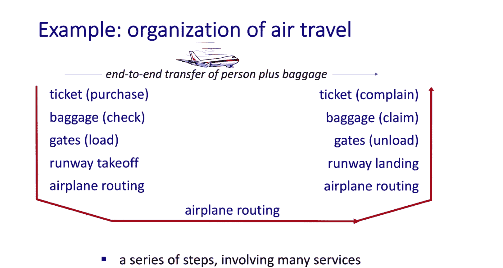
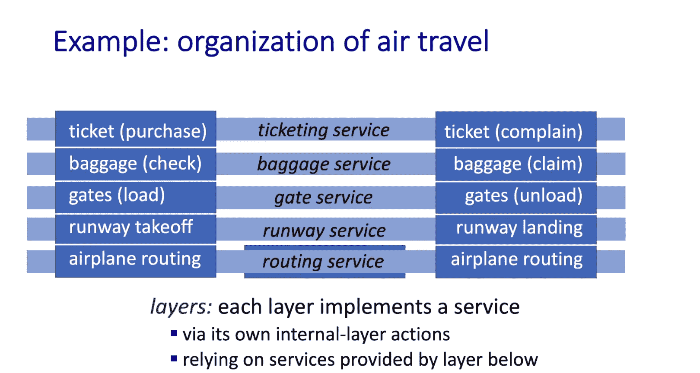
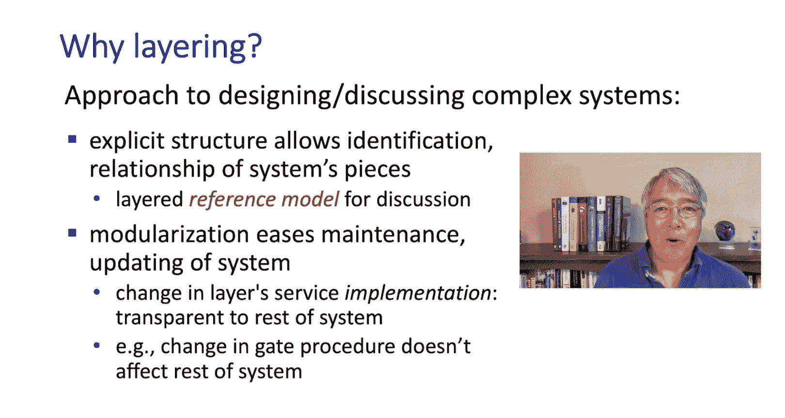
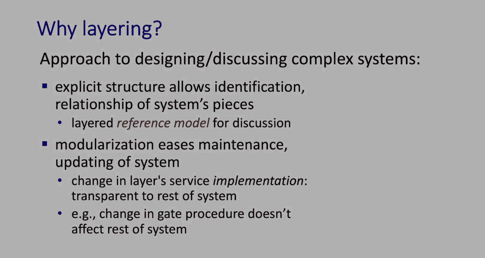
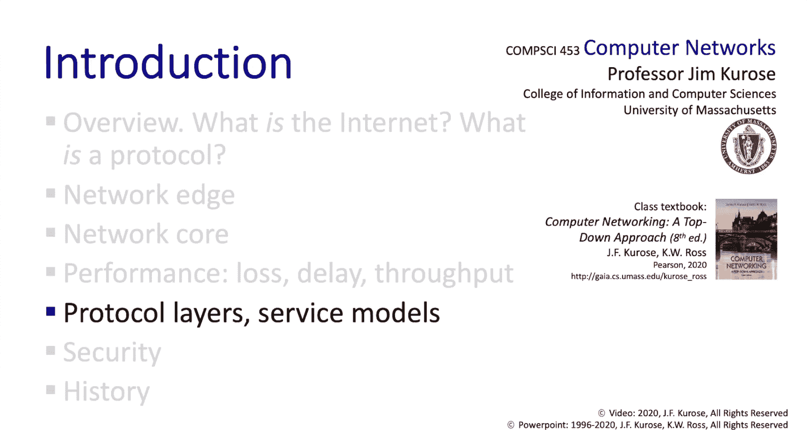

# 1.5：分层与封装 🏗️

在本节中，我们将学习如何理解和描述极其复杂的互联网系统。我们将介绍**分层架构**的概念，审视互联网的五层模型，并精确地定义数据在网络中流动时的形态——**数据包**。通过理解**封装**过程，你将能清晰地看到数据从发送方应用层到接收方应用层的完整旅程。

## 分层架构的概念

互联网是一个由数十亿交互部件组成的庞大系统，包括应用、设备、链路、路由器、交换机等。为了应对这种复杂性，我们采用**分层架构**来设计、讨论和教学。

我们可以用一个类比来理解分层：航空旅行系统。这个系统非常复杂，涉及购票、值机、安检、登机、飞行、行李托运等多个环节。我们可以将这些环节视为一系列**水平层**的功能。例如，“值机”功能在出发机场和到达机场共同协作，为你提供“旅客登记”服务。为了实现这个服务，它依赖于“行李处理”和“安检”等下层服务。

这种分层思考方式有两个主要优势：
1.  **提供清晰的参考模型**：它明确了系统的不同部分及其相互关系，便于我们讨论系统。
2.  **实现模块化设计**：每一层都使用下层提供的服务来实现自己的服务，并向上层提供服务。只要保持层与层之间的接口不变，修改某一层的实现方式就不会影响其他层，这使得系统的实现和维护更加容易。

## 互联网的五层模型 🖥️

互联网采用的就是分层架构，具体分为以下五层：

1.  **应用层**：包含控制分布式应用程序各部分之间消息收发行为的**应用层协议**。在本课程中，我们将首先学习这一层。
2.  **传输层**：负责在**进程**之间传输应用层消息。例如，互联网的TCP协议能在可能丢失数据包的网络服务之上，实现**可靠的数据传输服务**。
3.  **网络层**：负责将数据从一台**主机**传输到另一台主机。互联网的网络层提供的是**尽力而为服务**，不保证可靠性。请注意，**主机到主机**（网络层）与**进程到进程**（传输层）的传输范围是不同的。
4.  **链路层**：负责在**同一通信链路两端**的网络设备（如路由器、主机）之间传输数据。
5.  **物理层**：负责控制比特在物理链路中的传输。

## 封装：数据包的旅程 📦

现在，让我们更精确地了解数据是如何在各层之间交换的。这个过程的核心是**封装**。

*   在**应用层**，交换的数据单元称为**报文**。
*   在**传输层**，传输层实体会接收应用层报文，并为其添加**传输层首部信息**（例如，用于标识目标进程的端口号、实现可靠传输的控制信息），从而生成一个新的数据单元，称为**报文段**。这个添加首部信息的过程就是封装。
*   在**网络层**，网络层协议封装传输层报文段，添加**网络层首部**（例如，包含发送和接收主机IP地址），生成**数据报**。
*   在**链路层**，链路层协议封装网络层数据报，添加**链路层首部**（和可能的尾部），生成**帧**。

数据在发送端**沿着协议栈向下流动**，每经过一层就被封装一次，添加该层的首部。最终，物理层的比特流通过链路传输。

在接收端，数据**沿着协议栈向上流动**，每经过一层，该层的实体就会读取并处理其对应的首部信息，然后将剩余的数据部分向上传递给下一层。首部信息在逐层处理后被“剥离”。

需要特别注意的是，网络中的路由器、交换机等中间设备通常只实现协议栈的**下三层**（网络层、链路层、物理层）。它们的任务是转发数据报和帧，无需处理封装在内部的传输层报文段或应用层报文。

## 总结

在本节中，我们一起学习了三个核心概念：
1.  **分层架构**：一种通过将系统划分为多个具有明确定义的服务和接口的层次，来管理复杂性的方法。
2.  **互联网五层模型**：应用层、传输层、网络层、链路层和物理层，这为我们理解网络提供了结构框架。
3.  **封装**：数据从高层向低层传递时，每层都会添加自己的控制信息（首部）以形成新的协议数据单元（PDU）。这个过程使得数据能够被正确地在网络中传输、寻址和交付。

理解数据如何通过封装在协议栈中上下流动，是掌握计算机网络工作原理的基础。接下来，我们将简要了解网络面临的一些安全威胁。