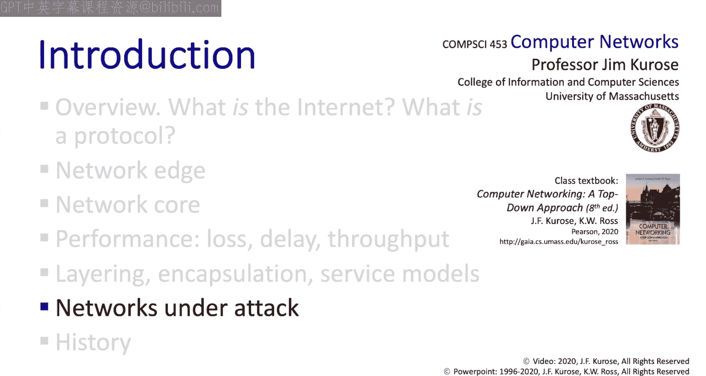

# 1.6：网络攻击与防御 🛡️

在本节中，我们将对计算机网络中的安全问题进行一个概览。我们将探讨攻击者可能对网络实施的几种主要攻击方式，并了解可用于防御、缓解和应对这些攻击的广泛技术类别。请在学习后续课程时，始终将这两个核心问题的答案记在心中。

## 概述

最初的互联网架构在设计时并未将安全性作为核心考量。这并非设计者遗忘了安全，而是其最初的愿景是服务于一个“相互信任的用户群体”，他们连接在一个“透明的网络”上。显然，这与我们今天面临的现实情况大相径庭。设计者并非天真，只是在当时的设想使用场景下，安全性并未被有意识地列为关键设计标准。因此，时至今日，我们仍在某种程度上为网络安全“补课”。

思考网络安全时，我们需要考虑几个方面：
1.  攻击者如何攻击或破坏计算机网络。
2.  我们如何防御这些攻击。
3.  我们如何设计能够抵御攻击的网络架构，这有时被称为“安全设计”。

## 攻击者的行为方式 🔓

现在，让我们来看看攻击者可能采取的一些行为方式。

首先，一个合理的假设是，攻击者能够获取在共享媒体（例如无线信道）上传输的数据包副本。例如，如果攻击者位于位置C，我们应该假设C能够读取B通过共享媒体发送给A的所有内容。实际上，存在名为“数据包嗅探器”的软件工具可以实现这一点。在本课程中，我们将广泛使用名为Wireshark的嗅探器来捕获网络上的数据包，以便观察协议的实际运行。

其次，我们应该假设攻击者能够向网络中注入包含任意信息的数据包。例如，位于C的攻击者可以向A发送一个伪造的数据包，其源地址被篡改，使A误以为该数据包来自B。这在概念上类似于你收到一封声称来自银行或同事的钓鱼邮件，声称他们获得了一笔巨款，需要你帮忙存入银行账户并分享收益。你不会相信他们。同样，网络设备或软件也不应仅仅因为一个数据包到达了就相信它所声称的内容。

此外，攻击者还可以通过产生巨大的工作负载来发动拒绝服务攻击，使网络设备过载。例如，HTTP服务器可能被大量伪造的HTTP请求轰炸，或者路由器可能被持续涌入的需要转发或特殊处理（如我们之前看到的traceroute数据包）的数据包淹没。这类攻击通常由攻击者入侵互联网上的其他主机后，协调发动，有时被称为分布式拒绝服务攻击。

以上是攻击者可以发动的几种最重要的攻击类型。

## 防御措施 🛡️

接下来，我们看看可以采取哪些措施来保护、缓解或避免此类攻击。

我们可以通过使用**身份验证**来防止欺骗，强制用户在获得某些网络服务前证明自己的身份。密码可能是最简单的身份验证形式。智能手机中的SIM卡则提供了硬件身份标识和验证。

我们可以通过**加密**数据包内容来防止数据被嗅探。

我们可以通过使用**数字签名**来防止数据被篡改，这项技术允许数据接收方知晓数据是由特定的数字身份发送的，并且在传输途中未被篡改。

我们可以通过增加**访问控制**来防止对网络资源的未授权使用，具体方法是规定谁可以执行哪些操作，并要求用户在访问这些资源前再次证明自己的身份。例如，在马萨诸塞大学校园，你需要先向校园无线网络验证身份，然后才能使用它。

此外，还有被称为**防火墙**的专用硬件设备，它们被编程用于检测和缓解攻击。防火墙部署在边缘网络和核心网络中，可以被编程，例如，只允许特定用户或特定类型的流量进入或离开网络。我们将在学习第4章通用转发时，详细讨论防火墙和其他所谓的“中间盒”。

## 总结

以上是对“遭受攻击的网络”这一主题的一个非常高层次的概述。我们主要探讨了两个问题：一是攻击者在网络环境中可能实施的各类恶意行为；二是可以部署的用于保护、缓解和应对网络攻击的防御措施和技术类别。请记住，教材中有一整章专门讨论网络安全，并且在我们深入学习网络协议栈的过程中，我们将不断回到网络安全的主题上来。