# 2.2：Web与HTTP（第一部分）🌐

在本节课中，我们将要学习万维网（Web）和超文本传输协议（HTTP）的基础知识。我们将从Web和HTTP的快速概述开始，然后深入探讨两种HTTP连接类型：持久连接和非持久连接。接着，我们将研究HTTP使用的主要消息：请求消息和响应消息。最后，我们将通过了解一种在服务器端保持客户端连接之间状态的技术——Cookie，来结束本部分内容。这是关于HTTP两部分内容中的第一部分，内容非常丰富，让我们开始吧。

## Web与HTTP概述

首先，让我们通过一个快速的回顾来开始关于Web和HTTP的讨论，为后续内容奠定基础。

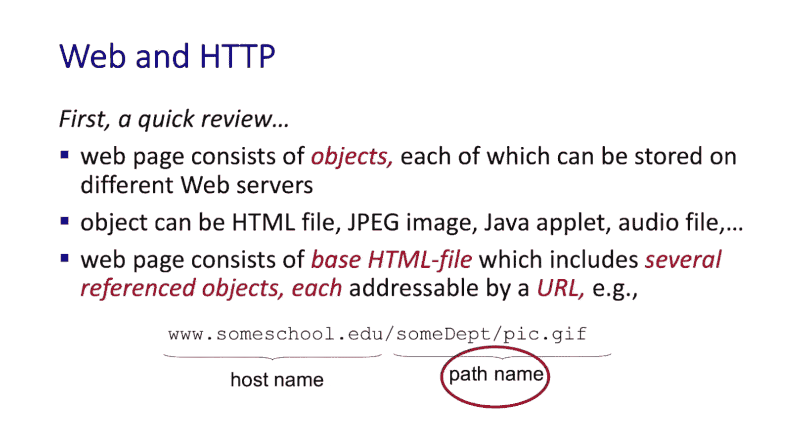

一个网页由一个基础的HTML文件以及一组被引用的对象组成。这些对象中的每一个都可以存储在不同的Web服务器上。一个对象可以是一个HTML文件、一张JPEG图片、一个Java小程序、一个音频文件或许多其他东西。网页本身以及被引用的对象都可以通过一个称为URL（统一资源定位符）的地址来访问。URL包含一个主机名，以及在该主机上的路径名。

## HTTP的客户端-服务器模型

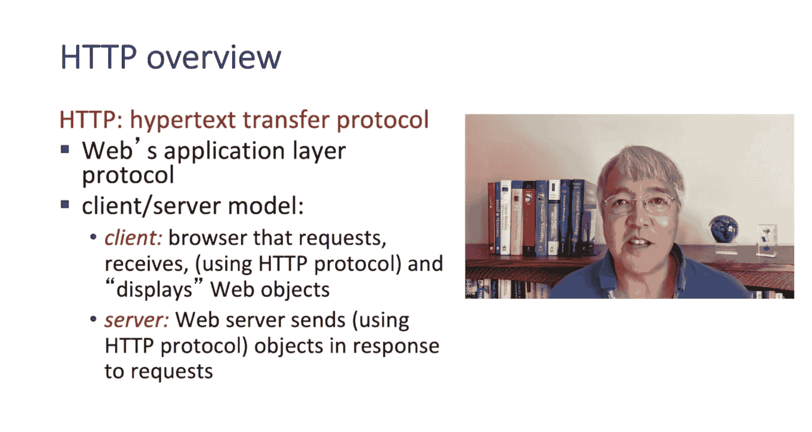

现在，让我们开始学习HTTP。首先要知道的是，HTTP采用了我们在2.1节中刚刚学习过的客户端-服务器模型。

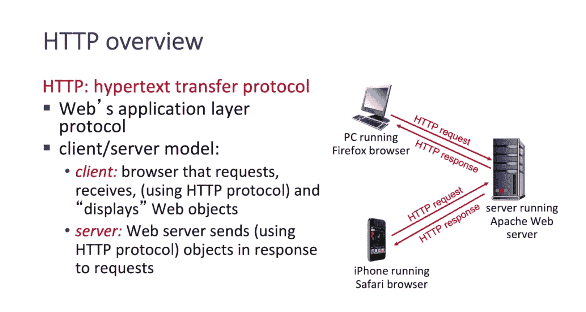

客户端可能是一个Web浏览器，如Firefox、Safari或Edge。它也可能嵌入在一个设备中，你甚至可能看不到它。服务器可能是一个只提供网页服务的传统Web服务器，也可能是一个更通用的服务器，如 `gaia.cs.umass.edu`，它提供多种服务。

在上面的动画中，我们看到顶部一台运行Firefox浏览器的PC向服务器发出HTTP请求并收到响应。底部我们看到一部运行Safari浏览器的iPhone也在发出HTTP请求并收到HTTP响应。这两个浏览器都在使用HTTP协议与Apache Web服务器通信。

## HTTP与TCP

HTTP使用TCP协议提供的传输服务。一个HTTP事务的工作方式如下：HTTP客户端（例如你的Web浏览器）使用端口80打开一个到Web服务器的TCP连接（我们稍后会了解端口号）。然后，客户端和服务器之间交换一条或多条HTTP消息。最后，TCP连接被关闭。

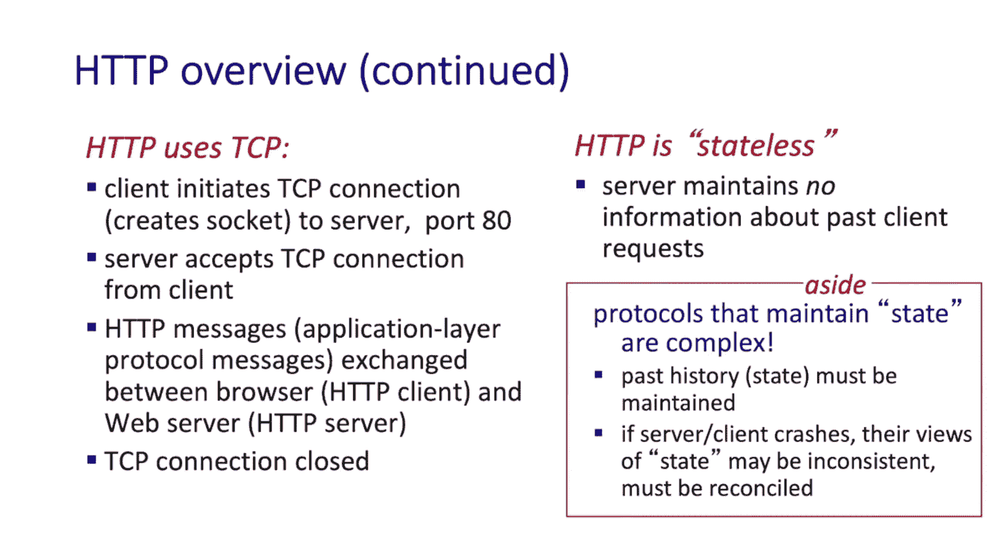

HTTP是一种**无状态协议**。这意味着服务器不维护关于正在进行的请求的任何内部状态。一个对象对应一个请求和一个回复，仅此而已。没有诸如“这个事务有五个步骤，我们现在处于第三步，如果失败，我需要将状态回滚到这个五步事务开始之前”这样的担忧。HTTP没有这些，它是无状态的。你可能会问为什么？原因在于其简单性。正如我们将看到的，维护状态的协议需要处理多步事务失败时的清理问题，例如恢复到初始状态和解决不一致状态。

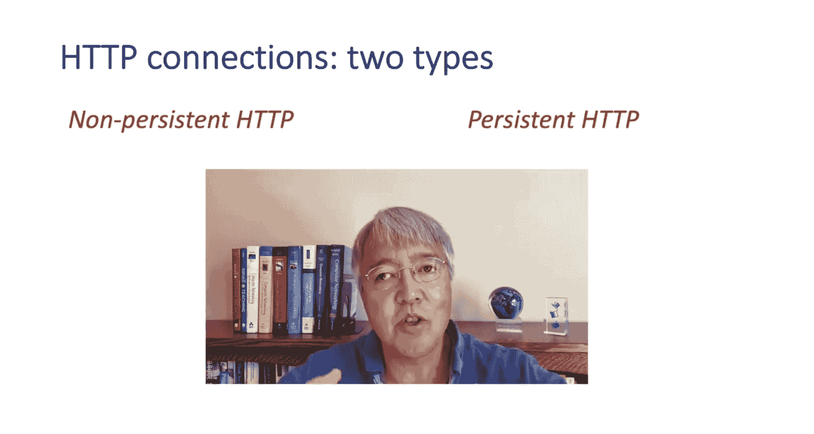

## HTTP连接类型

HTTP连接有两种类型：**持久连接**和**非持久连接**。重要的是要记住，浏览器和服务器之间的这些HTTP连接与传输层提供的TCP连接是不同的。

在**非持久HTTP**中，打开一个TCP连接，然后最多发送一个对象，之后TCP连接就被关闭。下载多个对象需要建立多个TCP连接。我们将看到，首先需要一个往返时间（RTT）来打开TCP连接，然后另一个RTT来发送请求和接收响应。

在**持久HTTP**中，同样会打开一个到服务器的TCP连接，但这次可以在客户端和服务器之间的单个TCP连接上串行传输多个对象。一旦请求并返回了这些多个对象，TCP连接就可以关闭。持久HTTP对应HTTP版本1.1，这可能是当今最常用的HTTP形式。

## 非持久HTTP操作示例

让我们看一个非持久HTTP操作的例子。

假设用户在步骤1A中输入一个URL `www.someschool.edu`，请求一个包含文本以及引用了10个JPEG图片的网页。在步骤1A中，我们看到客户端在 `www.someschool.edu` 的端口80上发起一个到HTTP服务器的TCP连接。在步骤1B中，主机上一直在端口80等待TCP连接的HTTP服务器接受这个TCP连接并通知客户端。注意，在步骤1A和1B中，实际上还没有任何HTTP请求流动。这发生在步骤2。在步骤2中，HTTP客户端通过刚刚建立的TCP连接发送HTTP请求消息。这条HTTP消息表明客户端想要接收那个基础的HTML文件。在步骤3中，服务器现在接收到这个HTTP请求消息，并构建包含所请求对象的响应消息，然后将此消息发送回HTTP客户端。发送响应消息后，在步骤4，HTTP服务器关闭TCP连接。在步骤5，HTTP客户端接收到包含HTML文件的响应消息，显示HTML文件，解析它，并找到那10个引用的JPEG对象。在步骤6，现在将不得不为每个引用的JPEG对象重复前面的五个步骤。

## 非持久HTTP的响应时间

现在我们可以看看非持久HTTP的响应时间。我们可以将响应时间定义为从用户首次在浏览器中输入URL到接收到并显示基础HTML文件所花费的时间。

让我们将RTT（往返时间）定义为一个非常小的数据包从客户端到服务器再返回所需的时间。

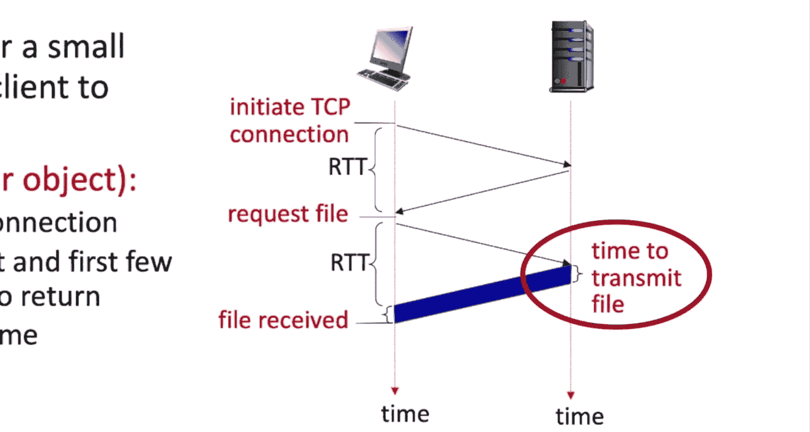

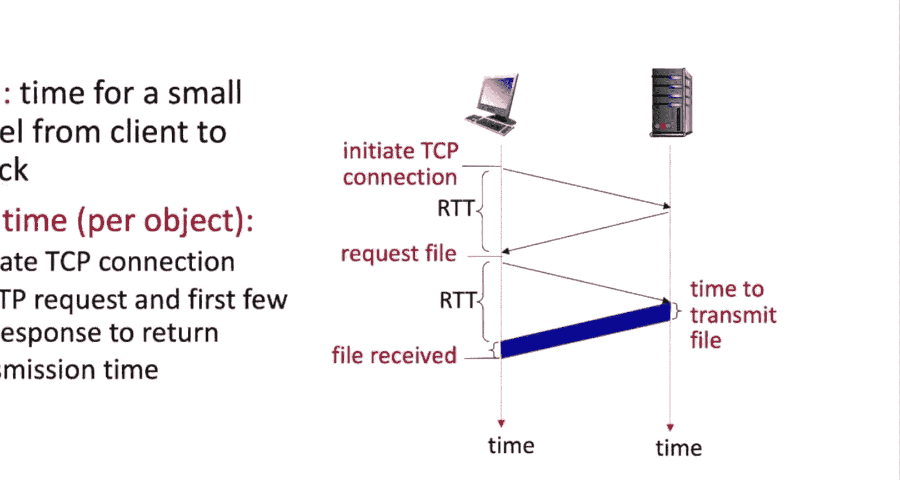

我们可以看到，非持久HTTP每个对象的响应时间包含以下部分：需要一个RTT来发起TCP连接，另一个RTT（第二个RTT）用于传输和接收HTTP请求以及返回HTTP响应的第一个字节，最后是服务器实际将文件传输到其互联网连接所需的时间。

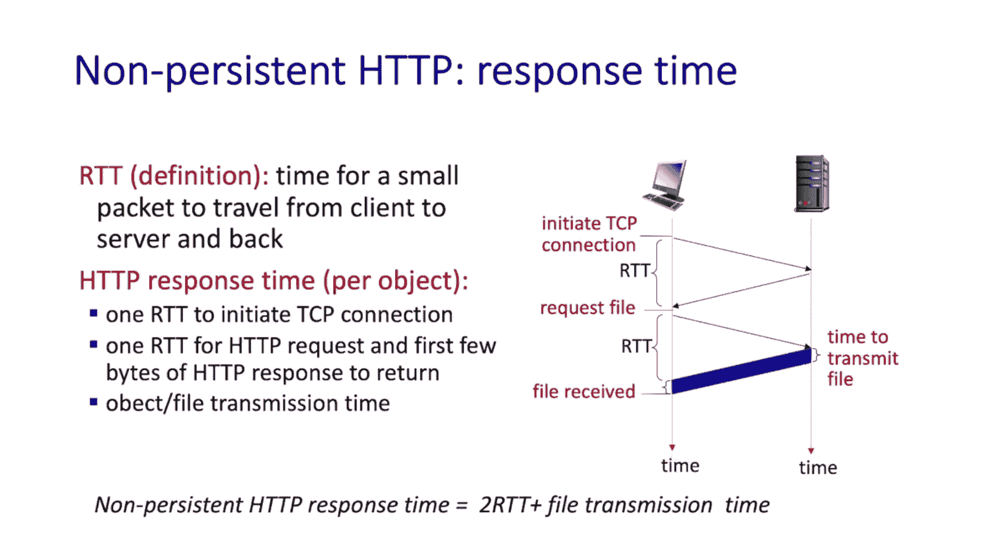

因此，总的来说，非持久HTTP的响应时间是**2个RTT加上传输文件所需的时间**。

## 持久HTTP的优势

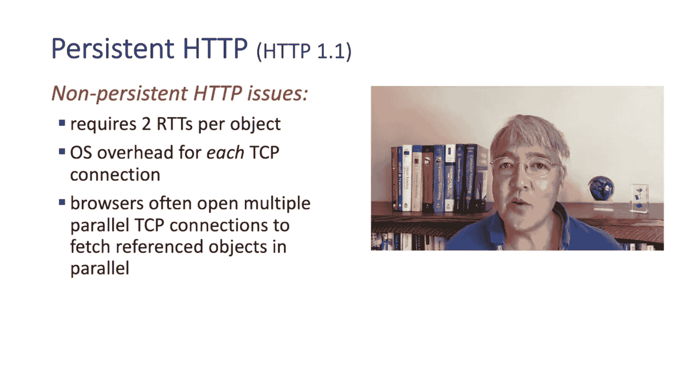

我们已经看到，获取一个Web对象需要两个RTT。虽然多个对象通常可以并行获取，但两个RTT仍然是两个RTT。我们当然希望尽可能快地获取信息。通过一种简单的技术，实际上可以将这种延迟从两个RTT减少到一个RTT，那就是使用称为**持久连接**的技术。这也是现在大多数Web服务器的运行方式。

在持久HTTP（HTTP/1.1）中，服务器在发送响应后保持连接开放。随后，同一客户端和服务器之间的HTTP消息可以通过这个开放的连接发送，而无需等待建立新TCP连接所需的那个RTT。当客户端有新的请求时，一旦遇到被引用的对象，就会立即发送。

因此，我们可以看到持久HTTP如何将响应时间减半，变为一个RTT。

## HTTP消息格式

既然我们已经了解了两种HTTP连接风格，现在可以深入探讨HTTP消息本身的细节了。回想一下1.1节，我们说协议定义了网络实体之间发送和接收的消息的格式和顺序，以及发送和接收这些消息时采取的操作。让我们来看看HTTP协议及其消息。

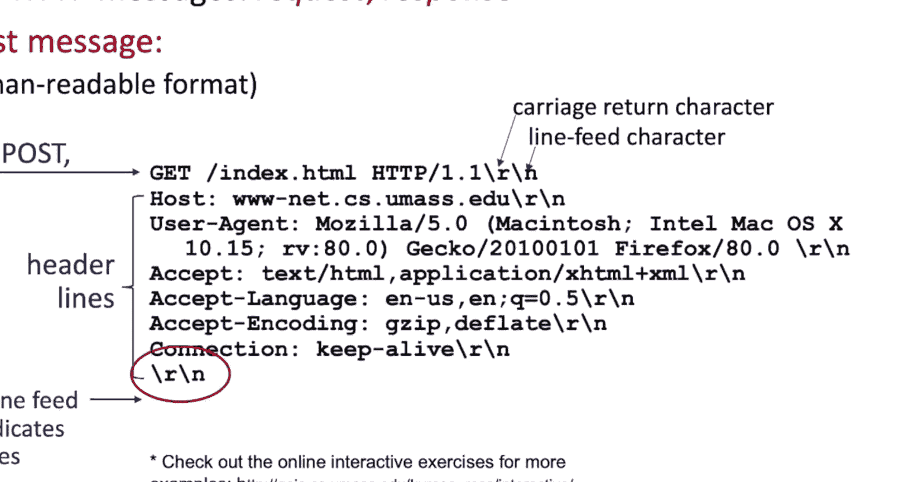

HTTP消息有两种类型：**请求消息**和**响应消息**。让我们先看看请求消息。

## HTTP请求消息

一个请求消息以单个请求行开始，该行以一个方法名开头，例如这里显示的 `GET`，后面是URL（在本例中是被请求的HTML文件的名称）、HTTP版本（本例中是1.1）和一个换行符（即回车换行）。单个请求行之后是许多**头部行**，它们提供附加信息。例如，请求所发往的主机名、发出请求的浏览器类型（本例中是Firefox）、可以接受的对象的类型和首选语言（本例中是美式英语），以及该连接应保持活动状态的事实。请求消息以一个空行结束。正如你所见，它非常易于人类阅读。

以下是HTTP请求消息的一般格式：我们看到请求行，后面跟着头部行。HTTP协议规范RFC 7320长达85页，包含了关于方法、头部字段名称和值的所有细节。幸运的是，对于我们网络专业的学生来说，我们不需要知道所有这些细节。但如果我们要实现一个HTTP客户端或服务器，就必须了解每一个细节。

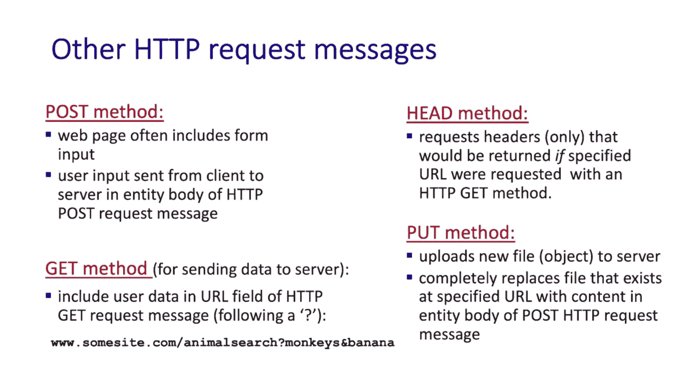

当我们查看上一张幻灯片中的GET消息时，没有实体主体。某些请求消息（如我们稍后会看到的POST）需要实体主体，以便向服务器发送不在头部字段中的附加信息。

以下是四种类型的HTTP请求消息：
*   **GET**：我们已经见过GET方法。
*   **POST**：用于将已完成的表单数据上传到服务器。
*   **PUT**：可用于将一个新对象上传到具有给定URL的服务器，可能替换现有对象。
*   **HEAD**：请求一个与GET请求相同的响应，但没有响应主体。例如，这可用于确定将要检索的对象的大小，而无需实际检索该对象。

## HTTP响应消息

现在让我们快速看一下HTTP响应消息。

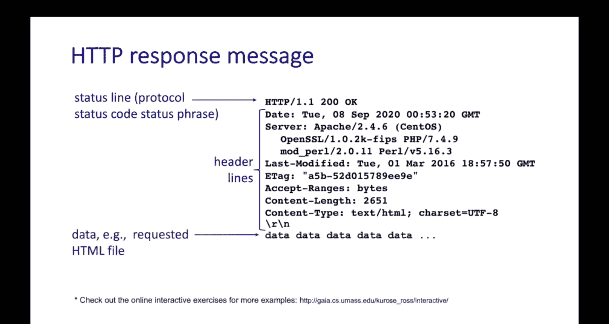

响应消息以**状态行**开始。状态行的第一个信息是所使用的HTTP协议的版本号，在本例中是1.1。版本号之后是响应消息中最重要的两个信息：**状态码**和**简短消息**。在本例中，显示的状态码是200，表示一切正常，状态短语是“OK”。

状态行之后是**响应头部行**，与请求消息类似，提供附加信息。例如，这里显示的有：发送响应的日期和时间、服务器类型（本例中是Apache服务器版本2.4.6）、`Last-Modified`字段显示文档最后修改的时间、`Content-Length`字段显示文档的长度、`Content-Type`字段指示返回的对象的类型（本例中是HTML文档）。最后是返回的对象的主体，在本例中就是HTML文档本身。

## HTTP响应状态码

这里只是HTTP响应状态码和短语中的几个例子：
*   **200 OK**：我们已经见过200 OK，表示请求成功。
*   **404 Not Found**：当请求的文档在服务器上未找到时，你可能见过404 Not Found。

所有的响应状态码和短语都包含在RFC文档中。所以，如果你真的有兴趣了解所有的状态码和响应短语，可以查阅那里。

关于HTTP消息的讨论到此结束。正如所承诺的，它非常简单，只有两种类型的消息。同样如承诺的那样，它非常易于人类理解。我们可以查看那些HTTP消息并基本理解它们。

## Cookie：在HTTP中保持状态

让我们通过回到无状态这个问题来结束对HTTP的初步研究。我们说过HTTP是一种无状态协议。事实证明，Web服务器实际上可以通过使用一种称为**Cookie**的技术来维护一些用户状态，记住用户过去做了什么，以及这可能如何影响用户在当前会话中想要做的事情。让我们来看看。

网站使用Cookie来维护关于用户（更具体地说是用户的浏览器）在事务之间的信息。使用Cookie有四个组成部分：
1.  首先，服务器在某个时间点会向客户端发送一个Cookie。Cookie只是一个数字，包含在发送给客户端的HTTP响应消息的Cookie头部行中。
2.  之后，当客户端下次向该服务器发出请求时，它会在Cookie头部行中附带该Cookie值发送给服务器。
3.  服务器将记住它收到的所有请求以及它发送的与该Cookie值相关的响应。因此，它将拥有与该用户交互的历史记录。

让我们看一个例子。在这个例子中，左侧的客户端将向一个Amazon服务器（例如右侧的服务器）发出几个HTTP请求，该服务器有一个后端数据库来存储与Cookie相关的信息。客户端还拥有来自它访问过的其他网站的Cookie信息（例如来自eBay的Cookie），但它还没有来自Amazon的Cookie。

客户端像往常一样向Amazon Web服务器发出请求，最初没有Cookie行。当Amazon Web服务器收到HTTP请求时，它会创建一个Cookie，将Cookie和事务信息存储在其数据库中，并向客户端发送一个包含Cookie值的HTTP响应。

现在，在客户端的第二个请求中，客户端将其Cookie值包含给Amazon，允许Amazon服务器采取特定于Cookie的操作，或许会考虑到第一个HTTP请求。例如，也许第一个事务是请求查看一件商品，第二个HTTP请求想查看第二件商品。有了Cookie，第二个回复可以被精心设计，向客户端提供一个同时购买这两件商品的优惠，尽管第二个请求只想查看一件特定的商品。

客户端一周后再次访问，并再次提供Cookie。服务器可以再次采取特定于Cookie的操作。例如，它可以说：“嘿，过去一周我们很想念你。你确定不想买你上周看过的那些商品吗？”

在这个例子中，我们可以看到Cookie如何用于在HTTP交互之间在网站上存储关于用户的状态。

## Cookie的用途与隐私

鉴于Cookie可用于在多个事务中存储用户状态，它们有很多用途：记住你之前已向网站验证过身份、记住你购物车的内容，或者根据过去的行为进行推荐。

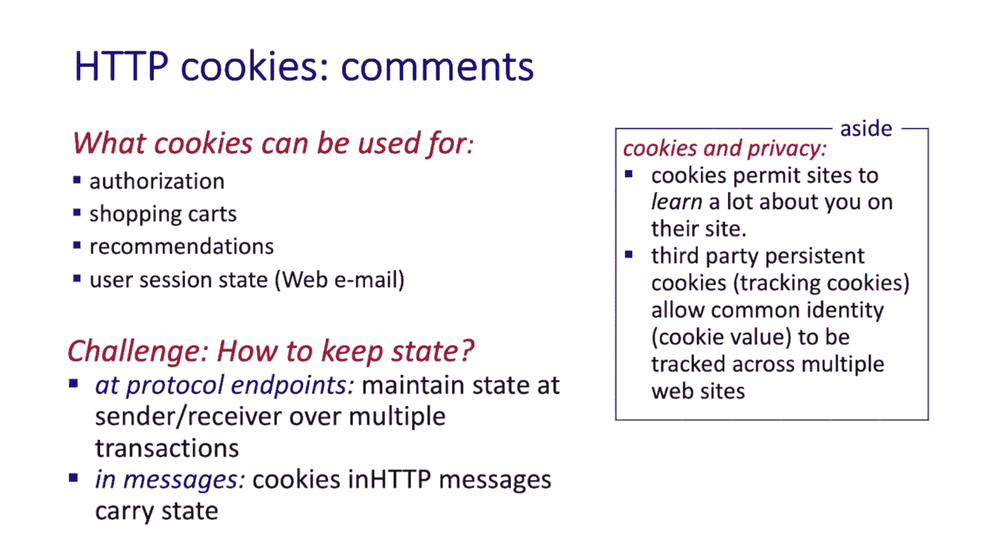

你可能也读到过关于Cookie的许多隐私问题。Cookie可以让网站了解很多关于你的信息。存在所谓的**第三方Cookie**，它们可以被放入你的浏览器，并允许网站在多个网站之间建立共同的身份。你可能也听说过欧盟的《通用数据保护条例》（GDPR）。根据GDPR，对于网站运行并非严格必需的Cookie，只有在用户明确同意使用并收集个人数据后才能被激活。你可能最近注意到，在很多网站上，在你能够使用该网站之前，你必须同意特定的Cookie政策。

## 总结

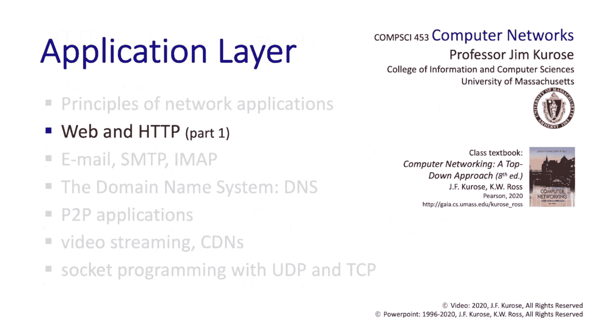

本节课中我们一起学习了Web和HTTP的第一部分内容，我们已经学到了很多。经过快速介绍后，我们深入探讨了不同类型的HTTP连接，研究了请求和响应消息，并且还了解了Cookie——一种在服务器端记住用户与该服务器交互之间状态的方法。接下来在第二部分中，我们将更深入地探讨HTTP性能提升的一些其他方面，我们将研究Web缓存、条件GET请求，最后我们将研究HTTP版本2（最新的HTTP版本），并快速了解一下即将在未来一两年内到来的HTTP版本3。