# 2.3：电子邮件 📧

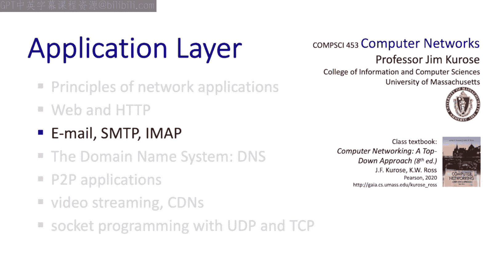

在本节中，我们将学习一个历史悠久的应用——电子邮件。电子邮件自1972年诞生以来，已成为我们文化的一部分。虽然它可能不是最令人兴奋的应用，但它是一个很好的客户端-服务器模型的例子，并且相对简单，非常适合我们进行学习。

我们将重点关注两个方面：首先，我们将探讨电子邮件应用的基础设施，包括用户代理（邮件客户端）、邮件服务器以及消息和消息队列。其次，我们将深入了解**SMTP协议**（简单邮件传输协议），它是电子邮件应用的核心。

---

## 电子邮件基础设施 🏗️

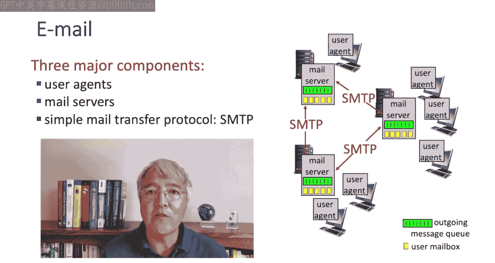

上一节我们介绍了HTTP的客户端-服务器模型，本节中我们来看看电子邮件如何采用类似的架构。作为一个分布式应用，电子邮件包含三个主要组件。

以下是电子邮件的三个核心组件：

1.  **用户代理**：也称为邮件阅读器或邮件客户端。用户使用它来撰写、编辑和阅读邮件。
2.  **邮件服务器**：相当于HTTP中的服务器。它为每个用户存储两类消息：**收件箱**（存放接收到的消息）和**发送队列**（存放等待发送到目标SMTP服务器的消息）。
3.  **SMTP协议**：用于将消息从用户代理或邮件服务器“推送”到另一个邮件服务器。它采用客户端-服务器模式，其中发送方（用户代理或发送邮件服务器）是客户端，接收方邮件服务器是服务器。

---

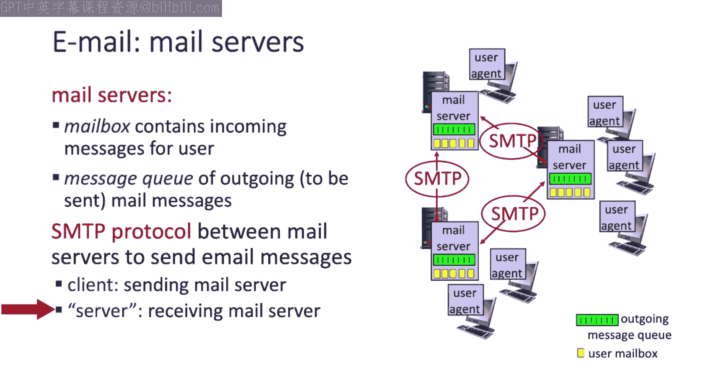

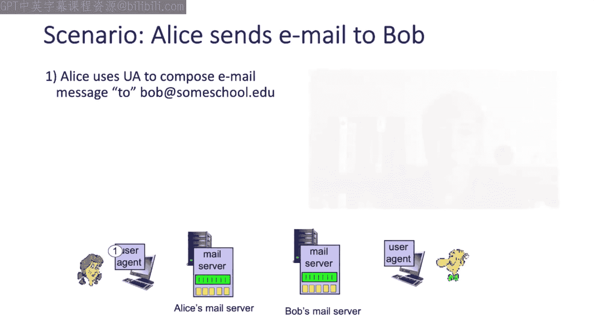

## 电子邮件发送流程示例 📤➡️📥

现在，让我们通过一个具体例子，看看当Alice想给Bob发送一封邮件时，涉及的各个步骤。

以下是Alice向Bob发送邮件的详细步骤：

1.  **撰写与发送**：Alice使用她的邮件客户端（用户代理）撰写邮件，然后点击“发送”。
2.  **客户端到服务器**：Alice的邮件客户端使用**SMTP协议**，以客户端身份联系Alice的邮件服务器，并将邮件“推送”到该服务器。
3.  **服务器间连接**：Alice的邮件服务器现在需要将邮件发送给Bob的邮件服务器。为此，它首先与Bob的服务器建立一个**TCP连接**。
4.  **服务器到服务器传输**：Alice的SMTP服务器（此时作为客户端）通过已建立的TCP连接，将Alice的邮件发送给Bob的SMTP服务器。
5.  **投递与读取**：Bob的服务器将邮件放入Bob的收件箱。之后，Bob可以随时启动他的用户代理，从服务器上读取这封邮件。

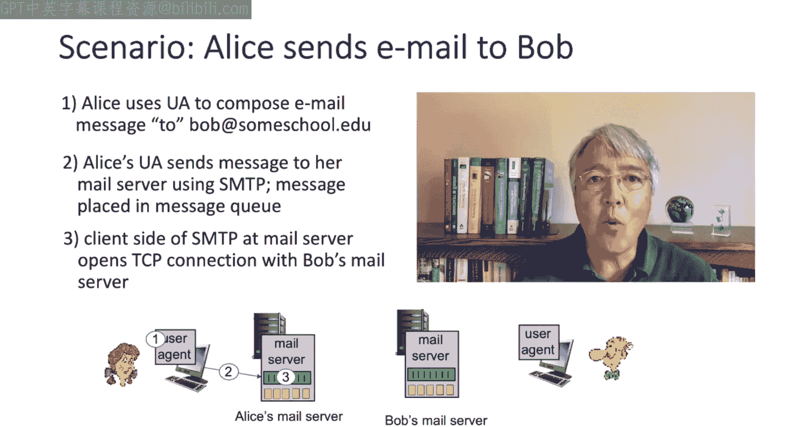

---

## SMTP协议详解 🔧

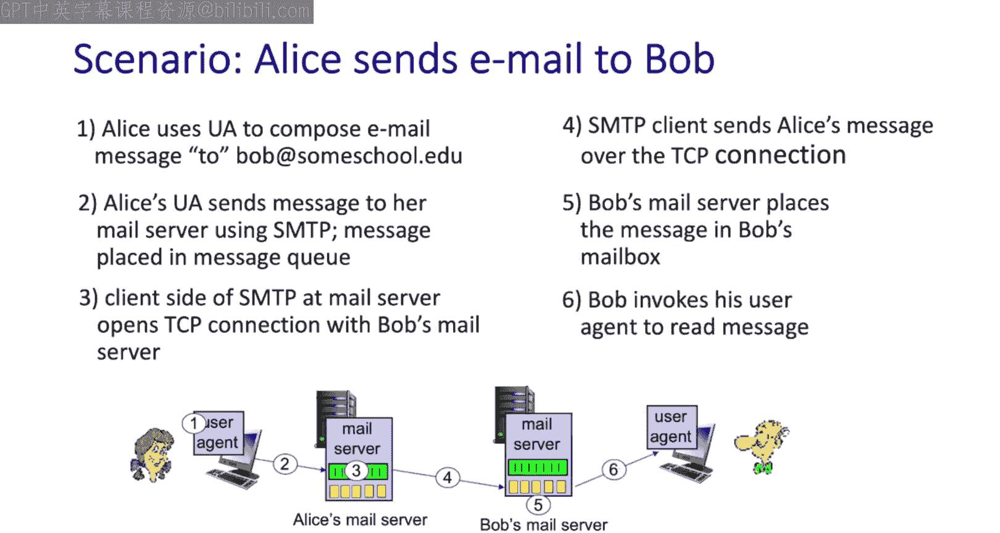

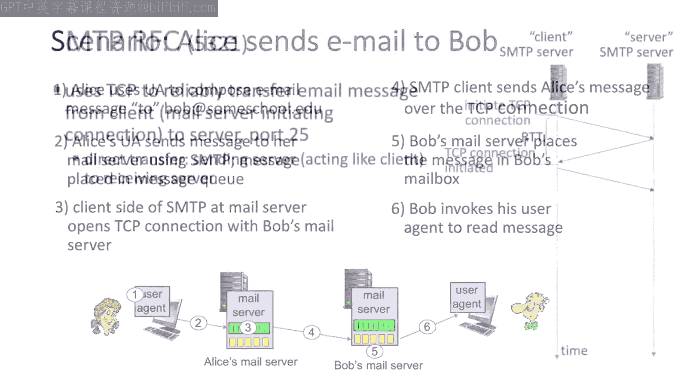

SMTP协议由RFC 5321定义。它运行在**TCP**之上，使用**端口25**，确保邮件消息从客户端可靠地传输到服务器。

在TCP连接建立后，SMTP消息传输分为三个阶段。

以下是SMTP消息传输的三个阶段：

1.  **握手阶段**：服务器发送`220`消息，客户端回复`HELO`，服务器再回复`250`消息（例如“Hello [客户端名]，pleased to meet you”）。
2.  **消息传输阶段**：客户端通过`MAIL FROM:`、`RCPT TO:`和`DATA`等命令指明发件人、收件人并传输消息内容。消息正文以单独一行的英文句点`.`结束。
3.  **连接关闭阶段**：客户端发送`QUIT`，服务器回复`221`，随后关闭SMTP和TCP连接。

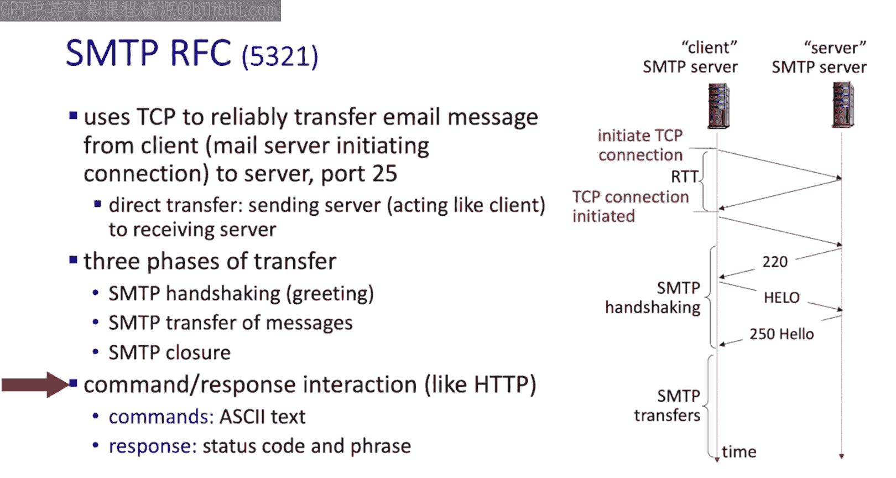

SMTP与HTTP的命令-响应交互类似，使用人类可读的ASCII文本和状态码。

---

## SMTP与HTTP的比较 ⚖️

在深入邮件格式细节之前，让我们从高层次比较一下SMTP和HTTP协议。

以下是SMTP与HTTP的主要区别：

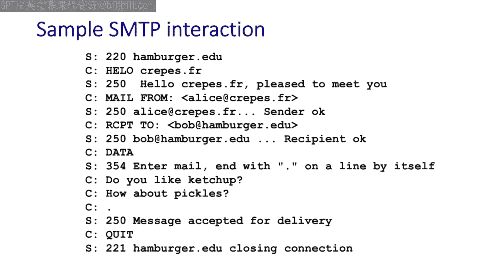

*   **推送 vs. 拉取**：SMTP主要是**推送**协议，将消息从客户端推送到服务器。而HTTP是**拉取**协议，客户端从服务器拉取数据。
*   **消息内容**：SMTP要求消息（包括头部和正文）必须编码为**7位ASCII**码格式。HTTP没有此限制。
*   **对象数量**：单个SMTP消息中可以包含多个对象（如附件），而每个HTTP请求/响应通常只涉及一个对象。
*   **连接方式**：SMTP使用**持久连接**，可以在一个TCP连接上传输多封邮件。

---

## 邮件消息格式 ✉️

那么，邮件消息本身是什么格式呢？其协议由RFC 2822定义，类似于HTML定义网页文档的语法。

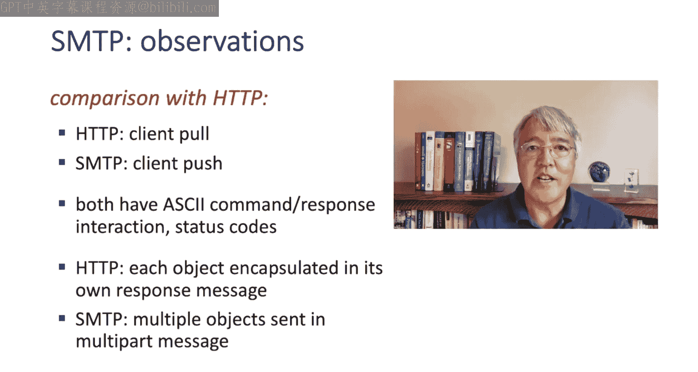

一封电子邮件主要包含两部分：

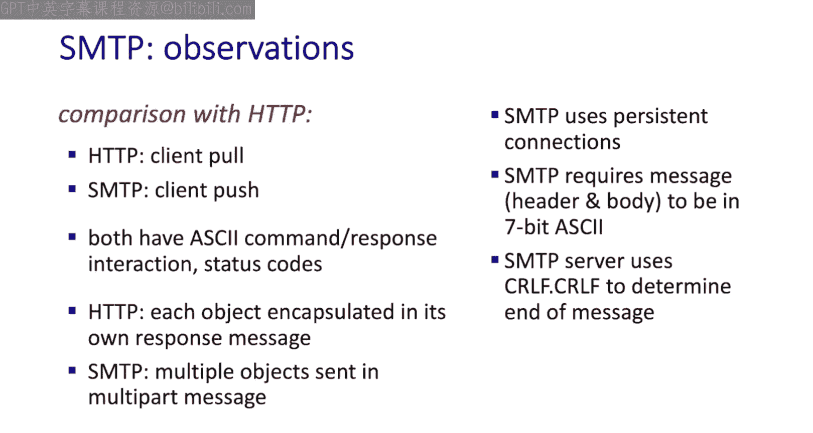

1.  **头部**：包含`From:`、`To:`、`Subject:`等行。请注意，这些头部信息与SMTP传输时使用的`MAIL FROM:`和`RCPT TO:`命令是不同的。
2.  **正文**：在头部之后，由一个空行分隔，接着是邮件正文。同样需要编码为7位ASCII格式。

---

## 邮件访问协议 📬

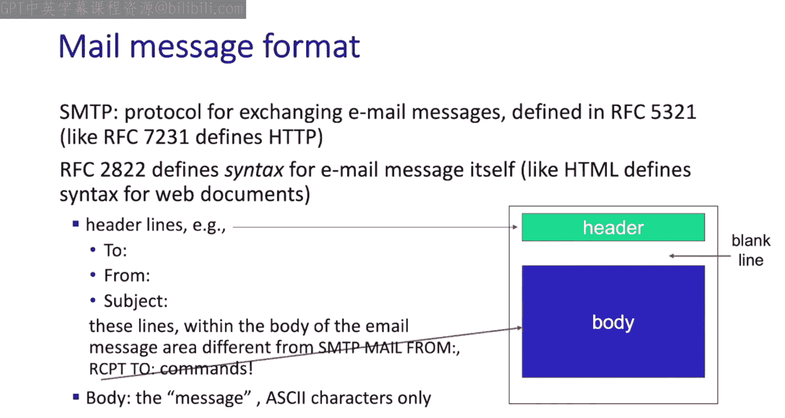

到目前为止，我们的讨论都集中在如何将邮件推送到目标SMTP服务器。那么，当邮件到达目标服务器后，用户如何取回并阅读它呢？

当然，这也有专门的协议。最广泛使用的电子邮件访问协议是**IMAP**（互联网消息访问协议），由RFC 3501定义。此外，用户也可以通过**HTTP**（例如Web邮箱）来访问邮件。

---

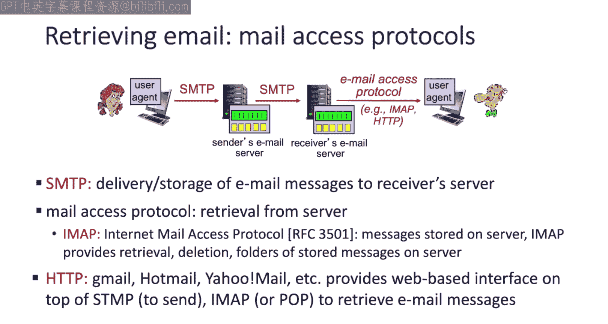

## 总结 📝

本节课中我们一起学习了计算机网络中最古老的应用之一——电子邮件。我们探讨了其基础设施，包括邮件服务器、邮件客户端和消息队列。我们还深入研究了**SMTP协议**，这是另一个客户端-服务器协议的例子，在某些方面与HTTP相似，但也有显著不同。

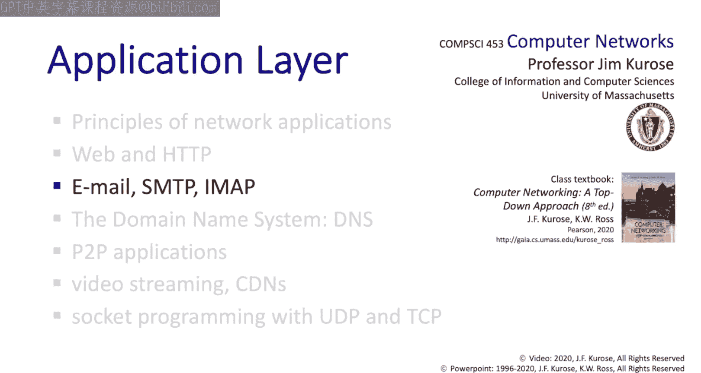

接下来，我们将学习**DNS协议**（域名系统）。我们将看到，它与SMTP和HTTP非常不同，不直接涉及终端用户，但却是互联网核心基础设施的关键部分。