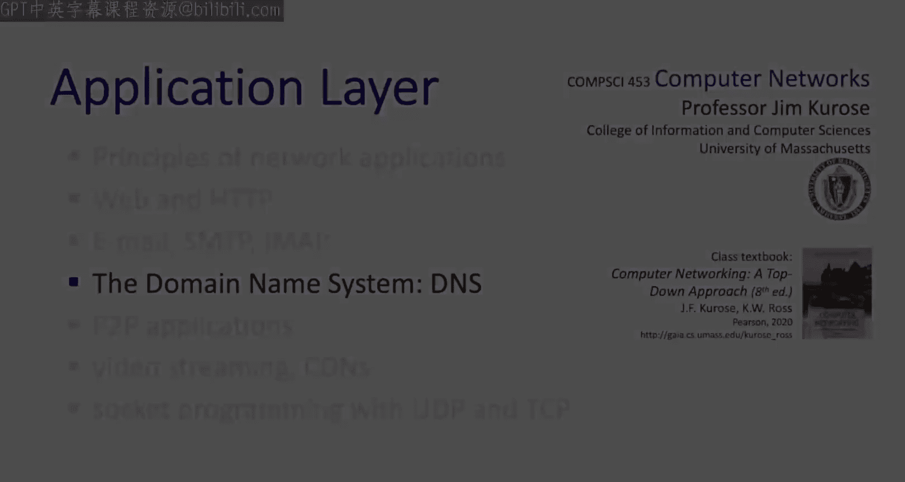
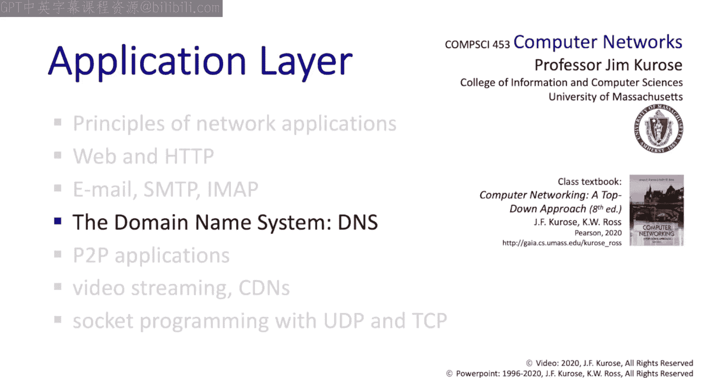

# 2.4：域名系统（DNS）🌐

在本节中，我们将学习域名系统（DNS）。DNS是互联网中负责将主机名（如 `gaia.cs.umass.edu`）翻译成IP地址（如 `128.119.40.186`）的部分。我们将看到，DNS是一个令人惊叹的分布式应用，能够以巨大的规模和惊人的性能提供服务。

既然我们处于应用层，你可能会问，为什么我们要在应用层研究像名称翻译这样的核心互联网功能？答案是，DNS本身就是一个应用层协议和服务。它构建在TCP和UDP之上，并使用它们的服务，因此它确实是一个应用层服务。

本节内容很多。我们将首先讨论DNS的结构和功能，然后看看查询是如何被解析的，接着会研究DNS记录以及DNS协议的消息格式。让我们开始吧。

## 名称与标识符

顾名思义，域名系统（DNS）的核心是名称和标识符。就像一个人可以有多个标识符（如姓名、社保号、护照ID）一样，互联网主机也至少有两个标识符：一个主机名（如 `gaia.cs.umass.edu`）和一个IP地址（如 `128.119.40.186`）。DNS的角色就是提供名称与IP地址之间的翻译服务。

## DNS：一个分布式数据库

域名系统（DNS）是一个分布式数据库。这个数据库的内容是包含主机名、服务和IP地址之间翻译信息的记录。DNS本身是一个分布在互联网上的服务器层次结构，这些服务器相互通信以提供名称翻译服务。

重要的是，DNS是作为应用层服务实现的。它由位于网络边缘的服务器实现，而不是网络内部的路由器和交换机。这反映了互联网的一个设计理念：保持网络核心简单，将复杂性放在网络边缘。随着我们深入学习传输层和网络层，会反复看到这个设计理念。

## DNS的功能

DNS提供多种不同的功能。最广为人知的是IP地址到主机名的翻译服务，但它也提供其他一些重要服务：
*   **别名功能**：将面向外部的名称（如 `mail.cs.umass.edu`）翻译成更复杂的内部主机名。
*   **服务解析**：例如，返回与某个域名关联的邮件服务器的IP地址。
*   **负载均衡**：可能有多个IP地址能够提供请求的服务（例如一个Web服务器），DNS会在这些可能的IP地址之间轮换，返回其中一个作为主要服务，从而实现一种负载均衡功能。

## 为何采用分布式设计？

考虑到DNS采用了分布式、去中心化的方法，你可能会问，为什么设计者不采用更中心化的方法？这里有几点考虑：
*   **单点故障**：中心化方法代表一个单点故障。考虑到DNS是关键基础设施，这很危险。
*   **流量集中**：考虑到DNS的负载，中心化方法会造成巨大的流量集中。
*   **性能延迟**：考虑到性能的重要性（解析DNS查询时，毫秒都很关键），将其放在一个位置必然意味着地球上某些地方会有很长的往返时间（RTT）延迟。

总而言之，中心化方法无法应对每天数万亿次的查询规模。仅Akamai一家公司每天就处理超过一万亿次DNS请求。单一的集中式服务不具备分布式方法所能提供的计算能力、弹性或性能。

## DNS概述

在深入DNS的技术细节之前，让我们先总结一下如何理解DNS。你可以将其视为一个高度分布式、大规模、高性能的分布式数据库。这是一个难题，但至少我们会看到其记录相对简单。

你需要从性能和规模的角度来思考它。它需要能够处理每天数万亿次（主要是读取）请求，并且必须以非常高的性能完成（毫秒都很关键）。在组织上，它也是高度去中心化的。有成千上万的组织负责管理这个分布式数据库中属于他们自己的那部分记录。这并非易事。

## DNS的层次结构

我们说过DNS是一个分布式层次数据库。让我们从高层次看一下这个层次结构。
*   **根DNS服务器**：位于树的根部。
*   **顶级域（TLD）服务器**：下一层，负责所有 `.com`、`.edu` 或 `.net` 等域名的服务器。
*   **权威名称服务器**：这些服务器对其域内的名称解析负有最终责任。例如，所有 `umass.edu`、`nyu.edu` 或 `pbs.org` 的名称。

如果一个客户端想要解析一个地址，比如 `www.amazon.com`，基本方法如下：
1.  客户端首先联系根DNS服务器，获取负责所有 `.com` 域的TLD服务器名称。
2.  客户端然后联系该TLD服务器，获取 `amazon.com` 的权威名称服务器名称。
3.  最后，客户端联系 `amazon.com` 的权威名称服务器，获取 `www.amazon.com` 的IP地址。

## 根DNS服务器

既然我们喜欢自上而下地研究，让我们从DNS层次结构的顶部——根服务器开始。当其他服务器无法解析一个名称时，根服务器是求助的地方。你可以把它看作是最后的求助联系人。实际上，它并非真正提供翻译服务，而是启动翻译过程的地方。

这显然是互联网极其重要的功能，几乎是互联网的中枢神经系统。因此，安全性至关重要。根服务器及其相关的大部分基础设施由ICANN（互联网名称与数字地址分配机构）负责管理。

全球有13个逻辑根服务器，但每个逻辑根服务器本身实际上都被复制了。因此，对应这13个逻辑服务器的是全球近1000个物理服务器。仅在美国就有超过200个物理根服务器。

## 顶级域（TLD）服务器

从根域向下移动一级，我们找到顶级域（TLD）。顶级域中的每个服务器负责解析以 `.com`、`.edu`、`.net` 或 `.org` 等结尾的地址。负责管理这些TLD域的协会被称为互联网注册管理机构。这些注册管理机构也是你想要注册新的 `.com`、`.edu` 或 `.net` 名称时需要去的地方。

## 权威名称服务器

权威名称服务器负责解析组织内部的名称。之所以说它是“权威的”，是因为正如俗话所说，“责任止于此”。这个DNS服务器对该组织的名称拥有权威，它说的就是最终答案。

## 本地DNS服务器

互联网上的每台主机都有一个关联的本地DNS服务器。当主机想要解析一个名称时，它会联系这个名称服务器。如果本地DNS名称服务器在本地缓存了该名称到地址的翻译对，它会立即响应请求主机。否则，它将启动解析过程。

如果你想知道你的本地DNS服务器的主机名，可以在你的计算机上输入以下命令之一：
*   在macOS下，输入 `scutil --dns`。
*   在Windows下，输入 `ipconfig /all`。

这些命令会显示你的本地DNS服务器的名称。

## DNS名称解析示例

现在让我们看一个DNS名称解析的实际例子。假设请求主机位于 `engineering.nyu.edu`，它要请求解析名称 `gaia.cs.umass.edu`。

以下是解析过程：
1.  `engineering.nyu.edu` 的主机首先向本地NYU DNS服务器（假设是 `dns.nyu.edu`）发送一个DNS查询消息。查询消息包含要翻译的主机名 `gaia.cs.umass.edu`。
2.  这个本地NYU DNS服务器的任务是解析这个名称。它首先向一个根DNS服务器转发查询消息。
3.  根DNS服务器注意到 `.edu` 后缀，并向本地DNS服务器返回一个负责 `.edu` 的TLD服务器（顶级域服务器）的IP地址列表。
4.  本地NYU DNS服务器然后向这些TLD服务器之一重新发送查询消息。
5.  TLD服务器注意到 `umass.edu` 后缀，并以马萨诸塞大学的权威DNS服务器 `dns.umass.edu` 的IP地址作为响应。
6.  最后，NYU的本地DNS服务器再次向 `dns.umass.edu` 重新发送查询消息，而UMass的权威名称服务器则以 `gaia.cs.umass.edu` 的IP地址作为响应。

为了获取一个主机名的映射，总共发送了8条DNS消息（4条查询消息和4条回复消息）。我们很快会看到DNS缓存如何减少这种查询流量。

## 迭代查询与递归查询

我们在本例中看到的查询类型被称为**迭代查询**，因为NYU的本地DNS服务器是在迭代地查询一系列服务器，直到最终解析出 `gaia.cs.umass.edu` 的名称。

第二种查询解析形式被称为**递归查询解析**。在递归查询解析中，名称服务器不是用“我不知道，但你可以试试下一个”这类响应来回复请求（如迭代查询那样），而是自己承担起解析查询并返回最终答复的责任。

在递归查询的例子中，NYU的本地DNS服务器再次查询根服务器。然而，在这种递归情况下，根服务器查询TLD服务器，TLD服务器查询UMass权威名称服务器，然后依次回复给TLD服务器、根服务器、NYU的本地DNS服务器，最后回复给查询主机。

由于这种递归查询形式将负担放在了层次结构上层的服务器上，它在实践中并不常用。相反，本地DNS服务器采用的是迭代查询。

## DNS缓存

我们已经看到，获取一个名称到地址翻译的DNS记录可能涉及大量工作。因此，如果能以某种方式利用这项工作（即缓存该记录一段时间）就太好了，以防另一个相同的记录请求到来。

一旦一个DNS服务器学习到一个映射，它会将该映射缓存一段时间。如果未来有对该映射的请求，它可以立即返回缓存的回复来响应查询。因此，我们看到缓存提高了响应时间，并减轻了DNS基础设施的负载，一举两得。

缓存条目最终会超时，并在一定时间（生存时间，TTL）后从缓存中消失。然而，需要注意的是，如果DNS记录发生更改，缓存的条目可能会过时。不过，DNS并不担心陈旧和过时的缓存条目，它们最终会超时，即使在此期间有一些不准确的信息在流传。

例如，如果一个命名主机更改了其IP地址，在所有TTL过期之前，这个更改不会在互联网范围内被知晓。然而，在这种尽力而为的名称到地址翻译方法中，获得的好处是：不需要昂贵且复杂的机制来定位和清除缓存中的过时信息。

## DNS资源记录

关于DNS的结构和功能我们就讲到这里，但我们还有两件事要看：DNS内部的资源记录，以及DNS协议消息的格式。

DNS数据库记录是一个四元组，包含名称、值、类型和TTL（生存时间）字段。DNS记录有多种不同类型，以下是四种常见的类型：
*   **类型 A（地址记录）**：记录包含一个主机名及其IP地址。此记录用于名称到地址的翻译。
*   **类型 NS（名称服务器记录）**：名称是一个域名（如 `umass.edu`），值是该域的权威名称服务器的主机名。
*   **类型 CNAME（规范名称记录）**：用于名称别名。
*   **类型 MX（邮件交换记录）**：用于提供与域关联的邮件服务器的名称。

## DNS协议消息格式

接下来，让我们看看DNS协议消息的格式。查询和回复消息具有相同的格式，如右图所示。请记住，DNS是一个查询-响应协议。

这里的ID字段是一个16位的数字，由查询者选择。当发送响应回复查询时，该响应采用与查询相同的ID值，以表明这是对该特定查询的响应。

标志字段用于指示这是查询消息还是回复消息，是否请求了递归（如果是查询），以及回复是否权威（如果是回复消息）。接下来的四个字段用于指示协议消息其余部分中的问题和回答的数量。

在查询的情况下，一个问题（例如，将主机名解析为IP地址）的主机名会放在这个字段中。在对这种查询的回复情况下，一个类型为A的资源记录（包含主机的名称和IP地址）会被插入到这个字段中。RFC 1035定义了所有这些字段以及资源记录。

## 实践：创建公司网络

为了帮助我们整合所学到的关于DNS的一些知识，假设你现在创建了一家公司，名叫“Network Utopia”。它有一个网络，并且你希望它在互联网上有存在感，你希望公司服务能被互联网上的其他人通过你的站点 `networkutopia.com` 访问到。你需要做什么？

显然，DNS将会参与其中，因为为了让用户访问你的网络，他们需要知道你网络中服务器的IP地址。即使 `networkutopia.com` 这个名字变得非常有名，也没人会知道你服务器的IP地址。因此，你当然需要为此使用DNS。

首先，你需要在像Network Solutions这样的DNS注册商（我们之前提到的注册公司）那里注册你的名称 `networkutopia.com`。你还需要一组IP地址（我们将在第4章讨论如何获取）。现在假设你已经为你的服务器获得了一系列IP地址。

然后，你需要将你的权威名称服务器的名称和地址提供给注册商。注册商会将你的名称服务器名称插入一个NS记录，并将其IP地址插入一个A记录，放入全球DNS数据库中。这就是需要在注册商那里做的全部事情。

你网络中所有其他服务器的地址将由你的权威名称服务器提供给那些知道这些服务主机名的查询者。最后，你需要启动你的权威名称服务器，并用你网络中服务器的资源记录来填充它。

## DNS安全

让我们以关于DNS安全的简短说明来结束。既然你了解了DNS的作用，你就能看到它对互联网的运行是多么绝对关键。如果DNS停止工作，除非你知道主机的IP地址（这几乎不可能），否则将无法联系任何主机。因此，保护DNS至关重要。

DNS主要通过防火墙来防范拒绝服务攻击。DNS还需要确保进入数据库的记录来自授权来源，因此身份验证服务将在保护DNS方面发挥关键作用。我们将在第7章学习身份验证服务。

## 总结

本节课我们一起学习了DNS——一个绝对关键的网络功能，它必须以惊人的规模和性能工作。我们探讨了几个方面：讨论了DNS的功能和结构，了解了名称是如何被实际解析的，并研究了DNS数据库内部的资源记录以及DNS协议消息的格式。

接下来，我们将学习另一个高度去中心化、高性能的分布式应用：视频流。