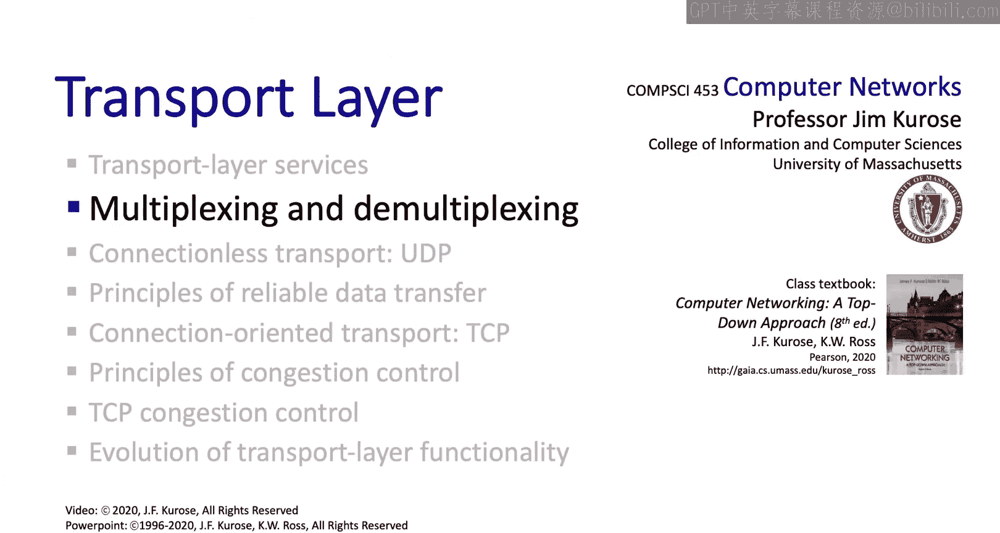

# 3.2：传输层多路复用与多路分解 🚦

在本节课中，我们将要学习传输层中的两个核心概念：多路复用与多路分解。我们将探讨它们如何工作，以及它们在TCP和UDP协议中的具体实现有何不同。

## 概述

多路复用与多路分解是计算机网络协议栈各层都存在的通用过程。在传输层，它们负责将来自不同应用程序的数据流正确地导向目的地。简单来说，多路复用是将多个数据流合并到一个信道中，而多路分解则是将合并的数据流分离并导向正确的接收方。

## 多路分解的基本概念

上一节我们介绍了多路复用与多路分解的基本定义，本节中我们来看看多路分解的具体过程。

想象一台互联网主机，它接收到的数据报携带着发往不同应用程序或不同协议的有效载荷。将这些有效载荷引导至主机内运行的相应应用程序或协议的过程，就是多路分解。多路复用则本质上是其逆过程。

## 日常生活中的类比

为了更好地理解，我们可以从日常生活中找到类比。

以下是几个常见的例子：
*   **高速公路**：多个入口匝道将车辆汇入（多路复用）主干道，而在大型立交桥，车辆又从主干道分流（多路分解）到多个不同的出口匝道。
*   **机场值机**：乘客根据舱位等级（商务舱、经济舱）或安检类型（TSA预检、普通通道）被分流到不同的队列，这种根据特定属性被引导至不同服务通道的过程，正是多路分解的核心。

## 互联网环境下的多路复用与分解

现在，让我们将视角转回互联网环境，具体看看这个过程是如何实现的。

以下是传输层处理多路复用与分解的基本设置：
*   在发送端主机，进程P1和P2通过各自的套接字向下发送数据。
*   传输层必须对来自P1和P2的数据进行多路复用，将其放入报文段，并在传输层头部添加用于后续多路分解的信息。
*   当数据报到达接收端主机时，传输层执行相反的多路分解操作，利用头部信息将接收到的报文段内容递送到正确的套接字。

## UDP的多路分解

为了理解UDP这种无连接协议如何进行多路分解，我们需要回顾一下套接字编程的知识。

在创建套接字时，应用程序员必须指定一个本地端口号。例如，在代码 `DatagramSocket mySocket = new DatagramSocket(12534);` 中，`12534` 就是指定的本地端口号。

当创建一个要发送的数据报时，必须指定目的地的IP地址和目的端口号。在接收端，主机检查UDP报文段中的目的端口号，并将该报文段导向与该端口号关联的套接字。这就是UDP的多路分解操作。

需要注意的是，在UDP中，即使来自不同源IP地址和源端口号的多个客户端向同一个目的端口号发送数据报，它们也都会被导向接收主机的同一个套接字，因为UDP的多路分解仅基于目的端口号进行。

### UDP多路分解示例

让我们通过一个具体例子来加深理解。假设有三个主机，进程P3（端口9157）、进程P4（端口5775）和进程P1（端口6428）相互通信。

以下是通信过程中数据报的端口号变化：
*   **P1发送给P3**：源端口号为6428（P1的端口），目的端口号为9157（P3的端口）。
*   **P3回复P1**：源端口号为9157（P3的端口），目的端口号为6428（P1的端口，取自接收到的数据报的源端口号）。

## TCP的多路分解

上一节我们了解了UDP相对简单的多路分解机制，本节中我们来看看TCP，它的决策过程更为复杂。

TCP是面向连接的，这意味着我们需要标识发送方和接收方。这不仅仅基于IP地址，还基于发送端口号和接收端口号。因此，一个TCP套接字由一个四元组来标识：**（源IP地址，源端口号，目的IP地址，目的端口号）**。

在进行多路分解时，接收方将使用这个四元组中的所有四个值，将报文段导向正确的套接字。一个服务器可以同时拥有许多TCP套接字，每个套接字由其唯一的四元组标识，并关联一个不同的客户端连接。

### TCP多路分解示例

考虑一个Apache HTTP服务器（IP地址B，端口80）同时与两个客户端（主机A-IP地址A，主机C-IP地址C）通信。

以下是发往服务器的三个TCP报文段：
1.  来自主机A，进程P3（端口9157）：`(源IP: A, 源端口: 9157, 目的IP: B, 目的端口: 80)`
2.  来自主机C，进程X（端口9157）：`(源IP: C, 源端口: 9157, 目的IP: B, 目的端口: 80)`
3.  来自主机C，进程Y（端口5775）：`(源IP: C, 源端口: 5775, 目的IP: B, 目的端口: 80)`

虽然这三个报文段的目的端口号都是80，但它们的四元组是唯一的。因此，服务器能够正确地将它们多路分解到不同的服务器端进程（例如P4、P5、P6）进行处理。这与UDP仅基于目的端口号进行分解形成了鲜明对比。

## 总结

本节课中我们一起学习了传输层的多路复用与多路分解。我们了解到，多路分解是决定将报文段有效载荷递送到哪个套接字的过程；而多路复用则是TCP和UDP从多个套接字收集数据，封装成段，并交付给下层网络层的过程。关键区别在于：UDP的多路分解仅基于目的端口号；而TCP则基于源IP、源端口、目的IP、目的端口组成的四元组。最后，我们认识到多路复用与分解是协议栈各层的通用概念，在后续学习网络层和数据链路层时还会再次遇到。