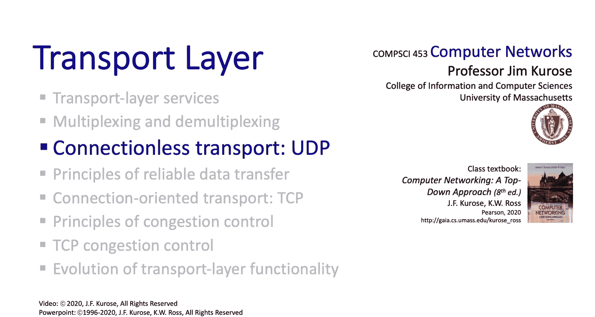

# 3.3：无连接传输协议UDP 📡

在本节课中，我们将学习传输层的另一个核心协议——用户数据报协议（UDP）。我们将了解UDP的简单特性、其数据报格式、工作原理，以及它如何通过校验和提供基本的错误检测功能。

---

上一节我们介绍了传输层的基本概念，本节中我们来看看一个极其简单的传输层协议：UDP。

UDP是一个极其简单、没有多余功能的“骨架”协议。它能如此简单，是因为它只提供**尽力而为**的服务。UDP发送数据段，并希望它们能到达对端。这些数据段可能会丢失，也可能不按顺序到达。因此，UDP本身不需要做太多工作。

由于这种简单的服务，UDP发送方和接收方之间不需要握手，也不需要共享状态。从这个意义上说，UDP被称为**无连接**的。此外，每个UDP数据段都将独立于其他所有到达的数据段进行处理。

鉴于UDP如此简单，人们可能会问：为什么首先要有UDP？实际上，这有很多充分的理由。

以下是UDP的几个关键优势：
*   **无连接建立延迟**：UDP发送方无需等待任何连接建立过程，可以直接发送数据报。
*   **无连接状态**：发送方和接收方之间不维护连接状态，因此协议头相对简单，开销小。
*   **无拥塞控制**：UDP发送方可以按自己期望的速度发送数据。即使网络变得拥塞，UDP也能继续工作，而TCP在这方面会遇到更多麻烦。

UDP的这些特性使其适用于某些特定类型的应用。

以下是UDP的典型应用场景：
*   **流媒体应用**：这类应用能容忍一定程度的数据丢失，但对传输速率敏感，不能施加过强的拥塞控制。
*   **DNS和SNMP**：这些协议需要在网络状况不佳或拥塞时仍能运行。
*   **应用层构建可靠性**：如果需要可靠传输，可以在UDP之上的应用层实现。这正是我们将在本章后面看到的HTTP/3所采用的方法。

UDP在RFC 768中定义。UDP非常简单，其RFC只有大约三页，是了解互联网协议规范的一个很好的起点。

---

接下来，我们来看看UDP发送方和接收方的具体操作。让我们从UDP发送方开始。

当应用层将一个应用层消息传递给UDP时，整个过程就开始了。UDP通过填充一组特定的头部字段值，并将来自上层的消息（例如一个SNMP消息）作为有效载荷放入UDP数据段中，从而形成一个UDP数据段。创建好UDP数据段后，UDP将其传递给IP层。IP层接着将该IP数据报转发给接收方的IP主机。

在接收方，UDP接收器从下层网络层接收一个数据段。它会执行UDP校验和检查，提取出应用层消息，然后将该消息**解复用**到相应的应用层套接字。

---

虽然查看数据包格式（在这里是UDP数据段格式）可能有些枯燥，但这就像吃蔬菜一样，对你有益。仔细思考，每个头部字段背后都蕴含着许多思想和原理。让我们来看看UDP数据段格式。

UDP数据段的结构非常简单。头部只有四个字段。其中两个字段是**源端口号**和**目的端口号**，用于我们刚刚学习的复用和解复用。还有一个**长度字段**，因为应用数据（UDP数据段的有效载荷部分）长度是可变的，UDP需要知道数据段的确切长度。最后一个是**校验和字段**。

---

我们刚刚在UDP头部遇到的一个字段是互联网校验和字段。现在让我们看看这个字段实际包含什么，以及互联网校验和是如何计算的。这里需要仔细听讲，因为当我们学习TCP和IP协议时，这个概念还会再次出现。

UDP校验和的作用是检测发送方和接收方之间传输的数据段中发生的错误，即比特翻转。可以这样理解：假设我想发送给你两个数字。我发送这两个数字，此外我还发送这两个数字的和。你现在收到三个数字，其中任何一个都可能在传输过程中被改变。你将收到的第一个数字和第二个数字相加，然后检查这个和是否等于我发送给你的校验和。如果不同，你就知道有问题。

UDP发送方和接收方以完全类似的方式工作。在发送方，发送方将UDP数据段的内容（包括UDP头部字段以及数据报的源和目的IP地址）视为一系列16位整数，将它们相加，并取和的**反码**（我们稍后会详细看）。计算出的校验和值被放入UDP校验和字段，然后将数据段交给IP层。在接收方，接收方再次计算接收到的数据段（同样包括头部和IP地址）的校验和，并检查计算出的校验和是否等于发送方放置在该字段中的值。如果不相等，则表明有错误。如果相等呢？没有检测到错误，但可能仍然存在未被发现的错误吗？我们稍后再讨论。

---

现在让我们看看互联网校验和是如何实际计算的。假设我们想计算两个16位整数的校验和。实际上，我们会计算更多数据的校验和，但让我们先看一个简单情况。

我们取这里的两个16位整数，将它们相加。从最右边开始：0加1，二进制算术下是1，进位0；1加0是1；1加1是0，进位1；0加0再加进位1是1；0加1是1；1加0是1，依此类推。将16位相加后，我们看到最左边有一个进位1，这会产生**回绕**。我们将这个进位加回到我们得到的16位和中，得到最终的和。最后，为了计算校验和，我们取**反码**（即将0翻转为1，1翻转为0），得到这里显示的互联网校验和。

因此，我们看到互联网校验和的计算相对简单。

---

这里有个问题值得思考：互联网校验和实际上能提供何种程度的比特翻转保护？让我们看一个例子，它能阐明这一点。

假设我们已经计算了之前看到的两个16位整数的校验和。现在想象在传输过程中，第一个数字和第二个数字的某些比特发生了翻转。对于第一个数字，最右边的两个比特“10”翻转为“01”；对于第二个数字，最右边的两个比特“01”翻转为“10”。

你应该能确信，互联网接收方在收到这两个错误的数字后，计算出的校验和将与发送方计算并传输的校验和完全相同。因此，在这种情况下，这些错误**未被检测到**。

我们将在后面学习链路层和安全时看到，实际上有更强大的方法来检测和纠正传输中的比特错误。但这里的要点是：互联网校验和是一种保护形式，但它并非万无一失。

---

让我们通过总结所学内容来结束对UDP的学习。

我们了解到UDP是一个没有多余功能的协议。使用UDP时，数据段可能会丢失，可能会乱序到达，甚至互联网校验和也不能100%保证检测出比特错误。我们也了解到UDP确实有其用武之地。它的价值在于：由于无需握手或建立连接，不会产生RTT延迟；并且因为没有内置的拥塞控制，UDP即使在网络服务受损（例如网络拥塞或过载）时也能运行。我们还看到，UDP可以通过使用校验和来辅助实现可靠性。

如果这种“尽力而为”的无冗余服务还不够，应用程序员可以始终使用TCP，或者，正如我们之前看到的，应用程序员可以在UDP之上的应用层构建额外的功能。例如，HTTP/3正是这样做的，我们很快就会看到。

本节课中我们一起学习了用户数据报协议。我们了解了UDP发送方和接收方的操作，查看了UDP数据段格式，并研究了互联网校验和。在我们继续学习另一个互联网传输协议TCP之前，我们需要仔细研究一下**可靠性**：我们如何在一个不可靠的媒介上提供可靠数据传输的机制？因为这正是TCP必须要做的。这就是我们接下来要学习的内容。