# 3.5：可靠数据传输协议的性能分析 🚀

在本节课中，我们将要学习可靠数据传输协议的性能表现。我们将重点分析“停止-等待”协议的局限性，并探讨两种提升性能的流水线协议：“回退N步”和“选择重传”。理解这些协议如何工作以及它们之间的权衡，是掌握现代网络传输层（如TCP）工作原理的基础。

---

## 协议设计对性能的影响

在本课程中，你已经看到协议设计能对性能产生显著影响的例子。其中一个例子是HTTP 1.0，它每次请求都必须建立一个新的TCP连接。这在HTTP 1.1中得到了改进，允许后续请求复用同一个TCP连接。

在传输层，我们也会看到类似的情况。上一节我们讨论了用于可靠数据传输的“停止-等待”协议的设计。本节中，我们来评估它的性能。

我们将从**利用率**的角度进行评估。利用率是指发送方能够利用其所连接链路带宽的时间比例。对于一个理想协议，利用率应为1。

为了具体说明，我们来看一个1 Gbps的链路，其传播延迟为15毫秒。我们发送8000比特（即1000字节）的数据包。每个数据包的传输延迟为8微秒（即0.008毫秒）。仅从单位上看，传输延迟相对于传播延迟来说极其微小。

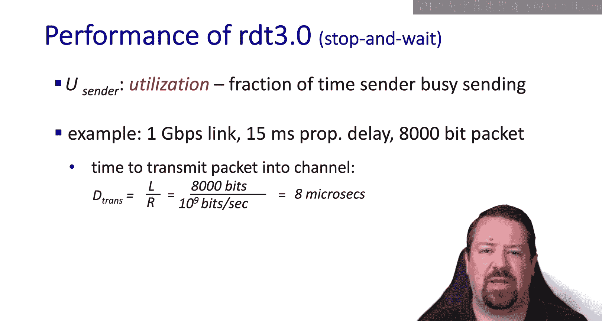

---

## “停止-等待”协议的性能分析

现在，让我们在时间序列图上画出“停止-等待”协议的操作。

我们看到，发送方花费一小段时间传输数据包，然后花费大量时间等待数据包传播到接收方，并等待确认信息传播回发送方。

因此，我们的利用率可以根据往返时间（RTT）和数据包长度（除以速率得到传输延迟）来计算。公式如下：

**利用率 = 传输延迟 / (传输延迟 + 往返时间)**

代入之前的数值，我们得到大约8微秒除以30毫秒。结果是一个极小的利用率。实际上，如果我们使用之前提到的1 Gbps链路，有效利用率只有约33 Kbps。

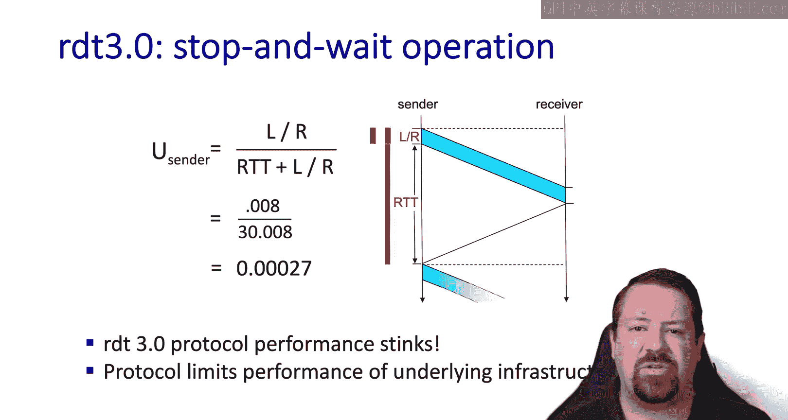

所以，虽然“停止-等待”协议是完全可靠的，但其性能很差。它成为了性能的瓶颈，即使主机拥有配置良好的网络连接。

如果我们可视化一条横跨国家的网络连接，会看到一条很长的“管道”，但里面只有一个数据包。

---

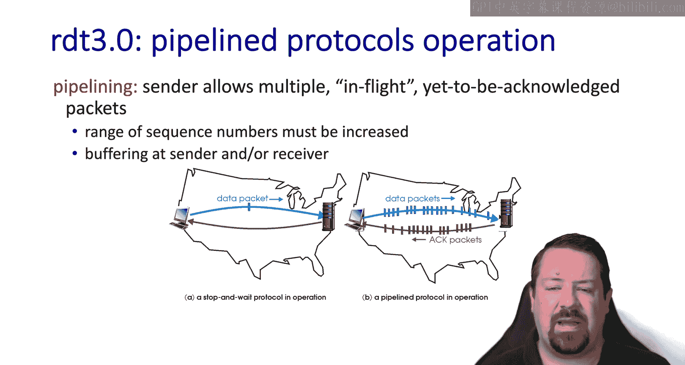

## 流水线技术：提升性能的解决方案

解决性能问题的方案称为**流水线**。这允许协议有多个“在途”数据包，从而在概念上填满管道。

在最佳情况下，发送方能够持续背靠背地发送数据包，直到开始收到来自接收方的确认。

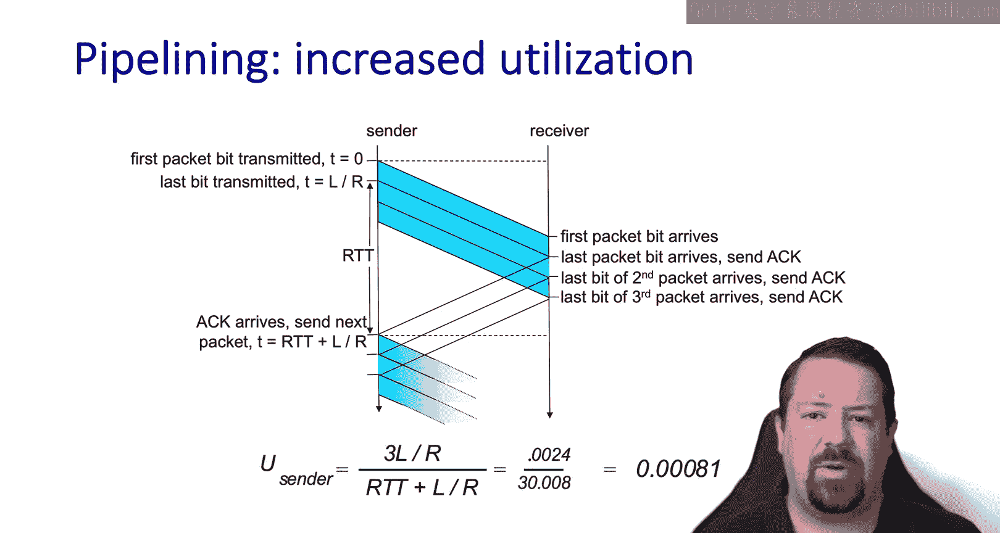

让我们看看在时间序列图上，这种提升的利用率是如何工作的。

现在，发送方能够持续背靠背地发送数据包（本例中窗口大小为3个包）。当这些数据包到达接收方时，接收方开始发回确认。当发送方收到这些确认后，它就能再发送3个数据包。因此，在相同的时间段内，我们能够发送三倍的数据量，这意味着我们的利用率提高了三倍。

---

## 流水线协议的实现方式

流水线增加了可靠数据传输协议的复杂性，有几种不同的实现方式。其中一种称为**回退N步**。

在GBN协议中，发送方允许在收到确认前，最多有N个数据包在途。为了跟踪这些数据包，每个数据包的头部需要一个序列号，我们之前使用的1比特序列号不再够用。因此，我们需要在头部预留一些比特来跟踪序列号。

以下是发送方缓冲区的可视化：
*   **已确认**：一些已被确认的数据包。
*   **发送窗口**：一些已发送但未确认的数据包（在途），以及一些可以发送更多数据包的空位。
*   **未来位置**：一些尚不可用的数据包位置，因为它们超出了当前窗口。

在GBN算法中，使用**累积确认**。ACK确认所有直到该序列号的数据包。当一个ACK到达时，窗口向前移动到N+1的位置。

发送方必须为最旧的“在途”数据包维护一个计时器。如果确认没有到达，数据包可以被重传。如果发生超时，发送方将“回退N步”，即回到其窗口的起始处，并按顺序重新传输所有数据包。

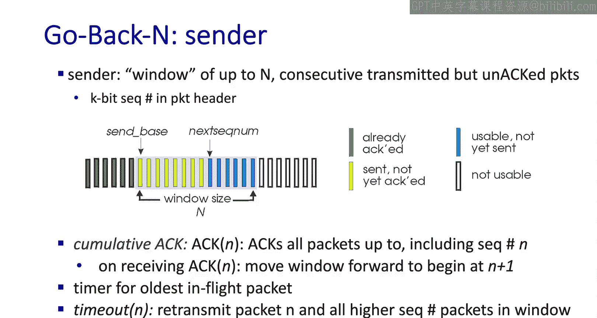

---

## “回退N步”的接收方行为

在接收方一侧，ACK按序发送给接收到的最高序列号。

如果数据包乱序到达，接收方只是持续确认它最后按序接收到的序列号。这些乱序的数据包可能会被丢弃，因为接收方知道，如果较早的数据包超时，发送方将不得不回退并重传它们。

另一方面，数据包可能只是延迟到达导致乱序，因此接收方可以选择缓冲这些乱序的数据包，以防较早的数据包稍后到达。

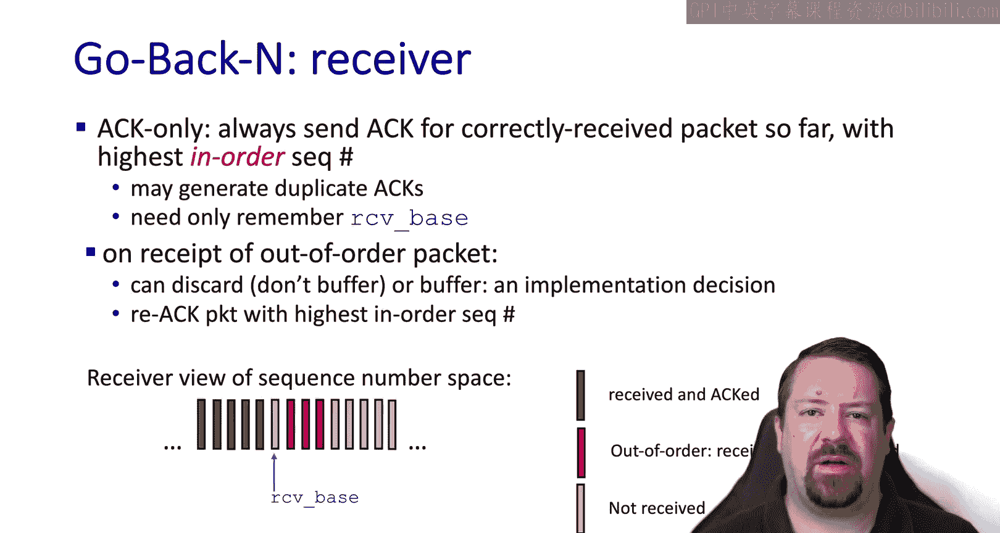

在接收方的缓冲区中，我们会看到**接收基序号**，这是接收方将接受的数据包窗口的起始。低于此序号的序列号已被确认，而高于此序号到达的则是乱序数据包。

---

## “回退N步”协议示例分析

现在，让我们在时间序列图上查看GBN算法。

发送方初始窗口大小为4个数据包，它发送出前4个包（0到3）。但数据包2在途中丢失了。

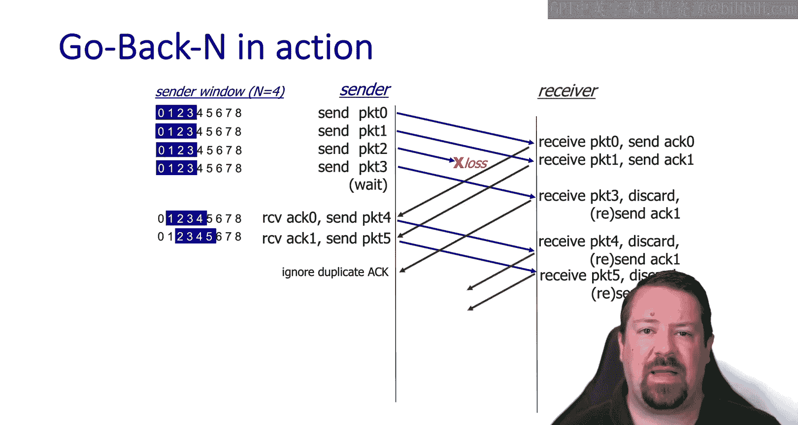

当数据包到达时，接收方发回确认。但请注意，当数据包3到达时，接收方发送了一个针对数据包1的重复ACK，因为它只确认按序到达的数据包。

当发送方收到这些ACK时，它能够移动其窗口并发送更多数据包。这在最初几个ACK到达时发生，但第三个ACK是重复的，因此对窗口没有影响。在接收方一侧，它丢弃这些乱序数据包，并持续发回针对数据包1的重复ACK。

最终，数据包2的ACK超时，发送方重传整个窗口（从数据包2开始）。由于这些数据包按序到达，接收方确认所有数据包。

你可能会注意到这里存在一些低效之处，即重传了接收方已经接收到的数据。这是由于在算法复杂性和带宽效率之间做出的工程权衡。在这些协议被开发时，主机的计算和内存资源远比今天稀缺，因此这些协议被优化为需要尽可能少的指针和计时器。

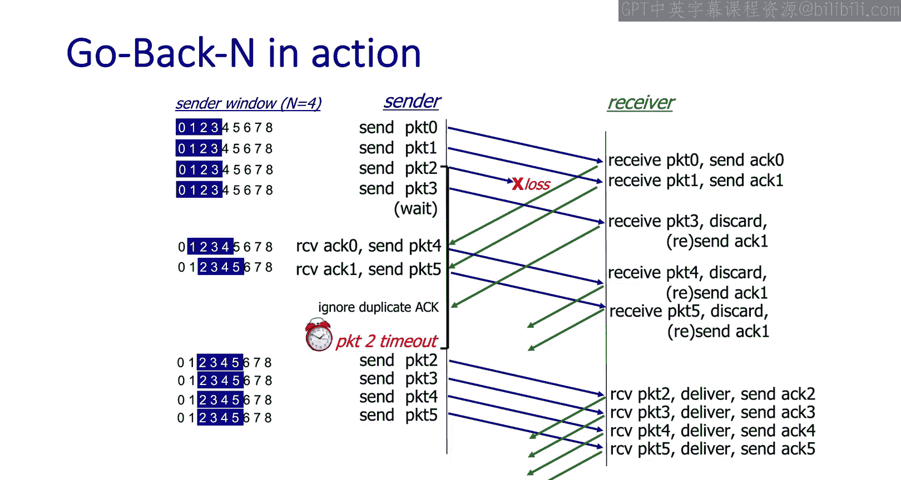

---

## 另一种流水线协议：选择重传

GBN的替代方案称为**选择重传**。

在SR协议中，接收方**单独确认**每个数据包，即使是那些乱序到达的数据包。这要求接收方缓冲这些乱序数据包，直到它能够填补空缺，并按序将所有数据交付给应用程序。

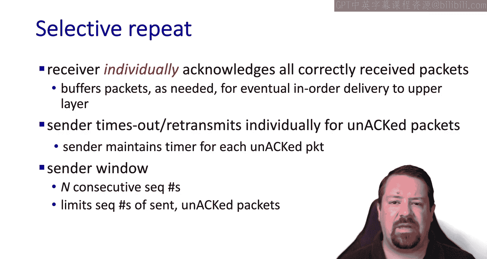

在发送方一侧，与仅为最旧数据包维护一个计时器不同，在SR中，发送方需要为它发送的每个数据包维护一个计时器。和之前一样，发送方维护一个允许“在途”的N个数据包的窗口。

---

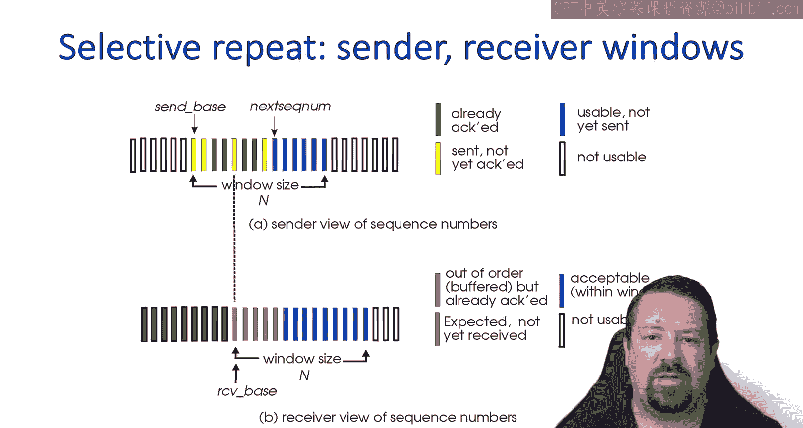

## “选择重传”的缓冲区管理

现在，我们的SR发送缓冲区可能混合着未确认和已确认的数据包。但窗口只有在最旧的数据包被确认后才能向前移动。

同样，在接收方一侧，我们看到已确认的数据包，后面是期望的数据包窗口，其中一些可能已乱序接收。但同样，窗口只有在按序接收到每个数据包后才会向前移动。

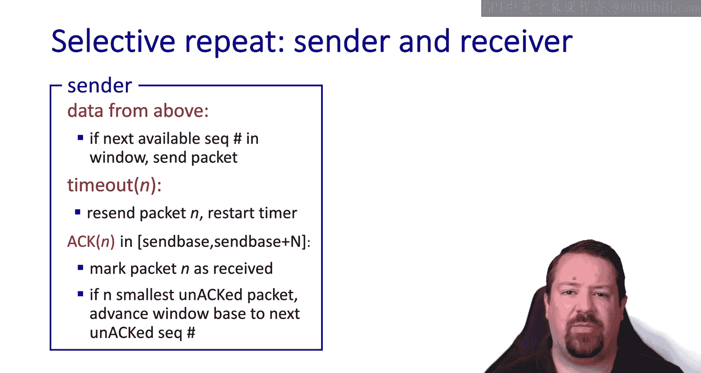

从发送方的角度来看，变化在于增加了多个计时器（每个数据包一个），并且窗口只有在其中最低序列号被确认后才能前进。此时，如果其他数据包已乱序确认，窗口可能需要前进多个位置。

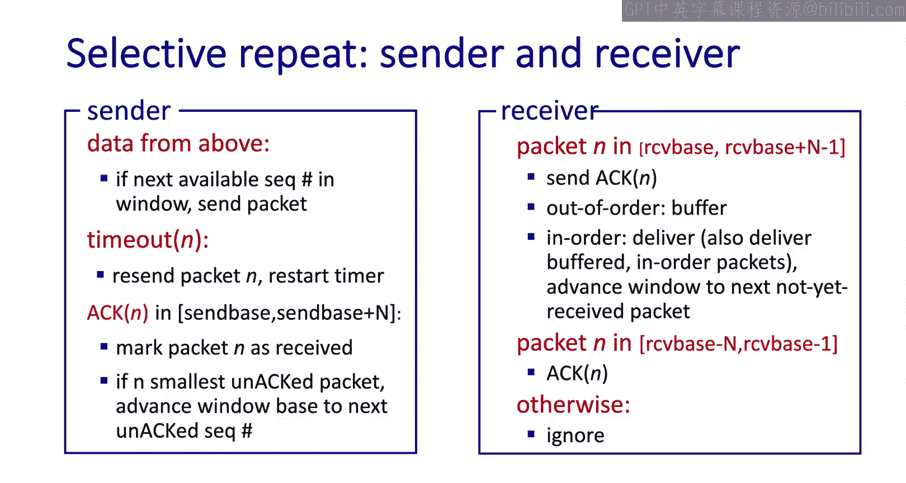

在接收方一侧，我们需要一个乱序数据包缓冲区。每当按序收到一个数据包时，接收方必须检查是否还有其他数据包可以按序交付给应用程序。

---

## “选择重传”协议示例分析

现在让我们在时间序列图上查看SR协议。

和之前一样，窗口大小为N个数据包，发送方首先发送数据包0到3。同样，数据包2丢失，但数据包3到达了。接收方确认数据包3（这次它不发送重复ACK）。

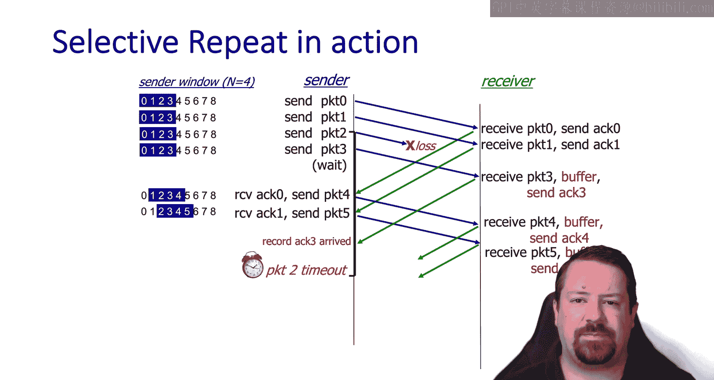

当这些ACK返回到发送方时，它能够移动窗口并发送新数据包。当ACK 3到达时，发送方记录它，但由于仍未收到数据包2的确认，它无法移动窗口。接收方也持续确认乱序数据包。

最终，数据包2的超时到期，发送方重传数据包2。当数据包2到达接收方时，它能够将数据包2到5按序交付给应用程序。当ACK 2返回发送方时，由于它已经记录了乱序的确认，它将能够将窗口向前移动多个位置。

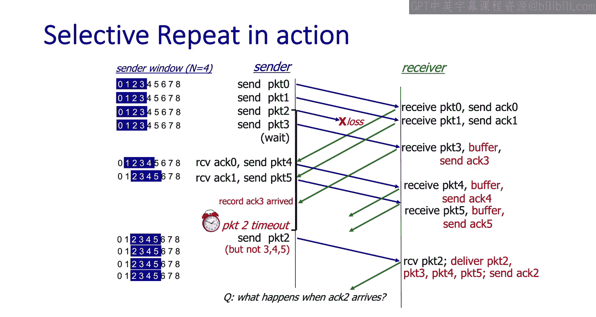

---

## 序列号空间与窗口大小的关系

现在让我们看看可能会遇到的一些问题。

请记住，我们必须在数据包头和确认头中跟踪序列号，因此需要为此目的分配一些比特。我们使用的比特越多，每个数据包的头部开销就越大。

在这个例子中，我们使用一个2比特的序列号，允许我们记录0到3的值。假设我们想使用窗口大小为3。发送方发出前三个数据包并相应地移动窗口。在接收方一侧，随着数据包到达，其窗口也移动。假设数据包3丢失，第二个数据包0乱序到达。到目前为止，一切按预期工作，超时将触发数据包3的重传。

现在让我们看一个不同的丢包模式。在这种情况下，前三个数据包到达，接收方的窗口相应移动。然而，所有三个ACK都丢失了。请注意，在互联网中，丢包经常是突发性的，因此这不是一个不现实的场景。

因此，发送方发生的下一个事件是数据包0的计时器超时。当该数据包被重传时，请注意接收方的窗口位置。它期望一个数据包0，但这是比它已经收到的第一个数据包0更晚的一个。因此，虽然到达的数据包0是重复的，但接收方会将其视为新数据，并将这个重复数据包乱序交付给应用程序。

这是一个主要问题，因为我们的可靠传输协议应该提供的保证之一就是**按序交付**。这展示了我们在上一节中讨论的特性：除了通过控制消息推断外，接收方对发送方的状态是“盲”的。

为了解决这个问题，我们必须建立**窗口大小**和**序列号空间**之间的关系。事实上，我们需要的序列号空间至少是我们想要使用的窗口大小的两倍。

---

## 总结

本节课中，我们一起学习了可靠数据传输协议的性能分析。

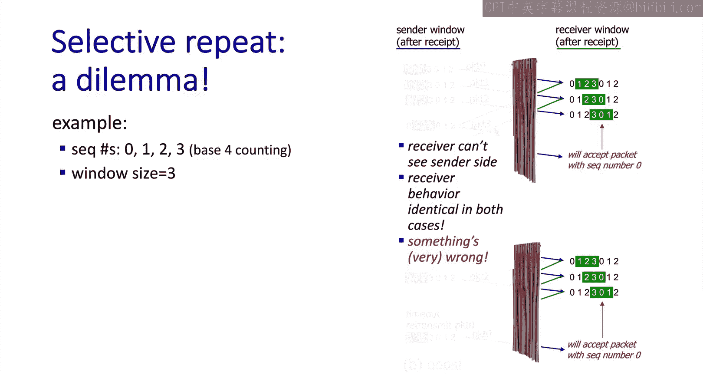

我们首先分析了简单的“停止-等待”协议利用率低下的问题，其根本原因在于长传播延迟下，链路带宽未被充分利用。接着，我们引入了**流水线**技术作为解决方案，它允许多个数据包同时在途，从而显著提高链路利用率。

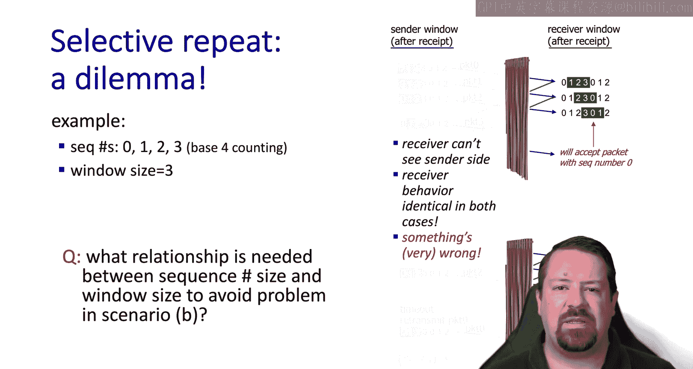

我们深入探讨了两种主要的流水线协议：
1.  **回退N步**：使用累积确认，实现简单，但发生丢包时会重传整个窗口，可能不够高效。
2.  **选择重传**：接收方单独确认每个数据包，发送方仅重传丢失的包，效率更高，但需要更复杂的缓冲区管理和更多的计时器。

最后，我们认识到，为了实现正确的按序交付，协议的**窗口大小不能超过序列号空间的一半**，这是设计可靠协议时必须遵守的关键约束。

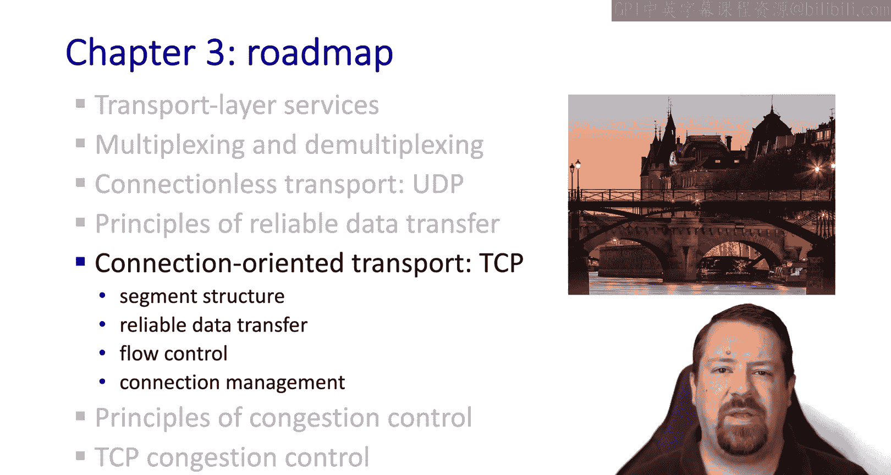

这些原理是创建TCP协议的基础，TCP将是我们下一节视频的主题。